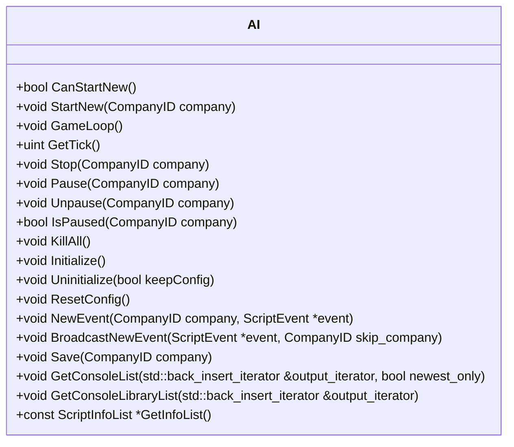

# AI Overview

AI refers to the artificial intelligence system that controls non-player companies in the game. The AI system is responsible for starting, stopping, saving, and loading AI companies. It includes functions to manage the game loop, handle events, and control the behavior of AI companies.

<SwmSnippet path="/src/ai/ai.hpp" line="16">

---

# AI Class Overview

The AI class contains all the necessary functions to manage AI companies in the game. It provides methods to initialize and uninitialize the AI system, ensuring that AI configurations are properly managed.

```c++
/**
 * Main AI class. Contains all functions needed to start, stop, save and load AIs.
 */
```

---

</SwmSnippet>

The AI system can also pause and resume AI companies, allowing for dynamic control over their activity during the game. Additionally, the AI system can broadcast events to all active <SwmToken path="src/ai/ai.hpp" pos="17:32:32" line-data=" * Main AI class. Contains all functions needed to start, stop, save and load AIs.">`AIs`</SwmToken> and manage the lifecycle of AI companies, including killing all <SwmToken path="src/ai/ai.hpp" pos="17:32:32" line-data=" * Main AI class. Contains all functions needed to start, stop, save and load AIs.">`AIs`</SwmToken> when necessary.

# Main Functions

There are several main functions in the AI class. Some of them are <SwmToken path="src/ai/ai_core.cpp" pos="30:10:10" line-data="/* static */ bool AI::CanStartNew()">`CanStartNew`</SwmToken>, <SwmToken path="src/ai/ai_core.cpp" pos="74:10:10" line-data="/* static */ void AI::GameLoop()">`GameLoop`</SwmToken>, <SwmToken path="src/ai/ai_core.cpp" pos="155:10:10" line-data="/* static */ void AI::KillAll()">`KillAll`</SwmToken>, <SwmToken path="src/ai/ai_core.cpp" pos="165:10:10" line-data="/* static */ void AI::Initialize()">`Initialize`</SwmToken>, <SwmToken path="src/ai/ai_core.cpp" pos="206:10:10" line-data="/* static */ void AI::ResetConfig()">`ResetConfig`</SwmToken>, <SwmToken path="src/ai/ai_core.cpp" pos="243:10:10" line-data="/* static */ void AI::NewEvent(CompanyID company, ScriptEvent *event)">`NewEvent`</SwmToken>, and <SwmToken path="src/ai/ai_core.cpp" pos="335:10:10" line-data="/* static */ void AI::Rescan()">`Rescan`</SwmToken>. Below, we will dive into some of these functions.

<SwmSnippet path="/src/ai/ai_core.cpp" line="30">

---

## <SwmToken path="src/ai/ai_core.cpp" pos="30:10:10" line-data="/* static */ bool AI::CanStartNew()">`CanStartNew`</SwmToken>

The <SwmToken path="src/ai/ai_core.cpp" pos="30:10:10" line-data="/* static */ bool AI::CanStartNew()">`CanStartNew`</SwmToken> function checks if a new AI company can be started. It ensures that new <SwmToken path="src/ai/ai_core.cpp" pos="32:9:9" line-data="	/* Only allow new AIs on the server and only when that is allowed in multiplayer */">`AIs`</SwmToken> are only allowed on the server and only when permitted in multiplayer settings.

```c++
/* static */ bool AI::CanStartNew()
{
	/* Only allow new AIs on the server and only when that is allowed in multiplayer */
	return !_networking || (_network_server && _settings_game.ai.ai_in_multiplayer);
}
```

---

</SwmSnippet>

<SwmSnippet path="/src/ai/ai_core.cpp" line="74">

---

## <SwmToken path="src/ai/ai_core.cpp" pos="74:10:10" line-data="/* static */ void AI::GameLoop()">`GameLoop`</SwmToken>

The <SwmToken path="src/ai/ai_core.cpp" pos="74:10:10" line-data="/* static */ void AI::GameLoop()">`GameLoop`</SwmToken> function is called every game tick to allow <SwmToken path="src/ai/ai_core.cpp" pos="79:11:11" line-data="	/* The speed with which AIs go, is limited by the &#39;competitor_speed&#39; */">`AIs`</SwmToken> to perform actions. It increments the frame counter, iterates over all companies, and calls the <SwmToken path="src/ai/ai_core.cpp" pos="74:10:10" line-data="/* static */ void AI::GameLoop()">`GameLoop`</SwmToken> method of each AI instance. It also occasionally collects garbage to manage memory usage.

```c++
/* static */ void AI::GameLoop()
{
	/* If we are in networking, only servers run this function, and that only if it is allowed */
	if (_networking && (!_network_server || !_settings_game.ai.ai_in_multiplayer)) return;

	/* The speed with which AIs go, is limited by the 'competitor_speed' */
	AI::frame_counter++;
	assert(_settings_game.difficulty.competitor_speed <= 4);
	if ((AI::frame_counter & ((1 << (4 - _settings_game.difficulty.competitor_speed)) - 1)) != 0) return;

	Backup<CompanyID> cur_company(_current_company);
	for (const Company *c : Company::Iterate()) {
		if (c->is_ai) {
			PerformanceMeasurer framerate((PerformanceElement)(PFE_AI0 + c->index));
			cur_company.Change(c->index);
			c->ai_instance->GameLoop();
			/* Occasionally collect garbage; every 255 ticks do one company.
			 * Effectively collecting garbage once every two months per AI. */
			if ((AI::frame_counter & 255) == 0 && (CompanyID)GB(AI::frame_counter, 8, 4) == c->index) {
				c->ai_instance->CollectGarbage();
			}
```

---

</SwmSnippet>

<SwmSnippet path="/src/ai/ai_core.cpp" line="155">

---

## <SwmToken path="src/ai/ai_core.cpp" pos="155:10:10" line-data="/* static */ void AI::KillAll()">`KillAll`</SwmToken>

The <SwmToken path="src/ai/ai_core.cpp" pos="155:10:10" line-data="/* static */ void AI::KillAll()">`KillAll`</SwmToken> function stops all AI companies. It iterates over all companies and calls the <SwmToken path="src/ai/ai_core.cpp" pos="161:11:11" line-data="		if (c-&gt;is_ai) AI::Stop(c-&gt;index);">`Stop`</SwmToken> method for each AI company.

```c++
/* static */ void AI::KillAll()
{
	/* It might happen there are no companies .. than we have nothing to loop */
	if (Company::GetPoolSize() == 0) return;

	for (const Company *c : Company::Iterate()) {
		if (c->is_ai) AI::Stop(c->index);
	}
}
```

---

</SwmSnippet>

<SwmSnippet path="/src/ai/ai_core.cpp" line="165">

---

## Initialize

The <SwmToken path="src/ai/ai_core.cpp" pos="165:10:10" line-data="/* static */ void AI::Initialize()">`Initialize`</SwmToken> function sets up the AI system. It resets the frame counter, scans for available <SwmToken path="src/ai/ai.hpp" pos="17:32:32" line-data=" * Main AI class. Contains all functions needed to start, stop, save and load AIs.">`AIs`</SwmToken>, and initializes the scanner info and library.

```c++
/* static */ void AI::Initialize()
{
	if (AI::scanner_info != nullptr) AI::Uninitialize(true);

	AI::frame_counter = 0;
	if (AI::scanner_info == nullptr) {
		TarScanner::DoScan(TarScanner::AI);
		AI::scanner_info = new AIScannerInfo();
		AI::scanner_info->Initialize();
		AI::scanner_library = new AIScannerLibrary();
		AI::scanner_library->Initialize();
	}
}
```

---

</SwmSnippet>

<SwmSnippet path="/src/ai/ai_core.cpp" line="206">

---

## <SwmToken path="src/ai/ai_core.cpp" pos="206:10:10" line-data="/* static */ void AI::ResetConfig()">`ResetConfig`</SwmToken>

The <SwmToken path="src/ai/ai_core.cpp" pos="206:10:10" line-data="/* static */ void AI::ResetConfig()">`ResetConfig`</SwmToken> function reloads the AI configurations. It checks if the AI scripts are still available and updates or removes them as necessary.

```c++
/* static */ void AI::ResetConfig()
{
	/* Check for both newgame as current game if we can reload the AIInfo inside
	 *  the AIConfig. If not, remove the AI from the list (which will assign
	 *  a random new AI on reload). */
	for (CompanyID c = COMPANY_FIRST; c < MAX_COMPANIES; c++) {
		if (_settings_game.ai_config[c] != nullptr && _settings_game.ai_config[c]->HasScript()) {
			if (!_settings_game.ai_config[c]->ResetInfo(true)) {
				Debug(script, 0, "After a reload, the AI by the name '{}' was no longer found, and removed from the list.", _settings_game.ai_config[c]->GetName());
				_settings_game.ai_config[c]->Change(std::nullopt);
			}
		}

		if (_settings_newgame.ai_config[c] != nullptr && _settings_newgame.ai_config[c]->HasScript()) {
			if (!_settings_newgame.ai_config[c]->ResetInfo(false)) {
				Debug(script, 0, "After a reload, the AI by the name '{}' was no longer found, and removed from the list.", _settings_newgame.ai_config[c]->GetName());
				_settings_newgame.ai_config[c]->Change(std::nullopt);
			}
		}

		if (Company::IsValidAiID(c) && Company::Get(c)->ai_config != nullptr) {
```

---

</SwmSnippet>

<SwmSnippet path="/src/ai/ai_core.cpp" line="243">

---

## <SwmToken path="src/ai/ai_core.cpp" pos="243:10:10" line-data="/* static */ void AI::NewEvent(CompanyID company, ScriptEvent *event)">`NewEvent`</SwmToken>

The <SwmToken path="src/ai/ai_core.cpp" pos="243:10:10" line-data="/* static */ void AI::NewEvent(CompanyID company, ScriptEvent *event)">`NewEvent`</SwmToken> function handles new events for AI companies. It adds the event to the event queue of the specified AI company.

```c++
/* static */ void AI::NewEvent(CompanyID company, ScriptEvent *event)
{
	/* AddRef() and Release() need to be called at least once, so do it here */
	event->AddRef();

	/* Clients should ignore events */
	if (_networking && !_network_server) {
		event->Release();
		return;
	}

	/* Only AIs can have an event-queue */
	if (!Company::IsValidAiID(company)) {
		event->Release();
		return;
	}

	/* Queue the event */
	Backup<CompanyID> cur_company(_current_company, company);
	Company::Get(_current_company)->ai_instance->InsertEvent(event);
	cur_company.Restore();
```

---

</SwmSnippet>

<SwmSnippet path="/src/ai/ai_core.cpp" line="335">

---

## Rescan

The <SwmToken path="src/ai/ai_core.cpp" pos="335:10:10" line-data="/* static */ void AI::Rescan()">`Rescan`</SwmToken> function rescans the directories for AI scripts and updates the AI configurations. It invalidates the window data to reflect the changes.

```c++
/* static */ void AI::Rescan()
{
	TarScanner::DoScan(TarScanner::AI);

	AI::scanner_info->RescanDir();
	AI::scanner_library->RescanDir();
	ResetConfig();

	InvalidateWindowData(WC_SCRIPT_LIST, 0, 1);
	SetWindowClassesDirty(WC_SCRIPT_DEBUG);
	InvalidateWindowClassesData(WC_SCRIPT_SETTINGS);
}
```

---

</SwmSnippet>

&nbsp;

*This is an auto-generated document by Swimm AI 🌊 and has not yet been verified by a human*

<SwmMeta version="3.0.0" repo-id="Z2l0aHViJTNBJTNBT3BlblRURC1jb3BpbG90LWRlbW8lM0ElM0Fzd2ltbWlv" repo-name="OpenTTD-copilot-demo"><sup>Powered by [Swimm](/)</sup></SwmMeta>
