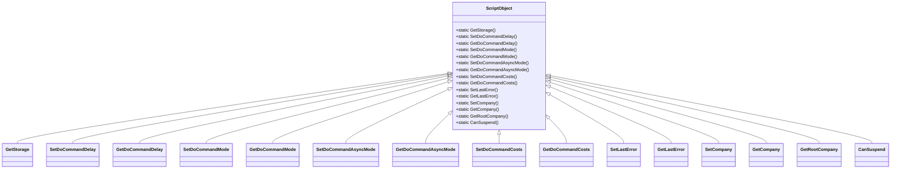

# Object Management Overview

Object Management refers to the handling and manipulation of various objects within the API. It involves managing the lifecycle of objects, including their creation, modification, and deletion. This ensures that commands are executed correctly and that their results are stored and retrieved as needed.

# ScriptObject Class

The `ScriptObject` class plays a central role in Object Management by providing static methods to interact with the storage associated with the current `ScriptInstance`. These methods include setting and getting various command-related properties, such as delays, modes, costs, errors, and company information.

# GetStorage Method

The `GetStorage` method retrieves the storage for the active script instance, which is essential for accessing and modifying the state of the script.

# Setting and Getting Properties

Methods like `SetDoCommandDelay`, `GetDoCommandDelay`, `SetDoCommandMode`, and `GetDoCommandMode` are used to set and get various command-related properties.

# Handling Asynchronous Operations

Methods like `SetDoCommandAsyncMode` and `GetDoCommandAsyncMode` handle asynchronous operations.

# Managing Command Costs and Errors

Methods like `SetDoCommandCosts`, `GetDoCommandCosts`, `SetLastError`, and `GetLastError` manage command costs and errors.

# Managing Company Information

Methods like `SetCompany`, `GetCompany`, and `GetRootCompany` manage company information.

# Suspending Scripts

The `CanSuspend` method checks if the script can be suspended, which is necessary to simulate multiplayer interactions.

&nbsp;

*This is an auto-generated document by Swimm AI 🌊 and has not yet been verified by a human*

<SwmMeta version="3.0.0" repo-id="Z2l0aHViJTNBJTNBT3BlblRURC1jb3BpbG90LWRlbW8lM0ElM0Fzd2ltbWlv" repo-name="OpenTTD-copilot-demo">Powered by [Swimm](/)</SwmMeta>
