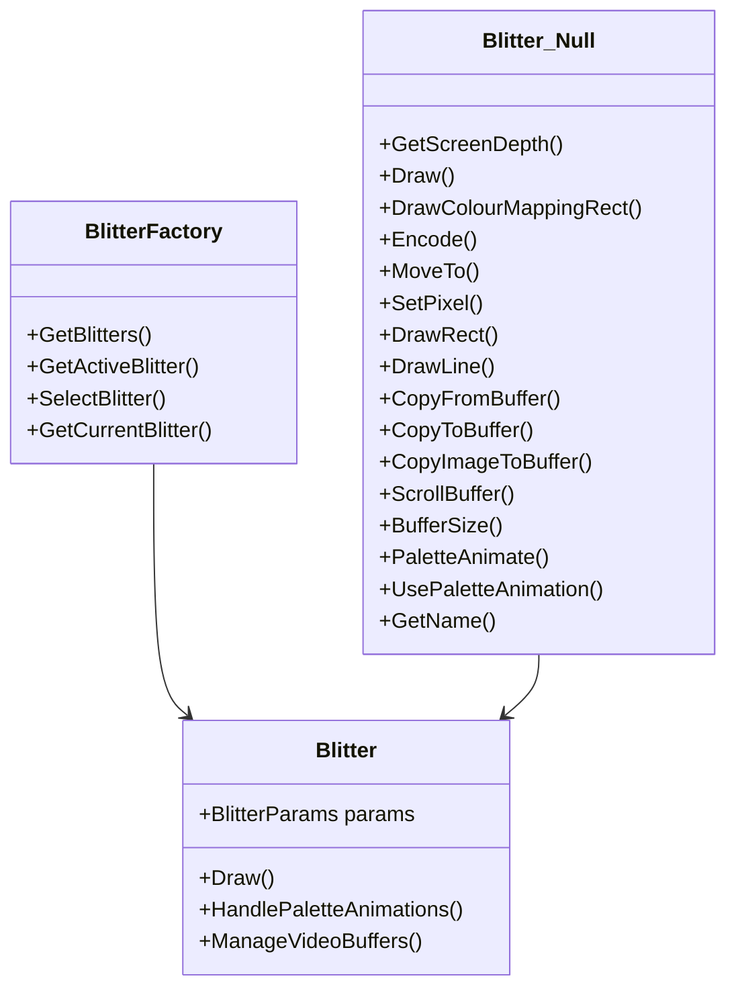

# Blitter Overview

Blitter is a component responsible for handling the drawing operations in the game. It manages how sprites and other graphical elements are rendered on the screen.

# Types of Blitters

Different types of blitters are available, each optimized for specific tasks or hardware capabilities. For example, the <SwmToken path="src/blitter/factory.hpp" pos="119:12:14" line-data="		const std::string_view default_blitter = &quot;32bpp-anim&quot;;">`32bpp-anim`</SwmToken> blitter supports 32-bit color depth with animation capabilities.

<SwmSnippet path="/src/blitter/null.hpp" line="16">

---

# <SwmToken path="src/blitter/null.hpp" pos="16:2:2" line-data="class Blitter_Null : public Blitter {">`Blitter_Null`</SwmToken> Class

The <SwmToken path="src/blitter/null.hpp" pos="16:2:2" line-data="class Blitter_Null : public Blitter {">`Blitter_Null`</SwmToken> class is a special type of blitter that performs no drawing operations. It is used as a placeholder or default blitter when no other blitter is selected.

```c++
class Blitter_Null : public Blitter {
public:
	uint8_t GetScreenDepth() override { return 0; }
	void Draw(Blitter::BlitterParams *, BlitterMode, ZoomLevel) override {};
	void DrawColourMappingRect(void *, int, int, PaletteID) override {};
	Sprite *Encode(const SpriteLoader::SpriteCollection &sprite, SpriteAllocator &allocator) override;
	void *MoveTo(void *, int, int) override { return nullptr; };
	void SetPixel(void *, int, int, uint8_t) override {};
	void DrawRect(void *, int, int, uint8_t) override {};
	void DrawLine(void *, int, int, int, int, int, int, uint8_t, int, int) override {};
	void CopyFromBuffer(void *, const void *, int, int) override {};
	void CopyToBuffer(const void *, void *, int, int) override {};
	void CopyImageToBuffer(const void *, void *, int, int, int) override {};
	void ScrollBuffer(void *, int &, int &, int &, int &, int, int) override {};
	size_t BufferSize(uint, uint) override { return 0; };
	void PaletteAnimate(const Palette &) override { };
	Blitter::PaletteAnimation UsePaletteAnimation() override { return Blitter::PALETTE_ANIMATION_NONE; };

	std::string_view GetName() override { return "null"; }
};
```

---

</SwmSnippet>

# <SwmToken path="src/blitter/factory.hpp" pos="58:1:1" line-data="	BlitterFactory(const char *name, const char *description, bool usable = true) :">`BlitterFactory`</SwmToken> Class

Blitters are managed by the <SwmToken path="src/blitter/factory.hpp" pos="58:1:1" line-data="	BlitterFactory(const char *name, const char *description, bool usable = true) :">`BlitterFactory`</SwmToken> class, which keeps track of all available blitters and allows for selecting and switching between them.

<SwmSnippet path="/src/blitter/factory.hpp" line="49">

---

The <SwmToken path="src/blitter/factory.hpp" pos="58:1:1" line-data="	BlitterFactory(const char *name, const char *description, bool usable = true) :">`BlitterFactory`</SwmToken> class is responsible for constructing and registering blitters. It ensures that only usable blitters are registered and keeps track of them.

```c++
	/**
	 * Construct the blitter, and register it.
	 * @param name        The name of the blitter.
	 * @param description A longer description for the blitter.
	 * @param usable      Whether the blitter is usable (on the current computer). For example for disabling SSE blitters when the CPU can't handle them.
	 * @pre name != nullptr.
	 * @pre description != nullptr.
	 * @pre There is no blitter registered with this name.
	 */
	BlitterFactory(const char *name, const char *description, bool usable = true) :
			name(name), description(description)
	{
		if (usable) {
			Blitters &blitters = GetBlitters();
			assert(blitters.find(this->name) == blitters.end());
			/*
			 * Only add when the blitter is usable. Do not bail out or
			 * do more special things since the blitters are always
			 * instantiated upon start anyhow and freed upon shutdown.
			 */
			blitters.insert(Blitters::value_type(this->name, this));
```

---

</SwmSnippet>

# Main Functions

There are several main functions in this folder. Some of them are <SwmToken path="src/blitter/factory.hpp" pos="32:6:6" line-data="	static Blitters &amp;GetBlitters()">`GetBlitters`</SwmToken>, <SwmToken path="src/blitter/factory.hpp" pos="42:6:6" line-data="	static Blitter **GetActiveBlitter()">`GetActiveBlitter`</SwmToken>, <SwmToken path="src/blitter/factory.hpp" pos="96:6:6" line-data="	static Blitter *SelectBlitter(const std::string_view name)">`SelectBlitter`</SwmToken>, and <SwmToken path="src/blitter/factory.hpp" pos="94:14:14" line-data="	 * @post Sets the blitter so GetCurrentBlitter() returns it too.">`GetCurrentBlitter`</SwmToken>.

<SwmSnippet path="/src/blitter/factory.hpp" line="28">

---

## <SwmToken path="src/blitter/factory.hpp" pos="32:6:6" line-data="	static Blitters &amp;GetBlitters()">`GetBlitters`</SwmToken>

The <SwmToken path="src/blitter/factory.hpp" pos="32:6:6" line-data="	static Blitters &amp;GetBlitters()">`GetBlitters`</SwmToken> function returns a map of currently known blitters. This map is used to keep track of all available blitters and is essential for managing and selecting blitters.

```c++
	/**
	 * Get the map with currently known blitters.
	 * @return The known blitters.
	 */
	static Blitters &GetBlitters()
	{
		static Blitters &s_blitters = *new Blitters();
		return s_blitters;
	}
```

---

</SwmSnippet>

<SwmSnippet path="/src/blitter/factory.hpp" line="38">

---

## <SwmToken path="src/blitter/factory.hpp" pos="42:6:6" line-data="	static Blitter **GetActiveBlitter()">`GetActiveBlitter`</SwmToken>

The <SwmToken path="src/blitter/factory.hpp" pos="42:6:6" line-data="	static Blitter **GetActiveBlitter()">`GetActiveBlitter`</SwmToken> function returns a pointer to the currently active blitter. This function is crucial for determining which blitter is currently being used for drawing operations.

```c++
	/**
	 * Get the currently active blitter.
	 * @return The currently active blitter.
	 */
	static Blitter **GetActiveBlitter()
	{
		static Blitter *s_blitter = nullptr;
		return &s_blitter;
	}
```

---

</SwmSnippet>

<SwmSnippet path="/src/blitter/factory.hpp" line="91">

---

## <SwmToken path="src/blitter/factory.hpp" pos="96:6:6" line-data="	static Blitter *SelectBlitter(const std::string_view name)">`SelectBlitter`</SwmToken>

The <SwmToken path="src/blitter/factory.hpp" pos="96:6:6" line-data="	static Blitter *SelectBlitter(const std::string_view name)">`SelectBlitter`</SwmToken> function finds the requested blitter by name and sets it as the active blitter. This function is used to switch between different blitters based on the requirements of the drawing operations.

```c++
	/**
	 * Find the requested blitter and return its class.
	 * @param name the blitter to select.
	 * @post Sets the blitter so GetCurrentBlitter() returns it too.
	 */
	static Blitter *SelectBlitter(const std::string_view name)
	{
		BlitterFactory *b = GetBlitterFactory(name);
		if (b == nullptr) return nullptr;

		Blitter *newb = b->CreateInstance();
		delete *GetActiveBlitter();
		*GetActiveBlitter() = newb;

		Debug(driver, 1, "Successfully {} blitter '{}'", name.empty() ? "probed" : "loaded", newb->GetName());
		return newb;
	}
```

---

</SwmSnippet>

<SwmSnippet path="/src/blitter/factory.hpp" line="135">

---

## <SwmToken path="src/blitter/factory.hpp" pos="138:6:6" line-data="	static Blitter *GetCurrentBlitter()">`GetCurrentBlitter`</SwmToken>

The <SwmToken path="src/blitter/factory.hpp" pos="138:6:6" line-data="	static Blitter *GetCurrentBlitter()">`GetCurrentBlitter`</SwmToken> function returns the currently active blitter. This function is used to retrieve the blitter that is currently set for drawing operations.

```c++
	/**
	 * Get the current active blitter (always set by calling SelectBlitter).
	 */
	static Blitter *GetCurrentBlitter()
	{
		return *GetActiveBlitter();
	}
```

---

</SwmSnippet>

<SwmSnippet path="/src/blitter/base.hpp" line="26">

---

# Blitter Class

The <SwmToken path="src/blitter/base.hpp" pos="29:2:2" line-data="class Blitter : public SpriteEncoder {">`Blitter`</SwmToken> class defines the structure and functions that all blitters should implement. It includes methods for drawing images, handling palette animations, and managing video buffers.

```c++
/**
 * How all blitters should look like. Extend this class to make your own.
 */
class Blitter : public SpriteEncoder {
public:
	/** Parameters related to blitting. */
	struct BlitterParams {
		const void *sprite; ///< Pointer to the sprite how ever the encoder stored it
		const uint8_t *remap;  ///< XXX -- Temporary storage for remap array

		int skip_left;      ///< How much pixels of the source to skip on the left (based on zoom of dst)
		int skip_top;       ///< How much pixels of the source to skip on the top (based on zoom of dst)
		int width;          ///< The width in pixels that needs to be drawn to dst
		int height;         ///< The height in pixels that needs to be drawn to dst
		int sprite_width;   ///< Real width of the sprite
		int sprite_height;  ///< Real height of the sprite
		int left;           ///< The left offset in the 'dst' in pixels to start drawing
		int top;            ///< The top offset in the 'dst' in pixels to start drawing

		void *dst;          ///< Destination buffer
		int pitch;          ///< The pitch of the destination buffer
```

---

</SwmSnippet>

&nbsp;

*This is an auto-generated document by Swimm AI 🌊 and has not yet been verified by a human*

<SwmMeta version="3.0.0" repo-id="Z2l0aHViJTNBJTNBT3BlblRURC1jb3BpbG90LWRlbW8lM0ElM0Fzd2ltbWlv" repo-name="OpenTTD-copilot-demo"><sup>Powered by [Swimm](/)</sup></SwmMeta>
