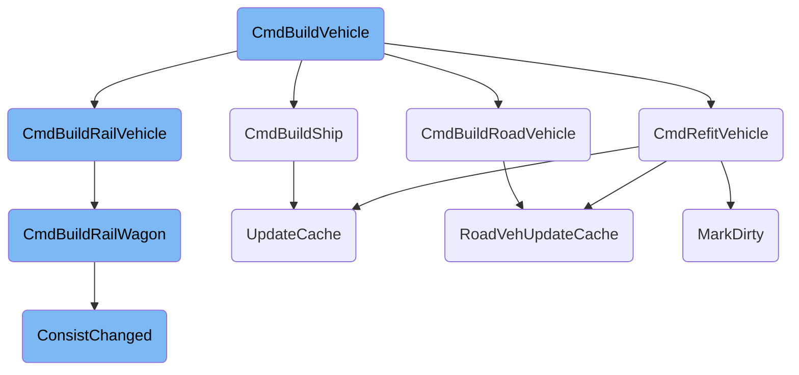

This document explains the process of building vehicles in the game. The main function responsible for this is <SwmToken path="src/vehicle_cmd.cpp" pos="87:19:19" line-data="std::tuple&lt;CommandCost, VehicleID, uint, uint16_t, CargoArray&gt; CmdBuildVehicle(DoCommandFlag flags, TileIndex tile, EngineID eid, bool use_free_vehicles, CargoID cargo, ClientID client_id)">`CmdBuildVehicle`</SwmToken>, which handles the construction of various vehicle types such as trains, road vehicles, ships, and aircraft. The function ensures the validity of the location, engine type, and cargo type before delegating the construction to specific functions for each vehicle type.

The process starts with the <SwmToken path="src/vehicle_cmd.cpp" pos="87:19:19" line-data="std::tuple&lt;CommandCost, VehicleID, uint, uint16_t, CargoArray&gt; CmdBuildVehicle(DoCommandFlag flags, TileIndex tile, EngineID eid, bool use_free_vehicles, CargoID cargo, ClientID client_id)">`CmdBuildVehicle`</SwmToken> function, which checks if the location, engine type, and cargo type are valid. If everything is valid, it then calls specific functions to build the vehicle based on its type. For example, if it's a road vehicle, it calls <SwmToken path="src/roadveh_cmd.cpp" pos="261:2:2" line-data="CommandCost CmdBuildRoadVehicle(DoCommandFlag flags, TileIndex tile, const Engine *e, Vehicle **ret)">`CmdBuildRoadVehicle`</SwmToken>, which sets up the vehicle's attributes like direction, position, and cargo capacity. Similarly, for ships, it calls <SwmToken path="src/ship_cmd.cpp" pos="895:2:2" line-data="CommandCost CmdBuildShip(DoCommandFlag flags, TileIndex tile, const Engine *e, Vehicle **ret)">`CmdBuildShip`</SwmToken>, which sets the ship's initial position and other attributes. Each specific function ensures that the vehicle is properly initialized and updates the game's cache to reflect the new vehicle.

# Flow drill down



<SwmSnippet path="/src/vehicle_cmd.cpp" line="87">

---

## Building Vehicles

The <SwmToken path="src/vehicle_cmd.cpp" pos="87:19:19" line-data="std::tuple&lt;CommandCost, VehicleID, uint, uint16_t, CargoArray&gt; CmdBuildVehicle(DoCommandFlag flags, TileIndex tile, EngineID eid, bool use_free_vehicles, CargoID cargo, ClientID client_id)">`CmdBuildVehicle`</SwmToken> function is responsible for constructing various types of vehicles. It performs several checks to ensure the validity of the location, engine type, and cargo type. Depending on the type of vehicle (train, road, ship, or aircraft), it delegates the construction to specific functions like <SwmToken path="src/train_cmd.cpp" pos="750:2:2" line-data="CommandCost CmdBuildRailVehicle(DoCommandFlag flags, TileIndex tile, const Engine *e, Vehicle **ret)">`CmdBuildRailVehicle`</SwmToken>, <SwmToken path="src/roadveh_cmd.cpp" pos="261:2:2" line-data="CommandCost CmdBuildRoadVehicle(DoCommandFlag flags, TileIndex tile, const Engine *e, Vehicle **ret)">`CmdBuildRoadVehicle`</SwmToken>, and <SwmToken path="src/ship_cmd.cpp" pos="895:2:2" line-data="CommandCost CmdBuildShip(DoCommandFlag flags, TileIndex tile, const Engine *e, Vehicle **ret)">`CmdBuildShip`</SwmToken>. This function also handles the allocation of unit numbers and ensures that the vehicle is properly initialized with attributes like direction, position, and cargo capacity.

```c++
std::tuple<CommandCost, VehicleID, uint, uint16_t, CargoArray> CmdBuildVehicle(DoCommandFlag flags, TileIndex tile, EngineID eid, bool use_free_vehicles, CargoID cargo, ClientID client_id)
{
	/* Elementary check for valid location. */
	if (!IsDepotTile(tile) || !IsTileOwner(tile, _current_company)) return { CMD_ERROR, INVALID_VEHICLE, 0, 0, {} };

	VehicleType type = GetDepotVehicleType(tile);

	/* Validate the engine type. */
	if (!IsEngineBuildable(eid, type, _current_company)) return { CommandCost(STR_ERROR_RAIL_VEHICLE_NOT_AVAILABLE + type), INVALID_VEHICLE, 0, 0, {} };

	/* Validate the cargo type. */
	if (cargo >= NUM_CARGO && IsValidCargoID(cargo)) return { CMD_ERROR, INVALID_VEHICLE, 0, 0, {} };

	const Engine *e = Engine::Get(eid);
	CommandCost value(EXPENSES_NEW_VEHICLES, e->GetCost());

	/* Engines without valid cargo should not be available */
	CargoID default_cargo = e->GetDefaultCargoType();
	if (!IsValidCargoID(default_cargo)) return { CMD_ERROR, INVALID_VEHICLE, 0, 0, {} };

	bool refitting = IsValidCargoID(cargo) && cargo != default_cargo;
```

---

</SwmSnippet>

<SwmSnippet path="/src/vehicle_cmd.cpp" line="490">

---

## Refitting Vehicles

The <SwmToken path="src/vehicle_cmd.cpp" pos="490:16:16" line-data="std::tuple&lt;CommandCost, uint, uint16_t, CargoArray&gt; CmdRefitVehicle(DoCommandFlag flags, VehicleID veh_id, CargoID new_cid, uint8_t new_subtype, bool auto_refit, bool only_this, uint8_t num_vehicles)">`CmdRefitVehicle`</SwmToken> function allows for the customization of a vehicle's cargo type. It checks the validity of the vehicle and ensures it is in a suitable state for refitting, such as being stopped in a depot. The function then updates the vehicle's attributes, including cargo capacity and visual effects, and invalidates any cached data to reflect the changes. This is crucial for adapting vehicles to different types of cargo, enhancing their utility and efficiency.

```c++
std::tuple<CommandCost, uint, uint16_t, CargoArray> CmdRefitVehicle(DoCommandFlag flags, VehicleID veh_id, CargoID new_cid, uint8_t new_subtype, bool auto_refit, bool only_this, uint8_t num_vehicles)
{
	Vehicle *v = Vehicle::GetIfValid(veh_id);
	if (v == nullptr) return { CMD_ERROR, 0, 0, {} };

	/* Don't allow disasters and sparks and such to be refitted.
	 * We cannot check for IsPrimaryVehicle as autoreplace also refits in free wagon chains. */
	if (!IsCompanyBuildableVehicleType(v->type)) return { CMD_ERROR, 0, 0, {} };

	Vehicle *front = v->First();

	CommandCost ret = CheckOwnership(front->owner);
	if (ret.Failed()) return { ret, 0, 0, {} };

	bool free_wagon = v->type == VEH_TRAIN && Train::From(front)->IsFreeWagon(); // used by autoreplace/renew

	/* Don't allow shadows and such to be refitted. */
	if (v != front && (v->type == VEH_SHIP || v->type == VEH_AIRCRAFT)) return { CMD_ERROR, 0, 0, {} };

	/* Allow auto-refitting only during loading and normal refitting only in a depot. */
	if ((flags & DC_QUERY_COST) == 0 && // used by the refit GUI, including the order refit GUI.
```

---

</SwmSnippet>

<SwmSnippet path="/src/roadveh_cmd.cpp" line="261">

---

### Building Road Vehicles

The <SwmToken path="src/roadveh_cmd.cpp" pos="261:2:2" line-data="CommandCost CmdBuildRoadVehicle(DoCommandFlag flags, TileIndex tile, const Engine *e, Vehicle **ret)">`CmdBuildRoadVehicle`</SwmToken> function is called by <SwmToken path="src/vehicle_cmd.cpp" pos="87:19:19" line-data="std::tuple&lt;CommandCost, VehicleID, uint, uint16_t, CargoArray&gt; CmdBuildVehicle(DoCommandFlag flags, TileIndex tile, EngineID eid, bool use_free_vehicles, CargoID cargo, ClientID client_id)">`CmdBuildVehicle`</SwmToken> to handle the construction of road vehicles. It ensures that the vehicle can operate on the specified road type and initializes various attributes such as direction, position, cargo capacity, and reliability. The function also adds any articulated parts and updates the vehicle's cache to ensure consistency.

```c++
CommandCost CmdBuildRoadVehicle(DoCommandFlag flags, TileIndex tile, const Engine *e, Vehicle **ret)
{
	/* Check that the vehicle can drive on the road in question */
	RoadType rt = e->u.road.roadtype;
	const RoadTypeInfo *rti = GetRoadTypeInfo(rt);
	if (!HasTileAnyRoadType(tile, rti->powered_roadtypes)) return_cmd_error(STR_ERROR_DEPOT_WRONG_DEPOT_TYPE);

	if (flags & DC_EXEC) {
		const RoadVehicleInfo *rvi = &e->u.road;

		RoadVehicle *v = new RoadVehicle();
		*ret = v;
		v->direction = DiagDirToDir(GetRoadDepotDirection(tile));
		v->owner = _current_company;

		v->tile = tile;
		int x = TileX(tile) * TILE_SIZE + TILE_SIZE / 2;
		int y = TileY(tile) * TILE_SIZE + TILE_SIZE / 2;
		v->x_pos = x;
		v->y_pos = y;
		v->z_pos = GetSlopePixelZ(x, y, true);
```

---

</SwmSnippet>

<SwmSnippet path="/src/ship_cmd.cpp" line="895">

---

### Building Ships

The <SwmToken path="src/ship_cmd.cpp" pos="895:2:2" line-data="CommandCost CmdBuildShip(DoCommandFlag flags, TileIndex tile, const Engine *e, Vehicle **ret)">`CmdBuildShip`</SwmToken> function is responsible for constructing ships. It sets the ship's initial position, cargo capacity, and other attributes like reliability and service intervals. The function also updates the ship's cache and visual effects to ensure it is correctly represented in the game.

```c++
CommandCost CmdBuildShip(DoCommandFlag flags, TileIndex tile, const Engine *e, Vehicle **ret)
{
	tile = GetShipDepotNorthTile(tile);
	if (flags & DC_EXEC) {
		int x;
		int y;

		const ShipVehicleInfo *svi = &e->u.ship;

		Ship *v = new Ship();
		*ret = v;

		v->owner = _current_company;
		v->tile = tile;
		x = TileX(tile) * TILE_SIZE + TILE_SIZE / 2;
		y = TileY(tile) * TILE_SIZE + TILE_SIZE / 2;
		v->x_pos = x;
		v->y_pos = y;
		v->z_pos = GetSlopePixelZ(x, y);

		v->UpdateDeltaXY();
```

---

</SwmSnippet>

<SwmSnippet path="/src/train_cmd.cpp" line="750">

---

### Building Rail Vehicles

The <SwmToken path="src/train_cmd.cpp" pos="750:2:2" line-data="CommandCost CmdBuildRailVehicle(DoCommandFlag flags, TileIndex tile, const Engine *e, Vehicle **ret)">`CmdBuildRailVehicle`</SwmToken> function handles the construction of rail vehicles. It checks the compatibility of the rail type and initializes the vehicle's attributes, including direction, position, and cargo capacity. The function also adds any necessary articulated parts and updates the vehicle's cache to ensure consistency.

```c++
CommandCost CmdBuildRailVehicle(DoCommandFlag flags, TileIndex tile, const Engine *e, Vehicle **ret)
{
	const RailVehicleInfo *rvi = &e->u.rail;

	if (rvi->railveh_type == RAILVEH_WAGON) return CmdBuildRailWagon(flags, tile, e, ret);

	/* Check if depot and new engine uses the same kind of tracks *
	 * We need to see if the engine got power on the tile to avoid electric engines in non-electric depots */
	if (!HasPowerOnRail(rvi->railtype, GetRailType(tile))) return CMD_ERROR;

	if (flags & DC_EXEC) {
		DiagDirection dir = GetRailDepotDirection(tile);
		int x = TileX(tile) * TILE_SIZE + _vehicle_initial_x_fract[dir];
		int y = TileY(tile) * TILE_SIZE + _vehicle_initial_y_fract[dir];

		Train *v = new Train();
		*ret = v;
		v->direction = DiagDirToDir(dir);
		v->tile = tile;
		v->owner = _current_company;
		v->x_pos = x;
```

---

</SwmSnippet>

<SwmSnippet path="/src/train_cmd.cpp" line="616">

---

### Building Rail Wagons

The <SwmToken path="src/train_cmd.cpp" pos="616:4:4" line-data="static CommandCost CmdBuildRailWagon(DoCommandFlag flags, TileIndex tile, const Engine *e, Vehicle **ret)">`CmdBuildRailWagon`</SwmToken> function is called by <SwmToken path="src/train_cmd.cpp" pos="750:2:2" line-data="CommandCost CmdBuildRailVehicle(DoCommandFlag flags, TileIndex tile, const Engine *e, Vehicle **ret)">`CmdBuildRailVehicle`</SwmToken> to handle the construction of rail wagons. It ensures the wagon can operate on the specified rail type and initializes various attributes such as direction, position, and cargo capacity. The function also attempts to connect the wagon to existing chains of free wagons in the depot.

```c++
static CommandCost CmdBuildRailWagon(DoCommandFlag flags, TileIndex tile, const Engine *e, Vehicle **ret)
{
	const RailVehicleInfo *rvi = &e->u.rail;

	/* Check that the wagon can drive on the track in question */
	if (!IsCompatibleRail(rvi->railtype, GetRailType(tile))) return CMD_ERROR;

	if (flags & DC_EXEC) {
		Train *v = new Train();
		*ret = v;
		v->spritenum = rvi->image_index;

		v->engine_type = e->index;
		v->gcache.first_engine = INVALID_ENGINE; // needs to be set before first callback

		DiagDirection dir = GetRailDepotDirection(tile);

		v->direction = DiagDirToDir(dir);
		v->tile = tile;

		int x = TileX(tile) * TILE_SIZE | _vehicle_initial_x_fract[dir];
```

---

</SwmSnippet>

<SwmSnippet path="/src/ship_cmd.cpp" line="232">

---

### Updating Ship Cache

The <SwmToken path="src/ship_cmd.cpp" pos="232:4:4" line-data="void Ship::UpdateCache()">`UpdateCache`</SwmToken> function for ships updates various cached attributes like maximum speed and cargo aging period. This ensures that the ship's performance and visual effects are accurately represented in the game.

```c++
void Ship::UpdateCache()
{
	const ShipVehicleInfo *svi = ShipVehInfo(this->engine_type);

	/* Get speed fraction for the current water type. Aqueducts are always canals. */
	bool is_ocean = GetEffectiveWaterClass(this->tile) == WATER_CLASS_SEA;
	uint raw_speed = GetVehicleProperty(this, PROP_SHIP_SPEED, svi->max_speed);
	this->vcache.cached_max_speed = svi->ApplyWaterClassSpeedFrac(raw_speed, is_ocean);

	/* Update cargo aging period. */
	this->vcache.cached_cargo_age_period = GetVehicleProperty(this, PROP_SHIP_CARGO_AGE_PERIOD, EngInfo(this->engine_type)->cargo_age_period);

	this->UpdateVisualEffect();
}
```

---

</SwmSnippet>

<SwmSnippet path="/src/roadveh_cmd.cpp" line="218">

---

### Updating Road Vehicle Cache

The <SwmToken path="src/roadveh_cmd.cpp" pos="218:2:2" line-data="void RoadVehUpdateCache(RoadVehicle *v, bool same_length)">`RoadVehUpdateCache`</SwmToken> function updates the cache for road vehicles, including attributes like total length, maximum speed, and cargo aging period. This ensures that the vehicle's performance and visual effects are accurately represented in the game.

```c++
void RoadVehUpdateCache(RoadVehicle *v, bool same_length)
{
	assert(v->type == VEH_ROAD);
	assert(v->IsFrontEngine());

	v->InvalidateNewGRFCacheOfChain();

	v->gcache.cached_total_length = 0;

	for (RoadVehicle *u = v; u != nullptr; u = u->Next()) {
		/* Check the v->first cache. */
		assert(u->First() == v);

		/* Update the 'first engine' */
		u->gcache.first_engine = (v == u) ? INVALID_ENGINE : v->engine_type;

		/* Update the length of the vehicle. */
		uint veh_len = GetRoadVehLength(u);
		/* Verify length hasn't changed. */
		if (same_length && veh_len != u->gcache.cached_veh_length) VehicleLengthChanged(u);

```

---

</SwmSnippet>

<SwmSnippet path="/src/ship_cmd.cpp" line="305">

---

### Marking Ships as Dirty

The <SwmToken path="src/ship_cmd.cpp" pos="305:4:4" line-data="void Ship::MarkDirty()">`MarkDirty`</SwmToken> function for ships marks the ship as needing an update and refreshes its cache and visual representation. This is important for ensuring that any changes to the ship are accurately reflected in the game.

```c++
void Ship::MarkDirty()
{
	this->colourmap = PAL_NONE;
	this->UpdateViewport(true, false);
	this->UpdateCache();
}
```

---

</SwmSnippet>

<SwmSnippet path="/src/train_cmd.cpp" line="110">

---

### Consist Changed

The <SwmToken path="src/train_cmd.cpp" pos="110:4:4" line-data="void Train::ConsistChanged(ConsistChangeFlags allowed_changes)">`ConsistChanged`</SwmToken> function recalculates various cached attributes for trains, such as maximum speed, total length, and cargo capacity. This function is called whenever a vehicle is added to or removed from the train, ensuring that the train's performance and visual effects are accurately represented.

```c++
void Train::ConsistChanged(ConsistChangeFlags allowed_changes)
{
	uint16_t max_speed = UINT16_MAX;

	assert(this->IsFrontEngine() || this->IsFreeWagon());

	const RailVehicleInfo *rvi_v = RailVehInfo(this->engine_type);
	EngineID first_engine = this->IsFrontEngine() ? this->engine_type : INVALID_ENGINE;
	this->gcache.cached_total_length = 0;
	this->compatible_railtypes = RAILTYPES_NONE;

	bool train_can_tilt = true;
	int16_t min_curve_speed_mod = INT16_MAX;

	for (Train *u = this; u != nullptr; u = u->Next()) {
		const RailVehicleInfo *rvi_u = RailVehInfo(u->engine_type);

		/* Check the this->first cache. */
		assert(u->First() == this);

		/* update the 'first engine' */
```

---

</SwmSnippet>

&nbsp;

*This is an auto-generated document by Swimm AI 🌊 and has not yet been verified by a human*

<SwmMeta version="3.0.0" repo-id="Z2l0aHViJTNBJTNBT3BlblRURC1jb3BpbG90LWRlbW8lM0ElM0Fzd2ltbWlv" repo-name="OpenTTD-copilot-demo"><sup>Powered by [Swimm](/)</sup></SwmMeta>
