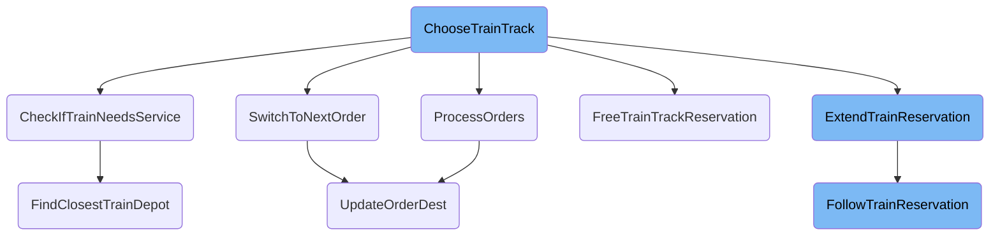

This document explains the process of selecting the best track for a train to follow in <SwmToken path="src/train_cmd.cpp" pos="2:13:13" line-data=" * This file is part of OpenTTD.">`OpenTTD`</SwmToken>. The process involves checking for reserved tracks, determining if the train needs servicing, processing train orders, and extending train reservations.

The flow starts with choosing the best track for the train. It first checks if there is a reserved track available. If the train needs servicing, it updates the train's order to go to the nearest depot. The train's orders are then processed to determine the next destination. If necessary, the train's path reservation is extended as far as possible, stopping at safe tiles or when encountering another reservation or track choice.

# Flow drill down



<SwmSnippet path="/src/train_cmd.cpp" line="2699">

---

## Choosing the Best Track

The function <SwmToken path="src/train_cmd.cpp" pos="2699:4:4" line-data="static Track ChooseTrainTrack(Train *v, TileIndex tile, DiagDirection enterdir, TrackBits tracks, bool force_res, bool *got_reservation, bool mark_stuck)">`ChooseTrainTrack`</SwmToken> is responsible for selecting the best track for the train to follow. It first checks if there is a reserved track available and returns it if found.

```c++
static Track ChooseTrainTrack(Train *v, TileIndex tile, DiagDirection enterdir, TrackBits tracks, bool force_res, bool *got_reservation, bool mark_stuck)
{
	Track best_track = INVALID_TRACK;
	bool do_track_reservation = _settings_game.pf.reserve_paths || force_res;
	bool changed_signal = false;
	TileIndex final_dest = INVALID_TILE;

	assert((tracks & ~TRACK_BIT_MASK) == 0);

	if (got_reservation != nullptr) *got_reservation = false;

	/* Don't use tracks here as the setting to forbid 90 deg turns might have been switched between reservation and now. */
	TrackBits res_tracks = (TrackBits)(GetReservedTrackbits(tile) & DiagdirReachesTracks(enterdir));
	/* Do we have a suitable reserved track? */
	if (res_tracks != TRACK_BIT_NONE) return FindFirstTrack(res_tracks);
```

---

</SwmSnippet>

<SwmSnippet path="/src/train_cmd.cpp" line="4143">

---

## Checking if Train Needs Service

The function <SwmToken path="src/train_cmd.cpp" pos="4143:4:4" line-data="static void CheckIfTrainNeedsService(Train *v)">`CheckIfTrainNeedsService`</SwmToken> determines if the train requires servicing. If the train needs service and a depot is not too far, it updates the train's order to go to the depot.

```c++
static void CheckIfTrainNeedsService(Train *v)
{
	if (Company::Get(v->owner)->settings.vehicle.servint_trains == 0 || !v->NeedsAutomaticServicing()) return;
	if (v->IsChainInDepot()) {
		VehicleServiceInDepot(v);
		return;
	}

	uint max_penalty = _settings_game.pf.yapf.maximum_go_to_depot_penalty;

	FindDepotData tfdd = FindClosestTrainDepot(v, max_penalty);
	/* Only go to the depot if it is not too far out of our way. */
	if (tfdd.best_length == UINT_MAX || tfdd.best_length > max_penalty) {
		if (v->current_order.IsType(OT_GOTO_DEPOT)) {
			/* If we were already heading for a depot but it has
			 * suddenly moved farther away, we continue our normal
			 * schedule? */
			v->current_order.MakeDummy();
			SetWindowWidgetDirty(WC_VEHICLE_VIEW, v->index, WID_VV_START_STOP);
		}
		return;
```

---

</SwmSnippet>

<SwmSnippet path="/src/order_cmd.cpp" line="2127">

---

## Processing Train Orders

The function <SwmToken path="src/order_cmd.cpp" pos="2127:2:2" line-data="bool ProcessOrders(Vehicle *v)">`ProcessOrders`</SwmToken> handles the train's orders and determines the next destination. It checks the type of the current order and updates the train's state accordingly.

```c++
bool ProcessOrders(Vehicle *v)
{
	switch (v->current_order.GetType()) {
		case OT_GOTO_DEPOT:
			/* Let a depot order in the orderlist interrupt. */
			if (!(v->current_order.GetDepotOrderType() & ODTFB_PART_OF_ORDERS)) return false;
			break;

		case OT_LOADING:
			return false;

		case OT_LEAVESTATION:
			if (v->type != VEH_AIRCRAFT) return false;
			break;

		default: break;
	}

	/**
```

---

</SwmSnippet>

<SwmSnippet path="/src/train_cmd.cpp" line="2485">

---

## Extending Train Reservation

The function <SwmToken path="src/train_cmd.cpp" pos="2485:4:4" line-data="static PBSTileInfo ExtendTrainReservation(const Train *v, TrackBits *new_tracks, DiagDirection *enterdir)">`ExtendTrainReservation`</SwmToken> extends the train's path reservation as far as possible, stopping at safe tiles or when encountering another reservation or track choice.

```c++
static PBSTileInfo ExtendTrainReservation(const Train *v, TrackBits *new_tracks, DiagDirection *enterdir)
{
	PBSTileInfo origin = FollowTrainReservation(v);

	CFollowTrackRail ft(v);

	std::vector<std::pair<TileIndex, Trackdir>> signals_set_to_red;

	TileIndex tile = origin.tile;
	Trackdir  cur_td = origin.trackdir;
	while (ft.Follow(tile, cur_td)) {
		if (KillFirstBit(ft.m_new_td_bits) == TRACKDIR_BIT_NONE) {
			/* Possible signal tile. */
			if (HasOnewaySignalBlockingTrackdir(ft.m_new_tile, FindFirstTrackdir(ft.m_new_td_bits))) break;
		}

		if (Rail90DegTurnDisallowed(GetTileRailType(ft.m_old_tile), GetTileRailType(ft.m_new_tile))) {
			ft.m_new_td_bits &= ~TrackdirCrossesTrackdirs(ft.m_old_td);
			if (ft.m_new_td_bits == TRACKDIR_BIT_NONE) break;
		}

```

---

</SwmSnippet>

# Where is this flow used?

This flow is used multiple times in the codebase as represented in the following diagram:

(Note - these are only some of the entry points of this flow)

```mermaid
graph TD;
      d012fd2a8a1bb123d6141d317315572c20a525f8c2a6f1dca1022c50fb72b199(WinMain):::rootsStyle --> a24297750af8c787dc713d3b0acfe769ee797a0f891090ed8a32e1a4c0926281(openttd_main)

a24297750af8c787dc713d3b0acfe769ee797a0f891090ed8a32e1a4c0926281(openttd_main) --> 544b02759c5d388192410bb5fec9457ebe5b8a73415a71ed4429282b26474473(LoadIntroGame)

544b02759c5d388192410bb5fec9457ebe5b8a73415a71ed4429282b26474473(LoadIntroGame) --> b3dc05478c6f5b841fc046c6464e17b15cef4e226048fce5ed9bccdb39dabc63(GenerateWorld)

b3dc05478c6f5b841fc046c6464e17b15cef4e226048fce5ed9bccdb39dabc63(GenerateWorld) --> ca34e745f423a640a51d4aadc36fbc1b34423a09bfce9ec19a5cd7d7ece957aa(_GenerateWorld)

ca34e745f423a640a51d4aadc36fbc1b34423a09bfce9ec19a5cd7d7ece957aa(_GenerateWorld) --> 05db6d29c7d56fc17bddb3ab8834098ba2e16892bd4b24546d97e7ffa6e3c894(SwitchToMode)

subgraph srcsaveload["src/saveload"]
ca34e745f423a640a51d4aadc36fbc1b34423a09bfce9ec19a5cd7d7ece957aa(_GenerateWorld) --> 9734efc033c92e0ecbfc87a143f7735a509ee8d04760add9f7551274b671adb7(SaveOrLoad)
end

05db6d29c7d56fc17bddb3ab8834098ba2e16892bd4b24546d97e7ffa6e3c894(SwitchToMode) --> b4b223b714326ec63f6f67bfd8f8f0ed60fac241098912fd3dbd108b14692678(SafeLoad)

05db6d29c7d56fc17bddb3ab8834098ba2e16892bd4b24546d97e7ffa6e3c894(SwitchToMode) --> 544b02759c5d388192410bb5fec9457ebe5b8a73415a71ed4429282b26474473(LoadIntroGame)

subgraph srcsaveload["src/saveload"]
b4b223b714326ec63f6f67bfd8f8f0ed60fac241098912fd3dbd108b14692678(SafeLoad) --> 9734efc033c92e0ecbfc87a143f7735a509ee8d04760add9f7551274b671adb7(SaveOrLoad)
end

subgraph srcsaveload["src/saveload"]
9734efc033c92e0ecbfc87a143f7735a509ee8d04760add9f7551274b671adb7(SaveOrLoad) --> 37f79acc4b0193c69ad674ce7ad059d1512518ed9542cd6c262c41bde8774240(DoLoad)
end

subgraph srcsaveload["src/saveload"]
37f79acc4b0193c69ad674ce7ad059d1512518ed9542cd6c262c41bde8774240(DoLoad) --> e945856b3ab352e4ed9275e93af39b53c46a6c0be58ce5bf5686d2654a352be8(AfterLoadGame)
end

subgraph srcsaveload["src/saveload"]
e945856b3ab352e4ed9275e93af39b53c46a6c0be58ce5bf5686d2654a352be8(AfterLoadGame) --> e70cadc526e1b043ba999b0b57dd3df40441ce67e3bdeb63a7efdc256bfa0981(FixupTrainLengths)
end

e70cadc526e1b043ba999b0b57dd3df40441ce67e3bdeb63a7efdc256bfa0981(FixupTrainLengths) --> 1ea7f8974fe828f1e0d9b36c33596bee9c84cb0ffe3fe96333e169f4e2b40a54(TrainController)

1ea7f8974fe828f1e0d9b36c33596bee9c84cb0ffe3fe96333e169f4e2b40a54(TrainController) --> 96a18e9cd874b378a28bc2fdf619bb0a5c346f6524a29ed09d32b611925b9741(TrainCheckIfLineEnds)

96a18e9cd874b378a28bc2fdf619bb0a5c346f6524a29ed09d32b611925b9741(TrainCheckIfLineEnds) --> 1ba11dafc3878eb05f064dfdccb23acd335d8274d2dfcbfbd70a82097626dcc5(TrainApproachingLineEnd)

1ba11dafc3878eb05f064dfdccb23acd335d8274d2dfcbfbd70a82097626dcc5(TrainApproachingLineEnd) --> c9a6a5dd7f648578eaf2bb601f3f97e104e2c6cc03b7676685d4f9fbfa597cbe(ReverseTrainDirection)

c9a6a5dd7f648578eaf2bb601f3f97e104e2c6cc03b7676685d4f9fbfa597cbe(ReverseTrainDirection) --> 826c1e10f077f562d32ccaeb62a0c4395a32e5039d527cc2bd14f0f4bb45bec2(CheckNextTrainTile)

826c1e10f077f562d32ccaeb62a0c4395a32e5039d527cc2bd14f0f4bb45bec2(CheckNextTrainTile) --> c0b7bb6e07426afba097a26b7fe786d9d4baef40529c17aa0da7b6d8e3fa7d20(ChooseTrainTrack):::mainFlowStyle

227eaee48f790cb276fab7c3bb5c4aed07dc34a153c81931559b3ec413b1cb32(main):::rootsStyle --> a24297750af8c787dc713d3b0acfe769ee797a0f891090ed8a32e1a4c0926281(openttd_main)

227eaee48f790cb276fab7c3bb5c4aed07dc34a153c81931559b3ec413b1cb32(main):::rootsStyle --> a24297750af8c787dc713d3b0acfe769ee797a0f891090ed8a32e1a4c0926281(openttd_main)

c30f7b20c637d4f560b8c109e63718fd5289b0b10c3db989ae778623965a432e(GameLoop):::rootsStyle --> 05db6d29c7d56fc17bddb3ab8834098ba2e16892bd4b24546d97e7ffa6e3c894(SwitchToMode)

3e4ae7d16a2142d310f6fe8859b068ff6873b81397e334a1c781e6e72f01aa9a(OnNewGRFsScanned):::rootsStyle --> 544b02759c5d388192410bb5fec9457ebe5b8a73415a71ed4429282b26474473(LoadIntroGame)


      classDef mainFlowStyle color:#000000,fill:#7CB9F4
classDef rootsStyle color:#000000,fill:#00FFF4
classDef Style1 color:#000000,fill:#00FFAA
classDef Style2 color:#000000,fill:#FFFF00
classDef Style3 color:#000000,fill:#AA7CB9
```



&nbsp;

*This is an auto-generated document by Swimm AI 🌊 and has not yet been verified by a human*

<SwmMeta version="3.0.0" repo-id="Z2l0aHViJTNBJTNBT3BlblRURC1jb3BpbG90LWRlbW8lM0ElM0Fzd2ltbWlv" repo-name="OpenTTD-copilot-demo"><sup>Powered by [Swimm](/)</sup></SwmMeta>
