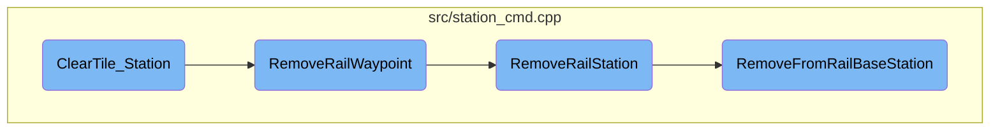
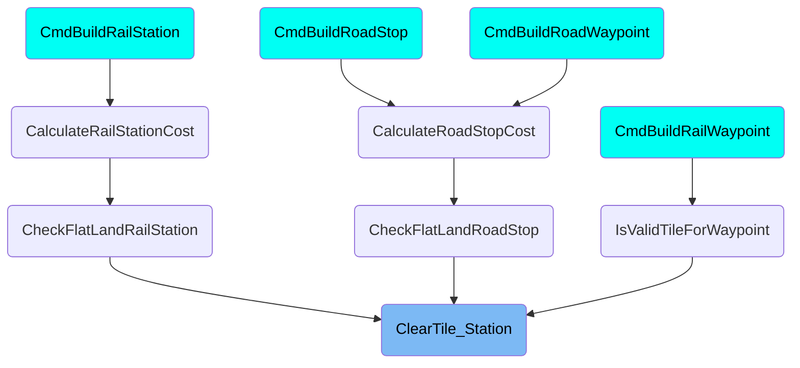

This document explains the process of clearing a station tile in the game. The process involves identifying the type of station, handling specific removal procedures, and ensuring proper demolition error messages are returned if the station cannot be cleared automatically.

The flow starts with identifying the type of station tile that needs to be cleared. If the station cannot be cleared automatically, appropriate error messages are returned. For rail stations, the process involves calling the <SwmToken path="src/station_cmd.cpp" pos="1810:2:2" line-data="CommandCost RemoveRailStation(T *st, DoCommandFlag flags, Money removal_cost)">`RemoveRailStation`</SwmToken> function, which checks the ownership and iterates over the station area to remove each tile. The <SwmToken path="src/station_cmd.cpp" pos="1865:4:4" line-data="static CommandCost RemoveRailWaypoint(TileIndex tile, DoCommandFlag flags)">`RemoveRailWaypoint`</SwmToken> function handles the removal of rail waypoints, and if the current company is the water company, it removes the waypoint tile by tile. The <SwmToken path="src/station_cmd.cpp" pos="1649:2:2" line-data="CommandCost RemoveFromRailBaseStation(TileArea ta, std::vector&lt;T *&gt; &amp;affected_stations, DoCommandFlag flags, Money removal_cost, bool keep_rail)">`RemoveFromRailBaseStation`</SwmToken> function ensures there are no vehicles on the ground, checks the ownership, and clears the tile, updating the station's area and infrastructure.

# Flow drill down



<SwmSnippet path="/src/station_cmd.cpp" line="4709">

---

## <SwmToken path="src/station_cmd.cpp" pos="4709:2:2" line-data="CommandCost ClearTile_Station(TileIndex tile, DoCommandFlag flags)">`ClearTile_Station`</SwmToken>

The <SwmToken path="src/station_cmd.cpp" pos="4709:2:2" line-data="CommandCost ClearTile_Station(TileIndex tile, DoCommandFlag flags)">`ClearTile_Station`</SwmToken> function is responsible for clearing a single tile of a station. It first checks the type of station and ensures that the appropriate demolition error messages are returned if the station cannot be cleared automatically. Depending on the station type, it calls specific functions to handle the removal process, such as <SwmToken path="src/station_cmd.cpp" pos="4729:8:8" line-data="		case STATION_RAIL:     return RemoveRailStation(tile, flags);">`RemoveRailStation`</SwmToken> for rail stations and <SwmToken path="src/station_cmd.cpp" pos="1865:4:4" line-data="static CommandCost RemoveRailWaypoint(TileIndex tile, DoCommandFlag flags)">`RemoveRailWaypoint`</SwmToken> for waypoints.

```c++
CommandCost ClearTile_Station(TileIndex tile, DoCommandFlag flags)
{
	if (flags & DC_AUTO) {
		switch (GetStationType(tile)) {
			default: break;
			case STATION_RAIL:     return_cmd_error(STR_ERROR_MUST_DEMOLISH_RAILROAD);
			case STATION_WAYPOINT: return_cmd_error(STR_ERROR_BUILDING_MUST_BE_DEMOLISHED);
			case STATION_AIRPORT:  return_cmd_error(STR_ERROR_MUST_DEMOLISH_AIRPORT_FIRST);
			case STATION_TRUCK:    return_cmd_error(HasTileRoadType(tile, RTT_TRAM) ? STR_ERROR_MUST_DEMOLISH_CARGO_TRAM_STATION_FIRST : STR_ERROR_MUST_DEMOLISH_TRUCK_STATION_FIRST);
			case STATION_BUS:      return_cmd_error(HasTileRoadType(tile, RTT_TRAM) ? STR_ERROR_MUST_DEMOLISH_PASSENGER_TRAM_STATION_FIRST : STR_ERROR_MUST_DEMOLISH_BUS_STATION_FIRST);
			case STATION_ROADWAYPOINT: return_cmd_error(STR_ERROR_BUILDING_MUST_BE_DEMOLISHED);
			case STATION_BUOY:     return_cmd_error(STR_ERROR_BUOY_IN_THE_WAY);
			case STATION_DOCK:     return_cmd_error(STR_ERROR_MUST_DEMOLISH_DOCK_FIRST);
			case STATION_OILRIG:
				SetDParam(1, STR_INDUSTRY_NAME_OIL_RIG);
				return_cmd_error(STR_ERROR_GENERIC_OBJECT_IN_THE_WAY);
		}
	}

	switch (GetStationType(tile)) {
		case STATION_RAIL:     return RemoveRailStation(tile, flags);
```

---

</SwmSnippet>

<SwmSnippet path="/src/station_cmd.cpp" line="1865">

---

## <SwmToken path="src/station_cmd.cpp" pos="1865:4:4" line-data="static CommandCost RemoveRailWaypoint(TileIndex tile, DoCommandFlag flags)">`RemoveRailWaypoint`</SwmToken>

The <SwmToken path="src/station_cmd.cpp" pos="1865:4:4" line-data="static CommandCost RemoveRailWaypoint(TileIndex tile, DoCommandFlag flags)">`RemoveRailWaypoint`</SwmToken> function handles the removal of rail waypoints. If the current company is the water company, it removes the waypoint tile by tile. Otherwise, it delegates the removal to the <SwmToken path="src/station_cmd.cpp" pos="1872:3:3" line-data="	return RemoveRailStation(Waypoint::GetByTile(tile), flags, _price[PR_CLEAR_WAYPOINT_RAIL]);">`RemoveRailStation`</SwmToken> function, passing the waypoint tile and the removal cost.

```c++
static CommandCost RemoveRailWaypoint(TileIndex tile, DoCommandFlag flags)
{
	/* if there is flooding, remove waypoints tile by tile */
	if (_current_company == OWNER_WATER) {
		return Command<CMD_REMOVE_FROM_RAIL_WAYPOINT>::Do(DC_EXEC, tile, 0, false);
	}

	return RemoveRailStation(Waypoint::GetByTile(tile), flags, _price[PR_CLEAR_WAYPOINT_RAIL]);
}
```

---

</SwmSnippet>

<SwmSnippet path="/src/station_cmd.cpp" line="1810">

---

## <SwmToken path="src/station_cmd.cpp" pos="1810:2:2" line-data="CommandCost RemoveRailStation(T *st, DoCommandFlag flags, Money removal_cost)">`RemoveRailStation`</SwmToken>

The <SwmToken path="src/station_cmd.cpp" pos="1810:2:2" line-data="CommandCost RemoveRailStation(T *st, DoCommandFlag flags, Money removal_cost)">`RemoveRailStation`</SwmToken> function is responsible for removing rail stations. It first checks the ownership of the station and then iterates over the tiles of the station area, removing each tile that belongs to the rail station. It calls <SwmToken path="src/station_cmd.cpp" pos="1829:7:7" line-data="			CommandCost ret = RemoveFromRailBaseStation(TileArea(tile, 1, 1), affected_stations, flags, removal_cost, false);">`RemoveFromRailBaseStation`</SwmToken> to handle the actual removal of each tile and accumulates the total cost of the removal.

```c++
CommandCost RemoveRailStation(T *st, DoCommandFlag flags, Money removal_cost)
{
	/* Current company owns the station? */
	if (_current_company != OWNER_WATER) {
		CommandCost ret = CheckOwnership(st->owner);
		if (ret.Failed()) return ret;
	}

	/* determine width and height of platforms */
	TileArea ta = st->train_station;

	assert(ta.w != 0 && ta.h != 0);

	CommandCost cost(EXPENSES_CONSTRUCTION);
	/* clear all areas of the station */
	for (TileIndex tile : ta) {
		/* only remove tiles that are actually train station tiles */
		if (st->TileBelongsToRailStation(tile)) {
			std::vector<T*> affected_stations; // dummy
			CommandCost ret = RemoveFromRailBaseStation(TileArea(tile, 1, 1), affected_stations, flags, removal_cost, false);
			if (ret.Failed()) return ret;
```

---

</SwmSnippet>

<SwmSnippet path="/src/station_cmd.cpp" line="1649">

---

## <SwmToken path="src/station_cmd.cpp" pos="1649:2:2" line-data="CommandCost RemoveFromRailBaseStation(TileArea ta, std::vector&lt;T *&gt; &amp;affected_stations, DoCommandFlag flags, Money removal_cost, bool keep_rail)">`RemoveFromRailBaseStation`</SwmToken>

The <SwmToken path="src/station_cmd.cpp" pos="1649:2:2" line-data="CommandCost RemoveFromRailBaseStation(TileArea ta, std::vector&lt;T *&gt; &amp;affected_stations, DoCommandFlag flags, Money removal_cost, bool keep_rail)">`RemoveFromRailBaseStation`</SwmToken> function handles the detailed removal of tiles from a rail station. It ensures there are no vehicles on the ground and checks the ownership of the station. If the tile is valid for removal, it clears the tile and updates the station's area and infrastructure. It also handles the removal of the station's facilities if the entire station is deleted.

```c++
CommandCost RemoveFromRailBaseStation(TileArea ta, std::vector<T *> &affected_stations, DoCommandFlag flags, Money removal_cost, bool keep_rail)
{
	/* Count of the number of tiles removed */
	int quantity = 0;
	CommandCost total_cost(EXPENSES_CONSTRUCTION);
	/* Accumulator for the errors seen during clearing. If no errors happen,
	 * and the quantity is 0 there is no station. Otherwise it will be one
	 * of the other error that got accumulated. */
	CommandCost error;

	/* Do the action for every tile into the area */
	for (TileIndex tile : ta) {
		/* Make sure the specified tile is a rail station */
		if (!HasStationTileRail(tile)) continue;

		/* If there is a vehicle on ground, do not allow to remove (flood) the tile */
		CommandCost ret = EnsureNoVehicleOnGround(tile);
		error.AddCost(ret);
		if (ret.Failed()) continue;

		/* Check ownership of station */
```

---

</SwmSnippet>

# Where is this flow used?

This flow is used multiple times in the codebase as represented in the following diagram:



&nbsp;

*This is an auto-generated document by Swimm AI 🌊 and has not yet been verified by a human*

<SwmMeta version="3.0.0" repo-id="Z2l0aHViJTNBJTNBT3BlblRURC1jb3BpbG90LWRlbW8lM0ElM0Fzd2ltbWlv" repo-name="OpenTTD-copilot-demo"><sup>Powered by [Swimm](/)</sup></SwmMeta>
