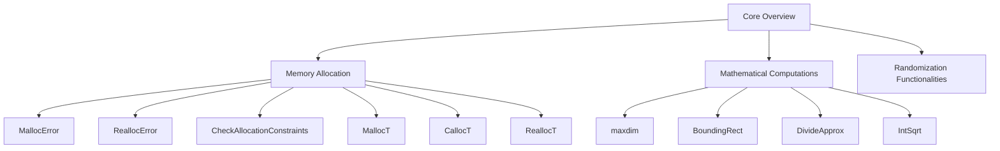

# Core Overview

Core refers to the fundamental components and utilities that support the primary functionalities of the game. It includes various utility functions and types that are essential for the game's operations, such as memory allocation, mathematical computations, and data structures.

# Memory Allocation

Handles memory allocation errors by providing functions that exit with an error message when memory allocation fails. This ensures that the game can handle low-memory situations gracefully.

<SwmSnippet path="/src/core/alloc_func.cpp" line="1">

---

The file <SwmPath>[src/core/alloc_func.cpp](src/core/alloc_func.cpp)</SwmPath> contains functions to handle memory allocation errors. It includes necessary headers and defines the functions used for memory management.

```c++
/*
 * This file is part of OpenTTD.
 * OpenTTD is free software; you can redistribute it and/or modify it under the terms of the GNU General Public License as published by the Free Software Foundation, version 2.
 * OpenTTD is distributed in the hope that it will be useful, but WITHOUT ANY WARRANTY; without even the implied warranty of MERCHANTABILITY or FITNESS FOR A PARTICULAR PURPOSE.
 * See the GNU General Public License for more details. You should have received a copy of the GNU General Public License along with OpenTTD. If not, see <http://www.gnu.org/licenses/>.
 */

/** @file alloc_func.cpp Functions to 'handle' memory allocation errors */

#include "../stdafx.h"
```

---

</SwmSnippet>

## <SwmToken path="src/core/alloc_func.cpp" pos="20:8:8" line-data="[[noreturn]] void MallocError(size_t size)">`MallocError`</SwmToken>

The <SwmToken path="src/core/alloc_func.cpp" pos="20:8:8" line-data="[[noreturn]] void MallocError(size_t size)">`MallocError`</SwmToken> function is used to handle memory allocation errors by exiting with an error message when <SwmToken path="src/core/alloc_func.hpp" pos="69:12:12" line-data="	T *t_ptr = (T*)malloc(num_elements * sizeof(T));">`malloc`</SwmToken> or <SwmToken path="src/core/alloc_func.hpp" pos="94:12:12" line-data="	T *t_ptr = (T*)calloc(num_elements, sizeof(T));">`calloc`</SwmToken> fails.

<SwmSnippet path="/src/core/alloc_func.cpp" line="20">

---

The <SwmToken path="src/core/alloc_func.cpp" pos="20:8:8" line-data="[[noreturn]] void MallocError(size_t size)">`MallocError`</SwmToken> function exits with an error message when memory allocation fails.

```c++
[[noreturn]] void MallocError(size_t size)
{
	FatalError("Out of memory. Cannot allocate {} bytes", size);
}
```

---

</SwmSnippet>

## <SwmToken path="src/core/alloc_func.hpp" pos="127:11:11" line-data="	if (t_ptr == nullptr) ReallocError(num_elements * sizeof(T));">`ReallocError`</SwmToken>

The <SwmToken path="src/core/alloc_func.hpp" pos="127:11:11" line-data="	if (t_ptr == nullptr) ReallocError(num_elements * sizeof(T));">`ReallocError`</SwmToken> function is used to handle memory reallocation errors by exiting with an error message when <SwmToken path="src/core/alloc_func.hpp" pos="126:9:9" line-data="	t_ptr = (T*)realloc(static_cast&lt;void *&gt;(t_ptr), num_elements * sizeof(T));">`realloc`</SwmToken> fails.

## <SwmToken path="src/core/alloc_func.hpp" pos="29:4:4" line-data="inline void CheckAllocationConstraints(size_t element_size, size_t num_elements)">`CheckAllocationConstraints`</SwmToken>

The <SwmToken path="src/core/alloc_func.hpp" pos="29:4:4" line-data="inline void CheckAllocationConstraints(size_t element_size, size_t num_elements)">`CheckAllocationConstraints`</SwmToken> function checks whether allocating memory would overflow <SwmToken path="src/core/alloc_func.cpp" pos="20:10:10" line-data="[[noreturn]] void MallocError(size_t size)">`size_t`</SwmToken>.

<SwmSnippet path="/src/core/alloc_func.hpp" line="29">

---

The <SwmToken path="src/core/alloc_func.hpp" pos="29:4:4" line-data="inline void CheckAllocationConstraints(size_t element_size, size_t num_elements)">`CheckAllocationConstraints`</SwmToken> function ensures that memory allocation does not overflow.

```c++
inline void CheckAllocationConstraints(size_t element_size, size_t num_elements)
{
	if (num_elements > SIZE_MAX / element_size) MallocError(SIZE_MAX);
```

---

</SwmSnippet>

## <SwmToken path="src/core/alloc_func.hpp" pos="57:5:5" line-data="inline T *MallocT(size_t num_elements)">`MallocT`</SwmToken>

The <SwmToken path="src/core/alloc_func.hpp" pos="57:5:5" line-data="inline T *MallocT(size_t num_elements)">`MallocT`</SwmToken> function allocates the specified number of elements of the given type and explicitly casts it to the requested type.

<SwmSnippet path="/src/core/alloc_func.hpp" line="56">

---

The <SwmToken path="src/core/alloc_func.hpp" pos="57:5:5" line-data="inline T *MallocT(size_t num_elements)">`MallocT`</SwmToken> function allocates memory for a specified number of elements and handles zero-element allocations.

```c++
template <typename T>
inline T *MallocT(size_t num_elements)
{
	/*
	 * MorphOS cannot handle 0 elements allocations, or rather that always
	 * returns nullptr. So we do that for *all* allocations, thus causing it
	 * to behave the same on all OSes.
	 */
	if (num_elements == 0) return nullptr;

	/* Ensure the size does not overflow. */
	CheckAllocationConstraints<T>(num_elements);

	T *t_ptr = (T*)malloc(num_elements * sizeof(T));
	if (t_ptr == nullptr) MallocError(num_elements * sizeof(T));
```

---

</SwmSnippet>

## <SwmToken path="src/core/alloc_func.hpp" pos="85:5:5" line-data="inline T *CallocT(size_t num_elements)">`CallocT`</SwmToken>

The <SwmToken path="src/core/alloc_func.hpp" pos="85:5:5" line-data="inline T *CallocT(size_t num_elements)">`CallocT`</SwmToken> function allocates the specified number of elements of the given type, initializes them to zero, and explicitly casts it to the requested type.

<SwmSnippet path="/src/core/alloc_func.hpp" line="84">

---

The <SwmToken path="src/core/alloc_func.hpp" pos="85:5:5" line-data="inline T *CallocT(size_t num_elements)">`CallocT`</SwmToken> function allocates and initializes memory for a specified number of elements.

```c++
template <typename T>
inline T *CallocT(size_t num_elements)
{
	/*
	 * MorphOS cannot handle 0 elements allocations, or rather that always
	 * returns nullptr. So we do that for *all* allocations, thus causing it
	 * to behave the same on all OSes.
	 */
	if (num_elements == 0) return nullptr;

	T *t_ptr = (T*)calloc(num_elements, sizeof(T));
	if (t_ptr == nullptr) MallocError(num_elements * sizeof(T));
```

---

</SwmSnippet>

## <SwmToken path="src/core/alloc_func.hpp" pos="111:5:5" line-data="inline T *ReallocT(T *t_ptr, size_t num_elements)">`ReallocT`</SwmToken>

The <SwmToken path="src/core/alloc_func.hpp" pos="111:5:5" line-data="inline T *ReallocT(T *t_ptr, size_t num_elements)">`ReallocT`</SwmToken> function reallocates the specified number of elements of the given type, extends or shrinks the memory allocation, and explicitly casts it to the requested type.

<SwmSnippet path="/src/core/alloc_func.hpp" line="110">

---

The <SwmToken path="src/core/alloc_func.hpp" pos="111:5:5" line-data="inline T *ReallocT(T *t_ptr, size_t num_elements)">`ReallocT`</SwmToken> function reallocates memory for a specified number of elements and handles zero-element reallocations.

```c++
template <typename T>
inline T *ReallocT(T *t_ptr, size_t num_elements)
{
	/*
	 * MorphOS cannot handle 0 elements allocations, or rather that always
	 * returns nullptr. So we do that for *all* allocations, thus causing it
	 * to behave the same on all OSes.
	 */
	if (num_elements == 0) {
		free(t_ptr);
		return nullptr;
	}

	/* Ensure the size does not overflow. */
	CheckAllocationConstraints<T>(num_elements);

	t_ptr = (T*)realloc(static_cast<void *>(t_ptr), num_elements * sizeof(T));
	if (t_ptr == nullptr) ReallocError(num_elements * sizeof(T));
```

---

</SwmSnippet>

# Mathematical Computations

Provides mathematical functionalities essential for the game's operations. These functions handle various mathematical operations required by the game.

<SwmSnippet path="/src/core/math_func.cpp" line="1">

---

The file <SwmPath>[src/core/math_func.cpp](src/core/math_func.cpp)</SwmPath> contains mathematical functions used throughout the game.

```c++
/*
 * This file is part of OpenTTD.
 * OpenTTD is free software; you can redistribute it and/or modify it under the terms of the GNU General Public License as published by the Free Software Foundation, version 2.
 * OpenTTD is distributed in the hope that it will be useful, but WITHOUT ANY WARRANTY; without even the implied warranty of MERCHANTABILITY or FITNESS FOR A PARTICULAR PURPOSE.
 * See the GNU General Public License for more details. You should have received a copy of the GNU General Public License along with OpenTTD. If not, see <http://www.gnu.org/licenses/>.
 */

/** @file math_func.cpp Math functions. */

#include "../stdafx.h"
```

---

</SwmSnippet>

## maxdim

The <SwmToken path="src/core/geometry_func.cpp" pos="22:2:2" line-data="Dimension maxdim(const Dimension &amp;d1, const Dimension &amp;d2)">`maxdim`</SwmToken> function computes the bounding box of two dimensions, returning the smallest dimension that surrounds both arguments.

<SwmSnippet path="/src/core/geometry_func.cpp" line="22">

---

The <SwmToken path="src/core/geometry_func.cpp" pos="22:2:2" line-data="Dimension maxdim(const Dimension &amp;d1, const Dimension &amp;d2)">`maxdim`</SwmToken> function calculates the maximum dimensions between two given dimensions.

```c++
Dimension maxdim(const Dimension &d1, const Dimension &d2)
{
	Dimension d;
	d.width  = std::max(d1.width,  d2.width);
	d.height = std::max(d1.height, d2.height);
	return d;
```

---

</SwmSnippet>

## <SwmToken path="src/core/geometry_func.cpp" pos="36:2:2" line-data="Rect BoundingRect(const Rect &amp;r1, const Rect &amp;r2)">`BoundingRect`</SwmToken>

The <SwmToken path="src/core/geometry_func.cpp" pos="36:2:2" line-data="Rect BoundingRect(const Rect &amp;r1, const Rect &amp;r2)">`BoundingRect`</SwmToken> function computes the bounding rectangle around two rectangles, returning the smallest rectangle that contains both arguments.

<SwmSnippet path="/src/core/geometry_func.cpp" line="36">

---

The <SwmToken path="src/core/geometry_func.cpp" pos="36:2:2" line-data="Rect BoundingRect(const Rect &amp;r1, const Rect &amp;r2)">`BoundingRect`</SwmToken> function calculates the bounding rectangle that contains two given rectangles.

```c++
Rect BoundingRect(const Rect &r1, const Rect &r2)
{
	/* If either the first or the second is empty, return the other. */
	if (IsEmptyRect(r1)) return r2;
	if (IsEmptyRect(r2)) return r1;

	Rect r;

	r.top    = std::min(r1.top,    r2.top);
	r.bottom = std::max(r1.bottom, r2.bottom);
	r.left   = std::min(r1.left,   r2.left);
	r.right  = std::max(r1.right,  r2.right);

	return r;
```

---

</SwmSnippet>

## <SwmToken path="src/core/math_func.cpp" pos="22:2:2" line-data="int DivideApprox(int a, int b)">`DivideApprox`</SwmToken>

The <SwmToken path="src/core/math_func.cpp" pos="22:2:2" line-data="int DivideApprox(int a, int b)">`DivideApprox`</SwmToken> function performs a deterministic approximate division, canceling out division errors stemming from the integer nature of the division over multiple runs.

<SwmSnippet path="/src/core/math_func.cpp" line="22">

---

The <SwmToken path="src/core/math_func.cpp" pos="22:2:2" line-data="int DivideApprox(int a, int b)">`DivideApprox`</SwmToken> function handles approximate division while minimizing errors.

```c++
int DivideApprox(int a, int b)
{
	int random_like = ((a + b) * (a - b)) % b;

	int remainder = a % b;

	int ret = a / b;
	if (abs(random_like) < abs(remainder)) {
		ret += ((a < 0) ^ (b < 0)) ? -1 : 1;
	}

	return ret;
```

---

</SwmSnippet>

## <SwmToken path="src/core/math_func.cpp" pos="42:2:2" line-data="uint32_t IntSqrt(uint32_t num)">`IntSqrt`</SwmToken>

The <SwmToken path="src/core/math_func.cpp" pos="42:2:2" line-data="uint32_t IntSqrt(uint32_t num)">`IntSqrt`</SwmToken> function computes the integer square root of a given number, rounding to the nearest integer.

<SwmSnippet path="/src/core/math_func.cpp" line="42">

---

The <SwmToken path="src/core/math_func.cpp" pos="42:2:2" line-data="uint32_t IntSqrt(uint32_t num)">`IntSqrt`</SwmToken> function calculates the integer square root of a given number.

```c++
uint32_t IntSqrt(uint32_t num)
{
	uint32_t res = 0;
	uint32_t bit = 1UL << 30; // Second to top bit number.

	/* 'bit' starts at the highest power of four <= the argument. */
	while (bit > num) bit >>= 2;

	while (bit != 0) {
		if (num >= res + bit) {
			num -= res + bit;
			res = (res >> 1) + bit;
		} else {
			res >>= 1;
		}
		bit >>= 2;
	}

	/* Arithmetic rounding to nearest integer. */
	if (num > res) res++;
```

---

</SwmSnippet>

# Randomization Functionalities

Offers randomization functionalities that are used throughout the game. These functions handle various randomization operations required by the game.

<SwmSnippet path="/src/core/random_func.cpp" line="1">

---

The file <SwmPath>[src/core/random_func.cpp](src/core/random_func.cpp)</SwmPath> contains functions for randomization used throughout the game.

```c++
/*
 * This file is part of OpenTTD.
 * OpenTTD is free software; you can redistribute it and/or modify it under the terms of the GNU General Public License as published by the Free Software Foundation, version 2.
 * OpenTTD is distributed in the hope that it will be useful, but WITHOUT ANY WARRANTY; without even the implied warranty of MERCHANTABILITY or FITNESS FOR A PARTICULAR PURPOSE.
 * See the GNU General Public License for more details. You should have received a copy of the GNU General Public License along with OpenTTD. If not, see <http://www.gnu.org/licenses/>.
 */

/** @file random_func.cpp Implementation of the pseudo random generator. */

#include "../stdafx.h"
```

---

</SwmSnippet>

&nbsp;

*This is an auto-generated document by Swimm AI 🌊 and has not yet been verified by a human*

<SwmMeta version="3.0.0" repo-id="Z2l0aHViJTNBJTNBT3BlblRURC1jb3BpbG90LWRlbW8lM0ElM0Fzd2ltbWlv" repo-name="OpenTTD-copilot-demo"><sup>Powered by [Swimm](/)</sup></SwmMeta>
