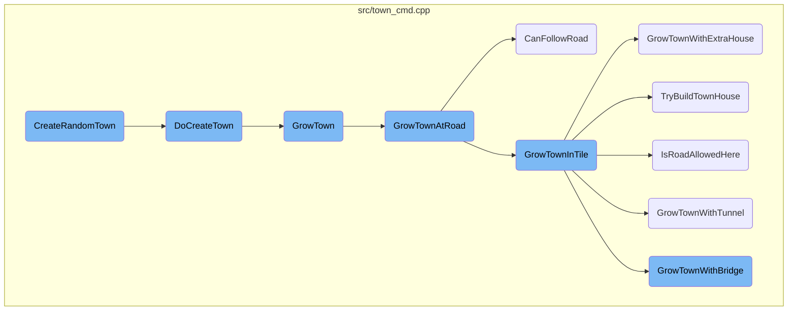
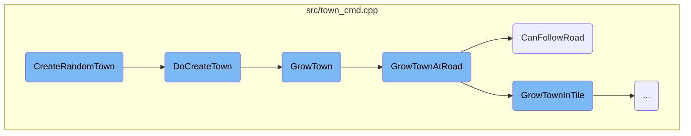
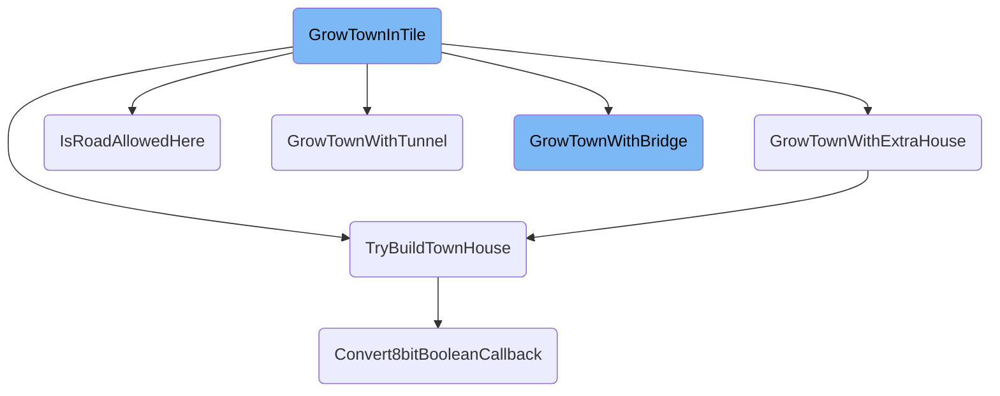
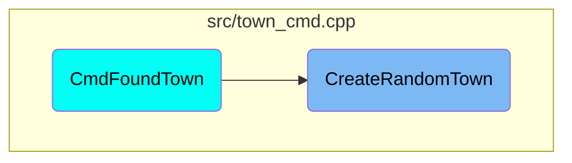

This document explains the process of creating a random town in the game. The process involves several steps, starting from initiating the creation of a town at a random location to expanding the town by building roads, houses, tunnels, or bridges.

The process begins with trying to create a town at a random location. If a suitable location is found, the town is created with initial properties like location, population, and layout. The town then attempts to grow by expanding along existing roads or building new roads. If roads cannot be built, the town tries to build houses, tunnels, or bridges. Each step involves checking various conditions to ensure the new constructions are valid and connected.

Here is a high level diagram of the flow, showing only the most important functions:



# Flow drill down

First, we'll zoom into this section of the flow:



<SwmSnippet path="/src/town_cmd.cpp" line="2323">

---

## <SwmToken path="src/town_cmd.cpp" pos="2332:5:5" line-data="static Town *CreateRandomTown(uint attempts, uint32_t townnameparts, TownSize size, bool city, TownLayout layout)">`CreateRandomTown`</SwmToken>

The <SwmToken path="src/town_cmd.cpp" pos="2332:5:5" line-data="static Town *CreateRandomTown(uint attempts, uint32_t townnameparts, TownSize size, bool city, TownLayout layout)">`CreateRandomTown`</SwmToken> function is responsible for initiating the creation of a new town at a random location. It attempts to place the town on a suitable tile, ensuring it is not on water and that the location is valid for town placement. If successful, it calls <SwmToken path="src/town_cmd.cpp" pos="1988:4:4" line-data="static void DoCreateTown(Town *t, TileIndex tile, uint32_t townnameparts, TownSize size, bool city, TownLayout layout, bool manual)">`DoCreateTown`</SwmToken> to finalize the creation.

```c++
/**
 * Create a random town somewhere in the world.
 * @param attempts How many times should we try?
 * @param townnameparts The name of the town.
 * @param size The size preset of the town.
 * @param city Should we build a city?
 * @param layout The road layout to build.
 * @return The town object, or nullptr if we failed to create a town anywhere.
 */
static Town *CreateRandomTown(uint attempts, uint32_t townnameparts, TownSize size, bool city, TownLayout layout)
{
	assert(_game_mode == GM_EDITOR || _generating_world); // These are the preconditions for CMD_DELETE_TOWN

	if (!Town::CanAllocateItem()) return nullptr;

	do {
		/* Generate a tile index not too close from the edge */
		TileIndex tile = AlignTileToGrid(RandomTile(), layout);

		/* if we tried to place the town on water, slide it over onto
		 * the nearest likely-looking spot */
```

---

</SwmSnippet>

<SwmSnippet path="/src/town_cmd.cpp" line="1977">

---

## <SwmToken path="src/town_cmd.cpp" pos="1988:4:4" line-data="static void DoCreateTown(Town *t, TileIndex tile, uint32_t townnameparts, TownSize size, bool city, TownLayout layout, bool manual)">`DoCreateTown`</SwmToken>

The <SwmToken path="src/town_cmd.cpp" pos="1988:4:4" line-data="static void DoCreateTown(Town *t, TileIndex tile, uint32_t townnameparts, TownSize size, bool city, TownLayout layout, bool manual)">`DoCreateTown`</SwmToken> function finalizes the creation of the town by setting its initial properties such as location, population, and layout. It also initializes the town's growth parameters and inserts the town into the game's data structures.

```c++
/**
 * Actually create a town.
 *
 * @param t The town.
 * @param tile Where to put it.
 * @param townnameparts The town name.
 * @param size The preset size of the town.
 * @param city Should we create a city?
 * @param layout The road layout of the town.
 * @param manual Was the town placed manually?
 */
static void DoCreateTown(Town *t, TileIndex tile, uint32_t townnameparts, TownSize size, bool city, TownLayout layout, bool manual)
{
	AutoRestoreBackup backup(_generating_town, true);

	t->xy = tile;
	t->cache.num_houses = 0;
	t->time_until_rebuild = 10;
	UpdateTownRadius(t);
	t->flags = 0;
	t->cache.population = 0;
```

---

</SwmSnippet>

<SwmSnippet path="/src/town_cmd.cpp" line="1853">

---

## <SwmToken path="src/town_cmd.cpp" pos="1858:4:4" line-data="static bool GrowTown(Town *t)">`GrowTown`</SwmToken>

The <SwmToken path="src/town_cmd.cpp" pos="1858:4:4" line-data="static bool GrowTown(Town *t)">`GrowTown`</SwmToken> function handles the growth of the town by attempting to expand it through road construction. It first tries to grow the town along existing roads and, if no suitable roads are found, it attempts to build new roads on flat land.

```c++
/**
 * Grow the town.
 * @param t The town to grow
 * @return true if we successfully grew the town with a road or house.
 */
static bool GrowTown(Town *t)
{
	static const TileIndexDiffC _town_coord_mod[] = {
		{-1,  0},
		{ 1,  1},
		{ 1, -1},
		{-1, -1},
		{-1,  0},
		{ 0,  2},
		{ 2,  0},
		{ 0, -2},
		{-1, -1},
		{-2,  2},
		{ 2,  2},
		{ 2, -2},
		{ 0,  0}
```

---

</SwmSnippet>

<SwmSnippet path="/src/town_cmd.cpp" line="1756">

---

## <SwmToken path="src/town_cmd.cpp" pos="1762:4:4" line-data="static bool GrowTownAtRoad(Town *t, TileIndex tile)">`GrowTownAtRoad`</SwmToken>

The <SwmToken path="src/town_cmd.cpp" pos="1762:4:4" line-data="static bool GrowTownAtRoad(Town *t, TileIndex tile)">`GrowTownAtRoad`</SwmToken> function attempts to expand the town from a given road tile. It checks the town's layout and growth parameters to determine the best direction for expansion and ensures that the new road segments are valid and connected.

```c++
/**
 * Try to grow a town at a given road tile.
 * @param t The town to grow.
 * @param tile The road tile to try growing from.
 * @return true if we successfully expanded the town.
 */
static bool GrowTownAtRoad(Town *t, TileIndex tile)
{
	/* Special case.
	 * @see GrowTownInTile Check the else if
	 */
	DiagDirection target_dir = DIAGDIR_END; // The direction in which we want to extend the town

	assert(tile < Map::Size());

	/* Number of times to search.
	 * Better roads, 2X2 and 3X3 grid grow quite fast so we give
	 * them a little handicap. */
	switch (t->layout) {
		case TL_BETTER_ROADS:
			_grow_town_result = 10 + t->cache.num_houses * 2 / 9;
```

---

</SwmSnippet>

<SwmSnippet path="/src/town_cmd.cpp" line="1713">

---

## <SwmToken path="src/town_cmd.cpp" pos="1720:4:4" line-data="static bool CanFollowRoad(TileIndex tile, DiagDirection dir)">`CanFollowRoad`</SwmToken>

The <SwmToken path="src/town_cmd.cpp" pos="1720:4:4" line-data="static bool CanFollowRoad(TileIndex tile, DiagDirection dir)">`CanFollowRoad`</SwmToken> function checks whether a road can be extended from a given tile in a specified direction. It ensures that the target tile is valid and not obstructed by water or other impassable terrain.

```c++
/**
 * Checks whether a road can be followed or is a dead end, that can not be extended to the next tile.
 * This only checks trivial but often cases.
 * @param tile Start tile for road.
 * @param dir Direction for road to follow or build.
 * @return true If road is or can be connected in the specified direction.
 */
static bool CanFollowRoad(TileIndex tile, DiagDirection dir)
{
	TileIndex target_tile = tile + TileOffsByDiagDir(dir);
	if (!IsValidTile(target_tile)) return false;
	if (HasTileWaterGround(target_tile)) return false;

	RoadBits target_rb = GetTownRoadBits(target_tile);
	if (TownAllowedToBuildRoads()) {
		/* Check whether a road connection exists or can be build. */
		switch (GetTileType(target_tile)) {
			case MP_ROAD:
				return target_rb != ROAD_NONE;

			case MP_STATION:
```

---

</SwmSnippet>

Now, lets zoom into this section of the flow:



<SwmSnippet path="/src/town_cmd.cpp" line="1495">

---

## <SwmToken path="src/town_cmd.cpp" pos="1512:4:4" line-data="static void GrowTownInTile(TileIndex *tile_ptr, RoadBits cur_rb, DiagDirection target_dir, Town *t1)">`GrowTownInTile`</SwmToken>

The <SwmToken path="src/town_cmd.cpp" pos="1512:4:4" line-data="static void GrowTownInTile(TileIndex *tile_ptr, RoadBits cur_rb, DiagDirection target_dir, Town *t1)">`GrowTownInTile`</SwmToken> function is responsible for expanding the town by evaluating various conditions and deciding whether to build roads, houses, tunnels, or bridges. It first checks if the current tile has a road and whether the town is allowed to build roads. Depending on the town's layout, it determines the appropriate road construction command or decides to build a house if certain conditions are met.

```c++
/**
 * Grows the given town.
 * There are at the moment 3 possible way's for
 * the town expansion:
 *  @li Generate a random tile and check if there is a road allowed
 *  @li TL_ORIGINAL
 *  @li TL_BETTER_ROADS
 *  @li Check if the town geometry allows a road and which one
 *  @li TL_2X2_GRID
 *  @li TL_3X3_GRID
 *  @li Forbid roads, only build houses
 *
 * @param tile_ptr The current tile
 * @param cur_rb The current tiles RoadBits
 * @param target_dir The target road dir
 * @param t1 The current town
 */
static void GrowTownInTile(TileIndex *tile_ptr, RoadBits cur_rb, DiagDirection target_dir, Town *t1)
{
	RoadBits rcmd = ROAD_NONE;  // RoadBits for the road construction command
	TileIndex tile = *tile_ptr; // The main tile on which we base our growth
```

---

</SwmSnippet>

<SwmSnippet path="/src/town_cmd.cpp" line="1520">

---

### Evaluating Road Conditions

The function checks if the current tile has no road and whether the town is allowed to build roads. It then evaluates the town's layout to determine the appropriate road construction command. If a road is not allowed, it returns early.

```c++
		/* Tile has no road. First reset the status counter
		 * to say that this is the last iteration. */
		_grow_town_result = GROWTH_SEARCH_STOPPED;

		if (!TownAllowedToBuildRoads()) return;
		if (!_settings_game.economy.allow_town_level_crossings && IsTileType(tile, MP_RAILWAY)) return;

		/* Remove hills etc */
		if (!_settings_game.construction.build_on_slopes || Chance16(1, 6)) LevelTownLand(tile);

		/* Is a road allowed here? */
		switch (t1->layout) {
			default: NOT_REACHED();

			case TL_3X3_GRID:
			case TL_2X2_GRID:
				rcmd = GetTownRoadGridElement(t1, tile, target_dir);
				if (rcmd == ROAD_NONE) return;
				break;

			case TL_BETTER_ROADS:
```

---

</SwmSnippet>

<SwmSnippet path="/src/town_cmd.cpp" line="1594">

---

### Building Houses

If the conditions for building a road are not met, the function evaluates whether a house can be built on the current tile. It checks for water tiles, validates the tile, and ensures that the town is allowed to build houses. If all conditions are met, it attempts to build a house.

```c++
		bool allow_house = true; // Value which decides if we want to construct a house

		/* Reached a tunnel/bridge? Then continue at the other side of it, unless
		 * it is the starting tile. Half the time, we stay on this side then.*/
		if (IsTileType(tile, MP_TUNNELBRIDGE)) {
			if (GetTunnelBridgeTransportType(tile) == TRANSPORT_ROAD && (target_dir != DIAGDIR_END || Chance16(1, 2))) {
				*tile_ptr = GetOtherTunnelBridgeEnd(tile);
			}
			return;
		}

		/* Possibly extend the road in a direction.
		 * Randomize a direction and if it has a road, bail out. */
		target_dir = RandomDiagDir();
		RoadBits target_rb = DiagDirToRoadBits(target_dir);
		TileIndex house_tile; // position of a possible house

		if (cur_rb & target_rb) {
			/* If it's a road turn possibly build a house in a corner.
			 * Use intersection with straight road as an indicator
			 * that we randomed corner house position.
```

---

</SwmSnippet>

<SwmSnippet path="/src/town_cmd.cpp" line="1166">

---

## <SwmToken path="src/town_cmd.cpp" pos="1176:4:4" line-data="static bool GrowTownWithExtraHouse(Town *t, TileIndex tile)">`GrowTownWithExtraHouse`</SwmToken>

The <SwmToken path="src/town_cmd.cpp" pos="1176:4:4" line-data="static bool GrowTownWithExtraHouse(Town *t, TileIndex tile)">`GrowTownWithExtraHouse`</SwmToken> function attempts to grow the town by adding an extra house. It checks if there are enough neighboring house tiles around the current tile. If there are at least three neighboring houses or void tiles, it tries to build an extra house.

```c++
/**
 * Grows the town with an extra house.
 *  Check if there are enough neighbor house tiles
 *  next to the current tile. If there are enough
 *  add another house.
 *
 * @param t The current town.
 * @param tile The target tile for the extra house.
 * @return true if an extra house has been added.
 */
static bool GrowTownWithExtraHouse(Town *t, TileIndex tile)
{
	/* We can't look further than that. */
	if (DistanceFromEdge(tile) == 0) return false;

	uint counter = 0; // counts the house neighbor tiles

	/* Check the tiles E,N,W and S of the current tile for houses */
	for (DiagDirection dir = DIAGDIR_BEGIN; dir < DIAGDIR_END; dir++) {
		/* Count both void and house tiles for checking whether there
		 * are enough houses in the area. This to make it likely that
```

---

</SwmSnippet>

<SwmSnippet path="/src/town_cmd.cpp" line="2718">

---

## <SwmToken path="src/town_cmd.cpp" pos="2724:4:4" line-data="static bool TryBuildTownHouse(Town *t, TileIndex tile)">`TryBuildTownHouse`</SwmToken>

The <SwmToken path="src/town_cmd.cpp" pos="2724:4:4" line-data="static bool TryBuildTownHouse(Town *t, TileIndex tile)">`TryBuildTownHouse`</SwmToken> function attempts to build a house on a specified tile. It verifies if the town layout allows building a house on the tile and checks various conditions such as slope, climate, and house specifications. If all conditions are met, it builds the house.

```c++
/**
 * Tries to build a house at this tile.
 * @param t The town the house will belong to.
 * @param tile The tile to try building on.
 * @return false iff no house can be built on this tile.
 */
static bool TryBuildTownHouse(Town *t, TileIndex tile)
{
	/* forbidden building here by town layout */
	if (!TownLayoutAllowsHouseHere(t, tile)) return false;

	/* no house allowed at all, bail out */
	if (!CanBuildHouseHere(tile, false)) return false;

	Slope slope = GetTileSlope(tile);
	int maxz = GetTileMaxZ(tile);

	/* Get the town zone type of the current tile, as well as the climate.
	 * This will allow to easily compare with the specs of the new house to build */
	HouseZonesBits rad = GetTownRadiusGroup(t, tile);

```

---

</SwmSnippet>

<SwmSnippet path="/src/town_cmd.cpp" line="1032">

---

## <SwmToken path="src/town_cmd.cpp" pos="1040:4:4" line-data="static bool IsRoadAllowedHere(Town *t, TileIndex tile, DiagDirection dir)">`IsRoadAllowedHere`</SwmToken>

The <SwmToken path="src/town_cmd.cpp" pos="1040:4:4" line-data="static bool IsRoadAllowedHere(Town *t, TileIndex tile, DiagDirection dir)">`IsRoadAllowedHere`</SwmToken> function checks if a road is allowed on a given tile. It evaluates conditions such as distance from the edge, presence of bridges, existing roads, and slope. If all conditions are met, it returns true, allowing road construction.

```c++
/**
 * Check if a Road is allowed on a given tile.
 *
 * @param t The current town.
 * @param tile The target tile.
 * @param dir The direction in which we want to extend the town.
 * @return true if it is allowed.
 */
static bool IsRoadAllowedHere(Town *t, TileIndex tile, DiagDirection dir)
{
	if (DistanceFromEdge(tile) == 0) return false;

	/* Prevent towns from building roads under bridges along the bridge. Looks silly. */
	if (IsBridgeAbove(tile) && GetBridgeAxis(tile) == DiagDirToAxis(dir)) return false;

	/* Check if there already is a road at this point? */
	if (GetTownRoadBits(tile) == ROAD_NONE) {
		/* No, try if we are able to build a road piece there.
		 * If that fails clear the land, and if that fails exit.
		 * This is to make sure that we can build a road here later. */
		RoadType rt = GetTownRoadType();
```

---

</SwmSnippet>

<SwmSnippet path="/src/town_cmd.cpp" line="1373">

---

## <SwmToken path="src/town_cmd.cpp" pos="1383:4:4" line-data="static bool GrowTownWithTunnel(const Town *t, const TileIndex tile, const DiagDirection tunnel_dir)">`GrowTownWithTunnel`</SwmToken>

The <SwmToken path="src/town_cmd.cpp" pos="1383:4:4" line-data="static bool GrowTownWithTunnel(const Town *t, const TileIndex tile, const DiagDirection tunnel_dir)">`GrowTownWithTunnel`</SwmToken> function attempts to grow the town by building a tunnel. It checks if the starting tile is sloped properly and if the tunnel can be connected to the start side. It then evaluates the length of the tunnel and ensures it can be continued past the tunnel.

```c++
/**
 * Grows the town with a tunnel.
 *  First we check if a tunnel is reasonable.
 *  If so we check if we are able to build it.
 *
 * @param t The current town
 * @param tile The current tile
 * @param tunnel_dir The valid direction in which to grow a tunnel
 * @return true if a tunnel has been built, else false
 */
static bool GrowTownWithTunnel(const Town *t, const TileIndex tile, const DiagDirection tunnel_dir)
{
	assert(tunnel_dir < DIAGDIR_END);

	Slope slope = GetTileSlope(tile);

	/* Only consider building a tunnel if the starting tile is sloped properly. */
	if (slope != InclinedSlope(tunnel_dir)) return false;

	/* Assure that the tunnel is connectable to the start side */
	if (!(GetTownRoadBits(TileAddByDiagDir(tile, ReverseDiagDir(tunnel_dir))) & DiagDirToRoadBits(tunnel_dir))) return false;
```

---

</SwmSnippet>

<SwmSnippet path="/src/town_cmd.cpp" line="1292">

---

## <SwmToken path="src/town_cmd.cpp" pos="1302:4:4" line-data="static bool GrowTownWithBridge(const Town *t, const TileIndex tile, const DiagDirection bridge_dir)">`GrowTownWithBridge`</SwmToken>

The <SwmToken path="src/town_cmd.cpp" pos="1302:4:4" line-data="static bool GrowTownWithBridge(const Town *t, const TileIndex tile, const DiagDirection bridge_dir)">`GrowTownWithBridge`</SwmToken> function attempts to grow the town by building a bridge. It checks if the direction is compatible with the slope and if the bridge can be connected to the start side. It then evaluates the length of the bridge and ensures it can be continued past the bridge.

```c++
/**
 * Grows the town with a bridge.
 *  At first we check if a bridge is reasonable.
 *  If so we check if we are able to build it.
 *
 * @param t The current town
 * @param tile The current tile
 * @param bridge_dir The valid direction in which to grow a bridge
 * @return true if a bridge has been build else false
 */
static bool GrowTownWithBridge(const Town *t, const TileIndex tile, const DiagDirection bridge_dir)
{
	assert(bridge_dir < DIAGDIR_END);

	const Slope slope = GetTileSlope(tile);

	/* Make sure the direction is compatible with the slope.
	 * Well we check if the slope has an up bit set in the
	 * reverse direction. */
	if (slope != SLOPE_FLAT && slope & InclinedSlope(bridge_dir)) return false;

```

---

</SwmSnippet>

<SwmSnippet path="/src/newgrf_commons.cpp" line="545">

---

## <SwmToken path="src/newgrf_commons.cpp" pos="554:2:2" line-data="bool Convert8bitBooleanCallback(const GRFFile *grffile, uint16_t cbid, uint16_t cb_res)">`Convert8bitBooleanCallback`</SwmToken>

The <SwmToken path="src/newgrf_commons.cpp" pos="554:2:2" line-data="bool Convert8bitBooleanCallback(const GRFFile *grffile, uint16_t cbid, uint16_t cb_res)">`Convert8bitBooleanCallback`</SwmToken> function converts a callback result into a boolean value. It checks the GRF version and evaluates the callback result accordingly, returning true if the result is <SwmToken path="src/newgrf_commons.cpp" pos="547:37:39" line-data=" * For grf version &lt; 8 the first 8 bit of the result are checked for zero or non-zero.">`non-zero`</SwmToken>.

```c++
/**
 * Converts a callback result into a boolean.
 * For grf version < 8 the first 8 bit of the result are checked for zero or non-zero.
 * For grf version >= 8 the callback result must be 0 or 1.
 * @param grffile NewGRF returning the value.
 * @param cbid Callback returning the value.
 * @param cb_res Callback result.
 * @return Boolean value. True if cb_res != 0.
 */
bool Convert8bitBooleanCallback(const GRFFile *grffile, uint16_t cbid, uint16_t cb_res)
{
	assert(cb_res != CALLBACK_FAILED); // We do not know what to return

	if (grffile->grf_version < 8) return GB(cb_res, 0, 8) != 0;

	if (cb_res > 1) ErrorUnknownCallbackResult(grffile->grfid, cbid, cb_res);
	return cb_res != 0;
}
```

---

</SwmSnippet>

# Where is this flow used?

This flow is used once, in a flow starting from <SwmToken path="src/town_cmd.cpp" pos="2113:13:13" line-data="std::tuple&lt;CommandCost, Money, TownID&gt; CmdFoundTown(DoCommandFlag flags, TileIndex tile, TownSize size, bool city, TownLayout layout, bool random_location, uint32_t townnameparts, const std::string &amp;text)">`CmdFoundTown`</SwmToken> as represented in the following diagram:



&nbsp;

*This is an auto-generated document by Swimm AI 🌊 and has not yet been verified by a human*

<SwmMeta version="3.0.0" repo-id="Z2l0aHViJTNBJTNBT3BlblRURC1jb3BpbG90LWRlbW8lM0ElM0Fzd2ltbWlv" repo-name="OpenTTD-copilot-demo"><sup>Powered by [Swimm](/)</sup></SwmMeta>
