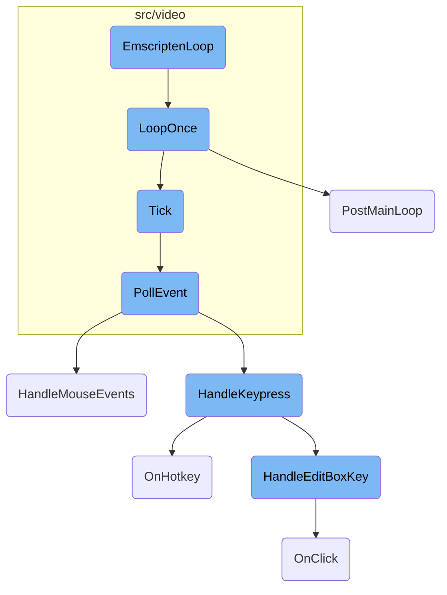
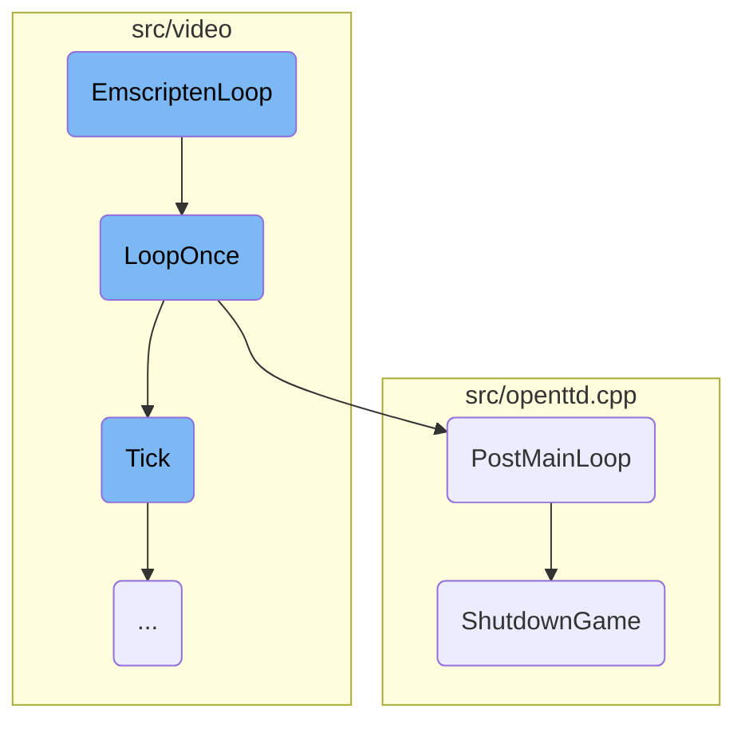
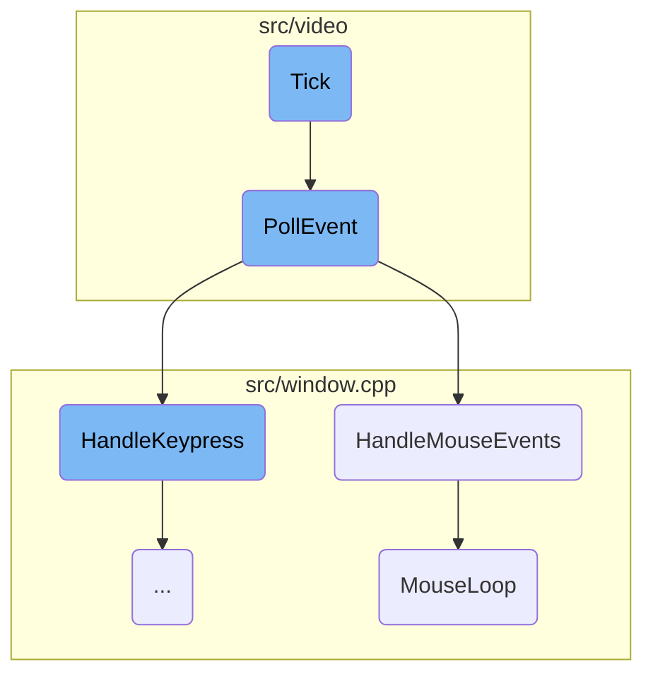
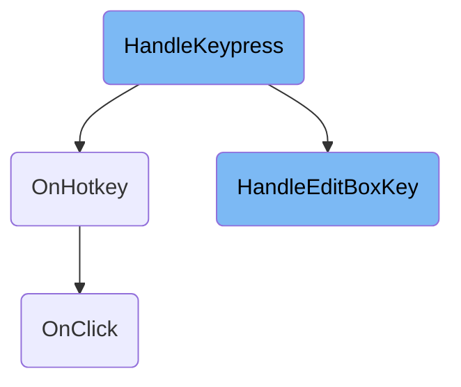

This document explains the <SwmToken path="src/video/sdl2_v.h" pos="80:5:5" line-data="	static void EmscriptenLoop(void *self) { ((VideoDriver_SDL_Base *)self)-&gt;LoopOnce(); }">`EmscriptenLoop`</SwmToken>, which is crucial for managing the main game loop in an Emscripten environment. The <SwmToken path="src/video/sdl2_v.h" pos="80:5:5" line-data="	static void EmscriptenLoop(void *self) { ((VideoDriver_SDL_Base *)self)-&gt;LoopOnce(); }">`EmscriptenLoop`</SwmToken> is responsible for converting a constant pointer back to a <SwmToken path="src/video/sdl2_v.h" pos="79:17:19" line-data="	/* Convert a constant pointer back to a non-constant pointer to a member function. */">`non-constant`</SwmToken> pointer to a member function, ensuring the main loop is managed correctly by the browser.

The <SwmToken path="src/video/sdl2_v.h" pos="80:5:5" line-data="	static void EmscriptenLoop(void *self) { ((VideoDriver_SDL_Base *)self)-&gt;LoopOnce(); }">`EmscriptenLoop`</SwmToken> starts by converting a constant pointer to a <SwmToken path="src/video/sdl2_v.h" pos="79:17:19" line-data="	/* Convert a constant pointer back to a non-constant pointer to a member function. */">`non-constant`</SwmToken> pointer to a member function. This is necessary for the Emscripten environment where the main loop is controlled by the browser. The <SwmToken path="src/video/sdl2_v.h" pos="80:24:24" line-data="	static void EmscriptenLoop(void *self) { ((VideoDriver_SDL_Base *)self)-&gt;LoopOnce(); }">`LoopOnce`</SwmToken> function then handles the main game loop, checking if the game should exit or continue. If the game is exiting, it calls <SwmToken path="src/video/sdl2_v.cpp" pos="629:5:5" line-data="		extern void PostMainLoop();">`PostMainLoop`</SwmToken> to save any unsaved data and perform cleanup operations. If the game continues, it calls the Tick function to proceed with the next iteration of the game loop. The Tick function manages the game state updates, input events, and rendering to ensure smooth gameplay. <SwmToken path="src/video/allegro_v.cpp" pos="339:4:4" line-data="bool VideoDriver_Allegro::PollEvent()">`PollEvent`</SwmToken> processes input events like mouse movements and keyboard presses, while <SwmToken path="src/window.cpp" pos="2874:2:2" line-data="void HandleMouseEvents()">`HandleMouseEvents`</SwmToken> and <SwmToken path="src/window.cpp" pos="2480:8:8" line-data="	switch (query-&gt;text.HandleKeyPress(key, keycode)) {">`HandleKeyPress`</SwmToken> handle specific mouse and keyboard interactions. Finally, <SwmToken path="src/window.cpp" pos="2771:4:4" line-data="static void MouseLoop(MouseClick click, int mousewheel)">`MouseLoop`</SwmToken> processes mouse actions within the game window, ensuring interactive gameplay.

Here is a high level diagram of the flow, showing only the most important functions:



# Flow drill down

First, we'll zoom into this section of the flow:



<SwmSnippet path="/src/video/sdl2_v.h" line="78">

---

## <SwmToken path="src/video/sdl2_v.h" pos="80:5:5" line-data="	static void EmscriptenLoop(void *self) { ((VideoDriver_SDL_Base *)self)-&gt;LoopOnce(); }">`EmscriptenLoop`</SwmToken>

The <SwmToken path="src/video/sdl2_v.h" pos="80:5:5" line-data="	static void EmscriptenLoop(void *self) { ((VideoDriver_SDL_Base *)self)-&gt;LoopOnce(); }">`EmscriptenLoop`</SwmToken> function is responsible for converting a constant pointer back to a <SwmToken path="src/video/sdl2_v.h" pos="79:17:19" line-data="	/* Convert a constant pointer back to a non-constant pointer to a member function. */">`non-constant`</SwmToken> pointer to a member function. This is crucial for the Emscripten environment where the main loop is managed by the browser.

```c
#ifdef __EMSCRIPTEN__
	/* Convert a constant pointer back to a non-constant pointer to a member function. */
	static void EmscriptenLoop(void *self) { ((VideoDriver_SDL_Base *)self)->LoopOnce(); }
```

---

</SwmSnippet>

<SwmSnippet path="/src/video/sdl2_v.cpp" line="619">

---

## <SwmToken path="src/video/sdl2_v.cpp" pos="619:4:4" line-data="void VideoDriver_SDL_Base::LoopOnce()">`LoopOnce`</SwmToken>

The <SwmToken path="src/video/sdl2_v.cpp" pos="619:4:4" line-data="void VideoDriver_SDL_Base::LoopOnce()">`LoopOnce`</SwmToken> function handles the main game loop. If the <SwmToken path="src/video/sdl2_v.cpp" pos="621:4:4" line-data="	if (_exit_game) {">`_exit_game`</SwmToken> flag is set, it calls <SwmToken path="src/video/sdl2_v.cpp" pos="629:5:5" line-data="		extern void PostMainLoop();">`PostMainLoop`</SwmToken> to perform cleanup operations and then cancels the Emscripten main loop. If the game is in bootstrap mode, it reloads the page; otherwise, it exits. If the game is not exiting, it calls the <SwmToken path="src/video/video_driver.cpp" pos="102:4:4" line-data="void VideoDriver::Tick()">`Tick`</SwmToken> function to proceed with the next iteration of the game loop.

```c++
void VideoDriver_SDL_Base::LoopOnce()
{
	if (_exit_game) {
#ifdef __EMSCRIPTEN__
		/* Emscripten is event-driven, and as such the main loop is inside
		 * the browser. So if _exit_game goes true, the main loop ends (the
		 * cancel call), but we still have to call the cleanup that is
		 * normally done at the end of the main loop for non-Emscripten.
		 * After that, Emscripten just halts, and the HTML shows a nice
		 * "bye, see you next time" message. */
		extern void PostMainLoop();
		PostMainLoop();

		emscripten_cancel_main_loop();
		emscripten_exit_pointerlock();
		/* In effect, the game ends here. As emscripten_set_main_loop() caused
		 * the stack to be unwound, the code after MainLoop() in
		 * openttd_main() is never executed. */
		if (_game_mode == GM_BOOTSTRAP) {
			EM_ASM(if (window["openttd_bootstrap_reload"]) openttd_bootstrap_reload());
		} else {
```

---

</SwmSnippet>

<SwmSnippet path="/src/openttd.cpp" line="457">

---

## <SwmToken path="src/openttd.cpp" pos="457:2:2" line-data="void PostMainLoop()">`PostMainLoop`</SwmToken>

The <SwmToken path="src/openttd.cpp" pos="457:2:2" line-data="void PostMainLoop()">`PostMainLoop`</SwmToken> function is called when the game is about to exit. It ensures that any unsaved data is saved and then calls <SwmToken path="src/openttd.cpp" pos="470:1:1" line-data="	ShutdownGame();">`ShutdownGame`</SwmToken> to perform the necessary cleanup operations, such as resetting the windowing system and freeing used memory.

```c++
void PostMainLoop()
{
	WaitTillSaved();

	/* only save config if we have to */
	if (_save_config) {
		SaveToConfig();
		SaveHotkeysToConfig();
		WindowDesc::SaveToConfig();
		SaveToHighScore();
	}

	/* Reset windowing system, stop drivers, free used memory, ... */
	ShutdownGame();
}
```

---

</SwmSnippet>

<SwmSnippet path="/src/openttd.cpp" line="280">

---

## <SwmToken path="src/openttd.cpp" pos="284:4:4" line-data="static void ShutdownGame()">`ShutdownGame`</SwmToken>

The <SwmToken path="src/openttd.cpp" pos="284:4:4" line-data="static void ShutdownGame()">`ShutdownGame`</SwmToken> function is responsible for uninitializing drivers, freeing allocated memory, and cleaning up various resources. This includes shutting down the network, stopping scripts, and resetting dynamically allocated variables. This function ensures that the game shuts down gracefully and frees all resources.

```c++
/**
 * Uninitializes drivers, frees allocated memory, cleans pools, ...
 * Generally, prepares the game for shutting down
 */
static void ShutdownGame()
{
	IConsoleFree();

	if (_network_available) NetworkShutDown(); // Shut down the network and close any open connections

	SocialIntegration::Shutdown();
	DriverFactoryBase::ShutdownDrivers();

	UnInitWindowSystem();

	/* stop the scripts */
	AI::Uninitialize(false);
	Game::Uninitialize(false);

	/* Uninitialize variables that are allocated dynamically */
	_gamelog.Reset();
```

---

</SwmSnippet>

Now, lets zoom into this section of the flow:



<SwmSnippet path="/src/video/video_driver.cpp" line="102">

---

## Tick

The <SwmToken path="src/video/video_driver.cpp" pos="102:4:4" line-data="void VideoDriver::Tick()">`Tick`</SwmToken> function is responsible for managing the main game loop. It checks if the game needs to update based on the current time and whether the game is threaded. If the game is not threaded and the next game tick is due, it calls the <SwmToken path="src/video/video_driver.cpp" pos="105:3:3" line-data="		this-&gt;GameLoop();">`GameLoop`</SwmToken> function to update the game state. Additionally, it handles input events, updates windows, and manages the drawing tick to ensure smooth rendering.

```c++
void VideoDriver::Tick()
{
	if (!this->is_game_threaded && std::chrono::steady_clock::now() >= this->next_game_tick) {
		this->GameLoop();

		/* For things like dedicated server, don't run a separate draw-tick. */
		if (!this->HasGUI()) {
			::InputLoop();
			::UpdateWindows();
			this->next_draw_tick = this->next_game_tick;
		}
	}

	auto now = std::chrono::steady_clock::now();
	if (this->HasGUI() && now >= this->next_draw_tick) {
		this->next_draw_tick += this->GetDrawInterval();
		/* Avoid next_draw_tick getting behind more and more if it cannot keep up. */
		if (this->next_draw_tick < now - ALLOWED_DRIFT * this->GetDrawInterval()) this->next_draw_tick = now;

		/* Locking video buffer can block (especially with vsync enabled), do it before taking game state lock. */
		this->LockVideoBuffer();
```

---

</SwmSnippet>

<SwmSnippet path="/src/video/allegro_v.cpp" line="339">

---

## <SwmToken path="src/video/allegro_v.cpp" pos="339:4:4" line-data="bool VideoDriver_Allegro::PollEvent()">`PollEvent`</SwmToken>

The <SwmToken path="src/video/allegro_v.cpp" pos="339:4:4" line-data="bool VideoDriver_Allegro::PollEvent()">`PollEvent`</SwmToken> function processes input events such as mouse movements, mouse clicks, and keyboard presses. It updates the mouse state, handles mouse button actions, and processes keyboard input. This function ensures that user interactions are captured and handled appropriately, triggering the necessary responses in the game.

```c++
bool VideoDriver_Allegro::PollEvent()
{
	poll_mouse();

	bool mouse_action = false;

	/* Mouse buttons */
	static int prev_button_state;
	if (prev_button_state != mouse_b) {
		uint diff = prev_button_state ^ mouse_b;
		while (diff != 0) {
			uint button = FindFirstBit(diff);
			ClrBit(diff, button);
			if (HasBit(mouse_b, button)) {
				/* Pressed mouse button */
				if (_rightclick_emulate && (key_shifts & KB_CTRL_FLAG)) {
					button = RIGHT_BUTTON;
					ClrBit(diff, RIGHT_BUTTON);
				}
				switch (button) {
					case LEFT_BUTTON:
```

---

</SwmSnippet>

<SwmSnippet path="/src/window.cpp" line="2871">

---

## <SwmToken path="src/window.cpp" pos="2874:2:2" line-data="void HandleMouseEvents()">`HandleMouseEvents`</SwmToken>

The <SwmToken path="src/window.cpp" pos="2874:2:2" line-data="void HandleMouseEvents()">`HandleMouseEvents`</SwmToken> function deals with mouse events generated by the video driver. It processes mouse clicks, double-clicks, and mouse wheel actions. It also handles hover events and updates the state of the cursor. This function ensures that mouse interactions are correctly interpreted and acted upon in the game.

```c++
/**
 * Handle a mouse event from the video driver
 */
void HandleMouseEvents()
{
	/* World generation is multithreaded and messes with companies.
	 * But there is no company related window open anyway, so _current_company is not used. */
	assert(HasModalProgress() || IsLocalCompany());

	/* Handle sprite picker before any GUI interaction */
	if (_newgrf_debug_sprite_picker.mode == SPM_REDRAW && _input_events_this_tick == 0) {
		/* We are done with the last draw-frame, so we know what sprites we
		 * clicked on. Reset the picker mode and invalidate the window. */
		_newgrf_debug_sprite_picker.mode = SPM_NONE;
		InvalidateWindowData(WC_SPRITE_ALIGNER, 0, 1);
	}

	static std::chrono::steady_clock::time_point double_click_time = {};
	static Point double_click_pos = {0, 0};

	/* Mouse event? */
```

---

</SwmSnippet>

<SwmSnippet path="/src/window.cpp" line="2771">

---

## <SwmToken path="src/window.cpp" pos="2771:4:4" line-data="static void MouseLoop(MouseClick click, int mousewheel)">`MouseLoop`</SwmToken>

The <SwmToken path="src/window.cpp" pos="2771:4:4" line-data="static void MouseLoop(MouseClick click, int mousewheel)">`MouseLoop`</SwmToken> function processes mouse interactions within the game window. It handles various mouse actions such as clicking, dragging, and scrolling. It ensures that these actions are correctly dispatched to the appropriate game elements, such as windows and viewports, allowing for interactive gameplay and user interface manipulation.

```c++
static void MouseLoop(MouseClick click, int mousewheel)
{
	/* World generation is multithreaded and messes with companies.
	 * But there is no company related window open anyway, so _current_company is not used. */
	assert(HasModalProgress() || IsLocalCompany());

	HandlePlacePresize();
	UpdateTileSelection();

	if (VpHandlePlaceSizingDrag()  == ES_HANDLED) return;
	if (HandleMouseDragDrop()      == ES_HANDLED) return;
	if (HandleWindowDragging()     == ES_HANDLED) return;
	if (HandleActiveWidget()       == ES_HANDLED) return;
	if (HandleViewportScroll()     == ES_HANDLED) return;

	HandleMouseOver();

	bool scrollwheel_scrolling = _settings_client.gui.scrollwheel_scrolling == SWS_SCROLL_MAP && (_cursor.v_wheel != 0 || _cursor.h_wheel != 0);
	if (click == MC_NONE && mousewheel == 0 && !scrollwheel_scrolling) return;

	int x = _cursor.pos.x;
```

---

</SwmSnippet>

Now, lets zoom into this section of the flow:



<SwmSnippet path="/src/window.cpp" line="2557">

---

## Handling keyboard input

The <SwmToken path="src/window.cpp" pos="2562:2:2" line-data="void HandleKeypress(uint keycode, char32_t key)">`HandleKeypress`</SwmToken> function is responsible for processing keyboard input. It first ensures that the input is valid and not from the private use area of Unicode. If the focused window has an edit box, the input is directed there. Otherwise, it checks for hotkeys and processes them accordingly.

```c++
/**
 * Handle keyboard input.
 * @param keycode Virtual keycode of the key.
 * @param key Unicode character of the key.
 */
void HandleKeypress(uint keycode, char32_t key)
{
	/* World generation is multithreaded and messes with companies.
	 * But there is no company related window open anyway, so _current_company is not used. */
	assert(HasModalProgress() || IsLocalCompany());

	/*
	 * The Unicode standard defines an area called the private use area. Code points in this
	 * area are reserved for private use and thus not portable between systems. For instance,
	 * Apple defines code points for the arrow keys in this area, but these are only printable
	 * on a system running OS X. We don't want these keys to show up in text fields and such,
	 * and thus we have to clear the unicode character when we encounter such a key.
	 */
	if (key >= 0xE000 && key <= 0xF8FF) key = 0;

	/*
```

---

</SwmSnippet>

<SwmSnippet path="/src/window.cpp" line="560">

---

### Processing hotkeys

The <SwmToken path="src/window.cpp" pos="565:4:4" line-data="EventState Window::OnHotkey(int hotkey)">`OnHotkey`</SwmToken> function handles the event when a hotkey is pressed. It checks if the hotkey corresponds to a valid widget and then either focuses an edit box or simulates a button click.

```c++
/**
 * A hotkey has been pressed.
 * @param hotkey  Hotkey index, by default a widget index of a button or editbox.
 * @return #ES_HANDLED if the key press has been handled, and the hotkey is not unavailable for some reason.
 */
EventState Window::OnHotkey(int hotkey)
{
	if (hotkey < 0) return ES_NOT_HANDLED;

	NWidgetCore *nw = this->GetWidget<NWidgetCore>(hotkey);
	if (nw == nullptr || nw->IsDisabled()) return ES_NOT_HANDLED;

	if (nw->type == WWT_EDITBOX) {
		if (this->IsShaded()) return ES_NOT_HANDLED;

		/* Focus editbox */
		this->SetFocusedWidget(hotkey);
		SetFocusedWindow(this);
	} else {
		/* Click button */
		this->OnClick(Point(), hotkey, 1);
```

---

</SwmSnippet>

<SwmSnippet path="/src/window.cpp" line="2465">

---

### Handling edit box keys

The <SwmToken path="src/window.cpp" pos="2473:4:4" line-data="EventState Window::HandleEditBoxKey(WidgetID wid, char32_t key, uint16_t keycode)">`HandleEditBoxKey`</SwmToken> function processes keypresses specifically for edit box widgets. It handles various actions such as editing text, moving the cursor, confirming input, and canceling input.

```c++
/**
 * Process keypress for editbox widget.
 * @param wid Editbox widget.
 * @param key     the Unicode value of the key.
 * @param keycode the untranslated key code including shift state.
 * @return #ES_HANDLED if the key press has been handled and no other
 *         window should receive the event.
 */
EventState Window::HandleEditBoxKey(WidgetID wid, char32_t key, uint16_t keycode)
{
	QueryString *query = this->GetQueryString(wid);
	if (query == nullptr) return ES_NOT_HANDLED;

	int action = QueryString::ACTION_NOTHING;

	switch (query->text.HandleKeyPress(key, keycode)) {
		case HKPR_EDITING:
			this->SetWidgetDirty(wid);
			this->OnEditboxChanged(wid);
			break;

```

---

</SwmSnippet>

<SwmSnippet path="/src/depot_gui.cpp" line="760">

---

### Simulating button clicks

The <SwmToken path="src/depot_gui.cpp" pos="760:3:3" line-data="	void OnClick([[maybe_unused]] Point pt, WidgetID widget, [[maybe_unused]] int click_count) override">`OnClick`</SwmToken> function simulates button clicks based on the widget ID. It handles various actions such as building vehicles, cloning, renaming, and selling all vehicles in a depot.

```c++
	void OnClick([[maybe_unused]] Point pt, WidgetID widget, [[maybe_unused]] int click_count) override
	{
		switch (widget) {
			case WID_D_MATRIX: // List
				this->DepotClick(pt.x, pt.y);
				break;

			case WID_D_BUILD: // Build vehicle
				ResetObjectToPlace();
				ShowBuildVehicleWindow(this->window_number, this->type);
				break;

			case WID_D_CLONE: // Clone button
				this->SetWidgetDirty(WID_D_CLONE);
				this->ToggleWidgetLoweredState(WID_D_CLONE);

				if (this->IsWidgetLowered(WID_D_CLONE)) {
					static const CursorID clone_icons[] = {
						SPR_CURSOR_CLONE_TRAIN, SPR_CURSOR_CLONE_ROADVEH,
						SPR_CURSOR_CLONE_SHIP, SPR_CURSOR_CLONE_AIRPLANE
					};
```

---

</SwmSnippet>

&nbsp;

*This is an auto-generated document by Swimm AI 🌊 and has not yet been verified by a human*

<SwmMeta version="3.0.0" repo-id="Z2l0aHViJTNBJTNBT3BlblRURC1jb3BpbG90LWRlbW8lM0ElM0Fzd2ltbWlv" repo-name="OpenTTD-copilot-demo"><sup>Powered by [Swimm](/)</sup></SwmMeta>
