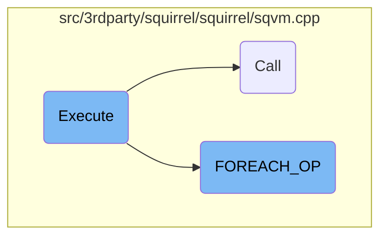
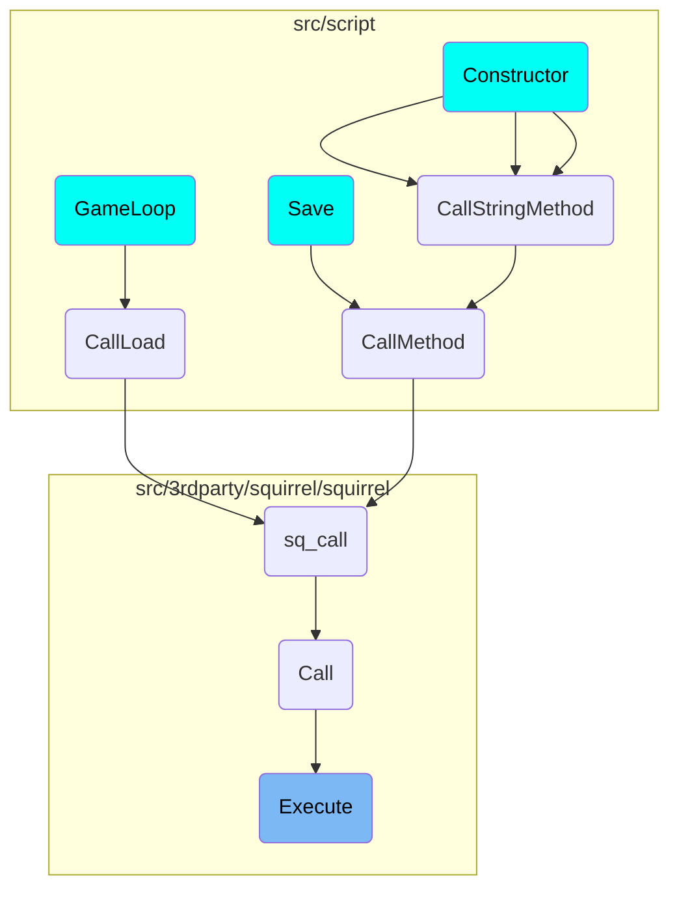

This document explains the <SwmToken path="src/3rdparty/squirrel/squirrel/sqvm.cpp" pos="696:4:4" line-data="bool SQVM::Execute(SQObjectPtr &amp;closure, SQInteger target, SQInteger nargs, SQInteger stackbase,SQObjectPtr &amp;outres, SQBool raiseerror,ExecutionType et)">`Execute`</SwmToken> function, which is responsible for executing a given closure with specified parameters. It handles different execution types such as regular calls, resuming generators, and managing suspended states. The function ensures that the appropriate operation is executed based on the type of closure and manages the stack and traps accordingly.

The <SwmToken path="src/3rdparty/squirrel/squirrel/sqvm.cpp" pos="696:4:4" line-data="bool SQVM::Execute(SQObjectPtr &amp;closure, SQInteger target, SQInteger nargs, SQInteger stackbase,SQObjectPtr &amp;outres, SQBool raiseerror,ExecutionType et)">`Execute`</SwmToken> function is like a manager that decides how to run different tasks based on their type. It can handle regular tasks, resume paused tasks, and manage tasks that are waiting. It makes sure everything runs smoothly by managing the task list and handling any errors that come up. Think of it as a conductor in an orchestra, ensuring each musician plays their part at the right time.

# Flow drill down



<SwmSnippet path="/src/3rdparty/squirrel/squirrel/sqvm.cpp" line="696">

---

## Execute Function

The <SwmToken path="src/3rdparty/squirrel/squirrel/sqvm.cpp" pos="696:4:4" line-data="bool SQVM::Execute(SQObjectPtr &amp;closure, SQInteger target, SQInteger nargs, SQInteger stackbase,SQObjectPtr &amp;outres, SQBool raiseerror,ExecutionType et)">`Execute`</SwmToken> function is responsible for executing a given closure with specified parameters. It handles different execution types such as regular calls, resuming generators, and handling suspended states. This function ensures that the appropriate operation is executed based on the type of closure and manages the stack and traps accordingly.

```c++
bool SQVM::Execute(SQObjectPtr &closure, SQInteger target, SQInteger nargs, SQInteger stackbase,SQObjectPtr &outres, SQBool raiseerror,ExecutionType et)
{
	if ((_nnativecalls + 1) > MAX_NATIVE_CALLS) { Raise_Error("Native stack overflow"); return false; }
	_nnativecalls++;
	AutoDec ad(&_nnativecalls);
	SQInteger traps = 0;
	//temp_reg vars for OP_CALL
	SQInteger ct_target;
	SQInteger ct_stackbase;
	bool ct_tailcall;

	switch(et) {
		case ET_CALL: {
			SQInteger last_top = _top;
			temp_reg = closure;
			if(!StartCall(_closure(temp_reg), _top - nargs, nargs, stackbase, false)) {
				//call the handler if there are no calls in the stack, if not relies on the previous node
				if(ci == nullptr) CallErrorHandler(_lasterror);
				return false;
			}
			if (_funcproto(_closure(temp_reg)->_function)->_bgenerator) {
```

---

</SwmSnippet>

<SwmSnippet path="/src/3rdparty/squirrel/squirrel/sqvm.cpp" line="707">

---

### Handling Different Execution Types

The switch statement in the <SwmToken path="src/3rdparty/squirrel/squirrel/sqvm.cpp" pos="696:4:4" line-data="bool SQVM::Execute(SQObjectPtr &amp;closure, SQInteger target, SQInteger nargs, SQInteger stackbase,SQObjectPtr &amp;outres, SQBool raiseerror,ExecutionType et)">`Execute`</SwmToken> function handles different execution types like <SwmToken path="src/3rdparty/squirrel/squirrel/sqvm.cpp" pos="708:3:3" line-data="		case ET_CALL: {">`ET_CALL`</SwmToken>, <SwmToken path="src/3rdparty/squirrel/squirrel/sqvm.cpp" pos="727:3:3" line-data="		case ET_RESUME_GENERATOR: _generator(closure)-&gt;Resume(this, target); ci-&gt;_root = SQTrue; traps += ci-&gt;_etraps; break;">`ET_RESUME_GENERATOR`</SwmToken>, and <SwmToken path="src/3rdparty/squirrel/squirrel/sqvm.cpp" pos="728:3:3" line-data="		case ET_RESUME_VM:">`ET_RESUME_VM`</SwmToken>. Each case manages the state of the virtual machine and prepares it for the next operation.

```c++
	switch(et) {
		case ET_CALL: {
			SQInteger last_top = _top;
			temp_reg = closure;
			if(!StartCall(_closure(temp_reg), _top - nargs, nargs, stackbase, false)) {
				//call the handler if there are no calls in the stack, if not relies on the previous node
				if(ci == nullptr) CallErrorHandler(_lasterror);
				return false;
			}
			if (_funcproto(_closure(temp_reg)->_function)->_bgenerator) {
				SQGenerator *gen = SQGenerator::Create(_ss(this), _closure(temp_reg));
				_GUARD(gen->Yield(this));
				Return(1, ci->_target, temp_reg);
				outres = gen;
				CLEARSTACK(last_top);
				return true;
			}
			ci->_root = SQTrue;
					  }
			break;
		case ET_RESUME_GENERATOR: _generator(closure)->Resume(this, target); ci->_root = SQTrue; traps += ci->_etraps; break;
```

---

</SwmSnippet>

<SwmSnippet path="/src/3rdparty/squirrel/squirrel/sqvm.cpp" line="780">

---

### Managing Function Calls

The <SwmToken path="src/3rdparty/squirrel/squirrel/sqvm.cpp" pos="696:4:4" line-data="bool SQVM::Execute(SQObjectPtr &amp;closure, SQInteger target, SQInteger nargs, SQInteger stackbase,SQObjectPtr &amp;outres, SQBool raiseerror,ExecutionType et)">`Execute`</SwmToken> function also manages function calls through the <SwmToken path="src/3rdparty/squirrel/squirrel/sqvm.cpp" pos="780:3:3" line-data="			case _OP_CALL: {">`_OP_CALL`</SwmToken> and <SwmToken path="src/3rdparty/squirrel/squirrel/sqvm.cpp" pos="769:3:3" line-data="			case _OP_TAILCALL:">`_OP_TAILCALL`</SwmToken> operations. It determines the type of closure and either starts a new call, handles native closures, or creates class instances as needed.

```c++
			case _OP_CALL: {
					ct_tailcall = false;
					ct_target = arg0;
					temp_reg = STK(arg1);
					ct_stackbase = _stackbase+arg2;

common_call:
					SQObjectPtr clo = temp_reg;
					SQInteger last_top = _top;
					switch (type(clo)) {
					case OT_CLOSURE:{
						_GUARD(StartCall(_closure(clo), ct_target, arg3, ct_stackbase, ct_tailcall));
						if (_funcproto(_closure(clo)->_function)->_bgenerator) {
							SQGenerator *gen = SQGenerator::Create(_ss(this), _closure(clo));
							_GUARD(gen->Yield(this));
							Return(1, ct_target, clo);
							STK(ct_target) = gen;
						}
						CLEARSTACK(last_top);
						}
						continue;
```

---

</SwmSnippet>

<SwmSnippet path="/src/3rdparty/squirrel/squirrel/sqvm.cpp" line="1481">

---

## Call Function

The <SwmToken path="src/3rdparty/squirrel/squirrel/sqvm.cpp" pos="1481:4:4" line-data="bool SQVM::Call(SQObjectPtr &amp;closure,SQInteger nparams,SQInteger stackbase,SQObjectPtr &amp;outres,SQBool raiseerror,SQBool can_suspend)">`Call`</SwmToken> function is used to invoke a closure with a specified number of parameters. It differentiates between regular closures, native closures, and class constructors, ensuring that the appropriate call mechanism is used. This function is crucial for managing the invocation of functions within the virtual machine.

```c++
bool SQVM::Call(SQObjectPtr &closure,SQInteger nparams,SQInteger stackbase,SQObjectPtr &outres,SQBool raiseerror,SQBool can_suspend)
{
	[[maybe_unused]] SQInteger prevstackbase = _stackbase;
	switch(type(closure)) {
	case OT_CLOSURE: {
		assert(!can_suspend || this->_can_suspend);
		SQBool backup_suspend = this->_can_suspend;
		this->_can_suspend = can_suspend;
		bool ret = Execute(closure, _top - nparams, nparams, stackbase,outres,raiseerror);
		this->_can_suspend = backup_suspend;
		return ret;
	}
		break;
	case OT_NATIVECLOSURE: {
		bool suspend;
		return CallNative(_nativeclosure(closure), nparams, stackbase, outres,suspend);

	}
		break;
	case OT_CLASS: {
		SQObjectPtr constr;
```

---

</SwmSnippet>

<SwmSnippet path="/src/3rdparty/squirrel/squirrel/sqvm.cpp" line="495">

---

## <SwmToken path="src/3rdparty/squirrel/squirrel/sqvm.cpp" pos="496:4:4" line-data="bool SQVM::FOREACH_OP(SQObjectPtr &amp;o1,SQObjectPtr &amp;o2,SQObjectPtr">`FOREACH_OP`</SwmToken> Function

The <SwmToken path="src/3rdparty/squirrel/squirrel/sqvm.cpp" pos="496:4:4" line-data="bool SQVM::FOREACH_OP(SQObjectPtr &amp;o1,SQObjectPtr &amp;o2,SQObjectPtr">`FOREACH_OP`</SwmToken> function handles iteration over different types of objects such as tables, arrays, strings, and classes. It uses the <SwmToken path="src/3rdparty/squirrel/squirrel/sqvm.cpp" pos="502:13:13" line-data="		if((nrefidx = _table(o1)-&gt;Next(false,o4, o2, o3)) == -1) _FINISH(exitpos);">`Next`</SwmToken> method to retrieve the next element in the collection and manages the iteration state. This function is essential for implementing loops and iterating over collections within the virtual machine.

```c++
#define _FINISH(howmuchtojump) {jump = howmuchtojump; return true; }
bool SQVM::FOREACH_OP(SQObjectPtr &o1,SQObjectPtr &o2,SQObjectPtr
&o3,SQObjectPtr &o4,SQInteger arg_2,int exitpos,int &jump)
{
	SQInteger nrefidx;
	switch(type(o1)) {
	case OT_TABLE:
		if((nrefidx = _table(o1)->Next(false,o4, o2, o3)) == -1) _FINISH(exitpos);
		o4 = (SQInteger)nrefidx; _FINISH(1);
	case OT_ARRAY:
		if((nrefidx = _array(o1)->Next(o4, o2, o3)) == -1) _FINISH(exitpos);
		o4 = (SQInteger) nrefidx; _FINISH(1);
	case OT_STRING:
		if((nrefidx = _string(o1)->Next(o4, o2, o3)) == -1)_FINISH(exitpos);
		o4 = (SQInteger)nrefidx; _FINISH(1);
	case OT_CLASS:
		if((nrefidx = _class(o1)->Next(o4, o2, o3)) == -1)_FINISH(exitpos);
		o4 = (SQInteger)nrefidx; _FINISH(1);
	case OT_USERDATA:
	case OT_INSTANCE:
		if(_delegable(o1)->_delegate) {
```

---

</SwmSnippet>

# Where is this flow used?

This flow is used multiple times in the codebase as represented in the following diagram:

(Note - these are only some of the entry points of this flow)



&nbsp;

*This is an auto-generated document by Swimm AI 🌊 and has not yet been verified by a human*

<SwmMeta version="3.0.0" repo-id="Z2l0aHViJTNBJTNBT3BlblRURC1jb3BpbG90LWRlbW8lM0ElM0Fzd2ltbWlv" repo-name="OpenTTD-copilot-demo"><sup>Powered by [Swimm](/)</sup></SwmMeta>
