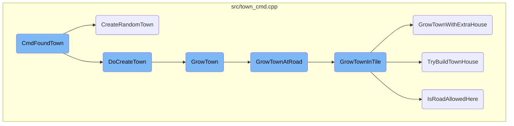
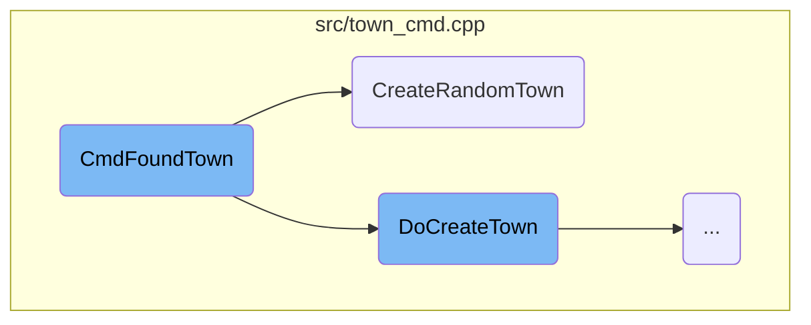
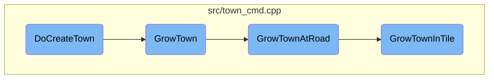

This document explains the process of founding a new town in the game. The process involves several steps, including validating parameters, creating the town, and managing its growth.

The process starts with the <SwmToken path="src/town_cmd.cpp" pos="2113:13:13" line-data="std::tuple&lt;CommandCost, Money, TownID&gt; CmdFoundTown(DoCommandFlag flags, TileIndex tile, TownSize size, bool city, TownLayout layout, bool random_location, uint32_t townnameparts, const std::string &amp;text)">`CmdFoundTown`</SwmToken> function, which takes various parameters like location, size, and layout to create a new town. It first checks if these parameters are valid and if the town name is unique. If everything is correct, it proceeds to create the town. If a random location is requested, the <SwmToken path="src/town_cmd.cpp" pos="2332:5:5" line-data="static Town *CreateRandomTown(uint attempts, uint32_t townnameparts, TownSize size, bool city, TownLayout layout)">`CreateRandomTown`</SwmToken> function tries to find a suitable spot. Once the town is created, the <SwmToken path="src/town_cmd.cpp" pos="1988:4:4" line-data="static void DoCreateTown(Town *t, TileIndex tile, uint32_t townnameparts, TownSize size, bool city, TownLayout layout, bool manual)">`DoCreateTown`</SwmToken> function initializes its properties. The town then grows through functions like <SwmToken path="src/town_cmd.cpp" pos="1858:4:4" line-data="static bool GrowTown(Town *t)">`GrowTown`</SwmToken>, <SwmToken path="src/town_cmd.cpp" pos="1762:4:4" line-data="static bool GrowTownAtRoad(Town *t, TileIndex tile)">`GrowTownAtRoad`</SwmToken>, and <SwmToken path="src/town_cmd.cpp" pos="1512:4:4" line-data="static void GrowTownInTile(TileIndex *tile_ptr, RoadBits cur_rb, DiagDirection target_dir, Town *t1)">`GrowTownInTile`</SwmToken>, which handle the expansion of roads and buildings.

Here is a high level diagram of the flow, showing only the most important functions:



# Flow drill down

First, we'll zoom into this section of the flow:



<SwmSnippet path="/src/town_cmd.cpp" line="2101">

---

## Creating a New Town

The <SwmToken path="src/town_cmd.cpp" pos="2113:13:13" line-data="std::tuple&lt;CommandCost, Money, TownID&gt; CmdFoundTown(DoCommandFlag flags, TileIndex tile, TownSize size, bool city, TownLayout layout, bool random_location, uint32_t townnameparts, const std::string &amp;text)">`CmdFoundTown`</SwmToken> function is responsible for creating a new town. It takes various parameters such as the location, size, and layout of the town, and whether it should be a city. The function first validates these parameters to ensure they are within acceptable ranges and conform to game rules. For example, it checks if the town size is valid and if the layout is allowed. It also ensures that the town name is unique, either by generating a new name or verifying a custom name provided by the user. If all checks pass, the function proceeds to allocate resources for the new town and updates the game state accordingly.

```c++
/**
 * Create a new town.
 * @param flags The type of operation.
 * @param tile The coordinates where town is built.
 * @param size The size of the town (@see TownSize).
 * @param city Should we build a city?
 * @param layout The town road layout (@see TownLayout).
 * @param random_location Should we use a random location? (randomize \c tile )
 * @param townnameparts Town name parts.
 * @param text Custom name for the town. If empty, the town name parts will be used.
 * @return The cost of this operation or an error.
 */
std::tuple<CommandCost, Money, TownID> CmdFoundTown(DoCommandFlag flags, TileIndex tile, TownSize size, bool city, TownLayout layout, bool random_location, uint32_t townnameparts, const std::string &text)
{
	TownNameParams par(_settings_game.game_creation.town_name);

	if (size >= TSZ_END) return { CMD_ERROR, 0, INVALID_TOWN };
	if (layout >= NUM_TLS) return { CMD_ERROR, 0, INVALID_TOWN };

	/* Some things are allowed only in the scenario editor and for game scripts. */
	if (_game_mode != GM_EDITOR && _current_company != OWNER_DEITY) {
```

---

</SwmSnippet>

<SwmSnippet path="/src/town_cmd.cpp" line="2323">

---

### Handling Random Town Creation

The <SwmToken path="src/town_cmd.cpp" pos="2332:5:5" line-data="static Town *CreateRandomTown(uint attempts, uint32_t townnameparts, TownSize size, bool city, TownLayout layout)">`CreateRandomTown`</SwmToken> function is called when a random location for the new town is requested. This function attempts to place a town at a random tile, ensuring that the tile is suitable for town placement. It tries multiple times to find a valid location, checking for conditions like proximity to water and whether the town can grow at the chosen spot. If a valid location is found, the town is created and initialized. If not, the function returns <SwmToken path="src/town_cmd.cpp" pos="2330:15:15" line-data=" * @return The town object, or nullptr if we failed to create a town anywhere.">`nullptr`</SwmToken>, indicating that no suitable location was found.

```c++
/**
 * Create a random town somewhere in the world.
 * @param attempts How many times should we try?
 * @param townnameparts The name of the town.
 * @param size The size preset of the town.
 * @param city Should we build a city?
 * @param layout The road layout to build.
 * @return The town object, or nullptr if we failed to create a town anywhere.
 */
static Town *CreateRandomTown(uint attempts, uint32_t townnameparts, TownSize size, bool city, TownLayout layout)
{
	assert(_game_mode == GM_EDITOR || _generating_world); // These are the preconditions for CMD_DELETE_TOWN

	if (!Town::CanAllocateItem()) return nullptr;

	do {
		/* Generate a tile index not too close from the edge */
		TileIndex tile = AlignTileToGrid(RandomTile(), layout);

		/* if we tried to place the town on water, slide it over onto
		 * the nearest likely-looking spot */
```

---

</SwmSnippet>

Now, lets zoom into this section of the flow:



<SwmSnippet path="/src/town_cmd.cpp" line="1988">

---

## Creating and initializing a new town

The function <SwmToken path="src/town_cmd.cpp" pos="1988:4:4" line-data="static void DoCreateTown(Town *t, TileIndex tile, uint32_t townnameparts, TownSize size, bool city, TownLayout layout, bool manual)">`DoCreateTown`</SwmToken> is responsible for creating and initializing a new town. It sets the town's initial properties, such as location, population, and growth rate. It also determines the town's layout and size, and initializes various town-specific settings like cargo requirements for growth.

```c++
static void DoCreateTown(Town *t, TileIndex tile, uint32_t townnameparts, TownSize size, bool city, TownLayout layout, bool manual)
{
	AutoRestoreBackup backup(_generating_town, true);

	t->xy = tile;
	t->cache.num_houses = 0;
	t->time_until_rebuild = 10;
	UpdateTownRadius(t);
	t->flags = 0;
	t->cache.population = 0;
	InitializeBuildingCounts(t);
	/* Spread growth across ticks so even if there are many
	 * similar towns they're unlikely to grow all in one tick */
	t->grow_counter = t->index % Ticks::TOWN_GROWTH_TICKS;
	t->growth_rate = TownTicksToGameTicks(250);
	t->show_zone = false;

	_town_kdtree.Insert(t->index);

	/* Set the default cargo requirement for town growth */
	switch (_settings_game.game_creation.landscape) {
```

---

</SwmSnippet>

<SwmSnippet path="/src/town_cmd.cpp" line="1858">

---

## Growing the town

The function <SwmToken path="src/town_cmd.cpp" pos="1858:4:4" line-data="static bool GrowTown(Town *t)">`GrowTown`</SwmToken> handles the growth of the town by either expanding existing roads or creating new ones. It checks for available road tiles and attempts to grow the town from those points. If no suitable road tiles are found, it tries to build new roads by clearing land.

```c++
static bool GrowTown(Town *t)
{
	static const TileIndexDiffC _town_coord_mod[] = {
		{-1,  0},
		{ 1,  1},
		{ 1, -1},
		{-1, -1},
		{-1,  0},
		{ 0,  2},
		{ 2,  0},
		{ 0, -2},
		{-1, -1},
		{-2,  2},
		{ 2,  2},
		{ 2, -2},
		{ 0,  0}
	};

	/* Current "company" is a town */
	Backup<CompanyID> cur_company(_current_company, OWNER_TOWN);

```

---

</SwmSnippet>

<SwmSnippet path="/src/town_cmd.cpp" line="1762">

---

### Growing at road tiles

The function <SwmToken path="src/town_cmd.cpp" pos="1762:4:4" line-data="static bool GrowTownAtRoad(Town *t, TileIndex tile)">`GrowTownAtRoad`</SwmToken> attempts to grow the town at a given road tile. It checks the town's layout and determines the direction in which to extend the town. It also handles special cases like tunnels and bridges, ensuring the town grows logically and cohesively.

```c++
static bool GrowTownAtRoad(Town *t, TileIndex tile)
{
	/* Special case.
	 * @see GrowTownInTile Check the else if
	 */
	DiagDirection target_dir = DIAGDIR_END; // The direction in which we want to extend the town

	assert(tile < Map::Size());

	/* Number of times to search.
	 * Better roads, 2X2 and 3X3 grid grow quite fast so we give
	 * them a little handicap. */
	switch (t->layout) {
		case TL_BETTER_ROADS:
			_grow_town_result = 10 + t->cache.num_houses * 2 / 9;
			break;

		case TL_3X3_GRID:
		case TL_2X2_GRID:
			_grow_town_result = 10 + t->cache.num_houses * 1 / 9;
			break;
```

---

</SwmSnippet>

<SwmSnippet path="/src/town_cmd.cpp" line="1512">

---

### Growing in specific tiles

The function <SwmToken path="src/town_cmd.cpp" pos="1512:4:4" line-data="static void GrowTownInTile(TileIndex *tile_ptr, RoadBits cur_rb, DiagDirection target_dir, Town *t1)">`GrowTownInTile`</SwmToken> manages the detailed logic of growing the town within specific tiles. It considers various town layouts and ensures that roads and houses are placed appropriately. It also handles terrain adjustments and checks if the town is allowed to build roads in the specified tiles.

```c++
static void GrowTownInTile(TileIndex *tile_ptr, RoadBits cur_rb, DiagDirection target_dir, Town *t1)
{
	RoadBits rcmd = ROAD_NONE;  // RoadBits for the road construction command
	TileIndex tile = *tile_ptr; // The main tile on which we base our growth

	assert(tile < Map::Size());

	if (cur_rb == ROAD_NONE) {
		/* Tile has no road. First reset the status counter
		 * to say that this is the last iteration. */
		_grow_town_result = GROWTH_SEARCH_STOPPED;

		if (!TownAllowedToBuildRoads()) return;
		if (!_settings_game.economy.allow_town_level_crossings && IsTileType(tile, MP_RAILWAY)) return;

		/* Remove hills etc */
		if (!_settings_game.construction.build_on_slopes || Chance16(1, 6)) LevelTownLand(tile);

		/* Is a road allowed here? */
		switch (t1->layout) {
			default: NOT_REACHED();
```

---

</SwmSnippet>

&nbsp;

*This is an auto-generated document by Swimm AI 🌊 and has not yet been verified by a human*

<SwmMeta version="3.0.0" repo-id="Z2l0aHViJTNBJTNBT3BlblRURC1jb3BpbG90LWRlbW8lM0ElM0Fzd2ltbWlv" repo-name="OpenTTD-copilot-demo"><sup>Powered by [Swimm](/)</sup></SwmMeta>
