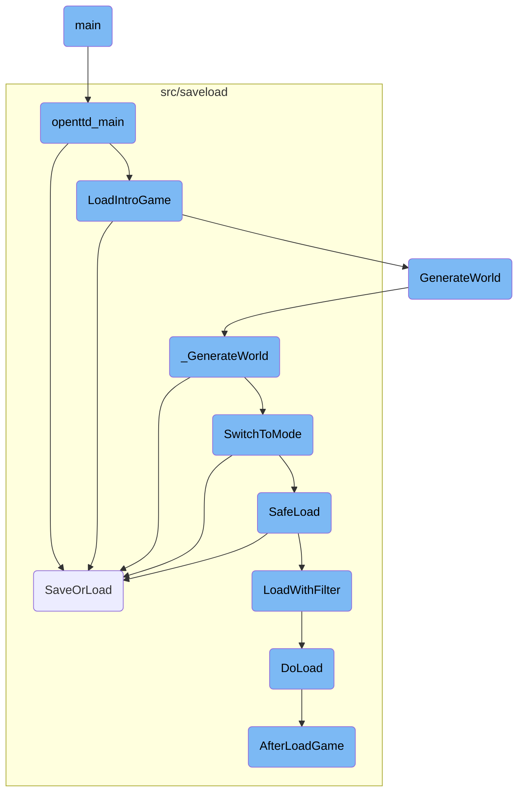
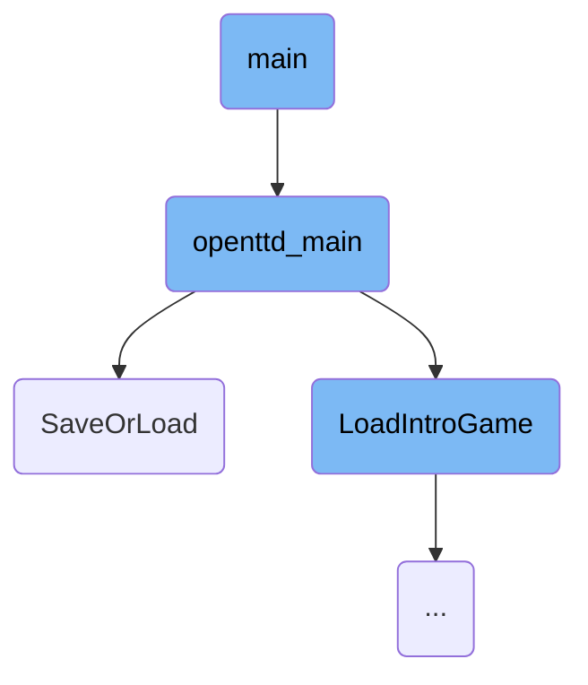
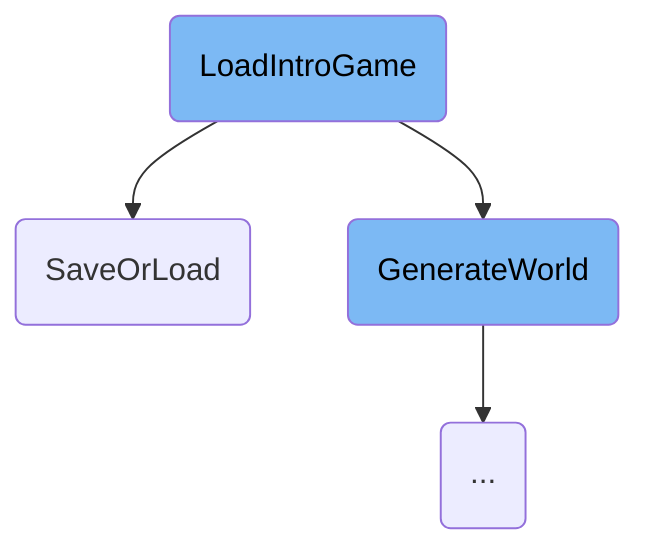
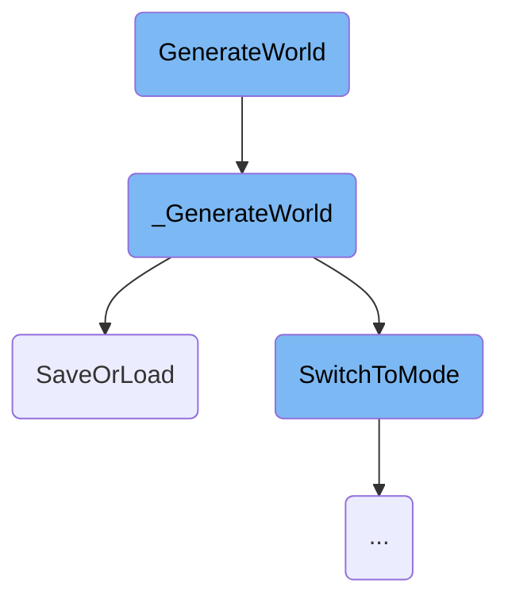
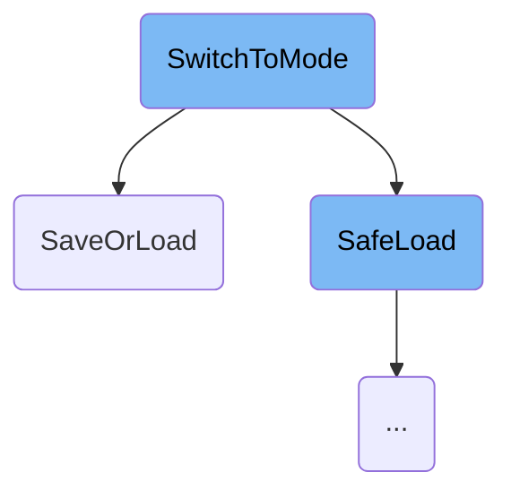
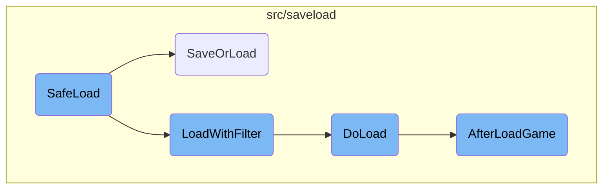

This document provides an overview of the main function's responsibilities in setting up and managing the game environment. It covers the initialization process, handling command-line arguments, and transitioning between different game modes.

The main function is the starting point of the game. It begins by ensuring that all command-line arguments are valid, initializes the crash log, sets a random seed, and ignores certain system signals. It then calls another function to handle the game's main operations. This includes processing command-line arguments to configure game settings, managing save and load operations, and transitioning between different game modes like the main menu, scenario editor, or dedicated server mode. The flow ensures that the game environment is set up correctly based on user preferences and system capabilities, providing a seamless gaming experience.

Here is a high level diagram of the flow, showing only the most important functions:



# Flow drill down

First, we'll zoom into this section of the flow:



<SwmSnippet path="/src/os/unix/unix_main.cpp" line="21">

---

## Initializing the Game Environment

The <SwmToken path="src/os/unix/unix_main.cpp" pos="21:4:4" line-data="int CDECL main(int argc, char *argv[])">`main`</SwmToken> function is the entry point for the Unix version of the game. It ensures that the command-line arguments are valid <SwmToken path="src/os/unix/unix_main.cpp" pos="23:17:19" line-data="	/* Make sure our arguments contain only valid UTF-8 characters. */">`UTF-8`</SwmToken>, initializes the crash log, sets a random seed, and ignores the SIGPIPE signal. Finally, it calls <SwmToken path="src/os/unix/unix_main.cpp" pos="32:3:3" line-data="	return openttd_main(std::span(argv, argc));">`openttd_main`</SwmToken> to proceed with the game initialization.

```c++
int CDECL main(int argc, char *argv[])
{
	/* Make sure our arguments contain only valid UTF-8 characters. */
	for (int i = 0; i < argc; i++) StrMakeValidInPlace(argv[i]);

	CrashLog::InitialiseCrashLog();

	SetRandomSeed(time(nullptr));

	signal(SIGPIPE, SIG_IGN);

	return openttd_main(std::span(argv, argc));
```

---

</SwmSnippet>

<SwmSnippet path="/src/openttd.cpp" line="504">

---

## Handling Command-Line Arguments

The <SwmToken path="src/openttd.cpp" pos="504:2:2" line-data="int openttd_main(std::span&lt;char * const&gt; arguments)">`openttd_main`</SwmToken> function processes the command-line arguments to configure various game settings such as graphics, sound, and video drivers. It also handles special modes like dedicated server mode and scenario editor mode. This setup is crucial for tailoring the game environment based on user preferences and system capabilities.

```c++
int openttd_main(std::span<char * const> arguments)
{
	_game_session_stats.start_time = std::chrono::steady_clock::now();
	_game_session_stats.savegame_size = std::nullopt;

	std::string musicdriver;
	std::string sounddriver;
	std::string videodriver;
	std::string blitter;
	std::string graphics_set;
	std::string sounds_set;
	std::string music_set;
	Dimension resolution = {0, 0};
	std::unique_ptr<AfterNewGRFScan> scanner = std::make_unique<AfterNewGRFScan>();
	bool dedicated = false;
	bool only_local_path = false;

	extern bool _dedicated_forks;
	_dedicated_forks = false;

	_game_mode = GM_MENU;
```

---

</SwmSnippet>

<SwmSnippet path="/src/saveload/saveload.cpp" line="3071">

---

### Save or Load Game

The <SwmToken path="src/saveload/saveload.cpp" pos="3071:2:2" line-data="SaveOrLoadResult SaveOrLoad(const std::string &amp;filename, SaveLoadOperation fop, DetailedFileType dft, Subdirectory sb, bool threaded)">`SaveOrLoad`</SwmToken> function manages the <SwmToken path="src/saveload/saveload.cpp" pos="3063:17:19" line-data=" * Main Save or Load function where the high-level saveload functions are">`high-level`</SwmToken> save and load operations. It opens the savegame file, selects the appropriate format, and checks versions. This function ensures that the game state can be saved and loaded correctly, which is essential for providing a seamless user experience.

```c++
SaveOrLoadResult SaveOrLoad(const std::string &filename, SaveLoadOperation fop, DetailedFileType dft, Subdirectory sb, bool threaded)
{
	/* An instance of saving is already active, so don't go saving again */
	if (_sl.saveinprogress && fop == SLO_SAVE && dft == DFT_GAME_FILE && threaded) {
		/* if not an autosave, but a user action, show error message */
		if (!_do_autosave) ShowErrorMessage(STR_ERROR_SAVE_STILL_IN_PROGRESS, INVALID_STRING_ID, WL_ERROR);
		return SL_OK;
	}
	WaitTillSaved();

	try {
		/* Load a TTDLX or TTDPatch game */
		if (fop == SLO_LOAD && dft == DFT_OLD_GAME_FILE) {
			ResetSaveloadData();

			InitializeGame(256, 256, true, true); // set a mapsize of 256x256 for TTDPatch games or it might get confused

			/* TTD/TTO savegames have no NewGRFs, TTDP savegame have them
			 * and if so a new NewGRF list will be made in LoadOldSaveGame.
			 * Note: this is done here because AfterLoadGame is also called
			 * for OTTD savegames which have their own NewGRF logic. */
```

---

</SwmSnippet>

Now, lets zoom into this section of the flow:



<SwmSnippet path="/src/openttd.cpp" line="311">

---

## Loading the Introduction Game

The <SwmToken path="src/openttd.cpp" pos="315:4:4" line-data="static void LoadIntroGame(bool load_newgrfs = true)">`LoadIntroGame`</SwmToken> function is responsible for setting up the game's introduction screen. It starts by setting the game mode to the main menu and optionally resets the <SwmToken path="src/saveload/saveload.cpp" pos="3089:13:13" line-data="			 * and if so a new NewGRF list will be made in LoadOldSaveGame.">`NewGRF`</SwmToken> configuration. The main window system is then reset and the initial window and colors are set up. The function attempts to load the default opening screen savegame (<SwmPath>[media/baseset/opntitle.dat](media/baseset/opntitle.dat)</SwmPath>). If this loading fails, it generates an empty world and sets the local company to spectator mode. If the loading succeeds, it sets the local company to the first company. Finally, it adjusts the game's zoom, unpauses the game, fixes the cursor, checks for missing glyphs, and ensures the correct music is playing.

```c++
/**
 * Load the introduction game.
 * @param load_newgrfs Whether to load the NewGRFs or not.
 */
static void LoadIntroGame(bool load_newgrfs = true)
{
	_game_mode = GM_MENU;

	if (load_newgrfs) ResetGRFConfig(false);

	/* Setup main window */
	ResetWindowSystem();
	SetupColoursAndInitialWindow();

	/* Load the default opening screen savegame */
	if (SaveOrLoad("opntitle.dat", SLO_LOAD, DFT_GAME_FILE, BASESET_DIR) != SL_OK) {
		GenerateWorld(GWM_EMPTY, 64, 64); // if failed loading, make empty world.
		SetLocalCompany(COMPANY_SPECTATOR);
	} else {
		SetLocalCompany(COMPANY_FIRST);
	}
```

---

</SwmSnippet>

Now, lets zoom into this section of the flow:



<SwmSnippet path="/src/genworld.cpp" line="275">

---

## <SwmToken path="src/genworld.cpp" pos="282:2:2" line-data="void GenerateWorld(GenWorldMode mode, uint size_x, uint size_y, bool reset_settings)">`GenerateWorld`</SwmToken>

The <SwmToken path="src/genworld.cpp" pos="282:2:2" line-data="void GenerateWorld(GenWorldMode mode, uint size_x, uint size_y, bool reset_settings)">`GenerateWorld`</SwmToken> function is responsible for setting up the initial parameters for world generation, such as the mode, map size, and whether to reset settings. It initializes the game, prepares the progress display, and sets the map height limit based on the generation mode. It also loads necessary graphics and initializes various game elements before calling <SwmToken path="src/genworld.cpp" pos="87:4:4" line-data="static void _GenerateWorld()">`_GenerateWorld`</SwmToken> to perform the actual world generation.

```c++
/**
 * Generate a world.
 * @param mode The mode of world generation (see GenWorldMode).
 * @param size_x The X-size of the map.
 * @param size_y The Y-size of the map.
 * @param reset_settings Whether to reset the game configuration (used for restart)
 */
void GenerateWorld(GenWorldMode mode, uint size_x, uint size_y, bool reset_settings)
{
	if (HasModalProgress()) return;
	_gw.mode   = mode;
	_gw.size_x = size_x;
	_gw.size_y = size_y;
	SetModalProgress(true);
	_gw.abort  = false;
	_gw.abortp = nullptr;
	_gw.lc     = _local_company;

	/* This disables some commands and stuff */
	SetLocalCompany(COMPANY_SPECTATOR);

```

---

</SwmSnippet>

<SwmSnippet path="/src/genworld.cpp" line="84">

---

## <SwmToken path="src/genworld.cpp" pos="87:4:4" line-data="static void _GenerateWorld()">`_GenerateWorld`</SwmToken>

The <SwmToken path="src/genworld.cpp" pos="87:4:4" line-data="static void _GenerateWorld()">`_GenerateWorld`</SwmToken> function handles the core logic of generating the game world. It sets the random seed, initializes the economy, and generates the landscape based on the selected mode. If the landscape is not generated, it creates a flat empty world. It then generates towns, industries, objects, and trees if not in the scenario editor. The function also starts up companies, engines, and disasters, and runs the tile loop to finalize the world generation. Finally, it handles any errors and cleans up the generation process.

```c++
/**
 * The internal, real, generate function.
 */
static void _GenerateWorld()
{
	/* Make sure everything is done via OWNER_NONE. */
	Backup<CompanyID> _cur_company(_current_company, OWNER_NONE);

	try {
		_generating_world = true;
		if (_network_dedicated) Debug(net, 3, "Generating map, please wait...");
		/* Set the Random() seed to generation_seed so we produce the same map with the same seed */
		_random.SetSeed(_settings_game.game_creation.generation_seed);
		SetGeneratingWorldProgress(GWP_MAP_INIT, 2);
		SetObjectToPlace(SPR_CURSOR_ZZZ, PAL_NONE, HT_NONE, WC_MAIN_WINDOW, 0);
		ScriptObject::InitializeRandomizers();

		BasePersistentStorageArray::SwitchMode(PSM_ENTER_GAMELOOP);

		IncreaseGeneratingWorldProgress(GWP_MAP_INIT);
		/* Must start economy early because of the costs. */
```

---

</SwmSnippet>

Now, lets zoom into this section of the flow:



<SwmSnippet path="/src/openttd.cpp" line="1022">

---

## Handling Network State

The function <SwmToken path="src/openttd.cpp" pos="1078:1:1" line-data="				SwitchToMode(_switch_mode);">`SwitchToMode`</SwmToken> first checks if the new mode is not <SwmToken path="src/openttd.cpp" pos="1023:8:8" line-data="	if (new_mode != SM_SAVE_GAME) {">`SM_SAVE_GAME`</SwmToken>. If the network is active and the new mode is either <SwmToken path="src/openttd.cpp" pos="1026:13:13" line-data="			if (_network_server &amp;&amp; (new_mode == SM_LOAD_GAME || new_mode == SM_NEWGAME || new_mode == SM_RESTARTGAME)) {">`SM_LOAD_GAME`</SwmToken>, <SwmToken path="src/openttd.cpp" pos="1026:21:21" line-data="			if (_network_server &amp;&amp; (new_mode == SM_LOAD_GAME || new_mode == SM_NEWGAME || new_mode == SM_RESTARTGAME)) {">`SM_NEWGAME`</SwmToken>, or <SwmToken path="src/openttd.cpp" pos="1026:29:29" line-data="			if (_network_server &amp;&amp; (new_mode == SM_LOAD_GAME || new_mode == SM_NEWGAME || new_mode == SM_RESTARTGAME)) {">`SM_RESTARTGAME`</SwmToken>, it reboots the network. Otherwise, it disconnects the network. This ensures that the network state is appropriately managed during mode transitions.

```c++
	/* If we are saving something, the network stays in its current state */
	if (new_mode != SM_SAVE_GAME) {
		/* If the network is active, make it not-active */
		if (_networking) {
			if (_network_server && (new_mode == SM_LOAD_GAME || new_mode == SM_NEWGAME || new_mode == SM_RESTARTGAME)) {
				NetworkReboot();
			} else {
				NetworkDisconnect();
			}
		}
```

---

</SwmSnippet>

<SwmSnippet path="/src/openttd.cpp" line="1033">

---

## Restarting the Server

If the current instance is a network server and the new mode is not <SwmToken path="src/openttd.cpp" pos="1036:8:8" line-data="			if (new_mode != SM_MENU) {">`SM_MENU`</SwmToken>, the server is restarted. If the configuration needs to be reloaded, it loads the configuration, makes new game settings live, and resets the GRF configuration. This ensures that the server is correctly configured for the new mode.

```c++
		/* If we are a server, we restart the server */
		if (_is_network_server) {
			/* But not if we are going to the menu */
			if (new_mode != SM_MENU) {
				/* check if we should reload the config */
				if (_settings_client.network.reload_cfg) {
					LoadFromConfig();
					MakeNewgameSettingsLive();
					ResetGRFConfig(false);
				}
				NetworkServerStart();
			} else {
				/* This client no longer wants to be a network-server */
				_is_network_server = false;
			}
		}
```

---

</SwmSnippet>

<SwmSnippet path="/src/openttd.cpp" line="1051">

---

## Resetting AI Controllers and Autosave

The function kills all AI controllers and resets the autosave frequency when the new mode is not <SwmToken path="src/openttd.cpp" pos="1052:8:8" line-data="	if (new_mode != SM_SAVE_GAME) AI::KillAll();">`SM_SAVE_GAME`</SwmToken>. This ensures that the game state is clean and ready for the new mode.

```c++
	/* Make sure all AI controllers are gone at quitting game */
	if (new_mode != SM_SAVE_GAME) AI::KillAll();

	/* When we change mode, reset the autosave. */
	if (new_mode != SM_SAVE_GAME) ChangeAutosaveFrequency(true);
```

---

</SwmSnippet>

<SwmSnippet path="/src/openttd.cpp" line="1057">

---

## Transmitting Surveys and Tracking Session Stats

If the current game mode is <SwmToken path="src/openttd.cpp" pos="1058:8:8" line-data="	if (_game_mode == GM_NORMAL &amp;&amp; new_mode != SM_SAVE_GAME) _survey.Transmit(NetworkSurveyHandler::Reason::LEAVE);">`GM_NORMAL`</SwmToken> and the new mode is not <SwmToken path="src/openttd.cpp" pos="1058:16:16" line-data="	if (_game_mode == GM_NORMAL &amp;&amp; new_mode != SM_SAVE_GAME) _survey.Transmit(NetworkSurveyHandler::Reason::LEAVE);">`SM_SAVE_GAME`</SwmToken>, the function transmits a survey and tracks the start time and savegame size. This helps in collecting user feedback and tracking game session statistics.

```c++
	/* Transmit the survey if we were in normal-mode and not saving. It always means we leaving the current game. */
	if (_game_mode == GM_NORMAL && new_mode != SM_SAVE_GAME) _survey.Transmit(NetworkSurveyHandler::Reason::LEAVE);

	/* Keep track when we last switch mode. Used for survey, to know how long someone was in a game. */
	if (new_mode != SM_SAVE_GAME) {
		_game_session_stats.start_time = std::chrono::steady_clock::now();
		_game_session_stats.savegame_size = std::nullopt;
	}
```

---

</SwmSnippet>

<SwmSnippet path="/src/openttd.cpp" line="1066">

---

## Switching to Specific Modes

The function handles various specific modes like <SwmToken path="src/openttd.cpp" pos="1067:3:3" line-data="		case SM_EDITOR: // Switch to scenario editor">`SM_EDITOR`</SwmToken>, <SwmToken path="src/openttd.cpp" pos="1074:3:3" line-data="		case SM_RELOADGAME: // Reload with what-ever started the game">`SM_RELOADGAME`</SwmToken>, <SwmToken path="src/openttd.cpp" pos="1026:21:21" line-data="			if (_network_server &amp;&amp; (new_mode == SM_LOAD_GAME || new_mode == SM_NEWGAME || new_mode == SM_RESTARTGAME)) {">`SM_NEWGAME`</SwmToken>, <SwmToken path="src/openttd.cpp" pos="1077:17:17" line-data="				_switch_mode = _game_mode == GM_EDITOR ? SM_LOAD_SCENARIO : SM_LOAD_GAME;">`SM_LOAD_GAME`</SwmToken>, etc. Each case includes specific actions like making a new editor world, reloading the current savegame, starting a new game, resetting configurations, and updating social integration. This ensures that the game transitions smoothly between different modes, providing the appropriate setup and feedback for each mode.

```c++
	switch (new_mode) {
		case SM_EDITOR: // Switch to scenario editor
			MakeNewEditorWorld();
			GenerateSavegameId();

			UpdateSocialIntegration(GM_EDITOR);
			break;

		case SM_RELOADGAME: // Reload with what-ever started the game
			if (_file_to_saveload.abstract_ftype == FT_SAVEGAME || _file_to_saveload.abstract_ftype == FT_SCENARIO) {
				/* Reload current savegame/scenario */
				_switch_mode = _game_mode == GM_EDITOR ? SM_LOAD_SCENARIO : SM_LOAD_GAME;
				SwitchToMode(_switch_mode);
				break;
			} else if (_file_to_saveload.abstract_ftype == FT_HEIGHTMAP) {
				/* Restart current heightmap */
				_switch_mode = _game_mode == GM_EDITOR ? SM_LOAD_HEIGHTMAP : SM_RESTART_HEIGHTMAP;
				SwitchToMode(_switch_mode);
				break;
			}

```

---

</SwmSnippet>

Now, lets zoom into this section of the flow:



<SwmSnippet path="/src/openttd.cpp" line="933">

---

## <SwmToken path="src/openttd.cpp" pos="943:2:2" line-data="bool SafeLoad(const std::string &amp;filename, SaveLoadOperation fop, DetailedFileType dft, GameMode newgm, Subdirectory subdir, std::shared_ptr&lt;LoadFilter&gt; lf = nullptr)">`SafeLoad`</SwmToken>

The <SwmToken path="src/openttd.cpp" pos="943:2:2" line-data="bool SafeLoad(const std::string &amp;filename, SaveLoadOperation fop, DetailedFileType dft, GameMode newgm, Subdirectory subdir, std::shared_ptr&lt;LoadFilter&gt; lf = nullptr)">`SafeLoad`</SwmToken> function is responsible for loading a specified savegame and handling any errors that occur during the process. If loading fails due to issues like a corrupt savegame or bad version, it reverts to a previous correct state. For example, in the menu, it reloads the intro game. This ensures that the game does not crash and provides a fallback mechanism to maintain a stable game state.

```c++
/**
 * Load the specified savegame but on error do different things.
 * If loading fails due to corrupt savegame, bad version, etc. go back to
 * a previous correct state. In the menu for example load the intro game again.
 * @param filename file to be loaded
 * @param fop mode of loading, always SLO_LOAD
 * @param newgm switch to this mode of loading fails due to some unknown error
 * @param subdir default directory to look for filename, set to 0 if not needed
 * @param lf Load filter to use, if nullptr: use filename + subdir.
 */
bool SafeLoad(const std::string &filename, SaveLoadOperation fop, DetailedFileType dft, GameMode newgm, Subdirectory subdir, std::shared_ptr<LoadFilter> lf = nullptr)
{
	assert(fop == SLO_LOAD);
	assert(dft == DFT_GAME_FILE || (lf == nullptr && dft == DFT_OLD_GAME_FILE));
	GameMode ogm = _game_mode;

	_game_mode = newgm;

	SaveOrLoadResult result = (lf == nullptr) ? SaveOrLoad(filename, fop, dft, subdir) : LoadWithFilter(lf);
	if (result == SL_OK) return true;

```

---

</SwmSnippet>

<SwmSnippet path="/src/saveload/saveload.cpp" line="3046">

---

## <SwmToken path="src/saveload/saveload.cpp" pos="3051:2:2" line-data="SaveOrLoadResult LoadWithFilter(std::shared_ptr&lt;LoadFilter&gt; reader)">`LoadWithFilter`</SwmToken>

The <SwmToken path="src/saveload/saveload.cpp" pos="3051:2:2" line-data="SaveOrLoadResult LoadWithFilter(std::shared_ptr&lt;LoadFilter&gt; reader)">`LoadWithFilter`</SwmToken> function loads the game using a reader filter. It attempts to load the game and catches any exceptions that occur, clearing the <SwmToken path="src/saveload/saveload.cpp" pos="323:18:20" line-data="	/* Distinguish between loading into _load_check_data vs. normal save/load. */">`save/load`</SwmToken> state and returning a reinitialization signal if an error is encountered. This function ensures that the game can handle different types of savegame formats and errors gracefully.

```c++
/**
 * Load the game using a (reader) filter.
 * @param reader   The filter to read the savegame from.
 * @return Return the result of the action. #SL_OK or #SL_REINIT ("unload" the game)
 */
SaveOrLoadResult LoadWithFilter(std::shared_ptr<LoadFilter> reader)
{
	try {
		_sl.action = SLA_LOAD;
		return DoLoad(reader, false);
	} catch (...) {
		ClearSaveLoadState();
		return SL_REINIT;
	}
}
```

---

</SwmSnippet>

<SwmSnippet path="/src/saveload/saveload.cpp" line="2945">

---

## <SwmToken path="src/saveload/saveload.cpp" pos="2951:4:4" line-data="static SaveOrLoadResult DoLoad(std::shared_ptr&lt;LoadFilter&gt; reader, bool load_check)">`DoLoad`</SwmToken>

The <SwmToken path="src/saveload/saveload.cpp" pos="2951:4:4" line-data="static SaveOrLoadResult DoLoad(std::shared_ptr&lt;LoadFilter&gt; reader, bool load_check)">`DoLoad`</SwmToken> function performs the actual loading of a savegame. It reads the savegame data, determines the appropriate format, and initializes the game state accordingly. If the savegame version is old, it performs necessary conversions to ensure compatibility with the current game version. This function is crucial for maintaining backward compatibility with older savegames and ensuring that the game state is correctly initialized.

```c++
/**
 * Actually perform the loading of a "non-old" savegame.
 * @param reader     The filter to read the savegame from.
 * @param load_check Whether to perform the checking ("preview") or actually load the game.
 * @return Return the result of the action. #SL_OK or #SL_REINIT ("unload" the game)
 */
static SaveOrLoadResult DoLoad(std::shared_ptr<LoadFilter> reader, bool load_check)
{
	_sl.lf = reader;

	if (load_check) {
		/* Clear previous check data */
		_load_check_data.Clear();
		/* Mark SL_LOAD_CHECK as supported for this savegame. */
		_load_check_data.checkable = true;
	}

	uint32_t hdr[2];
	if (_sl.lf->Read((uint8_t*)hdr, sizeof(hdr)) != sizeof(hdr)) SlError(STR_GAME_SAVELOAD_ERROR_FILE_NOT_READABLE);

	/* see if we have any loader for this type. */
```

---

</SwmSnippet>

<SwmSnippet path="/src/saveload/afterload.cpp" line="559">

---

## <SwmToken path="src/saveload/afterload.cpp" pos="564:2:2" line-data="bool AfterLoadGame()">`AfterLoadGame`</SwmToken>

The <SwmToken path="src/saveload/afterload.cpp" pos="564:2:2" line-data="bool AfterLoadGame()">`AfterLoadGame`</SwmToken> function performs various conversions and updates to the game state after loading a savegame. It handles tasks such as setting signal handlers, rebuilding data structures, updating settings based on the savegame version, and fixing any inconsistencies. This function ensures that the game state is fully prepared and consistent after loading a savegame, providing a seamless experience for the player.

```c++
/**
 * Perform a (large) amount of savegame conversion *magic* in order to
 * load older savegames and to fill the caches for various purposes.
 * @return True iff conversion went without a problem.
 */
bool AfterLoadGame()
{
	SetSignalHandlers();

	extern TileIndex _cur_tileloop_tile; // From landscape.cpp.
	/* The LFSR used in RunTileLoop iteration cannot have a zeroed state, make it non-zeroed. */
	if (_cur_tileloop_tile == 0) _cur_tileloop_tile = 1;

	if (IsSavegameVersionBefore(SLV_98)) _gamelog.Oldver();

	_gamelog.TestRevision();
	_gamelog.TestMode();

	RebuildTownKdtree();
	RebuildStationKdtree();
	/* This needs to be done even before conversion, because some conversions will destroy objects
```

---

</SwmSnippet>

&nbsp;

*This is an auto-generated document by Swimm AI 🌊 and has not yet been verified by a human*

<SwmMeta version="3.0.0" repo-id="Z2l0aHViJTNBJTNBT3BlblRURC1jb3BpbG90LWRlbW8lM0ElM0Fzd2ltbWlv" repo-name="OpenTTD-copilot-demo"><sup>Powered by [Swimm](/)</sup></SwmMeta>
