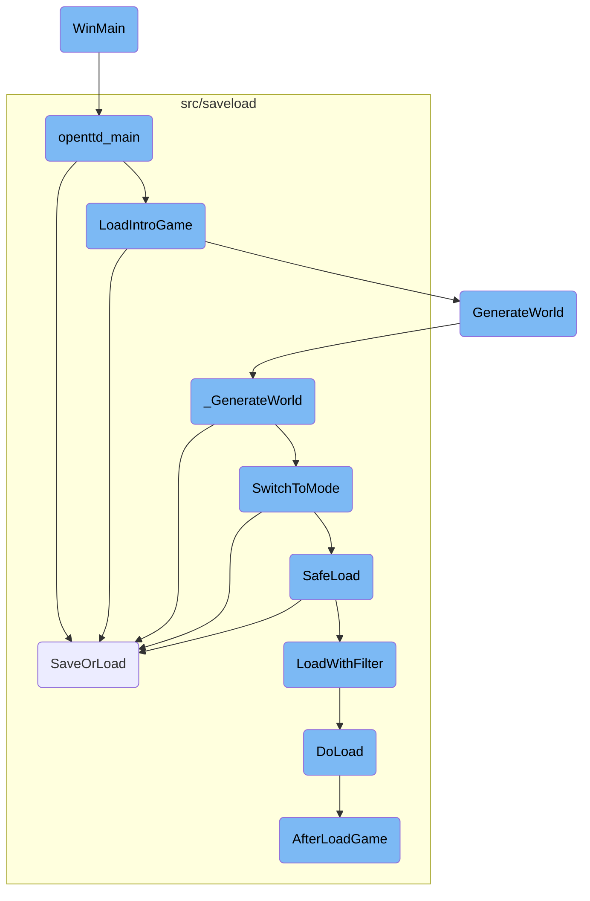
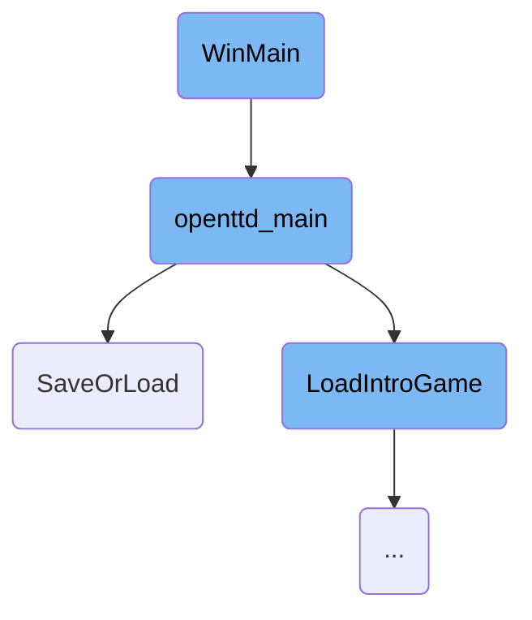
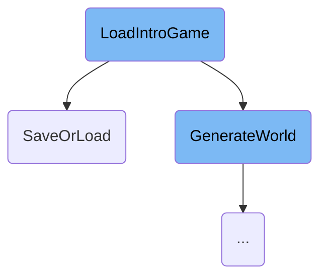
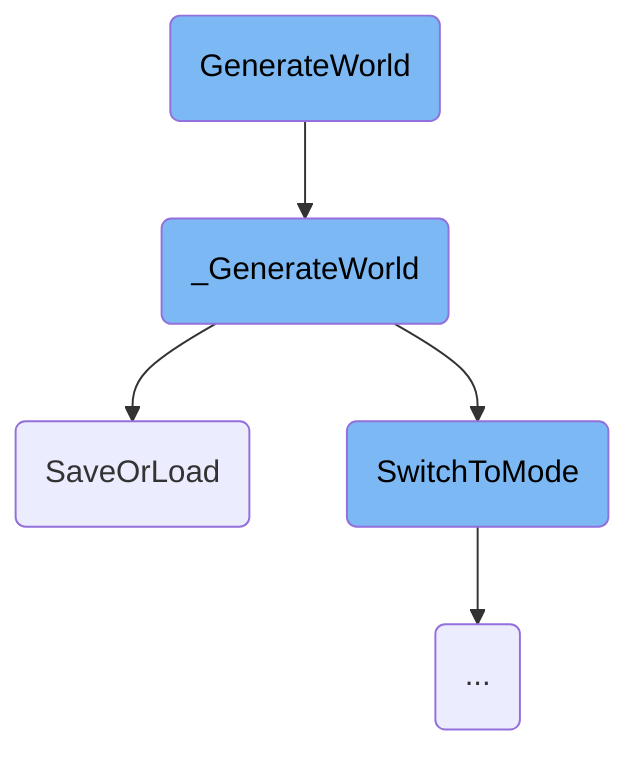
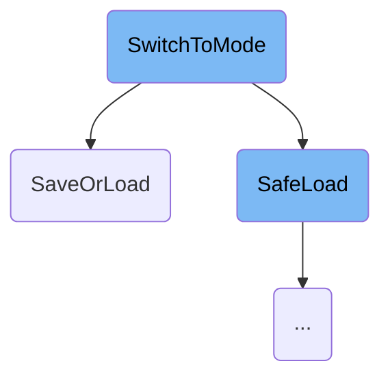
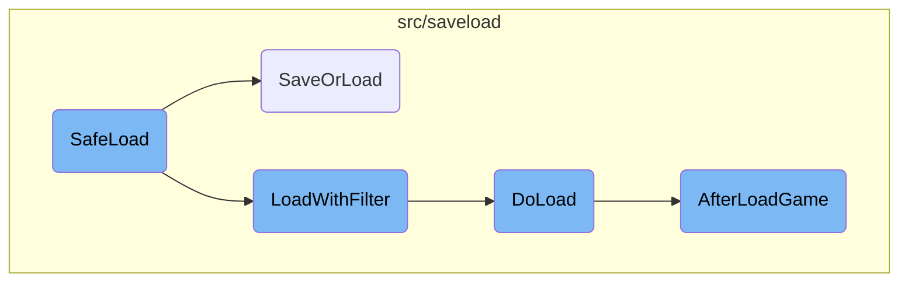

This document provides an overview of the initialization process for the game on Windows platforms. It covers the entry point of the application, system setup, and the transition to the main game logic.

The initialization process starts with the <SwmToken path="src/os/windows/win32_main.cpp" pos="53:4:4" line-data="int APIENTRY WinMain(HINSTANCE, HINSTANCE, LPSTR, int)">`WinMain`</SwmToken> function, which sets up the system timer, crash logging, and command-line parsing. It then calls the main game function to initialize the game environment, including graphics, sound, and other settings. The game is then ready to start, with all necessary resources loaded and configurations applied.

Here is a high level diagram of the flow, showing only the most important functions:



# Flow drill down

First, we'll zoom into this section of the flow:



<SwmSnippet path="/src/os/windows/win32_main.cpp" line="53">

---

## <SwmToken path="src/os/windows/win32_main.cpp" pos="53:4:4" line-data="int APIENTRY WinMain(HINSTANCE, HINSTANCE, LPSTR, int)">`WinMain`</SwmToken>

The <SwmToken path="src/os/windows/win32_main.cpp" pos="53:4:4" line-data="int APIENTRY WinMain(HINSTANCE, HINSTANCE, LPSTR, int)">`WinMain`</SwmToken> function is the entry point for the application on Windows. It initializes the system timer, sets up crash logging, converts the command line to <SwmToken path="src/os/windows/win32_main.cpp" pos="60:13:15" line-data="	/* Convert the command line to UTF-8. */">`UTF-8`</SwmToken>, and sets the console codepage to <SwmToken path="src/os/windows/win32_main.cpp" pos="60:13:15" line-data="	/* Convert the command line to UTF-8. */">`UTF-8`</SwmToken>. It also parses the command-line arguments and calls <SwmToken path="src/openttd.cpp" pos="504:2:2" line-data="int openttd_main(std::span&lt;char * const&gt; arguments)">`openttd_main`</SwmToken> with these arguments to start the game.

```c++
int APIENTRY WinMain(HINSTANCE, HINSTANCE, LPSTR, int)
{
	/* Set system timer resolution to 1ms. */
	timeBeginPeriod(1);

	CrashLog::InitialiseCrashLog();

	/* Convert the command line to UTF-8. */
	std::string cmdline = FS2OTTD(GetCommandLine());

	/* Set the console codepage to UTF-8. */
	SetConsoleOutputCP(CP_UTF8);

#if defined(_DEBUG)
	CreateConsole();
#endif

	_set_error_mode(_OUT_TO_MSGBOX); // force assertion output to messagebox

	/* setup random seed to something quite random */
	SetRandomSeed(GetTickCount());
```

---

</SwmSnippet>

<SwmSnippet path="/src/openttd.cpp" line="504">

---

## <SwmToken path="src/openttd.cpp" pos="504:2:2" line-data="int openttd_main(std::span&lt;char * const&gt; arguments)">`openttd_main`</SwmToken>

The <SwmToken path="src/openttd.cpp" pos="504:2:2" line-data="int openttd_main(std::span&lt;char * const&gt; arguments)">`openttd_main`</SwmToken> function is responsible for initializing the game environment based on the command-line arguments. It sets up various game settings such as graphics, sound, and video drivers. It also handles different modes like dedicated server mode and editor mode. The function ensures that the necessary resources are loaded and the game is ready to start.

```c++
int openttd_main(std::span<char * const> arguments)
{
	_game_session_stats.start_time = std::chrono::steady_clock::now();
	_game_session_stats.savegame_size = std::nullopt;

	std::string musicdriver;
	std::string sounddriver;
	std::string videodriver;
	std::string blitter;
	std::string graphics_set;
	std::string sounds_set;
	std::string music_set;
	Dimension resolution = {0, 0};
	std::unique_ptr<AfterNewGRFScan> scanner = std::make_unique<AfterNewGRFScan>();
	bool dedicated = false;
	bool only_local_path = false;

	extern bool _dedicated_forks;
	_dedicated_forks = false;

	_game_mode = GM_MENU;
```

---

</SwmSnippet>

<SwmSnippet path="/src/openttd.cpp" line="532">

---

### Handling Command-Line Arguments

The command-line arguments are parsed to configure the game settings. For example, the <SwmToken path="src/openttd.cpp" pos="175:3:4" line-data="		&quot;  -I graphics_set     = Force the graphics set (see below)\n&quot;">`-I`</SwmToken> argument sets the graphics set, <SwmToken path="src/openttd.cpp" pos="159:3:4" line-data="		&quot;  -s drv              = Set sound driver (see below)\n&quot;">`-s`</SwmToken> sets the sounds set, and <SwmToken path="src/openttd.cpp" pos="160:3:4" line-data="		&quot;  -m drv              = Set music driver (see below)\n&quot;">`-m`</SwmToken> sets the music set. The <SwmToken path="src/openttd.cpp" pos="165:3:4" line-data="		&quot;  -d [[fac=]lvl[,...]]= Debug mode\n&quot;">`-d`</SwmToken> argument configures the game to run in dedicated server mode. These settings are crucial for customizing the game experience based on user preferences.

```c++
	while ((i = mgo.GetOpt()) != -1) {
		switch (i) {
		case 'I': graphics_set = mgo.opt; break;
		case 'S': sounds_set = mgo.opt; break;
		case 'M': music_set = mgo.opt; break;
		case 'm': musicdriver = mgo.opt; break;
		case 's': sounddriver = mgo.opt; break;
		case 'v': videodriver = mgo.opt; break;
		case 'b': blitter = mgo.opt; break;
		case 'D':
			musicdriver = "null";
			sounddriver = "null";
			videodriver = "dedicated";
			blitter = "null";
			dedicated = true;
			SetDebugString("net=4", ShowInfoI);
			if (mgo.opt != nullptr) {
				scanner->dedicated_host = ParseFullConnectionString(mgo.opt, scanner->dedicated_port);
			}
			break;
		case 'f': _dedicated_forks = true; break;
```

---

</SwmSnippet>

<SwmSnippet path="/src/openttd.cpp" line="664">

---

### Setting Up Game Resources

After parsing the command-line arguments, the function sets up various game resources. This includes initializing language packs, font cache, window system, and graphics sets. It also configures the video driver and initializes the network core. These steps ensure that the game environment is fully prepared for the user.

```c++
	DeterminePaths(arguments[0], only_local_path);
	TarScanner::DoScan(TarScanner::BASESET);

	if (dedicated) Debug(net, 3, "Starting dedicated server, version {}", _openttd_revision);
	if (_dedicated_forks && !dedicated) _dedicated_forks = false;

#if defined(UNIX)
	/* We must fork here, or we'll end up without some resources we need (like sockets) */
	if (_dedicated_forks) DedicatedFork();
#endif

	LoadFromConfig(true);

	if (resolution.width != 0) _cur_resolution = resolution;

	/* Limit width times height times bytes per pixel to fit a 32 bit
	 * integer, This way all internal drawing routines work correctly.
	 * A resolution that has one component as 0 is treated as a marker to
	 * auto-detect a good window size. */
	_cur_resolution.width  = std::min(_cur_resolution.width, UINT16_MAX / 2u);
	_cur_resolution.height = std::min(_cur_resolution.height, UINT16_MAX / 2u);
```

---

</SwmSnippet>

<SwmSnippet path="/src/saveload/saveload.cpp" line="3071">

---

## <SwmToken path="src/saveload/saveload.cpp" pos="3071:2:2" line-data="SaveOrLoadResult SaveOrLoad(const std::string &amp;filename, SaveLoadOperation fop, DetailedFileType dft, Subdirectory sb, bool threaded)">`SaveOrLoad`</SwmToken>

The <SwmToken path="src/saveload/saveload.cpp" pos="3071:2:2" line-data="SaveOrLoadResult SaveOrLoad(const std::string &amp;filename, SaveLoadOperation fop, DetailedFileType dft, Subdirectory sb, bool threaded)">`SaveOrLoad`</SwmToken> function handles the <SwmToken path="src/saveload/saveload.cpp" pos="3063:17:19" line-data=" * Main Save or Load function where the high-level saveload functions are">`high-level`</SwmToken> save and load operations. It opens the savegame file, selects the appropriate format, and checks versions. This function is crucial for managing game state persistence, allowing users to save their progress and load it later.

```c++
SaveOrLoadResult SaveOrLoad(const std::string &filename, SaveLoadOperation fop, DetailedFileType dft, Subdirectory sb, bool threaded)
{
	/* An instance of saving is already active, so don't go saving again */
	if (_sl.saveinprogress && fop == SLO_SAVE && dft == DFT_GAME_FILE && threaded) {
		/* if not an autosave, but a user action, show error message */
		if (!_do_autosave) ShowErrorMessage(STR_ERROR_SAVE_STILL_IN_PROGRESS, INVALID_STRING_ID, WL_ERROR);
		return SL_OK;
	}
	WaitTillSaved();

	try {
		/* Load a TTDLX or TTDPatch game */
		if (fop == SLO_LOAD && dft == DFT_OLD_GAME_FILE) {
			ResetSaveloadData();

			InitializeGame(256, 256, true, true); // set a mapsize of 256x256 for TTDPatch games or it might get confused

			/* TTD/TTO savegames have no NewGRFs, TTDP savegame have them
			 * and if so a new NewGRF list will be made in LoadOldSaveGame.
			 * Note: this is done here because AfterLoadGame is also called
			 * for OTTD savegames which have their own NewGRF logic. */
```

---

</SwmSnippet>

Now, lets zoom into this section of the flow:



<SwmSnippet path="/src/openttd.cpp" line="311">

---

## Loading the Introduction Game

The <SwmToken path="src/openttd.cpp" pos="315:4:4" line-data="static void LoadIntroGame(bool load_newgrfs = true)">`LoadIntroGame`</SwmToken> function is responsible for initializing the game's introduction screen. It sets the game mode to the main menu, optionally resets the <SwmToken path="src/saveload/saveload.cpp" pos="3089:13:13" line-data="			 * and if so a new NewGRF list will be made in LoadOldSaveGame.">`NewGRF`</SwmToken> configuration, and sets up the main window and colors. It attempts to load the default opening screen savegame (<SwmPath>[media/baseset/opntitle.dat](media/baseset/opntitle.dat)</SwmPath>). If loading fails, it generates an empty world and sets the local company to spectator mode; otherwise, it sets the local company to the first company. The function also fixes the title game zoom, unpauses the game, resets the cursor, checks for missing glyphs, and ensures the correct music is playing.

```c++
/**
 * Load the introduction game.
 * @param load_newgrfs Whether to load the NewGRFs or not.
 */
static void LoadIntroGame(bool load_newgrfs = true)
{
	_game_mode = GM_MENU;

	if (load_newgrfs) ResetGRFConfig(false);

	/* Setup main window */
	ResetWindowSystem();
	SetupColoursAndInitialWindow();

	/* Load the default opening screen savegame */
	if (SaveOrLoad("opntitle.dat", SLO_LOAD, DFT_GAME_FILE, BASESET_DIR) != SL_OK) {
		GenerateWorld(GWM_EMPTY, 64, 64); // if failed loading, make empty world.
		SetLocalCompany(COMPANY_SPECTATOR);
	} else {
		SetLocalCompany(COMPANY_FIRST);
	}
```

---

</SwmSnippet>

Now, lets zoom into this section of the flow:



<SwmSnippet path="/src/genworld.cpp" line="275">

---

## <SwmToken path="src/genworld.cpp" pos="282:2:2" line-data="void GenerateWorld(GenWorldMode mode, uint size_x, uint size_y, bool reset_settings)">`GenerateWorld`</SwmToken> Function

The <SwmToken path="src/genworld.cpp" pos="282:2:2" line-data="void GenerateWorld(GenWorldMode mode, uint size_x, uint size_y, bool reset_settings)">`GenerateWorld`</SwmToken> function is responsible for setting up the initial parameters for world generation, such as the mode, map size, and whether to reset settings. It initializes the game, prepares the progress display, and sets the map height limit based on the generation mode. It also loads necessary graphics and initializes various game components before calling <SwmToken path="src/genworld.cpp" pos="87:4:4" line-data="static void _GenerateWorld()">`_GenerateWorld`</SwmToken> to perform the actual world generation.

```c++
/**
 * Generate a world.
 * @param mode The mode of world generation (see GenWorldMode).
 * @param size_x The X-size of the map.
 * @param size_y The Y-size of the map.
 * @param reset_settings Whether to reset the game configuration (used for restart)
 */
void GenerateWorld(GenWorldMode mode, uint size_x, uint size_y, bool reset_settings)
{
	if (HasModalProgress()) return;
	_gw.mode   = mode;
	_gw.size_x = size_x;
	_gw.size_y = size_y;
	SetModalProgress(true);
	_gw.abort  = false;
	_gw.abortp = nullptr;
	_gw.lc     = _local_company;

	/* This disables some commands and stuff */
	SetLocalCompany(COMPANY_SPECTATOR);

```

---

</SwmSnippet>

<SwmSnippet path="/src/genworld.cpp" line="84">

---

## <SwmToken path="src/genworld.cpp" pos="87:4:4" line-data="static void _GenerateWorld()">`_GenerateWorld`</SwmToken> Function

The <SwmToken path="src/genworld.cpp" pos="87:4:4" line-data="static void _GenerateWorld()">`_GenerateWorld`</SwmToken> function handles the core logic of generating the game world. It sets the random seed, initializes the economy, and generates the landscape based on the specified mode. If the landscape generation is successful, it proceeds to generate towns, industries, objects, and trees. It also starts up companies, engines, and disasters, and runs the game loop to finalize the world generation. If any errors occur, it handles the abortion of the generation process and cleans up appropriately.

```c++
/**
 * The internal, real, generate function.
 */
static void _GenerateWorld()
{
	/* Make sure everything is done via OWNER_NONE. */
	Backup<CompanyID> _cur_company(_current_company, OWNER_NONE);

	try {
		_generating_world = true;
		if (_network_dedicated) Debug(net, 3, "Generating map, please wait...");
		/* Set the Random() seed to generation_seed so we produce the same map with the same seed */
		_random.SetSeed(_settings_game.game_creation.generation_seed);
		SetGeneratingWorldProgress(GWP_MAP_INIT, 2);
		SetObjectToPlace(SPR_CURSOR_ZZZ, PAL_NONE, HT_NONE, WC_MAIN_WINDOW, 0);
		ScriptObject::InitializeRandomizers();

		BasePersistentStorageArray::SwitchMode(PSM_ENTER_GAMELOOP);

		IncreaseGeneratingWorldProgress(GWP_MAP_INIT);
		/* Must start economy early because of the costs. */
```

---

</SwmSnippet>

Now, lets zoom into this section of the flow:



<SwmSnippet path="/src/openttd.cpp" line="1066">

---

## Handling Different Game Modes

The <SwmToken path="src/openttd.cpp" pos="1078:1:1" line-data="				SwitchToMode(_switch_mode);">`SwitchToMode`</SwmToken> function handles the transition between different game modes such as scenario editor, loading a game, starting a new game, and joining a multiplayer game. Each case within the switch statement ensures that the necessary setup for the new mode is performed, such as generating a new world, resetting configurations, or starting network services.

```c++
	switch (new_mode) {
		case SM_EDITOR: // Switch to scenario editor
			MakeNewEditorWorld();
			GenerateSavegameId();

			UpdateSocialIntegration(GM_EDITOR);
			break;

		case SM_RELOADGAME: // Reload with what-ever started the game
			if (_file_to_saveload.abstract_ftype == FT_SAVEGAME || _file_to_saveload.abstract_ftype == FT_SCENARIO) {
				/* Reload current savegame/scenario */
				_switch_mode = _game_mode == GM_EDITOR ? SM_LOAD_SCENARIO : SM_LOAD_GAME;
				SwitchToMode(_switch_mode);
				break;
			} else if (_file_to_saveload.abstract_ftype == FT_HEIGHTMAP) {
				/* Restart current heightmap */
				_switch_mode = _game_mode == GM_EDITOR ? SM_LOAD_HEIGHTMAP : SM_RESTART_HEIGHTMAP;
				SwitchToMode(_switch_mode);
				break;
			}

```

---

</SwmSnippet>

<SwmSnippet path="/src/openttd.cpp" line="1023">

---

### Network State Management

The function checks if the new mode is not a save game. If the network is active, it either reboots or disconnects the network based on the new mode. If the current instance is a network server, it restarts the server unless switching to the menu mode.

```c++
	if (new_mode != SM_SAVE_GAME) {
		/* If the network is active, make it not-active */
		if (_networking) {
			if (_network_server && (new_mode == SM_LOAD_GAME || new_mode == SM_NEWGAME || new_mode == SM_RESTARTGAME)) {
				NetworkReboot();
			} else {
				NetworkDisconnect();
			}
		}

		/* If we are a server, we restart the server */
		if (_is_network_server) {
			/* But not if we are going to the menu */
			if (new_mode != SM_MENU) {
				/* check if we should reload the config */
				if (_settings_client.network.reload_cfg) {
					LoadFromConfig();
					MakeNewgameSettingsLive();
					ResetGRFConfig(false);
				}
				NetworkServerStart();
```

---

</SwmSnippet>

<SwmSnippet path="/src/openttd.cpp" line="1051">

---

### AI Controllers and Autosave

The function ensures that all AI controllers are terminated when not saving a game and resets the autosave frequency when changing modes.

```c++
	/* Make sure all AI controllers are gone at quitting game */
	if (new_mode != SM_SAVE_GAME) AI::KillAll();

	/* When we change mode, reset the autosave. */
	if (new_mode != SM_SAVE_GAME) ChangeAutosaveFrequency(true);

```

---

</SwmSnippet>

<SwmSnippet path="/src/openttd.cpp" line="1057">

---

### Survey Transmission and Session Stats

If the current game mode is normal and the new mode is not saving, the function transmits a survey indicating the user is leaving the game. It also records the time of the mode switch for session statistics.

```c++
	/* Transmit the survey if we were in normal-mode and not saving. It always means we leaving the current game. */
	if (_game_mode == GM_NORMAL && new_mode != SM_SAVE_GAME) _survey.Transmit(NetworkSurveyHandler::Reason::LEAVE);

	/* Keep track when we last switch mode. Used for survey, to know how long someone was in a game. */
	if (new_mode != SM_SAVE_GAME) {
		_game_session_stats.start_time = std::chrono::steady_clock::now();
		_game_session_stats.savegame_size = std::nullopt;
	}
```

---

</SwmSnippet>

Now, lets zoom into this section of the flow:



<SwmSnippet path="/src/openttd.cpp" line="943">

---

## <SwmToken path="src/openttd.cpp" pos="943:2:2" line-data="bool SafeLoad(const std::string &amp;filename, SaveLoadOperation fop, DetailedFileType dft, GameMode newgm, Subdirectory subdir, std::shared_ptr&lt;LoadFilter&gt; lf = nullptr)">`SafeLoad`</SwmToken>

The <SwmToken path="src/openttd.cpp" pos="943:2:2" line-data="bool SafeLoad(const std::string &amp;filename, SaveLoadOperation fop, DetailedFileType dft, GameMode newgm, Subdirectory subdir, std::shared_ptr&lt;LoadFilter&gt; lf = nullptr)">`SafeLoad`</SwmToken> function attempts to load a specified savegame file. If the loading fails due to issues like a corrupt savegame or bad version, it reverts to a previous correct state. This ensures that the game does not crash and can recover gracefully by either reloading the intro game or starting a new game if necessary.

```c++
bool SafeLoad(const std::string &filename, SaveLoadOperation fop, DetailedFileType dft, GameMode newgm, Subdirectory subdir, std::shared_ptr<LoadFilter> lf = nullptr)
{
	assert(fop == SLO_LOAD);
	assert(dft == DFT_GAME_FILE || (lf == nullptr && dft == DFT_OLD_GAME_FILE));
	GameMode ogm = _game_mode;

	_game_mode = newgm;

	SaveOrLoadResult result = (lf == nullptr) ? SaveOrLoad(filename, fop, dft, subdir) : LoadWithFilter(lf);
	if (result == SL_OK) return true;

	if (_network_dedicated && ogm == GM_MENU) {
		/*
		 * If we are a dedicated server *and* we just were in the menu, then we
		 * are loading the first savegame. If that fails, not starting the
		 * server is a better reaction than starting the server with a newly
		 * generated map as it is quite likely to be started from a script.
		 */
		Debug(net, 0, "Loading requested map failed; closing server.");
		_exit_game = true;
		return false;
```

---

</SwmSnippet>

<SwmSnippet path="/src/saveload/saveload.cpp" line="3051">

---

## <SwmToken path="src/saveload/saveload.cpp" pos="3051:2:2" line-data="SaveOrLoadResult LoadWithFilter(std::shared_ptr&lt;LoadFilter&gt; reader)">`LoadWithFilter`</SwmToken>

The <SwmToken path="src/saveload/saveload.cpp" pos="3051:2:2" line-data="SaveOrLoadResult LoadWithFilter(std::shared_ptr&lt;LoadFilter&gt; reader)">`LoadWithFilter`</SwmToken> function loads the game using a specified filter. It handles exceptions and ensures that the game state is cleared if an error occurs, returning a status that indicates whether the game should be reinitialized.

```c++
SaveOrLoadResult LoadWithFilter(std::shared_ptr<LoadFilter> reader)
{
	try {
		_sl.action = SLA_LOAD;
		return DoLoad(reader, false);
	} catch (...) {
		ClearSaveLoadState();
		return SL_REINIT;
	}
}
```

---

</SwmSnippet>

<SwmSnippet path="/src/saveload/saveload.cpp" line="2951">

---

## <SwmToken path="src/saveload/saveload.cpp" pos="2951:4:4" line-data="static SaveOrLoadResult DoLoad(std::shared_ptr&lt;LoadFilter&gt; reader, bool load_check)">`DoLoad`</SwmToken>

The <SwmToken path="src/saveload/saveload.cpp" pos="2951:4:4" line-data="static SaveOrLoadResult DoLoad(std::shared_ptr&lt;LoadFilter&gt; reader, bool load_check)">`DoLoad`</SwmToken> function performs the actual loading of the savegame. It reads the savegame data, initializes the game state, and handles various compatibility checks and conversions for older savegame versions. This function ensures that the game state is correctly set up and ready for use.

```c++
static SaveOrLoadResult DoLoad(std::shared_ptr<LoadFilter> reader, bool load_check)
{
	_sl.lf = reader;

	if (load_check) {
		/* Clear previous check data */
		_load_check_data.Clear();
		/* Mark SL_LOAD_CHECK as supported for this savegame. */
		_load_check_data.checkable = true;
	}

	uint32_t hdr[2];
	if (_sl.lf->Read((uint8_t*)hdr, sizeof(hdr)) != sizeof(hdr)) SlError(STR_GAME_SAVELOAD_ERROR_FILE_NOT_READABLE);

	/* see if we have any loader for this type. */
	const SaveLoadFormat *fmt = DetermineSaveLoadFormat(hdr[0], hdr[1]);

	/* loader for this savegame type is not implemented? */
	if (fmt->init_load == nullptr) {
		SlError(STR_GAME_SAVELOAD_ERROR_BROKEN_INTERNAL_ERROR, fmt::format("Loader for '{}' is not available.", fmt->name));
	}
```

---

</SwmSnippet>

<SwmSnippet path="/src/saveload/afterload.cpp" line="564">

---

## <SwmToken path="src/saveload/afterload.cpp" pos="564:2:2" line-data="bool AfterLoadGame()">`AfterLoadGame`</SwmToken>

The <SwmToken path="src/saveload/afterload.cpp" pos="564:2:2" line-data="bool AfterLoadGame()">`AfterLoadGame`</SwmToken> function performs necessary conversions and updates to ensure that older savegames are compatible with the current game version. It rebuilds various data structures, updates settings, and ensures that the game state is consistent and ready for gameplay.

```c++
bool AfterLoadGame()
{
	SetSignalHandlers();

	extern TileIndex _cur_tileloop_tile; // From landscape.cpp.
	/* The LFSR used in RunTileLoop iteration cannot have a zeroed state, make it non-zeroed. */
	if (_cur_tileloop_tile == 0) _cur_tileloop_tile = 1;

	if (IsSavegameVersionBefore(SLV_98)) _gamelog.Oldver();

	_gamelog.TestRevision();
	_gamelog.TestMode();

	RebuildTownKdtree();
	RebuildStationKdtree();
	/* This needs to be done even before conversion, because some conversions will destroy objects
	 * that otherwise won't exist in the tree. */
	RebuildViewportKdtree();

	if (IsSavegameVersionBefore(SLV_98)) _gamelog.GRFAddList(_grfconfig);

```

---

</SwmSnippet>

&nbsp;

*This is an auto-generated document by Swimm AI 🌊 and has not yet been verified by a human*

<SwmMeta version="3.0.0" repo-id="Z2l0aHViJTNBJTNBT3BlblRURC1jb3BpbG90LWRlbW8lM0ElM0Fzd2ltbWlv" repo-name="OpenTTD-copilot-demo"><sup>Powered by [Swimm](/)</sup></SwmMeta>
