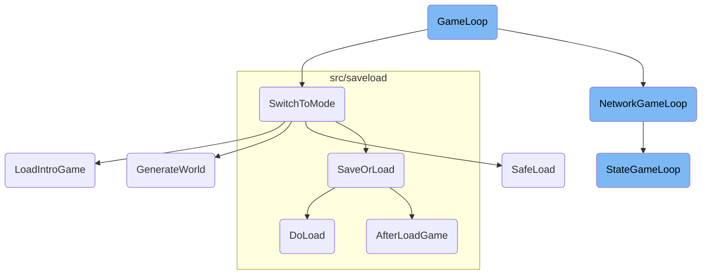

The <SwmToken path="src/openttd.cpp" pos="1340:2:2" line-data="void GameLoop()">`GameLoop`</SwmToken> is the central loop that manages the state of the game. It handles various tasks such as checking for network availability, processing asynchronous save finishes, and managing game modes. This ensures that the game runs smoothly by updating timers, handling network operations, and switching game modes when necessary.

The <SwmToken path="src/openttd.cpp" pos="1340:2:2" line-data="void GameLoop()">`GameLoop`</SwmToken> is like the heart of the game, keeping everything running smoothly. It checks if the game is connected to the network, processes any saved game data, and makes sure the game is in the right mode. If the game needs to switch modes, like going from the main menu to gameplay, it handles that too. For multiplayer games, it makes sure all players are in sync. It also updates the game state, like moving vehicles and updating the landscape, to keep the game world consistent.

# Flow drill down



<SwmSnippet path="/src/openttd.cpp" line="1340">

---

## <SwmToken path="src/openttd.cpp" pos="1340:2:2" line-data="void GameLoop()">`GameLoop`</SwmToken>

The <SwmToken path="src/openttd.cpp" pos="1340:2:2" line-data="void GameLoop()">`GameLoop`</SwmToken> function is the core loop that manages the game's state. It handles various tasks such as checking for network availability, processing asynchronous save finishes, and managing game modes. It ensures that the game runs smoothly by updating timers, handling network operations, and switching game modes when necessary.

```c++
void GameLoop()
{
	if (_game_mode == GM_BOOTSTRAP) {
		/* Check for UDP stuff */
		if (_network_available) NetworkBackgroundLoop();
		return;
	}

	if (_request_newgrf_scan) {
		ScanNewGRFFiles(_request_newgrf_scan_callback);
		_request_newgrf_scan = false;
		_request_newgrf_scan_callback = nullptr;
		/* In case someone closed the game during our scan, don't do anything else. */
		if (_exit_game) return;
	}

	ProcessAsyncSaveFinish();

	if (_game_mode == GM_NORMAL) {
		static auto last_time = std::chrono::steady_clock::now();
		auto now = std::chrono::steady_clock::now();
```

---

</SwmSnippet>

<SwmSnippet path="/src/openttd.cpp" line="1368">

---

### Switching Game Modes

The <SwmToken path="src/openttd.cpp" pos="1340:2:2" line-data="void GameLoop()">`GameLoop`</SwmToken> checks if a game mode switch is requested. If so, it calls <SwmToken path="src/openttd.cpp" pos="1370:1:1" line-data="		SwitchToMode(_switch_mode);">`SwitchToMode`</SwmToken> to handle the transition. This is crucial for changing the game's state, such as moving from the main menu to gameplay or loading a saved game.

```c++
	/* switch game mode? */
	if (_switch_mode != SM_NONE && !HasModalProgress()) {
		SwitchToMode(_switch_mode);
		_switch_mode = SM_NONE;
		if (_exit_game) return;
	}
```

---

</SwmSnippet>

<SwmSnippet path="/src/openttd.cpp" line="1020">

---

## <SwmToken path="src/openttd.cpp" pos="1020:2:2" line-data="void SwitchToMode(SwitchMode new_mode)">`SwitchToMode`</SwmToken>

The <SwmToken path="src/openttd.cpp" pos="1020:2:2" line-data="void SwitchToMode(SwitchMode new_mode)">`SwitchToMode`</SwmToken> function handles the transition between different game modes. It manages network states, resets autosave frequencies, and updates social integration settings. Depending on the new mode, it may load a new game, restart the current game, or load a saved game. This function ensures that the game transitions smoothly between different states.

```c++
void SwitchToMode(SwitchMode new_mode)
{
	/* If we are saving something, the network stays in its current state */
	if (new_mode != SM_SAVE_GAME) {
		/* If the network is active, make it not-active */
		if (_networking) {
			if (_network_server && (new_mode == SM_LOAD_GAME || new_mode == SM_NEWGAME || new_mode == SM_RESTARTGAME)) {
				NetworkReboot();
			} else {
				NetworkDisconnect();
			}
		}

		/* If we are a server, we restart the server */
		if (_is_network_server) {
			/* But not if we are going to the menu */
			if (new_mode != SM_MENU) {
				/* check if we should reload the config */
				if (_settings_client.network.reload_cfg) {
					LoadFromConfig();
					MakeNewgameSettingsLive();
```

---

</SwmSnippet>

<SwmSnippet path="/src/network/network.cpp" line="1094">

---

## <SwmToken path="src/network/network.cpp" pos="1096:2:2" line-data="void NetworkGameLoop()">`NetworkGameLoop`</SwmToken>

The <SwmToken path="src/network/network.cpp" pos="1096:2:2" line-data="void NetworkGameLoop()">`NetworkGameLoop`</SwmToken> function manages the game's network operations. It handles receiving and sending network data, synchronizing game states between clients and servers, and distributing commands. This function is essential for multiplayer gameplay, ensuring that all players have a consistent game experience.

```c++
/* The main loop called from ttd.c
 *  Here we also have to do StateGameLoop if needed! */
void NetworkGameLoop()
{
	if (!_networking) return;

	if (!NetworkReceive()) return;

	if (_network_server) {
		/* Log the sync state to check for in-syncedness of replays. */
		if (TimerGameEconomy::date_fract == 0) {
			/* We don't want to log multiple times if paused. */
			static TimerGameEconomy::Date last_log;
			if (last_log != TimerGameEconomy::date) {
				Debug(desync, 1, "sync: {:08x}; {:02x}; {:08x}; {:08x}", TimerGameEconomy::date, TimerGameEconomy::date_fract, _random.state[0], _random.state[1]);
				last_log = TimerGameEconomy::date;
			}
		}

#ifdef DEBUG_DUMP_COMMANDS
		/* Loading of the debug commands from -ddesync>=1 */
```

---

</SwmSnippet>

<SwmSnippet path="/src/openttd.cpp" line="1207">

---

## <SwmToken path="src/openttd.cpp" pos="1212:2:2" line-data="void StateGameLoop()">`StateGameLoop`</SwmToken>

The <SwmToken path="src/openttd.cpp" pos="1212:2:2" line-data="void StateGameLoop()">`StateGameLoop`</SwmToken> function controls the game's state. It ensures that the game state is only changed within this loop, maintaining consistency. It handles various game actions such as updating the landscape, processing vehicle ticks, and managing news events. This function is crucial for maintaining the game's internal state and ensuring that all game actions are processed correctly.

```c++
/**
 * State controlling game loop.
 * The state must not be changed from anywhere but here.
 * That check is enforced in DoCommand.
 */
void StateGameLoop()
{
	if (!_networking || _network_server) {
		StateGameLoop_LinkGraphPauseControl();
	}

	/* Don't execute the state loop during pause or when modal windows are open. */
	if (_pause_mode != PM_UNPAUSED || HasModalProgress()) {
		PerformanceMeasurer::Paused(PFE_GAMELOOP);
		PerformanceMeasurer::Paused(PFE_GL_ECONOMY);
		PerformanceMeasurer::Paused(PFE_GL_TRAINS);
		PerformanceMeasurer::Paused(PFE_GL_ROADVEHS);
		PerformanceMeasurer::Paused(PFE_GL_SHIPS);
		PerformanceMeasurer::Paused(PFE_GL_AIRCRAFT);
		PerformanceMeasurer::Paused(PFE_GL_LANDSCAPE);

```

---

</SwmSnippet>

&nbsp;

*This is an auto-generated document by Swimm AI 🌊 and has not yet been verified by a human*

<SwmMeta version="3.0.0" repo-id="Z2l0aHViJTNBJTNBT3BlblRURC1jb3BpbG90LWRlbW8lM0ElM0Fzd2ltbWlv" repo-name="OpenTTD-copilot-demo"><sup>Powered by [Swimm](/)</sup></SwmMeta>
