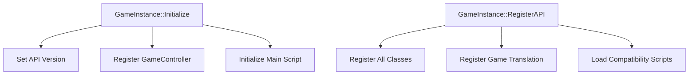

# Gameplay Overview

Gameplay in <SwmToken path="src/game/game_instance.cpp" pos="2:13:13" line-data=" * This file is part of OpenTTD.">`OpenTTD`</SwmToken> involves managing a transport company, where players build and maintain transport routes for various types of cargo and passengers. Players start by constructing basic infrastructure such as roads, railways, airports, and docks to facilitate the movement of goods and people. The game includes a variety of vehicles like trains, trucks, ships, and airplanes, each with unique characteristics and uses. Players must strategically plan routes and schedules to maximize efficiency and profitability while competing with other transport companies. The game also features economic elements, where players need to manage finances, invest in new technologies, and adapt to changing market conditions. Additionally, players can engage in various scenarios and challenges, which add depth and replayability to the game.

## Starting the Game

Players begin by setting up their transport company, choosing a starting location, and constructing initial infrastructure like roads and railways.

## Managing Routes and Vehicles

Players must plan and manage routes for different types of vehicles, including trains, trucks, ships, and airplanes, ensuring efficient transport of cargo and passengers.

## Scenarios and Challenges

The game offers various scenarios and challenges that provide additional objectives and increase the game's replayability.

<SwmSnippet path="/src/game/game_instance.cpp" line="34">

---

## <SwmToken path="src/game/game_instance.cpp" pos="34:2:4" line-data="void GameInstance::Initialize(GameInfo *info)">`GameInstance::Initialize`</SwmToken>

The <SwmToken path="src/game/game_instance.cpp" pos="34:2:4" line-data="void GameInstance::Initialize(GameInfo *info)">`GameInstance::Initialize`</SwmToken> function initializes the game instance with the provided game information. It sets the API version, registers the game controller, and initializes the main script.

```c++
void GameInstance::Initialize(GameInfo *info)
{
	this->versionAPI = info->GetAPIVersion();

	/* Register the GameController */
	SQGSController_Register(this->engine);

	ScriptInstance::Initialize(info->GetMainScript(), info->GetInstanceName(), OWNER_DEITY);
}
```

---

</SwmSnippet>

<SwmSnippet path="/src/game/game_instance.cpp" line="44">

---

## <SwmToken path="src/game/game_instance.cpp" pos="44:2:4" line-data="void GameInstance::RegisterAPI()">`GameInstance::RegisterAPI`</SwmToken>

The <SwmToken path="src/game/game_instance.cpp" pos="44:2:4" line-data="void GameInstance::RegisterAPI()">`GameInstance::RegisterAPI`</SwmToken> function registers the API for the game instance. It registers all classes, game translations, and loads compatibility scripts.

```c++
void GameInstance::RegisterAPI()
{
	ScriptInstance::RegisterAPI();

	/* Register all classes */
	SQGS_RegisterAll(this->engine);

	RegisterGameTranslation(this->engine);

	if (!this->LoadCompatibilityScripts(this->versionAPI, GAME_DIR)) this->Died();
}
```

---

</SwmSnippet>

&nbsp;

*This is an auto-generated document by Swimm AI 🌊 and has not yet been verified by a human*

<SwmMeta version="3.0.0" repo-id="Z2l0aHViJTNBJTNBT3BlblRURC1jb3BpbG90LWRlbW8lM0ElM0Fzd2ltbWlv" repo-name="OpenTTD-copilot-demo"><sup>Powered by [Swimm](/)</sup></SwmMeta>
