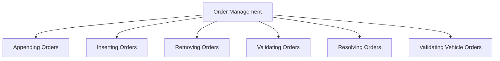

# Getting Started with Order Management in API

Order Management refers to the handling and processing of vehicle orders. It includes functionalities such as appending, inserting, and removing orders for vehicles. This document will guide you through the essential functions and their usage in the API.

<SwmSnippet path="/src/script/api/script_order.cpp" line="450">

---

## Appending Orders

The function <SwmToken path="src/script/api/script_order.cpp" pos="450:10:10" line-data="/* static */ bool ScriptOrder::AppendOrder(VehicleID vehicle_id, TileIndex destination, ScriptOrderFlags order_flags)">`AppendOrder`</SwmToken> is used to add a new order to the end of a vehicle's order list. It ensures the company mode is valid and checks preconditions before inserting the order.

```c++
/* static */ bool ScriptOrder::AppendOrder(VehicleID vehicle_id, TileIndex destination, ScriptOrderFlags order_flags)
{
	EnforceCompanyModeValid(false);
	EnforcePrecondition(false, ScriptVehicle::IsPrimaryVehicle(vehicle_id));
	EnforcePrecondition(false, AreOrderFlagsValid(destination, order_flags));

	return InsertOrder(vehicle_id, (ScriptOrder::OrderPosition)::Vehicle::Get(vehicle_id)->GetNumManualOrders(), destination, order_flags);
}
```

---

</SwmSnippet>

<SwmSnippet path="/src/script/api/script_order.cpp" line="468">

---

## Inserting Orders

The function <SwmToken path="src/script/api/script_order.cpp" pos="468:10:10" line-data="/* static */ bool ScriptOrder::InsertOrder(VehicleID vehicle_id, OrderPosition order_position, TileIndex destination, ScriptOrder::ScriptOrderFlags order_flags)">`InsertOrder`</SwmToken> allows adding an order at a specific position within the order list. It handles various order types and ensures all preconditions are met before insertion.

```c++
/* static */ bool ScriptOrder::InsertOrder(VehicleID vehicle_id, OrderPosition order_position, TileIndex destination, ScriptOrder::ScriptOrderFlags order_flags)
{
	/* IsValidVehicleOrder is not good enough because it does not allow appending. */
	if (order_position == ORDER_CURRENT) order_position = ScriptOrder::ResolveOrderPosition(vehicle_id, order_position);

	EnforceCompanyModeValid(false);
	EnforcePrecondition(false, ScriptVehicle::IsPrimaryVehicle(vehicle_id));
	EnforcePrecondition(false, order_position >= 0 && order_position <= ::Vehicle::Get(vehicle_id)->GetNumManualOrders());
	EnforcePrecondition(false, AreOrderFlagsValid(destination, order_flags));

	Order order;
	OrderType ot = (order_flags & OF_GOTO_NEAREST_DEPOT) ? OT_GOTO_DEPOT : ::GetOrderTypeByTile(destination);
	switch (ot) {
		case OT_GOTO_DEPOT: {
			OrderDepotTypeFlags odtf = (OrderDepotTypeFlags)(ODTFB_PART_OF_ORDERS | ((order_flags & OF_SERVICE_IF_NEEDED) ? ODTFB_SERVICE : 0));
			OrderDepotActionFlags odaf = (OrderDepotActionFlags)(ODATF_SERVICE_ONLY | ((order_flags & OF_STOP_IN_DEPOT) ? ODATFB_HALT : 0));
			if (order_flags & OF_GOTO_NEAREST_DEPOT) odaf |= ODATFB_NEAREST_DEPOT;
			OrderNonStopFlags onsf = (OrderNonStopFlags)((order_flags & OF_NON_STOP_INTERMEDIATE) ? ONSF_NO_STOP_AT_INTERMEDIATE_STATIONS : ONSF_STOP_EVERYWHERE);
			if (order_flags & OF_GOTO_NEAREST_DEPOT) {
				order.MakeGoToDepot(INVALID_DEPOT, odtf, onsf, odaf);
			} else {
```

---

</SwmSnippet>

<SwmSnippet path="/src/script/api/script_order.cpp" line="540">

---

## Removing Orders

The function <SwmToken path="src/script/api/script_order.cpp" pos="540:10:10" line-data="/* static */ bool ScriptOrder::RemoveOrder(VehicleID vehicle_id, OrderPosition order_position)">`RemoveOrder`</SwmToken> is used to delete an order from the vehicle's order list. It resolves the order position and ensures the order is valid before removal.

```c++
/* static */ bool ScriptOrder::RemoveOrder(VehicleID vehicle_id, OrderPosition order_position)
{
	order_position = ScriptOrder::ResolveOrderPosition(vehicle_id, order_position);

	EnforceCompanyModeValid(false);
	EnforcePrecondition(false, IsValidVehicleOrder(vehicle_id, order_position));

	int order_pos = ScriptOrderPositionToRealOrderPosition(vehicle_id, order_position);
	return ScriptObject::Command<CMD_DELETE_ORDER>::Do(0, vehicle_id, order_pos);
}
```

---

</SwmSnippet>

<SwmSnippet path="/src/script/api/script_order.cpp" line="193">

---

## Validating Orders

Order Management includes validating orders and their flags using functions like <SwmToken path="src/script/api/script_order.cpp" pos="193:10:10" line-data="/* static */ bool ScriptOrder::AreOrderFlagsValid(TileIndex destination, ScriptOrderFlags order_flags)">`AreOrderFlagsValid`</SwmToken>. This function checks the validity of order flags based on the order type.

```c++
/* static */ bool ScriptOrder::AreOrderFlagsValid(TileIndex destination, ScriptOrderFlags order_flags)
{
	OrderType ot = (order_flags & OF_GOTO_NEAREST_DEPOT) ? OT_GOTO_DEPOT : ::GetOrderTypeByTile(destination);
	switch (ot) {
		case OT_GOTO_STATION:
			return (order_flags & ~(OF_NON_STOP_FLAGS | OF_UNLOAD_FLAGS | OF_LOAD_FLAGS)) == 0 &&
					/* Test the different mutual exclusive flags. */
					((order_flags & OF_TRANSFER)      == 0 || (order_flags & OF_UNLOAD)    == 0) &&
					((order_flags & OF_TRANSFER)      == 0 || (order_flags & OF_NO_UNLOAD) == 0) &&
					((order_flags & OF_UNLOAD)        == 0 || (order_flags & OF_NO_UNLOAD) == 0) &&
					((order_flags & OF_UNLOAD)        == 0 || (order_flags & OF_NO_UNLOAD) == 0) &&
					((order_flags & OF_NO_UNLOAD)     == 0 || (order_flags & OF_NO_LOAD)   == 0) &&
					((order_flags & OF_FULL_LOAD_ANY) == 0 || (order_flags & OF_NO_LOAD)   == 0);

		case OT_GOTO_DEPOT:
			return (order_flags & ~(OF_NON_STOP_FLAGS | OF_DEPOT_FLAGS)) == 0 &&
					((order_flags & OF_SERVICE_IF_NEEDED) == 0 || (order_flags & OF_STOP_IN_DEPOT) == 0);

		case OT_GOTO_WAYPOINT: return (order_flags & ~(OF_NON_STOP_FLAGS)) == 0;
		default:               return false;
	}
```

---

</SwmSnippet>

<SwmSnippet path="/src/script/api/script_order.cpp" line="56">

---

## Resolving Orders

The function <SwmToken path="src/script/api/script_order.cpp" pos="61:7:7" line-data="static const Order *ResolveOrder(VehicleID vehicle_id, ScriptOrder::OrderPosition order_position)">`ResolveOrder`</SwmToken> retrieves the current order a vehicle is executing. It handles both manual and list-based orders, ensuring the correct order is returned.

```c++
/**
 * Get the current order the vehicle is executing. If the current order is in
 *  the order list, return the order from the orderlist. If the current order
 *  was a manual order, return the current order.
 */
static const Order *ResolveOrder(VehicleID vehicle_id, ScriptOrder::OrderPosition order_position)
{
	const Vehicle *v = ::Vehicle::Get(vehicle_id);
	if (order_position == ScriptOrder::ORDER_CURRENT) {
		const Order *order = &v->current_order;
		if (order->GetType() == OT_GOTO_DEPOT && !(order->GetDepotOrderType() & ODTFB_PART_OF_ORDERS)) return order;
		order_position = ScriptOrder::ResolveOrderPosition(vehicle_id, order_position);
		if (order_position == ScriptOrder::ORDER_INVALID) return nullptr;
	}
	const Order *order = v->GetFirstOrder();
	assert(order != nullptr);
	while (order->GetType() == OT_IMPLICIT) order = order->next;
	while (order_position > 0) {
		order_position = (ScriptOrder::OrderPosition)(order_position - 1);
		order = order->next;
		while (order->GetType() == OT_IMPLICIT) order = order->next;
```

---

</SwmSnippet>

<SwmSnippet path="/src/script/api/script_order.cpp" line="51">

---

## Validating Vehicle Orders

Various checks are performed to ensure the validity of orders, such as <SwmToken path="src/script/api/script_order.cpp" pos="51:10:10" line-data="/* static */ bool ScriptOrder::IsValidVehicleOrder(VehicleID vehicle_id, OrderPosition order_position)">`IsValidVehicleOrder`</SwmToken>. This function checks if the vehicle is primary and if the order position is valid.

```c++
/* static */ bool ScriptOrder::IsValidVehicleOrder(VehicleID vehicle_id, OrderPosition order_position)
{
	return ScriptVehicle::IsPrimaryVehicle(vehicle_id) && order_position >= 0 && (order_position < ::Vehicle::Get(vehicle_id)->GetNumManualOrders() || order_position == ORDER_CURRENT);
}
```

---

</SwmSnippet>

&nbsp;

*This is an auto-generated document by Swimm AI 🌊 and has not yet been verified by a human*

<SwmMeta version="3.0.0" repo-id="Z2l0aHViJTNBJTNBT3BlblRURC1jb3BpbG90LWRlbW8lM0ElM0Fzd2ltbWlv" repo-name="OpenTTD-copilot-demo"><sup>Powered by [Swimm](/)</sup></SwmMeta>
