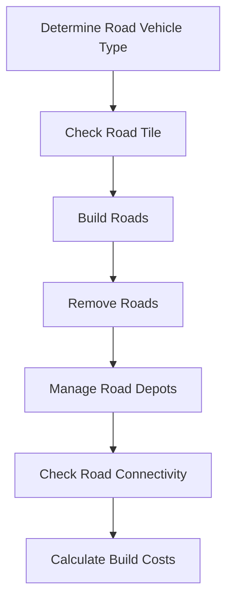

# Getting Started with Road Management API

Road Management in the API involves various functionalities to handle road-related operations within the game. It includes determining the type of road vehicle suitable for a specific cargo type, checking if a tile is a road tile, and verifying if a road type is available. The API also provides methods to build, remove, and convert roads, as well as to manage road depots and stations. Additionally, it includes functions to check road connectivity, build costs, and maintenance costs.

<SwmSnippet path="/src/script/api/script_road.cpp" line="23">

---

## Determining Road Vehicle Type

The function <SwmToken path="src/script/api/script_road.cpp" pos="23:12:12" line-data="/* static */ ScriptRoad::RoadVehicleType ScriptRoad::GetRoadVehicleTypeForCargo(CargoID cargo_type)">`GetRoadVehicleTypeForCargo`</SwmToken> determines the type of road vehicle suitable for a specific cargo type.

```c++
/* static */ ScriptRoad::RoadVehicleType ScriptRoad::GetRoadVehicleTypeForCargo(CargoID cargo_type)
{
	return ScriptCargo::HasCargoClass(cargo_type, ScriptCargo::CC_PASSENGERS) ? ROADVEHTYPE_BUS : ROADVEHTYPE_TRUCK;
```

---

</SwmSnippet>

<SwmSnippet path="/src/script/api/script_road.cpp" line="35">

---

## Checking Road Tile

The function <SwmToken path="src/script/api/script_road.cpp" pos="35:10:10" line-data="/* static */ bool ScriptRoad::IsRoadTile(TileIndex tile)">`IsRoadTile`</SwmToken> checks if a given tile is a road tile.

```c++
/* static */ bool ScriptRoad::IsRoadTile(TileIndex tile)
{
	if (!::IsValidTile(tile)) return false;

	return (::IsTileType(tile, MP_ROAD) && ::GetRoadTileType(tile) != ROAD_TILE_DEPOT) ||
			IsDriveThroughRoadStationTile(tile);
}
```

---

</SwmSnippet>

<SwmSnippet path="/src/script/api/script_road.cpp" line="491">

---

## Building Roads

The function <SwmToken path="src/script/api/script_road.cpp" pos="491:10:10" line-data="/* static */ bool ScriptRoad::_BuildRoadInternal(TileIndex start, TileIndex end, bool one_way, bool full)">`_BuildRoadInternal`</SwmToken> is used to build roads between specified tiles.

```c++
/* static */ bool ScriptRoad::_BuildRoadInternal(TileIndex start, TileIndex end, bool one_way, bool full)
{
	EnforceDeityOrCompanyModeValid(false);
	EnforcePrecondition(false, start != end);
	EnforcePrecondition(false, ::IsValidTile(start));
	EnforcePrecondition(false, ::IsValidTile(end));
	EnforcePrecondition(false, ::TileX(start) == ::TileX(end) || ::TileY(start) == ::TileY(end));
	EnforcePrecondition(false, !one_way || RoadTypeIsRoad(ScriptObject::GetRoadType()));
	EnforcePrecondition(false, IsRoadTypeAvailable(GetCurrentRoadType()));

	Axis axis = ::TileY(start) != ::TileY(end) ? AXIS_Y : AXIS_X;
	return ScriptObject::Command<CMD_BUILD_LONG_ROAD>::Do(end, start, ScriptObject::GetRoadType(), axis, one_way ? DRD_NORTHBOUND : DRD_NONE, (start < end) == !full, (start < end) != !full, true);
}
```

---

</SwmSnippet>

<SwmSnippet path="/src/script/api/script_road.cpp" line="568">

---

## Removing Roads

The function <SwmToken path="src/script/api/script_road.cpp" pos="568:10:10" line-data="/* static */ bool ScriptRoad::RemoveRoad(TileIndex start, TileIndex end)">`RemoveRoad`</SwmToken> is used to remove roads between specified tiles.

```c++
/* static */ bool ScriptRoad::RemoveRoad(TileIndex start, TileIndex end)
{
	EnforceCompanyModeValid(false);
	EnforcePrecondition(false, start != end);
	EnforcePrecondition(false, ::IsValidTile(start));
	EnforcePrecondition(false, ::IsValidTile(end));
	EnforcePrecondition(false, ::TileX(start) == ::TileX(end) || ::TileY(start) == ::TileY(end));
	EnforcePrecondition(false, IsRoadTypeAvailable(GetCurrentRoadType()));

	return ScriptObject::Command<CMD_REMOVE_LONG_ROAD>::Do(end, start, ScriptObject::GetRoadType(), ::TileY(start) != ::TileY(end) ? AXIS_Y : AXIS_X, start < end, start >= end);
}
```

---

</SwmSnippet>

<SwmSnippet path="/src/script/api/script_road.cpp" line="527">

---

## Managing Road Depots

The function <SwmToken path="src/script/api/script_road.cpp" pos="527:10:10" line-data="/* static */ bool ScriptRoad::BuildRoadDepot(TileIndex tile, TileIndex front)">`BuildRoadDepot`</SwmToken> is used to build road depots at specified tiles.

```c++
/* static */ bool ScriptRoad::BuildRoadDepot(TileIndex tile, TileIndex front)
{
	EnforceCompanyModeValid(false);
	EnforcePrecondition(false, tile != front);
	EnforcePrecondition(false, ::IsValidTile(tile));
	EnforcePrecondition(false, ::IsValidTile(front));
	EnforcePrecondition(false, ::TileX(tile) == ::TileX(front) || ::TileY(tile) == ::TileY(front));
	EnforcePrecondition(false, IsRoadTypeAvailable(GetCurrentRoadType()));

	DiagDirection entrance_dir = (::TileX(tile) == ::TileX(front)) ? (::TileY(tile) < ::TileY(front) ? DIAGDIR_SE : DIAGDIR_NW) : (::TileX(tile) < ::TileX(front) ? DIAGDIR_SW : DIAGDIR_NE);

	return ScriptObject::Command<CMD_BUILD_ROAD_DEPOT>::Do(tile, ScriptObject::GetRoadType(), entrance_dir);
}
```

---

</SwmSnippet>

<SwmSnippet path="/src/script/api/script_road.cpp" line="106">

---

## Checking Road Connectivity

The function <SwmToken path="src/script/api/script_road.cpp" pos="106:10:10" line-data="/* static */ bool ScriptRoad::AreRoadTilesConnected(TileIndex t1, TileIndex t2)">`AreRoadTilesConnected`</SwmToken> checks if two road tiles are connected.

```c++
/* static */ bool ScriptRoad::AreRoadTilesConnected(TileIndex t1, TileIndex t2)
{
	if (!::IsValidTile(t1)) return false;
	if (!::IsValidTile(t2)) return false;
	if (!IsRoadTypeAvailable(GetCurrentRoadType())) return false;

	/* Tiles not neighbouring */
	if ((abs((int)::TileX(t1) - (int)::TileX(t2)) + abs((int)::TileY(t1) - (int)::TileY(t2))) != 1) return false;

	RoadTramType rtt = ::GetRoadTramType(ScriptObject::GetRoadType());
	RoadBits r1 = ::GetAnyRoadBits(t1, rtt); // TODO
	RoadBits r2 = ::GetAnyRoadBits(t2, rtt); // TODO

	uint dir_1 = (::TileX(t1) == ::TileX(t2)) ? (::TileY(t1) < ::TileY(t2) ? 2 : 0) : (::TileX(t1) < ::TileX(t2) ? 1 : 3);
	uint dir_2 = 2 ^ dir_1;

	DisallowedRoadDirections drd2 = IsNormalRoadTile(t2) ? GetDisallowedRoadDirections(t2) : DRD_NONE;

	return HasBit(r1, dir_1) && HasBit(r2, dir_2) && drd2 != DRD_BOTH && drd2 != (dir_1 > dir_2 ? DRD_SOUTHBOUND : DRD_NORTHBOUND);
}
```

---

</SwmSnippet>

<SwmSnippet path="/src/script/api/script_road.cpp" line="612">

---

## Calculating Build Costs

The function <SwmToken path="src/script/api/script_road.cpp" pos="612:10:10" line-data="/* static */ Money ScriptRoad::GetBuildCost(RoadType roadtype, BuildType build_type)">`GetBuildCost`</SwmToken> calculates the cost of building a road of a specified type.

```c++
/* static */ Money ScriptRoad::GetBuildCost(RoadType roadtype, BuildType build_type)
{
	if (!ScriptRoad::IsRoadTypeAvailable(roadtype)) return -1;

	switch (build_type) {
		case BT_ROAD:       return ::RoadBuildCost((::RoadType)roadtype);
		case BT_DEPOT:      return ::GetPrice(PR_BUILD_DEPOT_ROAD, 1, nullptr);
		case BT_BUS_STOP:   return ::GetPrice(PR_BUILD_STATION_BUS, 1, nullptr);
		case BT_TRUCK_STOP: return ::GetPrice(PR_BUILD_STATION_TRUCK, 1, nullptr);
		default: return -1;
	}
}
```

---

</SwmSnippet>

&nbsp;

*This is an auto-generated document by Swimm AI 🌊 and has not yet been verified by a human*

<SwmMeta version="3.0.0" repo-id="Z2l0aHViJTNBJTNBT3BlblRURC1jb3BpbG90LWRlbW8lM0ElM0Fzd2ltbWlv" repo-name="OpenTTD-copilot-demo"><sup>Powered by [Swimm](/)</sup></SwmMeta>
