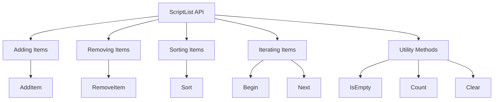

# Getting Started with <SwmToken path="src/script/api/script_list.cpp" pos="426:2:2" line-data="void ScriptList::Clear()">`ScriptList`</SwmToken> API

The <SwmToken path="src/script/api/script_list.cpp" pos="426:2:2" line-data="void ScriptList::Clear()">`ScriptList`</SwmToken> API provides a collection of functions and methods for interacting with the <SwmToken path="src/script/api/script_list.cpp" pos="426:2:2" line-data="void ScriptList::Clear()">`ScriptList`</SwmToken> class. This includes methods for adding, removing, and manipulating items within the list, as well as sorting and iterating over the items.

# Adding and Removing Items

The <SwmToken path="src/script/api/script_list.cpp" pos="435:4:4" line-data="void ScriptList::AddItem(SQInteger item, SQInteger value)">`AddItem`</SwmToken> method is used to add a new item to the <SwmToken path="src/script/api/script_list.cpp" pos="426:2:2" line-data="void ScriptList::Clear()">`ScriptList`</SwmToken>. It checks if the item already exists and, if not, inserts it into the list and updates the corresponding bucket.

<SwmSnippet path="/src/script/api/script_list.cpp" line="435">

---

The <SwmToken path="src/script/api/script_list.cpp" pos="435:4:4" line-data="void ScriptList::AddItem(SQInteger item, SQInteger value)">`AddItem`</SwmToken> method implementation shows how the item is added to the <SwmToken path="src/script/api/script_list.cpp" pos="441:3:3" line-data="	this-&gt;items[item] = value;">`items`</SwmToken> map and the <SwmToken path="src/script/api/script_list.cpp" pos="442:3:3" line-data="	this-&gt;buckets[value].insert(item);">`buckets`</SwmToken> map.

```c++
void ScriptList::AddItem(SQInteger item, SQInteger value)
{
	this->modifications++;

	if (this->HasItem(item)) return;

	this->items[item] = value;
	this->buckets[value].insert(item);
}
```

---

</SwmSnippet>

The <SwmToken path="src/script/api/script_list.cpp" pos="445:4:4" line-data="void ScriptList::RemoveItem(SQInteger item)">`RemoveItem`</SwmToken> method is used to remove an item from the <SwmToken path="src/script/api/script_list.cpp" pos="426:2:2" line-data="void ScriptList::Clear()">`ScriptList`</SwmToken>. It finds the item, removes it from the sorter, and updates the buckets accordingly.

<SwmSnippet path="/src/script/api/script_list.cpp" line="445">

---

The <SwmToken path="src/script/api/script_list.cpp" pos="445:4:4" line-data="void ScriptList::RemoveItem(SQInteger item)">`RemoveItem`</SwmToken> method implementation demonstrates how the item is removed from the <SwmToken path="src/script/api/script_list.cpp" pos="449:11:11" line-data="	ScriptListMap::iterator item_iter = this-&gt;items.find(item);">`items`</SwmToken> map and the <SwmToken path="src/script/api/script_list.cpp" pos="455:11:11" line-data="	ScriptListBucket::iterator bucket_iter = this-&gt;buckets.find(value);">`buckets`</SwmToken> map.

```c++
void ScriptList::RemoveItem(SQInteger item)
{
	this->modifications++;

	ScriptListMap::iterator item_iter = this->items.find(item);
	if (item_iter == this->items.end()) return;

	SQInteger value = item_iter->second;

	this->sorter->Remove(item);
	ScriptListBucket::iterator bucket_iter = this->buckets.find(value);
	assert(bucket_iter != this->buckets.end());
	bucket_iter->second.erase(item);
	if (bucket_iter->second.empty()) this->buckets.erase(bucket_iter);
	this->items.erase(item_iter);
}
```

---

</SwmSnippet>

# Sorting Items

The <SwmToken path="src/script/api/script_list.cpp" pos="523:4:4" line-data="void ScriptList::Sort(SorterType sorter, bool ascending)">`Sort`</SwmToken> method allows the <SwmToken path="src/script/api/script_list.cpp" pos="426:2:2" line-data="void ScriptList::Clear()">`ScriptList`</SwmToken> to be sorted based on different criteria. It supports sorting by value or item, in ascending or descending order, by creating the appropriate sorter instance.

<SwmSnippet path="/src/script/api/script_list.cpp" line="523">

---

The <SwmToken path="src/script/api/script_list.cpp" pos="523:4:4" line-data="void ScriptList::Sort(SorterType sorter, bool ascending)">`Sort`</SwmToken> method implementation shows how different sorter instances are created based on the sorting criteria.

```c++
void ScriptList::Sort(SorterType sorter, bool ascending)
{
	this->modifications++;

	if (sorter != SORT_BY_VALUE && sorter != SORT_BY_ITEM) return;
	if (sorter == this->sorter_type && ascending == this->sort_ascending) return;

	delete this->sorter;
	switch (sorter) {
		case SORT_BY_ITEM:
			if (ascending) {
				this->sorter = new ScriptListSorterItemAscending(this);
			} else {
				this->sorter = new ScriptListSorterItemDescending(this);
			}
			break;

		case SORT_BY_VALUE:
			if (ascending) {
				this->sorter = new ScriptListSorterValueAscending(this);
			} else {
```

---

</SwmSnippet>

# Iterating Over Items

The <SwmToken path="src/script/api/script_list.cpp" pos="462:4:4" line-data="SQInteger ScriptList::Begin()">`Begin`</SwmToken> and <SwmToken path="src/script/api/script_list.cpp" pos="468:4:4" line-data="SQInteger ScriptList::Next()">`Next`</SwmToken> methods are used to iterate over the items in the <SwmToken path="src/script/api/script_list.cpp" pos="426:2:2" line-data="void ScriptList::Clear()">`ScriptList`</SwmToken>. <SwmToken path="src/script/api/script_list.cpp" pos="462:4:4" line-data="SQInteger ScriptList::Begin()">`Begin`</SwmToken> initializes the iteration, and <SwmToken path="src/script/api/script_list.cpp" pos="468:4:4" line-data="SQInteger ScriptList::Next()">`Next`</SwmToken> moves to the next item in the list.

<SwmSnippet path="/src/script/api/script_list.cpp" line="462">

---

The <SwmToken path="src/script/api/script_list.cpp" pos="462:4:4" line-data="SQInteger ScriptList::Begin()">`Begin`</SwmToken> and <SwmToken path="src/script/api/script_list.cpp" pos="468:4:4" line-data="SQInteger ScriptList::Next()">`Next`</SwmToken> methods implementation shows how iteration over the list items is handled.

```c++
SQInteger ScriptList::Begin()
{
	this->initialized = true;
	return this->sorter->Begin();
}

SQInteger ScriptList::Next()
{
	if (!this->initialized) {
		Debug(script, 0, "Next() is invalid as Begin() is never called");
		return 0;
	}
	return this->sorter->Next();
}
```

---

</SwmSnippet>

# Utility Methods

The <SwmToken path="src/script/api/script_list.cpp" pos="477:4:4" line-data="bool ScriptList::IsEmpty()">`IsEmpty`</SwmToken> method checks if the <SwmToken path="src/script/api/script_list.cpp" pos="426:2:2" line-data="void ScriptList::Clear()">`ScriptList`</SwmToken> is empty.

<SwmSnippet path="/src/script/api/script_list.cpp" line="477">

---

The <SwmToken path="src/script/api/script_list.cpp" pos="477:4:4" line-data="bool ScriptList::IsEmpty()">`IsEmpty`</SwmToken> method implementation shows how the emptiness of the list is checked.

```c++
bool ScriptList::IsEmpty()
{
	return this->items.empty();
}
```

---

</SwmSnippet>

The <SwmToken path="src/script/api/script_list.cpp" pos="491:4:4" line-data="SQInteger ScriptList::Count()">`Count`</SwmToken> method returns the number of items in the <SwmToken path="src/script/api/script_list.cpp" pos="426:2:2" line-data="void ScriptList::Clear()">`ScriptList`</SwmToken>.

<SwmSnippet path="/src/script/api/script_list.cpp" line="491">

---

The <SwmToken path="src/script/api/script_list.cpp" pos="491:4:4" line-data="SQInteger ScriptList::Count()">`Count`</SwmToken> method implementation shows how the number of items in the list is retrieved.

```c++
SQInteger ScriptList::Count()
{
	return this->items.size();
}
```

---

</SwmSnippet>

The <SwmToken path="src/script/api/script_list.cpp" pos="426:4:4" line-data="void ScriptList::Clear()">`Clear`</SwmToken> method removes all items from the <SwmToken path="src/script/api/script_list.cpp" pos="426:2:2" line-data="void ScriptList::Clear()">`ScriptList`</SwmToken> and resets the sorter.

<SwmSnippet path="/src/script/api/script_list.cpp" line="426">

---

The <SwmToken path="src/script/api/script_list.cpp" pos="426:4:4" line-data="void ScriptList::Clear()">`Clear`</SwmToken> method implementation shows how all items are removed and the sorter is reset.

```c++
void ScriptList::Clear()
{
	this->modifications++;

	this->items.clear();
	this->buckets.clear();
	this->sorter->End();
}
```

---

</SwmSnippet>

&nbsp;

*This is an auto-generated document by Swimm AI 🌊 and has not yet been verified by a human*

<SwmMeta version="3.0.0" repo-id="Z2l0aHViJTNBJTNBT3BlblRURC1jb3BpbG90LWRlbW8lM0ElM0Fzd2ltbWlv" repo-name="OpenTTD-copilot-demo"><sup>Powered by [Swimm](/)</sup></SwmMeta>
