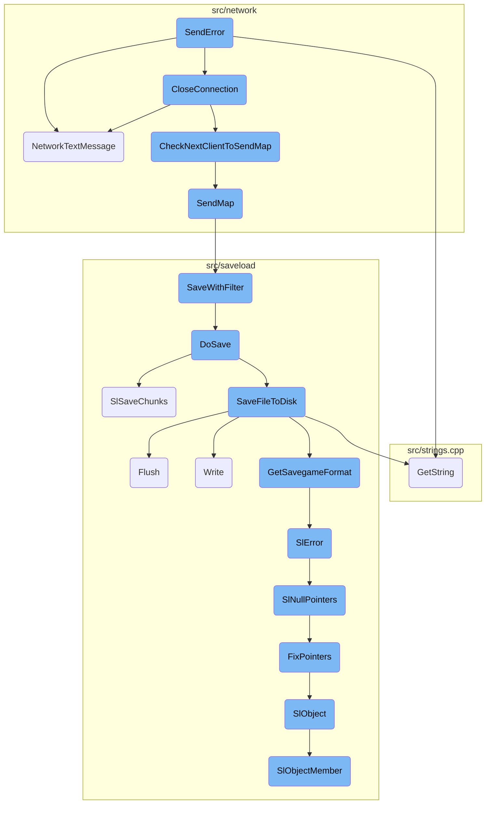
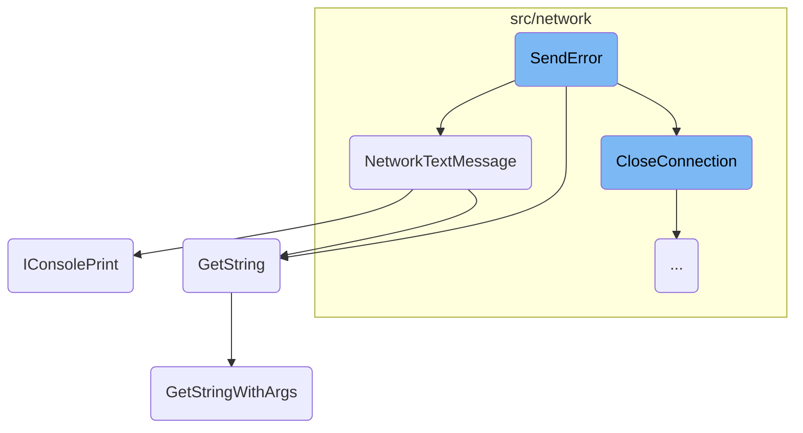
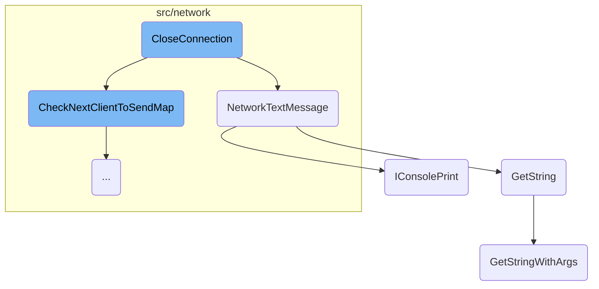
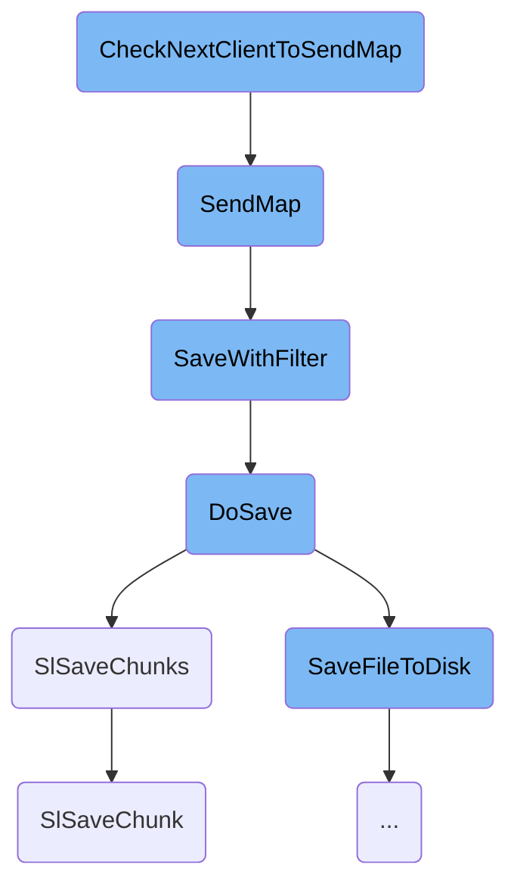
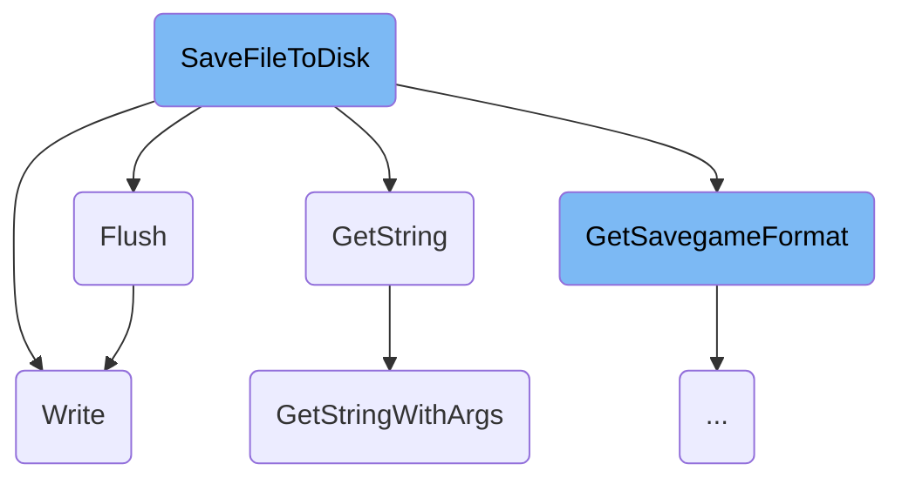

```mermaid
graph TD;
      subgraph srcsaveload["src/saveload"]
6cea157d27e07b12f59d6509abc7c9f9c7c7d8f6fba002fbf95123f8319cde01(GetSavegameFormat):::mainFlowStyle --> 0415aa1fd946e8e6318f25856f467ac10cbd27c16b721f3dc56912bb3808e7cf(SlError):::mainFlowStyle
end

subgraph srcsaveload["src/saveload"]
0415aa1fd946e8e6318f25856f467ac10cbd27c16b721f3dc56912bb3808e7cf(SlError):::mainFlowStyle --> 640acd744249feed2c09b5ea3d6d94d615a0210d4a99cc9e78fb68bb283e92ef(SlNullPointers):::mainFlowStyle
end

subgraph srcsaveload["src/saveload"]
640acd744249feed2c09b5ea3d6d94d615a0210d4a99cc9e78fb68bb283e92ef(SlNullPointers):::mainFlowStyle --> 2c5a2ab9dcbe3855e430027f9d4f7e7949c91706af61c1643cbbbc2ea228389d(FixPointers):::mainFlowStyle
end

subgraph srcsaveload["src/saveload"]
2c5a2ab9dcbe3855e430027f9d4f7e7949c91706af61c1643cbbbc2ea228389d(FixPointers):::mainFlowStyle --> 1ce5d6c64d9f512444e23df91b83933022b5844a8286b4af21be930991cabffc(SlObject):::mainFlowStyle
end

subgraph srcsaveload["src/saveload"]
1ce5d6c64d9f512444e23df91b83933022b5844a8286b4af21be930991cabffc(SlObject):::mainFlowStyle --> ec13e537af27ed1aac668da01b34e59ed1a2d2f63933eca0852d71745e92fc5e(SlObjectMember):::mainFlowStyle
end


      classDef mainFlowStyle color:#000000,fill:#7CB9F4
classDef rootsStyle color:#000000,fill:#00FFF4
classDef Style1 color:#000000,fill:#00FFAA
classDef Style2 color:#000000,fill:#FFFF00
classDef Style3 color:#000000,fill:#AA7CB9
```

This document explains the <SwmToken path="src/network/network_server.cpp" pos="360:4:4" line-data="NetworkRecvStatus ServerNetworkGameSocketHandler::SendError(NetworkErrorCode error, const std::string &amp;reason)">`SendError`</SwmToken> function, which is responsible for handling client errors in the network server. The function sends an error message to the client, closes the connection, and logs the error. It also broadcasts the error to other clients if necessary.

When a client encounters an error, the <SwmToken path="src/network/network_server.cpp" pos="360:4:4" line-data="NetworkRecvStatus ServerNetworkGameSocketHandler::SendError(NetworkErrorCode error, const std::string &amp;reason)">`SendError`</SwmToken> function is triggered. First, it logs the error for debugging purposes. Then, it creates a packet containing the error code and an optional reason for the error. This packet is sent to the client. If the client was authorized and actively participating in the game, the function retrieves the client's name and sends a network text message to inform other clients about the error. Finally, the client's connection is closed to prevent further issues.

Here is a high level diagram of the flow, showing only the most important functions:



# Flow drill down

First, we'll zoom into this section of the flow:



<SwmSnippet path="/src/network/network_server.cpp" line="355">

---

## Handling Client Errors

The <SwmToken path="src/network/network_server.cpp" pos="360:4:4" line-data="NetworkRecvStatus ServerNetworkGameSocketHandler::SendError(NetworkErrorCode error, const std::string &amp;reason)">`SendError`</SwmToken> function handles client errors by sending an error message to the client and closing the connection. It logs the error, sends a packet with the error code and reason, and broadcasts the error to other clients if necessary.

```c++
/**
 * Send an error to the client, and close its connection.
 * @param error The error to disconnect for.
 * @param reason In case of kicking a client, specifies the reason for kicking the client.
 */
NetworkRecvStatus ServerNetworkGameSocketHandler::SendError(NetworkErrorCode error, const std::string &reason)
{
	Debug(net, 9, "client[{}] SendError(): error={}", this->client_id, error);

	auto p = std::make_unique<Packet>(this, PACKET_SERVER_ERROR);

	p->Send_uint8(error);
	if (!reason.empty()) p->Send_string(reason);
	this->SendPacket(std::move(p));

	StringID strid = GetNetworkErrorMsg(error);

	/* Only send when the current client was in game */
	if (this->status >= STATUS_AUTHORIZED) {
		std::string client_name = this->GetClientName();

```

---

</SwmSnippet>

<SwmSnippet path="/src/network/network.cpp" line="231">

---

## Sending Network Text Messages

The <SwmToken path="src/network/network.cpp" pos="234:2:2" line-data="void NetworkTextMessage(NetworkAction action, TextColour colour, bool self_send, const std::string &amp;name, const std::string &amp;str, int64_t data, const std::string &amp;data_str)">`NetworkTextMessage`</SwmToken> function sends a text message to the console or chat box. It formats the message based on the action type and sends it to the appropriate destination, ensuring that the message is correctly displayed to the user.

```c++
/* This puts a text-message to the console, or in the future, the chat-box,
 *  (to keep it all a bit more general)
 * If 'self_send' is true, this is the client who is sending the message */
void NetworkTextMessage(NetworkAction action, TextColour colour, bool self_send, const std::string &name, const std::string &str, int64_t data, const std::string &data_str)
{
	StringID strid;
	switch (action) {
		case NETWORK_ACTION_SERVER_MESSAGE:
			/* Ignore invalid messages */
			strid = STR_NETWORK_SERVER_MESSAGE;
			colour = CC_DEFAULT;
			break;
		case NETWORK_ACTION_COMPANY_SPECTATOR:
			colour = CC_DEFAULT;
			strid = STR_NETWORK_MESSAGE_CLIENT_COMPANY_SPECTATE;
			break;
		case NETWORK_ACTION_COMPANY_JOIN:
			colour = CC_DEFAULT;
			strid = STR_NETWORK_MESSAGE_CLIENT_COMPANY_JOIN;
			break;
		case NETWORK_ACTION_COMPANY_NEW:
```

---

</SwmSnippet>

<SwmSnippet path="/src/strings.cpp" line="321">

---

### Resolving String Identifiers

The <SwmToken path="src/strings.cpp" pos="327:4:4" line-data="std::string GetString(StringID string)">`GetString`</SwmToken> function resolves a <SwmToken path="src/strings.cpp" pos="322:9:9" line-data=" * Resolve the given StringID into a std::string with all the associated">`StringID`</SwmToken> into a translatable string. It prepares the string parameters and calls <SwmToken path="src/strings.cpp" pos="330:3:3" line-data="	return GetStringWithArgs(string, _global_string_params);">`GetStringWithArgs`</SwmToken> to get the formatted string.

```c++
/**
 * Resolve the given StringID into a std::string with all the associated
 * DParam lookups and formatting.
 * @param string The unique identifier of the translatable string.
 * @return The std::string of the translated string.
 */
std::string GetString(StringID string)
{
	_global_string_params.PrepareForNextRun();
	return GetStringWithArgs(string, _global_string_params);
}
```

---

</SwmSnippet>

<SwmSnippet path="/src/strings.cpp" line="253">

---

### Formatting Strings with Arguments

The <SwmToken path="src/strings.cpp" pos="261:2:2" line-data="void GetStringWithArgs(StringBuilder &amp;builder, StringID string, StringParameters &amp;args, uint case_index, bool game_script)">`GetStringWithArgs`</SwmToken> function formats a string with the provided arguments. It handles special string codes and ensures that the string is correctly formatted based on the context.

```c++
/**
 * Get a parsed string with most special stringcodes replaced by the string parameters.
 * @param builder     The builder of the string.
 * @param string      The ID of the string to parse.
 * @param args        Arguments for the string.
 * @param case_index  The "case index". This will only be set when FormatString wants to print the string in a different case.
 * @param game_script The string is coming directly from a game script.
 */
void GetStringWithArgs(StringBuilder &builder, StringID string, StringParameters &args, uint case_index, bool game_script)
{
	if (string == 0) {
		GetStringWithArgs(builder, STR_UNDEFINED, args);
		return;
	}

	uint index = GetStringIndex(string);
	StringTab tab = GetStringTab(string);

	switch (tab) {
		case TEXT_TAB_TOWN:
			if (index >= 0xC0 && !game_script) {
```

---

</SwmSnippet>

<SwmSnippet path="/src/console.cpp" line="82">

---

## Printing to Console

The <SwmToken path="src/console.cpp" pos="91:2:2" line-data="void IConsolePrint(TextColour colour_code, const std::string &amp;string)">`IConsolePrint`</SwmToken> function handles printing text to the console. It redirects the text to clients or administrators if necessary, logs the text, and prints it to the console GUI.

```c++
/**
 * Handle the printing of text entered into the console or redirected there
 * by any other means. Text can be redirected to other clients in a network game
 * as well as to a logfile. If the network server is a dedicated server, all activities
 * are also logged. All lines to print are added to a temporary buffer which can be
 * used as a history to print them onscreen
 * @param colour_code The colour of the command.
 * @param string The message to output on the console (notice, error, etc.)
 */
void IConsolePrint(TextColour colour_code, const std::string &string)
{
	assert(IsValidConsoleColour(colour_code));

	if (_redirect_console_to_client != INVALID_CLIENT_ID) {
		/* Redirect the string to the client */
		NetworkServerSendRcon(_redirect_console_to_client, colour_code, string);
		return;
	}

	if (_redirect_console_to_admin != INVALID_ADMIN_ID) {
		NetworkServerSendAdminRcon(_redirect_console_to_admin, colour_code, string);
```

---

</SwmSnippet>

Now, lets zoom into this section of the flow:



<SwmSnippet path="/src/network/network_server.cpp" line="246">

---

## Handling Client Disconnection

When a client disconnects unexpectedly, the server checks if the disconnection was due to a client quit or a server error. If not, it sends a message to other clients informing them of the disconnection. This ensures that all clients are aware of the change in the network state.

```c++
	if (this->IsPendingDeletion() || this->sock == INVALID_SOCKET) return status;

	if (status != NETWORK_RECV_STATUS_CLIENT_QUIT && status != NETWORK_RECV_STATUS_SERVER_ERROR && !this->HasClientQuit() && this->status >= STATUS_AUTHORIZED) {
		/* We did not receive a leave message from this client... */
		std::string client_name = this->GetClientName();

		NetworkTextMessage(NETWORK_ACTION_LEAVE, CC_DEFAULT, false, client_name, "", STR_NETWORK_ERROR_CLIENT_CONNECTION_LOST);

		/* Inform other clients of this... strange leaving ;) */
		for (NetworkClientSocket *new_cs : NetworkClientSocket::Iterate()) {
			if (new_cs->status >= STATUS_AUTHORIZED && this != new_cs) {
				new_cs->SendErrorQuit(this->client_id, NETWORK_ERROR_CONNECTION_LOST);
			}
		}
	}
```

---

</SwmSnippet>

<SwmSnippet path="/src/network/network_server.cpp" line="262">

---

## Stopping Map Transfer

If the client was in the process of receiving a map, the server stops the savegame creation process and queues the next client to receive the map. This prevents incomplete map transfers and ensures the next client can receive the map without issues.

```c++
	/* If we were transfering a map to this client, stop the savegame creation
	 * process and queue the next client to receive the map. */
	if (this->status == STATUS_MAP) {
		/* Ensure the saving of the game is stopped too. */
		this->savegame->Destroy();
		this->savegame = nullptr;

		this->CheckNextClientToSendMap(this);
	}
```

---

</SwmSnippet>

<SwmSnippet path="/src/network/network_server.cpp" line="276">

---

## Updating Client Count

The server updates the count of connected clients. This is crucial for maintaining an accurate count of active clients and ensuring the server's state reflects the current network conditions.

```c++
	if (this->status >= STATUS_AUTHORIZED) _network_game_info.clients_on--;
	extern uint8_t _network_clients_connected;
	_network_clients_connected--;

```

---

</SwmSnippet>

Now, lets zoom into this section of the flow:



<SwmSnippet path="/src/network/network_server.cpp" line="525">

---

## Selecting the Next Client to Send the Map

The function <SwmToken path="src/network/network_server.cpp" pos="525:4:4" line-data="void ServerNetworkGameSocketHandler::CheckNextClientToSendMap(NetworkClientSocket *ignore_cs)">`CheckNextClientToSendMap`</SwmToken> is responsible for determining which client should receive the game map next. It iterates through the list of clients, ignoring the specified client, and selects the best candidate based on their join date and client ID. If a suitable client is found, their status is updated to <SwmToken path="src/network/network_server.cpp" pos="544:7:7" line-data="		best-&gt;status = STATUS_AUTHORIZED;">`STATUS_AUTHORIZED`</SwmToken>, and the map sending process is initiated by calling <SwmToken path="src/network/network_server.cpp" pos="545:3:3" line-data="		best-&gt;SendMap();">`SendMap`</SwmToken>. Additionally, it updates the status of other clients waiting for the map.

```c++
void ServerNetworkGameSocketHandler::CheckNextClientToSendMap(NetworkClientSocket *ignore_cs)
{
	Debug(net, 9, "client[{}] CheckNextClientToSendMap()", this->client_id);

	/* Find the best candidate for joining, i.e. the first joiner. */
	NetworkClientSocket *best = nullptr;
	for (NetworkClientSocket *new_cs : NetworkClientSocket::Iterate()) {
		if (ignore_cs == new_cs) continue;

		if (new_cs->status == STATUS_MAP_WAIT) {
			if (best == nullptr || best->GetInfo()->join_date > new_cs->GetInfo()->join_date || (best->GetInfo()->join_date == new_cs->GetInfo()->join_date && best->client_id > new_cs->client_id)) {
				best = new_cs;
			}
		}
	}

	/* Is there someone else to join? */
	if (best != nullptr) {
		/* Let the first start joining. */
		best->status = STATUS_AUTHORIZED;
		best->SendMap();
```

---

</SwmSnippet>

<SwmSnippet path="/src/network/network_server.cpp" line="554">

---

## Initiating the Map Sending Process

The function <SwmToken path="src/network/network_server.cpp" pos="555:4:4" line-data="NetworkRecvStatus ServerNetworkGameSocketHandler::SendMap()">`SendMap`</SwmToken> handles the actual process of sending the game map to the client. It first checks if the client is authorized to receive the map. If authorized, it prepares the map data and sends the initial packet containing the frame counter and the number of packets to be sent. The function then enters a loop to transfer the map data in packets. Once all packets are sent, it updates the client's status to <SwmToken path="src/network/network_server.cpp" pos="596:7:7" line-data="			this-&gt;status = STATUS_DONE_MAP;">`STATUS_DONE_MAP`</SwmToken> and calls <SwmToken path="src/network/network_server.cpp" pos="269:3:3" line-data="		this-&gt;CheckNextClientToSendMap(this);">`CheckNextClientToSendMap`</SwmToken> to continue the process with the next client.

```c++
/** This sends the map to the client */
NetworkRecvStatus ServerNetworkGameSocketHandler::SendMap()
{
	if (this->status < STATUS_AUTHORIZED) {
		/* Illegal call, return error and ignore the packet */
		return this->SendError(NETWORK_ERROR_NOT_AUTHORIZED);
	}

	if (this->status == STATUS_AUTHORIZED) {
		Debug(net, 9, "client[{}] SendMap(): first_packet", this->client_id);

		WaitTillSaved();
		this->savegame = std::make_shared<PacketWriter>(this);

		/* Now send the _frame_counter and how many packets are coming */
		auto p = std::make_unique<Packet>(this, PACKET_SERVER_MAP_BEGIN);
		p->Send_uint32(_frame_counter);
		this->SendPacket(std::move(p));

		NetworkSyncCommandQueue(this);
		Debug(net, 9, "client[{}] status = MAP", this->client_id);
```

---

</SwmSnippet>

<SwmSnippet path="/src/saveload/saveload.cpp" line="2885">

---

## Saving the Game with a Filter

The function <SwmToken path="src/saveload/saveload.cpp" pos="2891:2:2" line-data="SaveOrLoadResult SaveWithFilter(std::shared_ptr&lt;SaveFilter&gt; writer, bool threaded)">`SaveWithFilter`</SwmToken> is used to save the game state using a specified writer filter. It sets the action to <SwmToken path="src/saveload/saveload.cpp" pos="2894:7:7" line-data="		_sl.action = SLA_SAVE;">`SLA_SAVE`</SwmToken> and calls <SwmToken path="src/saveload/saveload.cpp" pos="2895:3:3" line-data="		return DoSave(writer, threaded);">`DoSave`</SwmToken> to perform the actual saving process. If an error occurs during saving, it clears the <SwmToken path="src/saveload/saveload.cpp" pos="323:18:20" line-data="	/* Distinguish between loading into _load_check_data vs. normal save/load. */">`save/load`</SwmToken> state and returns an error code.

```c++
/**
 * Save the game using a (writer) filter.
 * @param writer   The filter to write the savegame to.
 * @param threaded Whether to try to perform the saving asynchronously.
 * @return Return the result of the action. #SL_OK or #SL_ERROR
 */
SaveOrLoadResult SaveWithFilter(std::shared_ptr<SaveFilter> writer, bool threaded)
{
	try {
		_sl.action = SLA_SAVE;
		return DoSave(writer, threaded);
	} catch (...) {
		ClearSaveLoadState();
		return SL_ERROR;
	}
}
```

---

</SwmSnippet>

<SwmSnippet path="/src/saveload/saveload.cpp" line="2851">

---

## Performing the Save Operation

The function <SwmToken path="src/saveload/saveload.cpp" pos="2859:4:4" line-data="static SaveOrLoadResult DoSave(std::shared_ptr&lt;SaveFilter&gt; writer, bool threaded)">`DoSave`</SwmToken> handles the detailed process of saving the game. It first saves the game to memory using a <SwmToken path="src/saveload/saveload.cpp" pos="2863:11:11" line-data="	_sl.dumper = std::make_unique&lt;MemoryDumper&gt;();">`MemoryDumper`</SwmToken> and then writes it to a file using the provided writer filter. The function supports both <SwmToken path="src/saveload/saveload.cpp" pos="2854:25:27" line-data=" * using the writer, either in threaded mode if possible, or single-threaded.">`single-threaded`</SwmToken> and multi-threaded saving modes. If multi-threaded saving is not possible, it falls back to <SwmToken path="src/saveload/saveload.cpp" pos="2854:25:27" line-data=" * using the writer, either in threaded mode if possible, or single-threaded.">`single-threaded`</SwmToken> mode.

```c++
/**
 * Actually perform the saving of the savegame.
 * General tactics is to first save the game to memory, then write it to file
 * using the writer, either in threaded mode if possible, or single-threaded.
 * @param writer   The filter to write the savegame to.
 * @param threaded Whether to try to perform the saving asynchronously.
 * @return Return the result of the action. #SL_OK or #SL_ERROR
 */
static SaveOrLoadResult DoSave(std::shared_ptr<SaveFilter> writer, bool threaded)
{
	assert(!_sl.saveinprogress);

	_sl.dumper = std::make_unique<MemoryDumper>();
	_sl.sf = writer;

	_sl_version = SAVEGAME_VERSION;

	SaveViewportBeforeSaveGame();
	SlSaveChunks();

	SaveFileStart();
```

---

</SwmSnippet>

<SwmSnippet path="/src/saveload/saveload.cpp" line="2114">

---

## Saving All Chunks

The function <SwmToken path="src/saveload/saveload.cpp" pos="2115:4:4" line-data="static void SlSaveChunks()">`SlSaveChunks`</SwmToken> iterates through all chunk handlers and calls <SwmToken path="src/saveload/saveload.cpp" pos="2118:1:1" line-data="		SlSaveChunk(ch);">`SlSaveChunk`</SwmToken> for each one to save the respective chunk of data. It also writes a terminator at the end to indicate the end of the chunks.

```c++
/** Save all chunks */
static void SlSaveChunks()
{
	for (auto &ch : ChunkHandlers()) {
		SlSaveChunk(ch);
	}

	/* Terminator */
	SlWriteUint32(0);
}
```

---

</SwmSnippet>

<SwmSnippet path="/src/saveload/saveload.cpp" line="2074">

---

## Saving a Single Chunk

The function <SwmToken path="src/saveload/saveload.cpp" pos="2079:4:4" line-data="static void SlSaveChunk(const ChunkHandler &amp;ch)">`SlSaveChunk`</SwmToken> saves a specific chunk of data, such as vehicles or stations. Each chunk is prefixed with an ID and followed by the chunk data. The function handles different types of chunks, including tables and arrays, and ensures that the data is correctly formatted and terminated.

```c++
/**
 * Save a chunk of data (eg. vehicles, stations, etc.). Each chunk is
 * prefixed by an ID identifying it, followed by data, and terminator where appropriate
 * @param ch The chunkhandler that will be used for the operation
 */
static void SlSaveChunk(const ChunkHandler &ch)
{
	if (ch.type == CH_READONLY) return;

	SlWriteUint32(ch.id);
	Debug(sl, 2, "Saving chunk {}", ch.GetName());

	_sl.block_mode = ch.type;
	_sl.expect_table_header = (_sl.block_mode == CH_TABLE || _sl.block_mode == CH_SPARSE_TABLE);

	_sl.need_length = (_sl.expect_table_header || _sl.block_mode == CH_RIFF) ? NL_WANTLENGTH : NL_NONE;

	switch (_sl.block_mode) {
		case CH_RIFF:
			ch.Save();
			break;
```

---

</SwmSnippet>

Now, lets zoom into this section of the flow:



<SwmSnippet path="/src/saveload/saveload.cpp" line="2798">

---

## <SwmToken path="src/saveload/saveload.cpp" pos="2802:4:4" line-data="static SaveOrLoadResult SaveFileToDisk(bool threaded)">`SaveFileToDisk`</SwmToken>

The <SwmToken path="src/saveload/saveload.cpp" pos="2802:4:4" line-data="static SaveOrLoadResult SaveFileToDisk(bool threaded)">`SaveFileToDisk`</SwmToken> function is responsible for saving the entire game state to disk. It first retrieves the savegame format and compression settings using <SwmToken path="src/saveload/saveload.cpp" pos="2805:12:12" line-data="		auto [fmt, compression] = GetSavegameFormat(_savegame_format);">`GetSavegameFormat`</SwmToken>. Then, it writes the game data from memory to the file. If the save operation is threaded, it sets an asynchronous save finish callback. In case of an error, it handles the error gracefully and sets an appropriate error callback.

```c++
/**
 * We have written the whole game into memory, _memory_savegame, now find
 * and appropriate compressor and start writing to file.
 */
static SaveOrLoadResult SaveFileToDisk(bool threaded)
{
	try {
		auto [fmt, compression] = GetSavegameFormat(_savegame_format);

		/* We have written our stuff to memory, now write it to file! */
		uint32_t hdr[2] = { fmt.tag, TO_BE32(SAVEGAME_VERSION << 16) };
		_sl.sf->Write((uint8_t*)hdr, sizeof(hdr));

		_sl.sf = fmt.init_write(_sl.sf, compression);
		_sl.dumper->Flush(_sl.sf);

		ClearSaveLoadState();

		if (threaded) SetAsyncSaveFinish(SaveFileDone);

		return SL_OK;
```

---

</SwmSnippet>

<SwmSnippet path="/src/saveload/saveload.cpp" line="148">

---

### Flush

The <SwmToken path="src/saveload/saveload.cpp" pos="149:3:3" line-data="	 * Flush this dumper into a writer.">`Flush`</SwmToken> function ensures that all buffered data is written to the file. It iterates over the memory blocks and writes them to the file using the <SwmToken path="src/saveload/saveload.cpp" pos="160:3:3" line-data="			writer-&gt;Write(this-&gt;blocks[i++].get(), to_write);">`Write`</SwmToken> function. After all data is written, it calls <SwmToken path="src/saveload/saveload.cpp" pos="164:3:3" line-data="		writer-&gt;Finish();">`Finish`</SwmToken> on the writer to finalize the writing process.

```c++
	/**
	 * Flush this dumper into a writer.
	 * @param writer The filter we want to use.
	 */
	void Flush(std::shared_ptr<SaveFilter> writer)
	{
		uint i = 0;
		size_t t = this->GetSize();

		while (t > 0) {
			size_t to_write = std::min(MEMORY_CHUNK_SIZE, t);

			writer->Write(this->blocks[i++].get(), to_write);
			t -= to_write;
		}

		writer->Finish();
	}
```

---

</SwmSnippet>

<SwmSnippet path="/src/saveload/saveload.cpp" line="2239">

---

### Write

The <SwmToken path="src/saveload/saveload.cpp" pos="2239:3:3" line-data="	void Write(uint8_t *buf, size_t size) override">`Write`</SwmToken> function writes a buffer of data to the file. If the file is in a failure mode or cannot be written to, it triggers an error using <SwmToken path="src/saveload/saveload.cpp" pos="2244:25:25" line-data="		if (fwrite(buf, 1, size, this-&gt;file) != size) SlError(STR_GAME_SAVELOAD_ERROR_FILE_NOT_WRITEABLE);">`SlError`</SwmToken>. This function ensures that the data is correctly written to the file or an appropriate error is raised.

```c++
	void Write(uint8_t *buf, size_t size) override
	{
		/* We're in the process of shutting down, i.e. in "failure" mode. */
		if (this->file == nullptr) return;

		if (fwrite(buf, 1, size, this->file) != size) SlError(STR_GAME_SAVELOAD_ERROR_FILE_NOT_WRITEABLE);
	}
```

---

</SwmSnippet>

Now, lets zoom into this section of the flow:



<SwmSnippet path="/src/saveload/saveload.cpp" line="2678">

---

## Determining the Savegame Format

The function <SwmToken path="src/saveload/saveload.cpp" pos="2684:15:15" line-data="static std::pair&lt;const SaveLoadFormat &amp;, uint8_t&gt; GetSavegameFormat(const std::string &amp;full_name)">`GetSavegameFormat`</SwmToken> determines the format of the savegame, including whether it uses compression. It checks the available savegame formats and selects the appropriate one based on the provided name or defaults to the highest available format. If an invalid format or compression level is specified, it triggers an error.

```c++
/**
 * Return the savegameformat of the game. Whether it was created with ZLIB compression
 * uncompressed, or another type
 * @param full_name Name of the savegame format. If empty it picks the first available one
 * @return Pair containing reference to SaveLoadFormat struct giving all characteristics of this type of savegame, and a compression level to use.
 */
static std::pair<const SaveLoadFormat &, uint8_t> GetSavegameFormat(const std::string &full_name)
{
	/* Find default savegame format, the highest one with which files can be written. */
	auto it = std::find_if(std::rbegin(_saveload_formats), std::rend(_saveload_formats), [](const auto &slf) { return slf.init_write != nullptr; });
	if (it == std::rend(_saveload_formats)) SlError(STR_GAME_SAVELOAD_ERROR_BROKEN_INTERNAL_ERROR, "no writeable savegame formats");

	const SaveLoadFormat &def = *it;

	if (!full_name.empty()) {
		/* Get the ":..." of the compression level out of the way */
		size_t separator = full_name.find(':');
		bool has_comp_level = separator != std::string::npos;
		const std::string name(full_name, 0, has_comp_level ? separator : full_name.size());

		for (const auto &slf : _saveload_formats) {
```

---

</SwmSnippet>

<SwmSnippet path="/src/saveload/saveload.cpp" line="313">

---

## Handling Errors

The function <SwmToken path="src/saveload/saveload.cpp" pos="321:8:8" line-data="[[noreturn]] void SlError(StringID string, const std::string &amp;extra_msg)">`SlError`</SwmToken> handles errors that occur during the <SwmToken path="src/saveload/saveload.cpp" pos="323:18:20" line-data="	/* Distinguish between loading into _load_check_data vs. normal save/load. */">`save/load`</SwmToken> process. It sets up the error message and cleans up any partial savegame load by nullifying pointers and stopping any ongoing game actions. This function ensures that the game does not proceed with corrupted or incomplete data.

```c++
/**
 * Error handler. Sets everything up to show an error message and to clean
 * up the mess of a partial savegame load.
 * @param string The translatable error message to show.
 * @param extra_msg An extra error message coming from one of the APIs.
 * @note This function does never return as it throws an exception to
 *       break out of all the saveload code.
 */
[[noreturn]] void SlError(StringID string, const std::string &extra_msg)
{
	/* Distinguish between loading into _load_check_data vs. normal save/load. */
	if (_sl.action == SLA_LOAD_CHECK) {
		_load_check_data.error = string;
		_load_check_data.error_msg = extra_msg;
	} else {
		_sl.error_str = string;
		_sl.extra_msg = extra_msg;
	}

	/* We have to nullptr all pointers here; we might be in a state where
	 * the pointers are actually filled with indices, which means that
```

---

</SwmSnippet>

<SwmSnippet path="/src/saveload/saveload.cpp" line="295">

---

## Nullifying Pointers

The function <SwmToken path="src/saveload/saveload.cpp" pos="296:4:4" line-data="static void SlNullPointers()">`SlNullPointers`</SwmToken> nullifies all pointers to prevent dereferencing invalid memory locations. This is crucial during error handling to avoid segmentation faults and ensure the integrity of the <SwmToken path="src/saveload/saveload.cpp" pos="323:18:20" line-data="	/* Distinguish between loading into _load_check_data vs. normal save/load. */">`save/load`</SwmToken> process.

```c++
/** Null all pointers (convert index -> nullptr) */
static void SlNullPointers()
{
	_sl.action = SLA_NULL;

	/* We don't want any savegame conversion code to run
	 * during NULLing; especially those that try to get
	 * pointers from other pools. */
	_sl_version = SAVEGAME_VERSION;

	for (const ChunkHandler &ch : ChunkHandlers()) {
		Debug(sl, 3, "Nulling pointers for {}", ch.GetName());
		ch.FixPointers();
	}

	assert(_sl.action == SLA_NULL);
}
```

---

</SwmSnippet>

<SwmSnippet path="/src/saveload/depot_sl.cpp" line="60">

---

## Fixing Pointers

The function <SwmToken path="src/saveload/depot_sl.cpp" pos="60:3:3" line-data="	void FixPointers() const override">`FixPointers`</SwmToken> iterates over all depots and fixes their pointers. This step is necessary to ensure that all references within the savegame are correctly resolved, especially after nullifying pointers during error handling.

```c++
	void FixPointers() const override
	{
		for (Depot *depot : Depot::Iterate()) {
			SlObject(depot, _depot_desc);
			if (IsSavegameVersionBefore(SLV_141)) depot->town = Town::Get((size_t)depot->town);
		}
	}
```

---

</SwmSnippet>

<SwmSnippet path="/src/saveload/saveload.cpp" line="1668">

---

## <SwmToken path="src/saveload/saveload.cpp" pos="1245:16:18" line-data="	 * @param cmd The SaveLoadType ware are saving/loading.">`saving/loading`</SwmToken> Objects

The function <SwmToken path="src/saveload/saveload.cpp" pos="1673:2:2" line-data="void SlObject(void *object, const SaveLoadTable &amp;slt)">`SlObject`</SwmToken> is the main function for saving or loading objects. It iterates over the <SwmToken path="src/saveload/saveload.cpp" pos="1671:20:22" line-data=" * @param slt The SaveLoad table with objects to save/load.">`save/load`</SwmToken> table and processes each member of the object, ensuring that all data is correctly saved or loaded.

```c++
/**
 * Main SaveLoad function.
 * @param object The object that is being saved or loaded.
 * @param slt The SaveLoad table with objects to save/load.
 */
void SlObject(void *object, const SaveLoadTable &slt)
{
	/* Automatically calculate the length? */
	if (_sl.need_length != NL_NONE) {
		SlSetLength(SlCalcObjLength(object, slt));
		if (_sl.need_length == NL_CALCLENGTH) return;
	}

	for (auto &sld : slt) {
		SlObjectMember(object, sld);
	}
}
```

---

</SwmSnippet>

<SwmSnippet path="/src/saveload/saveload.cpp" line="1539">

---

## Processing Object Members

The function <SwmToken path="src/saveload/saveload.cpp" pos="1539:4:4" line-data="static bool SlObjectMember(void *object, const SaveLoad &amp;sld)">`SlObjectMember`</SwmToken> processes individual members of an object during the <SwmToken path="src/saveload/saveload.cpp" pos="323:18:20" line-data="	/* Distinguish between loading into _load_check_data vs. normal save/load. */">`save/load`</SwmToken> process. It handles various types of data, such as variables, references, arrays, and structures, ensuring that each member is correctly saved or loaded based on the current action (save, load, nullify, etc.).

```c++
static bool SlObjectMember(void *object, const SaveLoad &sld)
{
	if (!SlIsObjectValidInSavegame(sld)) return false;

	VarType conv = GB(sld.conv, 0, 8);
	switch (sld.cmd) {
		case SL_VAR:
		case SL_REF:
		case SL_ARR:
		case SL_REFLIST:
		case SL_DEQUE:
		case SL_VECTOR:
		case SL_STDSTR: {
			void *ptr = GetVariableAddress(object, sld);

			switch (sld.cmd) {
				case SL_VAR: SlSaveLoadConv(ptr, conv); break;
				case SL_REF: SlSaveLoadRef(ptr, conv); break;
				case SL_ARR: SlArray(ptr, sld.length, conv); break;
				case SL_REFLIST: SlRefList(ptr, conv); break;
				case SL_DEQUE: SlDeque(ptr, conv); break;
```

---

</SwmSnippet>

# Where is this flow used?

This flow is used multiple times in the codebase as represented in the following diagram:

(Note - these are only some of the entry points of this flow)

```mermaid
graph TD;
      subgraph srcnetworknetworkservercpp["src/network/network_server.cpp"]
7fd2760e16bf9eb7f115004f944c5eff5228476f820dce36ba64366da1d2b8b5(Receive_CLIENT_IDENTIFY):::rootsStyle --> 462af734f32ecce7b71afa06d233063c4b500d1d6b9e0a529695cb612c3c2a1d(SendNewGRFCheck)
end

subgraph srcnetworknetworkservercpp["src/network/network_server.cpp"]
462af734f32ecce7b71afa06d233063c4b500d1d6b9e0a529695cb612c3c2a1d(SendNewGRFCheck) --> e4f7b187ff91a0e0a27b5a6ac0d87faad52fb5b0be57aa597c26e87e3fefcbfb(SendWelcome)
end

subgraph srcnetworknetworkservercpp["src/network/network_server.cpp"]
e4f7b187ff91a0e0a27b5a6ac0d87faad52fb5b0be57aa597c26e87e3fefcbfb(SendWelcome) --> 08c468ba3f098c8a85c07a53625b50a8650a5992bf56a1518e07c9f724a6a3de(CloseConnection):::mainFlowStyle
end

subgraph srcnetworknetworkservercpp["src/network/network_server.cpp"]
08c468ba3f098c8a85c07a53625b50a8650a5992bf56a1518e07c9f724a6a3de(CloseConnection):::mainFlowStyle --> 626653cdf9f61ec5297a2ea7d4626dfa2da0324f6712fad1f3f1ff24910371f6(CheckNextClientToSendMap):::mainFlowStyle
end

subgraph srcnetworknetworkservercpp["src/network/network_server.cpp"]
626653cdf9f61ec5297a2ea7d4626dfa2da0324f6712fad1f3f1ff24910371f6(CheckNextClientToSendMap):::mainFlowStyle --> fad256a5efb3a2af88164c79beed143a55e0224e2184557c724735594ecebc5e(SendMap):::mainFlowStyle
end

subgraph srcnetworknetworkservercpp["src/network/network_server.cpp"]
fad256a5efb3a2af88164c79beed143a55e0224e2184557c724735594ecebc5e(SendMap):::mainFlowStyle --> d78232dc7d1af0e8fd11a1f53f597d561c08ff0647fbc678161dbd2d8db17405(SendError):::mainFlowStyle
end

subgraph srcnetworknetworkservercpp["src/network/network_server.cpp"]
ffd66c74b96da97f2e7d98011d33be5292583e63607d631ffa342bfc1594dc33(Receive_CLIENT_AUTH_RESPONSE):::rootsStyle --> d78232dc7d1af0e8fd11a1f53f597d561c08ff0647fbc678161dbd2d8db17405(SendError):::mainFlowStyle
end

subgraph srcnetworknetworkservercpp["src/network/network_server.cpp"]
3d3d5b33178d0e063b2f9ba6e3b5f82d8aa97132a3c64e9fdd416cdda15b7597(Receive_CLIENT_NEWGRFS_CHECKED):::rootsStyle --> d78232dc7d1af0e8fd11a1f53f597d561c08ff0647fbc678161dbd2d8db17405(SendError):::mainFlowStyle
end

subgraph srcnetworknetworkservercpp["src/network/network_server.cpp"]
ee5fea60ebf05d058dbf9345c1ece9aefb1a211c0d3d11a2e1bc3625d257dd43(Receive_CLIENT_JOIN):::rootsStyle --> d78232dc7d1af0e8fd11a1f53f597d561c08ff0647fbc678161dbd2d8db17405(SendError):::mainFlowStyle
end

subgraph srcnetworknetworkservercpp["src/network/network_server.cpp"]
26cbbd4e8ea3e167f3f897f45c7a408cbb57a0616107154d69756a0b91150cee(Receive_CLIENT_GETMAP):::rootsStyle --> d78232dc7d1af0e8fd11a1f53f597d561c08ff0647fbc678161dbd2d8db17405(SendError):::mainFlowStyle
end


      classDef mainFlowStyle color:#000000,fill:#7CB9F4
classDef rootsStyle color:#000000,fill:#00FFF4
classDef Style1 color:#000000,fill:#00FFAA
classDef Style2 color:#000000,fill:#FFFF00
classDef Style3 color:#000000,fill:#AA7CB9
```



&nbsp;

*This is an auto-generated document by Swimm AI 🌊 and has not yet been verified by a human*

<SwmMeta version="3.0.0" repo-id="Z2l0aHViJTNBJTNBT3BlblRURC1jb3BpbG90LWRlbW8lM0ElM0Fzd2ltbWlv" repo-name="OpenTTD-copilot-demo"><sup>Powered by [Swimm](/)</sup></SwmMeta>
