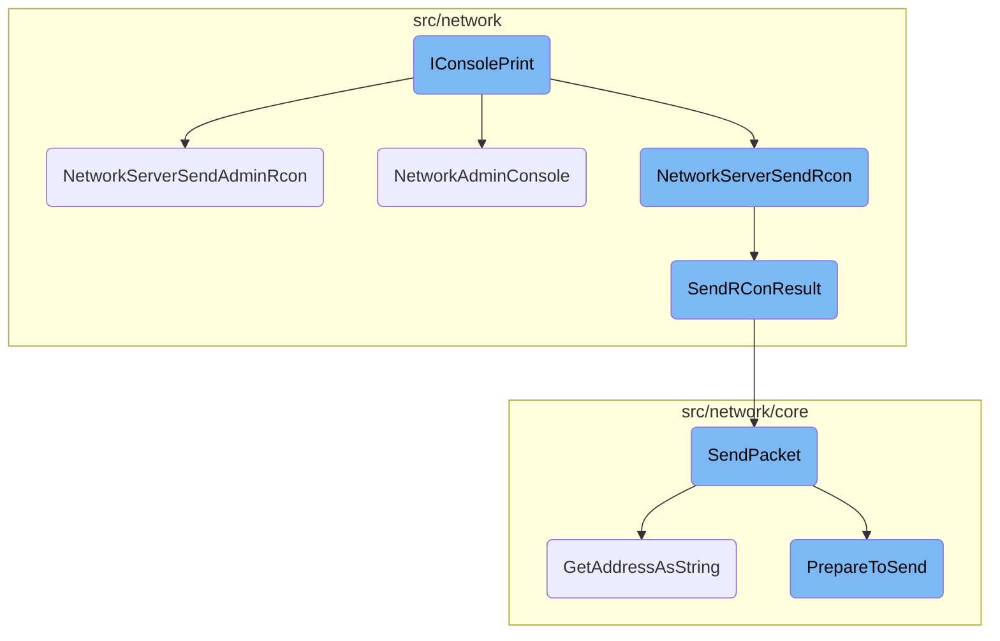
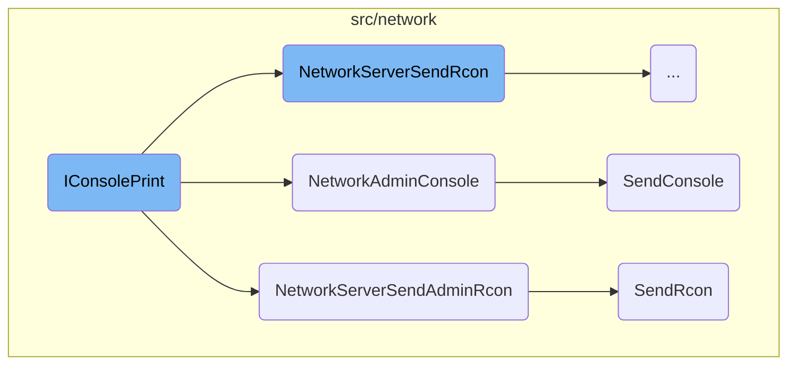
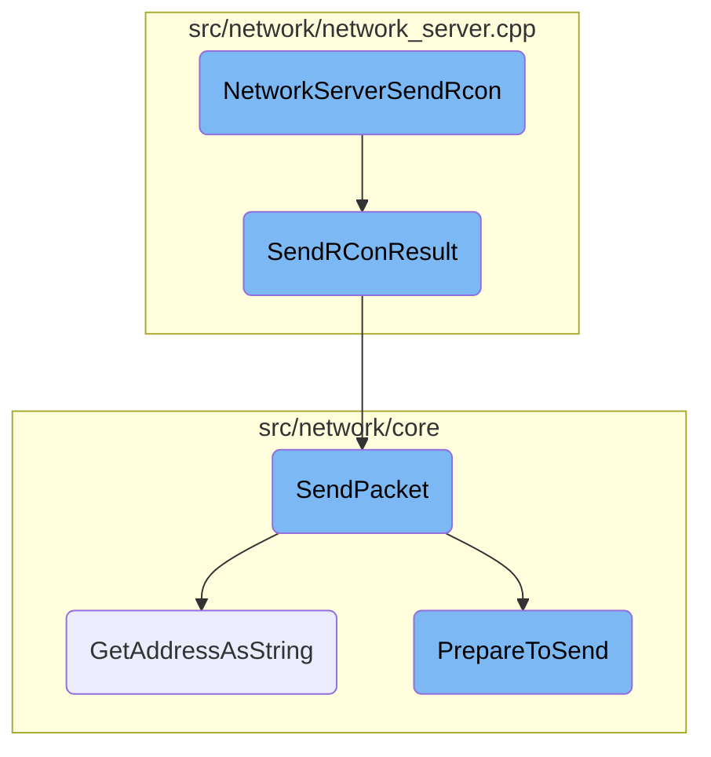
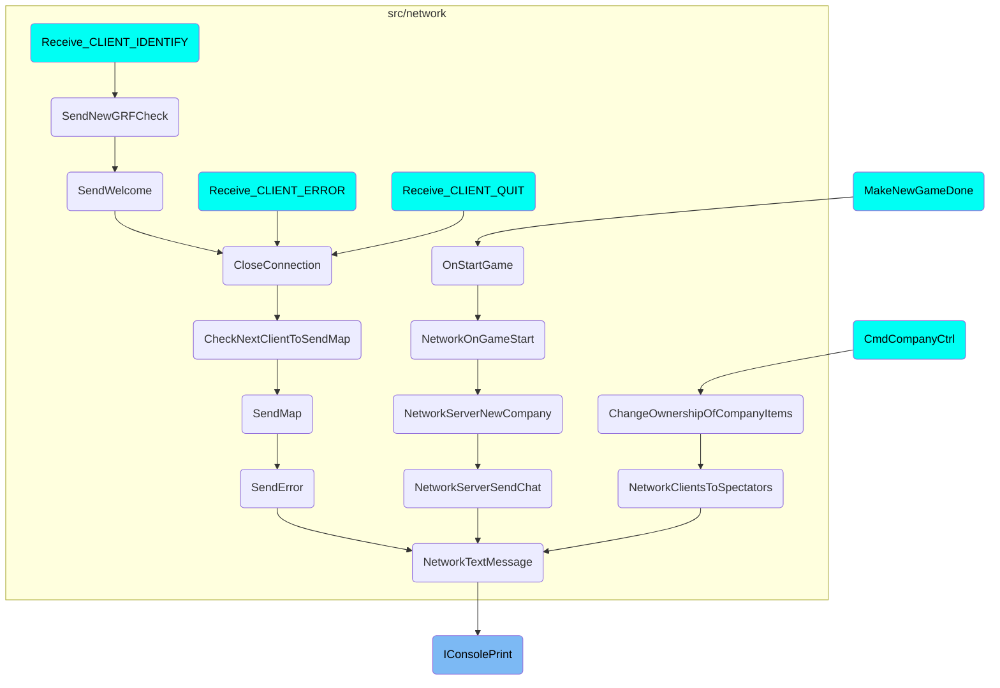

This document explains the role and functionality of <SwmToken path="src/console.cpp" pos="91:2:2" line-data="void IConsolePrint(TextColour colour_code, const std::string &amp;string)">`IConsolePrint`</SwmToken> in handling console text within the application. It covers how text is processed, redirected, and logged, as well as how it interacts with other components in the network.

The <SwmToken path="src/console.cpp" pos="91:2:2" line-data="void IConsolePrint(TextColour colour_code, const std::string &amp;string)">`IConsolePrint`</SwmToken> function is responsible for handling text that is entered into the console or redirected there. When text is entered, it first checks if it needs to be redirected to a client or admin. If so, it sends the text to the appropriate network handler. If not, it processes the text and logs it or prints it to the console. This ensures that all console activities are properly managed and recorded, whether they are local or part of a network game.

Here is a high level diagram of the flow, showing only the most important functions:



# Flow drill down

First, we'll zoom into this section of the flow:



<SwmSnippet path="/src/console.cpp" line="82">

---

## Handling Console Text

The function <SwmToken path="src/console.cpp" pos="91:2:2" line-data="void IConsolePrint(TextColour colour_code, const std::string &amp;string)">`IConsolePrint`</SwmToken> handles the printing of text entered into the console or redirected there by any other means. It can redirect text to other clients in a network game or log it to a file. If the network server is dedicated, all activities are logged. The function first checks if the console output should be redirected to a client or admin and performs the redirection if necessary. Otherwise, it processes the text and logs it or prints it to the console.

```c++
/**
 * Handle the printing of text entered into the console or redirected there
 * by any other means. Text can be redirected to other clients in a network game
 * as well as to a logfile. If the network server is a dedicated server, all activities
 * are also logged. All lines to print are added to a temporary buffer which can be
 * used as a history to print them onscreen
 * @param colour_code The colour of the command.
 * @param string The message to output on the console (notice, error, etc.)
 */
void IConsolePrint(TextColour colour_code, const std::string &string)
{
	assert(IsValidConsoleColour(colour_code));

	if (_redirect_console_to_client != INVALID_CLIENT_ID) {
		/* Redirect the string to the client */
		NetworkServerSendRcon(_redirect_console_to_client, colour_code, string);
		return;
	}

	if (_redirect_console_to_admin != INVALID_ADMIN_ID) {
		NetworkServerSendAdminRcon(_redirect_console_to_admin, colour_code, string);
```

---

</SwmSnippet>

<SwmSnippet path="/src/network/network_admin.cpp" line="1007">

---

## Redirecting to Admin

The function <SwmToken path="src/network/network_admin.cpp" pos="1013:2:2" line-data="void NetworkServerSendAdminRcon(AdminIndex admin_index, TextColour colour_code, const std::string_view string)">`NetworkServerSendAdminRcon`</SwmToken> passes the remote console (rcon) reply to the admin. It sends the string to the admin's network socket handler, which then processes the rcon command result.

```c++
/**
 * Pass the rcon reply to the admin.
 * @param admin_index The admin to give the reply.
 * @param colour_code The colour of the string.
 * @param string      The string to show.
 */
void NetworkServerSendAdminRcon(AdminIndex admin_index, TextColour colour_code, const std::string_view string)
{
	ServerNetworkAdminSocketHandler::Get(admin_index)->SendRcon(colour_code, string);
}
```

---

</SwmSnippet>

<SwmSnippet path="/src/network/network_admin.cpp" line="1018">

---

## Sending Console Output to Admin Network

The function <SwmToken path="src/network/network_admin.cpp" pos="1023:2:2" line-data="void NetworkAdminConsole(const std::string_view origin, const std::string_view string)">`NetworkAdminConsole`</SwmToken> sends console messages to the admin network if they have opted in for the respective updates. It iterates over active admin socket handlers and sends the console message to those with automatic update frequency enabled.

```c++
/**
 * Send console to the admin network (if they did opt in for the respective update).
 * @param origin the origin of the message.
 * @param string the message as printed on the console.
 */
void NetworkAdminConsole(const std::string_view origin, const std::string_view string)
{
	for (ServerNetworkAdminSocketHandler *as : ServerNetworkAdminSocketHandler::IterateActive()) {
		if (as->update_frequency[ADMIN_UPDATE_CONSOLE] & ADMIN_FREQUENCY_AUTOMATIC) {
			as->SendConsole(origin, string);
		}
	}
}
```

---

</SwmSnippet>

<SwmSnippet path="/src/network/network_admin.cpp" line="537">

---

### Sending Console Message

The method <SwmToken path="src/network/network_admin.cpp" pos="542:4:4" line-data="NetworkRecvStatus ServerNetworkAdminSocketHandler::SendConsole(const std::string_view origin, const std::string_view string)">`SendConsole`</SwmToken> in <SwmToken path="src/network/network_admin.cpp" pos="542:2:2" line-data="NetworkRecvStatus ServerNetworkAdminSocketHandler::SendConsole(const std::string_view origin, const std::string_view string)">`ServerNetworkAdminSocketHandler`</SwmToken> sends console output to other clients. It creates a packet with the console message and sends it to the admin network. If the message size exceeds the maximum transmission unit (MTU), it is ignored to ensure safe transmission.

```c++
/**
 * Send console output of other clients.
 * @param origin The origin of the string.
 * @param string The string that's put on the console.
 */
NetworkRecvStatus ServerNetworkAdminSocketHandler::SendConsole(const std::string_view origin, const std::string_view string)
{
	/* If the length of both strings, plus the 2 '\0' terminations and 3 bytes of the packet
	 * are bigger than the MTU, just ignore the message. Better safe than sorry. It should
	 * never occur though as the longest strings are chat messages, which are still 30%
	 * smaller than COMPAT_MTU. */
	if (origin.size() + string.size() + 2 + 3 >= COMPAT_MTU) return NETWORK_RECV_STATUS_OKAY;

	auto p = std::make_unique<Packet>(this, ADMIN_PACKET_SERVER_CONSOLE);

	p->Send_string(origin);
	p->Send_string(string);
	this->SendPacket(std::move(p));

	return NETWORK_RECV_STATUS_OKAY;
}
```

---

</SwmSnippet>

<SwmSnippet path="/src/network/network_admin.cpp" line="484">

---

### Sending Rcon Command Result

The method <SwmToken path="src/network/network_admin.cpp" pos="489:4:4" line-data="NetworkRecvStatus ServerNetworkAdminSocketHandler::SendRcon(uint16_t colour, const std::string_view result)">`SendRcon`</SwmToken> in <SwmToken path="src/network/network_admin.cpp" pos="489:2:2" line-data="NetworkRecvStatus ServerNetworkAdminSocketHandler::SendRcon(uint16_t colour, const std::string_view result)">`ServerNetworkAdminSocketHandler`</SwmToken> sends the result of an rcon command to the admin. It creates a packet with the command result and sends it to the admin network.

```c++
/**
 * Send the reply of an rcon command.
 * @param colour The colour of the text.
 * @param result The result of the command.
 */
NetworkRecvStatus ServerNetworkAdminSocketHandler::SendRcon(uint16_t colour, const std::string_view result)
{
	auto p = std::make_unique<Packet>(this, ADMIN_PACKET_SERVER_RCON);

	p->Send_uint16(colour);
	p->Send_string(result);
	this->SendPacket(std::move(p));

	return NETWORK_RECV_STATUS_OKAY;
}
```

---

</SwmSnippet>

Now, lets zoom into this section of the flow:



<SwmSnippet path="/src/network/network_server.cpp" line="2020">

---

## Sending RCON reply to the client

The function <SwmToken path="src/network/network_server.cpp" pos="2020:2:2" line-data="void NetworkServerSendRcon(ClientID client_id, TextColour colour_code, const std::string &amp;string)">`NetworkServerSendRcon`</SwmToken> is responsible for sending a remote console (RCON) reply to a client. It takes the client ID, a color code for the text, and the actual reply string as parameters. This function retrieves the client socket using the client ID and then calls <SwmToken path="src/network/network_server.cpp" pos="2022:8:8" line-data="	NetworkClientSocket::GetByClientID(client_id)-&gt;SendRConResult(colour_code, string);">`SendRConResult`</SwmToken> to send the reply.

```c++
void NetworkServerSendRcon(ClientID client_id, TextColour colour_code, const std::string &string)
{
	NetworkClientSocket::GetByClientID(client_id)->SendRConResult(colour_code, string);
}
```

---

</SwmSnippet>

<SwmSnippet path="/src/network/network_server.cpp" line="786">

---

## Sending RCON result

The method <SwmToken path="src/network/network_server.cpp" pos="786:4:4" line-data="NetworkRecvStatus ServerNetworkGameSocketHandler::SendRConResult(uint16_t colour, const std::string &amp;command)">`SendRConResult`</SwmToken> is used to send the result of a console action to the client. It creates a packet with the result, including the color and the command executed, and then sends this packet using the <SwmToken path="src/network/network_server.cpp" pos="794:3:3" line-data="	this-&gt;SendPacket(std::move(p));">`SendPacket`</SwmToken> method.

```c++
NetworkRecvStatus ServerNetworkGameSocketHandler::SendRConResult(uint16_t colour, const std::string &command)
{
	Debug(net, 9, "client[{}] SendRConResult()", this->client_id);

	auto p = std::make_unique<Packet>(this, PACKET_SERVER_RCON);

	p->Send_uint16(colour);
	p->Send_string(command);
	this->SendPacket(std::move(p));
	return NETWORK_RECV_STATUS_OKAY;
}
```

---

</SwmSnippet>

<SwmSnippet path="/src/network/core/udp.cpp" line="74">

---

## Sending packet over UDP

The method <SwmToken path="src/network/core/udp.cpp" pos="74:4:4" line-data="void NetworkUDPSocketHandler::SendPacket(Packet &amp;p, NetworkAddress &amp;recv, bool all, bool broadcast)">`SendPacket`</SwmToken> sends a packet over UDP to the specified receiver. It prepares the packet for sending and handles various conditions such as broadcasting. It also logs the address to which the packet is sent using <SwmToken path="src/network/core/address.cpp" pos="94:6:6" line-data="std::string NetworkAddress::GetAddressAsString(bool with_family)">`GetAddressAsString`</SwmToken>.

```c++
void NetworkUDPSocketHandler::SendPacket(Packet &p, NetworkAddress &recv, bool all, bool broadcast)
{
	if (this->sockets.empty()) this->Listen();

	for (auto &s : this->sockets) {
		/* Make a local copy because if we resolve it we cannot
		 * easily unresolve it so we can resolve it later again. */
		NetworkAddress send(recv);

		/* Not the same type */
		if (!send.IsFamily(s.second.GetAddress()->ss_family)) continue;

		p.PrepareToSend();

		if (broadcast) {
			/* Enable broadcast */
			unsigned long val = 1;
			if (setsockopt(s.first, SOL_SOCKET, SO_BROADCAST, (char *) &val, sizeof(val)) < 0) {
				Debug(net, 1, "Setting broadcast mode failed: {}", NetworkError::GetLast().AsString());
			}
		}
```

---

</SwmSnippet>

<SwmSnippet path="/src/network/core/address.cpp" line="94">

---

## Getting address as string

The method <SwmToken path="src/network/core/address.cpp" pos="94:6:6" line-data="std::string NetworkAddress::GetAddressAsString(bool with_family)">`GetAddressAsString`</SwmToken> converts the network address to a string format, including the hostname and port. This is useful for logging and debugging purposes.

```c++
std::string NetworkAddress::GetAddressAsString(bool with_family)
{
	return fmt::format(fmt::runtime(GetAddressFormatString(this->GetAddress()->ss_family, with_family)), this->GetHostname(), this->GetPort());
}
```

---

</SwmSnippet>

<SwmSnippet path="/src/network/core/packet.cpp" line="66">

---

## Preparing packet to send

The method <SwmToken path="src/network/core/packet.cpp" pos="66:4:4" line-data="void Packet::PrepareToSend()">`PrepareToSend`</SwmToken> prepares the packet by writing its size and handling encryption if necessary. This ensures that the packet is correctly formatted and secure before being sent over the network.

```c++
void Packet::PrepareToSend()
{
	/* Prevent this to be called twice and for packets that have been received. */
	assert(this->buffer[0] == 0 && this->buffer[1] == 0);

	this->buffer[0] = GB(this->Size(), 0, 8);
	this->buffer[1] = GB(this->Size(), 8, 8);

	if (cs != nullptr && cs->send_encryption_handler != nullptr) {
		size_t offset = EncodedLengthOfPacketSize();
		size_t mac_size = cs->send_encryption_handler->MACSize();
		size_t message_offset = offset + mac_size;
		cs->send_encryption_handler->Encrypt(std::span(&this->buffer[offset], mac_size), std::span(&this->buffer[message_offset], this->buffer.size() - message_offset));
	}

	this->pos  = 0; // We start reading from here
	this->buffer.shrink_to_fit();
}
```

---

</SwmSnippet>

# Where is this flow used?

This flow is used multiple times in the codebase as represented in the following diagram:

(Note - these are only some of the entry points of this flow)



&nbsp;

*This is an auto-generated document by Swimm AI 🌊 and has not yet been verified by a human*

<SwmMeta version="3.0.0" repo-id="Z2l0aHViJTNBJTNBT3BlblRURC1jb3BpbG90LWRlbW8lM0ElM0Fzd2ltbWlv" repo-name="OpenTTD-copilot-demo"><sup>Powered by [Swimm](/)</sup></SwmMeta>
