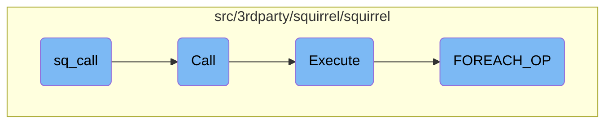
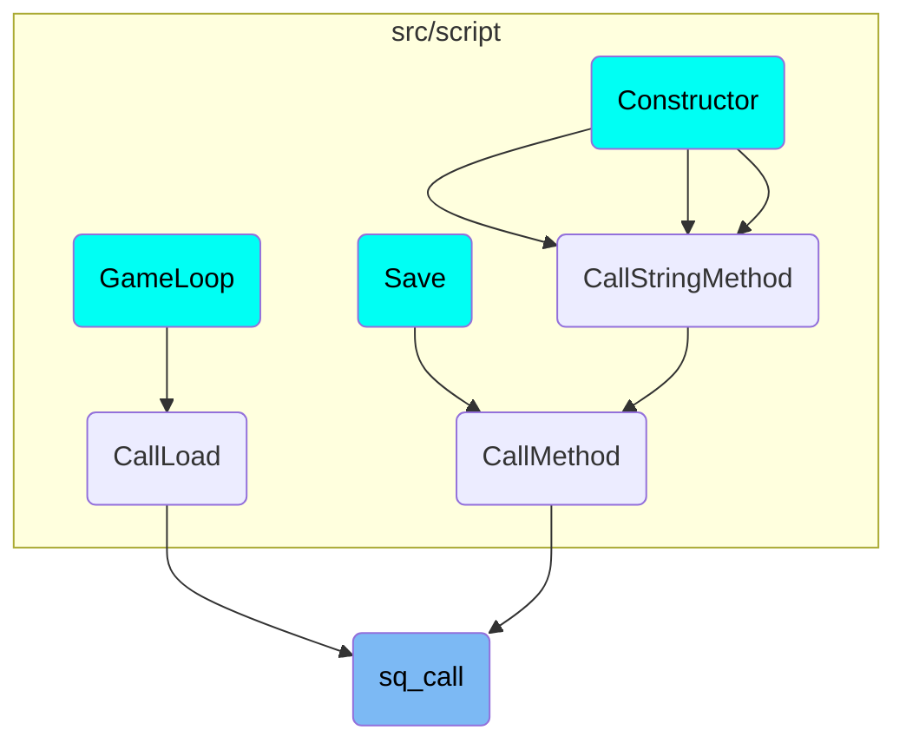

This document explains the flow of handling function calls within the Squirrel virtual machine. It covers the steps from initiating a function call to executing the bytecode and iterating over collections.

The flow starts with initiating a function call, setting up the environment, and handling any necessary suspension. If the call is successful, it manages the return value and maintains the stack. The function type is determined, and the appropriate handler is called to execute the function. The bytecode of the function is then executed, handling various execution types and managing the instruction pointer. Finally, the flow includes iterating over collections, retrieving the next element, and updating the iteration state.

# Flow drill down



<SwmSnippet path="/src/3rdparty/squirrel/squirrel/sqapi.cpp" line="971">

---

## Handling Function Calls

The <SwmToken path="src/3rdparty/squirrel/squirrel/sqapi.cpp" pos="971:2:2" line-data="SQRESULT sq_call(HSQUIRRELVM v,SQInteger params,SQBool retval,SQBool raiseerror, int suspend)">`sq_call`</SwmToken> function initiates a function call within the virtual machine. It sets up the environment for the call, including handling suspension if necessary. If the call is successful, it manages the return value and ensures the stack is correctly maintained.

```c++
SQRESULT sq_call(HSQUIRRELVM v,SQInteger params,SQBool retval,SQBool raiseerror, int suspend)
{
	SQObjectPtr res;
	v->_can_suspend = suspend >= 0;
	if (v->_can_suspend) v->_ops_till_suspend = suspend;

	if(v->Call(v->GetUp(-(params+1)),params,v->_top-params,res,raiseerror != 0,v->_can_suspend)){
		if(!v->_suspended) {
			v->Pop(params);//pop closure and args
		}
		if(retval){
			v->Push(res); return SQ_OK;
		}
		return SQ_OK;
	}
	else {
		v->Pop(params);
		return SQ_ERROR;
	}
}
```

---

</SwmSnippet>

<SwmSnippet path="/src/3rdparty/squirrel/squirrel/sqvm.cpp" line="1481">

---

## Executing Function Calls

The <SwmToken path="src/3rdparty/squirrel/squirrel/sqvm.cpp" pos="1481:4:4" line-data="bool SQVM::Call(SQObjectPtr &amp;closure,SQInteger nparams,SQInteger stackbase,SQObjectPtr &amp;outres,SQBool raiseerror,SQBool can_suspend)">`Call`</SwmToken> function determines the type of function being called (closure, native closure, or class) and delegates the execution to the appropriate handler. It ensures that the function is executed correctly and handles any necessary suspension.

```c++
bool SQVM::Call(SQObjectPtr &closure,SQInteger nparams,SQInteger stackbase,SQObjectPtr &outres,SQBool raiseerror,SQBool can_suspend)
{
	[[maybe_unused]] SQInteger prevstackbase = _stackbase;
	switch(type(closure)) {
	case OT_CLOSURE: {
		assert(!can_suspend || this->_can_suspend);
		SQBool backup_suspend = this->_can_suspend;
		this->_can_suspend = can_suspend;
		bool ret = Execute(closure, _top - nparams, nparams, stackbase,outres,raiseerror);
		this->_can_suspend = backup_suspend;
		return ret;
	}
		break;
	case OT_NATIVECLOSURE: {
		bool suspend;
		return CallNative(_nativeclosure(closure), nparams, stackbase, outres,suspend);

	}
		break;
	case OT_CLASS: {
		SQObjectPtr constr;
```

---

</SwmSnippet>

<SwmSnippet path="/src/3rdparty/squirrel/squirrel/sqvm.cpp" line="696">

---

### Closure Execution

The <SwmToken path="src/3rdparty/squirrel/squirrel/sqvm.cpp" pos="696:4:4" line-data="bool SQVM::Execute(SQObjectPtr &amp;closure, SQInteger target, SQInteger nargs, SQInteger stackbase,SQObjectPtr &amp;outres, SQBool raiseerror,ExecutionType et)">`Execute`</SwmToken> function is responsible for executing the bytecode of a closure. It handles various execution types, including regular calls, generator resumes, and VM resumes. It also manages the instruction pointer and ensures that the correct operations are performed based on the bytecode instructions.

```c++
bool SQVM::Execute(SQObjectPtr &closure, SQInteger target, SQInteger nargs, SQInteger stackbase,SQObjectPtr &outres, SQBool raiseerror,ExecutionType et)
{
	if ((_nnativecalls + 1) > MAX_NATIVE_CALLS) { Raise_Error("Native stack overflow"); return false; }
	_nnativecalls++;
	AutoDec ad(&_nnativecalls);
	SQInteger traps = 0;
	//temp_reg vars for OP_CALL
	SQInteger ct_target;
	SQInteger ct_stackbase;
	bool ct_tailcall;

	switch(et) {
		case ET_CALL: {
			SQInteger last_top = _top;
			temp_reg = closure;
			if(!StartCall(_closure(temp_reg), _top - nargs, nargs, stackbase, false)) {
				//call the handler if there are no calls in the stack, if not relies on the previous node
				if(ci == nullptr) CallErrorHandler(_lasterror);
				return false;
			}
			if (_funcproto(_closure(temp_reg)->_function)->_bgenerator) {
```

---

</SwmSnippet>

<SwmSnippet path="/src/3rdparty/squirrel/squirrel/sqvm.cpp" line="495">

---

### Iterating Over Collections

The <SwmToken path="src/3rdparty/squirrel/squirrel/sqvm.cpp" pos="496:4:4" line-data="bool SQVM::FOREACH_OP(SQObjectPtr &amp;o1,SQObjectPtr &amp;o2,SQObjectPtr">`FOREACH_OP`</SwmToken> function handles iteration over different types of collections, such as tables, arrays, strings, and classes. It retrieves the next element in the collection and updates the iteration state accordingly.

```c++
#define _FINISH(howmuchtojump) {jump = howmuchtojump; return true; }
bool SQVM::FOREACH_OP(SQObjectPtr &o1,SQObjectPtr &o2,SQObjectPtr
&o3,SQObjectPtr &o4,SQInteger arg_2,int exitpos,int &jump)
{
	SQInteger nrefidx;
	switch(type(o1)) {
	case OT_TABLE:
		if((nrefidx = _table(o1)->Next(false,o4, o2, o3)) == -1) _FINISH(exitpos);
		o4 = (SQInteger)nrefidx; _FINISH(1);
	case OT_ARRAY:
		if((nrefidx = _array(o1)->Next(o4, o2, o3)) == -1) _FINISH(exitpos);
		o4 = (SQInteger) nrefidx; _FINISH(1);
	case OT_STRING:
		if((nrefidx = _string(o1)->Next(o4, o2, o3)) == -1)_FINISH(exitpos);
		o4 = (SQInteger)nrefidx; _FINISH(1);
	case OT_CLASS:
		if((nrefidx = _class(o1)->Next(o4, o2, o3)) == -1)_FINISH(exitpos);
		o4 = (SQInteger)nrefidx; _FINISH(1);
	case OT_USERDATA:
	case OT_INSTANCE:
		if(_delegable(o1)->_delegate) {
```

---

</SwmSnippet>

# Where is this flow used?

This flow is used multiple times in the codebase as represented in the following diagram:

(Note - these are only some of the entry points of this flow)



&nbsp;

*This is an auto-generated document by Swimm AI 🌊 and has not yet been verified by a human*

<SwmMeta version="3.0.0" repo-id="Z2l0aHViJTNBJTNBT3BlblRURC1jb3BpbG90LWRlbW8lM0ElM0Fzd2ltbWlv" repo-name="OpenTTD-copilot-demo"><sup>Powered by [Swimm](/)</sup></SwmMeta>
