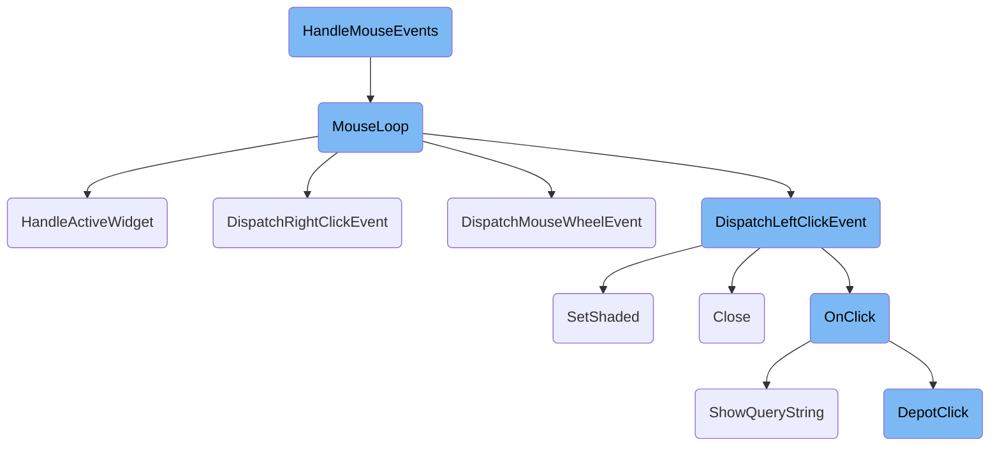
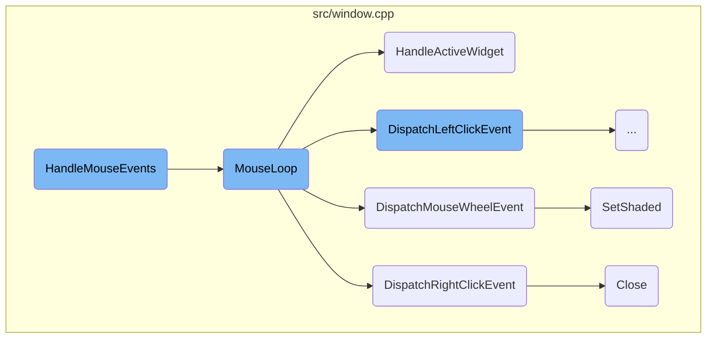
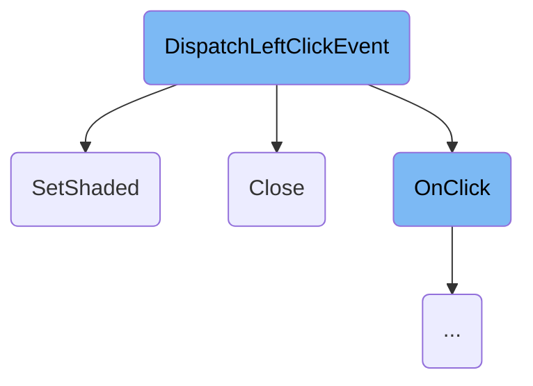
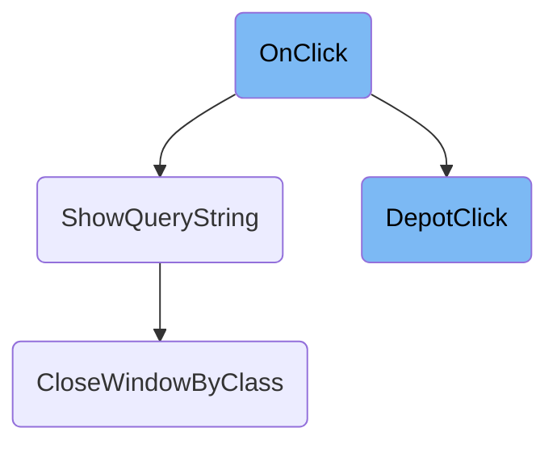
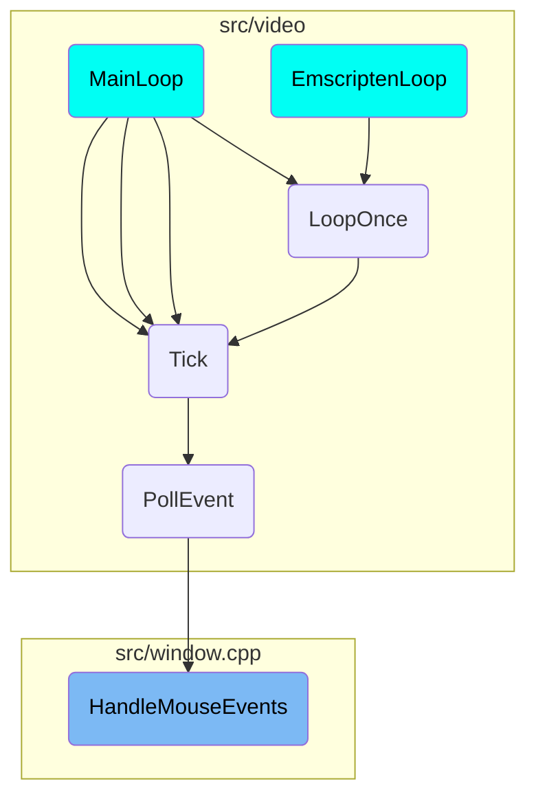

This document explains how mouse events are captured and processed. It covers the entire flow from capturing the mouse event to executing the appropriate action based on the event type.

When a mouse event occurs, it is first captured and identified. The system then determines what type of event it is, such as a click, double-click, or wheel movement. Based on this, the system updates the state and performs the necessary actions. For example, if it's a double-click, it checks the time and position of the previous click to confirm it. The system then processes the event, such as dragging a scrollbar, closing a window, or scrolling with the mouse wheel.

Here is a high level diagram of the flow, showing only the most important functions:



# Flow drill down

First, we'll zoom into this section of the flow:



<SwmSnippet path="/src/window.cpp" line="2871">

---

## <SwmToken path="src/window.cpp" pos="2874:2:2" line-data="void HandleMouseEvents()">`HandleMouseEvents`</SwmToken>

The <SwmToken path="src/window.cpp" pos="2874:2:2" line-data="void HandleMouseEvents()">`HandleMouseEvents`</SwmToken> function is responsible for capturing and processing mouse events such as clicks, double-clicks, and wheel movements. It determines the type of mouse event and updates the state accordingly. For example, it checks for double-clicks by comparing the current time and position with the previous click.

```c++
/**
 * Handle a mouse event from the video driver
 */
void HandleMouseEvents()
{
	/* World generation is multithreaded and messes with companies.
	 * But there is no company related window open anyway, so _current_company is not used. */
	assert(HasModalProgress() || IsLocalCompany());

	/* Handle sprite picker before any GUI interaction */
	if (_newgrf_debug_sprite_picker.mode == SPM_REDRAW && _input_events_this_tick == 0) {
		/* We are done with the last draw-frame, so we know what sprites we
		 * clicked on. Reset the picker mode and invalidate the window. */
		_newgrf_debug_sprite_picker.mode = SPM_NONE;
		InvalidateWindowData(WC_SPRITE_ALIGNER, 0, 1);
	}

	static std::chrono::steady_clock::time_point double_click_time = {};
	static Point double_click_pos = {0, 0};

	/* Mouse event? */
```

---

</SwmSnippet>

<SwmSnippet path="/src/window.cpp" line="2771">

---

## <SwmToken path="src/window.cpp" pos="2771:4:4" line-data="static void MouseLoop(MouseClick click, int mousewheel)">`MouseLoop`</SwmToken>

The <SwmToken path="src/window.cpp" pos="2771:4:4" line-data="static void MouseLoop(MouseClick click, int mousewheel)">`MouseLoop`</SwmToken> function processes the mouse events captured by <SwmToken path="src/window.cpp" pos="2874:2:2" line-data="void HandleMouseEvents()">`HandleMouseEvents`</SwmToken>. It handles various interactions such as dragging, scrolling, and clicking within the game interface. It ensures that the appropriate actions are taken based on the type of mouse event and the current state of the game.

```c++
static void MouseLoop(MouseClick click, int mousewheel)
{
	/* World generation is multithreaded and messes with companies.
	 * But there is no company related window open anyway, so _current_company is not used. */
	assert(HasModalProgress() || IsLocalCompany());

	HandlePlacePresize();
	UpdateTileSelection();

	if (VpHandlePlaceSizingDrag()  == ES_HANDLED) return;
	if (HandleMouseDragDrop()      == ES_HANDLED) return;
	if (HandleWindowDragging()     == ES_HANDLED) return;
	if (HandleActiveWidget()       == ES_HANDLED) return;
	if (HandleViewportScroll()     == ES_HANDLED) return;

	HandleMouseOver();

	bool scrollwheel_scrolling = _settings_client.gui.scrollwheel_scrolling == SWS_SCROLL_MAP && (_cursor.v_wheel != 0 || _cursor.h_wheel != 0);
	if (click == MC_NONE && mousewheel == 0 && !scrollwheel_scrolling) return;

	int x = _cursor.pos.x;
```

---

</SwmSnippet>

<SwmSnippet path="/src/window.cpp" line="2316">

---

### <SwmToken path="src/window.cpp" pos="2320:4:4" line-data="static EventState HandleActiveWidget()">`HandleActiveWidget`</SwmToken>

The <SwmToken path="src/window.cpp" pos="2320:4:4" line-data="static EventState HandleActiveWidget()">`HandleActiveWidget`</SwmToken> function manages interactions with active widgets, such as dragging a scrollbar. It ensures that the widget responds correctly to mouse movements and updates its state accordingly.

```c++
/**
 * Handle active widget (mouse draggin on widget) with the mouse.
 * @return State of handling the event.
 */
static EventState HandleActiveWidget()
{
	for (Window *w : Window::Iterate()) {
		if (w->mouse_capture_widget >= 0) {
			/* Abort if no button is clicked any more. */
			if (!_left_button_down) {
				w->SetWidgetDirty(w->mouse_capture_widget);
				w->mouse_capture_widget = -1;
				return ES_HANDLED;
			}

			/* Handle scrollbar internally, or dispatch click event */
			WidgetType type = w->GetWidget<NWidgetBase>(w->mouse_capture_widget)->type;
			if (type == NWID_VSCROLLBAR || type == NWID_HSCROLLBAR) {
				HandleScrollbarScrolling(w);
			} else {
				/* If cursor hasn't moved, there is nothing to do. */
```

---

</SwmSnippet>

<SwmSnippet path="/src/window.cpp" line="735">

---

### <SwmToken path="src/window.cpp" pos="741:4:4" line-data="static void DispatchRightClickEvent(Window *w, int x, int y)">`DispatchRightClickEvent`</SwmToken>

The <SwmToken path="src/window.cpp" pos="741:4:4" line-data="static void DispatchRightClickEvent(Window *w, int x, int y)">`DispatchRightClickEvent`</SwmToken> function handles <SwmToken path="src/window.cpp" pos="753:3:5" line-data="	/* Right-click close is enabled and there is a closebox. */">`Right-click`</SwmToken> actions within a window. It checks if the <SwmToken path="src/window.cpp" pos="753:3:5" line-data="	/* Right-click close is enabled and there is a closebox. */">`Right-click`</SwmToken> should close the window or show a tooltip, depending on the user's settings and the window's properties.

```c++
/**
 * Dispatch right mouse-button click in window.
 * @param w Window to dispatch event in
 * @param x X coordinate of the click
 * @param y Y coordinate of the click
 */
static void DispatchRightClickEvent(Window *w, int x, int y)
{
	NWidgetCore *wid = w->nested_root->GetWidgetFromPos(x, y);
	if (wid == nullptr) return;

	Point pt = { x, y };

	/* No widget to handle, or the window is not interested in it. */
	if (wid->index >= 0) {
		if (w->OnRightClick(pt, wid->index)) return;
	}

	/* Right-click close is enabled and there is a closebox. */
	if (_settings_client.gui.right_click_wnd_close == RCC_YES && (w->window_desc.flags & WDF_NO_CLOSE) == 0) {
		w->Close();
```

---

</SwmSnippet>

<SwmSnippet path="/src/window.cpp" line="791">

---

### <SwmToken path="src/window.cpp" pos="798:4:4" line-data="static void DispatchMouseWheelEvent(Window *w, NWidgetCore *nwid, int wheel)">`DispatchMouseWheelEvent`</SwmToken>

The <SwmToken path="src/window.cpp" pos="798:4:4" line-data="static void DispatchMouseWheelEvent(Window *w, NWidgetCore *nwid, int wheel)">`DispatchMouseWheelEvent`</SwmToken> function processes mouse wheel actions, such as scrolling. It updates the position of scrollbars or shades/unshades the window based on the wheel movement.

```c++
/**
 * Dispatch the mousewheel-action to the window.
 * The window will scroll any compatible scrollbars if the mouse is pointed over the bar or its contents
 * @param w Window
 * @param nwid the widget where the scrollwheel was used
 * @param wheel scroll up or down
 */
static void DispatchMouseWheelEvent(Window *w, NWidgetCore *nwid, int wheel)
{
	if (nwid == nullptr) return;

	/* Using wheel on caption/shade-box shades or unshades the window. */
	if (nwid->type == WWT_CAPTION || nwid->type == WWT_SHADEBOX) {
		w->SetShaded(wheel < 0);
		return;
	}

	/* Wheeling a vertical scrollbar. */
	if (nwid->type == NWID_VSCROLLBAR) {
		NWidgetScrollbar *sb = static_cast<NWidgetScrollbar *>(nwid);
		if (sb->GetCount() > sb->GetCapacity()) {
```

---

</SwmSnippet>

<SwmSnippet path="/src/window.cpp" line="990">

---

### <SwmToken path="src/window.cpp" pos="995:4:4" line-data="void Window::SetShaded(bool make_shaded)">`SetShaded`</SwmToken>

The <SwmToken path="src/window.cpp" pos="995:4:4" line-data="void Window::SetShaded(bool make_shaded)">`SetShaded`</SwmToken> function changes the shaded state of a window. Shading a window rolls it up to show only the title bar, while unshading restores it to its original size.

```c++
/**
 * Set the shaded state of the window to \a make_shaded.
 * @param make_shaded If \c true, shade the window (roll up until just the title bar is visible), else unshade/unroll the window to its original size.
 * @note The method uses #Window::ReInit(), thus after the call, the whole window should be considered changed.
 */
void Window::SetShaded(bool make_shaded)
{
	if (this->shade_select == nullptr) return;

	int desired = make_shaded ? SZSP_HORIZONTAL : 0;
	if (this->shade_select->shown_plane != desired) {
		if (make_shaded) {
			if (this->nested_focus != nullptr) this->UnfocusFocusedWidget();
			this->unshaded_size.width  = this->width;
			this->unshaded_size.height = this->height;
			this->shade_select->SetDisplayedPlane(desired);
			this->ReInit(0, -this->height);
		} else {
			this->shade_select->SetDisplayedPlane(desired);
			int dx = ((int)this->unshaded_size.width  > this->width)  ? (int)this->unshaded_size.width  - this->width  : 0;
			int dy = ((int)this->unshaded_size.height > this->height) ? (int)this->unshaded_size.height - this->height : 0;
```

---

</SwmSnippet>

<SwmSnippet path="/src/window.cpp" line="1044">

---

### Close

The <SwmToken path="src/window.cpp" pos="1047:4:4" line-data="void Window::Close([[maybe_unused]] int data)">`Close`</SwmToken> function hides a window and marks it for deletion. It ensures that the window and its child windows are properly closed and that any references to the window are cleared.

```c++
/**
 * Hide the window and all its child windows, and mark them for a later deletion.
 */
void Window::Close([[maybe_unused]] int data)
{
	/* Don't close twice. */
	if (*this->z_position == nullptr) return;

	*this->z_position = nullptr;

	if (_thd.window_class == this->window_class &&
			_thd.window_number == this->window_number) {
		ResetObjectToPlace();
	}

	/* Prevent Mouseover() from resetting mouse-over coordinates on a non-existing window */
	if (_mouseover_last_w == this) _mouseover_last_w = nullptr;

	/* We can't scroll the window when it's closed. */
	if (_last_scroll_window == this) _last_scroll_window = nullptr;

```

---

</SwmSnippet>

Now, lets zoom into this section of the flow:



<SwmSnippet path="/src/window.cpp" line="654">

---

## Handling Different Widget Interactions

The <SwmToken path="src/window.cpp" pos="607:4:4" line-data="static void DispatchLeftClickEvent(Window *w, int x, int y, int click_count)">`DispatchLeftClickEvent`</SwmToken> function handles different types of widget interactions based on the widget type. For example, it processes clicks on scrollbars, edit boxes, close boxes, title bars, resize boxes, and more. Each widget type has specific logic to handle user interactions, such as closing the window when the close box is clicked or starting a window drag when the title bar is clicked.

```c++
	switch (widget_type) {
		case NWID_VSCROLLBAR:
		case NWID_HSCROLLBAR:
			ScrollbarClickHandler(w, nw, x, y);
			break;

		case WWT_EDITBOX: {
			QueryString *query = w->GetQueryString(widget_index);
			if (query != nullptr) query->ClickEditBox(w, pt, widget_index, click_count, focused_widget_changed);
			break;
		}

		case WWT_CLOSEBOX: // 'X'
			w->Close();
			return;

		case WWT_CAPTION: // 'Title bar'
			StartWindowDrag(w);
			return;

		case WWT_RESIZEBOX:
```

---

</SwmSnippet>

<SwmSnippet path="/src/window.cpp" line="655">

---

### Scrollbar Interaction

When a scrollbar is clicked, the <SwmToken path="src/window.cpp" pos="657:1:1" line-data="			ScrollbarClickHandler(w, nw, x, y);">`ScrollbarClickHandler`</SwmToken> function is called to handle the scrolling logic.

```c++
		case NWID_VSCROLLBAR:
		case NWID_HSCROLLBAR:
			ScrollbarClickHandler(w, nw, x, y);
			break;
```

---

</SwmSnippet>

<SwmSnippet path="/src/window.cpp" line="660">

---

### Edit Box Interaction

When an edit box is clicked, the function retrieves the <SwmToken path="src/window.cpp" pos="661:1:1" line-data="			QueryString *query = w-&gt;GetQueryString(widget_index);">`QueryString`</SwmToken> associated with the widget and processes the click event, allowing the user to interact with the text input.

```c++
		case WWT_EDITBOX: {
			QueryString *query = w->GetQueryString(widget_index);
			if (query != nullptr) query->ClickEditBox(w, pt, widget_index, click_count, focused_widget_changed);
			break;
```

---

</SwmSnippet>

<SwmSnippet path="/src/window.cpp" line="666">

---

### Close Box Interaction

When the close box (the 'X' button) is clicked, the window is closed immediately.

```c++
		case WWT_CLOSEBOX: // 'X'
			w->Close();
			return;
```

---

</SwmSnippet>

<SwmSnippet path="/src/window.cpp" line="670">

---

### Title Bar Interaction

When the title bar is clicked, the window drag operation is initiated, allowing the user to move the window.

```c++
		case WWT_CAPTION: // 'Title bar'
			StartWindowDrag(w);
			return;
```

---

</SwmSnippet>

<SwmSnippet path="/src/window.cpp" line="674">

---

### Resize Box Interaction

When the resize box is clicked, the window resizing operation is started, allowing the user to resize the window.

```c++
		case WWT_RESIZEBOX:
			/* When the resize widget is on the left size of the window
			 * we assume that that button is used to resize to the left. */
			StartWindowSizing(w, nw->pos_x < (w->width / 2));
			nw->SetDirty(w);
			return;
```

---

</SwmSnippet>

<SwmSnippet path="/src/window.cpp" line="708">

---

### Shade Box Interaction

When the shade box is clicked, the window's shaded state is toggled, allowing the user to minimize or restore the window.

```c++
		case WWT_SHADEBOX:
			nw->SetDirty(w);
			w->SetShaded(!w->IsShaded());
			return;
```

---

</SwmSnippet>

<SwmSnippet path="/src/window.cpp" line="713">

---

### Sticky Box Interaction

When the sticky box is clicked, the window's sticky state is toggled, allowing the user to pin or unpin the window.

```c++
		case WWT_STICKYBOX:
			w->flags ^= WF_STICKY;
			nw->SetDirty(w);
			if (_ctrl_pressed) w->window_desc.pref_sticky = (w->flags & WF_STICKY) != 0;
			return;
```

---

</SwmSnippet>

Now, lets zoom into this section of the flow:



<SwmSnippet path="/src/depot_gui.cpp" line="760">

---

## Handling different widget clicks

The <SwmToken path="src/depot_gui.cpp" pos="760:3:3" line-data="	void OnClick([[maybe_unused]] Point pt, WidgetID widget, [[maybe_unused]] int click_count) override">`OnClick`</SwmToken> function handles various user interactions with the depot interface. Depending on the widget clicked, it performs different actions such as building a vehicle, cloning a vehicle, renaming the depot, starting or stopping all vehicles, selling all vehicles, showing the vehicle list, or initiating auto-replacement of vehicles.

```c++
	void OnClick([[maybe_unused]] Point pt, WidgetID widget, [[maybe_unused]] int click_count) override
	{
		switch (widget) {
			case WID_D_MATRIX: // List
				this->DepotClick(pt.x, pt.y);
				break;

			case WID_D_BUILD: // Build vehicle
				ResetObjectToPlace();
				ShowBuildVehicleWindow(this->window_number, this->type);
				break;

			case WID_D_CLONE: // Clone button
				this->SetWidgetDirty(WID_D_CLONE);
				this->ToggleWidgetLoweredState(WID_D_CLONE);

				if (this->IsWidgetLowered(WID_D_CLONE)) {
					static const CursorID clone_icons[] = {
						SPR_CURSOR_CLONE_TRAIN, SPR_CURSOR_CLONE_ROADVEH,
						SPR_CURSOR_CLONE_SHIP, SPR_CURSOR_CLONE_AIRPLANE
					};
```

---

</SwmSnippet>

<SwmSnippet path="/src/misc_gui.cpp" line="1079">

---

### Showing query string

The <SwmToken path="src/misc_gui.cpp" pos="1079:2:2" line-data="void ShowQueryString(StringID str, StringID caption, uint maxsize, Window *parent, CharSetFilter afilter, QueryStringFlags flags)">`ShowQueryString`</SwmToken> function displays a query popup window with a textbox. This is used, for example, when the user wants to rename the depot. It ensures that any existing query string window is closed before opening a new one.

```c++
void ShowQueryString(StringID str, StringID caption, uint maxsize, Window *parent, CharSetFilter afilter, QueryStringFlags flags)
{
	assert(parent != nullptr);

	CloseWindowByClass(WC_QUERY_STRING);
	new QueryStringWindow(str, caption, ((flags & QSF_LEN_IN_CHARS) ? MAX_CHAR_LENGTH : 1) * maxsize, maxsize, _query_string_desc, parent, afilter, flags);
}
```

---

</SwmSnippet>

<SwmSnippet path="/src/depot_gui.cpp" line="540">

---

### Handling depot clicks

The <SwmToken path="src/depot_gui.cpp" pos="540:3:3" line-data="	void DepotClick(int x, int y)">`DepotClick`</SwmToken> function manages clicks within the depot matrix. It determines the action to take based on the clicked position, such as starting to drag a vehicle, showing vehicle information, or toggling the <SwmToken path="src/depot_gui.cpp" pos="575:10:12" line-data="			case MODE_START_STOP: // click start/stop flag">`start/stop`</SwmToken> state of a vehicle.

```c++
	void DepotClick(int x, int y)
	{
		GetDepotVehiclePtData gdvp = { nullptr, nullptr };
		const Vehicle *v = nullptr;
		DepotGUIAction mode = this->GetVehicleFromDepotWndPt(x, y, &v, &gdvp);

		if (this->type == VEH_TRAIN) v = gdvp.wagon;

		switch (mode) {
			case MODE_ERROR: // invalid
				return;

			case MODE_DRAG_VEHICLE: { // start dragging of vehicle
				if (v != nullptr && VehicleClicked(v)) return;

				VehicleID sel = this->sel;

				if (this->type == VEH_TRAIN && sel != INVALID_VEHICLE) {
					this->sel = INVALID_VEHICLE;
					TrainDepotMoveVehicle(v, sel, gdvp.head);
				} else if (v != nullptr) {
```

---

</SwmSnippet>

<SwmSnippet path="/src/window.cpp" line="1152">

---

### Closing windows by class

The <SwmToken path="src/window.cpp" pos="1152:2:2" line-data="void CloseWindowByClass(WindowClass cls, int data)">`CloseWindowByClass`</SwmToken> function closes all windows of a specified class. This is used to ensure that only one query string window is open at a time by closing any existing ones before opening a new one.

```c++
void CloseWindowByClass(WindowClass cls, int data)
{
	/* Note: the container remains stable, even when deleting windows. */
	for (Window *w : Window::Iterate()) {
		if (w->window_class == cls) {
			w->Close(data);
		}
	}
}
```

---

</SwmSnippet>

# Where is this flow used?

This flow is used multiple times in the codebase as represented in the following diagram:

(Note - these are only some of the entry points of this flow)



&nbsp;

*This is an auto-generated document by Swimm AI 🌊 and has not yet been verified by a human*

<SwmMeta version="3.0.0" repo-id="Z2l0aHViJTNBJTNBT3BlblRURC1jb3BpbG90LWRlbW8lM0ElM0Fzd2ltbWlv" repo-name="OpenTTD-copilot-demo"><sup>Powered by [Swimm](/)</sup></SwmMeta>
