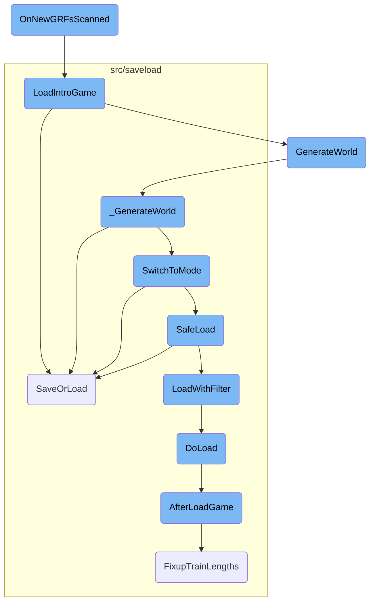
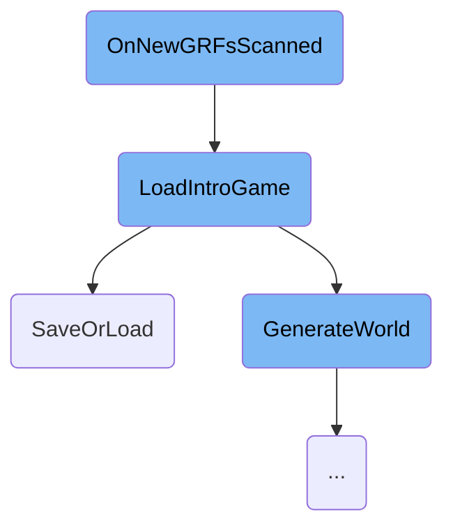
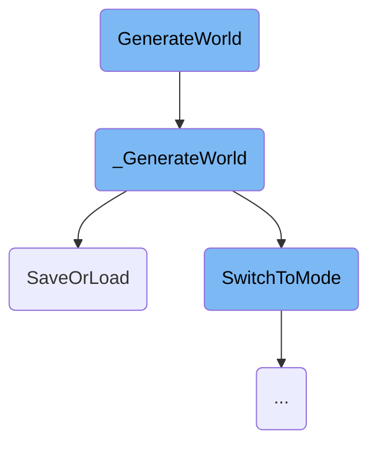
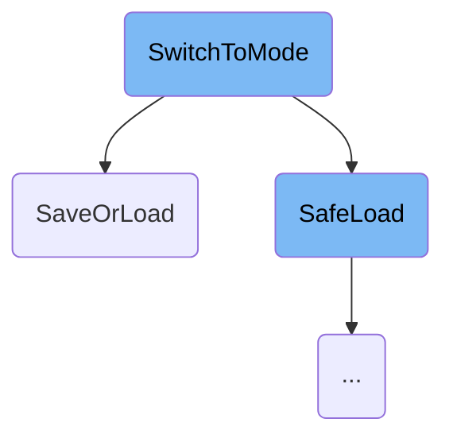
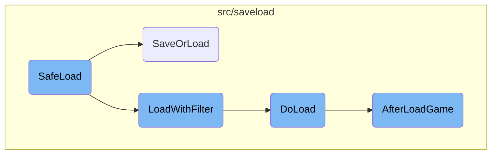

This document explains the flow triggered by the <SwmToken path="src/openttd.cpp" pos="398:3:3" line-data="	void OnNewGRFsScanned() override">`OnNewGRFsScanned`</SwmToken> event. This event is crucial for handling changes in <SwmToken path="src/openttd.cpp" pos="240:14:14" line-data="		fmt::format_to(std::back_inserter(message), &quot;NewGRFs have been removed\n&quot;);">`NewGRFs`</SwmToken> (New Graphics Resource Files) and ensuring the game state is correctly updated to reflect these changes.

When the <SwmToken path="src/openttd.cpp" pos="398:3:3" line-data="	void OnNewGRFsScanned() override">`OnNewGRFsScanned`</SwmToken> event occurs, the system first resets the GRF configuration to account for any changes in the <SwmToken path="src/openttd.cpp" pos="240:14:14" line-data="		fmt::format_to(std::back_inserter(message), &quot;NewGRFs have been removed\n&quot;);">`NewGRFs`</SwmToken>. Following this, the introduction game is loaded, which involves setting the game mode to the menu, resetting the window system, and attempting to load the default opening screen savegame. If this loading fails, an empty world is generated instead. The flow continues with various save or load operations, world generation, and mode switching to ensure the game is correctly initialized and ready for the player.

Here is a high level diagram of the flow, showing only the most important functions:



# Flow drill down

First, we'll zoom into this section of the flow:



<SwmSnippet path="/src/openttd.cpp" line="398">

---

## Resetting GRF Configuration

The function <SwmToken path="src/openttd.cpp" pos="398:3:3" line-data="	void OnNewGRFsScanned() override">`OnNewGRFsScanned`</SwmToken> starts by resetting the GRF configuration. This ensures that any changes in the <SwmToken path="src/openttd.cpp" pos="240:14:14" line-data="		fmt::format_to(std::back_inserter(message), &quot;NewGRFs have been removed\n&quot;);">`NewGRFs`</SwmToken> are accounted for before proceeding with further initialization.

```c++
	void OnNewGRFsScanned() override
	{
		ResetGRFConfig(false);

```

---

</SwmSnippet>

<SwmSnippet path="/src/openttd.cpp" line="315">

---

## Loading the Introduction Game

The function <SwmToken path="src/openttd.cpp" pos="315:4:4" line-data="static void LoadIntroGame(bool load_newgrfs = true)">`LoadIntroGame`</SwmToken> is responsible for loading the introduction game. It sets the game mode to the menu, resets the window system, and attempts to load the default opening screen savegame. If loading fails, it generates an empty world instead.

```c++
static void LoadIntroGame(bool load_newgrfs = true)
{
	_game_mode = GM_MENU;

	if (load_newgrfs) ResetGRFConfig(false);

	/* Setup main window */
	ResetWindowSystem();
	SetupColoursAndInitialWindow();

	/* Load the default opening screen savegame */
	if (SaveOrLoad("opntitle.dat", SLO_LOAD, DFT_GAME_FILE, BASESET_DIR) != SL_OK) {
		GenerateWorld(GWM_EMPTY, 64, 64); // if failed loading, make empty world.
		SetLocalCompany(COMPANY_SPECTATOR);
	} else {
		SetLocalCompany(COMPANY_FIRST);
	}

	FixTitleGameZoom();
	_pause_mode = PM_UNPAUSED;
	_cursor.fix_at = false;
```

---

</SwmSnippet>

<SwmSnippet path="/src/saveload/saveload.cpp" line="3062">

---

### Handling Save or Load Operations

The function <SwmToken path="src/saveload/saveload.cpp" pos="3071:2:2" line-data="SaveOrLoadResult SaveOrLoad(const std::string &amp;filename, SaveLoadOperation fop, DetailedFileType dft, Subdirectory sb, bool threaded)">`SaveOrLoad`</SwmToken> handles the <SwmToken path="src/saveload/saveload.cpp" pos="3063:17:19" line-data=" * Main Save or Load function where the high-level saveload functions are">`high-level`</SwmToken> save and load operations. It opens the savegame, selects the format, and checks versions. If loading an old savegame, it resets the <SwmToken path="src/saveload/saveload.cpp" pos="323:18:20" line-data="	/* Distinguish between loading into _load_check_data vs. normal save/load. */">`save/load`</SwmToken> data and initializes the game with a specific map size.

```c++
/**
 * Main Save or Load function where the high-level saveload functions are
 * handled. It opens the savegame, selects format and checks versions
 * @param filename The name of the savegame being created/loaded
 * @param fop Save or load mode. Load can also be a TTD(Patch) game.
 * @param sb The sub directory to save the savegame in
 * @param threaded True when threaded saving is allowed
 * @return Return the result of the action. #SL_OK, #SL_ERROR, or #SL_REINIT ("unload" the game)
 */
SaveOrLoadResult SaveOrLoad(const std::string &filename, SaveLoadOperation fop, DetailedFileType dft, Subdirectory sb, bool threaded)
{
	/* An instance of saving is already active, so don't go saving again */
	if (_sl.saveinprogress && fop == SLO_SAVE && dft == DFT_GAME_FILE && threaded) {
		/* if not an autosave, but a user action, show error message */
		if (!_do_autosave) ShowErrorMessage(STR_ERROR_SAVE_STILL_IN_PROGRESS, INVALID_STRING_ID, WL_ERROR);
		return SL_OK;
	}
	WaitTillSaved();

	try {
		/* Load a TTDLX or TTDPatch game */
```

---

</SwmSnippet>

Now, lets zoom into this section of the flow:



<SwmSnippet path="/src/genworld.cpp" line="275">

---

## <SwmToken path="src/genworld.cpp" pos="282:2:2" line-data="void GenerateWorld(GenWorldMode mode, uint size_x, uint size_y, bool reset_settings)">`GenerateWorld`</SwmToken>

The <SwmToken path="src/genworld.cpp" pos="282:2:2" line-data="void GenerateWorld(GenWorldMode mode, uint size_x, uint size_y, bool reset_settings)">`GenerateWorld`</SwmToken> function is responsible for setting up the initial parameters for world generation, such as the mode, map size, and whether to reset settings. It initializes the game, prepares the progress display, and sets the map height limit based on the generation mode. It also loads necessary graphics and initializes various game elements before calling <SwmToken path="src/genworld.cpp" pos="87:4:4" line-data="static void _GenerateWorld()">`_GenerateWorld`</SwmToken> to perform the actual world generation.

```c++
/**
 * Generate a world.
 * @param mode The mode of world generation (see GenWorldMode).
 * @param size_x The X-size of the map.
 * @param size_y The Y-size of the map.
 * @param reset_settings Whether to reset the game configuration (used for restart)
 */
void GenerateWorld(GenWorldMode mode, uint size_x, uint size_y, bool reset_settings)
{
	if (HasModalProgress()) return;
	_gw.mode   = mode;
	_gw.size_x = size_x;
	_gw.size_y = size_y;
	SetModalProgress(true);
	_gw.abort  = false;
	_gw.abortp = nullptr;
	_gw.lc     = _local_company;

	/* This disables some commands and stuff */
	SetLocalCompany(COMPANY_SPECTATOR);

```

---

</SwmSnippet>

<SwmSnippet path="/src/genworld.cpp" line="84">

---

## <SwmToken path="src/genworld.cpp" pos="87:4:4" line-data="static void _GenerateWorld()">`_GenerateWorld`</SwmToken>

The <SwmToken path="src/genworld.cpp" pos="87:4:4" line-data="static void _GenerateWorld()">`_GenerateWorld`</SwmToken> function handles the core logic of generating the game world. It sets the random seed, initializes the economy, and generates the landscape based on the specified mode. If the landscape generation is successful, it proceeds to generate towns, industries, objects, and trees. It also starts up companies, engines, and disasters, and runs the game loop to finalize the world generation. If any errors occur, it handles the abortion of the generation process and cleans up accordingly.

```c++
/**
 * The internal, real, generate function.
 */
static void _GenerateWorld()
{
	/* Make sure everything is done via OWNER_NONE. */
	Backup<CompanyID> _cur_company(_current_company, OWNER_NONE);

	try {
		_generating_world = true;
		if (_network_dedicated) Debug(net, 3, "Generating map, please wait...");
		/* Set the Random() seed to generation_seed so we produce the same map with the same seed */
		_random.SetSeed(_settings_game.game_creation.generation_seed);
		SetGeneratingWorldProgress(GWP_MAP_INIT, 2);
		SetObjectToPlace(SPR_CURSOR_ZZZ, PAL_NONE, HT_NONE, WC_MAIN_WINDOW, 0);
		ScriptObject::InitializeRandomizers();

		BasePersistentStorageArray::SwitchMode(PSM_ENTER_GAMELOOP);

		IncreaseGeneratingWorldProgress(GWP_MAP_INIT);
		/* Must start economy early because of the costs. */
```

---

</SwmSnippet>

Now, lets zoom into this section of the flow:



<SwmSnippet path="/src/openttd.cpp" line="1066">

---

## Handling Different Game Modes

The <SwmToken path="src/openttd.cpp" pos="1078:1:1" line-data="				SwitchToMode(_switch_mode);">`SwitchToMode`</SwmToken> function handles the transition between different game modes such as scenario editor, loading a game, starting a new game, and joining a multiplayer game. Each case within the switch statement ensures that the game state is correctly set up for the new mode, including generating new game worlds, resetting configurations, and updating social integration.

```c++
	switch (new_mode) {
		case SM_EDITOR: // Switch to scenario editor
			MakeNewEditorWorld();
			GenerateSavegameId();

			UpdateSocialIntegration(GM_EDITOR);
			break;

		case SM_RELOADGAME: // Reload with what-ever started the game
			if (_file_to_saveload.abstract_ftype == FT_SAVEGAME || _file_to_saveload.abstract_ftype == FT_SCENARIO) {
				/* Reload current savegame/scenario */
				_switch_mode = _game_mode == GM_EDITOR ? SM_LOAD_SCENARIO : SM_LOAD_GAME;
				SwitchToMode(_switch_mode);
				break;
			} else if (_file_to_saveload.abstract_ftype == FT_HEIGHTMAP) {
				/* Restart current heightmap */
				_switch_mode = _game_mode == GM_EDITOR ? SM_LOAD_HEIGHTMAP : SM_RESTART_HEIGHTMAP;
				SwitchToMode(_switch_mode);
				break;
			}

```

---

</SwmSnippet>

<SwmSnippet path="/src/openttd.cpp" line="1023">

---

### Network State Management

The function checks if the new mode is not saving a game. If the network is active, it either reboots or disconnects the network based on the new mode. If the current instance is a network server, it restarts the server unless switching to the menu. This ensures that the network state is correctly managed during mode transitions.

```c++
	if (new_mode != SM_SAVE_GAME) {
		/* If the network is active, make it not-active */
		if (_networking) {
			if (_network_server && (new_mode == SM_LOAD_GAME || new_mode == SM_NEWGAME || new_mode == SM_RESTARTGAME)) {
				NetworkReboot();
			} else {
				NetworkDisconnect();
			}
		}

		/* If we are a server, we restart the server */
		if (_is_network_server) {
			/* But not if we are going to the menu */
			if (new_mode != SM_MENU) {
				/* check if we should reload the config */
				if (_settings_client.network.reload_cfg) {
					LoadFromConfig();
					MakeNewgameSettingsLive();
					ResetGRFConfig(false);
				}
				NetworkServerStart();
```

---

</SwmSnippet>

<SwmSnippet path="/src/openttd.cpp" line="1051">

---

### Autosave and AI Controllers

The function ensures that all AI controllers are terminated when quitting the game and resets the autosave frequency when changing modes, except when saving a game. This helps maintain game stability and ensures that autosave settings are correctly applied.

```c++
	/* Make sure all AI controllers are gone at quitting game */
	if (new_mode != SM_SAVE_GAME) AI::KillAll();

	/* When we change mode, reset the autosave. */
	if (new_mode != SM_SAVE_GAME) ChangeAutosaveFrequency(true);
```

---

</SwmSnippet>

<SwmSnippet path="/src/openttd.cpp" line="1057">

---

### Survey Transmission

If the current game mode is normal and the new mode is not saving a game, the function transmits a survey indicating that the player is leaving the current game. This helps in collecting user data for analysis.

```c++
	/* Transmit the survey if we were in normal-mode and not saving. It always means we leaving the current game. */
	if (_game_mode == GM_NORMAL && new_mode != SM_SAVE_GAME) _survey.Transmit(NetworkSurveyHandler::Reason::LEAVE);
```

---

</SwmSnippet>

<SwmSnippet path="/src/openttd.cpp" line="1060">

---

### Game Session Statistics

The function records the start time of the new game session and resets the savegame size when switching modes, except when saving a game. This helps in tracking the duration of game sessions for user statistics.

```c++
	/* Keep track when we last switch mode. Used for survey, to know how long someone was in a game. */
	if (new_mode != SM_SAVE_GAME) {
		_game_session_stats.start_time = std::chrono::steady_clock::now();
		_game_session_stats.savegame_size = std::nullopt;
	}
```

---

</SwmSnippet>

Now, lets zoom into this section of the flow:



<SwmSnippet path="/src/openttd.cpp" line="933">

---

## <SwmToken path="src/openttd.cpp" pos="943:2:2" line-data="bool SafeLoad(const std::string &amp;filename, SaveLoadOperation fop, DetailedFileType dft, GameMode newgm, Subdirectory subdir, std::shared_ptr&lt;LoadFilter&gt; lf = nullptr)">`SafeLoad`</SwmToken>

The <SwmToken path="src/openttd.cpp" pos="943:2:2" line-data="bool SafeLoad(const std::string &amp;filename, SaveLoadOperation fop, DetailedFileType dft, GameMode newgm, Subdirectory subdir, std::shared_ptr&lt;LoadFilter&gt; lf = nullptr)">`SafeLoad`</SwmToken> function attempts to load a specified savegame file. If the loading process encounters errors such as a corrupt savegame or an incompatible version, it ensures the game reverts to a previous stable state. For instance, if the game is in the menu, it reloads the intro game. This function is crucial for maintaining game stability and providing a seamless user experience even when errors occur.

```c++
/**
 * Load the specified savegame but on error do different things.
 * If loading fails due to corrupt savegame, bad version, etc. go back to
 * a previous correct state. In the menu for example load the intro game again.
 * @param filename file to be loaded
 * @param fop mode of loading, always SLO_LOAD
 * @param newgm switch to this mode of loading fails due to some unknown error
 * @param subdir default directory to look for filename, set to 0 if not needed
 * @param lf Load filter to use, if nullptr: use filename + subdir.
 */
bool SafeLoad(const std::string &filename, SaveLoadOperation fop, DetailedFileType dft, GameMode newgm, Subdirectory subdir, std::shared_ptr<LoadFilter> lf = nullptr)
{
	assert(fop == SLO_LOAD);
	assert(dft == DFT_GAME_FILE || (lf == nullptr && dft == DFT_OLD_GAME_FILE));
	GameMode ogm = _game_mode;

	_game_mode = newgm;

	SaveOrLoadResult result = (lf == nullptr) ? SaveOrLoad(filename, fop, dft, subdir) : LoadWithFilter(lf);
	if (result == SL_OK) return true;

```

---

</SwmSnippet>

<SwmSnippet path="/src/saveload/saveload.cpp" line="3046">

---

## <SwmToken path="src/saveload/saveload.cpp" pos="3051:2:2" line-data="SaveOrLoadResult LoadWithFilter(std::shared_ptr&lt;LoadFilter&gt; reader)">`LoadWithFilter`</SwmToken>

The <SwmToken path="src/saveload/saveload.cpp" pos="3051:2:2" line-data="SaveOrLoadResult LoadWithFilter(std::shared_ptr&lt;LoadFilter&gt; reader)">`LoadWithFilter`</SwmToken> function loads the game using a specified filter. It sets the action to load and calls <SwmToken path="src/saveload/saveload.cpp" pos="3055:3:3" line-data="		return DoLoad(reader, false);">`DoLoad`</SwmToken> to perform the actual loading. If an exception occurs during loading, it clears the <SwmToken path="src/saveload/saveload.cpp" pos="323:18:20" line-data="	/* Distinguish between loading into _load_check_data vs. normal save/load. */">`save/load`</SwmToken> state and returns a reinitialization signal. This function is essential for applying specific loading conditions and handling exceptions gracefully.

```c++
/**
 * Load the game using a (reader) filter.
 * @param reader   The filter to read the savegame from.
 * @return Return the result of the action. #SL_OK or #SL_REINIT ("unload" the game)
 */
SaveOrLoadResult LoadWithFilter(std::shared_ptr<LoadFilter> reader)
{
	try {
		_sl.action = SLA_LOAD;
		return DoLoad(reader, false);
	} catch (...) {
		ClearSaveLoadState();
		return SL_REINIT;
	}
}
```

---

</SwmSnippet>

<SwmSnippet path="/src/saveload/saveload.cpp" line="2945">

---

### <SwmToken path="src/saveload/saveload.cpp" pos="2951:4:4" line-data="static SaveOrLoadResult DoLoad(std::shared_ptr&lt;LoadFilter&gt; reader, bool load_check)">`DoLoad`</SwmToken>

The <SwmToken path="src/saveload/saveload.cpp" pos="2951:4:4" line-data="static SaveOrLoadResult DoLoad(std::shared_ptr&lt;LoadFilter&gt; reader, bool load_check)">`DoLoad`</SwmToken> function performs the actual loading of a savegame. It reads the savegame header, determines the appropriate format, and initializes the game state accordingly. If the savegame version is old, it applies necessary conversions and updates. This function ensures that the game state is accurately restored from the savegame file, handling both new and old savegame formats.

```c++
/**
 * Actually perform the loading of a "non-old" savegame.
 * @param reader     The filter to read the savegame from.
 * @param load_check Whether to perform the checking ("preview") or actually load the game.
 * @return Return the result of the action. #SL_OK or #SL_REINIT ("unload" the game)
 */
static SaveOrLoadResult DoLoad(std::shared_ptr<LoadFilter> reader, bool load_check)
{
	_sl.lf = reader;

	if (load_check) {
		/* Clear previous check data */
		_load_check_data.Clear();
		/* Mark SL_LOAD_CHECK as supported for this savegame. */
		_load_check_data.checkable = true;
	}

	uint32_t hdr[2];
	if (_sl.lf->Read((uint8_t*)hdr, sizeof(hdr)) != sizeof(hdr)) SlError(STR_GAME_SAVELOAD_ERROR_FILE_NOT_READABLE);

	/* see if we have any loader for this type. */
```

---

</SwmSnippet>

<SwmSnippet path="/src/saveload/afterload.cpp" line="559">

---

### <SwmToken path="src/saveload/afterload.cpp" pos="564:2:2" line-data="bool AfterLoadGame()">`AfterLoadGame`</SwmToken>

The <SwmToken path="src/saveload/afterload.cpp" pos="564:2:2" line-data="bool AfterLoadGame()">`AfterLoadGame`</SwmToken> function performs various conversions and updates required to load older savegames and fill caches. It handles tasks such as setting signal handlers, rebuilding data structures, and updating game settings based on the savegame version. This function ensures that the game state is fully compatible with the current game version and that all necessary data structures are correctly initialized.

```c++
/**
 * Perform a (large) amount of savegame conversion *magic* in order to
 * load older savegames and to fill the caches for various purposes.
 * @return True iff conversion went without a problem.
 */
bool AfterLoadGame()
{
	SetSignalHandlers();

	extern TileIndex _cur_tileloop_tile; // From landscape.cpp.
	/* The LFSR used in RunTileLoop iteration cannot have a zeroed state, make it non-zeroed. */
	if (_cur_tileloop_tile == 0) _cur_tileloop_tile = 1;

	if (IsSavegameVersionBefore(SLV_98)) _gamelog.Oldver();

	_gamelog.TestRevision();
	_gamelog.TestMode();

	RebuildTownKdtree();
	RebuildStationKdtree();
	/* This needs to be done even before conversion, because some conversions will destroy objects
```

---

</SwmSnippet>

&nbsp;

*This is an auto-generated document by Swimm AI 🌊 and has not yet been verified by a human*

<SwmMeta version="3.0.0" repo-id="Z2l0aHViJTNBJTNBT3BlblRURC1jb3BpbG90LWRlbW8lM0ElM0Fzd2ltbWlv" repo-name="OpenTTD-copilot-demo"><sup>Powered by [Swimm](/)</sup></SwmMeta>
