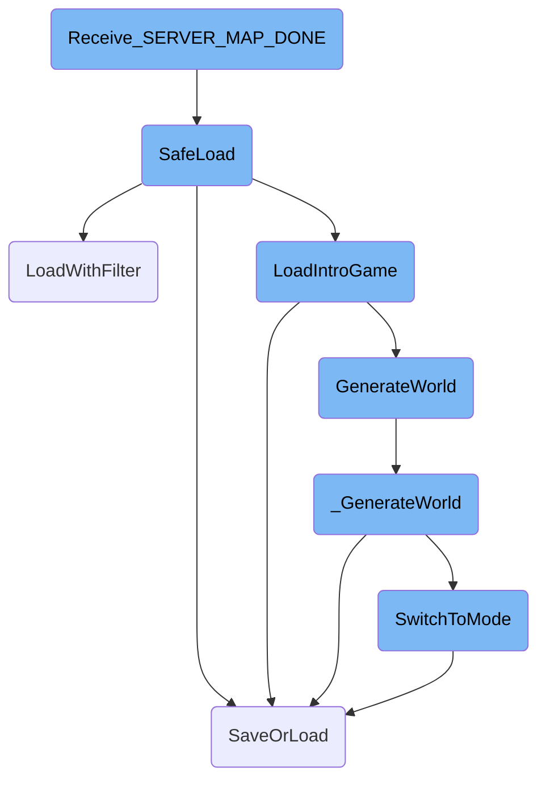
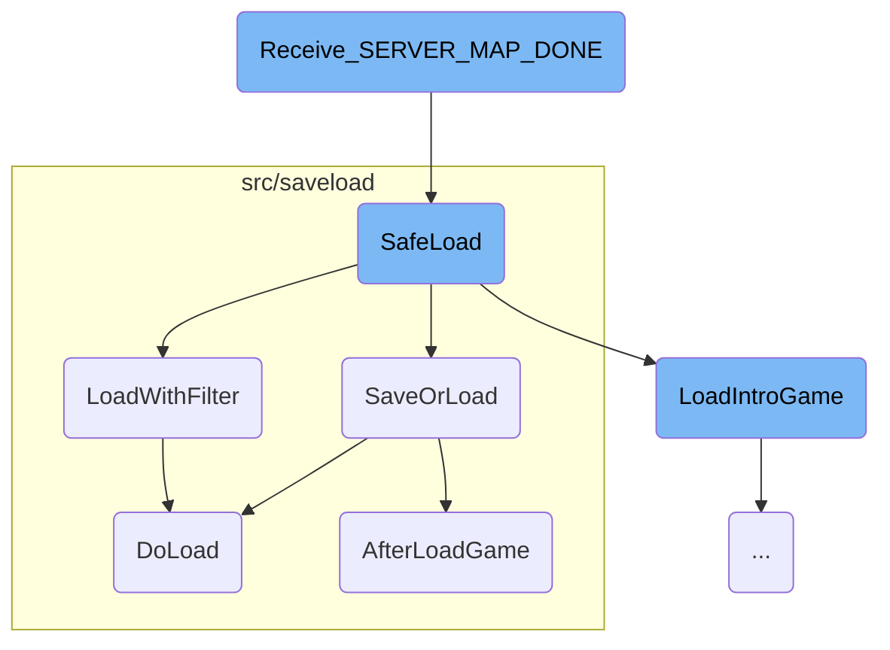
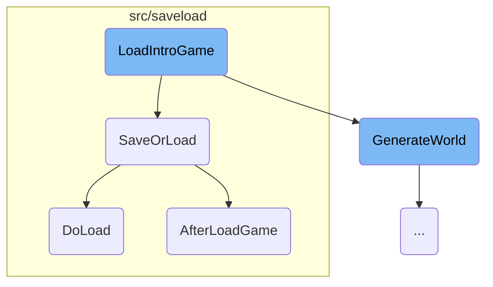
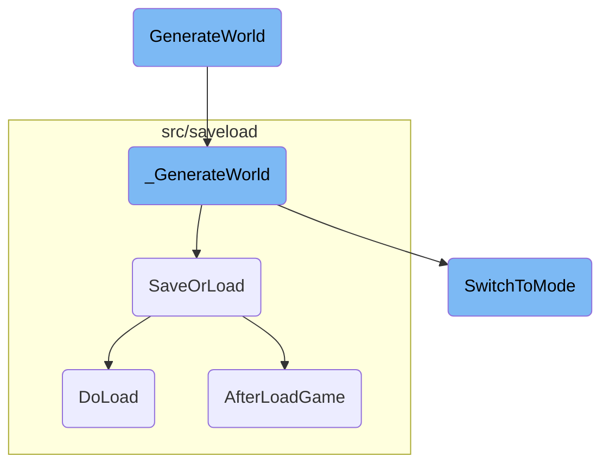

This document explains the process that occurs when the server map download is completed in the game. It covers the steps from verifying the status and savegame to loading the map and updating the game state.

When the server map download is completed, the game first checks if the status and savegame are correct. If everything is fine, it resets the savegame and starts loading the map using a safe method to ensure no errors occur. If the map loads successfully, the game state is updated, and the client is prepared for gameplay. This process ensures that the game can handle errors gracefully and always provides a playable state for the user.

Here is a high level diagram of the flow, showing only the most important functions:



# Flow drill down

First, we'll zoom into this section of the flow:



<SwmSnippet path="/src/network/network_client.cpp" line="842">

---

## <SwmToken path="src/network/network_client.cpp" pos="842:4:4" line-data="NetworkRecvStatus ClientNetworkGameSocketHandler::Receive_SERVER_MAP_DONE(Packet &amp;)">`Receive_SERVER_MAP_DONE`</SwmToken>

The function <SwmToken path="src/network/network_client.cpp" pos="842:4:4" line-data="NetworkRecvStatus ClientNetworkGameSocketHandler::Receive_SERVER_MAP_DONE(Packet &amp;)">`Receive_SERVER_MAP_DONE`</SwmToken> is responsible for handling the event when the server map download is completed. It verifies the status and savegame, resets the savegame, and initiates the loading process using <SwmToken path="src/network/network_client.cpp" pos="861:7:7" line-data="	bool load_success = SafeLoad({}, SLO_LOAD, DFT_GAME_FILE, GM_NORMAL, NO_DIRECTORY, this-&gt;savegame);">`SafeLoad`</SwmToken>. If the load is successful, it updates the game state and prepares the client for gameplay.

```c++
NetworkRecvStatus ClientNetworkGameSocketHandler::Receive_SERVER_MAP_DONE(Packet &)
{
	if (this->status != STATUS_MAP) return NETWORK_RECV_STATUS_MALFORMED_PACKET;
	if (this->savegame == nullptr) return NETWORK_RECV_STATUS_MALFORMED_PACKET;

	Debug(net, 9, "Client::Receive_SERVER_MAP_DONE()");

	Debug(net, 9, "Client::join_status = PROCESSING");
	_network_join_status = NETWORK_JOIN_STATUS_PROCESSING;
	SetWindowDirty(WC_NETWORK_STATUS_WINDOW, WN_NETWORK_STATUS_WINDOW_JOIN);

	this->savegame->Reset();

	/* The map is done downloading, load it */
	ClearErrorMessages();

	/* Set the abstract filetype. This is read during savegame load. */
	_file_to_saveload.SetMode(SLO_LOAD, FT_SAVEGAME, DFT_GAME_FILE);

	bool load_success = SafeLoad({}, SLO_LOAD, DFT_GAME_FILE, GM_NORMAL, NO_DIRECTORY, this->savegame);
	this->savegame = nullptr;
```

---

</SwmSnippet>

<SwmSnippet path="/src/openttd.cpp" line="933">

---

## <SwmToken path="src/openttd.cpp" pos="943:2:2" line-data="bool SafeLoad(const std::string &amp;filename, SaveLoadOperation fop, DetailedFileType dft, GameMode newgm, Subdirectory subdir, std::shared_ptr&lt;LoadFilter&gt; lf = nullptr)">`SafeLoad`</SwmToken>

The function <SwmToken path="src/openttd.cpp" pos="943:2:2" line-data="bool SafeLoad(const std::string &amp;filename, SaveLoadOperation fop, DetailedFileType dft, GameMode newgm, Subdirectory subdir, std::shared_ptr&lt;LoadFilter&gt; lf = nullptr)">`SafeLoad`</SwmToken> attempts to load the specified savegame. If the loading fails due to issues like a corrupt savegame or bad version, it reverts to a previous correct state, such as loading the intro game. This ensures that the game can recover gracefully from loading errors.

```c++
/**
 * Load the specified savegame but on error do different things.
 * If loading fails due to corrupt savegame, bad version, etc. go back to
 * a previous correct state. In the menu for example load the intro game again.
 * @param filename file to be loaded
 * @param fop mode of loading, always SLO_LOAD
 * @param newgm switch to this mode of loading fails due to some unknown error
 * @param subdir default directory to look for filename, set to 0 if not needed
 * @param lf Load filter to use, if nullptr: use filename + subdir.
 */
bool SafeLoad(const std::string &filename, SaveLoadOperation fop, DetailedFileType dft, GameMode newgm, Subdirectory subdir, std::shared_ptr<LoadFilter> lf = nullptr)
{
	assert(fop == SLO_LOAD);
	assert(dft == DFT_GAME_FILE || (lf == nullptr && dft == DFT_OLD_GAME_FILE));
	GameMode ogm = _game_mode;

	_game_mode = newgm;

	SaveOrLoadResult result = (lf == nullptr) ? SaveOrLoad(filename, fop, dft, subdir) : LoadWithFilter(lf);
	if (result == SL_OK) return true;

```

---

</SwmSnippet>

<SwmSnippet path="/src/saveload/saveload.cpp" line="3062">

---

### <SwmToken path="src/saveload/saveload.cpp" pos="3071:2:2" line-data="SaveOrLoadResult SaveOrLoad(const std::string &amp;filename, SaveLoadOperation fop, DetailedFileType dft, Subdirectory sb, bool threaded)">`SaveOrLoad`</SwmToken>

The function <SwmToken path="src/saveload/saveload.cpp" pos="3071:2:2" line-data="SaveOrLoadResult SaveOrLoad(const std::string &amp;filename, SaveLoadOperation fop, DetailedFileType dft, Subdirectory sb, bool threaded)">`SaveOrLoad`</SwmToken> is the main function for handling save and load operations. It opens the savegame, selects the format, and checks versions. Depending on the operation mode, it either saves the game or loads it using <SwmToken path="src/saveload/saveload.cpp" pos="2951:4:4" line-data="static SaveOrLoadResult DoLoad(std::shared_ptr&lt;LoadFilter&gt; reader, bool load_check)">`DoLoad`</SwmToken>.

```c++
/**
 * Main Save or Load function where the high-level saveload functions are
 * handled. It opens the savegame, selects format and checks versions
 * @param filename The name of the savegame being created/loaded
 * @param fop Save or load mode. Load can also be a TTD(Patch) game.
 * @param sb The sub directory to save the savegame in
 * @param threaded True when threaded saving is allowed
 * @return Return the result of the action. #SL_OK, #SL_ERROR, or #SL_REINIT ("unload" the game)
 */
SaveOrLoadResult SaveOrLoad(const std::string &filename, SaveLoadOperation fop, DetailedFileType dft, Subdirectory sb, bool threaded)
{
	/* An instance of saving is already active, so don't go saving again */
	if (_sl.saveinprogress && fop == SLO_SAVE && dft == DFT_GAME_FILE && threaded) {
		/* if not an autosave, but a user action, show error message */
		if (!_do_autosave) ShowErrorMessage(STR_ERROR_SAVE_STILL_IN_PROGRESS, INVALID_STRING_ID, WL_ERROR);
		return SL_OK;
	}
	WaitTillSaved();

	try {
		/* Load a TTDLX or TTDPatch game */
```

---

</SwmSnippet>

<SwmSnippet path="/src/saveload/saveload.cpp" line="3046">

---

### <SwmToken path="src/saveload/saveload.cpp" pos="3051:2:2" line-data="SaveOrLoadResult LoadWithFilter(std::shared_ptr&lt;LoadFilter&gt; reader)">`LoadWithFilter`</SwmToken>

The function <SwmToken path="src/saveload/saveload.cpp" pos="3051:2:2" line-data="SaveOrLoadResult LoadWithFilter(std::shared_ptr&lt;LoadFilter&gt; reader)">`LoadWithFilter`</SwmToken> loads the game using a specified filter. It calls <SwmToken path="src/saveload/saveload.cpp" pos="3055:3:3" line-data="		return DoLoad(reader, false);">`DoLoad`</SwmToken> to perform the actual loading and handles any exceptions by reinitializing the <SwmToken path="src/saveload/saveload.cpp" pos="323:18:20" line-data="	/* Distinguish between loading into _load_check_data vs. normal save/load. */">`save/load`</SwmToken> state.

```c++
/**
 * Load the game using a (reader) filter.
 * @param reader   The filter to read the savegame from.
 * @return Return the result of the action. #SL_OK or #SL_REINIT ("unload" the game)
 */
SaveOrLoadResult LoadWithFilter(std::shared_ptr<LoadFilter> reader)
{
	try {
		_sl.action = SLA_LOAD;
		return DoLoad(reader, false);
	} catch (...) {
		ClearSaveLoadState();
		return SL_REINIT;
	}
}
```

---

</SwmSnippet>

<SwmSnippet path="/src/saveload/saveload.cpp" line="2945">

---

### <SwmToken path="src/saveload/saveload.cpp" pos="2951:4:4" line-data="static SaveOrLoadResult DoLoad(std::shared_ptr&lt;LoadFilter&gt; reader, bool load_check)">`DoLoad`</SwmToken>

The function <SwmToken path="src/saveload/saveload.cpp" pos="2951:4:4" line-data="static SaveOrLoadResult DoLoad(std::shared_ptr&lt;LoadFilter&gt; reader, bool load_check)">`DoLoad`</SwmToken> performs the actual loading of a savegame. It reads the savegame header, determines the format, and initializes the loading process. If the loading is successful, it calls <SwmToken path="src/saveload/afterload.cpp" pos="564:2:2" line-data="bool AfterLoadGame()">`AfterLoadGame`</SwmToken> to finalize the loading process and update the game state.

```c++
/**
 * Actually perform the loading of a "non-old" savegame.
 * @param reader     The filter to read the savegame from.
 * @param load_check Whether to perform the checking ("preview") or actually load the game.
 * @return Return the result of the action. #SL_OK or #SL_REINIT ("unload" the game)
 */
static SaveOrLoadResult DoLoad(std::shared_ptr<LoadFilter> reader, bool load_check)
{
	_sl.lf = reader;

	if (load_check) {
		/* Clear previous check data */
		_load_check_data.Clear();
		/* Mark SL_LOAD_CHECK as supported for this savegame. */
		_load_check_data.checkable = true;
	}

	uint32_t hdr[2];
	if (_sl.lf->Read((uint8_t*)hdr, sizeof(hdr)) != sizeof(hdr)) SlError(STR_GAME_SAVELOAD_ERROR_FILE_NOT_READABLE);

	/* see if we have any loader for this type. */
```

---

</SwmSnippet>

<SwmSnippet path="/src/saveload/afterload.cpp" line="559">

---

### <SwmToken path="src/saveload/afterload.cpp" pos="564:2:2" line-data="bool AfterLoadGame()">`AfterLoadGame`</SwmToken>

The function <SwmToken path="src/saveload/afterload.cpp" pos="564:2:2" line-data="bool AfterLoadGame()">`AfterLoadGame`</SwmToken> performs various conversions and updates required to load older savegames and fill caches. It ensures compatibility with different savegame versions and updates the game state accordingly.

```c++
/**
 * Perform a (large) amount of savegame conversion *magic* in order to
 * load older savegames and to fill the caches for various purposes.
 * @return True iff conversion went without a problem.
 */
bool AfterLoadGame()
{
	SetSignalHandlers();

	extern TileIndex _cur_tileloop_tile; // From landscape.cpp.
	/* The LFSR used in RunTileLoop iteration cannot have a zeroed state, make it non-zeroed. */
	if (_cur_tileloop_tile == 0) _cur_tileloop_tile = 1;

	if (IsSavegameVersionBefore(SLV_98)) _gamelog.Oldver();

	_gamelog.TestRevision();
	_gamelog.TestMode();

	RebuildTownKdtree();
	RebuildStationKdtree();
	/* This needs to be done even before conversion, because some conversions will destroy objects
```

---

</SwmSnippet>

Now, lets zoom into this section of the flow:



<SwmSnippet path="/src/openttd.cpp" line="315">

---

## Loading the Introduction Game

The <SwmToken path="src/openttd.cpp" pos="315:4:4" line-data="static void LoadIntroGame(bool load_newgrfs = true)">`LoadIntroGame`</SwmToken> function is responsible for setting up the initial state of the game when it is first launched. It initializes the game mode to the main menu, resets the window system, and sets up the initial colors and window. It then attempts to load the default opening screen savegame. If this fails, it generates an empty world and sets the local company to a spectator mode. Finally, it ensures the game is unpaused, fixes the cursor, checks for missing glyphs, and starts the music loop.

```c++
static void LoadIntroGame(bool load_newgrfs = true)
{
	_game_mode = GM_MENU;

	if (load_newgrfs) ResetGRFConfig(false);

	/* Setup main window */
	ResetWindowSystem();
	SetupColoursAndInitialWindow();

	/* Load the default opening screen savegame */
	if (SaveOrLoad("opntitle.dat", SLO_LOAD, DFT_GAME_FILE, BASESET_DIR) != SL_OK) {
		GenerateWorld(GWM_EMPTY, 64, 64); // if failed loading, make empty world.
		SetLocalCompany(COMPANY_SPECTATOR);
	} else {
		SetLocalCompany(COMPANY_FIRST);
	}

	FixTitleGameZoom();
	_pause_mode = PM_UNPAUSED;
	_cursor.fix_at = false;
```

---

</SwmSnippet>

<SwmSnippet path="/src/openttd.cpp" line="326">

---

### Handling Savegame Load Failure

When attempting to load the default opening screen savegame with <SwmToken path="src/openttd.cpp" pos="326:4:4" line-data="	if (SaveOrLoad(&quot;opntitle.dat&quot;, SLO_LOAD, DFT_GAME_FILE, BASESET_DIR) != SL_OK) {">`SaveOrLoad`</SwmToken>, if the load fails (<SwmToken path="src/openttd.cpp" pos="326:22:24" line-data="	if (SaveOrLoad(&quot;opntitle.dat&quot;, SLO_LOAD, DFT_GAME_FILE, BASESET_DIR) != SL_OK) {">`!= SL_OK`</SwmToken>), the function <SwmToken path="src/openttd.cpp" pos="327:1:1" line-data="		GenerateWorld(GWM_EMPTY, 64, 64); // if failed loading, make empty world.">`GenerateWorld`</SwmToken> is called to create an empty world of size 64x64. This ensures that the game can still start even if the savegame is missing or corrupted. The local company is then set to spectator mode to prevent any gameplay actions until a proper game state is loaded.

```c++
	if (SaveOrLoad("opntitle.dat", SLO_LOAD, DFT_GAME_FILE, BASESET_DIR) != SL_OK) {
		GenerateWorld(GWM_EMPTY, 64, 64); // if failed loading, make empty world.
		SetLocalCompany(COMPANY_SPECTATOR);
	} else {
		SetLocalCompany(COMPANY_FIRST);
	}
```

---

</SwmSnippet>

Now, lets zoom into this section of the flow:



<SwmSnippet path="/src/genworld.cpp" line="282">

---

## <SwmToken path="src/genworld.cpp" pos="282:2:2" line-data="void GenerateWorld(GenWorldMode mode, uint size_x, uint size_y, bool reset_settings)">`GenerateWorld`</SwmToken>

The <SwmToken path="src/genworld.cpp" pos="282:2:2" line-data="void GenerateWorld(GenWorldMode mode, uint size_x, uint size_y, bool reset_settings)">`GenerateWorld`</SwmToken> function is responsible for setting up the initial parameters for world generation, such as the mode, map size, and whether to reset settings. It initializes the game, prepares the progress display, and sets the map height limit based on the mode. It also loads necessary graphics and initializes various game components before calling <SwmToken path="src/genworld.cpp" pos="87:4:4" line-data="static void _GenerateWorld()">`_GenerateWorld`</SwmToken> to perform the actual world generation.

```c++
void GenerateWorld(GenWorldMode mode, uint size_x, uint size_y, bool reset_settings)
{
	if (HasModalProgress()) return;
	_gw.mode   = mode;
	_gw.size_x = size_x;
	_gw.size_y = size_y;
	SetModalProgress(true);
	_gw.abort  = false;
	_gw.abortp = nullptr;
	_gw.lc     = _local_company;

	/* This disables some commands and stuff */
	SetLocalCompany(COMPANY_SPECTATOR);

	InitializeGame(_gw.size_x, _gw.size_y, true, reset_settings);
	PrepareGenerateWorldProgress();

	if (_settings_game.construction.map_height_limit == 0) {
		uint estimated_height = 0;

		if (_gw.mode == GWM_EMPTY && _game_mode != GM_MENU) {
```

---

</SwmSnippet>

<SwmSnippet path="/src/genworld.cpp" line="87">

---

## <SwmToken path="src/genworld.cpp" pos="87:4:4" line-data="static void _GenerateWorld()">`_GenerateWorld`</SwmToken>

The <SwmToken path="src/genworld.cpp" pos="87:4:4" line-data="static void _GenerateWorld()">`_GenerateWorld`</SwmToken> function performs the actual world generation. It sets the random seed, initializes the economy, and generates the landscape based on the mode. If the mode is not empty, it generates towns, industries, objects, and trees. It also starts up companies, engines, and disasters, and runs the tile loop to finalize the map. If any errors occur, it handles the abortion of the generation process.

```c++
static void _GenerateWorld()
{
	/* Make sure everything is done via OWNER_NONE. */
	Backup<CompanyID> _cur_company(_current_company, OWNER_NONE);

	try {
		_generating_world = true;
		if (_network_dedicated) Debug(net, 3, "Generating map, please wait...");
		/* Set the Random() seed to generation_seed so we produce the same map with the same seed */
		_random.SetSeed(_settings_game.game_creation.generation_seed);
		SetGeneratingWorldProgress(GWP_MAP_INIT, 2);
		SetObjectToPlace(SPR_CURSOR_ZZZ, PAL_NONE, HT_NONE, WC_MAIN_WINDOW, 0);
		ScriptObject::InitializeRandomizers();

		BasePersistentStorageArray::SwitchMode(PSM_ENTER_GAMELOOP);

		IncreaseGeneratingWorldProgress(GWP_MAP_INIT);
		/* Must start economy early because of the costs. */
		StartupEconomy();
		if (!CheckTownRoadTypes()) {
			HandleGeneratingWorldAbortion();
```

---

</SwmSnippet>

<SwmSnippet path="/src/openttd.cpp" line="1020">

---

## <SwmToken path="src/openttd.cpp" pos="1020:2:2" line-data="void SwitchToMode(SwitchMode new_mode)">`SwitchToMode`</SwmToken>

The <SwmToken path="src/openttd.cpp" pos="1020:2:2" line-data="void SwitchToMode(SwitchMode new_mode)">`SwitchToMode`</SwmToken> function handles switching between different game modes, such as loading a game, starting a new game, or switching to the scenario editor. It ensures the network state is managed correctly, resets the autosave frequency, and updates social integration settings. Depending on the new mode, it may load a game, generate a new world, or perform other mode-specific actions.

```c++
void SwitchToMode(SwitchMode new_mode)
{
	/* If we are saving something, the network stays in its current state */
	if (new_mode != SM_SAVE_GAME) {
		/* If the network is active, make it not-active */
		if (_networking) {
			if (_network_server && (new_mode == SM_LOAD_GAME || new_mode == SM_NEWGAME || new_mode == SM_RESTARTGAME)) {
				NetworkReboot();
			} else {
				NetworkDisconnect();
			}
		}

		/* If we are a server, we restart the server */
		if (_is_network_server) {
			/* But not if we are going to the menu */
			if (new_mode != SM_MENU) {
				/* check if we should reload the config */
				if (_settings_client.network.reload_cfg) {
					LoadFromConfig();
					MakeNewgameSettingsLive();
```

---

</SwmSnippet>

&nbsp;

*This is an auto-generated document by Swimm AI 🌊 and has not yet been verified by a human*

<SwmMeta version="3.0.0" repo-id="Z2l0aHViJTNBJTNBT3BlblRURC1jb3BpbG90LWRlbW8lM0ElM0Fzd2ltbWlv" repo-name="OpenTTD-copilot-demo"><sup>Powered by [Swimm](/)</sup></SwmMeta>
