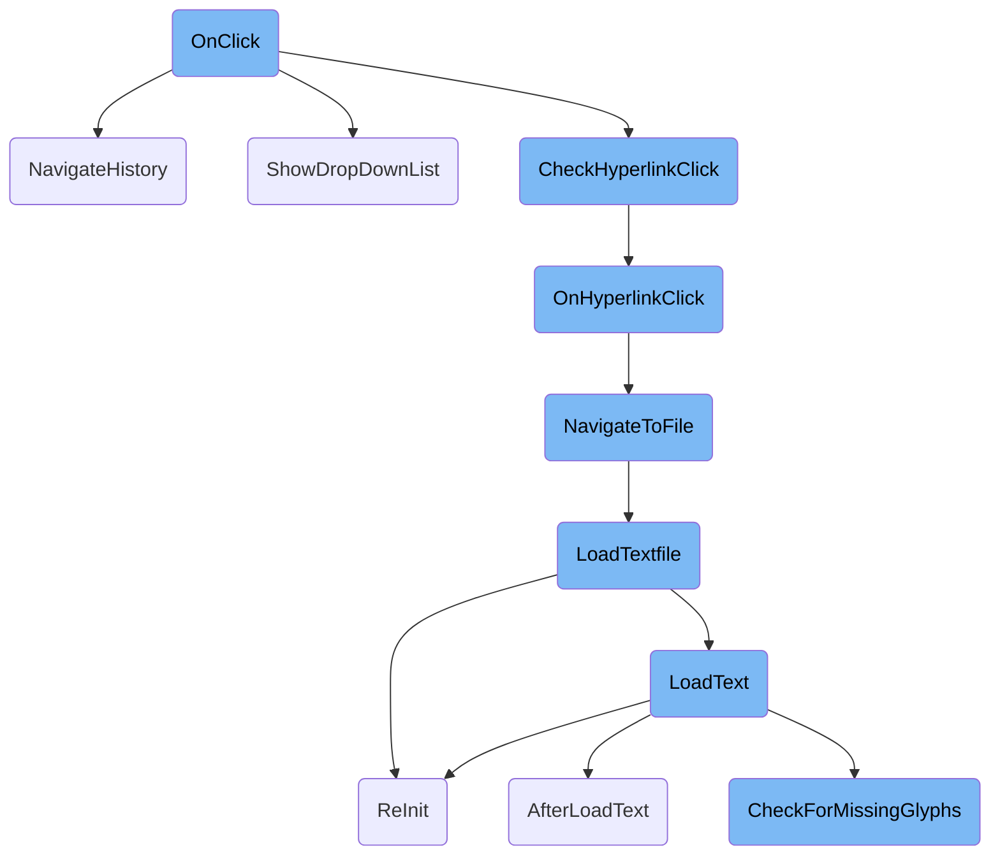
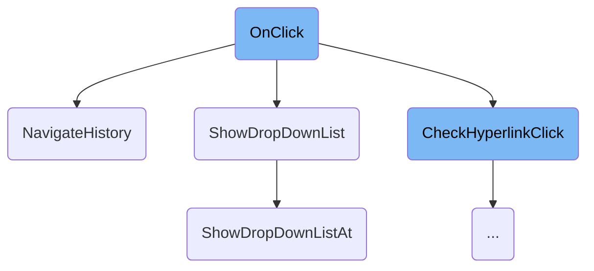
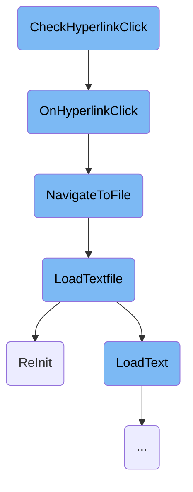
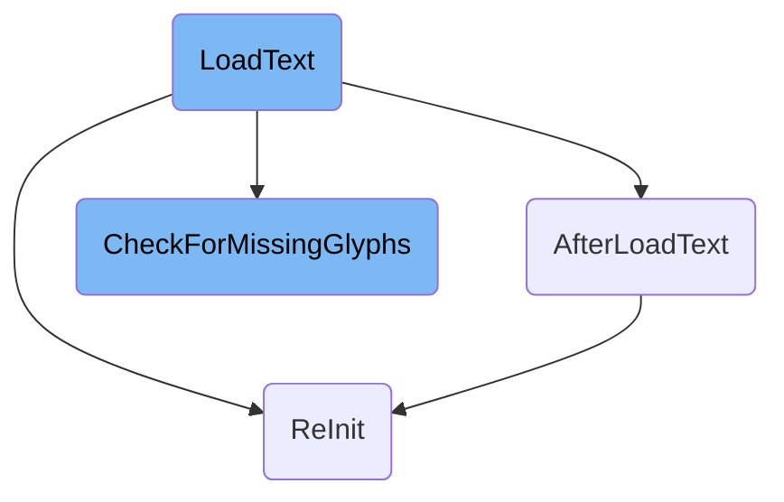

This document explains the <SwmToken path="src/textfile_gui.cpp" pos="526:10:10" line-data="/* virtual */ void TextfileWindow::OnClick([[maybe_unused]] Point pt, WidgetID widget, [[maybe_unused]] int click_count)">`OnClick`</SwmToken> function, which handles various user interactions within the application. It covers how different widget clicks are processed, including navigating history, showing dropdown lists, and handling hyperlink clicks.

When a user clicks on different parts of the application, the <SwmToken path="src/textfile_gui.cpp" pos="526:10:10" line-data="/* virtual */ void TextfileWindow::OnClick([[maybe_unused]] Point pt, WidgetID widget, [[maybe_unused]] int click_count)">`OnClick`</SwmToken> function determines what action to take based on the clicked widget. For example, clicking on a specific widget might show a dropdown list, navigate through the history of viewed files, or check if a hyperlink was clicked. If a hyperlink is clicked, it can either navigate within the document, open a web link, or load a new file. The process ensures that the correct action is taken for each type of click, providing a smooth user experience.

Here is a high level diagram of the flow, showing only the most important functions:



# Flow drill down

First, we'll zoom into this section of the flow:



<SwmSnippet path="/src/textfile_gui.cpp" line="526">

---

## Handling different widget clicks

The <SwmToken path="src/textfile_gui.cpp" pos="526:10:10" line-data="/* virtual */ void TextfileWindow::OnClick([[maybe_unused]] Point pt, WidgetID widget, [[maybe_unused]] int click_count)">`OnClick`</SwmToken> function handles different user interactions based on the widget clicked. For example, clicking on <SwmToken path="src/textfile_gui.cpp" pos="529:3:3" line-data="		case WID_TF_WRAPTEXT:">`WID_TF_WRAPTEXT`</SwmToken> toggles the text wrapping state, while clicking on <SwmToken path="src/textfile_gui.cpp" pos="534:3:3" line-data="		case WID_TF_JUMPLIST: {">`WID_TF_JUMPLIST`</SwmToken> shows a dropdown list of jump points in the text file.

```c++
/* virtual */ void TextfileWindow::OnClick([[maybe_unused]] Point pt, WidgetID widget, [[maybe_unused]] int click_count)
{
	switch (widget) {
		case WID_TF_WRAPTEXT:
			this->ToggleWidgetLoweredState(WID_TF_WRAPTEXT);
			this->InvalidateData();
			break;

		case WID_TF_JUMPLIST: {
			DropDownList list;
			for (size_t line : this->jumplist) {
				SetDParamStr(0, this->lines[line].text);
				list.push_back(MakeDropDownListStringItem(STR_TEXTFILE_JUMPLIST_ITEM, (int)line));
			}
			ShowDropDownList(this, std::move(list), -1, widget);
			break;
		}

		case WID_TF_NAVBACK:
			this->NavigateHistory(-1);
			break;
```

---

</SwmSnippet>

<SwmSnippet path="/src/textfile_gui.cpp" line="374">

---

### Navigating history

The <SwmToken path="src/textfile_gui.cpp" pos="379:4:4" line-data="void TextfileWindow::NavigateHistory(int delta)">`NavigateHistory`</SwmToken> function allows users to navigate through the history of viewed text files. It updates the current file path and scroll position based on the history entry selected.

```c++
/**
 * Navigate through the history, either forward or backward.
 *
 * @param delta The direction to navigate.
 */
void TextfileWindow::NavigateHistory(int delta)
{
	if (delta == 0) return;
	if (delta < 0 && static_cast<int>(this->history_pos) < -delta) return;
	if (delta > 0 && this->history_pos + delta >= this->history.size()) return;

	this->UpdateHistoryScrollpos();
	this->history_pos += delta;

	if (this->history[this->history_pos].filepath != this->filepath) {
		this->filepath = this->history[this->history_pos].filepath;
		this->filename = this->filepath.substr(this->filepath.find_last_of(PATHSEP) + 1);
		this->LoadTextfile(this->filepath, NO_DIRECTORY);
	}

	this->SetWidgetDisabledState(WID_TF_NAVFORWARD, this->history_pos + 1 >= this->history.size());
```

---

</SwmSnippet>

<SwmSnippet path="/src/dropdown.cpp" line="392">

---

### Showing dropdown list

The <SwmToken path="src/dropdown.cpp" pos="404:2:2" line-data="void ShowDropDownList(Window *w, DropDownList &amp;&amp;list, int selected, WidgetID button, uint width, bool instant_close, bool persist)">`ShowDropDownList`</SwmToken> function displays a dropdown list at the specified widget's location. It uses the widget's position and dimensions to determine where to place the dropdown list.

```c++
/**
 * Show a drop down list.
 * @param w        Parent window for the list.
 * @param list     Prepopulated DropDownList.
 * @param selected The initially selected list item.
 * @param button   The widget within the parent window that is used to determine
 *                 the list's location.
 * @param width    Override the minimum width determined by the selected widget and list contents.
 * @param instant_close Set to true if releasing mouse button should close the
 *                      list regardless of where the cursor is.
 * @param persist  Set if this dropdown should stay open after an option is selected.
 */
void ShowDropDownList(Window *w, DropDownList &&list, int selected, WidgetID button, uint width, bool instant_close, bool persist)
{
	/* Our parent's button widget is used to determine where to place the drop
	 * down list window. */
	NWidgetCore *nwi = w->GetWidget<NWidgetCore>(button);
	Rect wi_rect      = nwi->GetCurrentRect();
	Colours wi_colour = nwi->colour;

	if ((nwi->type & WWT_MASK) == NWID_BUTTON_DROPDOWN) {
```

---

</SwmSnippet>

<SwmSnippet path="/src/dropdown.cpp" line="374">

---

### Showing dropdown list at specific location

The <SwmToken path="src/dropdown.cpp" pos="386:2:2" line-data="void ShowDropDownListAt(Window *w, DropDownList &amp;&amp;list, int selected, WidgetID button, Rect wi_rect, Colours wi_colour, bool instant_close, bool persist)">`ShowDropDownListAt`</SwmToken> function is called by <SwmToken path="src/textfile_gui.cpp" pos="540:1:1" line-data="			ShowDropDownList(this, std::move(list), -1, widget);">`ShowDropDownList`</SwmToken> to actually create and display the dropdown list window at the calculated position.

```c++
/**
 * Show a drop down list.
 * @param w        Parent window for the list.
 * @param list     Prepopulated DropDownList.
 * @param selected The initially selected list item.
 * @param button   The widget which is passed to Window::OnDropdownSelect and OnDropdownClose.
 *                 Unless you override those functions, this should be then widget index of the dropdown button.
 * @param wi_rect  Coord of the parent drop down button, used to position the dropdown menu.
 * @param instant_close Set to true if releasing mouse button should close the
 *                      list regardless of where the cursor is.
 * @param persist  Set if this dropdown should stay open after an option is selected.
 */
void ShowDropDownListAt(Window *w, DropDownList &&list, int selected, WidgetID button, Rect wi_rect, Colours wi_colour, bool instant_close, bool persist)
{
	CloseWindowByClass(WC_DROPDOWN_MENU);
	new DropdownWindow(w, std::move(list), selected, button, wi_rect, instant_close, wi_colour, persist);
}
```

---

</SwmSnippet>

Now, lets zoom into this section of the flow:



<SwmSnippet path="/src/textfile_gui.cpp" line="301">

---

## Handling Hyperlink Clicks

The <SwmToken path="src/textfile_gui.cpp" pos="306:4:4" line-data="void TextfileWindow::CheckHyperlinkClick(Point pt)">`CheckHyperlinkClick`</SwmToken> function determines if a user clicked on a hyperlink within a text file. It identifies the clicked line and character position, then checks if any hyperlinks are present at that position. If a hyperlink is found, it triggers the <SwmToken path="src/textfile_gui.cpp" pos="401:10:10" line-data="/* virtual */ void TextfileWindow::OnHyperlinkClick(const Hyperlink &amp;link)">`OnHyperlinkClick`</SwmToken> function.

```c++
/**
 * Check if the user clicked on a hyperlink, and handle it if so.
 *
 * @param pt The loation the user clicked.
 */
void TextfileWindow::CheckHyperlinkClick(Point pt)
{
	if (this->links.empty()) return;

	/* Which line was clicked. */
	const int clicked_row = this->GetRowFromWidget(pt.y, WID_TF_BACKGROUND, WidgetDimensions::scaled.frametext.top, GetCharacterHeight(FS_MONO)) + this->GetScrollbar(WID_TF_VSCROLLBAR)->GetPosition();
	size_t line_index;
	size_t subline;
	if (IsWidgetLowered(WID_TF_WRAPTEXT)) {
		auto it = std::find_if(std::begin(this->lines), std::end(this->lines), [clicked_row](const Line &l) { return l.top <= clicked_row && l.bottom > clicked_row; });
		if (it == this->lines.cend()) return;
		line_index = it - this->lines.cbegin();
		subline = clicked_row - it->top;
		Debug(misc, 4, "TextfileWindow check hyperlink: clicked_row={}, line_index={}, line.top={}, subline={}", clicked_row, line_index, it->top, subline);
	} else {
		line_index = clicked_row / GetCharacterHeight(FS_MONO);
```

---

</SwmSnippet>

<SwmSnippet path="/src/textfile_gui.cpp" line="401">

---

## Processing Hyperlink Clicks

The <SwmToken path="src/textfile_gui.cpp" pos="401:10:10" line-data="/* virtual */ void TextfileWindow::OnHyperlinkClick(const Hyperlink &amp;link)">`OnHyperlinkClick`</SwmToken> function processes the hyperlink based on its type. Internal links navigate within the document, web links open in a browser, and file links trigger the <SwmToken path="src/textfile_gui.cpp" pos="420:3:3" line-data="			this-&gt;NavigateToFile(link.destination, 0);">`NavigateToFile`</SwmToken> function to load a new file.

```c++
/* virtual */ void TextfileWindow::OnHyperlinkClick(const Hyperlink &link)
{
	switch (ClassifyHyperlink(link.destination, this->trusted)) {
		case HyperlinkType::Internal:
		{
			auto it = std::find_if(this->link_anchors.cbegin(), this->link_anchors.cend(), [&](const Hyperlink &other) { return link.destination == other.destination; });
			if (it != this->link_anchors.cend()) {
				this->AppendHistory(this->filepath);
				this->ScrollToLine(it->line);
				this->UpdateHistoryScrollpos();
			}
			break;
		}

		case HyperlinkType::Web:
			OpenBrowser(link.destination);
			break;

		case HyperlinkType::File:
			this->NavigateToFile(link.destination, 0);
			break;
```

---

</SwmSnippet>

<SwmSnippet path="/src/textfile_gui.cpp" line="429">

---

## Navigating to Files

The <SwmToken path="src/textfile_gui.cpp" pos="435:4:4" line-data="void TextfileWindow::NavigateToFile(std::string newfile, size_t line)">`NavigateToFile`</SwmToken> function handles navigation to a new file. It verifies the file path, checks if the file exists, updates the history, and loads the new file using the <SwmToken path="src/textfile_gui.cpp" pos="391:3:3" line-data="		this-&gt;LoadTextfile(this-&gt;filepath, NO_DIRECTORY);">`LoadTextfile`</SwmToken> function.

```c++
/**
 * Navigate to the requested file.
 *
 * @param newfile The file to navigate to.
 * @param line The line to scroll to.
 */
void TextfileWindow::NavigateToFile(std::string newfile, size_t line)
{
	/* Double-check that the file link begins with ./ as a relative path. */
	if (!newfile.starts_with("./")) return;

	/* Get the path portion of the current file path. */
	std::string newpath = this->filepath;
	size_t pos = newpath.find_last_of(PATHSEPCHAR);
	if (pos == std::string::npos) {
		newpath.clear();
	} else {
		newpath.erase(pos + 1);
	}

	/* Check and remove for anchor in link. Do this before we find the filename, as people might have a / after the hash. */
```

---

</SwmSnippet>

<SwmSnippet path="/src/textfile_gui.cpp" line="728">

---

## Loading Text Files

The <SwmToken path="src/textfile_gui.cpp" pos="734:10:10" line-data="/* virtual */ void TextfileWindow::LoadTextfile(const std::string &amp;textfile, Subdirectory dir)">`LoadTextfile`</SwmToken> function reads the content of a text file, processes it into lines, and performs any necessary parsing. It also updates the file path and filename.

```c++
#endif


/**
 * Loads the textfile text from file and setup #lines.
 */
/* virtual */ void TextfileWindow::LoadTextfile(const std::string &textfile, Subdirectory dir)
{
	this->lines.clear();
	this->jumplist.clear();

	if (this->GetWidget<NWidgetStacked>(WID_TF_SEL_JUMPLIST)->SetDisplayedPlane(SZSP_HORIZONTAL)) this->ReInit();

	if (textfile.empty()) return;

	/* Get text from file */
	size_t filesize;
	FILE *handle = FioFOpenFile(textfile, "rb", dir, &filesize);
	if (handle == nullptr) return;
	/* Early return on empty files. */
	if (filesize == 0) return;
```

---

</SwmSnippet>

<SwmSnippet path="/src/window.cpp" line="945">

---

## Reinitializing the Window

The <SwmToken path="src/window.cpp" pos="952:4:4" line-data="void Window::ReInit(int rx, int ry, bool reposition)">`ReInit`</SwmToken> function reinitializes the window, optionally resizing it and repositioning it to the default location. This ensures the window is properly updated when loading new content.

```c++
/**
 * Re-initialize a window, and optionally change its size.
 * @param rx Horizontal resize of the window.
 * @param ry Vertical resize of the window.
 * @param reposition If set, reposition the window to default location.
 * @note For just resizing the window, use #ResizeWindow instead.
 */
void Window::ReInit(int rx, int ry, bool reposition)
{
	this->SetDirty(); // Mark whole current window as dirty.

	/* Save current size. */
	int window_width  = this->width * _gui_scale / this->scale;
	int window_height = this->height * _gui_scale / this->scale;
	this->scale = _gui_scale;

	this->OnInit();
	/* Re-initialize window smallest size. */
	this->nested_root->SetupSmallestSize(this);
	this->nested_root->AssignSizePosition(ST_SMALLEST, 0, 0, this->nested_root->smallest_x, this->nested_root->smallest_y, _current_text_dir == TD_RTL);
	this->width  = this->nested_root->smallest_x;
```

---

</SwmSnippet>

Now, lets zoom into this section of the flow:



<SwmSnippet path="/src/textfile_gui.cpp" line="784">

---

## Loading Text Data

The <SwmToken path="src/textfile_gui.cpp" pos="791:4:4" line-data="void TextfileWindow::LoadText(std::string_view buf)">`LoadText`</SwmToken> function is responsible for loading text into the textfile viewer. It processes the input text by splitting it into lines and storing these lines for efficient rendering. It also calculates the maximum line length for proper display formatting. After processing the text, it calls <SwmToken path="src/textfile_gui.cpp" pos="497:10:10" line-data="/* virtual */ void TextfileWindow::AfterLoadText()">`AfterLoadText`</SwmToken> and <SwmToken path="src/strings.cpp" pos="2257:2:2" line-data="void CheckForMissingGlyphs(bool base_font, MissingGlyphSearcher *searcher)">`CheckForMissingGlyphs`</SwmToken> to handle additional tasks such as managing hyperlinks and ensuring font compatibility.

```c++
/**
 * Load a text into the textfile viewer.
 *
 * This will split the text into newlines and stores it for fast drawing.
 *
 * @param buf The text to load.
 */
void TextfileWindow::LoadText(std::string_view buf)
{
	std::string text = StrMakeValid(buf, SVS_REPLACE_WITH_QUESTION_MARK | SVS_ALLOW_NEWLINE | SVS_REPLACE_TAB_CR_NL_WITH_SPACE);
	this->lines.clear();

	/* Split the string on newlines. */
	std::string_view p(text);
	int row = 0;
	auto next = p.find_first_of('\n');
	while (next != std::string_view::npos) {
		this->lines.emplace_back(row, p.substr(0, next));
		p.remove_prefix(next + 1);

		row++;
```

---

</SwmSnippet>

<SwmSnippet path="/src/textfile_gui.cpp" line="497">

---

## Post-Load Processing

The <SwmToken path="src/textfile_gui.cpp" pos="497:10:10" line-data="/* virtual */ void TextfileWindow::AfterLoadText()">`AfterLoadText`</SwmToken> function performs additional processing after the text has been loaded. It clears any existing hyperlink anchors and checks if the file is a Markdown file to handle it accordingly. It also updates the display settings based on the presence of a jump list.

```c++
/* virtual */ void TextfileWindow::AfterLoadText()
{
	this->link_anchors.clear();

	if (StrEndsWithIgnoreCase(this->filename, ".md")) this->AfterLoadMarkdown();

	if (this->GetWidget<NWidgetStacked>(WID_TF_SEL_JUMPLIST)->SetDisplayedPlane(this->jumplist.empty() ? SZSP_HORIZONTAL : 0)) this->ReInit();
}
```

---

</SwmSnippet>

<SwmSnippet path="/src/strings.cpp" line="2244">

---

## Checking for Missing Glyphs

The <SwmToken path="src/strings.cpp" pos="2257:2:2" line-data="void CheckForMissingGlyphs(bool base_font, MissingGlyphSearcher *searcher)">`CheckForMissingGlyphs`</SwmToken> function ensures that the currently loaded font supports all characters used in the text. If any characters are missing, it attempts to find a fallback font and displays an error message if necessary. This function is crucial for maintaining text readability and user experience, especially when dealing with different languages and special characters.

```c++
/**
 * Check whether the currently loaded language pack
 * uses characters that the currently loaded font
 * does not support. If this is the case an error
 * message will be shown in English. The error
 * message will not be localized because that would
 * mean it might use characters that are not in the
 * font, which is the whole reason this check has
 * been added.
 * @param base_font Whether to look at the base font as well.
 * @param searcher  The methods to use to search for strings to check.
 *                  If nullptr the loaded language pack searcher is used.
 */
void CheckForMissingGlyphs(bool base_font, MissingGlyphSearcher *searcher)
{
	static LanguagePackGlyphSearcher pack_searcher;
	if (searcher == nullptr) searcher = &pack_searcher;
	bool bad_font = !base_font || searcher->FindMissingGlyphs();
#if defined(WITH_FREETYPE) || defined(_WIN32) || defined(WITH_COCOA)
	if (bad_font) {
		/* We found an unprintable character... lets try whether we can find
```

---

</SwmSnippet>

&nbsp;

*This is an auto-generated document by Swimm AI 🌊 and has not yet been verified by a human*

<SwmMeta version="3.0.0" repo-id="Z2l0aHViJTNBJTNBT3BlblRURC1jb3BpbG90LWRlbW8lM0ElM0Fzd2ltbWlv" repo-name="OpenTTD-copilot-demo"><sup>Powered by [Swimm](/)</sup></SwmMeta>
