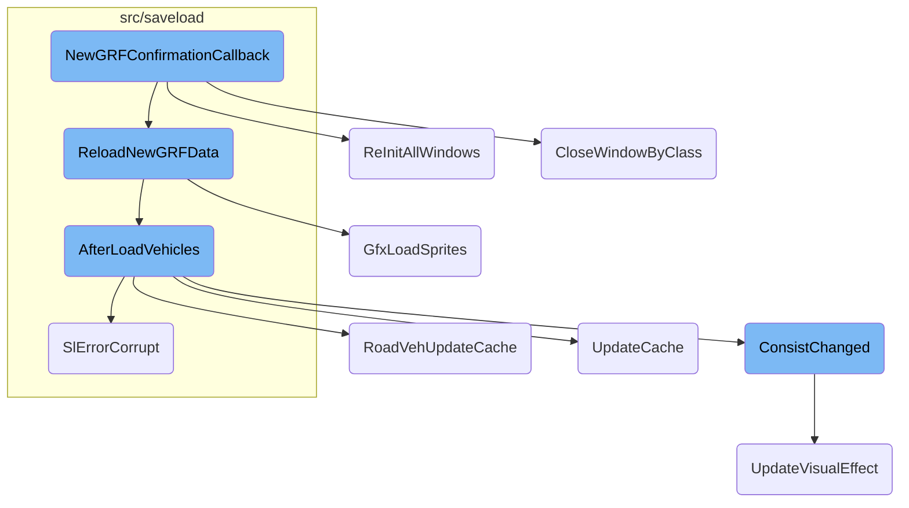
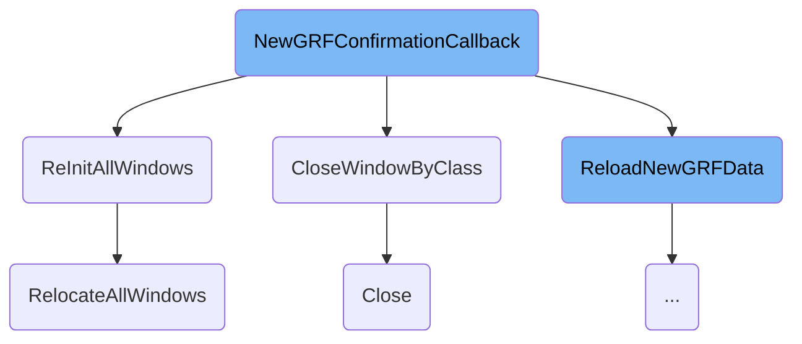
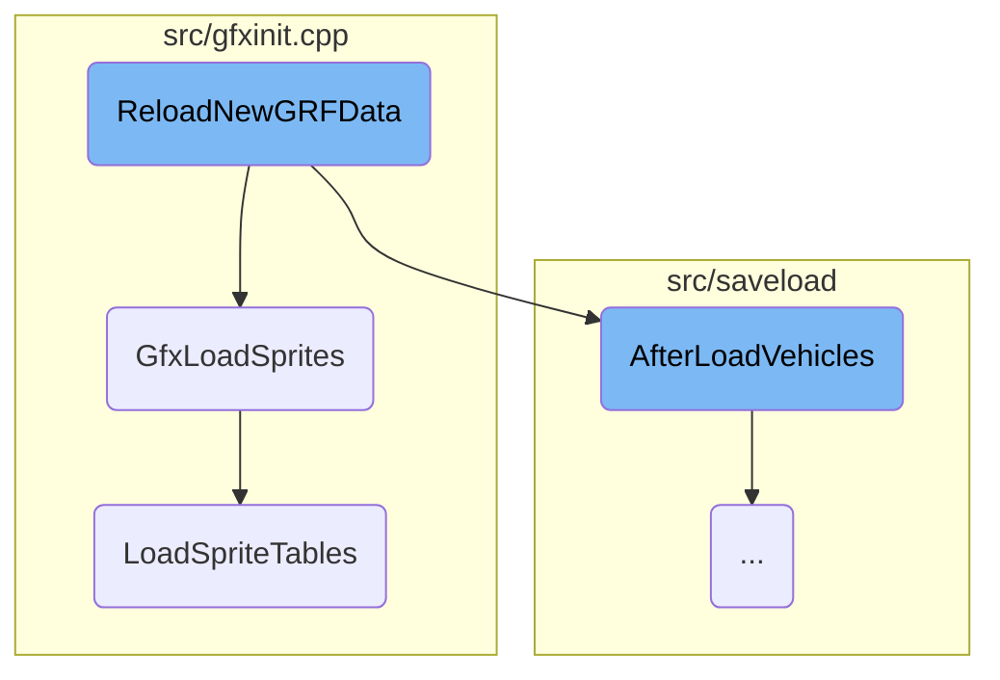
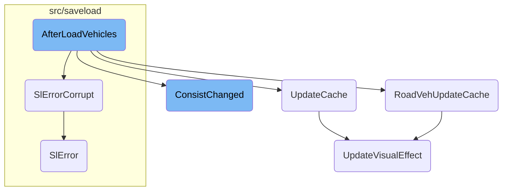

This document explains the process of handling user confirmation for applying <SwmToken path="src/newgrf_gui.cpp" pos="8:15:15" line-data="/** @file newgrf_gui.cpp GUI to change NewGRF settings. */">`NewGRF`</SwmToken> changes. The process involves closing specific windows, logging changes, updating the GRF configuration, and reloading <SwmToken path="src/newgrf_gui.cpp" pos="8:15:15" line-data="/** @file newgrf_gui.cpp GUI to change NewGRF settings. */">`NewGRF`</SwmToken> data to ensure the game state reflects the new configurations.

When a user confirms changes to <SwmToken path="src/newgrf_gui.cpp" pos="8:15:15" line-data="/** @file newgrf_gui.cpp GUI to change NewGRF settings. */">`NewGRF`</SwmToken> settings, the game first closes any open windows related to GRF parameters and text files. It then logs the changes and updates the GRF configuration. After that, the game reloads the <SwmToken path="src/newgrf_gui.cpp" pos="8:15:15" line-data="/** @file newgrf_gui.cpp GUI to change NewGRF settings. */">`NewGRF`</SwmToken> data, which involves updating various game elements like vehicle data, station graphics, and company statistics. Finally, all windows are reinitialized to reflect the new game state, ensuring that everything is up-to-date and consistent.

Here is a high level diagram of the flow, showing only the most important functions:



# Flow drill down

First, we'll zoom into this section of the flow:



<SwmSnippet path="/src/newgrf_gui.cpp" line="1980">

---

## Handling User Confirmation

The function <SwmToken path="src/newgrf_gui.cpp" pos="1980:4:4" line-data="static void NewGRFConfirmationCallback(Window *w, bool confirmed)">`NewGRFConfirmationCallback`</SwmToken> handles the user's confirmation for applying <SwmToken path="src/newgrf_gui.cpp" pos="8:15:15" line-data="/** @file newgrf_gui.cpp GUI to change NewGRF settings. */">`NewGRF`</SwmToken> changes. If the user confirms, it closes specific windows, logs the changes, updates the GRF configuration, and reloads the <SwmToken path="src/newgrf_gui.cpp" pos="8:15:15" line-data="/** @file newgrf_gui.cpp GUI to change NewGRF settings. */">`NewGRF`</SwmToken> data. This ensures that the game state reflects the new configurations.

```c++
static void NewGRFConfirmationCallback(Window *w, bool confirmed)
{
	if (confirmed) {
		CloseWindowByClass(WC_GRF_PARAMETERS);
		CloseWindowByClass(WC_TEXTFILE);
		NewGRFWindow *nw = dynamic_cast<NewGRFWindow*>(w);

		_gamelog.StartAction(GLAT_GRF);
		_gamelog.GRFUpdate(_grfconfig, nw->actives); // log GRF changes
		CopyGRFConfigList(nw->orig_list, nw->actives, false);
		ReloadNewGRFData();
		_gamelog.StopAction();

		/* Show new, updated list */
		GRFConfig *c;
		int i = 0;
		for (c = nw->actives; c != nullptr && c != nw->active_sel; c = c->next, i++) {}
		CopyGRFConfigList(&nw->actives, *nw->orig_list, false);
		for (c = nw->actives; c != nullptr && i > 0; c = c->next, i--) {}
		nw->active_sel = c;
		nw->avails.ForceRebuild();
```

---

</SwmSnippet>

<SwmSnippet path="/src/newgrf_gui.cpp" line="1982">

---

### Closing Specific Windows

The function <SwmToken path="src/newgrf_gui.cpp" pos="1983:1:1" line-data="		CloseWindowByClass(WC_GRF_PARAMETERS);">`CloseWindowByClass`</SwmToken> is called to close windows of specific classes, ensuring that the interface is updated and no outdated windows remain open.

```c++
	if (confirmed) {
		CloseWindowByClass(WC_GRF_PARAMETERS);
		CloseWindowByClass(WC_TEXTFILE);
```

---

</SwmSnippet>

<SwmSnippet path="/src/newgrf_gui.cpp" line="1987">

---

### Logging and Updating GRF Configurations

The game log is updated with the new GRF configurations, and the <SwmToken path="src/newgrf_gui.cpp" pos="1990:1:1" line-data="		ReloadNewGRFData();">`ReloadNewGRFData`</SwmToken> function is called to apply these changes to the game.

```c++
		_gamelog.StartAction(GLAT_GRF);
		_gamelog.GRFUpdate(_grfconfig, nw->actives); // log GRF changes
		CopyGRFConfigList(nw->orig_list, nw->actives, false);
		ReloadNewGRFData();
		_gamelog.StopAction();
```

---

</SwmSnippet>

<SwmSnippet path="/src/window.cpp" line="3324">

---

## Reinitializing All Windows

The function <SwmToken path="src/window.cpp" pos="3324:2:2" line-data="void ReInitAllWindows(bool zoom_changed)">`ReInitAllWindows`</SwmToken> reinitializes all windows to ensure they reflect the new game state. It resets widget dimensions, reinitializes specific windows like the toolbar and status bar, and relocates all windows to fit the new screen size.

```c++
void ReInitAllWindows(bool zoom_changed)
{
	SetupWidgetDimensions();
	NWidgetLeaf::InvalidateDimensionCache(); // Reset cached sizes of several widgets.
	NWidgetScrollbar::InvalidateDimensionCache();

	InitDepotWindowBlockSizes();

	/* When _gui_zoom has changed, we need to resize toolbar and statusbar first,
	 * so EnsureVisibleCaption uses the updated size information. */
	ReInitWindow(FindWindowById(WC_MAIN_TOOLBAR, 0), zoom_changed);
	ReInitWindow(FindWindowById(WC_STATUS_BAR, 0), zoom_changed);
	for (Window *w : Window::Iterate()) {
		if (w->window_class == WC_MAIN_TOOLBAR || w->window_class == WC_STATUS_BAR) continue;
		ReInitWindow(w, zoom_changed);
	}

	if (_networking) NetworkUndrawChatMessage();
	NetworkReInitChatBoxSize();

	/* Make sure essential parts of all windows are visible */
```

---

</SwmSnippet>

<SwmSnippet path="/src/window.cpp" line="1152">

---

### Closing Windows by Class

The function <SwmToken path="src/window.cpp" pos="1152:2:2" line-data="void CloseWindowByClass(WindowClass cls, int data)">`CloseWindowByClass`</SwmToken> iterates over all windows and closes those that match the specified class. This is used to ensure that no outdated windows remain open after changes are applied.

```c++
void CloseWindowByClass(WindowClass cls, int data)
{
	/* Note: the container remains stable, even when deleting windows. */
	for (Window *w : Window::Iterate()) {
		if (w->window_class == cls) {
			w->Close(data);
		}
	}
```

---

</SwmSnippet>

<SwmSnippet path="/src/window.cpp" line="1047">

---

### Closing Individual Windows

The method <SwmToken path="src/window.cpp" pos="1047:4:4" line-data="void Window::Close([[maybe_unused]] int data)">`Close`</SwmToken> hides the window and marks it for later deletion. It ensures that the window is not accessed after being closed and handles any child windows.

```c++
void Window::Close([[maybe_unused]] int data)
{
	/* Don't close twice. */
	if (*this->z_position == nullptr) return;

	*this->z_position = nullptr;

	if (_thd.window_class == this->window_class &&
			_thd.window_number == this->window_number) {
		ResetObjectToPlace();
	}

	/* Prevent Mouseover() from resetting mouse-over coordinates on a non-existing window */
	if (_mouseover_last_w == this) _mouseover_last_w = nullptr;

	/* We can't scroll the window when it's closed. */
	if (_last_scroll_window == this) _last_scroll_window = nullptr;

	/* Make sure we don't try to access non-existing query strings. */
	this->querystrings.clear();

```

---

</SwmSnippet>

<SwmSnippet path="/src/window.cpp" line="3440">

---

### Relocating All Windows

The function <SwmToken path="src/window.cpp" pos="3440:2:2" line-data="void RelocateAllWindows(int neww, int newh)">`RelocateAllWindows`</SwmToken> adjusts the position and size of all windows to fit the new screen dimensions. It ensures that essential parts of all windows are visible and properly positioned.

```c++
void RelocateAllWindows(int neww, int newh)
{
	CloseWindowByClass(WC_DROPDOWN_MENU);

	/* Reposition toolbar then status bar before other all windows. */
	if (Window *wt = FindWindowById(WC_MAIN_TOOLBAR, 0); wt != nullptr) {
		ResizeWindow(wt, std::min<uint>(neww, _toolbar_width) - wt->width, 0, false);
		wt->left = PositionMainToolbar(wt);
	}

	if (Window *ws = FindWindowById(WC_STATUS_BAR, 0); ws != nullptr) {
		ResizeWindow(ws, std::min<uint>(neww, _toolbar_width) - ws->width, 0, false);
		ws->top = newh - ws->height;
		ws->left = PositionStatusbar(ws);
	}

	for (Window *w : Window::Iterate()) {
		int left, top;
		/* XXX - this probably needs something more sane. For example specifying
		 * in a 'backup'-desc that the window should always be centered. */
		switch (w->window_class) {
```

---

</SwmSnippet>

Now, lets zoom into this section of the flow:



<SwmSnippet path="/src/saveload/afterload.cpp" line="3337">

---

## Reloading <SwmToken path="src/newgrf_gui.cpp" pos="8:15:15" line-data="/** @file newgrf_gui.cpp GUI to change NewGRF settings. */">`NewGRF`</SwmToken> Data

The function <SwmToken path="src/saveload/afterload.cpp" pos="3337:2:2" line-data="void ReloadNewGRFData()">`ReloadNewGRFData`</SwmToken> is responsible for reloading all <SwmToken path="src/newgrf_gui.cpp" pos="8:15:15" line-data="/** @file newgrf_gui.cpp GUI to change NewGRF settings. */">`NewGRF`</SwmToken> files during a running game. It updates various game elements such as vehicle data, station graphics, company statistics, and house and town values to reflect any changes in the <SwmToken path="src/newgrf_gui.cpp" pos="8:15:15" line-data="/** @file newgrf_gui.cpp GUI to change NewGRF settings. */">`NewGRF`</SwmToken> files.

```c++
void ReloadNewGRFData()
{
	/* reload grf data */
	GfxLoadSprites();
	LoadStringWidthTable();
	RecomputePrices();
	/* reload vehicles */
	ResetVehicleHash();
	AfterLoadVehicles(false);
	StartupEngines();
	GroupStatistics::UpdateAfterLoad();
	/* update station graphics */
	AfterLoadStations();
	/* Update company statistics. */
	AfterLoadCompanyStats();
	/* Check and update house and town values */
	UpdateHousesAndTowns();
	/* Delete news referring to no longer existing entities */
	DeleteInvalidEngineNews();
	/* Update livery selection windows */
	for (CompanyID i = COMPANY_FIRST; i < MAX_COMPANIES; i++) InvalidateWindowData(WC_COMPANY_COLOUR, i);
```

---

</SwmSnippet>

<SwmSnippet path="/src/gfxinit.cpp" line="326">

---

### Loading Sprites

The function <SwmToken path="src/gfxinit.cpp" pos="326:2:2" line-data="void GfxLoadSprites()">`GfxLoadSprites`</SwmToken> initializes and loads all the sprites. It switches the <SwmToken path="src/newgrf_gui.cpp" pos="8:15:15" line-data="/** @file newgrf_gui.cpp GUI to change NewGRF settings. */">`NewGRF`</SwmToken> blitter, clears system sprites, initializes sprite memory, loads sprite tables, and initializes palettes. This ensures that the graphical elements are correctly loaded and displayed.

```c++
void GfxLoadSprites()
{
	Debug(sprite, 2, "Loading sprite set {}", _settings_game.game_creation.landscape);

	SwitchNewGRFBlitter();
	VideoDriver::GetInstance()->ClearSystemSprites();
	ClearFontCache();
	GfxInitSpriteMem();
	LoadSpriteTables();
	GfxInitPalettes();

	UpdateCursorSize();
}
```

---

</SwmSnippet>

<SwmSnippet path="/src/gfxinit.cpp" line="151">

---

### Loading Sprite Tables

The function <SwmToken path="src/gfxinit.cpp" pos="151:4:4" line-data="static void LoadSpriteTables()">`LoadSpriteTables`</SwmToken> loads the sprite tables from the graphics set. It handles the loading of base and additional sprites, initializes the unicode to sprite mapping table, and loads the base and extra <SwmToken path="src/newgrf_gui.cpp" pos="8:15:15" line-data="/** @file newgrf_gui.cpp GUI to change NewGRF settings. */">`NewGRF`</SwmToken> with required graphics. This function ensures that all necessary sprites are available for the game.

```c++
static void LoadSpriteTables()
{
	const GraphicsSet *used_set = BaseGraphics::GetUsedSet();

	LoadGrfFile(used_set->files[GFT_BASE].filename, 0, PAL_DOS != used_set->palette);

	/*
	 * The second basic file always starts at the given location and does
	 * contain a different amount of sprites depending on the "type"; DOS
	 * has a few sprites less. However, we do not care about those missing
	 * sprites as they are not shown anyway (logos in intro game).
	 */
	LoadGrfFile(used_set->files[GFT_LOGOS].filename, 4793, PAL_DOS != used_set->palette);

	/*
	 * Load additional sprites for climates other than temperate.
	 * This overwrites some of the temperate sprites, such as foundations
	 * and the ground sprites.
	 */
	if (_settings_game.game_creation.landscape != LT_TEMPERATE) {
		LoadGrfFileIndexed(
```

---

</SwmSnippet>

Now, lets zoom into this section of the flow:



<SwmSnippet path="/src/saveload/vehicle_sl.cpp" line="257">

---

## Updating Vehicle Properties

The function iterates over all vehicles to reinstate previous pointers and reset certain properties. This ensures that the vehicle data structure is correctly linked and initialized.

```c++
	for (Vehicle *v : Vehicle::Iterate()) {
		/* Reinstate the previous pointer */
		if (v->Next() != nullptr) v->Next()->previous = v;
		if (v->NextShared() != nullptr) v->NextShared()->previous_shared = v;

		if (part_of_load) v->fill_percent_te_id = INVALID_TE_ID;
		v->first = nullptr;
		if (v->IsGroundVehicle()) v->GetGroundVehicleCache()->first_engine = INVALID_ENGINE;
	}
```

---

</SwmSnippet>

<SwmSnippet path="/src/saveload/vehicle_sl.cpp" line="269">

---

## Handling Old Savegame Versions

The function contains multiple checks for different savegame versions. For example, it converts old order lists, updates vehicle subtypes, and sets service interval flags. These steps ensure compatibility with older savegame formats.

```c++
	if (part_of_load) {
		/* Create shared vehicle chain for very old games (pre 5,2) and create
		 * OrderList from shared vehicle chains. For this to work correctly, the
		 * following conditions must be fulfilled:
		 * a) both next_shared and previous_shared are not set for pre 5,2 games
		 * b) both next_shared and previous_shared are set for later games
		 */
		std::map<Order*, OrderList*> mapping;

		for (Vehicle *v : Vehicle::Iterate()) {
			if (v->old_orders != nullptr) {
				if (IsSavegameVersionBefore(SLV_105)) { // Pre-105 didn't save an OrderList
					if (mapping[v->old_orders] == nullptr) {
						/* This adds the whole shared vehicle chain for case b */

						/* Creating an OrderList here is safe because the number of vehicles
						 * allowed in these savegames matches the number of OrderLists. As
						 * such each vehicle can get an OrderList and it will (still) fit. */
						assert(OrderList::CanAllocateItem());
						v->orders = mapping[v->old_orders] = new OrderList(v->old_orders, v);
					} else {
```

---

</SwmSnippet>

<SwmSnippet path="/src/roadveh_cmd.cpp" line="218">

---

### Updating Road Vehicle Cache

The function <SwmToken path="src/roadveh_cmd.cpp" pos="218:2:2" line-data="void RoadVehUpdateCache(RoadVehicle *v, bool same_length)">`RoadVehUpdateCache`</SwmToken> updates the cache for road vehicles, including properties like total length and cargo aging period. This is crucial for maintaining accurate vehicle data after loading.

```c++
void RoadVehUpdateCache(RoadVehicle *v, bool same_length)
{
	assert(v->type == VEH_ROAD);
	assert(v->IsFrontEngine());

	v->InvalidateNewGRFCacheOfChain();

	v->gcache.cached_total_length = 0;

	for (RoadVehicle *u = v; u != nullptr; u = u->Next()) {
		/* Check the v->first cache. */
		assert(u->First() == v);

		/* Update the 'first engine' */
		u->gcache.first_engine = (v == u) ? INVALID_ENGINE : v->engine_type;

		/* Update the length of the vehicle. */
		uint veh_len = GetRoadVehLength(u);
		/* Verify length hasn't changed. */
		if (same_length && veh_len != u->gcache.cached_veh_length) VehicleLengthChanged(u);

```

---

</SwmSnippet>

<SwmSnippet path="/src/ship_cmd.cpp" line="232">

---

### Updating Ship Cache

The method <SwmToken path="src/ship_cmd.cpp" pos="232:4:4" line-data="void Ship::UpdateCache()">`UpdateCache`</SwmToken> for ships updates properties like maximum speed and cargo aging period. This ensures that ship data is accurate and up-to-date.

```c++
void Ship::UpdateCache()
{
	const ShipVehicleInfo *svi = ShipVehInfo(this->engine_type);

	/* Get speed fraction for the current water type. Aqueducts are always canals. */
	bool is_ocean = GetEffectiveWaterClass(this->tile) == WATER_CLASS_SEA;
	uint raw_speed = GetVehicleProperty(this, PROP_SHIP_SPEED, svi->max_speed);
	this->vcache.cached_max_speed = svi->ApplyWaterClassSpeedFrac(raw_speed, is_ocean);

	/* Update cargo aging period. */
	this->vcache.cached_cargo_age_period = GetVehicleProperty(this, PROP_SHIP_CARGO_AGE_PERIOD, EngInfo(this->engine_type)->cargo_age_period);

	this->UpdateVisualEffect();
}
```

---

</SwmSnippet>

<SwmSnippet path="/src/saveload/saveload.cpp" line="351">

---

### Handling Corrupt Savegames

The function <SwmToken path="src/saveload/saveload.cpp" pos="351:8:8" line-data="[[noreturn]] void SlErrorCorrupt(const std::string &amp;msg)">`SlErrorCorrupt`</SwmToken> handles errors related to corrupt savegames by setting up error messages and cleaning up partial loads. This prevents the game from crashing due to corrupted data.

```c++
[[noreturn]] void SlErrorCorrupt(const std::string &msg)
{
	SlError(STR_GAME_SAVELOAD_ERROR_BROKEN_SAVEGAME, msg);
}
```

---

</SwmSnippet>

<SwmSnippet path="/src/train_cmd.cpp" line="110">

---

### Recalculating Train Consist

The method <SwmToken path="src/train_cmd.cpp" pos="110:4:4" line-data="void Train::ConsistChanged(ConsistChangeFlags allowed_changes)">`ConsistChanged`</SwmToken> recalculates various properties of a train, such as maximum speed and compatible rail types. This is essential for ensuring that train data is consistent and accurate.

```c++
void Train::ConsistChanged(ConsistChangeFlags allowed_changes)
{
	uint16_t max_speed = UINT16_MAX;

	assert(this->IsFrontEngine() || this->IsFreeWagon());

	const RailVehicleInfo *rvi_v = RailVehInfo(this->engine_type);
	EngineID first_engine = this->IsFrontEngine() ? this->engine_type : INVALID_ENGINE;
	this->gcache.cached_total_length = 0;
	this->compatible_railtypes = RAILTYPES_NONE;

	bool train_can_tilt = true;
	int16_t min_curve_speed_mod = INT16_MAX;

	for (Train *u = this; u != nullptr; u = u->Next()) {
		const RailVehicleInfo *rvi_u = RailVehInfo(u->engine_type);

		/* Check the this->first cache. */
		assert(u->First() == this);

		/* update the 'first engine' */
```

---

</SwmSnippet>

<SwmSnippet path="/src/saveload/saveload.cpp" line="321">

---

### General Error Handling

The function <SwmToken path="src/saveload/saveload.cpp" pos="321:8:8" line-data="[[noreturn]] void SlError(StringID string, const std::string &amp;extra_msg)">`SlError`</SwmToken> sets up error messages and cleans up partial loads, similar to <SwmToken path="src/saveload/saveload.cpp" pos="351:8:8" line-data="[[noreturn]] void SlErrorCorrupt(const std::string &amp;msg)">`SlErrorCorrupt`</SwmToken>. This function is used for general error handling during <SwmToken path="src/saveload/saveload.cpp" pos="323:18:20" line-data="	/* Distinguish between loading into _load_check_data vs. normal save/load. */">`save/load`</SwmToken> operations.

```c++
[[noreturn]] void SlError(StringID string, const std::string &extra_msg)
{
	/* Distinguish between loading into _load_check_data vs. normal save/load. */
	if (_sl.action == SLA_LOAD_CHECK) {
		_load_check_data.error = string;
		_load_check_data.error_msg = extra_msg;
	} else {
		_sl.error_str = string;
		_sl.extra_msg = extra_msg;
	}

	/* We have to nullptr all pointers here; we might be in a state where
	 * the pointers are actually filled with indices, which means that
	 * when we access them during cleaning the pool dereferences of
	 * those indices will be made with segmentation faults as result. */
	if (_sl.action == SLA_LOAD || _sl.action == SLA_PTRS) SlNullPointers();

	/* Logging could be active. */
	_gamelog.StopAnyAction();

	throw std::exception();
```

---

</SwmSnippet>

<SwmSnippet path="/src/vehicle.cpp" line="2664">

---

### Updating Visual Effects

The method <SwmToken path="src/vehicle.cpp" pos="2664:4:4" line-data="void Vehicle::UpdateVisualEffect(bool allow_power_change)">`UpdateVisualEffect`</SwmToken> updates the visual effects for vehicles, such as smoke for trains or water splashes for ships. This ensures that the visual representation of vehicles is accurate.

```c++
void Vehicle::UpdateVisualEffect(bool allow_power_change)
{
	bool powered_before = HasBit(this->vcache.cached_vis_effect, VE_DISABLE_WAGON_POWER);
	const Engine *e = this->GetEngine();

	/* Evaluate properties */
	uint8_t visual_effect;
	switch (e->type) {
		case VEH_TRAIN: visual_effect = e->u.rail.visual_effect; break;
		case VEH_ROAD:  visual_effect = e->u.road.visual_effect; break;
		case VEH_SHIP:  visual_effect = e->u.ship.visual_effect; break;
		default:        visual_effect = 1 << VE_DISABLE_EFFECT;  break;
	}

	/* Check powered wagon / visual effect callback */
	if (HasBit(e->info.callback_mask, CBM_VEHICLE_VISUAL_EFFECT)) {
		uint16_t callback = GetVehicleCallback(CBID_VEHICLE_VISUAL_EFFECT, 0, 0, this->engine_type, this);

		if (callback != CALLBACK_FAILED) {
			if (callback >= 0x100 && e->GetGRF()->grf_version >= 8) ErrorUnknownCallbackResult(e->GetGRFID(), CBID_VEHICLE_VISUAL_EFFECT, callback);

```

---

</SwmSnippet>

&nbsp;

*This is an auto-generated document by Swimm AI 🌊 and has not yet been verified by a human*

<SwmMeta version="3.0.0" repo-id="Z2l0aHViJTNBJTNBT3BlblRURC1jb3BpbG90LWRlbW8lM0ElM0Fzd2ltbWlv" repo-name="OpenTTD-copilot-demo"><sup>Powered by [Swimm](/)</sup></SwmMeta>
