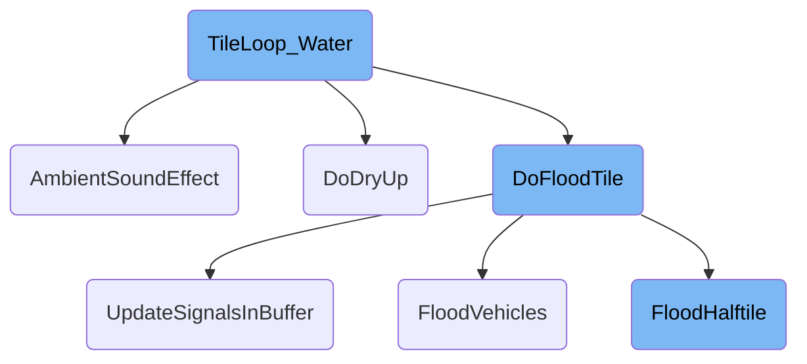
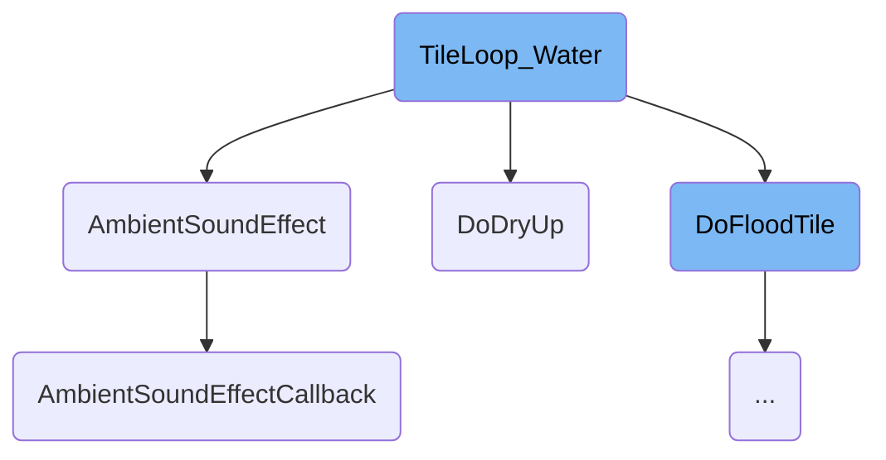
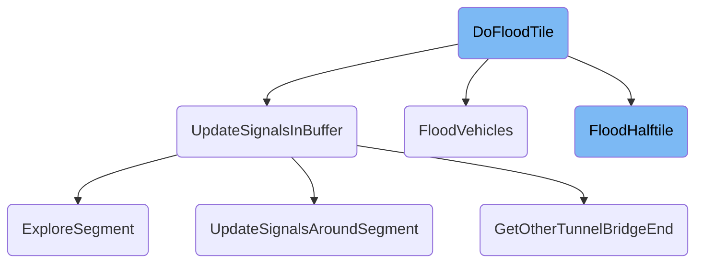
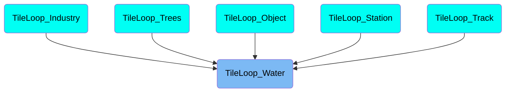

This document explains the process of handling water tile flooding in the game. It covers the main steps involved in managing water tiles, including triggering ambient sound effects, flooding adjacent tiles, and drying up tiles.

The process starts by checking if a tile is a water tile. If it is, an ambient sound effect is triggered. Depending on the flooding behavior, the tile either floods adjacent tiles or dries up. If the tile floods, it handles various scenarios such as flooding vehicles on the tile, updating signals, and managing <SwmToken path="src/rail_cmd.cpp" pos="756:13:15" line-data=" * Called from water_cmd if a non-flat rail-tile gets flooded and should be converted to shore.">`non-flat`</SwmToken> rail tiles. If the tile dries up, it changes its type based on its current state, ensuring the visual and functional state is updated.

Here is a high level diagram of the flow, showing only the most important functions:



# Flow drill down

First, we'll zoom into this section of the flow:



<SwmSnippet path="/src/water_cmd.cpp" line="1225">

---

## Handling Water Tile Flooding

The function <SwmToken path="src/water_cmd.cpp" pos="1231:2:2" line-data="void TileLoop_Water(TileIndex tile)">`TileLoop_Water`</SwmToken> is responsible for managing the flooding behavior of water tiles. It checks if the tile is of type water and then triggers the ambient sound effect. Depending on the flooding behavior, it either floods adjacent tiles or dries up the current tile.

```c++
/**
 * Let a water tile floods its diagonal adjoining tiles
 * called from tunnelbridge_cmd, and by TileLoop_Industry() and TileLoop_Track()
 *
 * @param tile the water/shore tile that floods
 */
void TileLoop_Water(TileIndex tile)
{
	if (IsTileType(tile, MP_WATER)) AmbientSoundEffect(tile);

	switch (GetFloodingBehaviour(tile)) {
		case FLOOD_ACTIVE:
			for (Direction dir = DIR_BEGIN; dir < DIR_END; dir++) {
				TileIndex dest = tile + TileOffsByDir(dir);
				if (!IsValidTile(dest)) continue;
				/* do not try to flood water tiles - increases performance a lot */
				if (IsTileType(dest, MP_WATER)) continue;

				/* TREE_GROUND_SHORE is the sign of a previous flood. */
				if (IsTileType(dest, MP_TREES) && GetTreeGround(dest) == TREE_GROUND_SHORE) continue;

```

---

</SwmSnippet>

<SwmSnippet path="/src/newgrf_generic.h" line="53">

---

### Triggering Ambient Sound Effect

The function <SwmToken path="src/newgrf_generic.h" pos="54:4:4" line-data="inline void AmbientSoundEffect(TileIndex tile)">`AmbientSoundEffect`</SwmToken> plays an ambient sound effect for a tile if the ambient sound callback is enabled. It calls <SwmToken path="src/newgrf_generic.h" pos="59:1:1" line-data="	AmbientSoundEffectCallback(tile);">`AmbientSoundEffectCallback`</SwmToken> to execute the sound effect.

```c
/** Play an ambient sound effect for an empty tile. */
inline void AmbientSoundEffect(TileIndex tile)
{
	/* Only run callback if enabled. */
	if (!HasGrfMiscBit(GMB_AMBIENT_SOUND_CALLBACK)) return;

	AmbientSoundEffectCallback(tile);
}
```

---

</SwmSnippet>

<SwmSnippet path="/src/newgrf_generic.cpp" line="238">

---

### Executing Ambient Sound Effect Callback

The function <SwmToken path="src/newgrf_generic.cpp" pos="242:2:2" line-data="void AmbientSoundEffectCallback(TileIndex tile)">`AmbientSoundEffectCallback`</SwmToken> executes the ambient sound effect callback for a given tile. It ensures the tile type is valid and runs the callback only occasionally to avoid performance issues. If the callback is successful, it plays the sound for the tile.

```c++
/**
 * 'Execute' the ambient sound effect callback.
 * @param tile Tile the sound effect should be generated for.
 */
void AmbientSoundEffectCallback(TileIndex tile)
{
	assert(IsTileType(tile, MP_CLEAR) || IsTileType(tile, MP_TREES) || IsTileType(tile, MP_WATER));

	/* Only run every 1/200-th time. */
	uint32_t r; // Save for later
	if (!Chance16R(1, 200, r) || !_settings_client.sound.ambient) return;

	/* Prepare resolver object. */
	GenericResolverObject object(false, CBID_SOUNDS_AMBIENT_EFFECT);
	object.generic_scope.feature = GSF_SOUNDFX;

	uint32_t param1_v7 = GetTileType(tile) << 28 | Clamp(TileHeight(tile), 0, 15) << 24 | GB(r, 16, 8) << 16 | GetTerrainType(tile);
	uint32_t param1_v8 = GetTileType(tile) << 24 | GetTileZ(tile) << 16 | GB(r, 16, 8) << 8 | (HasTileWaterClass(tile) ? GetWaterClass(tile) : 0) << 3 | GetTerrainType(tile);

	/* Run callback. */
	const GRFFile *grf_file;
```

---

</SwmSnippet>

<SwmSnippet path="/src/water_cmd.cpp" line="1181">

---

## Handling Water Tile Drying Up

The function <SwmToken path="src/water_cmd.cpp" pos="1184:4:4" line-data="static void DoDryUp(TileIndex tile)">`DoDryUp`</SwmToken> handles the drying up of a water tile. It changes the tile type based on its current state, such as converting railway tiles to grass or clearing water tiles. This function ensures the visual and functional state of the tile is updated accordingly.

```c++
/**
 * Drys a tile up.
 */
static void DoDryUp(TileIndex tile)
{
	Backup<CompanyID> cur_company(_current_company, OWNER_WATER);

	switch (GetTileType(tile)) {
		case MP_RAILWAY:
			assert(IsPlainRail(tile));
			assert(GetRailGroundType(tile) == RAIL_GROUND_WATER);

			RailGroundType new_ground;
			switch (GetTrackBits(tile)) {
				case TRACK_BIT_UPPER: new_ground = RAIL_GROUND_FENCE_HORIZ1; break;
				case TRACK_BIT_LOWER: new_ground = RAIL_GROUND_FENCE_HORIZ2; break;
				case TRACK_BIT_LEFT:  new_ground = RAIL_GROUND_FENCE_VERT1;  break;
				case TRACK_BIT_RIGHT: new_ground = RAIL_GROUND_FENCE_VERT2;  break;
				default: NOT_REACHED();
			}
			SetRailGroundType(tile, new_ground);
```

---

</SwmSnippet>

Now, lets zoom into this section of the flow:



<SwmSnippet path="/src/water_cmd.cpp" line="1117">

---

## Handling Different Tile Types

The <SwmToken path="src/water_cmd.cpp" pos="1117:2:2" line-data="void DoFloodTile(TileIndex target)">`DoFloodTile`</SwmToken> function begins by checking the type of the target tile. If the tile is a railway, it calls <SwmToken path="src/water_cmd.cpp" pos="1131:1:1" line-data="				FloodVehicles(target);">`FloodVehicles`</SwmToken> to handle any vehicles on the tile and then calls <SwmToken path="src/water_cmd.cpp" pos="1132:5:5" line-data="				flooded = FloodHalftile(target);">`FloodHalftile`</SwmToken> to manage the flooding of <SwmToken path="src/rail_cmd.cpp" pos="756:13:15" line-data=" * Called from water_cmd if a non-flat rail-tile gets flooded and should be converted to shore.">`non-flat`</SwmToken> rail tiles. For tree tiles, it adjusts the tree density and marks the tile as dirty. For clear tiles, it clears the landscape and makes the shore.

```c++
void DoFloodTile(TileIndex target)
{
	assert(!IsTileType(target, MP_WATER));

	bool flooded = false; // Will be set to true if something is changed.

	Backup<CompanyID> cur_company(_current_company, OWNER_WATER);

	Slope tileh = GetTileSlope(target);
	if (tileh != SLOPE_FLAT) {
		/* make coast.. */
		switch (GetTileType(target)) {
			case MP_RAILWAY: {
				if (!IsPlainRail(target)) break;
				FloodVehicles(target);
				flooded = FloodHalftile(target);
				break;
			}

			case MP_TREES:
				if (!IsSlopeWithOneCornerRaised(tileh)) {
```

---

</SwmSnippet>

<SwmSnippet path="/src/water_cmd.cpp" line="1047">

---

### Flooding Vehicles

The <SwmToken path="src/water_cmd.cpp" pos="1047:4:4" line-data="static void FloodVehicles(TileIndex tile)">`FloodVehicles`</SwmToken> function is responsible for finding and flooding vehicles on the specified tile. It handles different scenarios such as airports and bridges, ensuring that vehicles on these structures are also considered for flooding.

```c++
static void FloodVehicles(TileIndex tile)
{
	int z = 0;

	if (IsAirportTile(tile)) {
		const Station *st = Station::GetByTile(tile);
		for (TileIndex airport_tile : st->airport) {
			if (st->TileBelongsToAirport(airport_tile)) FindVehicleOnPos(airport_tile, &z, &FloodVehicleProc);
		}

		/* No vehicle could be flooded on this airport anymore */
		return;
	}

	if (!IsBridgeTile(tile)) {
		FindVehicleOnPos(tile, &z, &FloodVehicleProc);
		return;
	}

	TileIndex end = GetOtherBridgeEnd(tile);
	z = GetBridgePixelHeight(tile);
```

---

</SwmSnippet>

<SwmSnippet path="/src/rail_cmd.cpp" line="762">

---

### Flooding Halftiles

The <SwmToken path="src/rail_cmd.cpp" pos="762:2:2" line-data="bool FloodHalftile(TileIndex t)">`FloodHalftile`</SwmToken> function deals with flooding <SwmToken path="src/rail_cmd.cpp" pos="756:13:15" line-data=" * Called from water_cmd if a non-flat rail-tile gets flooded and should be converted to shore.">`non-flat`</SwmToken> rail tiles. It checks the slope and rail bits of the tile and removes tracks if necessary. If the tile has a <SwmToken path="src/rail_cmd.cpp" pos="2642:5:7" line-data="			 * For non-continuous foundations (and STEEP_BOTH), &#39;half&#39; is set */">`non-continuous`</SwmToken> foundation, it sets the rail ground type to water and marks the tile as dirty.

```c++
bool FloodHalftile(TileIndex t)
{
	assert(IsPlainRailTile(t));

	bool flooded = false;
	if (GetRailGroundType(t) == RAIL_GROUND_WATER) return flooded;

	Slope tileh = GetTileSlope(t);
	TrackBits rail_bits = GetTrackBits(t);

	if (IsSlopeWithOneCornerRaised(tileh)) {
		TrackBits lower_track = CornerToTrackBits(OppositeCorner(GetHighestSlopeCorner(tileh)));

		TrackBits to_remove = lower_track & rail_bits;
		if (to_remove != 0) {
			Backup<CompanyID> cur_company(_current_company, OWNER_WATER);
			flooded = Command<CMD_REMOVE_SINGLE_RAIL>::Do(DC_EXEC, t, FindFirstTrack(to_remove)).Succeeded();
			cur_company.Restore();
			if (!flooded) return flooded; // not yet floodable
			rail_bits = rail_bits & ~to_remove;
			if (rail_bits == 0) {
```

---

</SwmSnippet>

<SwmSnippet path="/src/signal.cpp" line="482">

---

## Updating Signals

The <SwmToken path="src/signal.cpp" pos="482:4:4" line-data="static SigSegState UpdateSignalsInBuffer(Owner owner)">`UpdateSignalsInBuffer`</SwmToken> function updates the state of signals in the buffer. It iterates through the tiles in the global set and updates the signals based on the tile type and direction. It ensures that signals are correctly updated to reflect the new state of the flooded tiles.

```c++
static SigSegState UpdateSignalsInBuffer(Owner owner)
{
	assert(Company::IsValidID(owner));

	bool first = true;  // first block?
	SigSegState state = SIGSEG_FREE; // value to return

	TileIndex tile = INVALID_TILE; // Stop GCC from complaining about a possibly uninitialized variable (issue #8280).
	DiagDirection dir = INVALID_DIAGDIR;

	while (_globset.Get(&tile, &dir)) {
		assert(_tbuset.IsEmpty());
		assert(_tbdset.IsEmpty());

		/* After updating signal, data stored are always MP_RAILWAY with signals.
		 * Other situations happen when data are from outside functions -
		 * modification of railbits (including both rail building and removal),
		 * train entering/leaving block, train leaving depot...
		 */
		switch (GetTileType(tile)) {
			case MP_TUNNELBRIDGE:
```

---

</SwmSnippet>

<SwmSnippet path="/src/signal.cpp" line="269">

---

### Exploring Signal Segments

The <SwmToken path="src/signal.cpp" pos="269:4:4" line-data="static SigFlags ExploreSegment(Owner owner)">`ExploreSegment`</SwmToken> function searches for signal blocks and updates their state. It checks for various conditions such as the presence of trains, track splits, and signal types. This function ensures that the signal state is accurately reflected based on the current state of the rail network.

```c++
static SigFlags ExploreSegment(Owner owner)
{
	SigFlags flags = SF_NONE;

	TileIndex tile = INVALID_TILE; // Stop GCC from complaining about a possibly uninitialized variable (issue #8280).
	DiagDirection enterdir = INVALID_DIAGDIR;

	while (_tbdset.Get(&tile, &enterdir)) { // tile and enterdir are initialized here, unless I'm mistaken.
		TileIndex oldtile = tile; // tile we are leaving
		DiagDirection exitdir = enterdir == INVALID_DIAGDIR ? INVALID_DIAGDIR : ReverseDiagDir(enterdir); // expected new exit direction (for straight line)

		switch (GetTileType(tile)) {
			case MP_RAILWAY: {
				if (GetTileOwner(tile) != owner) continue; // do not propagate signals on others' tiles (remove for tracksharing)

				if (IsRailDepot(tile)) {
					if (enterdir == INVALID_DIAGDIR) { // from 'inside' - train just entered or left the depot
						if (!(flags & SF_TRAIN) && HasVehicleOnPos(tile, nullptr, &TrainOnTileEnum)) flags |= SF_TRAIN;
						exitdir = GetRailDepotDirection(tile);
						tile += TileOffsByDiagDir(exitdir);
						enterdir = ReverseDiagDir(exitdir);
```

---

</SwmSnippet>

<SwmSnippet path="/src/signal.cpp" line="413">

---

### Updating Signals Around Segments

The <SwmToken path="src/signal.cpp" pos="413:4:4" line-data="static void UpdateSignalsAroundSegment(SigFlags flags)">`UpdateSignalsAroundSegment`</SwmToken> function updates the signals around a segment based on the flags provided. It determines the new state of the signals and updates them accordingly, ensuring that the signals reflect the current state of the segment.

```c++
static void UpdateSignalsAroundSegment(SigFlags flags)
{
	TileIndex tile = INVALID_TILE; // Stop GCC from complaining about a possibly uninitialized variable (issue #8280).
	Trackdir trackdir = INVALID_TRACKDIR;

	while (_tbuset.Get(&tile, &trackdir)) {
		assert(HasSignalOnTrackdir(tile, trackdir));

		Track track = TrackdirToTrack(trackdir);
		SignalType sig = GetSignalType(tile, track);
		SignalState newstate = SIGNAL_STATE_GREEN;

		/* Signal state of reserved path signals is handled by the reserve/unreserve process. */
		if (IsPbsSignal(sig) && (GetRailReservationTrackBits(tile) & TrackToTrackBits(track)) != TRACK_BIT_NONE) continue;

		/* determine whether the new state is red */
		if (flags & SF_TRAIN) {
			/* train in the segment */
			newstate = SIGNAL_STATE_RED;
		} else if (IsPbsSignal(sig) && (flags & (SF_SPLIT | SF_ENTER2))) {
			/* Turn path signals red if the segment has a junction or more than one way in. */
```

---

</SwmSnippet>

<SwmSnippet path="/src/tunnelbridge_map.h" line="78">

---

### Getting the Other End of Tunnel or Bridge

The <SwmToken path="src/tunnelbridge_map.h" pos="78:4:4" line-data="inline TileIndex GetOtherTunnelBridgeEnd(Tile t)">`GetOtherTunnelBridgeEnd`</SwmToken> function determines the type of the wormhole (tunnel or bridge) and returns its other end. This is used to handle flooding and signal updates for tiles that are part of tunnels or bridges.

```c
inline TileIndex GetOtherTunnelBridgeEnd(Tile t)
{
	assert(IsTileType(t, MP_TUNNELBRIDGE));
	return IsTunnel(t) ? GetOtherTunnelEnd(t) : GetOtherBridgeEnd(t);
}
```

---

</SwmSnippet>

# Where is this flow used?

This flow is used multiple times in the codebase as represented in the following diagram:

(Note - these are only some of the entry points of this flow)



&nbsp;

*This is an auto-generated document by Swimm AI 🌊 and has not yet been verified by a human*

<SwmMeta version="3.0.0" repo-id="Z2l0aHViJTNBJTNBT3BlblRURC1jb3BpbG90LWRlbW8lM0ElM0Fzd2ltbWlv" repo-name="OpenTTD-copilot-demo"><sup>Powered by [Swimm](/)</sup></SwmMeta>
