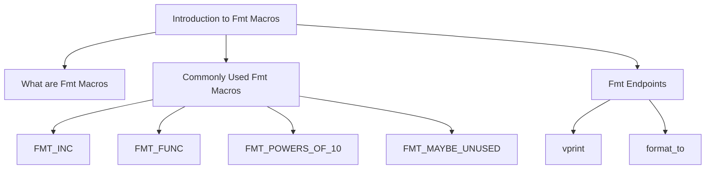

# What are Fmt Macros

Fmt refers to a collection of macros and utilities used for formatting purposes. These macros provide various functionalities such as incrementing values, defining inline functions, generating powers of ten, and marking variables or functions as potentially unused.

# Commonly Used Fmt Macros

Here are some of the most commonly used Fmt macros and their purposes:

<SwmSnippet path="/src/3rdparty/fmt/format.h" line="1216">

---

## <SwmToken path="src/3rdparty/fmt/format.h" pos="1218:4:4" line-data="#  define FMT_INC(T) (((sizeof(#T) - 1ull) &lt;&lt; 32) - T)">`FMT_INC`</SwmToken>

The macro <SwmToken path="src/3rdparty/fmt/format.h" pos="1218:4:4" line-data="#  define FMT_INC(T) (((sizeof(#T) - 1ull) &lt;&lt; 32) - T)">`FMT_INC`</SwmToken> is used for incrementing the upper 32 bits when a value greater than or equal to a specified threshold is added. This optimization was introduced by Kendall Willets.

```c
// An optimization by Kendall Willets from https://bit.ly/3uOIQrB.
// This increments the upper 32 bits (log10(T) - 1) when >= T is added.
#  define FMT_INC(T) (((sizeof(#T) - 1ull) << 32) - T)
  static constexpr uint64_t table[] = {
      FMT_INC(0),          FMT_INC(0),          FMT_INC(0),           // 8
```

---

</SwmSnippet>

<SwmSnippet path="/src/3rdparty/fmt/format.h" line="4527">

---

## <SwmToken path="src/3rdparty/fmt/format.h" pos="4528:4:4" line-data="#  define FMT_FUNC inline">`FMT_FUNC`</SwmToken>

The macro <SwmToken path="src/3rdparty/fmt/format.h" pos="4528:4:4" line-data="#  define FMT_FUNC inline">`FMT_FUNC`</SwmToken> is used to define functions as inline when the <SwmToken path="src/3rdparty/fmt/format.h" pos="4527:3:3" line-data="#ifdef FMT_HEADER_ONLY">`FMT_HEADER_ONLY`</SwmToken> flag is set. This helps in optimizing the function calls by reducing the overhead.

```c
#ifdef FMT_HEADER_ONLY
#  define FMT_FUNC inline
#  include "format-inl.h"
#else
```

---

</SwmSnippet>

<SwmSnippet path="/src/3rdparty/fmt/format.h" line="1120">

---

## <SwmToken path="src/3rdparty/fmt/format.h" pos="1120:3:3" line-data="#define FMT_POWERS_OF_10(factor)                                  \">`FMT_POWERS_OF_10`</SwmToken>

The macro <SwmToken path="src/3rdparty/fmt/format.h" pos="1120:3:3" line-data="#define FMT_POWERS_OF_10(factor)                                  \">`FMT_POWERS_OF_10`</SwmToken> generates a series of powers of ten, which can be used for various calculations. This is particularly useful in formatting operations that require scaling by powers of ten.

```c
#define FMT_POWERS_OF_10(factor)                                  \
  factor * 10, (factor) * 100, (factor) * 1000, (factor) * 10000, \
      (factor) * 100000, (factor) * 1000000, (factor) * 10000000, \
```

---

</SwmSnippet>

<SwmSnippet path="/src/3rdparty/fmt/format.h" line="146">

---

## <SwmToken path="src/3rdparty/fmt/format.h" pos="146:3:3" line-data="#ifndef FMT_MAYBE_UNUSED">`FMT_MAYBE_UNUSED`</SwmToken>

The macro <SwmToken path="src/3rdparty/fmt/format.h" pos="146:3:3" line-data="#ifndef FMT_MAYBE_UNUSED">`FMT_MAYBE_UNUSED`</SwmToken> is used to mark variables or functions as potentially unused, depending on the availability of the <SwmToken path="src/3rdparty/fmt/format.h" pos="147:6:6" line-data="#  if FMT_HAS_CPP17_ATTRIBUTE(maybe_unused)">`maybe_unused`</SwmToken> attribute in <SwmToken path="src/3rdparty/fmt/format.h" pos="514:24:26" line-data="// A workaround for std::string not having mutable data() until C++17.">`C++17`</SwmToken>. This helps in avoiding compiler warnings for unused variables or functions.

```c
#ifndef FMT_MAYBE_UNUSED
#  if FMT_HAS_CPP17_ATTRIBUTE(maybe_unused)
#    define FMT_MAYBE_UNUSED [[maybe_unused]]
#  else
#    define FMT_MAYBE_UNUSED
```

---

</SwmSnippet>

# Fmt Endpoints

Fmt provides several endpoints for formatting and printing operations. Two of the main functions are <SwmToken path="src/3rdparty/fmt/format-inl.h" pos="1470:4:4" line-data="FMT_FUNC void vprint(std::FILE* f, string_view fmt, format_args args) {">`vprint`</SwmToken> and <SwmToken path="src/3rdparty/fmt/core.h" pos="2846:5:5" line-data=" range. `format_to` does not append a terminating null character.">`format_to`</SwmToken>.

<SwmSnippet path="/src/3rdparty/fmt/format-inl.h" line="1470">

---

## vprint

The <SwmToken path="src/3rdparty/fmt/format-inl.h" pos="1470:4:4" line-data="FMT_FUNC void vprint(std::FILE* f, string_view fmt, format_args args) {">`vprint`</SwmToken> function formats arguments according to a format string and writes the result to a specified file or standard output. It uses the <SwmToken path="src/3rdparty/fmt/format-inl.h" pos="1472:3:3" line-data="  detail::vformat_to(buffer, fmt, args);">`vformat_to`</SwmToken> function to format the arguments and then calls the <SwmToken path="src/3rdparty/fmt/format-inl.h" pos="1473:3:3" line-data="  detail::print(f, {buffer.data(), buffer.size()});">`print`</SwmToken> function to write the formatted string.

```c
FMT_FUNC void vprint(std::FILE* f, string_view fmt, format_args args) {
  auto buffer = memory_buffer();
  detail::vformat_to(buffer, fmt, args);
  detail::print(f, {buffer.data(), buffer.size()});
}

FMT_FUNC void vprint(string_view fmt, format_args args) {
  vprint(stdout, fmt, args);
}
```

---

</SwmSnippet>

<SwmSnippet path="/src/3rdparty/fmt/core.h" line="2842">

---

## <SwmToken path="src/3rdparty/fmt/core.h" pos="2846:5:5" line-data=" range. `format_to` does not append a terminating null character.">`format_to`</SwmToken>

The <SwmToken path="src/3rdparty/fmt/core.h" pos="2846:5:5" line-data=" range. `format_to` does not append a terminating null character.">`format_to`</SwmToken> function formats arguments according to a format string and writes the result to an output iterator. It uses the <SwmToken path="src/3rdparty/fmt/core.h" pos="2858:3:3" line-data="  return vformat_to(out, fmt, fmt::make_format_args(args...));">`vformat_to`</SwmToken> function to perform the formatting and returns the iterator past the end of the output range.

```c
/**
 \rst
 Formats ``args`` according to specifications in ``fmt``, writes the result to
 the output iterator ``out`` and returns the iterator past the end of the output
 range. `format_to` does not append a terminating null character.

 **Example**::

   auto out = std::vector<char>();
   fmt::format_to(std::back_inserter(out), "{}", 42);
 \endrst
 */
template <typename OutputIt, typename... T,
          FMT_ENABLE_IF(detail::is_output_iterator<OutputIt, char>::value)>
FMT_INLINE auto format_to(OutputIt out, format_string<T...> fmt, T&&... args)
    -> OutputIt {
  return vformat_to(out, fmt, fmt::make_format_args(args...));
}
```

---

</SwmSnippet>

&nbsp;

*This is an auto-generated document by Swimm AI 🌊 and has not yet been verified by a human*

<SwmMeta version="3.0.0" repo-id="Z2l0aHViJTNBJTNBT3BlblRURC1jb3BpbG90LWRlbW8lM0ElM0Fzd2ltbWlv" repo-name="OpenTTD-copilot-demo"><sup>Powered by [Swimm](/)</sup></SwmMeta>
