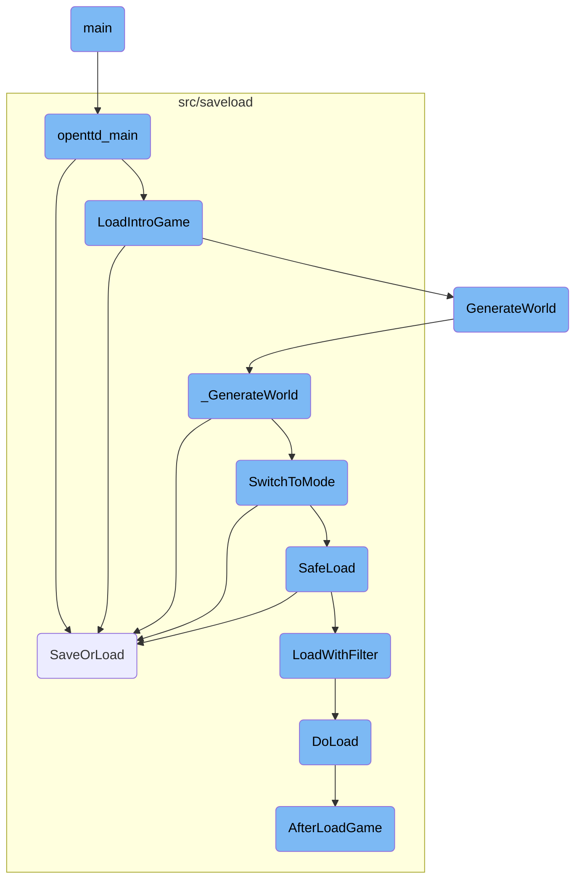
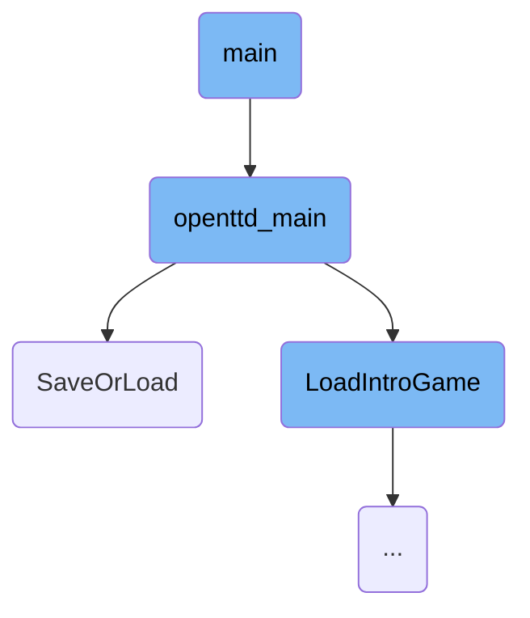
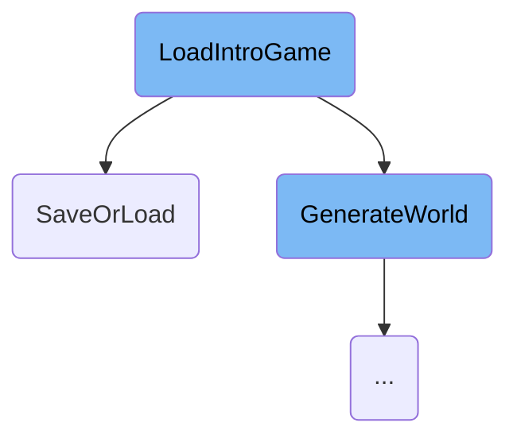
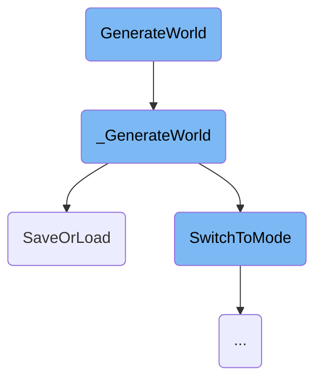
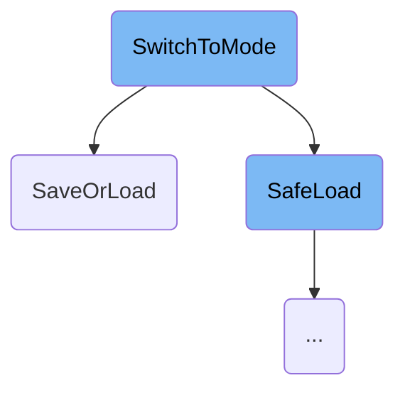
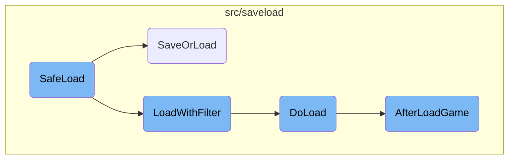

This document provides an overview of the main flow in the <SwmToken path="src/openttd.cpp" pos="779:29:29" line-data="			UserError(&quot;Failed to find a sounds set. Please acquire a sounds set for OpenTTD. See section 1.4 of README.md.&quot;);">`OpenTTD`</SwmToken> game. It covers the essential steps from handling command line arguments to initializing game settings, setting up the main window, loading the default opening screen, and finalizing the setup.

The main flow in <SwmToken path="src/openttd.cpp" pos="779:29:29" line-data="			UserError(&quot;Failed to find a sounds set. Please acquire a sounds set for OpenTTD. See section 1.4 of README.md.&quot;);">`OpenTTD`</SwmToken> starts with handling command line arguments to set various game options like graphics, sound, and resolution. Next, it initializes game settings, including paths, graphics, sound, music, and video drivers. The main window system is then reset, and the initial window and colors are set up. The game attempts to load the default opening screen; if it fails, an empty world is generated. Finally, the game zoom is fixed, the game is unpaused, the cursor is reset, missing glyphs are checked, and the music loop is started to ensure the correct background music is played.

Here is a high level diagram of the flow, showing only the most important functions:



# Flow drill down

First, we'll zoom into this section of the flow:



<SwmSnippet path="/src/openttd.cpp" line="532">

---

## Handling Command Line Arguments

The code iterates over the command line arguments to set various game options such as graphics set, sound set, music set, and resolution. It also handles special modes like dedicated server mode and editor mode.

```c++
	while ((i = mgo.GetOpt()) != -1) {
		switch (i) {
		case 'I': graphics_set = mgo.opt; break;
		case 'S': sounds_set = mgo.opt; break;
		case 'M': music_set = mgo.opt; break;
		case 'm': musicdriver = mgo.opt; break;
		case 's': sounddriver = mgo.opt; break;
		case 'v': videodriver = mgo.opt; break;
		case 'b': blitter = mgo.opt; break;
		case 'D':
			musicdriver = "null";
			sounddriver = "null";
			videodriver = "dedicated";
			blitter = "null";
			dedicated = true;
			SetDebugString("net=4", ShowInfoI);
			if (mgo.opt != nullptr) {
				scanner->dedicated_host = ParseFullConnectionString(mgo.opt, scanner->dedicated_port);
			}
			break;
		case 'f': _dedicated_forks = true; break;
```

---

</SwmSnippet>

<SwmSnippet path="/src/openttd.cpp" line="664">

---

## Initializing Game Settings

This section initializes various game settings including paths, graphics, sound, music, and video drivers. It also sets up the language packs, font cache, and window system, ensuring the game is ready to start.

```c++
	DeterminePaths(arguments[0], only_local_path);
	TarScanner::DoScan(TarScanner::BASESET);

	if (dedicated) Debug(net, 3, "Starting dedicated server, version {}", _openttd_revision);
	if (_dedicated_forks && !dedicated) _dedicated_forks = false;

#if defined(UNIX)
	/* We must fork here, or we'll end up without some resources we need (like sockets) */
	if (_dedicated_forks) DedicatedFork();
#endif

	LoadFromConfig(true);

	if (resolution.width != 0) _cur_resolution = resolution;

	/* Limit width times height times bytes per pixel to fit a 32 bit
	 * integer, This way all internal drawing routines work correctly.
	 * A resolution that has one component as 0 is treated as a marker to
	 * auto-detect a good window size. */
	_cur_resolution.width  = std::min(_cur_resolution.width, UINT16_MAX / 2u);
	_cur_resolution.height = std::min(_cur_resolution.height, UINT16_MAX / 2u);
```

---

</SwmSnippet>

<SwmSnippet path="/src/openttd.cpp" line="703">

---

### Setting Graphics Set

The code checks if a specific graphics set is provided and attempts to load it. If the graphics set is invalid, it schedules an error message to inform the user.

```c++
	if (!graphics_set.empty()) {
		valid_graphics_set = BaseGraphics::SetSetByName(graphics_set);
	} else if (BaseGraphics::ini_data.shortname != 0) {
		graphics_set = BaseGraphics::ini_data.name;
		valid_graphics_set = BaseGraphics::SetSetByShortname(BaseGraphics::ini_data.shortname);
		if (valid_graphics_set && !BaseGraphics::ini_data.extra_params.empty()) {
			GRFConfig &extra_cfg = BaseGraphics::GetUsedSet()->GetOrCreateExtraConfig();
			if (extra_cfg.IsCompatible(BaseGraphics::ini_data.extra_version)) {
				extra_cfg.SetParams(BaseGraphics::ini_data.extra_params);
			}
		}
	} else if (!BaseGraphics::ini_data.name.empty()) {
		graphics_set = BaseGraphics::ini_data.name;
		valid_graphics_set = BaseGraphics::SetSetByName(BaseGraphics::ini_data.name);
	} else {
		valid_graphics_set = true;
		BaseGraphics::SetSet(nullptr); // ignore error, continue to bootstrap GUI
	}
	if (!valid_graphics_set) {
		BaseGraphics::SetSet(nullptr);

```

---

</SwmSnippet>

<SwmSnippet path="/src/openttd.cpp" line="751">

---

### Selecting Video Driver

The code selects the appropriate video driver based on the provided or default settings, ensuring the game can render graphics correctly.

```c++
	if (videodriver.empty() && !_ini_videodriver.empty()) videodriver = _ini_videodriver;
	DriverFactoryBase::SelectDriver(videodriver, Driver::DT_VIDEO);

```

---

</SwmSnippet>

<SwmSnippet path="/src/openttd.cpp" line="775">

---

### Initializing Sound and Music Sets

The code initializes the sound and music sets, ensuring the game has the necessary audio resources. If the sets are not found, it schedules error messages to inform the user.

```c++
	BaseSounds::FindSets();
	if (sounds_set.empty() && !BaseSounds::ini_set.empty()) sounds_set = BaseSounds::ini_set;
	if (!BaseSounds::SetSetByName(sounds_set)) {
		if (sounds_set.empty() || !BaseSounds::SetSet({})) {
			UserError("Failed to find a sounds set. Please acquire a sounds set for OpenTTD. See section 1.4 of README.md.");
		} else {
			ErrorMessageData msg(STR_CONFIG_ERROR, STR_CONFIG_ERROR_INVALID_BASE_SOUNDS_NOT_FOUND);
			msg.SetDParamStr(0, sounds_set);
			ScheduleErrorMessage(msg);
		}
	}

	BaseMusic::FindSets();
	if (music_set.empty() && !BaseMusic::ini_set.empty()) music_set = BaseMusic::ini_set;
	if (!BaseMusic::SetSetByName(music_set)) {
		if (music_set.empty() || !BaseMusic::SetSet({})) {
			UserError("Failed to find a music set. Please acquire a music set for OpenTTD. See section 1.4 of README.md.");
		} else {
			ErrorMessageData msg(STR_CONFIG_ERROR, STR_CONFIG_ERROR_INVALID_BASE_MUSIC_NOT_FOUND);
			msg.SetDParamStr(0, music_set);
			ScheduleErrorMessage(msg);
```

---

</SwmSnippet>

Now, lets zoom into this section of the flow:



<SwmSnippet path="/src/openttd.cpp" line="317">

---

## Setting Game Mode

The game mode is set to <SwmToken path="src/openttd.cpp" pos="317:5:5" line-data="	_game_mode = GM_MENU;">`GM_MENU`</SwmToken>, which initializes the game in menu mode, preparing it for user interaction.

```c++
	_game_mode = GM_MENU;
```

---

</SwmSnippet>

<SwmSnippet path="/src/openttd.cpp" line="319">

---

## Resetting Configurations

If <SwmToken path="src/openttd.cpp" pos="319:4:4" line-data="	if (load_newgrfs) ResetGRFConfig(false);">`load_newgrfs`</SwmToken> is true, the function <SwmToken path="src/openttd.cpp" pos="319:7:7" line-data="	if (load_newgrfs) ResetGRFConfig(false);">`ResetGRFConfig`</SwmToken> is called to reset the game's GRF configurations, ensuring that the game starts with the correct settings.

```c++
	if (load_newgrfs) ResetGRFConfig(false);
```

---

</SwmSnippet>

<SwmSnippet path="/src/openttd.cpp" line="322">

---

## Setting Up the Main Window

The main window system is reset and the initial window and colors are set up using <SwmToken path="src/openttd.cpp" pos="322:1:1" line-data="	ResetWindowSystem();">`ResetWindowSystem`</SwmToken> and <SwmToken path="src/openttd.cpp" pos="323:1:1" line-data="	SetupColoursAndInitialWindow();">`SetupColoursAndInitialWindow`</SwmToken>, respectively. This prepares the game's user interface.

```c++
	ResetWindowSystem();
	SetupColoursAndInitialWindow();
```

---

</SwmSnippet>

<SwmSnippet path="/src/openttd.cpp" line="326">

---

## Loading the Default Opening Screen

The function attempts to load the default opening screen savegame <SwmPath>[media/baseset/opntitle.dat](media/baseset/opntitle.dat)</SwmPath>. If loading fails, an empty world is generated with <SwmToken path="src/openttd.cpp" pos="327:1:1" line-data="		GenerateWorld(GWM_EMPTY, 64, 64); // if failed loading, make empty world.">`GenerateWorld`</SwmToken>, and the local company is set to <SwmToken path="src/openttd.cpp" pos="328:3:3" line-data="		SetLocalCompany(COMPANY_SPECTATOR);">`COMPANY_SPECTATOR`</SwmToken>. If loading succeeds, the local company is set to <SwmToken path="src/openttd.cpp" pos="330:3:3" line-data="		SetLocalCompany(COMPANY_FIRST);">`COMPANY_FIRST`</SwmToken>.

```c++
	if (SaveOrLoad("opntitle.dat", SLO_LOAD, DFT_GAME_FILE, BASESET_DIR) != SL_OK) {
		GenerateWorld(GWM_EMPTY, 64, 64); // if failed loading, make empty world.
		SetLocalCompany(COMPANY_SPECTATOR);
	} else {
		SetLocalCompany(COMPANY_FIRST);
	}
```

---

</SwmSnippet>

<SwmSnippet path="/src/openttd.cpp" line="333">

---

## Finalizing Setup

The game zoom is fixed with <SwmToken path="src/openttd.cpp" pos="333:1:1" line-data="	FixTitleGameZoom();">`FixTitleGameZoom`</SwmToken>, the game is unpaused, the cursor is reset, missing glyphs are checked, and the music loop is started to ensure the correct background music is played.

```c++
	FixTitleGameZoom();
	_pause_mode = PM_UNPAUSED;
	_cursor.fix_at = false;

	CheckForMissingGlyphs();

	MusicLoop(); // ensure music is correct
```

---

</SwmSnippet>

Now, lets zoom into this section of the flow:



<SwmSnippet path="/src/genworld.cpp" line="282">

---

## Setting Up World Generation Parameters

The function <SwmToken path="src/genworld.cpp" pos="282:2:2" line-data="void GenerateWorld(GenWorldMode mode, uint size_x, uint size_y, bool reset_settings)">`GenerateWorld`</SwmToken> begins by checking if there is an ongoing modal progress. If not, it sets the world generation mode, map size, and initializes the modal progress.

```c++
void GenerateWorld(GenWorldMode mode, uint size_x, uint size_y, bool reset_settings)
{
	if (HasModalProgress()) return;
	_gw.mode   = mode;
	_gw.size_x = size_x;
	_gw.size_y = size_y;
	SetModalProgress(true);
```

---

</SwmSnippet>

<SwmSnippet path="/src/genworld.cpp" line="296">

---

## Initializing the Game Environment

The function then initializes the game environment by calling <SwmToken path="src/genworld.cpp" pos="296:1:1" line-data="	InitializeGame(_gw.size_x, _gw.size_y, true, reset_settings);">`InitializeGame`</SwmToken>, preparing the world generation progress, loading necessary graphics, and setting up the window system.

```c++
	InitializeGame(_gw.size_x, _gw.size_y, true, reset_settings);
	PrepareGenerateWorldProgress();

	if (_settings_game.construction.map_height_limit == 0) {
		uint estimated_height = 0;

		if (_gw.mode == GWM_EMPTY && _game_mode != GM_MENU) {
			estimated_height = _settings_game.game_creation.se_flat_world_height;
		} else if (_gw.mode == GWM_HEIGHTMAP) {
			estimated_height = _settings_game.game_creation.heightmap_height;
		} else if (_settings_game.game_creation.land_generator == LG_TERRAGENESIS) {
			estimated_height = GetEstimationTGPMapHeight();
		} else {
			estimated_height = 0;
		}

		_settings_game.construction.map_height_limit = std::max(MAP_HEIGHT_LIMIT_AUTO_MINIMUM, std::min(MAX_MAP_HEIGHT_LIMIT, estimated_height + MAP_HEIGHT_LIMIT_AUTO_CEILING_ROOM));
	}

	if (_settings_game.game_creation.generation_seed == GENERATE_NEW_SEED) _settings_game.game_creation.generation_seed = InteractiveRandom();

```

---

</SwmSnippet>

<SwmSnippet path="/src/genworld.cpp" line="336">

---

## Generating the World

Finally, the function centers the view on the map and calls <SwmToken path="src/genworld.cpp" pos="338:1:1" line-data="	_GenerateWorld();">`_GenerateWorld`</SwmToken> to start the actual world generation process.

```c++
	ScrollMainWindowToTile(TileXY(Map::SizeX() / 2, Map::SizeY() / 2), true);

	_GenerateWorld();
}
```

---

</SwmSnippet>

<SwmSnippet path="/src/genworld.cpp" line="87">

---

### Internal World Generation

The <SwmToken path="src/genworld.cpp" pos="87:4:4" line-data="static void _GenerateWorld()">`_GenerateWorld`</SwmToken> function sets the random seed for the world generation and initializes the randomizers. It also switches the persistent storage mode to enter the game loop.

```c++
static void _GenerateWorld()
{
	/* Make sure everything is done via OWNER_NONE. */
	Backup<CompanyID> _cur_company(_current_company, OWNER_NONE);

	try {
		_generating_world = true;
		if (_network_dedicated) Debug(net, 3, "Generating map, please wait...");
```

---

</SwmSnippet>

<SwmSnippet path="/src/genworld.cpp" line="105">

---

### Generating Landscape and Economy

The function starts the economy and checks the town road types. If the mode is not empty, it generates the landscape and ensures the map height is set correctly.

```c++
		StartupEconomy();
		if (!CheckTownRoadTypes()) {
			HandleGeneratingWorldAbortion();
			return;
		}

		bool landscape_generated = false;
```

---

</SwmSnippet>

<SwmSnippet path="/src/genworld.cpp" line="148">

---

### Finalizing World Generation

The function finalizes the world generation by starting up companies, engines, and disasters. It also runs the tile loop and game loop to ensure the world is fully generated.

```c++

		/* These are probably pointless when inside the scenario editor. */
		SetGeneratingWorldProgress(GWP_GAME_INIT, 3);
		StartupCompanies();
		IncreaseGeneratingWorldProgress(GWP_GAME_INIT);
		StartupEngines();
		IncreaseGeneratingWorldProgress(GWP_GAME_INIT);
		StartupDisasters();
		_generating_world = false;
```

---

</SwmSnippet>

Now, lets zoom into this section of the flow:



<SwmSnippet path="/src/openttd.cpp" line="1066">

---

## Handling Different Game Modes

The <SwmToken path="src/openttd.cpp" pos="1078:1:1" line-data="				SwitchToMode(_switch_mode);">`SwitchToMode`</SwmToken> function handles the transition between different game modes such as scenario editor, loading a game, starting a new game, and joining a multiplayer game. Each case within the switch statement ensures that the game state is correctly set up for the new mode. For example, when switching to the scenario editor mode (<SwmToken path="src/openttd.cpp" pos="1067:3:3" line-data="		case SM_EDITOR: // Switch to scenario editor">`SM_EDITOR`</SwmToken>), it calls <SwmToken path="src/openttd.cpp" pos="1068:1:1" line-data="			MakeNewEditorWorld();">`MakeNewEditorWorld`</SwmToken> to set up a new editor world and updates the social integration status to <SwmToken path="src/openttd.cpp" pos="1071:3:3" line-data="			UpdateSocialIntegration(GM_EDITOR);">`GM_EDITOR`</SwmToken>.

```c++
	switch (new_mode) {
		case SM_EDITOR: // Switch to scenario editor
			MakeNewEditorWorld();
			GenerateSavegameId();

			UpdateSocialIntegration(GM_EDITOR);
			break;

		case SM_RELOADGAME: // Reload with what-ever started the game
			if (_file_to_saveload.abstract_ftype == FT_SAVEGAME || _file_to_saveload.abstract_ftype == FT_SCENARIO) {
				/* Reload current savegame/scenario */
				_switch_mode = _game_mode == GM_EDITOR ? SM_LOAD_SCENARIO : SM_LOAD_GAME;
				SwitchToMode(_switch_mode);
				break;
			} else if (_file_to_saveload.abstract_ftype == FT_HEIGHTMAP) {
				/* Restart current heightmap */
				_switch_mode = _game_mode == GM_EDITOR ? SM_LOAD_HEIGHTMAP : SM_RESTART_HEIGHTMAP;
				SwitchToMode(_switch_mode);
				break;
			}

```

---

</SwmSnippet>

<SwmSnippet path="/src/openttd.cpp" line="1022">

---

## Managing Network States

The function also manages the network state during mode transitions. If the new mode is not <SwmToken path="src/openttd.cpp" pos="1023:8:8" line-data="	if (new_mode != SM_SAVE_GAME) {">`SM_SAVE_GAME`</SwmToken>, it checks if the network is active and either reboots or disconnects the network based on the new mode. Additionally, if the current instance is a network server, it decides whether to restart the server or stop being a network server based on the new mode.

```c++
	/* If we are saving something, the network stays in its current state */
	if (new_mode != SM_SAVE_GAME) {
		/* If the network is active, make it not-active */
		if (_networking) {
			if (_network_server && (new_mode == SM_LOAD_GAME || new_mode == SM_NEWGAME || new_mode == SM_RESTARTGAME)) {
				NetworkReboot();
			} else {
				NetworkDisconnect();
			}
		}

		/* If we are a server, we restart the server */
		if (_is_network_server) {
			/* But not if we are going to the menu */
			if (new_mode != SM_MENU) {
				/* check if we should reload the config */
				if (_settings_client.network.reload_cfg) {
					LoadFromConfig();
					MakeNewgameSettingsLive();
					ResetGRFConfig(false);
				}
```

---

</SwmSnippet>

<SwmSnippet path="/src/openttd.cpp" line="1051">

---

## Resetting Game State

The function ensures that certain game states are reset when switching modes. For instance, it kills all AI controllers, resets the autosave frequency, and transmits a survey if leaving the current game. These steps ensure that the game state is clean and ready for the new mode.

```c++
	/* Make sure all AI controllers are gone at quitting game */
	if (new_mode != SM_SAVE_GAME) AI::KillAll();

	/* When we change mode, reset the autosave. */
	if (new_mode != SM_SAVE_GAME) ChangeAutosaveFrequency(true);

	/* Transmit the survey if we were in normal-mode and not saving. It always means we leaving the current game. */
	if (_game_mode == GM_NORMAL && new_mode != SM_SAVE_GAME) _survey.Transmit(NetworkSurveyHandler::Reason::LEAVE);

	/* Keep track when we last switch mode. Used for survey, to know how long someone was in a game. */
	if (new_mode != SM_SAVE_GAME) {
		_game_session_stats.start_time = std::chrono::steady_clock::now();
		_game_session_stats.savegame_size = std::nullopt;
	}

```

---

</SwmSnippet>

Now, lets zoom into this section of the flow:



<SwmSnippet path="/src/openttd.cpp" line="933">

---

## <SwmToken path="src/openttd.cpp" pos="943:2:2" line-data="bool SafeLoad(const std::string &amp;filename, SaveLoadOperation fop, DetailedFileType dft, GameMode newgm, Subdirectory subdir, std::shared_ptr&lt;LoadFilter&gt; lf = nullptr)">`SafeLoad`</SwmToken>

The <SwmToken path="src/openttd.cpp" pos="943:2:2" line-data="bool SafeLoad(const std::string &amp;filename, SaveLoadOperation fop, DetailedFileType dft, GameMode newgm, Subdirectory subdir, std::shared_ptr&lt;LoadFilter&gt; lf = nullptr)">`SafeLoad`</SwmToken> function attempts to load a specified savegame file. If the loading fails due to issues like a corrupt savegame or an incompatible version, it reverts to a previous correct state. For example, if the game was in the menu, it reloads the intro game. This ensures that the game does not crash or end up in an inconsistent state, providing a better user experience.

```c++
/**
 * Load the specified savegame but on error do different things.
 * If loading fails due to corrupt savegame, bad version, etc. go back to
 * a previous correct state. In the menu for example load the intro game again.
 * @param filename file to be loaded
 * @param fop mode of loading, always SLO_LOAD
 * @param newgm switch to this mode of loading fails due to some unknown error
 * @param subdir default directory to look for filename, set to 0 if not needed
 * @param lf Load filter to use, if nullptr: use filename + subdir.
 */
bool SafeLoad(const std::string &filename, SaveLoadOperation fop, DetailedFileType dft, GameMode newgm, Subdirectory subdir, std::shared_ptr<LoadFilter> lf = nullptr)
{
	assert(fop == SLO_LOAD);
	assert(dft == DFT_GAME_FILE || (lf == nullptr && dft == DFT_OLD_GAME_FILE));
	GameMode ogm = _game_mode;

	_game_mode = newgm;

	SaveOrLoadResult result = (lf == nullptr) ? SaveOrLoad(filename, fop, dft, subdir) : LoadWithFilter(lf);
	if (result == SL_OK) return true;

```

---

</SwmSnippet>

<SwmSnippet path="/src/saveload/saveload.cpp" line="3046">

---

## <SwmToken path="src/saveload/saveload.cpp" pos="3051:2:2" line-data="SaveOrLoadResult LoadWithFilter(std::shared_ptr&lt;LoadFilter&gt; reader)">`LoadWithFilter`</SwmToken>

The <SwmToken path="src/saveload/saveload.cpp" pos="3051:2:2" line-data="SaveOrLoadResult LoadWithFilter(std::shared_ptr&lt;LoadFilter&gt; reader)">`LoadWithFilter`</SwmToken> function loads the game using a specified filter. It sets the action to load and calls <SwmToken path="src/saveload/saveload.cpp" pos="3055:3:3" line-data="		return DoLoad(reader, false);">`DoLoad`</SwmToken> to perform the actual loading. If an error occurs during loading, it clears the <SwmToken path="src/saveload/saveload.cpp" pos="323:18:20" line-data="	/* Distinguish between loading into _load_check_data vs. normal save/load. */">`save/load`</SwmToken> state and returns a reinitialization signal. This function is crucial for handling different types of savegame files and ensuring they are loaded correctly.

```c++
/**
 * Load the game using a (reader) filter.
 * @param reader   The filter to read the savegame from.
 * @return Return the result of the action. #SL_OK or #SL_REINIT ("unload" the game)
 */
SaveOrLoadResult LoadWithFilter(std::shared_ptr<LoadFilter> reader)
{
	try {
		_sl.action = SLA_LOAD;
		return DoLoad(reader, false);
	} catch (...) {
		ClearSaveLoadState();
		return SL_REINIT;
	}
}
```

---

</SwmSnippet>

<SwmSnippet path="/src/saveload/saveload.cpp" line="2945">

---

## <SwmToken path="src/saveload/saveload.cpp" pos="2951:4:4" line-data="static SaveOrLoadResult DoLoad(std::shared_ptr&lt;LoadFilter&gt; reader, bool load_check)">`DoLoad`</SwmToken>

The <SwmToken path="src/saveload/saveload.cpp" pos="2951:4:4" line-data="static SaveOrLoadResult DoLoad(std::shared_ptr&lt;LoadFilter&gt; reader, bool load_check)">`DoLoad`</SwmToken> function performs the actual loading of a savegame. It reads the savegame header, determines the appropriate format, and initializes the game state accordingly. If the savegame version is old, it performs necessary conversions to ensure compatibility. After loading, it fixes any internal references and checks for errors. If any issues are detected, it signals for reinitialization. This function is essential for maintaining the integrity of the game state during loading.

```c++
/**
 * Actually perform the loading of a "non-old" savegame.
 * @param reader     The filter to read the savegame from.
 * @param load_check Whether to perform the checking ("preview") or actually load the game.
 * @return Return the result of the action. #SL_OK or #SL_REINIT ("unload" the game)
 */
static SaveOrLoadResult DoLoad(std::shared_ptr<LoadFilter> reader, bool load_check)
{
	_sl.lf = reader;

	if (load_check) {
		/* Clear previous check data */
		_load_check_data.Clear();
		/* Mark SL_LOAD_CHECK as supported for this savegame. */
		_load_check_data.checkable = true;
	}

	uint32_t hdr[2];
	if (_sl.lf->Read((uint8_t*)hdr, sizeof(hdr)) != sizeof(hdr)) SlError(STR_GAME_SAVELOAD_ERROR_FILE_NOT_READABLE);

	/* see if we have any loader for this type. */
```

---

</SwmSnippet>

<SwmSnippet path="/src/saveload/afterload.cpp" line="559">

---

## <SwmToken path="src/saveload/afterload.cpp" pos="564:2:2" line-data="bool AfterLoadGame()">`AfterLoadGame`</SwmToken>

The <SwmToken path="src/saveload/afterload.cpp" pos="564:2:2" line-data="bool AfterLoadGame()">`AfterLoadGame`</SwmToken> function performs various conversions and checks after a savegame is loaded. It updates old savegame formats, rebuilds internal data structures, and ensures all game elements are correctly initialized. This function is vital for ensuring that older savegames are compatible with the current game version and that the game state is consistent after loading.

```c++
/**
 * Perform a (large) amount of savegame conversion *magic* in order to
 * load older savegames and to fill the caches for various purposes.
 * @return True iff conversion went without a problem.
 */
bool AfterLoadGame()
{
	SetSignalHandlers();

	extern TileIndex _cur_tileloop_tile; // From landscape.cpp.
	/* The LFSR used in RunTileLoop iteration cannot have a zeroed state, make it non-zeroed. */
	if (_cur_tileloop_tile == 0) _cur_tileloop_tile = 1;

	if (IsSavegameVersionBefore(SLV_98)) _gamelog.Oldver();

	_gamelog.TestRevision();
	_gamelog.TestMode();

	RebuildTownKdtree();
	RebuildStationKdtree();
	/* This needs to be done even before conversion, because some conversions will destroy objects
```

---

</SwmSnippet>

&nbsp;

*This is an auto-generated document by Swimm AI 🌊 and has not yet been verified by a human*

<SwmMeta version="3.0.0" repo-id="Z2l0aHViJTNBJTNBT3BlblRURC1jb3BpbG90LWRlbW8lM0ElM0Fzd2ltbWlv" repo-name="OpenTTD-copilot-demo"><sup>Powered by [Swimm](/)</sup></SwmMeta>
