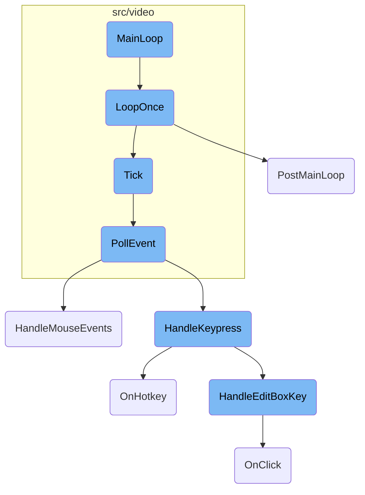
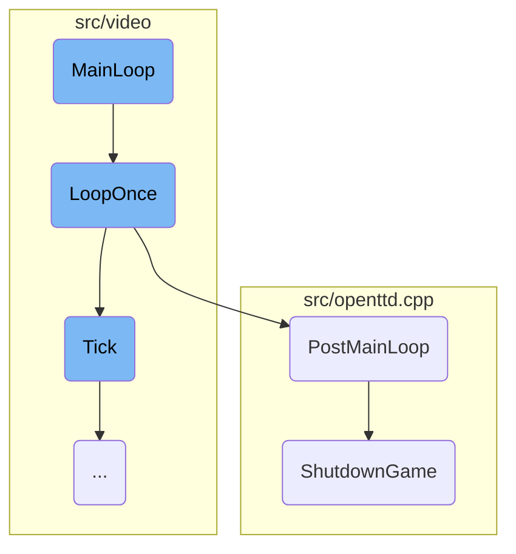
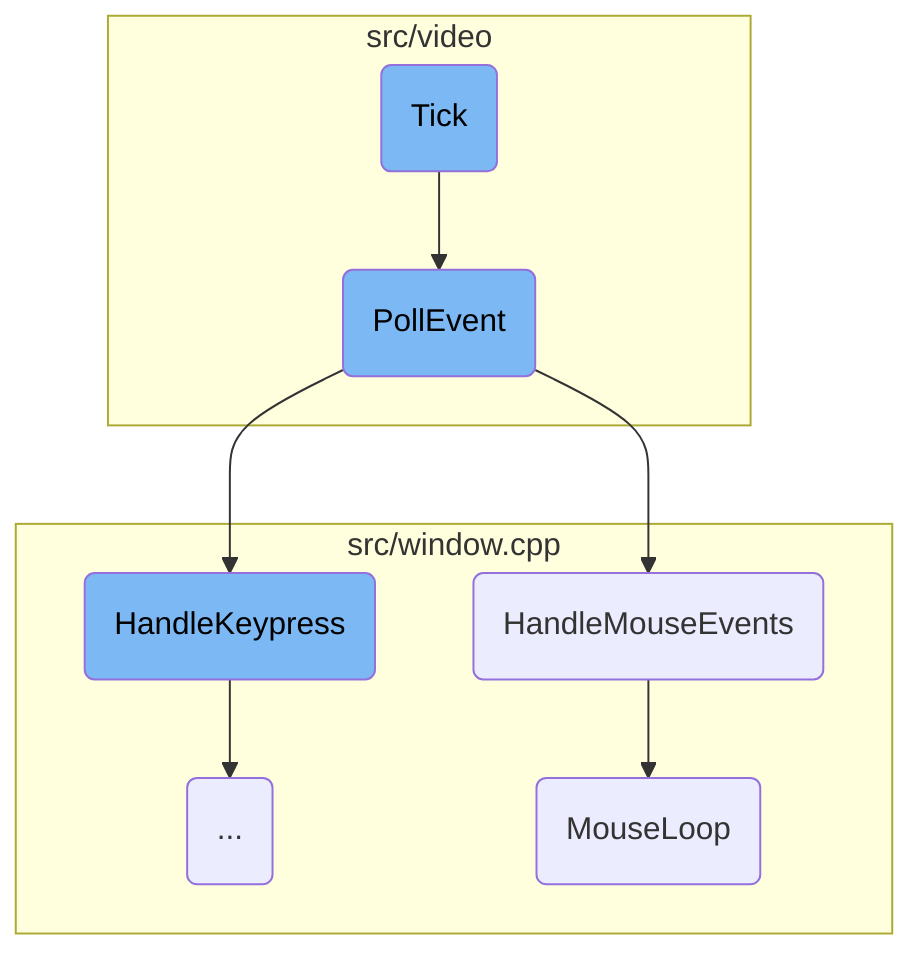
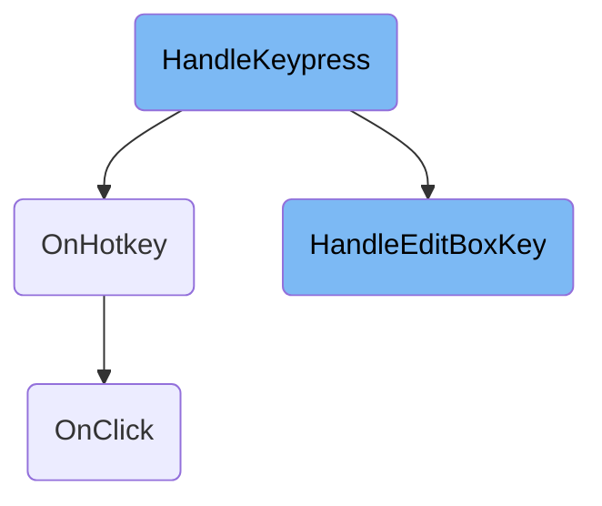

This document explains the main game loop, which is crucial for maintaining the continuous operation of the game. The main loop starts the game thread and repeatedly calls functions to process game events, update the game state, and handle user inputs until the game is set to exit.

The main game loop starts by initializing the game thread. It then enters a continuous cycle where it calls functions to handle one iteration of the game loop. During each iteration, it checks if the game should exit, processes a game tick, and manages timing for the next iteration. If the game is exiting, it performs cleanup tasks to save data and free resources.

Here is a high level diagram of the flow, showing only the most important functions:



# Flow drill down

First, we'll zoom into this section of the flow:



<SwmSnippet path="/src/video/sdl2_v.cpp" line="655">

---

## <SwmToken path="src/video/sdl2_v.cpp" pos="655:4:4" line-data="void VideoDriver_SDL_Base::MainLoop()">`MainLoop`</SwmToken>

The <SwmToken path="src/video/sdl2_v.cpp" pos="655:4:4" line-data="void VideoDriver_SDL_Base::MainLoop()">`MainLoop`</SwmToken> function is responsible for starting and maintaining the main game loop. It starts the game thread and continuously calls <SwmToken path="src/video/sdl2_v.cpp" pos="664:1:1" line-data="		LoopOnce();">`LoopOnce`</SwmToken> until the game is set to exit. This ensures that the game keeps running and processing events.

```c++
void VideoDriver_SDL_Base::MainLoop()
{
#ifdef __EMSCRIPTEN__
	/* Run the main loop event-driven, based on RequestAnimationFrame. */
	emscripten_set_main_loop_arg(&this->EmscriptenLoop, this, 0, 1);
#else
	this->StartGameThread();

	while (!_exit_game) {
		LoopOnce();
	}

	this->StopGameThread();
#endif
}
```

---

</SwmSnippet>

<SwmSnippet path="/src/video/sdl2_v.cpp" line="619">

---

## <SwmToken path="src/video/sdl2_v.cpp" pos="619:4:4" line-data="void VideoDriver_SDL_Base::LoopOnce()">`LoopOnce`</SwmToken>

The <SwmToken path="src/video/sdl2_v.cpp" pos="619:4:4" line-data="void VideoDriver_SDL_Base::LoopOnce()">`LoopOnce`</SwmToken> function handles a single iteration of the main game loop. It checks if the game should exit and, if so, calls <SwmToken path="src/video/sdl2_v.cpp" pos="629:5:5" line-data="		extern void PostMainLoop();">`PostMainLoop`</SwmToken> to handle cleanup. Otherwise, it processes a game tick and manages timing for the next iteration.

```c++
void VideoDriver_SDL_Base::LoopOnce()
{
	if (_exit_game) {
#ifdef __EMSCRIPTEN__
		/* Emscripten is event-driven, and as such the main loop is inside
		 * the browser. So if _exit_game goes true, the main loop ends (the
		 * cancel call), but we still have to call the cleanup that is
		 * normally done at the end of the main loop for non-Emscripten.
		 * After that, Emscripten just halts, and the HTML shows a nice
		 * "bye, see you next time" message. */
		extern void PostMainLoop();
		PostMainLoop();

		emscripten_cancel_main_loop();
		emscripten_exit_pointerlock();
		/* In effect, the game ends here. As emscripten_set_main_loop() caused
		 * the stack to be unwound, the code after MainLoop() in
		 * openttd_main() is never executed. */
		if (_game_mode == GM_BOOTSTRAP) {
			EM_ASM(if (window["openttd_bootstrap_reload"]) openttd_bootstrap_reload());
		} else {
```

---

</SwmSnippet>

<SwmSnippet path="/src/openttd.cpp" line="457">

---

## <SwmToken path="src/openttd.cpp" pos="457:2:2" line-data="void PostMainLoop()">`PostMainLoop`</SwmToken>

The <SwmToken path="src/openttd.cpp" pos="457:2:2" line-data="void PostMainLoop()">`PostMainLoop`</SwmToken> function is called when the game is exiting. It ensures that any necessary data is saved and then calls <SwmToken path="src/openttd.cpp" pos="470:1:1" line-data="	ShutdownGame();">`ShutdownGame`</SwmToken> to perform final cleanup tasks, such as freeing memory and shutting down drivers.

```c++
void PostMainLoop()
{
	WaitTillSaved();

	/* only save config if we have to */
	if (_save_config) {
		SaveToConfig();
		SaveHotkeysToConfig();
		WindowDesc::SaveToConfig();
		SaveToHighScore();
	}

	/* Reset windowing system, stop drivers, free used memory, ... */
	ShutdownGame();
}
```

---

</SwmSnippet>

<SwmSnippet path="/src/openttd.cpp" line="280">

---

## <SwmToken path="src/openttd.cpp" pos="284:4:4" line-data="static void ShutdownGame()">`ShutdownGame`</SwmToken>

The <SwmToken path="src/openttd.cpp" pos="284:4:4" line-data="static void ShutdownGame()">`ShutdownGame`</SwmToken> function performs the final cleanup when the game is shutting down. It uninitializes drivers, frees allocated memory, cleans up various systems, and ensures that the game is properly prepared for shutdown.

```c++
/**
 * Uninitializes drivers, frees allocated memory, cleans pools, ...
 * Generally, prepares the game for shutting down
 */
static void ShutdownGame()
{
	IConsoleFree();

	if (_network_available) NetworkShutDown(); // Shut down the network and close any open connections

	SocialIntegration::Shutdown();
	DriverFactoryBase::ShutdownDrivers();

	UnInitWindowSystem();

	/* stop the scripts */
	AI::Uninitialize(false);
	Game::Uninitialize(false);

	/* Uninitialize variables that are allocated dynamically */
	_gamelog.Reset();
```

---

</SwmSnippet>

Now, lets zoom into this section of the flow:



<SwmSnippet path="/src/window.cpp" line="2874">

---

## Handling Mouse Events

The function <SwmToken path="src/window.cpp" pos="2874:2:2" line-data="void HandleMouseEvents()">`HandleMouseEvents`</SwmToken> processes mouse events such as clicks and movements. It checks for double-clicks, updates the cursor position, and handles mouse wheel actions. This function ensures that user interactions with the mouse are correctly interpreted and acted upon in the game.

```c++
void HandleMouseEvents()
{
	/* World generation is multithreaded and messes with companies.
	 * But there is no company related window open anyway, so _current_company is not used. */
	assert(HasModalProgress() || IsLocalCompany());

	/* Handle sprite picker before any GUI interaction */
	if (_newgrf_debug_sprite_picker.mode == SPM_REDRAW && _input_events_this_tick == 0) {
		/* We are done with the last draw-frame, so we know what sprites we
		 * clicked on. Reset the picker mode and invalidate the window. */
		_newgrf_debug_sprite_picker.mode = SPM_NONE;
		InvalidateWindowData(WC_SPRITE_ALIGNER, 0, 1);
	}

	static std::chrono::steady_clock::time_point double_click_time = {};
	static Point double_click_pos = {0, 0};

	/* Mouse event? */
	MouseClick click = MC_NONE;
	if (_left_button_down && !_left_button_clicked) {
		click = MC_LEFT;
```

---

</SwmSnippet>

<SwmSnippet path="/src/window.cpp" line="2893">

---

### Processing Mouse Clicks

When a left mouse button click is detected, the function checks if it is a double-click by comparing the current time and position with the previous click. If it is a double-click, it updates the click type to <SwmToken path="src/window.cpp" pos="2898:5:5" line-data="			click = MC_DOUBLE_LEFT;">`MC_DOUBLE_LEFT`</SwmToken>.

```c++
	if (_left_button_down && !_left_button_clicked) {
		click = MC_LEFT;
		if (std::chrono::steady_clock::now() <= double_click_time + TIME_BETWEEN_DOUBLE_CLICK &&
				double_click_pos.x != 0 && abs(_cursor.pos.x - double_click_pos.x) < MAX_OFFSET_DOUBLE_CLICK  &&
				double_click_pos.y != 0 && abs(_cursor.pos.y - double_click_pos.y) < MAX_OFFSET_DOUBLE_CLICK) {
			click = MC_DOUBLE_LEFT;
		}
		double_click_time = std::chrono::steady_clock::now();
		double_click_pos = _cursor.pos;
		_left_button_clicked = true;
		_input_events_this_tick++;
```

---

</SwmSnippet>

<SwmSnippet path="/src/window.cpp" line="2911">

---

### Handling Mouse Wheel

If the mouse wheel is used, the function updates the wheel state and increments the input events counter. This allows the game to respond to mouse wheel actions, such as scrolling.

```c++
	if (_cursor.wheel) {
		mousewheel = _cursor.wheel;
		_cursor.wheel = 0;
		_input_events_this_tick++;
	}
```

---

</SwmSnippet>

<SwmSnippet path="/src/video/video_driver.cpp" line="102">

---

## Updating the Game State

The <SwmToken path="src/video/video_driver.cpp" pos="102:4:4" line-data="void VideoDriver::Tick()">`Tick`</SwmToken> function is responsible for updating the game state at regular intervals. It checks if it is time to update the game logic and, if so, processes input events, updates windows, and handles fast-forwarding. This function ensures that the game state is consistently updated based on user interactions and the passage of time.

```c++
void VideoDriver::Tick()
{
	if (!this->is_game_threaded && std::chrono::steady_clock::now() >= this->next_game_tick) {
		this->GameLoop();

		/* For things like dedicated server, don't run a separate draw-tick. */
		if (!this->HasGUI()) {
			::InputLoop();
			::UpdateWindows();
			this->next_draw_tick = this->next_game_tick;
		}
	}

	auto now = std::chrono::steady_clock::now();
	if (this->HasGUI() && now >= this->next_draw_tick) {
		this->next_draw_tick += this->GetDrawInterval();
		/* Avoid next_draw_tick getting behind more and more if it cannot keep up. */
		if (this->next_draw_tick < now - ALLOWED_DRIFT * this->GetDrawInterval()) this->next_draw_tick = now;

		/* Locking video buffer can block (especially with vsync enabled), do it before taking game state lock. */
		this->LockVideoBuffer();
```

---

</SwmSnippet>

<SwmSnippet path="/src/video/video_driver.cpp" line="135">

---

### Processing Input Events

The <SwmToken path="src/video/video_driver.cpp" pos="102:4:4" line-data="void VideoDriver::Tick()">`Tick`</SwmToken> function calls <SwmToken path="src/video/video_driver.cpp" pos="135:6:6" line-data="			while (this-&gt;PollEvent()) {}">`PollEvent`</SwmToken> to process input events such as mouse clicks and keyboard presses. This ensures that user inputs are handled and reflected in the game state.

```c++
			while (this->PollEvent()) {}
			this->InputLoop();

```

---

</SwmSnippet>

<SwmSnippet path="/src/video/allegro_v.cpp" line="339">

---

## Polling Events

The <SwmToken path="src/video/allegro_v.cpp" pos="339:4:4" line-data="bool VideoDriver_Allegro::PollEvent()">`PollEvent`</SwmToken> function checks for mouse and keyboard events. It handles mouse button presses, movements, and wheel actions, as well as keyboard inputs. This function ensures that all user interactions are captured and processed.

```c++
bool VideoDriver_Allegro::PollEvent()
{
	poll_mouse();

	bool mouse_action = false;

	/* Mouse buttons */
	static int prev_button_state;
	if (prev_button_state != mouse_b) {
		uint diff = prev_button_state ^ mouse_b;
		while (diff != 0) {
			uint button = FindFirstBit(diff);
			ClrBit(diff, button);
			if (HasBit(mouse_b, button)) {
				/* Pressed mouse button */
				if (_rightclick_emulate && (key_shifts & KB_CTRL_FLAG)) {
					button = RIGHT_BUTTON;
					ClrBit(diff, RIGHT_BUTTON);
				}
				switch (button) {
					case LEFT_BUTTON:
```

---

</SwmSnippet>

<SwmSnippet path="/src/video/allegro_v.cpp" line="347">

---

### Handling Mouse Button Presses

The function detects changes in mouse button states and updates the corresponding flags. For example, it sets <SwmToken path="src/video/allegro_v.cpp" pos="360:1:1" line-data="						_left_button_down = true;">`_left_button_down`</SwmToken> to true when the left mouse button is pressed.

```c++
	if (prev_button_state != mouse_b) {
		uint diff = prev_button_state ^ mouse_b;
		while (diff != 0) {
			uint button = FindFirstBit(diff);
			ClrBit(diff, button);
			if (HasBit(mouse_b, button)) {
				/* Pressed mouse button */
				if (_rightclick_emulate && (key_shifts & KB_CTRL_FLAG)) {
					button = RIGHT_BUTTON;
					ClrBit(diff, RIGHT_BUTTON);
				}
				switch (button) {
					case LEFT_BUTTON:
						_left_button_down = true;
						break;

					case RIGHT_BUTTON:
						_right_button_down = true;
						_right_button_clicked = true;
						break;

```

---

</SwmSnippet>

<SwmSnippet path="/src/window.cpp" line="2771">

---

## Mouse Loop

The <SwmToken path="src/window.cpp" pos="2771:4:4" line-data="static void MouseLoop(MouseClick click, int mousewheel)">`MouseLoop`</SwmToken> function processes mouse clicks and wheel actions within the game window. It dispatches events to the appropriate window or viewport, ensuring that user interactions are correctly handled and reflected in the game.

```c++
static void MouseLoop(MouseClick click, int mousewheel)
{
	/* World generation is multithreaded and messes with companies.
	 * But there is no company related window open anyway, so _current_company is not used. */
	assert(HasModalProgress() || IsLocalCompany());

	HandlePlacePresize();
	UpdateTileSelection();

	if (VpHandlePlaceSizingDrag()  == ES_HANDLED) return;
	if (HandleMouseDragDrop()      == ES_HANDLED) return;
	if (HandleWindowDragging()     == ES_HANDLED) return;
	if (HandleActiveWidget()       == ES_HANDLED) return;
	if (HandleViewportScroll()     == ES_HANDLED) return;

	HandleMouseOver();

	bool scrollwheel_scrolling = _settings_client.gui.scrollwheel_scrolling == SWS_SCROLL_MAP && (_cursor.v_wheel != 0 || _cursor.h_wheel != 0);
	if (click == MC_NONE && mousewheel == 0 && !scrollwheel_scrolling) return;

	int x = _cursor.pos.x;
```

---

</SwmSnippet>

<SwmSnippet path="/src/window.cpp" line="2845">

---

### Dispatching Click Events

The function dispatches left and right click events to the appropriate window or widget. This ensures that user clicks are correctly interpreted and acted upon within the game interface.

```c++
	switch (click) {
		case MC_LEFT:
		case MC_DOUBLE_LEFT:
			DispatchLeftClickEvent(w, x - w->left, y - w->top, click == MC_DOUBLE_LEFT ? 2 : 1);
			return;

		default:
			if (!scrollwheel_scrolling || w == nullptr || w->window_class != WC_SMALLMAP) break;
			/* We try to use the scrollwheel to scroll since we didn't touch any of the buttons.
			 * Simulate a right button click so we can get started. */
			[[fallthrough]];

		case MC_RIGHT:
			DispatchRightClickEvent(w, x - w->left, y - w->top);
			return;
```

---

</SwmSnippet>

Now, lets zoom into this section of the flow:



<SwmSnippet path="/src/window.cpp" line="2557">

---

## <SwmToken path="src/window.cpp" pos="2562:2:2" line-data="void HandleKeypress(uint keycode, char32_t key)">`HandleKeypress`</SwmToken>

The <SwmToken path="src/window.cpp" pos="2562:2:2" line-data="void HandleKeypress(uint keycode, char32_t key)">`HandleKeypress`</SwmToken> function processes keyboard inputs. It first ensures that the keypress is valid and not within the private use area of Unicode. If the focused window has an edit box, the input is directed there. Otherwise, it checks for hotkeys and processes them accordingly. This function ensures that keyboard inputs are correctly routed to the appropriate UI elements, enhancing user interaction.

```c++
/**
 * Handle keyboard input.
 * @param keycode Virtual keycode of the key.
 * @param key Unicode character of the key.
 */
void HandleKeypress(uint keycode, char32_t key)
{
	/* World generation is multithreaded and messes with companies.
	 * But there is no company related window open anyway, so _current_company is not used. */
	assert(HasModalProgress() || IsLocalCompany());

	/*
	 * The Unicode standard defines an area called the private use area. Code points in this
	 * area are reserved for private use and thus not portable between systems. For instance,
	 * Apple defines code points for the arrow keys in this area, but these are only printable
	 * on a system running OS X. We don't want these keys to show up in text fields and such,
	 * and thus we have to clear the unicode character when we encounter such a key.
	 */
	if (key >= 0xE000 && key <= 0xF8FF) key = 0;

	/*
```

---

</SwmSnippet>

<SwmSnippet path="/src/window.cpp" line="560">

---

## <SwmToken path="src/window.cpp" pos="565:4:4" line-data="EventState Window::OnHotkey(int hotkey)">`OnHotkey`</SwmToken>

The <SwmToken path="src/window.cpp" pos="565:4:4" line-data="EventState Window::OnHotkey(int hotkey)">`OnHotkey`</SwmToken> function handles the event when a hotkey is pressed. It checks if the hotkey corresponds to a valid widget and whether the widget is enabled. If the widget is an edit box, it focuses on it; otherwise, it triggers a click event on the widget. This function allows users to quickly access and interact with UI elements using predefined keyboard shortcuts.

```c++
/**
 * A hotkey has been pressed.
 * @param hotkey  Hotkey index, by default a widget index of a button or editbox.
 * @return #ES_HANDLED if the key press has been handled, and the hotkey is not unavailable for some reason.
 */
EventState Window::OnHotkey(int hotkey)
{
	if (hotkey < 0) return ES_NOT_HANDLED;

	NWidgetCore *nw = this->GetWidget<NWidgetCore>(hotkey);
	if (nw == nullptr || nw->IsDisabled()) return ES_NOT_HANDLED;

	if (nw->type == WWT_EDITBOX) {
		if (this->IsShaded()) return ES_NOT_HANDLED;

		/* Focus editbox */
		this->SetFocusedWidget(hotkey);
		SetFocusedWindow(this);
	} else {
		/* Click button */
		this->OnClick(Point(), hotkey, 1);
```

---

</SwmSnippet>

<SwmSnippet path="/src/window.cpp" line="2465">

---

## <SwmToken path="src/window.cpp" pos="2473:4:4" line-data="EventState Window::HandleEditBoxKey(WidgetID wid, char32_t key, uint16_t keycode)">`HandleEditBoxKey`</SwmToken>

The <SwmToken path="src/window.cpp" pos="2473:4:4" line-data="EventState Window::HandleEditBoxKey(WidgetID wid, char32_t key, uint16_t keycode)">`HandleEditBoxKey`</SwmToken> function processes keypress events specifically for edit box widgets. It handles various actions such as editing text, moving the cursor, confirming input, and canceling input. This function ensures that text input fields behave correctly and provide a smooth user experience when typing or editing text.

```c++
/**
 * Process keypress for editbox widget.
 * @param wid Editbox widget.
 * @param key     the Unicode value of the key.
 * @param keycode the untranslated key code including shift state.
 * @return #ES_HANDLED if the key press has been handled and no other
 *         window should receive the event.
 */
EventState Window::HandleEditBoxKey(WidgetID wid, char32_t key, uint16_t keycode)
{
	QueryString *query = this->GetQueryString(wid);
	if (query == nullptr) return ES_NOT_HANDLED;

	int action = QueryString::ACTION_NOTHING;

	switch (query->text.HandleKeyPress(key, keycode)) {
		case HKPR_EDITING:
			this->SetWidgetDirty(wid);
			this->OnEditboxChanged(wid);
			break;

```

---

</SwmSnippet>

<SwmSnippet path="/src/depot_gui.cpp" line="760">

---

## <SwmToken path="src/depot_gui.cpp" pos="760:3:3" line-data="	void OnClick([[maybe_unused]] Point pt, WidgetID widget, [[maybe_unused]] int click_count) override">`OnClick`</SwmToken>

The <SwmToken path="src/depot_gui.cpp" pos="760:3:3" line-data="	void OnClick([[maybe_unused]] Point pt, WidgetID widget, [[maybe_unused]] int click_count) override">`OnClick`</SwmToken> function handles click events on various widgets within the depot GUI. Depending on the widget clicked, it performs actions such as building vehicles, cloning vehicles, renaming depots, and more. This function translates user clicks into specific actions, allowing users to interact with the depot interface effectively.

```c++
	void OnClick([[maybe_unused]] Point pt, WidgetID widget, [[maybe_unused]] int click_count) override
	{
		switch (widget) {
			case WID_D_MATRIX: // List
				this->DepotClick(pt.x, pt.y);
				break;

			case WID_D_BUILD: // Build vehicle
				ResetObjectToPlace();
				ShowBuildVehicleWindow(this->window_number, this->type);
				break;

			case WID_D_CLONE: // Clone button
				this->SetWidgetDirty(WID_D_CLONE);
				this->ToggleWidgetLoweredState(WID_D_CLONE);

				if (this->IsWidgetLowered(WID_D_CLONE)) {
					static const CursorID clone_icons[] = {
						SPR_CURSOR_CLONE_TRAIN, SPR_CURSOR_CLONE_ROADVEH,
						SPR_CURSOR_CLONE_SHIP, SPR_CURSOR_CLONE_AIRPLANE
					};
```

---

</SwmSnippet>

&nbsp;

*This is an auto-generated document by Swimm AI 🌊 and has not yet been verified by a human*

<SwmMeta version="3.0.0" repo-id="Z2l0aHViJTNBJTNBT3BlblRURC1jb3BpbG90LWRlbW8lM0ElM0Fzd2ltbWlv" repo-name="OpenTTD-copilot-demo"><sup>Powered by [Swimm](/)</sup></SwmMeta>
