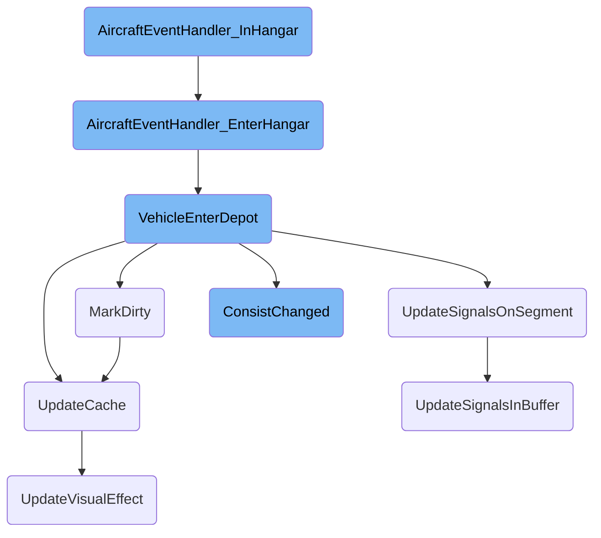

This document explains the process of handling aircraft when they are in the hangar. The process involves checking the aircraft's arrival, managing its stay in the depot, handling congestion, and updating various states and properties of the aircraft.

When an aircraft arrives at the hangar, it first checks if it has just arrived and updates its state accordingly. If the aircraft is supposed to stay in the depot, it remains there. The system also checks if the aircraft needs to wait to avoid congestion. If the aircraft needs to <SwmToken path="src/aircraft_cmd.cpp" pos="1541:33:35" line-data="	/* We are leaving a hangar, but have to go to the exact same one; re-enter */">`re-enter`</SwmToken> the hangar, it updates its status and properties. Throughout this process, various updates are made to ensure the aircraft's state is accurately reflected in the game.

# Flow drill down



<SwmSnippet path="/src/aircraft_cmd.cpp" line="1515">

---

## Handling Aircraft in Hangar

The function <SwmToken path="src/aircraft_cmd.cpp" pos="1520:4:4" line-data="static void AircraftEventHandler_InHangar(Aircraft *v, const AirportFTAClass *apc)">`AircraftEventHandler_InHangar`</SwmToken> manages the aircraft's behavior while it is in the hangar. It first checks if the aircraft has just arrived and if so, it calls <SwmToken path="src/aircraft_cmd.cpp" pos="1524:1:1" line-data="		AircraftEventHandler_EnterHangar(v, apc);">`AircraftEventHandler_EnterHangar`</SwmToken> to handle the initial entry. If the aircraft is supposed to stay in the depot, it remains there. The function also checks if the aircraft is waiting to avoid congestion (unbunching). If the aircraft is supposed to leave the hangar but needs to <SwmToken path="src/aircraft_cmd.cpp" pos="1541:33:35" line-data="	/* We are leaving a hangar, but have to go to the exact same one; re-enter */">`re-enter`</SwmToken> the same hangar, it calls <SwmToken path="src/aircraft_cmd.cpp" pos="1511:1:1" line-data="	VehicleEnterDepot(v);">`VehicleEnterDepot`</SwmToken>. If the next position is busy, the aircraft stays put. If the aircraft is at its target airport, it finds a free terminal or prepares for takeoff.

```c++
/**
 * Handle aircraft movement/decision making in an airport hangar.
 * @param v Aircraft in the hangar.
 * @param apc Airport description containing the hangar.
 */
static void AircraftEventHandler_InHangar(Aircraft *v, const AirportFTAClass *apc)
{
	/* if we just arrived, execute EnterHangar first */
	if (v->previous_pos != v->pos) {
		AircraftEventHandler_EnterHangar(v, apc);
		return;
	}

	/* if we were sent to the depot, stay there */
	if (v->current_order.IsType(OT_GOTO_DEPOT) && (v->vehstatus & VS_STOPPED)) {
		v->current_order.Free();
		return;
	}

	/* Check if we should wait here for unbunching. */
	if (v->IsWaitingForUnbunching()) return;
```

---

</SwmSnippet>

<SwmSnippet path="/src/aircraft_cmd.cpp" line="1504">

---

### Entering the Hangar

The function <SwmToken path="src/aircraft_cmd.cpp" pos="1509:4:4" line-data="static void AircraftEventHandler_EnterHangar(Aircraft *v, const AirportFTAClass *apc)">`AircraftEventHandler_EnterHangar`</SwmToken> is called when an aircraft arrives in the hangar. It updates the aircraft's state to reflect its new position in the hangar and calls <SwmToken path="src/aircraft_cmd.cpp" pos="1511:1:1" line-data="	VehicleEnterDepot(v);">`VehicleEnterDepot`</SwmToken> to handle the detailed operations of entering the depot.

```c++
/**
 * Aircraft arrived in an airport hangar.
 * @param v Aircraft in the hangar.
 * @param apc Airport description containing the hangar.
 */
static void AircraftEventHandler_EnterHangar(Aircraft *v, const AirportFTAClass *apc)
{
	VehicleEnterDepot(v);
	v->state = apc->layout[v->pos].heading;
}
```

---

</SwmSnippet>

<SwmSnippet path="/src/vehicle.cpp" line="1548">

---

### Detailed Depot Entry

The function <SwmToken path="src/vehicle.cpp" pos="1552:2:2" line-data="void VehicleEnterDepot(Vehicle *v)">`VehicleEnterDepot`</SwmToken> updates the vehicle's status, orders, and other properties when it enters the depot. It handles various vehicle types, updates the vehicle's cache, and triggers necessary visual and operational updates. This function ensures that the vehicle is properly serviced and its state is correctly reflected in the game.

```c++
/**
 * Vehicle entirely entered the depot, update its status, orders, vehicle windows, service it, etc.
 * @param v Vehicle that entered a depot.
 */
void VehicleEnterDepot(Vehicle *v)
{
	/* Always work with the front of the vehicle */
	assert(v == v->First());

	switch (v->type) {
		case VEH_TRAIN: {
			Train *t = Train::From(v);
			SetWindowClassesDirty(WC_TRAINS_LIST);
			/* Clear path reservation */
			SetDepotReservation(t->tile, false);
			if (_settings_client.gui.show_track_reservation) MarkTileDirtyByTile(t->tile);

			UpdateSignalsOnSegment(t->tile, INVALID_DIAGDIR, t->owner);
			t->wait_counter = 0;
			t->force_proceed = TFP_NONE;
			ClrBit(t->flags, VRF_TOGGLE_REVERSE);
```

---

</SwmSnippet>

<SwmSnippet path="/src/ship_cmd.cpp" line="305">

---

### Marking Dirty State

The method <SwmToken path="src/ship_cmd.cpp" pos="305:4:4" line-data="void Ship::MarkDirty()">`MarkDirty`</SwmToken> marks the vehicle as needing a visual update. It resets the color map and updates the viewport and cache, ensuring that the vehicle's visual representation is accurate.

```c++
void Ship::MarkDirty()
{
	this->colourmap = PAL_NONE;
	this->UpdateViewport(true, false);
	this->UpdateCache();
}
```

---

</SwmSnippet>

<SwmSnippet path="/src/ship_cmd.cpp" line="229">

---

### Updating Cache

The method <SwmToken path="src/ship_cmd.cpp" pos="232:4:4" line-data="void Ship::UpdateCache()">`UpdateCache`</SwmToken> updates the vehicle's cached properties, such as speed and cargo aging period. This ensures that the vehicle's performance characteristics are up-to-date.

```c++
/**
 * Update the caches of this ship.
 */
void Ship::UpdateCache()
{
	const ShipVehicleInfo *svi = ShipVehInfo(this->engine_type);

	/* Get speed fraction for the current water type. Aqueducts are always canals. */
	bool is_ocean = GetEffectiveWaterClass(this->tile) == WATER_CLASS_SEA;
	uint raw_speed = GetVehicleProperty(this, PROP_SHIP_SPEED, svi->max_speed);
	this->vcache.cached_max_speed = svi->ApplyWaterClassSpeedFrac(raw_speed, is_ocean);

	/* Update cargo aging period. */
	this->vcache.cached_cargo_age_period = GetVehicleProperty(this, PROP_SHIP_CARGO_AGE_PERIOD, EngInfo(this->engine_type)->cargo_age_period);

	this->UpdateVisualEffect();
}
```

---

</SwmSnippet>

<SwmSnippet path="/src/signal.cpp" line="640">

---

### Updating Signals

The function <SwmToken path="src/signal.cpp" pos="650:2:2" line-data="SigSegState UpdateSignalsOnSegment(TileIndex tile, DiagDirection side, Owner owner)">`UpdateSignalsOnSegment`</SwmToken> updates the signals on a given segment of the track. It ensures that the signals reflect the current state of the track and any vehicles on it.

```c++
/**
 * Update signals, starting at one side of a tile
 * Will check tile next to this at opposite side too
 *
 * @see UpdateSignalsInBuffer()
 * @param tile tile where we start
 * @param side side of tile
 * @param owner owner whose signals we will update
 * @return the state of the signal segment
 */
SigSegState UpdateSignalsOnSegment(TileIndex tile, DiagDirection side, Owner owner)
{
	assert(_globset.IsEmpty());
	_globset.Add(tile, side);

	return UpdateSignalsInBuffer(owner);
}
```

---

</SwmSnippet>

<SwmSnippet path="/src/train_cmd.cpp" line="104">

---

### Consist Changes

The method <SwmToken path="src/train_cmd.cpp" pos="110:4:4" line-data="void Train::ConsistChanged(ConsistChangeFlags allowed_changes)">`ConsistChanged`</SwmToken> recalculates the properties of a train when its consist changes. This includes updating the train's speed, capacity, and other characteristics to ensure that the train operates correctly.

```c++
/**
 * Recalculates the cached stuff of a train. Should be called each time a vehicle is added
 * to/removed from the chain, and when the game is loaded.
 * Note: this needs to be called too for 'wagon chains' (in the depot, without an engine)
 * @param allowed_changes Stuff that is allowed to change.
 */
void Train::ConsistChanged(ConsistChangeFlags allowed_changes)
{
	uint16_t max_speed = UINT16_MAX;

	assert(this->IsFrontEngine() || this->IsFreeWagon());

	const RailVehicleInfo *rvi_v = RailVehInfo(this->engine_type);
	EngineID first_engine = this->IsFrontEngine() ? this->engine_type : INVALID_ENGINE;
	this->gcache.cached_total_length = 0;
	this->compatible_railtypes = RAILTYPES_NONE;

	bool train_can_tilt = true;
	int16_t min_curve_speed_mod = INT16_MAX;

	for (Train *u = this; u != nullptr; u = u->Next()) {
```

---

</SwmSnippet>

<SwmSnippet path="/src/signal.cpp" line="475">

---

### Updating Signals in Buffer

The function <SwmToken path="src/signal.cpp" pos="482:4:4" line-data="static SigSegState UpdateSignalsInBuffer(Owner owner)">`UpdateSignalsInBuffer`</SwmToken> updates the signals in the buffer, ensuring that the signal states are consistent and accurate.

```c++
/**
 * Updates blocks in _globset buffer
 *
 * @param owner company whose signals we are updating
 * @return state of the first block from _globset
 * @pre Company::IsValidID(owner)
 */
static SigSegState UpdateSignalsInBuffer(Owner owner)
{
	assert(Company::IsValidID(owner));

	bool first = true;  // first block?
	SigSegState state = SIGSEG_FREE; // value to return

	TileIndex tile = INVALID_TILE; // Stop GCC from complaining about a possibly uninitialized variable (issue #8280).
	DiagDirection dir = INVALID_DIAGDIR;

	while (_globset.Get(&tile, &dir)) {
		assert(_tbuset.IsEmpty());
		assert(_tbdset.IsEmpty());

```

---

</SwmSnippet>

<SwmSnippet path="/src/vehicle.cpp" line="2660">

---

### Updating Visual Effects

The method <SwmToken path="src/vehicle.cpp" pos="2664:4:4" line-data="void Vehicle::UpdateVisualEffect(bool allow_power_change)">`UpdateVisualEffect`</SwmToken> updates the visual effects associated with a vehicle. This includes handling powered wagons and applying visual effect callbacks to ensure that the vehicle's appearance is correct.

```c++
/**
 * Update the cached visual effect.
 * @param allow_power_change true if the wagon-is-powered-state may change.
 */
void Vehicle::UpdateVisualEffect(bool allow_power_change)
{
	bool powered_before = HasBit(this->vcache.cached_vis_effect, VE_DISABLE_WAGON_POWER);
	const Engine *e = this->GetEngine();

	/* Evaluate properties */
	uint8_t visual_effect;
	switch (e->type) {
		case VEH_TRAIN: visual_effect = e->u.rail.visual_effect; break;
		case VEH_ROAD:  visual_effect = e->u.road.visual_effect; break;
		case VEH_SHIP:  visual_effect = e->u.ship.visual_effect; break;
		default:        visual_effect = 1 << VE_DISABLE_EFFECT;  break;
	}

	/* Check powered wagon / visual effect callback */
	if (HasBit(e->info.callback_mask, CBM_VEHICLE_VISUAL_EFFECT)) {
		uint16_t callback = GetVehicleCallback(CBID_VEHICLE_VISUAL_EFFECT, 0, 0, this->engine_type, this);
```

---

</SwmSnippet>

&nbsp;

*This is an auto-generated document by Swimm AI 🌊 and has not yet been verified by a human*

<SwmMeta version="3.0.0" repo-id="Z2l0aHViJTNBJTNBT3BlblRURC1jb3BpbG90LWRlbW8lM0ElM0Fzd2ltbWlv" repo-name="OpenTTD-copilot-demo"><sup>Powered by [Swimm](/)</sup></SwmMeta>
