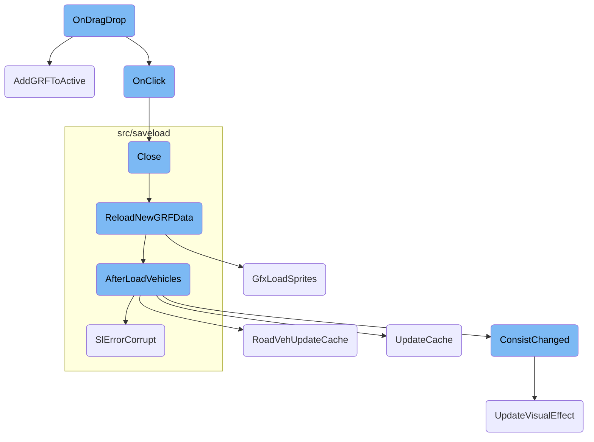
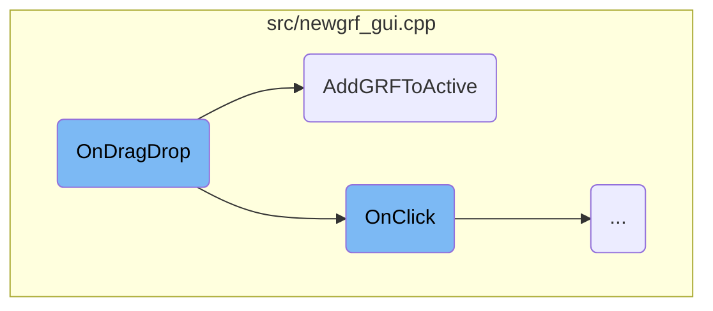
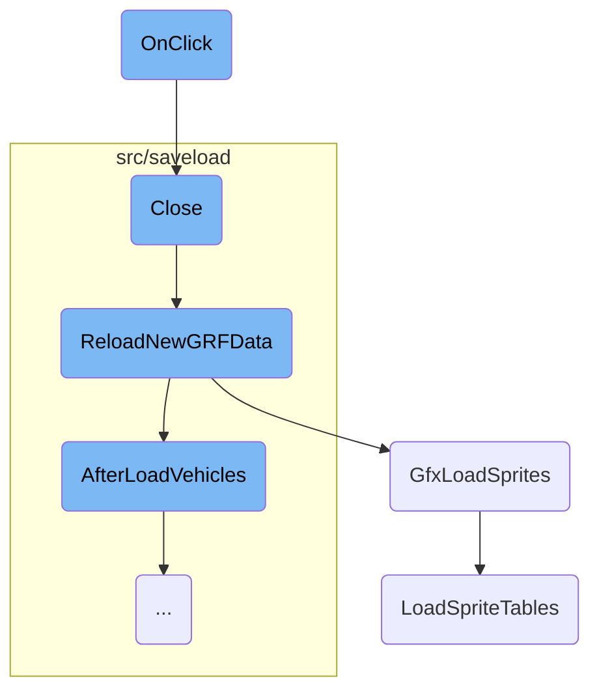
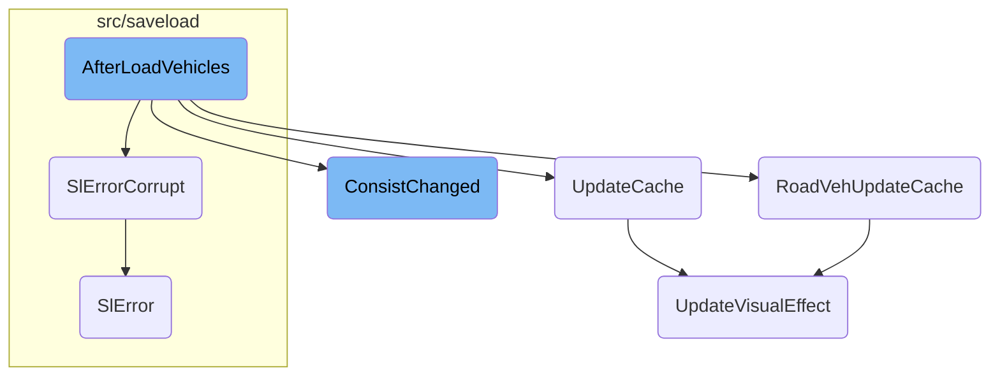

This document explains the <SwmToken path="src/newgrf_gui.cpp" pos="1387:7:11" line-data="				/* Gets the drag-and-drop destination offset. Ignore the last dummy line. */">`drag-and-drop`</SwmToken> functionality for managing GRF files within the game interface. It covers how files are repositioned within the active list and how new files are added from the available list to the active list.

When you drag a file within the active list, it gets repositioned to a new spot. If you drag a file from the available list to the active list, it gets added to the active list. The system checks if the interface is editable and handles different scenarios based on where the file is dragged.

Here is a high level diagram of the flow, showing only the most important functions:



# Flow drill down

First, we'll zoom into this section of the flow:



<SwmSnippet path="/src/newgrf_gui.cpp" line="1376">

---

## Handling <SwmToken path="src/newgrf_gui.cpp" pos="1387:7:11" line-data="				/* Gets the drag-and-drop destination offset. Ignore the last dummy line. */">`drag-and-drop`</SwmToken> Actions

The <SwmToken path="src/newgrf_gui.cpp" pos="1376:3:3" line-data="	void OnDragDrop(Point pt, WidgetID widget) override">`OnDragDrop`</SwmToken> function manages the <SwmToken path="src/newgrf_gui.cpp" pos="1387:7:11" line-data="				/* Gets the drag-and-drop destination offset. Ignore the last dummy line. */">`drag-and-drop`</SwmToken> actions for GRF files. It checks if the interface is editable and handles different scenarios based on the widget being interacted with. For example, if a file is dragged within the active list, it repositions the file. If a file is dragged from the available list to the active list, it calls <SwmToken path="src/newgrf_gui.cpp" pos="1520:3:3" line-data="	bool AddGRFToActive(int ins_pos = -1)">`AddGRFToActive`</SwmToken> to add the file to the active list.

```c++
	void OnDragDrop(Point pt, WidgetID widget) override
	{
		if (!this->editable) return;

		if (widget == WID_NS_FILE_LIST) {
			if (this->active_sel != nullptr) {
				/* Get pointer to the selected file in the active list. */
				int from_pos = 0;
				GRFConfig **from_prev;
				for (from_prev = &this->actives; *from_prev != this->active_sel; from_prev = &(*from_prev)->next, from_pos++) {}

				/* Gets the drag-and-drop destination offset. Ignore the last dummy line. */
				int to_pos = std::min(this->vscroll->GetScrolledRowFromWidget(pt.y, this, WID_NS_FILE_LIST, WidgetDimensions::scaled.framerect.top), this->vscroll->GetCount() - 2);
				if (to_pos != from_pos) { // Don't move NewGRF file over itself.
					/* Get pointer to destination position. */
					GRFConfig **to_prev = &this->actives;
					for (int i = from_pos < to_pos ? -1 : 0; *to_prev != nullptr && i < to_pos; to_prev = &(*to_prev)->next, i++) {}

					/* Detach NewGRF file from its original position. */
					*from_prev = this->active_sel->next;

```

---

</SwmSnippet>

<SwmSnippet path="/src/newgrf_gui.cpp" line="1515">

---

### Adding GRF Files to the Active List

The <SwmToken path="src/newgrf_gui.cpp" pos="1520:3:3" line-data="	bool AddGRFToActive(int ins_pos = -1)">`AddGRFToActive`</SwmToken> function inserts a GRF file into the active list at a specified position. It performs several checks, such as ensuring the file is valid and not a duplicate, and that the maximum number of GRF files has not been exceeded. If all checks pass, it copies the GRF details from the available list and inserts the file into the active list, updating the interface accordingly.

```c++
	/**
	 * Insert a GRF into the active list.
	 * @param ins_pos Insert GRF at this position.
	 * @return True if the GRF was successfully added.
	 */
	bool AddGRFToActive(int ins_pos = -1)
	{
		if (this->avail_sel == nullptr || !this->editable || HasBit(this->avail_sel->flags, GCF_INVALID)) return false;

		CloseWindowByClass(WC_TEXTFILE);

		uint count = 0;
		GRFConfig **entry = nullptr;
		GRFConfig **list;
		/* Find last entry in the list, checking for duplicate grfid on the way */
		for (list = &this->actives; *list != nullptr; list = &(*list)->next, ins_pos--) {
			if (ins_pos == 0) entry = list; // Insert position? Save.
			if ((*list)->ident.grfid == this->avail_sel->ident.grfid) {
				ShowErrorMessage(STR_NEWGRF_DUPLICATE_GRFID, INVALID_STRING_ID, WL_INFO);
				return false;
			}
```

---

</SwmSnippet>

Now, lets zoom into this section of the flow:



<SwmSnippet path="/src/newgrf_gui.cpp" line="334">

---

## Handling Widget Interactions

The <SwmToken path="src/newgrf_gui.cpp" pos="334:3:3" line-data="	void OnClick([[maybe_unused]] Point pt, WidgetID widget, [[maybe_unused]] int click_count) override">`OnClick`</SwmToken> function handles various user interactions with the GRF configuration interface. It processes clicks on different widgets, such as decrementing or incrementing parameters, handling background clicks, and resetting or accepting changes. This function ensures that user inputs are correctly processed and the interface is updated accordingly.

```c++
	void OnClick([[maybe_unused]] Point pt, WidgetID widget, [[maybe_unused]] int click_count) override
	{
		switch (widget) {
			case WID_NP_NUMPAR_DEC:
				if (this->editable && !this->action14present && this->grf_config->num_params > 0) {
					this->grf_config->num_params--;
					this->InvalidateData();
					SetWindowDirty(WC_GAME_OPTIONS, WN_GAME_OPTIONS_NEWGRF_STATE);
				}
				break;

			case WID_NP_NUMPAR_INC: {
				GRFConfig *c = this->grf_config;
				if (this->editable && !this->action14present && c->num_params < c->num_valid_params) {
					c->param[c->num_params++] = 0;
					this->InvalidateData();
					SetWindowDirty(WC_GAME_OPTIONS, WN_GAME_OPTIONS_NEWGRF_STATE);
				}
				break;
			}

```

---

</SwmSnippet>

<SwmSnippet path="/src/newgrf_gui.cpp" line="678">

---

## Closing the GRF Configuration Window

The <SwmToken path="src/newgrf_gui.cpp" pos="678:3:3" line-data="	void Close([[maybe_unused]] int data = 0) override">`Close`</SwmToken> function is responsible for closing the GRF configuration window. It ensures that any changes made by the user are saved and the GRF data is reloaded if necessary. This function is crucial for maintaining the integrity of the GRF configuration and ensuring that the game state is updated correctly.

```c++
	void Close([[maybe_unused]] int data = 0) override
	{
		CloseWindowByClass(WC_GRF_PARAMETERS);
		CloseWindowByClass(WC_TEXTFILE);
		CloseWindowByClass(WC_SAVE_PRESET);

		if (this->editable && this->modified && !this->execute && !_exit_game) {
			CopyGRFConfigList(this->orig_list, this->actives, true);
			ResetGRFConfig(false);
			ReloadNewGRFData();
		}

		this->Window::Close();
	}
```

---

</SwmSnippet>

<SwmSnippet path="/src/saveload/afterload.cpp" line="3329">

---

## Reloading GRF Data

The <SwmToken path="src/saveload/afterload.cpp" pos="3337:2:2" line-data="void ReloadNewGRFData()">`ReloadNewGRFData`</SwmToken> function reloads all <SwmToken path="src/saveload/afterload.cpp" pos="3330:7:7" line-data=" * Reload all NewGRF files during a running game. This is a cut-down">`NewGRF`</SwmToken> files during a running game. It updates various game elements, such as sprites, vehicles, stations, and company statistics, to reflect the new GRF data. This function ensures that the game state is consistent with the updated GRF configurations.

```c++
/**
 * Reload all NewGRF files during a running game. This is a cut-down
 * version of AfterLoadGame().
 * XXX - We need to reset the vehicle position hash because with a non-empty
 * hash AfterLoadVehicles() will loop infinitely. We need AfterLoadVehicles()
 * to recalculate vehicle data as some NewGRF vehicle sets could have been
 * removed or added and changed statistics
 */
void ReloadNewGRFData()
{
	/* reload grf data */
	GfxLoadSprites();
	LoadStringWidthTable();
	RecomputePrices();
	/* reload vehicles */
	ResetVehicleHash();
	AfterLoadVehicles(false);
	StartupEngines();
	GroupStatistics::UpdateAfterLoad();
	/* update station graphics */
	AfterLoadStations();
```

---

</SwmSnippet>

<SwmSnippet path="/src/gfxinit.cpp" line="325">

---

## Loading Sprites

The <SwmToken path="src/gfxinit.cpp" pos="326:2:2" line-data="void GfxLoadSprites()">`GfxLoadSprites`</SwmToken> function initializes and loads all the sprites required for the game. It clears the current sprites, initializes sprite memory, and loads the sprite tables. This function is essential for ensuring that the game's graphics are correctly loaded and displayed.

```c++
/** Initialise and load all the sprites. */
void GfxLoadSprites()
{
	Debug(sprite, 2, "Loading sprite set {}", _settings_game.game_creation.landscape);

	SwitchNewGRFBlitter();
	VideoDriver::GetInstance()->ClearSystemSprites();
	ClearFontCache();
	GfxInitSpriteMem();
	LoadSpriteTables();
	GfxInitPalettes();

	UpdateCursorSize();
}
```

---

</SwmSnippet>

<SwmSnippet path="/src/gfxinit.cpp" line="150">

---

## Loading Sprite Tables

The <SwmToken path="src/gfxinit.cpp" pos="151:4:4" line-data="static void LoadSpriteTables()">`LoadSpriteTables`</SwmToken> function loads the sprite tables from the GRF files. It handles different sprite files based on the game's landscape settings and initializes the unicode to sprite mapping table. This function ensures that all necessary sprites are loaded and available for use in the game.

```c++
/** Actually load the sprite tables. */
static void LoadSpriteTables()
{
	const GraphicsSet *used_set = BaseGraphics::GetUsedSet();

	LoadGrfFile(used_set->files[GFT_BASE].filename, 0, PAL_DOS != used_set->palette);

	/*
	 * The second basic file always starts at the given location and does
	 * contain a different amount of sprites depending on the "type"; DOS
	 * has a few sprites less. However, we do not care about those missing
	 * sprites as they are not shown anyway (logos in intro game).
	 */
	LoadGrfFile(used_set->files[GFT_LOGOS].filename, 4793, PAL_DOS != used_set->palette);

	/*
	 * Load additional sprites for climates other than temperate.
	 * This overwrites some of the temperate sprites, such as foundations
	 * and the ground sprites.
	 */
	if (_settings_game.game_creation.landscape != LT_TEMPERATE) {
```

---

</SwmSnippet>

Now, lets zoom into this section of the flow:



<SwmSnippet path="/src/saveload/vehicle_sl.cpp" line="254">

---

## Updating Vehicle Properties

The function <SwmToken path="src/saveload/vehicle_sl.cpp" pos="255:2:2" line-data="void AfterLoadVehicles(bool part_of_load)">`AfterLoadVehicles`</SwmToken> is responsible for updating various properties of vehicles after loading a savegame or reloading <SwmToken path="src/saveload/vehicle_sl.cpp" pos="267:19:19" line-data="	/* AfterLoadVehicles may also be called in case of NewGRF reload, in this">`NewGRF`</SwmToken> data. It iterates over all vehicles and reinstates pointers, updates orders, and recalculates properties such as speed, cargo age, and service intervals. This ensures that the vehicles are correctly initialized and consistent with the current game state.

```c++
/** Called after load to update coordinates */
void AfterLoadVehicles(bool part_of_load)
{
	for (Vehicle *v : Vehicle::Iterate()) {
		/* Reinstate the previous pointer */
		if (v->Next() != nullptr) v->Next()->previous = v;
		if (v->NextShared() != nullptr) v->NextShared()->previous_shared = v;

		if (part_of_load) v->fill_percent_te_id = INVALID_TE_ID;
		v->first = nullptr;
		if (v->IsGroundVehicle()) v->GetGroundVehicleCache()->first_engine = INVALID_ENGINE;
	}

	/* AfterLoadVehicles may also be called in case of NewGRF reload, in this
	 * case we may not convert orders again. */
	if (part_of_load) {
		/* Create shared vehicle chain for very old games (pre 5,2) and create
		 * OrderList from shared vehicle chains. For this to work correctly, the
		 * following conditions must be fulfilled:
		 * a) both next_shared and previous_shared are not set for pre 5,2 games
		 * b) both next_shared and previous_shared are set for later games
```

---

</SwmSnippet>

<SwmSnippet path="/src/roadveh_cmd.cpp" line="212">

---

### Handling Road Vehicle Cache

The function <SwmToken path="src/roadveh_cmd.cpp" pos="218:2:2" line-data="void RoadVehUpdateCache(RoadVehicle *v, bool same_length)">`RoadVehUpdateCache`</SwmToken> updates the cache of a road vehicle. It recalculates properties like total length, cargo age period, and maximum speed. This ensures that the road vehicle's performance and behavior are accurately represented in the game.

```c++
/**
 * Update the cache of a road vehicle.
 * @param v Road vehicle needing an update of its cache.
 * @param same_length should length of vehicles stay the same?
 * @pre \a v must be first road vehicle.
 */
void RoadVehUpdateCache(RoadVehicle *v, bool same_length)
{
	assert(v->type == VEH_ROAD);
	assert(v->IsFrontEngine());

	v->InvalidateNewGRFCacheOfChain();

	v->gcache.cached_total_length = 0;

	for (RoadVehicle *u = v; u != nullptr; u = u->Next()) {
		/* Check the v->first cache. */
		assert(u->First() == v);

		/* Update the 'first engine' */
		u->gcache.first_engine = (v == u) ? INVALID_ENGINE : v->engine_type;
```

---

</SwmSnippet>

<SwmSnippet path="/src/ship_cmd.cpp" line="229">

---

### Handling Ship Cache

The method <SwmToken path="src/ship_cmd.cpp" pos="232:4:4" line-data="void Ship::UpdateCache()">`UpdateCache`</SwmToken> in the <SwmToken path="src/ship_cmd.cpp" pos="230:13:13" line-data=" * Update the caches of this ship.">`ship`</SwmToken> class updates the cache of a ship. It recalculates properties such as maximum speed and cargo age period based on the current water type. This ensures that the ship's performance is accurately represented in the game.

```c++
/**
 * Update the caches of this ship.
 */
void Ship::UpdateCache()
{
	const ShipVehicleInfo *svi = ShipVehInfo(this->engine_type);

	/* Get speed fraction for the current water type. Aqueducts are always canals. */
	bool is_ocean = GetEffectiveWaterClass(this->tile) == WATER_CLASS_SEA;
	uint raw_speed = GetVehicleProperty(this, PROP_SHIP_SPEED, svi->max_speed);
	this->vcache.cached_max_speed = svi->ApplyWaterClassSpeedFrac(raw_speed, is_ocean);

	/* Update cargo aging period. */
	this->vcache.cached_cargo_age_period = GetVehicleProperty(this, PROP_SHIP_CARGO_AGE_PERIOD, EngInfo(this->engine_type)->cargo_age_period);

	this->UpdateVisualEffect();
}
```

---

</SwmSnippet>

<SwmSnippet path="/src/saveload/saveload.cpp" line="344">

---

### Error Handling for Corrupt Savegames

The function <SwmToken path="src/saveload/saveload.cpp" pos="351:8:8" line-data="[[noreturn]] void SlErrorCorrupt(const std::string &amp;msg)">`SlErrorCorrupt`</SwmToken> handles errors related to corrupt savegames. It sets up the error message and cleans up any partial savegame load, ensuring that the game can handle corrupt savegames gracefully.

```c++
/**
 * Error handler for corrupt savegames. Sets everything up to show the
 * error message and to clean up the mess of a partial savegame load.
 * @param msg Location the corruption has been spotted.
 * @note This function does never return as it throws an exception to
 *       break out of all the saveload code.
 */
[[noreturn]] void SlErrorCorrupt(const std::string &msg)
{
	SlError(STR_GAME_SAVELOAD_ERROR_BROKEN_SAVEGAME, msg);
}
```

---

</SwmSnippet>

<SwmSnippet path="/src/train_cmd.cpp" line="104">

---

### Recalculating Train Properties

The method <SwmToken path="src/train_cmd.cpp" pos="110:4:4" line-data="void Train::ConsistChanged(ConsistChangeFlags allowed_changes)">`ConsistChanged`</SwmToken> recalculates the cached properties of a train whenever a vehicle is added or removed from the train. It updates properties such as maximum speed, capacity, and visual effects, ensuring that the train's performance and appearance are accurately represented in the game.

```c++
/**
 * Recalculates the cached stuff of a train. Should be called each time a vehicle is added
 * to/removed from the chain, and when the game is loaded.
 * Note: this needs to be called too for 'wagon chains' (in the depot, without an engine)
 * @param allowed_changes Stuff that is allowed to change.
 */
void Train::ConsistChanged(ConsistChangeFlags allowed_changes)
{
	uint16_t max_speed = UINT16_MAX;

	assert(this->IsFrontEngine() || this->IsFreeWagon());

	const RailVehicleInfo *rvi_v = RailVehInfo(this->engine_type);
	EngineID first_engine = this->IsFrontEngine() ? this->engine_type : INVALID_ENGINE;
	this->gcache.cached_total_length = 0;
	this->compatible_railtypes = RAILTYPES_NONE;

	bool train_can_tilt = true;
	int16_t min_curve_speed_mod = INT16_MAX;

	for (Train *u = this; u != nullptr; u = u->Next()) {
```

---

</SwmSnippet>

<SwmSnippet path="/src/saveload/saveload.cpp" line="313">

---

### General Error Handling

The function <SwmToken path="src/saveload/saveload.cpp" pos="321:8:8" line-data="[[noreturn]] void SlError(StringID string, const std::string &amp;extra_msg)">`SlError`</SwmToken> handles general errors during <SwmToken path="src/saveload/saveload.cpp" pos="323:18:20" line-data="	/* Distinguish between loading into _load_check_data vs. normal save/load. */">`save/load`</SwmToken> operations. It sets up the error message and cleans up any partial <SwmToken path="src/saveload/saveload.cpp" pos="323:18:20" line-data="	/* Distinguish between loading into _load_check_data vs. normal save/load. */">`save/load`</SwmToken> operation, ensuring that the game can handle errors gracefully.

```c++
/**
 * Error handler. Sets everything up to show an error message and to clean
 * up the mess of a partial savegame load.
 * @param string The translatable error message to show.
 * @param extra_msg An extra error message coming from one of the APIs.
 * @note This function does never return as it throws an exception to
 *       break out of all the saveload code.
 */
[[noreturn]] void SlError(StringID string, const std::string &extra_msg)
{
	/* Distinguish between loading into _load_check_data vs. normal save/load. */
	if (_sl.action == SLA_LOAD_CHECK) {
		_load_check_data.error = string;
		_load_check_data.error_msg = extra_msg;
	} else {
		_sl.error_str = string;
		_sl.extra_msg = extra_msg;
	}

	/* We have to nullptr all pointers here; we might be in a state where
	 * the pointers are actually filled with indices, which means that
```

---

</SwmSnippet>

<SwmSnippet path="/src/vehicle.cpp" line="2660">

---

### Updating Visual Effects

The method <SwmToken path="src/vehicle.cpp" pos="2664:4:4" line-data="void Vehicle::UpdateVisualEffect(bool allow_power_change)">`UpdateVisualEffect`</SwmToken> updates the cached visual effect of a vehicle. It evaluates properties and applies visual effects based on the vehicle type, ensuring that the vehicle's appearance is accurately represented in the game.

```c++
/**
 * Update the cached visual effect.
 * @param allow_power_change true if the wagon-is-powered-state may change.
 */
void Vehicle::UpdateVisualEffect(bool allow_power_change)
{
	bool powered_before = HasBit(this->vcache.cached_vis_effect, VE_DISABLE_WAGON_POWER);
	const Engine *e = this->GetEngine();

	/* Evaluate properties */
	uint8_t visual_effect;
	switch (e->type) {
		case VEH_TRAIN: visual_effect = e->u.rail.visual_effect; break;
		case VEH_ROAD:  visual_effect = e->u.road.visual_effect; break;
		case VEH_SHIP:  visual_effect = e->u.ship.visual_effect; break;
		default:        visual_effect = 1 << VE_DISABLE_EFFECT;  break;
	}

	/* Check powered wagon / visual effect callback */
	if (HasBit(e->info.callback_mask, CBM_VEHICLE_VISUAL_EFFECT)) {
		uint16_t callback = GetVehicleCallback(CBID_VEHICLE_VISUAL_EFFECT, 0, 0, this->engine_type, this);
```

---

</SwmSnippet>

&nbsp;

*This is an auto-generated document by Swimm AI 🌊 and has not yet been verified by a human*

<SwmMeta version="3.0.0" repo-id="Z2l0aHViJTNBJTNBT3BlblRURC1jb3BpbG90LWRlbW8lM0ElM0Fzd2ltbWlv" repo-name="OpenTTD-copilot-demo"><sup>Powered by [Swimm](/)</sup></SwmMeta>
