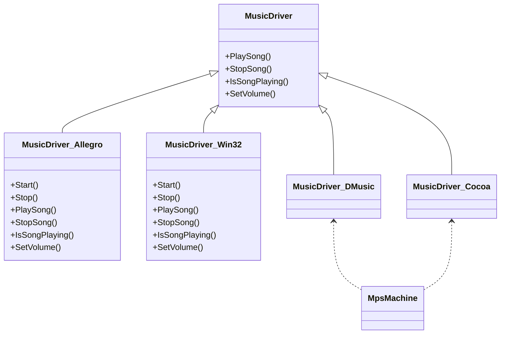

# Music Overview

Music refers to the audio playback functionality within the game. It is managed by various music drivers, each tailored to different platforms or audio libraries, such as Allegro, <SwmToken path="src/music/win32_m.cpp" pos="353:10:10" line-data="	Debug(driver, 2, &quot;Win32-MIDI: StopSong: entry&quot;);">`Win32`</SwmToken>, and <SwmToken path="src/music/dmusic.cpp" pos="1080:7:7" line-data="	/* Create the DirectMusic object */">`DirectMusic`</SwmToken>.

## <SwmToken path="src/music/dmusic.h" pos="16:8:8" line-data="class MusicDriver_DMusic : public MusicDriver {">`MusicDriver`</SwmToken> Class

The <SwmToken path="src/music/dmusic.h" pos="16:8:8" line-data="class MusicDriver_DMusic : public MusicDriver {">`MusicDriver`</SwmToken> class serves as the base class for all music drivers, providing essential methods like <SwmToken path="src/music/dmusic.h" pos="24:3:3" line-data="	void PlaySong(const MusicSongInfo &amp;song) override;">`PlaySong`</SwmToken>, <SwmToken path="src/music/dmusic.h" pos="26:3:3" line-data="	void StopSong() override;">`StopSong`</SwmToken>, <SwmToken path="src/music/dmusic.h" pos="28:3:3" line-data="	bool IsSongPlaying() override;">`IsSongPlaying`</SwmToken>, and <SwmToken path="src/music/dmusic.h" pos="30:3:3" line-data="	void SetVolume(uint8_t vol) override;">`SetVolume`</SwmToken>.

<SwmSnippet path="/src/music/dmusic.h" line="15">

---

The <SwmToken path="src/music/dmusic.h" pos="16:2:2" line-data="class MusicDriver_DMusic : public MusicDriver {">`MusicDriver_DMusic`</SwmToken> class is an implementation of <SwmToken path="src/music/dmusic.h" pos="16:8:8" line-data="class MusicDriver_DMusic : public MusicDriver {">`MusicDriver`</SwmToken> that uses <SwmToken path="src/music/dmusic.cpp" pos="1080:7:7" line-data="	/* Create the DirectMusic object */">`DirectMusic`</SwmToken> for audio playback. It includes methods to start, stop, and play songs, as well as manage playback state.

```c
/** Music player making use of DirectX. */
class MusicDriver_DMusic : public MusicDriver {
public:
	virtual ~MusicDriver_DMusic();

	std::optional<std::string_view> Start(const StringList &param) override;

	void Stop() override;

	void PlaySong(const MusicSongInfo &song) override;

	void StopSong() override;

	bool IsSongPlaying() override;

	void SetVolume(uint8_t vol) override;
	std::string_view GetName() const override { return "dmusic"; }
};
```

---

</SwmSnippet>

<SwmSnippet path="/src/music/dmusic.cpp" line="1075">

---

The <SwmToken path="src/music/dmusic.cpp" pos="1075:11:11" line-data="std::optional&lt;std::string_view&gt; MusicDriver_DMusic::Start(const StringList &amp;parm)">`Start`</SwmToken> method in <SwmToken path="src/music/dmusic.cpp" pos="1075:9:9" line-data="std::optional&lt;std::string_view&gt; MusicDriver_DMusic::Start(const StringList &amp;parm)">`MusicDriver_DMusic`</SwmToken> initializes the COM, creates the <SwmToken path="src/music/dmusic.cpp" pos="1080:7:7" line-data="	/* Create the DirectMusic object */">`DirectMusic`</SwmToken> object, and assigns the sound output device.

```c++
std::optional<std::string_view> MusicDriver_DMusic::Start(const StringList &parm)
{
	/* Initialize COM */
	if (FAILED(CoInitializeEx(nullptr, COINIT_MULTITHREADED))) return "COM initialization failed";

	/* Create the DirectMusic object */
	if (FAILED(CoCreateInstance(
				CLSID_DirectMusic,
				nullptr,
				CLSCTX_INPROC,
				IID_IDirectMusic,
				(LPVOID*)&_music
			))) {
		return "Failed to create the music object";
	}

	/* Assign sound output device. */
	if (FAILED(_music->SetDirectSound(nullptr, nullptr))) return "Can't set DirectSound interface";

	/* MIDI events need to be send to the synth in time before their playback time
	 * has come. By default, we try send any events at least 50 ms before playback. */
```

---

</SwmSnippet>

## <SwmToken path="src/music/dmusic.h" pos="24:3:3" line-data="	void PlaySong(const MusicSongInfo &amp;song) override;">`PlaySong`</SwmToken> Method

The <SwmToken path="src/music/dmusic.h" pos="24:3:3" line-data="	void PlaySong(const MusicSongInfo &amp;song) override;">`PlaySong`</SwmToken> method in `MusicDriver_Cocoa` starts playing a new song by loading the music sequence, initializing the audio graph, and starting the music player.

## <SwmToken path="src/music/midifile.cpp" pos="505:2:2" line-data="struct MpsMachine {">`MpsMachine`</SwmToken> Struct

The <SwmToken path="src/music/midifile.cpp" pos="505:2:2" line-data="struct MpsMachine {">`MpsMachine`</SwmToken> struct is responsible for decoding and playing back MIDI music files, which are used as the game's background music.

<SwmSnippet path="/src/music/midifile.cpp" line="484">

---

The <SwmToken path="src/music/midifile.cpp" pos="505:2:2" line-data="struct MpsMachine {">`MpsMachine`</SwmToken> struct decodes and plays back MIDI music files, which are used as the game's background music.

```c++
/**
 * Decoder for "MPS MIDI" format data.
 * This format for MIDI music is also used in a few other Microprose games contemporary with Transport Tycoon.
 *
 * The song data are usually packed inside a CAT file, with one CAT chunk per song. The song titles are used as names for the CAT chunks.
 *
 * Unlike the Standard MIDI File format, which is based on the IFF structure, the MPS MIDI format is best described as two linked lists of sub-tracks,
 * the first list contains a number of reusable "segments", and the second list contains the "master tracks". Each list is prefixed with a byte
 * giving the number of elements in the list, and the actual list is just a byte count (BE16 format) for the segment/track followed by the actual data,
 * there is no index as such, so the entire data must be seeked through to build an index.
 *
 * The actual MIDI data inside each track is almost standard MIDI, prefixing every event with a delay, encoded using the same variable-length format
 * used in SMF. A few status codes have changed meaning in MPS MIDI: 0xFE changes control from master track to a segment, 0xFD returns from a segment
 * to the master track, and 0xFF is used to end the song. (In Standard MIDI all those values must only occur in real-time data.)
 *
 * As implemented in the original decoder, there is no support for recursively calling segments from segments, i.e. code 0xFE must only occur in
 * a master track, and code 0xFD must only occur in a segment. There are no checks made for this, it's assumed that the only input data will ever
 * be the original game music, not music from other games, or new productions.
 *
 * Additionally, some program change and controller events are given special meaning, see comments in the code.
 */
```

---

</SwmSnippet>

## Music APIs

Music APIs provide the necessary functions to control music playback within the game.

### <SwmToken path="src/music/dmusic.h" pos="24:3:3" line-data="	void PlaySong(const MusicSongInfo &amp;song) override;">`PlaySong`</SwmToken>

The <SwmToken path="src/music/dmusic.h" pos="24:3:3" line-data="	void PlaySong(const MusicSongInfo &amp;song) override;">`PlaySong`</SwmToken> function is used to start playing a song. It loads the song, sets the necessary flags, and starts the playback timer if it is not already running.

### <SwmToken path="src/music/dmusic.h" pos="26:3:3" line-data="	void StopSong() override;">`StopSong`</SwmToken>

The <SwmToken path="src/music/dmusic.h" pos="26:3:3" line-data="	void StopSong() override;">`StopSong`</SwmToken> function is used to stop the currently playing song. It sets the flag to stop playback and ensures that the playback is halted.

<SwmSnippet path="/src/music/win32_m.cpp" line="351">

---

The <SwmToken path="src/music/win32_m.cpp" pos="351:4:4" line-data="void MusicDriver_Win32::StopSong()">`StopSong`</SwmToken> function in <SwmToken path="src/music/win32_m.cpp" pos="351:2:2" line-data="void MusicDriver_Win32::StopSong()">`MusicDriver_Win32`</SwmToken> stops the currently playing song by setting the flag to stop playback and ensuring that the playback is halted.

```c++
void MusicDriver_Win32::StopSong()
{
	Debug(driver, 2, "Win32-MIDI: StopSong: entry");
	std::lock_guard<std::mutex> mutex_lock(_midi.lock);
	Debug(driver, 2, "Win32-MIDI: StopSong: setting flag");
	_midi.do_stop = true;
}
```

---

</SwmSnippet>

&nbsp;

*This is an auto-generated document by Swimm AI 🌊 and has not yet been verified by a human*

<SwmMeta version="3.0.0" repo-id="Z2l0aHViJTNBJTNBT3BlblRURC1jb3BpbG90LWRlbW8lM0ElM0Fzd2ltbWlv" repo-name="OpenTTD-copilot-demo"><sup>Powered by [Swimm](/)</sup></SwmMeta>
