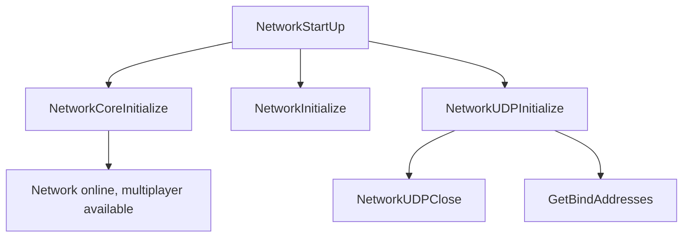

# Networking Overview

Networking refers to the functionality that allows multiple players to connect and interact within the game. This document provides an overview of the key functions and processes involved in the networking aspect of the game.

## Network Initialization

The function <SwmToken path="src/network/network.cpp" pos="1286:2:2" line-data="void NetworkStartUp()">`NetworkStartUp`</SwmToken> initializes the network, making multiplayer functionality available by setting up necessary components and configurations.

<SwmSnippet path="/src/network/network.cpp" line="1285">

---

The <SwmToken path="src/network/network.cpp" pos="1286:2:2" line-data="void NetworkStartUp()">`NetworkStartUp`</SwmToken> function is responsible for launching the network for a given OS. It initializes core components, sets up UDP listeners, and makes the network available for multiplayer.

```c++
/** This tries to launch the network for a given OS */
void NetworkStartUp()
{
	Debug(net, 3, "Starting network");

	/* Network is available */
	_network_available = NetworkCoreInitialize();
	_network_dedicated = false;

	_network_game_info = {};

	NetworkInitialize();
	NetworkUDPInitialize();
	Debug(net, 3, "Network online, multiplayer available");
	NetworkFindBroadcastIPs(&_broadcast_list);
	NetworkHTTPInitialize();
}
```

---

</SwmSnippet>

## Network Core Initialization

The function <SwmToken path="src/network/network.cpp" pos="1291:5:5" line-data="	_network_available = NetworkCoreInitialize();">`NetworkCoreInitialize`</SwmToken> is called within <SwmToken path="src/network/network.cpp" pos="1286:2:2" line-data="void NetworkStartUp()">`NetworkStartUp`</SwmToken> to initialize the core network components.

<SwmSnippet path="/src/network/core/core.cpp" line="24">

---

The <SwmToken path="src/network/core/core.cpp" pos="24:2:2" line-data="bool NetworkCoreInitialize()">`NetworkCoreInitialize`</SwmToken> function handles the initialization of core network components, including loading the Windows socket library if applicable.

```c++
bool NetworkCoreInitialize()
{
/* Let's load the network in windows */
#ifdef _WIN32
	{
		WSADATA wsa;
		Debug(net, 5, "Loading windows socket library");
		if (WSAStartup(MAKEWORD(2, 0), &wsa) != 0) {
			Debug(net, 0, "WSAStartup failed, network unavailable");
			return false;
		}
	}
#endif /* _WIN32 */

	return true;
}
```

---

</SwmSnippet>

## UDP Initialization

The function <SwmToken path="src/network/network.cpp" pos="1297:1:1" line-data="	NetworkUDPInitialize();">`NetworkUDPInitialize`</SwmToken> sets up the UDP listeners, which are essential for handling certain types of network communication.

<SwmSnippet path="/src/network/network_udp.cpp" line="124">

---

The <SwmToken path="src/network/network_udp.cpp" pos="125:2:2" line-data="void NetworkUDPInitialize()">`NetworkUDPInitialize`</SwmToken> function initializes UDP listeners by closing any existing sockets and setting up new client and server UDP socket handlers.

```c++
/** Initialize the whole UDP bit. */
void NetworkUDPInitialize()
{
	/* If not closed, then do it. */
	if (_udp_server.socket != nullptr) NetworkUDPClose();

	Debug(net, 3, "Initializing UDP listeners");
	assert(_udp_client.socket == nullptr && _udp_server.socket == nullptr);

	_udp_client.socket = new ClientNetworkUDPSocketHandler();

	NetworkAddressList server;
	GetBindAddresses(&server, _settings_client.network.server_port);
	_udp_server.socket = new ServerNetworkUDPSocketHandler(&server);

	_network_udp_server = false;
	_network_udp_broadcast = 0;
}
```

---

</SwmSnippet>

## Sending Data

The function <SwmToken path="src/network/network.cpp" pos="1066:4:4" line-data="static void NetworkSend()">`NetworkSend`</SwmToken> is responsible for sending all buffered commands over the network, handling both server and client scenarios.

<SwmSnippet path="/src/network/network.cpp" line="1065">

---

The <SwmToken path="src/network/network.cpp" pos="1066:4:4" line-data="static void NetworkSend()">`NetworkSend`</SwmToken> function sends all buffered commands, differentiating between server and client scenarios.

```c++
/* This sends all buffered commands (if possible) */
static void NetworkSend()
{
	if (_network_server) {
		ServerNetworkAdminSocketHandler::Send();
		ServerNetworkGameSocketHandler::Send();
	} else {
		ClientNetworkGameSocketHandler::Send();
	}
	NetworkGameSocketHandler::ProcessDeferredDeletions();
}
```

---

</SwmSnippet>

## Receiving Data

The function <SwmToken path="src/network/network.cpp" pos="1052:4:4" line-data="static bool NetworkReceive()">`NetworkReceive`</SwmToken> is responsible for receiving data from the network, handling both server and client scenarios.

<SwmSnippet path="/src/network/network.cpp" line="1282">

---

The <SwmToken path="src/network/network.cpp" pos="1052:4:4" line-data="static bool NetworkReceive()">`NetworkReceive`</SwmToken> function is called to handle incoming data from the network.

```c++
	NetworkSend();
}
```

---

</SwmSnippet>

## Networking Endpoints

Networking endpoints are specific functions that handle requests and data transfers between the client and server.

### <SwmToken path="src/network/network_content.cpp" pos="188:4:4" line-data="void ClientNetworkContentSocketHandler::RequestContentList(ContentType type)">`RequestContentList`</SwmToken>

The <SwmToken path="src/network/network_content.cpp" pos="188:4:4" line-data="void ClientNetworkContentSocketHandler::RequestContentList(ContentType type)">`RequestContentList`</SwmToken> function is used to request a list of content from the server. It can request content based on type, a specific number of content <SwmToken path="src/network/network_content.cpp" pos="227:23:23" line-data=" * Request the content list for a given number of content IDs.">`IDs`</SwmToken>, or a list of content.

<SwmSnippet path="/src/network/network_content.cpp" line="188">

---

The <SwmToken path="src/network/network_content.cpp" pos="188:4:4" line-data="void ClientNetworkContentSocketHandler::RequestContentList(ContentType type)">`RequestContentList`</SwmToken> function connects to the server and sends a request for a list of content based on the specified type.

```c++
void ClientNetworkContentSocketHandler::RequestContentList(ContentType type)
{
	if (type == CONTENT_TYPE_END) {
		this->RequestContentList(CONTENT_TYPE_BASE_GRAPHICS);
		this->RequestContentList(CONTENT_TYPE_BASE_MUSIC);
		this->RequestContentList(CONTENT_TYPE_BASE_SOUNDS);
		this->RequestContentList(CONTENT_TYPE_SCENARIO);
		this->RequestContentList(CONTENT_TYPE_HEIGHTMAP);
		this->RequestContentList(CONTENT_TYPE_AI);
		this->RequestContentList(CONTENT_TYPE_AI_LIBRARY);
		this->RequestContentList(CONTENT_TYPE_GAME);
		this->RequestContentList(CONTENT_TYPE_GAME_LIBRARY);
		this->RequestContentList(CONTENT_TYPE_NEWGRF);
		return;
	}

	this->Connect();

	auto p = std::make_unique<Packet>(this, PACKET_CONTENT_CLIENT_INFO_LIST);
	p->Send_uint8 ((uint8_t)type);
	p->Send_uint32(0xffffffff);
```

---

</SwmSnippet>

### <SwmToken path="src/network/network_content.cpp" pos="305:4:4" line-data="void ClientNetworkContentSocketHandler::DownloadSelectedContent(uint &amp;files, uint &amp;bytes, bool fallback)">`DownloadSelectedContent`</SwmToken>

The <SwmToken path="src/network/network_content.cpp" pos="305:4:4" line-data="void ClientNetworkContentSocketHandler::DownloadSelectedContent(uint &amp;files, uint &amp;bytes, bool fallback)">`DownloadSelectedContent`</SwmToken> function initiates the download of selected content. It handles the actual downloading process, including the number of files and bytes to be downloaded.

<SwmSnippet path="/src/network/network_content.cpp" line="305">

---

The <SwmToken path="src/network/network_content.cpp" pos="305:4:4" line-data="void ClientNetworkContentSocketHandler::DownloadSelectedContent(uint &amp;files, uint &amp;bytes, bool fallback)">`DownloadSelectedContent`</SwmToken> function processes the selected content, calculates the total bytes to be downloaded, and initiates the download process.

```c++
void ClientNetworkContentSocketHandler::DownloadSelectedContent(uint &files, uint &bytes, bool fallback)
{
	bytes = 0;

	ContentIDList content;
	for (const ContentInfo *ci : this->infos) {
		if (!ci->IsSelected() || ci->state == ContentInfo::ALREADY_HERE) continue;

		content.push_back(ci->id);
		bytes += ci->filesize;
	}

	files = (uint)content.size();

	/* If there's nothing to download, do nothing. */
	if (files == 0) return;

	this->isCancelled = false;

	if (fallback) {
```

---

</SwmSnippet>

&nbsp;

*This is an auto-generated document by Swimm AI 🌊 and has not yet been verified by a human*

<SwmMeta version="3.0.0" repo-id="Z2l0aHViJTNBJTNBT3BlblRURC1jb3BpbG90LWRlbW8lM0ElM0Fzd2ltbWlv" repo-name="OpenTTD-copilot-demo"><sup>Powered by [Swimm](/)</sup></SwmMeta>
