```mermaid
classDiagram
    ScriptEvent <|-- ScriptEventVehicleCrashed
    ScriptEvent <|-- ScriptEventSubsidyAwarded
    ScriptEvent <|-- ScriptEventCompanyNew
    ScriptEvent <|-- ScriptEventIndustryOpen
    ScriptEventVehicleCrashed : +CrashReason crash_reason
    ScriptEventVehicleCrashed : +Vehicle vehicle
    ScriptEventVehicleCrashed : +CrashSite crash_site
    ScriptEventSubsidyAwarded : +SubsidyID subsidy_id
    ScriptEventCompanyNew : +Owner owner
    ScriptEventIndustryOpen : +IndustryID industry_id

%% Swimm:
%% classDiagram
%%     <SwmToken path="src/script/api/script_event_types.hpp" pos="22:8:8" line-data="class ScriptEventVehicleCrashed : public ScriptEvent {">`ScriptEvent`</SwmToken> <|-- <SwmToken path="src/script/api/script_event_types.hpp" pos="22:2:2" line-data="class ScriptEventVehicleCrashed : public ScriptEvent {">`ScriptEventVehicleCrashed`</SwmToken>
%%     <SwmToken path="src/script/api/script_event_types.hpp" pos="22:8:8" line-data="class ScriptEventVehicleCrashed : public ScriptEvent {">`ScriptEvent`</SwmToken> <|-- <SwmToken path="src/script/api/script_event_types.hpp" pos="160:2:2" line-data="class ScriptEventSubsidyAwarded : public ScriptEvent {">`ScriptEventSubsidyAwarded`</SwmToken>
%%     <SwmToken path="src/script/api/script_event_types.hpp" pos="22:8:8" line-data="class ScriptEventVehicleCrashed : public ScriptEvent {">`ScriptEvent`</SwmToken> <|-- <SwmToken path="src/script/api/script_event_types.hpp" pos="320:2:2" line-data="class ScriptEventCompanyNew : public ScriptEvent {">`ScriptEventCompanyNew`</SwmToken>
%%     <SwmToken path="src/script/api/script_event_types.hpp" pos="22:8:8" line-data="class ScriptEventVehicleCrashed : public ScriptEvent {">`ScriptEvent`</SwmToken> <|-- <SwmToken path="src/script/api/script_event_types.hpp" pos="615:2:2" line-data="class ScriptEventIndustryOpen : public ScriptEvent {">`ScriptEventIndustryOpen`</SwmToken>
%%     <SwmToken path="src/script/api/script_event_types.hpp" pos="22:2:2" line-data="class ScriptEventVehicleCrashed : public ScriptEvent {">`ScriptEventVehicleCrashed`</SwmToken> : +CrashReason <SwmToken path="src/script/api/script_event_types.hpp" pos="40:6:6" line-data="	 * @param crash_reason The reason why the vehicle crashed.">`crash_reason`</SwmToken>
%%     <SwmToken path="src/script/api/script_event_types.hpp" pos="22:2:2" line-data="class ScriptEventVehicleCrashed : public ScriptEvent {">`ScriptEventVehicleCrashed`</SwmToken> : +Vehicle vehicle
%%     <SwmToken path="src/script/api/script_event_types.hpp" pos="22:2:2" line-data="class ScriptEventVehicleCrashed : public ScriptEvent {">`ScriptEventVehicleCrashed`</SwmToken> : +CrashSite <SwmToken path="src/script/api/script_event_types.hpp" pos="39:6:6" line-data="	 * @param crash_site Where the vehicle crashed.">`crash_site`</SwmToken>
%%     <SwmToken path="src/script/api/script_event_types.hpp" pos="160:2:2" line-data="class ScriptEventSubsidyAwarded : public ScriptEvent {">`ScriptEventSubsidyAwarded`</SwmToken> : +SubsidyID <SwmToken path="src/script/api/script_event_types.hpp" pos="164:6:6" line-data="	 * @param subsidy_id The index of this subsidy in the _subsidies array.">`subsidy_id`</SwmToken>
%%     <SwmToken path="src/script/api/script_event_types.hpp" pos="320:2:2" line-data="class ScriptEventCompanyNew : public ScriptEvent {">`ScriptEventCompanyNew`</SwmToken> : +Owner owner
%%     <SwmToken path="src/script/api/script_event_types.hpp" pos="615:2:2" line-data="class ScriptEventIndustryOpen : public ScriptEvent {">`ScriptEventIndustryOpen`</SwmToken> : +IndustryID <SwmToken path="src/script/api/script_event_types.hpp" pos="619:6:6" line-data="	 * @param industry_id The new industry.">`industry_id`</SwmToken>
```

# What are Event Types in API

Event Types are specific events that occur within the game, each represented by a class inheriting from <SwmToken path="src/script/api/script_event_types.hpp" pos="22:8:8" line-data="class ScriptEventVehicleCrashed : public ScriptEvent {">`ScriptEvent`</SwmToken>. These events include various <SwmToken path="src/industry_cmd.cpp" pos="70:7:9" line-data="IndustryBuildData _industry_builder; ///&lt; In-game manager of industries.">`In-game`</SwmToken> occurrences such as vehicle crashes, subsidy offers, company mergers, and new industry openings.

# Event Classes

Each event type class, such as <SwmToken path="src/script/api/script_event_types.hpp" pos="22:2:2" line-data="class ScriptEventVehicleCrashed : public ScriptEvent {">`ScriptEventVehicleCrashed`</SwmToken>, contains data members specific to that event and inherits from <SwmToken path="src/script/api/script_event_types.hpp" pos="22:8:8" line-data="class ScriptEventVehicleCrashed : public ScriptEvent {">`ScriptEvent`</SwmToken>. These classes provide methods to convert generic <SwmToken path="src/script/api/script_event_types.hpp" pos="22:8:8" line-data="class ScriptEventVehicleCrashed : public ScriptEvent {">`ScriptEvent`</SwmToken> instances to specific event types and to retrieve the stored information.

<SwmSnippet path="/src/script/api/script_event_types.hpp" line="22">

---

The <SwmToken path="src/script/api/script_event_types.hpp" pos="22:2:2" line-data="class ScriptEventVehicleCrashed : public ScriptEvent {">`ScriptEventVehicleCrashed`</SwmToken> class represents a vehicle crash event. It contains details such as the crash site, the crashed vehicle, and the reason for the crash.

```c++
class ScriptEventVehicleCrashed : public ScriptEvent {
public:
	/**
	 * The reasons for vehicle crashes
	 */
	enum CrashReason {
		CRASH_TRAIN,                ///< Two trains collided
		CRASH_RV_LEVEL_CROSSING,    ///< Road vehicle got under a train
		CRASH_RV_UFO,               ///< Road vehicle got under a landing ufo
		CRASH_PLANE_LANDING,        ///< Plane crashed on landing
		CRASH_AIRCRAFT_NO_AIRPORT,  ///< Aircraft crashed after it found not a single airport for landing
		CRASH_FLOODED,              ///< Vehicle was flooded
	};
```

---

</SwmSnippet>

# Broadcasting Events

Events like <SwmToken path="src/script/api/script_event_types.hpp" pos="615:2:2" line-data="class ScriptEventIndustryOpen : public ScriptEvent {">`ScriptEventIndustryOpen`</SwmToken> are broadcasted using <SwmToken path="src/industry_cmd.cpp" pos="1746:1:3" line-data="	AI::BroadcastNewEvent(new ScriptEventIndustryOpen(ind-&gt;index));">`AI::BroadcastNewEvent`</SwmToken> and <SwmToken path="src/industry_cmd.cpp" pos="1747:1:3" line-data="	Game::NewEvent(new ScriptEventIndustryOpen(ind-&gt;index));">`Game::NewEvent`</SwmToken> when a new industry is created.

<SwmSnippet path="/src/industry_cmd.cpp" line="1745">

---

The code snippet shows how a new industry event is broadcasted using <SwmToken path="src/industry_cmd.cpp" pos="1746:1:3" line-data="	AI::BroadcastNewEvent(new ScriptEventIndustryOpen(ind-&gt;index));">`AI::BroadcastNewEvent`</SwmToken> and <SwmToken path="src/industry_cmd.cpp" pos="1747:1:3" line-data="	Game::NewEvent(new ScriptEventIndustryOpen(ind-&gt;index));">`Game::NewEvent`</SwmToken>.

```c++
	AddIndustryNewsItem(ind_spc->new_industry_text, NT_INDUSTRY_OPEN, ind->index);
	AI::BroadcastNewEvent(new ScriptEventIndustryOpen(ind->index));
	Game::NewEvent(new ScriptEventIndustryOpen(ind->index));
}
```

---

</SwmSnippet>

# Retrieving Event Information

Methods like <SwmToken path="src/script/api/script_event_types.hpp" pos="638:3:3" line-data="	IndustryID GetIndustryID() { return this-&gt;industry_id; }">`GetIndustryID`</SwmToken> in <SwmToken path="src/script/api/script_event_types.hpp" pos="615:2:2" line-data="class ScriptEventIndustryOpen : public ScriptEvent {">`ScriptEventIndustryOpen`</SwmToken> are used to retrieve specific information stored in the event.

<SwmSnippet path="/src/script/api/script_event_types.hpp" line="627">

---

The <SwmToken path="src/script/api/script_event_types.hpp" pos="628:3:3" line-data="	 * Convert an ScriptEvent to the real instance.">`Convert`</SwmToken> method converts a generic <SwmToken path="src/script/api/script_event_types.hpp" pos="628:7:7" line-data="	 * Convert an ScriptEvent to the real instance.">`ScriptEvent`</SwmToken> instance to a <SwmToken path="src/script/api/script_event_types.hpp" pos="632:3:3" line-data="	static ScriptEventIndustryOpen *Convert(ScriptEvent *instance) { return (ScriptEventIndustryOpen *)instance; }">`ScriptEventIndustryOpen`</SwmToken> instance, and <SwmToken path="src/script/api/script_event_types.hpp" pos="638:3:3" line-data="	IndustryID GetIndustryID() { return this-&gt;industry_id; }">`GetIndustryID`</SwmToken> retrieves the ID of the new industry.

```c++
	/**
	 * Convert an ScriptEvent to the real instance.
	 * @param instance The instance to convert.
	 * @return The converted instance.
	 */
	static ScriptEventIndustryOpen *Convert(ScriptEvent *instance) { return (ScriptEventIndustryOpen *)instance; }

	/**
	 * Get the IndustryID of the new industry.
	 * @return The IndustryID of the industry.
	 */
	IndustryID GetIndustryID() { return this->industry_id; }
```

---

</SwmSnippet>

# Main Functions

There are several main functions in this folder. Some of them are <SwmToken path="src/script/api/script_event_types.hpp" pos="22:2:2" line-data="class ScriptEventVehicleCrashed : public ScriptEvent {">`ScriptEventVehicleCrashed`</SwmToken>, <SwmToken path="src/script/api/script_event_types.hpp" pos="160:2:2" line-data="class ScriptEventSubsidyAwarded : public ScriptEvent {">`ScriptEventSubsidyAwarded`</SwmToken>, <SwmToken path="src/script/api/script_event_types.hpp" pos="320:2:2" line-data="class ScriptEventCompanyNew : public ScriptEvent {">`ScriptEventCompanyNew`</SwmToken>, and <SwmToken path="src/script/api/script_event_types.hpp" pos="615:2:2" line-data="class ScriptEventIndustryOpen : public ScriptEvent {">`ScriptEventIndustryOpen`</SwmToken>. We will dive a little into <SwmToken path="src/script/api/script_event_types.hpp" pos="22:2:2" line-data="class ScriptEventVehicleCrashed : public ScriptEvent {">`ScriptEventVehicleCrashed`</SwmToken> and <SwmToken path="src/script/api/script_event_types.hpp" pos="160:2:2" line-data="class ScriptEventSubsidyAwarded : public ScriptEvent {">`ScriptEventSubsidyAwarded`</SwmToken>.

## <SwmToken path="src/script/api/script_event_types.hpp" pos="22:2:2" line-data="class ScriptEventVehicleCrashed : public ScriptEvent {">`ScriptEventVehicleCrashed`</SwmToken>

<SwmToken path="src/script/api/script_event_types.hpp" pos="22:2:2" line-data="class ScriptEventVehicleCrashed : public ScriptEvent {">`ScriptEventVehicleCrashed`</SwmToken> indicates a vehicle crash event. It contains details such as the crash site, the crashed vehicle, and the reason for the crash. This event is used to notify the game and AI about vehicle crashes, allowing them to respond appropriately.

<SwmSnippet path="/src/script/api/script_event_types.hpp" line="17">

---

The <SwmToken path="src/script/api/script_event_types.hpp" pos="22:2:2" line-data="class ScriptEventVehicleCrashed : public ScriptEvent {">`ScriptEventVehicleCrashed`</SwmToken> class definition includes an enumeration of crash reasons and data members for the crash site and vehicle.

```c++
/**
 * Event Vehicle Crash, indicating a vehicle of yours is crashed.
 *  It contains the crash site, the crashed vehicle and the reason for the crash.
 * @api ai game
 */
class ScriptEventVehicleCrashed : public ScriptEvent {
public:
	/**
	 * The reasons for vehicle crashes
	 */
	enum CrashReason {
		CRASH_TRAIN,                ///< Two trains collided
		CRASH_RV_LEVEL_CROSSING,    ///< Road vehicle got under a train
		CRASH_RV_UFO,               ///< Road vehicle got under a landing ufo
		CRASH_PLANE_LANDING,        ///< Plane crashed on landing
		CRASH_AIRCRAFT_NO_AIRPORT,  ///< Aircraft crashed after it found not a single airport for landing
		CRASH_FLOODED,              ///< Vehicle was flooded
	};

#ifndef DOXYGEN_API
	/**
```

---

</SwmSnippet>

## <SwmToken path="src/script/api/script_event_types.hpp" pos="160:2:2" line-data="class ScriptEventSubsidyAwarded : public ScriptEvent {">`ScriptEventSubsidyAwarded`</SwmToken>

<SwmToken path="src/script/api/script_event_types.hpp" pos="160:2:2" line-data="class ScriptEventSubsidyAwarded : public ScriptEvent {">`ScriptEventSubsidyAwarded`</SwmToken> indicates that a subsidy has been awarded to a company. It contains the ID of the awarded subsidy. This event is used to notify the game and AI about the awarding of subsidies, enabling them to take advantage of the financial benefits.

<SwmSnippet path="/src/script/api/script_event_types.hpp" line="156">

---

The <SwmToken path="src/script/api/script_event_types.hpp" pos="160:2:2" line-data="class ScriptEventSubsidyAwarded : public ScriptEvent {">`ScriptEventSubsidyAwarded`</SwmToken> class definition includes the subsidy ID and a constructor to initialize it.

```c++
/**
 * Event Subsidy Awarded, indicating a subsidy is awarded to some company.
 * @api ai game
 */
class ScriptEventSubsidyAwarded : public ScriptEvent {
public:
#ifndef DOXYGEN_API
	/**
	 * @param subsidy_id The index of this subsidy in the _subsidies array.
	 */
	ScriptEventSubsidyAwarded(SubsidyID subsidy_id) :
		ScriptEvent(ET_SUBSIDY_AWARDED),
		subsidy_id(subsidy_id)
	{}
```

---

</SwmSnippet>

## <SwmToken path="src/script/api/script_event_types.hpp" pos="320:2:2" line-data="class ScriptEventCompanyNew : public ScriptEvent {">`ScriptEventCompanyNew`</SwmToken>

<SwmToken path="src/script/api/script_event_types.hpp" pos="320:2:2" line-data="class ScriptEventCompanyNew : public ScriptEvent {">`ScriptEventCompanyNew`</SwmToken> indicates the creation of a new company. It contains the ID of the new company. This event is used to notify the game and AI about the formation of new companies, allowing them to interact with or compete against these new entities.

<SwmSnippet path="/src/script/api/script_event_types.hpp" line="316">

---

The <SwmToken path="src/script/api/script_event_types.hpp" pos="320:2:2" line-data="class ScriptEventCompanyNew : public ScriptEvent {">`ScriptEventCompanyNew`</SwmToken> class definition includes the company owner ID and a constructor to initialize it.

```c++
/**
 * Event Company New, indicating a new company has been created.
 * @api ai game
 */
class ScriptEventCompanyNew : public ScriptEvent {
public:
#ifndef DOXYGEN_API
	/**
	 * @param owner The new company.
	 */
	ScriptEventCompanyNew(Owner owner) :
		ScriptEvent(ET_COMPANY_NEW),
		owner((ScriptCompany::CompanyID)owner)
	{}
```

---

</SwmSnippet>

## <SwmToken path="src/script/api/script_event_types.hpp" pos="615:2:2" line-data="class ScriptEventIndustryOpen : public ScriptEvent {">`ScriptEventIndustryOpen`</SwmToken>

<SwmToken path="src/script/api/script_event_types.hpp" pos="615:2:2" line-data="class ScriptEventIndustryOpen : public ScriptEvent {">`ScriptEventIndustryOpen`</SwmToken> indicates the opening of a new industry. It contains the ID of the new industry. This event is used to notify the game and AI about new industrial opportunities, enabling them to plan and optimize their transport routes accordingly.

<SwmSnippet path="/src/script/api/script_event_types.hpp" line="611">

---

The <SwmToken path="src/script/api/script_event_types.hpp" pos="615:2:2" line-data="class ScriptEventIndustryOpen : public ScriptEvent {">`ScriptEventIndustryOpen`</SwmToken> class definition includes the industry ID and a constructor to initialize it.

```c++
/**
 * Event Industry Open, indicating a new industry has been created.
 * @api ai game
 */
class ScriptEventIndustryOpen : public ScriptEvent {
public:
#ifndef DOXYGEN_API
	/**
	 * @param industry_id The new industry.
	 */
	ScriptEventIndustryOpen(IndustryID industry_id) :
		ScriptEvent(ET_INDUSTRY_OPEN),
		industry_id(industry_id)
	{}
```

---

</SwmSnippet>

&nbsp;

*This is an auto-generated document by Swimm AI 🌊 and has not yet been verified by a human*

<SwmMeta version="3.0.0" repo-id="Z2l0aHViJTNBJTNBT3BlblRURC1jb3BpbG90LWRlbW8lM0ElM0Fzd2ltbWlv" repo-name="OpenTTD-copilot-demo"><sup>Powered by [Swimm](/)</sup></SwmMeta>
