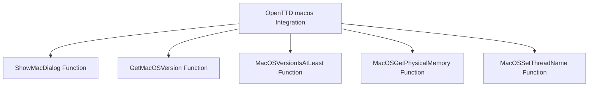

# Introduction to <SwmToken path="src/os/macosx/macos.h" pos="8:5:5" line-data="/** @file macos.h Functions related to MacOS support. */">`macos`</SwmToken> Integration

<SwmToken path="src/os/macosx/macos.h" pos="8:5:5" line-data="/** @file macos.h Functions related to MacOS support. */">`macos`</SwmToken> integration in the <SwmToken path="src/os/macosx/macos.h" pos="2:13:13" line-data=" * This file is part of OpenTTD.">`OpenTTD`</SwmToken> project ensures that the game runs smoothly on <SwmToken path="src/os/macosx/macos.h" pos="8:5:5" line-data="/** @file macos.h Functions related to MacOS support. */">`macos`</SwmToken> by providing various helper functions and utilities to interact with macOS-specific features and APIs. This document covers the main functionalities provided for <SwmToken path="src/os/macosx/macos.h" pos="8:5:5" line-data="/** @file macos.h Functions related to MacOS support. */">`macos`</SwmToken> integration.

# <SwmToken path="src/os/macosx/macos.h" pos="14:2:2" line-data="void ShowMacDialog(const char *title, const char *message, const char *button_label);">`ShowMacDialog`</SwmToken> Function

The <SwmToken path="src/os/macosx/macos.h" pos="14:2:2" line-data="void ShowMacDialog(const char *title, const char *message, const char *button_label);">`ShowMacDialog`</SwmToken> function is used to display system dialog messages on <SwmToken path="src/os/macosx/macos.h" pos="8:5:5" line-data="/** @file macos.h Functions related to MacOS support. */">`macos`</SwmToken>. It can use Cocoa for graphical dialogs or the console for text-based dialogs.

<SwmSnippet path="/src/os/macosx/macos.h" line="13">

---

The <SwmToken path="src/os/macosx/macos.h" pos="14:2:2" line-data="void ShowMacDialog(const char *title, const char *message, const char *button_label);">`ShowMacDialog`</SwmToken> function signature shows how it takes a title, message, and button label to display a dialog.

```c
/** Helper function displaying a message the best possible way. */
void ShowMacDialog(const char *title, const char *message, const char *button_label);
```

---

</SwmSnippet>

# <SwmToken path="src/os/macosx/macos.h" pos="16:2:2" line-data="void GetMacOSVersion(int *return_major, int *return_minor, int *return_bugfix);">`GetMacOSVersion`</SwmToken> Function

The <SwmToken path="src/os/macosx/macos.h" pos="16:2:2" line-data="void GetMacOSVersion(int *return_major, int *return_minor, int *return_bugfix);">`GetMacOSVersion`</SwmToken> function retrieves the current <SwmToken path="src/os/macosx/macos.h" pos="8:5:5" line-data="/** @file macos.h Functions related to MacOS support. */">`macos`</SwmToken> version. This information is crucial for determining compatibility with various <SwmToken path="src/os/macosx/macos.h" pos="8:5:5" line-data="/** @file macos.h Functions related to MacOS support. */">`macos`</SwmToken> features.

<SwmSnippet path="/src/os/macosx/macos.h" line="16">

---

The <SwmToken path="src/os/macosx/macos.h" pos="16:2:2" line-data="void GetMacOSVersion(int *return_major, int *return_minor, int *return_bugfix);">`GetMacOSVersion`</SwmToken> function signature shows how it takes pointers to return the major, minor, and bugfix version numbers.

```c
void GetMacOSVersion(int *return_major, int *return_minor, int *return_bugfix);
```

---

</SwmSnippet>

# <SwmToken path="src/os/macosx/macos.h" pos="25:4:4" line-data="inline bool MacOSVersionIsAtLeast(long major, long minor, long bugfix)">`MacOSVersionIsAtLeast`</SwmToken> Function

The <SwmToken path="src/os/macosx/macos.h" pos="25:4:4" line-data="inline bool MacOSVersionIsAtLeast(long major, long minor, long bugfix)">`MacOSVersionIsAtLeast`</SwmToken> function checks if the running OS meets the minimum required version for certain features. It calls <SwmToken path="src/os/macosx/macos.h" pos="16:2:2" line-data="void GetMacOSVersion(int *return_major, int *return_minor, int *return_bugfix);">`GetMacOSVersion`</SwmToken> to get the current version and compares it with the provided major, minor, and bugfix version numbers.

<SwmSnippet path="/src/os/macosx/macos.h" line="25">

---

The <SwmToken path="src/os/macosx/macos.h" pos="25:4:4" line-data="inline bool MacOSVersionIsAtLeast(long major, long minor, long bugfix)">`MacOSVersionIsAtLeast`</SwmToken> function implementation shows how it compares the current <SwmToken path="src/os/macosx/macos.h" pos="8:5:5" line-data="/** @file macos.h Functions related to MacOS support. */">`macos`</SwmToken> version with the specified version.

```c
inline bool MacOSVersionIsAtLeast(long major, long minor, long bugfix)
{
	int version_major, version_minor, version_bugfix;
	GetMacOSVersion(&version_major, &version_minor, &version_bugfix);

	if (version_major < major) return false;
	if (version_major == major && version_minor < minor) return false;
	if (version_major == major && version_minor == minor && version_bugfix < bugfix) return false;

	return true;
}
```

---

</SwmSnippet>

# <SwmToken path="src/os/macosx/macos.mm" pos="257:2:2" line-data="uint64_t MacOSGetPhysicalMemory()">`MacOSGetPhysicalMemory`</SwmToken> Function

The <SwmToken path="src/os/macosx/macos.mm" pos="257:2:2" line-data="uint64_t MacOSGetPhysicalMemory()">`MacOSGetPhysicalMemory`</SwmToken> function returns the amount of physical memory available on the system. This function is important for performance tuning and resource management within the application.

<SwmSnippet path="/src/os/macosx/macos.mm" line="257">

---

The <SwmToken path="src/os/macosx/macos.mm" pos="257:2:2" line-data="uint64_t MacOSGetPhysicalMemory()">`MacOSGetPhysicalMemory`</SwmToken> function implementation shows how it uses the <SwmToken path="src/os/macosx/macos.mm" pos="259:7:7" line-data="	return [ [ NSProcessInfo processInfo ] physicalMemory ];">`NSProcessInfo`</SwmToken> class to get the physical memory.

```objective-c++
uint64_t MacOSGetPhysicalMemory()
{
	return [ [ NSProcessInfo processInfo ] physicalMemory ];
}
```

---

</SwmSnippet>

# <SwmToken path="src/os/macosx/macos.mm" pos="245:2:2" line-data="void MacOSSetThreadName(const char *name)">`MacOSSetThreadName`</SwmToken> Function

The <SwmToken path="src/os/macosx/macos.mm" pos="245:2:2" line-data="void MacOSSetThreadName(const char *name)">`MacOSSetThreadName`</SwmToken> function sets the name of the current thread for debugging purposes. It uses <SwmToken path="src/os/macosx/macos.mm" pos="248:1:1" line-data="		pthread_setname_np(name);">`pthread_setname_np`</SwmToken> if the <SwmToken path="src/os/macosx/macos.h" pos="8:5:5" line-data="/** @file macos.h Functions related to MacOS support. */">`macos`</SwmToken> version is at least 10.6.0 and also sets the name using <SwmToken path="src/os/macosx/macos.mm" pos="251:1:1" line-data="	NSThread *cur = [ NSThread currentThread ];">`NSThread`</SwmToken>.

<SwmSnippet path="/src/os/macosx/macos.mm" line="245">

---

The <SwmToken path="src/os/macosx/macos.mm" pos="245:2:2" line-data="void MacOSSetThreadName(const char *name)">`MacOSSetThreadName`</SwmToken> function implementation shows how it sets the thread name using both <SwmToken path="src/os/macosx/macos.mm" pos="248:1:1" line-data="		pthread_setname_np(name);">`pthread_setname_np`</SwmToken> and <SwmToken path="src/os/macosx/macos.mm" pos="251:1:1" line-data="	NSThread *cur = [ NSThread currentThread ];">`NSThread`</SwmToken>.

```objective-c++
void MacOSSetThreadName(const char *name)
{
	if (MacOSVersionIsAtLeast(10, 6, 0)) {
		pthread_setname_np(name);
	}

	NSThread *cur = [ NSThread currentThread ];
	if (cur != nil && [ cur respondsToSelector:@selector(setName:) ]) {
		[ cur performSelector:@selector(setName:) withObject:[ NSString stringWithUTF8String:name ] ];
	}
}
```

---

</SwmSnippet>

&nbsp;

*This is an auto-generated document by Swimm AI 🌊 and has not yet been verified by a human*

<SwmMeta version="3.0.0" repo-id="Z2l0aHViJTNBJTNBT3BlblRURC1jb3BpbG90LWRlbW8lM0ElM0Fzd2ltbWlv" repo-name="OpenTTD-copilot-demo"><sup>Powered by [Swimm](/)</sup></SwmMeta>
