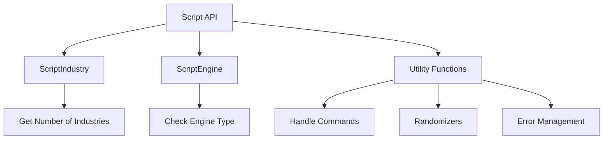

# Overview of Scripting API

The Scripting API provides a comprehensive set of functions and classes that enable interaction with various game elements. It includes classes like <SwmToken path="src/script/api/script_news.hpp" pos="58:25:25" line-data="	 *  - For #NR_INDUSTRY this parameter should be a valid industryID (ScriptIndustry::IsValidIndustry).">`ScriptIndustry`</SwmToken> and <SwmToken path="src/script/api/script_engine.hpp" pos="22:2:2" line-data="class ScriptEngine : public ScriptObject {">`ScriptEngine`</SwmToken>, which handle industry-related and engine-related functions respectively. These classes offer methods to query and manipulate game data, such as getting the number of industries, checking if an engine type is valid, or setting custom text for an industry.

Additionally, the API includes utility functions for handling commands, randomizers, and error management. This facilitates the creation of scripts that can automate and extend game functionality.

# <SwmToken path="src/script/api/script_news.hpp" pos="58:25:25" line-data="	 *  - For #NR_INDUSTRY this parameter should be a valid industryID (ScriptIndustry::IsValidIndustry).">`ScriptIndustry`</SwmToken> Class

The <SwmToken path="src/script/api/script_news.hpp" pos="58:25:25" line-data="	 *  - For #NR_INDUSTRY this parameter should be a valid industryID (ScriptIndustry::IsValidIndustry).">`ScriptIndustry`</SwmToken> class provides methods to interact with industries in the game. For example, it allows you to get the number of industries or set custom text for an industry.

<SwmSnippet path="/src/script/api/script_industry.cpp" line="66">

---

The function <SwmToken path="src/script/api/script_industry.cpp" pos="59:10:10" line-data="/* static */ bool ScriptIndustry::SetText(IndustryID industry_id, Text *text)">`SetText`</SwmToken> in the <SwmToken path="src/script/api/script_news.hpp" pos="58:25:25" line-data="	 *  - For #NR_INDUSTRY this parameter should be a valid industryID (ScriptIndustry::IsValidIndustry).">`ScriptIndustry`</SwmToken> class is used to encode custom text for an industry using the <SwmToken path="src/script/api/script_industry.cpp" pos="66:24:24" line-data="	return ScriptObject::Command&lt;CMD_INDUSTRY_SET_TEXT&gt;::Do(industry_id, text != nullptr ? text-&gt;GetEncodedText() : std::string{});">`GetEncodedText`</SwmToken> method.

```c++
	return ScriptObject::Command<CMD_INDUSTRY_SET_TEXT>::Do(industry_id, text != nullptr ? text->GetEncodedText() : std::string{});
}
```

---

</SwmSnippet>

# <SwmToken path="src/script/api/script_engine.hpp" pos="22:2:2" line-data="class ScriptEngine : public ScriptObject {">`ScriptEngine`</SwmToken> Class

The <SwmToken path="src/script/api/script_engine.hpp" pos="22:2:2" line-data="class ScriptEngine : public ScriptObject {">`ScriptEngine`</SwmToken> class provides methods to interact with engine types in the game. It includes functions to check if an engine type is valid.

<SwmSnippet path="/src/script/api/script_engine.hpp" line="24">

---

The <SwmToken path="src/script/api/script_engine.hpp" pos="31:5:5" line-data="	static bool IsValidEngine(EngineID engine_id);">`IsValidEngine`</SwmToken> function checks whether a given engine type is valid. It ensures that the engine is either currently buildable or has at least one vehicle of this type.

```c++
	/**
	 * Checks whether the given engine type is valid.
	 * An engine is valid for a company if it has at least one vehicle of this engine or it's currently buildable.
	 * @game Outside ScriptCompanyMode scope (ScriptCompanyMode::IsDeity) the function reports all engines valid, which were or will be available at some point.
	 * @param engine_id The engine to check.
	 * @return True if and only if the engine type is valid.
	 */
	static bool IsValidEngine(EngineID engine_id);
```

---

</SwmSnippet>

# Utility Functions

The API also includes various utility functions for handling commands, randomizers, and error management. These functions are essential for creating robust and efficient scripts.

# Handling Text with <SwmToken path="src/script/api/script_industry.cpp" pos="66:24:24" line-data="	return ScriptObject::Command&lt;CMD_INDUSTRY_SET_TEXT&gt;::Do(industry_id, text != nullptr ? text-&gt;GetEncodedText() : std::string{});">`GetEncodedText`</SwmToken>

The function <SwmToken path="src/script/api/script_industry.cpp" pos="66:24:24" line-data="	return ScriptObject::Command&lt;CMD_INDUSTRY_SET_TEXT&gt;::Do(industry_id, text != nullptr ? text-&gt;GetEncodedText() : std::string{});">`GetEncodedText`</SwmToken> converts a <SwmToken path="src/script/api/script_news.hpp" pos="51:36:36" line-data="	 * @param text The text message to show (can be either a raw string, or a ScriptText object).">`ScriptText`</SwmToken> to a normal string, which is essential for handling text within the game scripts.

<SwmSnippet path="/src/script/api/script_league.cpp" line="34">

---

The <SwmToken path="src/script/api/script_league.cpp" pos="35:11:11" line-data="	std::string encoded_title = title-&gt;GetEncodedText();">`GetEncodedText`</SwmToken> function is used within the <SwmToken path="src/script/api/script_engine.hpp" pos="117:7:7" line-data="	 * Get the new cost of an engine.">`new`</SwmToken> method to encode the title, header, and footer of a league table.

```c++
	EnforcePrecondition(LEAGUE_TABLE_INVALID, title != nullptr);
	std::string encoded_title = title->GetEncodedText();
	EnforcePreconditionEncodedText(LEAGUE_TABLE_INVALID, encoded_title);

	std::string encoded_header = (header != nullptr ? header->GetEncodedText() : std::string{});
	std::string encoded_footer = (footer != nullptr ? footer->GetEncodedText() : std::string{});
```

---

</SwmSnippet>

<SwmSnippet path="/src/script/api/script_goal.cpp" line="50">

---

The <SwmToken path="src/script/api/script_goal.cpp" pos="51:11:11" line-data="	std::string text = goal-&gt;GetEncodedText();">`GetEncodedText`</SwmToken> function is used within the <SwmToken path="src/script/api/script_engine.hpp" pos="117:7:7" line-data="	 * Get the new cost of an engine.">`new`</SwmToken> method to encode the goal text.

```c++
	EnforcePrecondition(GOAL_INVALID, goal != nullptr);
	std::string text = goal->GetEncodedText();
	EnforcePreconditionEncodedText(GOAL_INVALID, text);
```

---

</SwmSnippet>

<SwmSnippet path="/src/script/api/script_news.cpp" line="28">

---

The <SwmToken path="src/script/api/script_news.cpp" pos="29:11:11" line-data="	std::string encoded = text-&gt;GetEncodedText();">`GetEncodedText`</SwmToken> function is used within the <SwmToken path="src/script/api/script_news.hpp" pos="49:3:3" line-data="	 * Create a news message for everybody, or for one company.">`Create`</SwmToken> method to encode the news text.

```c++
	EnforcePrecondition(false, text != nullptr);
	std::string encoded = text->GetEncodedText();
	EnforcePreconditionEncodedText(false, encoded);
```

---

</SwmSnippet>

# <SwmToken path="src/script/api/script_news.cpp" pos="23:8:10" line-data="/* static */ bool ScriptNews::Create(NewsType type, Text *text, ScriptCompany::CompanyID company, NewsReferenceType ref_type, SQInteger reference)">`ScriptNews::Create`</SwmToken>

The <SwmToken path="src/script/api/script_news.cpp" pos="23:8:10" line-data="/* static */ bool ScriptNews::Create(NewsType type, Text *text, ScriptCompany::CompanyID company, NewsReferenceType ref_type, SQInteger reference)">`ScriptNews::Create`</SwmToken> function is used to create a news message in the game. It allows specifying the type of news, the text message, the company it is for, and the referenced game element. This function is essential for generating in-game notifications and updates.

<SwmSnippet path="/src/script/api/script_news.hpp" line="48">

---

The <SwmToken path="src/script/api/script_news.cpp" pos="23:8:10" line-data="/* static */ bool ScriptNews::Create(NewsType type, Text *text, ScriptCompany::CompanyID company, NewsReferenceType ref_type, SQInteger reference)">`ScriptNews::Create`</SwmToken> function definition includes parameters for the type of news, the text message, the company, and the referenced game element.

```c++
	/**
	 * Create a news message for everybody, or for one company.
	 * @param type The type of the news.
	 * @param text The text message to show (can be either a raw string, or a ScriptText object).
	 * @param company The company, or COMPANY_INVALID for all companies.
	 * @param ref_type Type of referred game element.
	 * @param reference The referenced game element of \a ref_type.
	 *  - For #NR_NONE this parameter is ignored.
	 *  - For #NR_TILE this parameter should be a valid location (ScriptMap::IsValidTile).
	 *  - For #NR_STATION this parameter should be a valid stationID (ScriptStation::IsValidStation).
	 *  - For #NR_INDUSTRY this parameter should be a valid industryID (ScriptIndustry::IsValidIndustry).
	 *  - For #NR_TOWN this parameter should be a valid townID (ScriptTown::IsValidTown).
	 * @return True if the action succeeded.
	 * @pre type must be #NT_ECONOMY, #NT_SUBSIDIES, or #NT_GENERAL.
	 * @pre text != null.
	 * @pre company == COMPANY_INVALID || ResolveCompanyID(company) != COMPANY_INVALID.
	 * @pre The \a reference condition must be fulfilled.
	 * @pre ScriptCompanyMode::IsDeity().
	 */
	static bool Create(NewsType type, Text *text, ScriptCompany::CompanyID company, NewsReferenceType ref_type, SQInteger reference);
```

---

</SwmSnippet>

&nbsp;

*This is an auto-generated document by Swimm AI 🌊 and has not yet been verified by a human*

<SwmMeta version="3.0.0" repo-id="Z2l0aHViJTNBJTNBT3BlblRURC1jb3BpbG90LWRlbW8lM0ElM0Fzd2ltbWlv" repo-name="OpenTTD-copilot-demo"><sup>Powered by [Swimm](/)</sup></SwmMeta>
