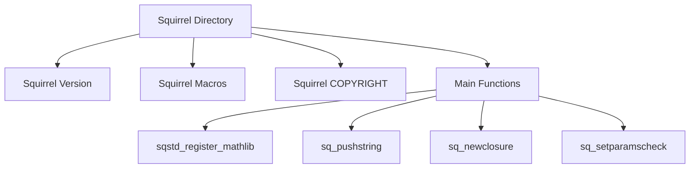

# Squirrel Directory

The <SwmPath>[src/3rdparty/squirrel/](src/3rdparty/squirrel/)</SwmPath> directory contains the core files for the Squirrel programming language, including headers and source files that define its functionality.

# Squirrel Version

The version of Squirrel used is <SwmToken path="src/3rdparty/squirrel/include/squirrel.h" pos="74:8:12" line-data="#define SQUIRREL_VERSION	&quot;Squirrel 2.2.5 stable - With custom OpenTTD modifications&quot;">`2.2.5`</SwmToken>, with custom modifications specific to <SwmToken path="src/3rdparty/squirrel/include/squirrel.h" pos="74:22:22" line-data="#define SQUIRREL_VERSION	&quot;Squirrel 2.2.5 stable - With custom OpenTTD modifications&quot;">`OpenTTD`</SwmToken>.

# Squirrel Macros

The <SwmPath>[src/3rdparty/squirrel/include/squirrel.h](src/3rdparty/squirrel/include/squirrel.h)</SwmPath> file includes various macros that are essential for the Squirrel language, such as <SwmToken path="src/3rdparty/squirrel/include/squirrel.h" pos="30:3:3" line-data="#ifndef _SQUIRREL_H_">`_SQUIRREL_H_`</SwmToken>.

<SwmSnippet path="/src/3rdparty/squirrel/include/squirrel.h" line="30">

---

The macro <SwmToken path="src/3rdparty/squirrel/include/squirrel.h" pos="30:3:3" line-data="#ifndef _SQUIRREL_H_">`_SQUIRREL_H_`</SwmToken> is defined in the <SwmPath>[src/3rdparty/squirrel/include/squirrel.h](src/3rdparty/squirrel/include/squirrel.h)</SwmPath> file.

```c
#ifndef _SQUIRREL_H_
#define _SQUIRREL_H_
```

---

</SwmSnippet>

<SwmSnippet path="/src/3rdparty/squirrel/include/squirrel.h" line="75">

---

The COPYRIGHT information is defined in the <SwmPath>[src/3rdparty/squirrel/include/squirrel.h](src/3rdparty/squirrel/include/squirrel.h)</SwmPath> file.

```c
#define SQUIRREL_COPYRIGHT	"Copyright (C) 2003-2010 Alberto Demichelis"
```

---

</SwmSnippet>

# Main Functions

There are several main functions in Squirrel. Some of them are <SwmToken path="src/3rdparty/squirrel/sqstdlib/sqstdmath.cpp" pos="98:2:2" line-data="SQRESULT sqstd_register_mathlib(HSQUIRRELVM v)">`sqstd_register_mathlib`</SwmToken>, <SwmToken path="src/3rdparty/squirrel/sqstdlib/sqstdmath.cpp" pos="102:1:1" line-data="		sq_pushstring(v,mathlib_funcs[i].name,-1);">`sq_pushstring`</SwmToken>, <SwmToken path="src/3rdparty/squirrel/sqstdlib/sqstdmath.cpp" pos="103:1:1" line-data="		sq_newclosure(v,mathlib_funcs[i].f,0);">`sq_newclosure`</SwmToken>, and <SwmToken path="src/3rdparty/squirrel/sqstdlib/sqstdmath.cpp" pos="104:1:1" line-data="		sq_setparamscheck(v,mathlib_funcs[i].nparamscheck,mathlib_funcs[i].typemask);">`sq_setparamscheck`</SwmToken>. We will dive a little into <SwmToken path="src/3rdparty/squirrel/sqstdlib/sqstdmath.cpp" pos="98:2:2" line-data="SQRESULT sqstd_register_mathlib(HSQUIRRELVM v)">`sqstd_register_mathlib`</SwmToken> and <SwmToken path="src/3rdparty/squirrel/sqstdlib/sqstdmath.cpp" pos="102:1:1" line-data="		sq_pushstring(v,mathlib_funcs[i].name,-1);">`sq_pushstring`</SwmToken>.

## <SwmToken path="src/3rdparty/squirrel/sqstdlib/sqstdmath.cpp" pos="98:2:2" line-data="SQRESULT sqstd_register_mathlib(HSQUIRRELVM v)">`sqstd_register_mathlib`</SwmToken>

The <SwmToken path="src/3rdparty/squirrel/sqstdlib/sqstdmath.cpp" pos="98:2:2" line-data="SQRESULT sqstd_register_mathlib(HSQUIRRELVM v)">`sqstd_register_mathlib`</SwmToken> function registers the math library in the Squirrel virtual machine. It iterates over predefined math functions, pushes them onto the stack, creates closures, sets parameter checks, and creates slots for them in the VM.

<SwmSnippet path="/src/3rdparty/squirrel/sqstdlib/sqstdmath.cpp" line="98">

---

The <SwmToken path="src/3rdparty/squirrel/sqstdlib/sqstdmath.cpp" pos="98:2:2" line-data="SQRESULT sqstd_register_mathlib(HSQUIRRELVM v)">`sqstd_register_mathlib`</SwmToken> function is implemented in the <SwmPath>[src/3rdparty/squirrel/sqstdlib/sqstdmath.cpp](src/3rdparty/squirrel/sqstdlib/sqstdmath.cpp)</SwmPath> file.

```c++
SQRESULT sqstd_register_mathlib(HSQUIRRELVM v)
{
	SQInteger i=0;
	while(mathlib_funcs[i].name!=nullptr)	{
		sq_pushstring(v,mathlib_funcs[i].name,-1);
		sq_newclosure(v,mathlib_funcs[i].f,0);
		sq_setparamscheck(v,mathlib_funcs[i].nparamscheck,mathlib_funcs[i].typemask);
		sq_setnativeclosurename(v,-1,mathlib_funcs[i].name);
		sq_createslot(v,-3);
		i++;
	}
#ifdef EXPORT_DEFAULT_SQUIRREL_FUNCTIONS
	sq_pushstring(v,"RAND_MAX",-1);
	sq_pushinteger(v,RAND_MAX);
	sq_createslot(v,-3);
#endif /* EXPORT_DEFAULT_SQUIRREL_FUNCTIONS */
	sq_pushstring(v,"PI",-1);
	sq_pushfloat(v,(SQFloat)M_PI);
	sq_createslot(v,-3);
	return SQ_OK;
}
```

---

</SwmSnippet>

## <SwmToken path="src/3rdparty/squirrel/sqstdlib/sqstdmath.cpp" pos="102:1:1" line-data="		sq_pushstring(v,mathlib_funcs[i].name,-1);">`sq_pushstring`</SwmToken>

The <SwmToken path="src/3rdparty/squirrel/sqstdlib/sqstdmath.cpp" pos="102:1:1" line-data="		sq_pushstring(v,mathlib_funcs[i].name,-1);">`sq_pushstring`</SwmToken> function pushes a string onto the Squirrel VM stack. If the string is not null, it creates a new <SwmToken path="src/3rdparty/squirrel/squirrel/sqapi.cpp" pos="215:7:7" line-data="		v-&gt;Push(SQObjectPtr(SQString::Create(_ss(v), s, len)));">`SQString`</SwmToken> object and pushes it; otherwise, it pushes a null value.

<SwmSnippet path="/src/3rdparty/squirrel/squirrel/sqapi.cpp" line="212">

---

The <SwmToken path="src/3rdparty/squirrel/squirrel/sqapi.cpp" pos="212:2:2" line-data="void sq_pushstring(HSQUIRRELVM v,const SQChar *s,SQInteger len)">`sq_pushstring`</SwmToken> function is implemented in the <SwmPath>[src/3rdparty/squirrel/squirrel/sqapi.cpp](src/3rdparty/squirrel/squirrel/sqapi.cpp)</SwmPath> file.

```c++
void sq_pushstring(HSQUIRRELVM v,const SQChar *s,SQInteger len)
{
	if(s)
		v->Push(SQObjectPtr(SQString::Create(_ss(v), s, len)));
	else v->Push(_null_);
}
```

---

</SwmSnippet>

## <SwmToken path="src/3rdparty/squirrel/sqstdlib/sqstdmath.cpp" pos="103:1:1" line-data="		sq_newclosure(v,mathlib_funcs[i].f,0);">`sq_newclosure`</SwmToken>

The <SwmToken path="src/3rdparty/squirrel/sqstdlib/sqstdmath.cpp" pos="103:1:1" line-data="		sq_newclosure(v,mathlib_funcs[i].f,0);">`sq_newclosure`</SwmToken> function creates a new native closure in the Squirrel VM. It initializes the closure with the provided function and free variables, then pushes the closure onto the stack.

<SwmSnippet path="/src/3rdparty/squirrel/squirrel/sqapi.cpp" line="355">

---

The <SwmToken path="src/3rdparty/squirrel/squirrel/sqapi.cpp" pos="355:2:2" line-data="void sq_newclosure(HSQUIRRELVM v,SQFUNCTION func,SQUnsignedInteger nfreevars)">`sq_newclosure`</SwmToken> function is implemented in the <SwmPath>[src/3rdparty/squirrel/squirrel/sqapi.cpp](src/3rdparty/squirrel/squirrel/sqapi.cpp)</SwmPath> file.

```c++
void sq_newclosure(HSQUIRRELVM v,SQFUNCTION func,SQUnsignedInteger nfreevars)
{
	SQNativeClosure *nc = SQNativeClosure::Create(_ss(v), func);
	for(SQUnsignedInteger i = 0; i < nfreevars; i++) {
		nc->_outervalues.push_back(v->Top());
		v->Pop();
	}
	v->Push(SQObjectPtr(nc));
}
```

---

</SwmSnippet>

## <SwmToken path="src/3rdparty/squirrel/sqstdlib/sqstdmath.cpp" pos="104:1:1" line-data="		sq_setparamscheck(v,mathlib_funcs[i].nparamscheck,mathlib_funcs[i].typemask);">`sq_setparamscheck`</SwmToken>

The <SwmToken path="src/3rdparty/squirrel/sqstdlib/sqstdmath.cpp" pos="104:1:1" line-data="		sq_setparamscheck(v,mathlib_funcs[i].nparamscheck,mathlib_funcs[i].typemask);">`sq_setparamscheck`</SwmToken> function sets the parameter check for a native closure. It verifies that the top stack element is a native closure, sets the number of parameters to check, and compiles the type mask if provided.

<SwmSnippet path="/src/3rdparty/squirrel/squirrel/sqapi.cpp" line="389">

---

The <SwmToken path="src/3rdparty/squirrel/squirrel/sqapi.cpp" pos="389:2:2" line-data="SQRESULT sq_setparamscheck(HSQUIRRELVM v,SQInteger nparamscheck,const SQChar *typemask)">`sq_setparamscheck`</SwmToken> function is implemented in the <SwmPath>[src/3rdparty/squirrel/squirrel/sqapi.cpp](src/3rdparty/squirrel/squirrel/sqapi.cpp)</SwmPath> file.

```c++
SQRESULT sq_setparamscheck(HSQUIRRELVM v,SQInteger nparamscheck,const SQChar *typemask)
{
	SQObject o = stack_get(v, -1);
	if(!sq_isnativeclosure(o))
		return sq_throwerror(v, "native closure expected");
	SQNativeClosure *nc = _nativeclosure(o);
	nc->_nparamscheck = nparamscheck;
	if(typemask) {
		SQIntVec res;
		if(!CompileTypemask(res, typemask))
			return sq_throwerror(v, "invalid typemask");
		nc->_typecheck.copy(res);
	}
	else {
		nc->_typecheck.resize(0);
	}
	if(nparamscheck == SQ_MATCHTYPEMASKSTRING) {
		nc->_nparamscheck = nc->_typecheck.size();
	}
	return SQ_OK;
}
```

---

</SwmSnippet>

&nbsp;

*This is an auto-generated document by Swimm AI 🌊 and has not yet been verified by a human*

<SwmMeta version="3.0.0" repo-id="Z2l0aHViJTNBJTNBT3BlblRURC1jb3BpbG90LWRlbW8lM0ElM0Fzd2ltbWlv" repo-name="OpenTTD-copilot-demo"><sup>Powered by [Swimm](/)</sup></SwmMeta>
