```mermaid
classDiagram
    ScriptStationList <|-- ScriptStationList_Vehicle
    ScriptStationList <|-- ScriptStationList_Cargo
    ScriptStationList_Cargo <|-- ScriptStationList_CargoWaiting
    ScriptStationList_Cargo <|-- ScriptStationList_CargoPlanned
    ScriptStationList_CargoWaiting <|-- CargoCollector
    ScriptStationList_CargoPlanned <|-- CargoCollector
    class ScriptStationList {
        +ScriptStationList(StationType station_type)
    }
    class ScriptStationList_Vehicle {
        +ScriptStationList_Vehicle(VehicleID vehicle_id)
    }
    class ScriptStationList_Cargo {
        +ScriptStationList_Cargo(CargoMode mode, CargoSelector selector, StationID station_id, CargoID cargo, StationID other_station)
    }
    class ScriptStationList_CargoWaiting {
        +ScriptStationList_CargoWaiting(CargoSelector selector, StationID station_id, CargoID cargo, StationID other_station)
    }
    class ScriptStationList_CargoPlanned {
        +ScriptStationList_CargoPlanned(CargoSelector selector, StationID station_id, CargoID cargo, StationID other_station)
    }
    class CargoCollector {
        +CargoCollector(ScriptStationList_Cargo *parent, StationID station_id, CargoID cargo, StationID other)
        +~CargoCollector()
        +void Update(StationID from, StationID via, uint amount)
        +const GoodsEntry *GE() const
    }

%% Swimm:
%% classDiagram
%%     <SwmToken path="src/script/api/script_stationlist.cpp" pos="19:0:0" line-data="ScriptStationList::ScriptStationList(ScriptStation::StationType station_type)">`ScriptStationList`</SwmToken> <|-- <SwmToken path="src/script/api/script_stationlist.cpp" pos="31:0:0" line-data="ScriptStationList_Vehicle::ScriptStationList_Vehicle(VehicleID vehicle_id)">`ScriptStationList_Vehicle`</SwmToken>
%%     <SwmToken path="src/script/api/script_stationlist.cpp" pos="19:0:0" line-data="ScriptStationList::ScriptStationList(ScriptStation::StationType station_type)">`ScriptStationList`</SwmToken> <|-- <SwmToken path="src/script/api/script_stationlist.cpp" pos="42:0:0" line-data="ScriptStationList_Cargo::ScriptStationList_Cargo(ScriptStationList_Cargo::CargoMode mode,">`ScriptStationList_Cargo`</SwmToken>
%%     <SwmToken path="src/script/api/script_stationlist.cpp" pos="42:0:0" line-data="ScriptStationList_Cargo::ScriptStationList_Cargo(ScriptStationList_Cargo::CargoMode mode,">`ScriptStationList_Cargo`</SwmToken> <|-- <SwmToken path="src/script/api/script_stationlist.cpp" pos="48:1:1" line-data="			ScriptStationList_CargoWaiting(selector, station_id, cargo, other_station).SwapList(this);">`ScriptStationList_CargoWaiting`</SwmToken>
%%     <SwmToken path="src/script/api/script_stationlist.cpp" pos="42:0:0" line-data="ScriptStationList_Cargo::ScriptStationList_Cargo(ScriptStationList_Cargo::CargoMode mode,">`ScriptStationList_Cargo`</SwmToken> <|-- <SwmToken path="src/script/api/script_stationlist.cpp" pos="51:1:1" line-data="			ScriptStationList_CargoPlanned(selector, station_id, cargo, other_station).SwapList(this);">`ScriptStationList_CargoPlanned`</SwmToken>
%%     <SwmToken path="src/script/api/script_stationlist.cpp" pos="48:1:1" line-data="			ScriptStationList_CargoWaiting(selector, station_id, cargo, other_station).SwapList(this);">`ScriptStationList_CargoWaiting`</SwmToken> <|-- <SwmToken path="src/script/api/script_stationlist.cpp" pos="102:2:2" line-data="class CargoCollector {">`CargoCollector`</SwmToken>
%%     <SwmToken path="src/script/api/script_stationlist.cpp" pos="51:1:1" line-data="			ScriptStationList_CargoPlanned(selector, station_id, cargo, other_station).SwapList(this);">`ScriptStationList_CargoPlanned`</SwmToken> <|-- <SwmToken path="src/script/api/script_stationlist.cpp" pos="102:2:2" line-data="class CargoCollector {">`CargoCollector`</SwmToken>
%%     class <SwmToken path="src/script/api/script_stationlist.cpp" pos="19:0:0" line-data="ScriptStationList::ScriptStationList(ScriptStation::StationType station_type)">`ScriptStationList`</SwmToken> {
%%         +ScriptStationList(StationType <SwmToken path="src/script/api/script_stationlist.cpp" pos="19:8:8" line-data="ScriptStationList::ScriptStationList(ScriptStation::StationType station_type)">`station_type`</SwmToken>)
%%     }
%%     class <SwmToken path="src/script/api/script_stationlist.cpp" pos="31:0:0" line-data="ScriptStationList_Vehicle::ScriptStationList_Vehicle(VehicleID vehicle_id)">`ScriptStationList_Vehicle`</SwmToken> {
%%         +ScriptStationList_Vehicle(VehicleID <SwmToken path="src/script/api/script_stationlist.cpp" pos="31:6:6" line-data="ScriptStationList_Vehicle::ScriptStationList_Vehicle(VehicleID vehicle_id)">`vehicle_id`</SwmToken>)
%%     }
%%     class <SwmToken path="src/script/api/script_stationlist.cpp" pos="42:0:0" line-data="ScriptStationList_Cargo::ScriptStationList_Cargo(ScriptStationList_Cargo::CargoMode mode,">`ScriptStationList_Cargo`</SwmToken> {
%%         +ScriptStationList_Cargo(CargoMode mode, <SwmToken path="src/script/api/script_stationlist.cpp" pos="43:3:3" line-data="		ScriptStationList_Cargo::CargoSelector selector, StationID station_id, CargoID cargo,">`CargoSelector`</SwmToken> selector, <SwmToken path="src/script/api/script_stationlist.cpp" pos="43:8:8" line-data="		ScriptStationList_Cargo::CargoSelector selector, StationID station_id, CargoID cargo,">`StationID`</SwmToken> <SwmToken path="src/script/api/script_stationlist.cpp" pos="43:10:10" line-data="		ScriptStationList_Cargo::CargoSelector selector, StationID station_id, CargoID cargo,">`station_id`</SwmToken>, <SwmToken path="src/script/api/script_stationlist.cpp" pos="43:13:13" line-data="		ScriptStationList_Cargo::CargoSelector selector, StationID station_id, CargoID cargo,">`CargoID`</SwmToken> cargo, <SwmToken path="src/script/api/script_stationlist.cpp" pos="43:8:8" line-data="		ScriptStationList_Cargo::CargoSelector selector, StationID station_id, CargoID cargo,">`StationID`</SwmToken> <SwmToken path="src/script/api/script_stationlist.cpp" pos="44:3:3" line-data="		StationID other_station)">`other_station`</SwmToken>)
%%     }
%%     class <SwmToken path="src/script/api/script_stationlist.cpp" pos="48:1:1" line-data="			ScriptStationList_CargoWaiting(selector, station_id, cargo, other_station).SwapList(this);">`ScriptStationList_CargoWaiting`</SwmToken> {
%%         +ScriptStationList_CargoWaiting(CargoSelector selector, <SwmToken path="src/script/api/script_stationlist.cpp" pos="43:8:8" line-data="		ScriptStationList_Cargo::CargoSelector selector, StationID station_id, CargoID cargo,">`StationID`</SwmToken> <SwmToken path="src/script/api/script_stationlist.cpp" pos="43:10:10" line-data="		ScriptStationList_Cargo::CargoSelector selector, StationID station_id, CargoID cargo,">`station_id`</SwmToken>, <SwmToken path="src/script/api/script_stationlist.cpp" pos="43:13:13" line-data="		ScriptStationList_Cargo::CargoSelector selector, StationID station_id, CargoID cargo,">`CargoID`</SwmToken> cargo, <SwmToken path="src/script/api/script_stationlist.cpp" pos="43:8:8" line-data="		ScriptStationList_Cargo::CargoSelector selector, StationID station_id, CargoID cargo,">`StationID`</SwmToken> <SwmToken path="src/script/api/script_stationlist.cpp" pos="44:3:3" line-data="		StationID other_station)">`other_station`</SwmToken>)
%%     }
%%     class <SwmToken path="src/script/api/script_stationlist.cpp" pos="51:1:1" line-data="			ScriptStationList_CargoPlanned(selector, station_id, cargo, other_station).SwapList(this);">`ScriptStationList_CargoPlanned`</SwmToken> {
%%         +ScriptStationList_CargoPlanned(CargoSelector selector, <SwmToken path="src/script/api/script_stationlist.cpp" pos="43:8:8" line-data="		ScriptStationList_Cargo::CargoSelector selector, StationID station_id, CargoID cargo,">`StationID`</SwmToken> <SwmToken path="src/script/api/script_stationlist.cpp" pos="43:10:10" line-data="		ScriptStationList_Cargo::CargoSelector selector, StationID station_id, CargoID cargo,">`station_id`</SwmToken>, <SwmToken path="src/script/api/script_stationlist.cpp" pos="43:13:13" line-data="		ScriptStationList_Cargo::CargoSelector selector, StationID station_id, CargoID cargo,">`CargoID`</SwmToken> cargo, <SwmToken path="src/script/api/script_stationlist.cpp" pos="43:8:8" line-data="		ScriptStationList_Cargo::CargoSelector selector, StationID station_id, CargoID cargo,">`StationID`</SwmToken> <SwmToken path="src/script/api/script_stationlist.cpp" pos="44:3:3" line-data="		StationID other_station)">`other_station`</SwmToken>)
%%     }
%%     class <SwmToken path="src/script/api/script_stationlist.cpp" pos="102:2:2" line-data="class CargoCollector {">`CargoCollector`</SwmToken> {
%%         +CargoCollector(ScriptStationList_Cargo *parent, <SwmToken path="src/script/api/script_stationlist.cpp" pos="43:8:8" line-data="		ScriptStationList_Cargo::CargoSelector selector, StationID station_id, CargoID cargo,">`StationID`</SwmToken> <SwmToken path="src/script/api/script_stationlist.cpp" pos="43:10:10" line-data="		ScriptStationList_Cargo::CargoSelector selector, StationID station_id, CargoID cargo,">`station_id`</SwmToken>, <SwmToken path="src/script/api/script_stationlist.cpp" pos="43:13:13" line-data="		ScriptStationList_Cargo::CargoSelector selector, StationID station_id, CargoID cargo,">`CargoID`</SwmToken> cargo, <SwmToken path="src/script/api/script_stationlist.cpp" pos="43:8:8" line-data="		ScriptStationList_Cargo::CargoSelector selector, StationID station_id, CargoID cargo,">`StationID`</SwmToken> other)
%%         +~CargoCollector()
%%         +void <SwmToken path="src/script/api/script_stationlist.cpp" pos="109:3:5" line-data="	void Update(StationID from, StationID via, uint amount);">`Update(StationID`</SwmToken> from, <SwmToken path="src/script/api/script_stationlist.cpp" pos="43:8:8" line-data="		ScriptStationList_Cargo::CargoSelector selector, StationID station_id, CargoID cargo,">`StationID`</SwmToken> via, uint amount)
%%         +const <SwmToken path="src/script/api/script_stationlist.cpp" pos="110:3:3" line-data="	const GoodsEntry *GE() const { return ge; }">`GoodsEntry`</SwmToken> *GE() const
%%     }
```

# Overview of Station List in API

The Station List is a collection of stations filtered based on specific criteria such as station type, ownership, and facilities. This document provides an overview of the different constructors and classes involved in creating and managing these station lists.

<SwmSnippet path="/src/script/api/script_stationlist.cpp" line="19">

---

# Station List Initialization

The constructor <SwmToken path="src/script/api/script_stationlist.cpp" pos="19:0:0" line-data="ScriptStationList::ScriptStationList(ScriptStation::StationType station_type)">`ScriptStationList`</SwmToken> initializes the list by enforcing deity or company mode and then filling the list with stations that match the given criteria.

```c++
ScriptStationList::ScriptStationList(ScriptStation::StationType station_type)
{
	EnforceDeityOrCompanyModeValid_Void();
	bool is_deity = ScriptCompanyMode::IsDeity();
	CompanyID owner = ScriptObject::GetCompany();
	ScriptList::FillList<Station>(this,
		[is_deity, owner, station_type](const Station *st) {
			return (is_deity || st->owner == owner) && (st->facilities & static_cast<StationFacility>(station_type)) != 0;
		}
	);
}
```

---

</SwmSnippet>

<SwmSnippet path="/src/script/api/script_stationlist.cpp" line="31">

---

# Vehicle-Specific Station List

The <SwmToken path="src/script/api/script_stationlist.cpp" pos="31:0:0" line-data="ScriptStationList_Vehicle::ScriptStationList_Vehicle(VehicleID vehicle_id)">`ScriptStationList_Vehicle`</SwmToken> constructor populates the list with stations that a specific vehicle visits, ensuring the vehicle is a primary one.

```c++
ScriptStationList_Vehicle::ScriptStationList_Vehicle(VehicleID vehicle_id)
{
	if (!ScriptVehicle::IsPrimaryVehicle(vehicle_id)) return;

	const Vehicle *v = ::Vehicle::Get(vehicle_id);

	for (Order *o = v->GetFirstOrder(); o != nullptr; o = o->next) {
		if (o->IsType(OT_GOTO_STATION)) this->AddItem(o->GetDestination());
	}
}
```

---

</SwmSnippet>

<SwmSnippet path="/src/script/api/script_stationlist.cpp" line="42">

---

# Cargo-Specific Station List

The <SwmToken path="src/script/api/script_stationlist.cpp" pos="42:0:0" line-data="ScriptStationList_Cargo::ScriptStationList_Cargo(ScriptStationList_Cargo::CargoMode mode,">`ScriptStationList_Cargo`</SwmToken> constructor creates a list of stations based on cargo-related criteria, such as waiting or planned cargo.

```c++
ScriptStationList_Cargo::ScriptStationList_Cargo(ScriptStationList_Cargo::CargoMode mode,
		ScriptStationList_Cargo::CargoSelector selector, StationID station_id, CargoID cargo,
		StationID other_station)
{
	switch (mode) {
		case CM_WAITING:
			ScriptStationList_CargoWaiting(selector, station_id, cargo, other_station).SwapList(this);
			break;
		case CM_PLANNED:
			ScriptStationList_CargoPlanned(selector, station_id, cargo, other_station).SwapList(this);
			break;
		default:
			NOT_REACHED();
	}
}
```

---

</SwmSnippet>

<SwmSnippet path="/src/script/api/script_stationlist.cpp" line="58">

---

# Cargo Waiting and Planned Lists

The <SwmToken path="src/script/api/script_stationlist.cpp" pos="58:0:0" line-data="ScriptStationList_CargoWaiting::ScriptStationList_CargoWaiting(">`ScriptStationList_CargoWaiting`</SwmToken> and <SwmToken path="src/script/api/script_stationlist.cpp" pos="51:1:1" line-data="			ScriptStationList_CargoPlanned(selector, station_id, cargo, other_station).SwapList(this);">`ScriptStationList_CargoPlanned`</SwmToken> classes handle the creation of cargo-specific station lists, using different selectors to filter the stations.

```c++
ScriptStationList_CargoWaiting::ScriptStationList_CargoWaiting(
		ScriptStationList_Cargo::CargoSelector selector, StationID station_id, CargoID cargo,
		StationID other_station)
{
	switch (selector) {
		case CS_BY_FROM:
			ScriptStationList_CargoWaitingByFrom(station_id, cargo).SwapList(this);
			break;
		case CS_VIA_BY_FROM:
			ScriptStationList_CargoWaitingViaByFrom(station_id, cargo, other_station).SwapList(this);
			break;
		case CS_BY_VIA:
			ScriptStationList_CargoWaitingByVia(station_id, cargo).SwapList(this);
			break;
		case CS_FROM_BY_VIA:
			ScriptStationList_CargoWaitingFromByVia(station_id, cargo, other_station).SwapList(this);
			break;
		default:
			NOT_REACHED();
	}
}
```

---

</SwmSnippet>

<SwmSnippet path="/src/script/api/script_stationlist.cpp" line="102">

---

# Cargo Collector

The <SwmToken path="src/script/api/script_stationlist.cpp" pos="102:2:2" line-data="class CargoCollector {">`CargoCollector`</SwmToken> class is used within the cargo-related station lists to collect and update cargo data for the stations.

```c++
class CargoCollector {
public:
	CargoCollector(ScriptStationList_Cargo *parent, StationID station_id, CargoID cargo,
			StationID other);
	~CargoCollector() ;

	template<ScriptStationList_Cargo::CargoSelector Tselector>
	void Update(StationID from, StationID via, uint amount);
	const GoodsEntry *GE() const { return ge; }

private:
	void SetValue();

	ScriptStationList_Cargo *list;
	const GoodsEntry *ge;
	StationID other_station;

	StationID last_key;
	uint amount;
};
```

---

</SwmSnippet>

&nbsp;

*This is an auto-generated document by Swimm AI 🌊 and has not yet been verified by a human*

<SwmMeta version="3.0.0" repo-id="Z2l0aHViJTNBJTNBT3BlblRURC1jb3BpbG90LWRlbW8lM0ElM0Fzd2ltbWlv" repo-name="OpenTTD-copilot-demo"><sup>Powered by [Swimm](/)</sup></SwmMeta>
