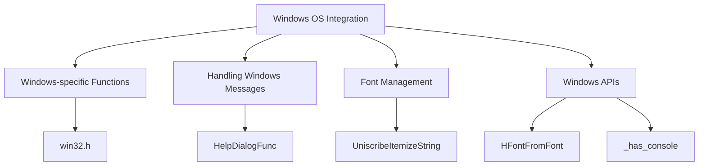

# Introduction to Windows OS Integration

Windows OS integration in the <SwmToken path="src/os/windows/win32.h" pos="2:13:13" line-data=" * This file is part of OpenTTD.">`OpenTTD`</SwmToken> project involves handling Windows-specific functionality and ensuring compatibility with the Microsoft Windows operating system. This document provides an overview of the key components and functions involved in this integration.

# Windows-specific Functions

The file <SwmPath>[src/os/windows/win32.h](src/os/windows/win32.h)</SwmPath> contains declarations of functions specifically for Windows systems. These functions handle tasks such as cursor visibility, string conversion between different formats, and locale settings.

<SwmSnippet path="/src/os/windows/win32.h" line="8">

---

The <SwmPath>[src/os/windows/win32.h](src/os/windows/win32.h)</SwmPath> file includes functions like <SwmToken path="src/os/windows/win32.h" pos="13:2:2" line-data="bool MyShowCursor(bool show, bool toggle = false);">`MyShowCursor`</SwmToken>, <SwmToken path="src/os/windows/win32.h" pos="15:3:3" line-data="char *convert_from_fs(const std::wstring_view src, std::span&lt;char&gt; dst_buf);">`convert_from_fs`</SwmToken>, <SwmToken path="src/os/windows/win32.h" pos="16:3:3" line-data="wchar_t *convert_to_fs(const std::string_view src, std::span&lt;wchar_t&gt; dst_buf);">`convert_to_fs`</SwmToken>, <SwmToken path="src/os/windows/win32.h" pos="18:2:2" line-data="void Win32SetCurrentLocaleName(const char *iso_code);">`Win32SetCurrentLocaleName`</SwmToken>, <SwmToken path="src/os/windows/win32.h" pos="19:2:2" line-data="int OTTDStringCompare(std::string_view s1, std::string_view s2);">`OTTDStringCompare`</SwmToken>, and <SwmToken path="src/os/windows/win32.h" pos="20:2:2" line-data="int Win32StringContains(const std::string_view str, const std::string_view value, bool case_insensitive);">`Win32StringContains`</SwmToken> which are essential for Windows-specific operations.

```c
/** @file win32.h declarations of functions for MS windows systems */

#ifndef WIN32_H
#define WIN32_H

bool MyShowCursor(bool show, bool toggle = false);

char *convert_from_fs(const std::wstring_view src, std::span<char> dst_buf);
wchar_t *convert_to_fs(const std::string_view src, std::span<wchar_t> dst_buf);

void Win32SetCurrentLocaleName(const char *iso_code);
int OTTDStringCompare(std::string_view s1, std::string_view s2);
int Win32StringContains(const std::string_view str, const std::string_view value, bool case_insensitive);

#endif /* WIN32_H */
```

---

</SwmSnippet>

# Handling Windows Messages

The function <SwmToken path="src/os/windows/win32.cpp" pos="182:6:6" line-data="static INT_PTR CALLBACK HelpDialogFunc(HWND wnd, UINT msg, WPARAM wParam, LPARAM lParam)">`HelpDialogFunc`</SwmToken> is a callback function to handle window messages. It processes messages like <SwmToken path="src/os/windows/win32.cpp" pos="185:3:3" line-data="		case WM_INITDIALOG: {">`WM_INITDIALOG`</SwmToken>, <SwmToken path="src/os/windows/win32.cpp" pos="191:3:3" line-data="		case WM_COMMAND:">`WM_COMMAND`</SwmToken>, and <SwmToken path="src/os/windows/win32.cpp" pos="194:3:3" line-data="		case WM_CLOSE:">`WM_CLOSE`</SwmToken> to manage dialog initialization, command handling, and window closing events.

<SwmSnippet path="/src/os/windows/win32.cpp" line="181">

---

The <SwmToken path="src/os/windows/win32.cpp" pos="182:6:6" line-data="static INT_PTR CALLBACK HelpDialogFunc(HWND wnd, UINT msg, WPARAM wParam, LPARAM lParam)">`HelpDialogFunc`</SwmToken> function in <SwmPath>[src/os/windows/win32.cpp](src/os/windows/win32.cpp)</SwmPath> demonstrates how window messages are handled in the <SwmToken path="src/os/windows/win32.h" pos="2:13:13" line-data=" * This file is part of OpenTTD.">`OpenTTD`</SwmToken> project. It includes cases for initializing dialogs, handling commands, and closing windows.

```c++
/** Callback function to handle the window */
static INT_PTR CALLBACK HelpDialogFunc(HWND wnd, UINT msg, WPARAM wParam, LPARAM lParam)
{
	switch (msg) {
		case WM_INITDIALOG: {
			std::wstring &msg = *reinterpret_cast<std::wstring *>(lParam);
			SetDlgItemText(wnd, 11, msg.c_str());
			SendDlgItemMessage(wnd, 11, WM_SETFONT, (WPARAM)GetStockObject(ANSI_FIXED_FONT), FALSE);
		} return TRUE;

		case WM_COMMAND:
			if (wParam == 12) ExitProcess(0);
			return TRUE;
		case WM_CLOSE:
			ExitProcess(0);
	}

	return FALSE;
}
```

---

</SwmSnippet>

# Font Management

The function <SwmToken path="src/os/windows/string_uniscribe.cpp" pos="248:9:9" line-data="static std::vector&lt;SCRIPT_ITEM&gt; UniscribeItemizeString(UniscribeParagraphLayoutFactory::CharType *buff, int32_t length)">`UniscribeItemizeString`</SwmToken> is responsible for itemizing text using the Uniscribe API. It sets up the necessary control and state structures and handles buffer resizing to accommodate the itemized text.

<SwmSnippet path="/src/os/windows/string_uniscribe.cpp" line="248">

---

The <SwmToken path="src/os/windows/string_uniscribe.cpp" pos="248:9:9" line-data="static std::vector&lt;SCRIPT_ITEM&gt; UniscribeItemizeString(UniscribeParagraphLayoutFactory::CharType *buff, int32_t length)">`UniscribeItemizeString`</SwmToken> function in <SwmPath>[src/os/windows/string_uniscribe.cpp](src/os/windows/string_uniscribe.cpp)</SwmPath> shows how text is itemized using the Uniscribe API. It involves setting up control and state structures and resizing buffers as needed.

```c++
static std::vector<SCRIPT_ITEM> UniscribeItemizeString(UniscribeParagraphLayoutFactory::CharType *buff, int32_t length)
{
	/* Itemize text. */
	SCRIPT_CONTROL control;
	ZeroMemory(&control, sizeof(SCRIPT_CONTROL));
	control.uDefaultLanguage = _current_language->winlangid;

	SCRIPT_STATE state;
	ZeroMemory(&state, sizeof(SCRIPT_STATE));
	state.uBidiLevel = _current_text_dir == TD_RTL ? 1 : 0;

	std::vector<SCRIPT_ITEM> items(16);
	while (true) {
		/* We subtract one from max_items to work around a buffer overflow on some older versions of Windows. */
		int generated = 0;
		HRESULT hr = ScriptItemize(buff, length, (int)items.size() - 1, &control, &state, &items[0], &generated);

		if (SUCCEEDED(hr)) {
			/* Resize the item buffer. Note that Uniscribe will always add an additional end sentinel item. */
			items.resize(generated + 1);
			break;
```

---

</SwmSnippet>

# Windows APIs

Several Windows API functions are utilized in the <SwmToken path="src/os/windows/win32.h" pos="2:13:13" line-data=" * This file is part of OpenTTD.">`OpenTTD`</SwmToken> project to ensure proper integration with the Windows OS.

## <SwmToken path="src/os/windows/string_uniscribe.cpp" pos="141:4:4" line-data="static HFONT HFontFromFont(Font *font)">`HFontFromFont`</SwmToken>

The <SwmToken path="src/os/windows/string_uniscribe.cpp" pos="141:4:4" line-data="static HFONT HFontFromFont(Font *font)">`HFontFromFont`</SwmToken> function is responsible for loading the matching native Windows font. It utilizes Windows API functions like <SwmToken path="src/os/windows/string_uniscribe.cpp" pos="143:19:19" line-data="	if (font-&gt;fc-&gt;GetOSHandle() != nullptr) return CreateFontIndirect(reinterpret_cast&lt;PLOGFONT&gt;(const_cast&lt;void *&gt;(font-&gt;fc-&gt;GetOSHandle())));">`CreateFontIndirect`</SwmToken> to achieve this.

## <SwmToken path="src/os/windows/win32.cpp" pos="34:4:4" line-data="static bool _has_console;">`_has_console`</SwmToken>

The <SwmToken path="src/os/windows/win32.cpp" pos="34:4:4" line-data="static bool _has_console;">`_has_console`</SwmToken> variable indicates whether the application has an attached console. This is part of the Windows-specific implementation details.

&nbsp;

*This is an auto-generated document by Swimm AI 🌊 and has not yet been verified by a human*

<SwmMeta version="3.0.0" repo-id="Z2l0aHViJTNBJTNBT3BlblRURC1jb3BpbG90LWRlbW8lM0ElM0Fzd2ltbWlv" repo-name="OpenTTD-copilot-demo"><sup>Powered by [Swimm](/)</sup></SwmMeta>
