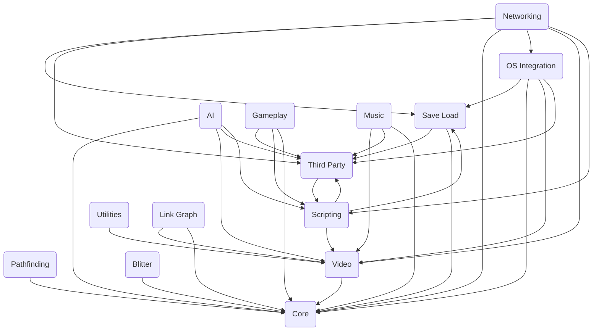

The repo OpenTTD-copilot-demo is for OpenTTD, a transport simulation game that mimics and extends Transport Tycoon Deluxe with new features.

## Main Components

### Utilities

Utilities are helper functions and classes that provide common functionality used throughout the codebase. They simplify complex operations, manage resources efficiently, and enhance code readability and maintainability.

- <SwmLink doc-title="Utilities overview">[Utilities overview](.swm/utilities-overview.57jpi1tt.sw.md)</SwmLink>

### Music

Music in OpenTTD refers to the system that manages and plays background music during the game. It includes various drivers like Allegro, Win32, and DirectMusic, each responsible for handling music playback on different platforms. The music system supports playing, stopping, and managing the volume of songs, and it ensures a seamless audio experience for the player.

- <SwmLink doc-title="Music system overview">[Music system overview](.swm/music-system-overview.mb9mbvo9.sw.md)</SwmLink>
- **Classes**
  - <SwmLink doc-title="The musicdriver class">[The musicdriver class](.swm/the-musicdriver-class.l43y9.sw.md)</SwmLink>
  - <SwmLink doc-title="The musicdriver class">[The musicdriver class](.swm/the-musicdriver-class.i1pp3.sw.md)</SwmLink>

### Video

Video refers to the handling and management of visual output in the game, including updating video modes, rendering frames, and managing screen resolutions.

- <SwmLink doc-title="Video management overview">[Video management overview](.swm/video-management-overview.f8011djm.sw.md)</SwmLink>
- <SwmLink doc-title="The videodriver class">[The videodriver class](.swm/the-videodriver-class.t47oz.sw.md)</SwmLink>
- **Flows**
  - <SwmLink doc-title="Window closure flow">[Window closure flow](.swm/window-closure-flow.t6mx0d8s.sw.md)</SwmLink>
  - <SwmLink doc-title="Main game loop overview">[Main game loop overview](.swm/main-game-loop-overview.mimrrlak.sw.md)</SwmLink>
  - <SwmLink doc-title="Emscripten game loop management">[Emscripten game loop management](.swm/emscripten-game-loop-management.1rdsgl1d.sw.md)</SwmLink>

### Core

Core refers to the fundamental components and utilities essential for the game's operation. It includes functions for memory allocation, mathematical operations, random number generation, and data structures. These core functionalities ensure the game's stability, performance, and overall functionality.

- <SwmLink doc-title="Core components overview">[Core components overview](.swm/core-components-overview.mta2hr6t.sw.md)</SwmLink>
- **Flows**
  - <SwmLink doc-title="Handling mouse events">[Handling mouse events](.swm/handling-mouse-events.i93hwo3u.sw.md)</SwmLink>
  - <SwmLink doc-title="Handling water tile flooding">[Handling water tile flooding](.swm/handling-water-tile-flooding.3l07znsw.sw.md)</SwmLink>
  - <SwmLink doc-title="Updating station attributes after tile changes">[Updating station attributes after tile changes](.swm/updating-station-attributes-after-tile-changes.g8xibura.sw.md)</SwmLink>
  - <SwmLink doc-title="Updating train statuses">[Updating train statuses](.swm/updating-train-statuses.lcrzcrn7.sw.md)</SwmLink>
  - <SwmLink doc-title="Rendering road tiles">[Rendering road tiles](.swm/rendering-road-tiles.vu2791eg.sw.md)</SwmLink>
  - <SwmLink doc-title="Building vehicles flow">[Building vehicles flow](.swm/building-vehicles-flow.fpkfzssi.sw.md)</SwmLink>
  - <SwmLink doc-title="Track drawing process">[Track drawing process](.swm/track-drawing-process.cote7b0d.sw.md)</SwmLink>
  - <SwmLink doc-title="Reversing train direction flow">[Reversing train direction flow](.swm/reversing-train-direction-flow.2b0fwmvv.sw.md)</SwmLink>
  - <SwmLink doc-title="Updating vehicle purchase interface">[Updating vehicle purchase interface](.swm/updating-vehicle-purchase-interface.an0b786w.sw.md)</SwmLink>
  - <SwmLink doc-title="Managing aircraft in hangar">[Managing aircraft in hangar](.swm/managing-aircraft-in-hangar.s4os4wm2.sw.md)</SwmLink>

### Pathfinding

Pathfinding refers to the algorithms and methods used to determine the optimal route for vehicles to travel from one point to another. It involves calculating the cost of different paths, considering various factors such as distance, terrain, and obstacles. The goal is to find the most efficient path that minimizes travel time and resources. In OpenTTD, pathfinding is implemented using various components and functions that work together to evaluate and select the best possible routes for different types of vehicles.

- <SwmLink doc-title="Pathfinding overview">[Pathfinding overview](.swm/pathfinding-overview.fntnspkr.sw.md)</SwmLink>
- <SwmLink doc-title="Understanding yapf in pathfinding">[Understanding yapf in pathfinding](.swm/understanding-yapf-in-pathfinding.ce5wbu00.sw.md)</SwmLink>
- **Classes**
  - <SwmLink doc-title="The cyapft class">[The cyapft class](.swm/the-cyapft-class.pmv61.sw.md)</SwmLink>
  - <SwmLink doc-title="The cyapfnodet class">[The cyapfnodet class](.swm/the-cyapfnodet-class.6slvt.sw.md)</SwmLink>
- **Flows**
  - <SwmLink doc-title="Choosing the best train track">[Choosing the best train track](.swm/choosing-the-best-train-track.xsxsiitx.sw.md)</SwmLink>
  - <SwmLink doc-title="Train movement and control flow">[Train movement and control flow](.swm/train-movement-and-control-flow.hbahb4jc.sw.md)</SwmLink>

### Save Load

Save Load refers to the functionality of saving and loading game states. It involves serializing the current state of the game into a file and deserializing it back into the game. This functionality is crucial for preserving game progress and allowing players to continue from where they left off. The SaveLoad system handles various data types, versions, and formats to ensure compatibility and integrity of the saved data.

- <SwmLink doc-title="Save load overview">[Save load overview](.swm/save-load-overview.fs62w9im.sw.md)</SwmLink>
- **Flows**
  - <SwmLink doc-title="Saving and loading game states">[Saving and loading game states](.swm/saving-and-loading-game-states.g1e07kh3.sw.md)</SwmLink>
  - <SwmLink doc-title="Handling client errors">[Handling client errors](.swm/handling-client-errors.ggn6v1j3.sw.md)</SwmLink>
  - <SwmLink doc-title="Game initialization process">[Game initialization process](.swm/game-initialization-process.19uyzcw3.sw.md)</SwmLink>
  - <SwmLink doc-title="Main flow overview">[Main flow overview](.swm/main-flow-overview.eue4zdth.sw.md)</SwmLink>
  - <SwmLink doc-title="Game initialization and management flow">[Game initialization and management flow](.swm/game-initialization-and-management-flow.pgfya5bt.sw.md)</SwmLink>
  - <SwmLink doc-title="Handling newgrfs scanning flow">[Handling newgrfs scanning flow](.swm/handling-newgrfs-scanning-flow.ipog0p9a.sw.md)</SwmLink>
  - <SwmLink doc-title="Handling user confirmation for newgrf changes">[Handling user confirmation for newgrf changes](.swm/handling-user-confirmation-for-newgrf-changes.vz8uyo8i.sw.md)</SwmLink>
  - <SwmLink doc-title="Managing grf files with drag and drop">[Managing grf files with drag and drop](.swm/managing-grf-files-with-drag-and-drop.cxfxa9lr.sw.md)</SwmLink>
- **Classes**
  - <SwmLink doc-title="The chunkhandler class">[The chunkhandler class](.swm/the-chunkhandler-class.gzgaz.sw.md)</SwmLink>
  - <SwmLink doc-title="The defaultsaveloadhandler class">[The defaultsaveloadhandler class](.swm/the-defaultsaveloadhandler-class.v328n.sw.md)</SwmLink>
  - <SwmLink doc-title="The loadfilter class">[The loadfilter class](.swm/the-loadfilter-class.pjqh6.sw.md)</SwmLink>
  - <SwmLink doc-title="The savefilter class">[The savefilter class](.swm/the-savefilter-class.0lp8o.sw.md)</SwmLink>

### Link Graph

The Link Graph is a data structure used to manage and optimize cargo distribution in the game. It involves complex algorithms like the multi-commodity flow (MCF) algorithm, which can be CPU-intensive. The Link Graph is recalculated periodically, and its operations are often run in separate threads to avoid performance issues. It is crucial for updating flow statistics and managing the capacities and demands of various nodes and edges within the game's transport network.

- <SwmLink doc-title="Link graph overview">[Link graph overview](.swm/link-graph-overview.t397leuu.sw.md)</SwmLink>
- <SwmLink doc-title="The componenthandler class">[The componenthandler class](.swm/the-componenthandler-class.md2f6.sw.md)</SwmLink>

### Gameplay

Gameplay in OpenTTD involves managing a transport company by building and maintaining transportation networks such as railways, roads, airports, and seaports. Players aim to transport passengers and cargo efficiently to earn revenue and expand their operations. The game includes various economic and logistical challenges, requiring strategic planning and resource management to succeed.

- <SwmLink doc-title="Gameplay overview">[Gameplay overview](.swm/gameplay-overview.8ev0a607.sw.md)</SwmLink>
- <SwmLink doc-title="The loggedchange class">[The loggedchange class](.swm/the-loggedchange-class.13r3v.sw.md)</SwmLink>

### Networking

Networking refers to the system that manages communication between clients and servers, enabling multiplayer functionality. It involves sending and receiving data packets, initializing network components, and maintaining connections to ensure smooth gameplay.

- <SwmLink doc-title="Networking overview">[Networking overview](.swm/networking-overview.i91etxr7.sw.md)</SwmLink>
- <SwmLink doc-title="Core networking components overview">[Core networking components overview](.swm/core-networking-components-overview.lxlsyfqc.sw.md)</SwmLink>
- **Classes**
  - <SwmLink doc-title="The networkudpsockethandler class">[The networkudpsockethandler class](.swm/the-networkudpsockethandler-class.j37qr.sw.md)</SwmLink>
  - <SwmLink doc-title="The networkgamesockethandler class">[The networkgamesockethandler class](.swm/the-networkgamesockethandler-class.xtgxq.sw.md)</SwmLink>
  - <SwmLink doc-title="The tcpconnecter class">[The tcpconnecter class](.swm/the-tcpconnecter-class.haw09.sw.md)</SwmLink>
- **Flows**
  - <SwmLink doc-title="Gameloop overview">[Gameloop overview](.swm/gameloop-overview.xzafoq50.sw.md)</SwmLink>
  - <SwmLink doc-title="Handling server map download completion">[Handling server map download completion](.swm/handling-server-map-download-completion.yut2gpcm.sw.md)</SwmLink>
- **Classes**
  - <SwmLink doc-title="The contentcallback class">[The contentcallback class](.swm/the-contentcallback-class.s7yvg.sw.md)</SwmLink>
  - <SwmLink doc-title="The networkauthenticationclienthandler class">[The networkauthenticationclienthandler class](.swm/the-networkauthenticationclienthandler-class.yxaw4.sw.md)</SwmLink>

### Blitter

A blitter is a component responsible for transferring blocks of data, typically used for rendering graphics. In OpenTTD, different blitters handle various graphical tasks such as drawing sprites, managing animations, and performing anti-aliasing. The `Blitter_Null` class, for example, is a blitter that performs no operations, serving as a placeholder or default implementation.

- <SwmLink doc-title="Blitter overview">[Blitter overview](.swm/blitter-overview.i85xyivy.sw.md)</SwmLink>
- <SwmLink doc-title="Rectangle filling process">[Rectangle filling process](.swm/rectangle-filling-process.qgn60pb7.sw.md)</SwmLink>
- **Classes**
  - <SwmLink doc-title="The blitter_8bppbase class">[The blitter_8bppbase class](.swm/the-blitter_8bppbase-class.1ju6l.sw.md)</SwmLink>
  - <SwmLink doc-title="The blitter_8bppbase class">[The blitter_8bppbase class](.swm/the-blitter_8bppbase-class.nc5q4.sw.md)</SwmLink>
  - <SwmLink doc-title="The blitterfactory class">[The blitterfactory class](.swm/the-blitterfactory-class.m0c56.sw.md)</SwmLink>

### Scripting

Scripting in OpenTTD allows for the automation and customization of game behavior through the use of scripts. Local scripts, such as 'autoexec.scr', are executed at game start and can be used for custom aliases. Network scripts, like 'on_client.scr' and 'on_server_connect.scr', are used to optimize client settings and execute actions when clients join a server, respectively.

- <SwmLink doc-title="Scripting overview">[Scripting overview](.swm/scripting-overview.cli1yozq.sw.md)</SwmLink>
- **Api**
  - <SwmLink doc-title="Overview of scripting api">[Overview of scripting api](.swm/overview-of-scripting-api.xhdzh0zx.sw.md)</SwmLink>
  - <SwmLink doc-title="Overview of station list in api">[Overview of station list in api](.swm/overview-of-station-list-in-api.wsspahyx.sw.md)</SwmLink>
  - <SwmLink doc-title="Getting started with order management in api">[Getting started with order management in api](.swm/getting-started-with-order-management-in-api.qo07t7vv.sw.md)</SwmLink>
  - <SwmLink doc-title="Getting started with road management api">[Getting started with road management api](.swm/getting-started-with-road-management-api.ujuj80bl.sw.md)</SwmLink>
  - <SwmLink doc-title="Overview of event types in api">[Overview of event types in api](.swm/overview-of-event-types-in-api.3ha3y7pp.sw.md)</SwmLink>
  - <SwmLink doc-title="Basic concepts of object management in api">[Basic concepts of object management in api](.swm/basic-concepts-of-object-management-in-api.dg9ydy1o.sw.md)</SwmLink>
  - <SwmLink doc-title="Understanding vehicle management in api">[Understanding vehicle management in api](.swm/understanding-vehicle-management-in-api.ifdq5jw7.sw.md)</SwmLink>
  - <SwmLink doc-title="Railway operations overview">[Railway operations overview](.swm/railway-operations-overview.6o9xp69u.sw.md)</SwmLink>
  - <SwmLink doc-title="The scriptobject class">[The scriptobject class](.swm/the-scriptobject-class.nusdj.sw.md)</SwmLink>
  - **API List**
    - <SwmLink doc-title="Getting started with scriptlist api">[Getting started with scriptlist api](.swm/getting-started-with-scriptlist-api.ypfiyiwc.sw.md)</SwmLink>
    - <SwmLink doc-title="The scriptlistsorter class">[The scriptlistsorter class](.swm/the-scriptlistsorter-class.lai9z.sw.md)</SwmLink>
- **Classes**
  - <SwmLink doc-title="The scriptscanner class">[The scriptscanner class](.swm/the-scriptscanner-class.5m2uq.sw.md)</SwmLink>
  - <SwmLink doc-title="The scriptinfo class">[The scriptinfo class](.swm/the-scriptinfo-class.czgc6.sw.md)</SwmLink>

### AI

AI refers to the artificial intelligence system that manages computer-controlled companies in the game. It includes functionalities to start, stop, pause, and resume AI companies, handle game events, and manage AI configurations and data.

- <SwmLink doc-title="Ai overview">[Ai overview](.swm/ai-overview.1roa8bu2.sw.md)</SwmLink>

### OS Integration

OS Integration refers to the adaptation and customization of the game to work seamlessly across different operating systems such as macOS, Windows, and Unix. This involves implementing OS-specific features, handling OS-specific bugs, and ensuring that the game utilizes the native capabilities of each operating system to provide an optimal user experience.

- <SwmLink doc-title="Overview of windows os integration">[Overview of windows os integration](.swm/overview-of-windows-os-integration.c4a9tdp6.sw.md)</SwmLink>
- **Macosx**
  - <SwmLink doc-title="Overview of macos integration">[Overview of macos integration](.swm/overview-of-macos-integration.1skxw0pf.sw.md)</SwmLink>
  - <SwmLink doc-title="Handling user clicks">[Handling user clicks](.swm/handling-user-clicks.iqt68w54.sw.md)</SwmLink>

### Third Party

Third Party refers to external libraries or components integrated into the project to provide additional functionality or support, such as cryptographic functions or formatting utilities.

- <SwmLink doc-title="Handling console text with iconsoleprint">[Handling console text with iconsoleprint](.swm/handling-console-text-with-iconsoleprint.ncnnd6h8.sw.md)</SwmLink>
- **Fmt**
  - <SwmLink doc-title="Introduction to fmt macros">[Introduction to fmt macros](.swm/introduction-to-fmt-macros.ut1949do.sw.md)</SwmLink>
  - <SwmLink doc-title="Updating vehicle visual effects">[Updating vehicle visual effects](.swm/updating-vehicle-visual-effects.6chz1ut2.sw.md)</SwmLink>
- **Squirrel**
  - <SwmLink doc-title="Overview of squirrel in third party">[Overview of squirrel in third party](.swm/overview-of-squirrel-in-third-party.n8f6piaw.sw.md)</SwmLink>
  - <SwmLink doc-title="The sqrefcounted class">[The sqrefcounted class](.swm/the-sqrefcounted-class.vapea.sw.md)</SwmLink>
  - **Flows**
    - <SwmLink doc-title="Script compilation process">[Script compilation process](.swm/script-compilation-process.g4e3i2oh.sw.md)</SwmLink>
    - <SwmLink doc-title="Handling function calls in squirrel vm">[Handling function calls in squirrel vm](.swm/handling-function-calls-in-squirrel-vm.sh17rqqf.sw.md)</SwmLink>
    - <SwmLink doc-title="Execution flow management">[Execution flow management](.swm/execution-flow-management.pdu9iwaz.sw.md)</SwmLink>
- **Classes**
  - <SwmLink doc-title="The matcherbase class">[The matcherbase class](.swm/the-matcherbase-class.ktxl9.sw.md)</SwmLink>
  - <SwmLink doc-title="The noncopyable class">[The noncopyable class](.swm/the-noncopyable-class.dvzfx.sw.md)</SwmLink>
  - <SwmLink doc-title="The igenerator class">[The igenerator class](.swm/the-igenerator-class.t0y6r.sw.md)</SwmLink>
  - <SwmLink doc-title="The streamingreporterbase class">[The streamingreporterbase class](.swm/the-streamingreporterbase-class.gn772.sw.md)</SwmLink>
  - <SwmLink doc-title="The parserrefimpl class">[The parserrefimpl class](.swm/the-parserrefimpl-class.fy9fq.sw.md)</SwmLink>
  - <SwmLink doc-title="The exception class">[The exception class](.swm/the-exception-class.6wayq.sw.md)</SwmLink>

### Flows

- <SwmLink doc-title="Clearing a station tile flow">[Clearing a station tile flow](.swm/clearing-a-station-tile-flow.iz6bzycy.sw.md)</SwmLink>
- <SwmLink doc-title="Train path reservation flow">[Train path reservation flow](.swm/train-path-reservation-flow.5xh8ukwa.sw.md)</SwmLink>
- <SwmLink doc-title="Founding a new town">[Founding a new town](.swm/founding-a-new-town.prnazodf.sw.md)</SwmLink>
- <SwmLink doc-title="Creating and expanding a random town">[Creating and expanding a random town](.swm/creating-and-expanding-a-random-town.tyeddcsg.sw.md)</SwmLink>

## Classes

- <SwmLink doc-title="The window class">[The window class](.swm/the-window-class.7eruq.sw.md)</SwmLink>
- <SwmLink doc-title="The driverfactorybase class">[The driverfactorybase class](.swm/the-driverfactorybase-class.eym78.sw.md)</SwmLink>
- <SwmLink doc-title="The nwidgetcore class">[The nwidgetcore class](.swm/the-nwidgetcore-class.8yt5p.sw.md)</SwmLink>
- <SwmLink doc-title="The filescanner class">[The filescanner class](.swm/the-filescanner-class.01mxi.sw.md)</SwmLink>
- <SwmLink doc-title="The pickerwindowbase class">[The pickerwindowbase class](.swm/the-pickerwindowbase-class.zgnuc.sw.md)</SwmLink>
- <SwmLink doc-title="The scoperesolver class">[The scoperesolver class](.swm/the-scoperesolver-class.f83bl.sw.md)</SwmLink>
- <SwmLink doc-title="The resolverobject class">[The resolverobject class](.swm/the-resolverobject-class.ywpwr.sw.md)</SwmLink>
- <SwmLink doc-title="The animationbase class">[The animationbase class](.swm/the-animationbase-class.8n5p2.sw.md)</SwmLink>
- <SwmLink doc-title="The cargomovement class">[The cargomovement class](.swm/the-cargomovement-class.5c16a.sw.md)</SwmLink>
- <SwmLink doc-title="The pickercallbacksnewgrfclass class">[The pickercallbacksnewgrfclass class](.swm/the-pickercallbacksnewgrfclass-class.sya4b.sw.md)</SwmLink>
- <SwmLink doc-title="The specializedvehicle class">[The specializedvehicle class](.swm/the-specializedvehicle-class.7sm0t.sw.md)</SwmLink>
- <SwmLink doc-title="The textfilewindow class">[The textfilewindow class](.swm/the-textfilewindow-class.ysur0.sw.md)</SwmLink>
- <SwmLink doc-title="The nihelper class">[The nihelper class](.swm/the-nihelper-class.vicmb.sw.md)</SwmLink>
- <SwmLink doc-title="The orthogonaltileiterator class">[The orthogonaltileiterator class](.swm/the-orthogonaltileiterator-class.kylyj.sw.md)</SwmLink>
- <SwmLink doc-title="The truetypefontcache class">[The truetypefontcache class](.swm/the-truetypefontcache-class.ci1xb.sw.md)</SwmLink>
- <SwmLink doc-title="The spritegroup class">[The spritegroup class](.swm/the-spritegroup-class.1dhf3.sw.md)</SwmLink>
- <SwmLink doc-title="The newgrfspecbase class">[The newgrfspecbase class](.swm/the-newgrfspecbase-class.k1q48.sw.md)</SwmLink>
- <SwmLink doc-title="The sounddriver class">[The sounddriver class](.swm/the-sounddriver-class.xbpj7.sw.md)</SwmLink>
- <SwmLink doc-title="The paragraphlayouter class">[The paragraphlayouter class](.swm/the-paragraphlayouter-class.nz2tp.sw.md)</SwmLink>
- <SwmLink doc-title="The stringiterator class">[The stringiterator class](.swm/the-stringiterator-class.5plcm.sw.md)</SwmLink>
- <SwmLink doc-title="The overridemanagerbase class">[The overridemanagerbase class](.swm/the-overridemanagerbase-class.fun5j.sw.md)</SwmLink>
- <SwmLink doc-title="The settingdesc class">[The settingdesc class](.swm/the-settingdesc-class.14xxo.sw.md)</SwmLink>

&nbsp;

*This is an auto-generated document by Swimm AI 🌊 and has not yet been verified by a human*

<SwmMeta version="3.0.0" repo-id="Z2l0aHViJTNBJTNBT3BlblRURC1jb3BpbG90LWRlbW8lM0ElM0Fzd2ltbWlv" repo-name="OpenTTD-copilot-demo">Powered by [Swimm](/)</SwmMeta>
