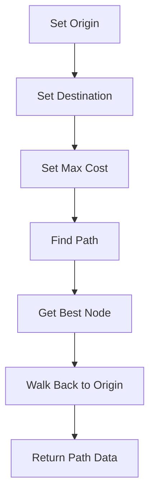

# Pathfinding Overview

Pathfinding is a key component that determines the optimal route for vehicles to travel from one point to another. It involves calculating the cost of different paths and selecting the one with the lowest cost.

## Pathfinding Functions

The function <SwmToken path="src/pathfinder/yapf/yapf_rail.cpp" pos="270:5:5" line-data="	inline FindDepotData FindNearestDepotTwoWay(const Train *v, TileIndex t1, Trackdir td1, TileIndex t2, Trackdir td2, int max_penalty, int reverse_penalty)">`FindNearestDepotTwoWay`</SwmToken> sets the origin and destination nodes and finds the best path between them.

<SwmSnippet path="/src/pathfinder/yapf/yapf_rail.cpp" line="270">

---

The function <SwmToken path="src/pathfinder/yapf/yapf_rail.cpp" pos="270:5:5" line-data="	inline FindDepotData FindNearestDepotTwoWay(const Train *v, TileIndex t1, Trackdir td1, TileIndex t2, Trackdir td2, int max_penalty, int reverse_penalty)">`FindNearestDepotTwoWay`</SwmToken> sets the origin and destination nodes, finds the best path, and walks through the path back to the origin.

```c++
	inline FindDepotData FindNearestDepotTwoWay(const Train *v, TileIndex t1, Trackdir td1, TileIndex t2, Trackdir td2, int max_penalty, int reverse_penalty)
	{
		/* set origin and destination nodes */
		Yapf().SetOrigin(t1, td1, t2, td2, reverse_penalty, true);
		Yapf().SetDestination(v);
		Yapf().SetMaxCost(max_penalty);

		/* find the best path */
		if (!Yapf().FindPath(v)) return FindDepotData();

		/* Some path found. */
		Node *n = Yapf().GetBestNode();

		/* walk through the path back to the origin */
		Node *pNode = n;
		while (pNode->m_parent != nullptr) {
			pNode = pNode->m_parent;
		}

		/* if the origin node is our front vehicle tile/Trackdir then we didn't reverse
		 * but we can also look at the cost (== 0 -> not reversed, == reverse_penalty -> reversed) */
```

---

</SwmSnippet>

## Path Segment End Reasons

The <SwmToken path="src/pathfinder/yapf/yapf_type.hpp" pos="40:2:2" line-data="enum EndSegmentReasonBits {">`EndSegmentReasonBits`</SwmToken> enumeration defines various reasons why a path segment might end, such as reaching a dead end or a station.

<SwmSnippet path="/src/pathfinder/yapf/yapf_type.hpp" line="40">

---

The <SwmToken path="src/pathfinder/yapf/yapf_type.hpp" pos="40:2:2" line-data="enum EndSegmentReasonBits {">`EndSegmentReasonBits`</SwmToken> enumeration lists reasons for path segment termination, including dead ends, rail type mismatches, and reaching stations.

```c++
enum EndSegmentReasonBits {
	ESRB_NONE = 0,

	ESRB_DEAD_END          = 1 << ESR_DEAD_END,
	ESRB_RAIL_TYPE         = 1 << ESR_RAIL_TYPE,
	ESRB_INFINITE_LOOP     = 1 << ESR_INFINITE_LOOP,
	ESRB_SEGMENT_TOO_LONG  = 1 << ESR_SEGMENT_TOO_LONG,
	ESRB_CHOICE_FOLLOWS    = 1 << ESR_CHOICE_FOLLOWS,
	ESRB_DEPOT             = 1 << ESR_DEPOT,
	ESRB_WAYPOINT          = 1 << ESR_WAYPOINT,
	ESRB_STATION           = 1 << ESR_STATION,
	ESRB_SAFE_TILE         = 1 << ESR_SAFE_TILE,

	ESRB_PATH_TOO_LONG     = 1 << ESR_PATH_TOO_LONG,
	ESRB_FIRST_TWO_WAY_RED = 1 << ESR_FIRST_TWO_WAY_RED,
	ESRB_LOOK_AHEAD_END    = 1 << ESR_LOOK_AHEAD_END,
	ESRB_TARGET_REACHED    = 1 << ESR_TARGET_REACHED,

	/* Additional (composite) values. */

	/* What reasons mean that the target can be found and needs to be detected. */
```

---

</SwmSnippet>

## Cost Calculation

The <SwmToken path="src/pathfinder/yapf/yapf_type.hpp" pos="16:8:8" line-data="/* Enum used in PfCalcCost() to see why was the segment closed. */">`PfCalcCost`</SwmToken> function calculates the cost from the origin to a given node, considering factors like curve cost, tile cost, and slope cost.

## Specialized Pathfinding Components

Different types of vehicles, such as ships and trains, have specialized pathfinding components defined in structures like <SwmToken path="src/pathfinder/yapf/yapf_ship.cpp" pos="404:2:2" line-data="struct CYapfShip_TypesT">`CYapfShip_TypesT`</SwmToken> and `CYapfRegion_TypesT`.

<SwmSnippet path="/src/pathfinder/yapf/yapf_ship.cpp" line="404">

---

The structure <SwmToken path="src/pathfinder/yapf/yapf_ship.cpp" pos="404:2:2" line-data="struct CYapfShip_TypesT">`CYapfShip_TypesT`</SwmToken> defines specialized pathfinding components for ships, including pathfinder type, track follower, and cost provider.

```c++
struct CYapfShip_TypesT
{
	typedef CYapfShip_TypesT<Tpf_, Ttrack_follower, Tnode_list>  Types;         ///< Shortcut for this struct type.
	typedef Tpf_                                                 Tpf;           ///< Pathfinder type.
	typedef Ttrack_follower                                      TrackFollower; ///< Track follower helper class.
	typedef Tnode_list                                           NodeList;
	typedef Ship                                                 VehicleType;

	/** Pathfinder components (modules). */
	typedef CYapfBaseT<Types>                 PfBase;        ///< Base pathfinder class.
	typedef CYapfFollowShipT<Types>           PfFollow;      ///< Node follower.
	typedef CYapfOriginTileT<Types>           PfOrigin;      ///< Origin provider.
	typedef CYapfDestinationTileWaterT<Types> PfDestination; ///< Destination/distance provider.
	typedef CYapfSegmentCostCacheNoneT<Types> PfCache;       ///< Segment cost cache provider.
	typedef CYapfCostShipT<Types>             PfCost;        ///< Cost provider.
};
```

---

</SwmSnippet>

## Pathfinding Endpoints

The <SwmToken path="src/pathfinder/aystar.h" pos="65:4:4" line-data="typedef int32_t AyStar_EndNodeCheck(const AyStar *aystar, const PathNode *current);">`AyStar_EndNodeCheck`</SwmToken> function checks whether the current node is the end node in the pathfinding algorithm. It returns <SwmToken path="src/pathfinder/aystar.h" pos="62:6:6" line-data=" *  - #AYSTAR_FOUND_END_NODE : indicates this is the end tile">`AYSTAR_FOUND_END_NODE`</SwmToken> if the end node is found and <SwmToken path="src/pathfinder/aystar.h" pos="63:6:6" line-data=" *  - #AYSTAR_DONE : indicates this is not the end tile (or direction was wrong)">`AYSTAR_DONE`</SwmToken> otherwise.

<SwmSnippet path="/src/pathfinder/aystar.h" line="49">

---

The <SwmToken path="src/pathfinder/aystar.h" pos="65:4:4" line-data="typedef int32_t AyStar_EndNodeCheck(const AyStar *aystar, const PathNode *current);">`AyStar_EndNodeCheck`</SwmToken> function checks if the current node is the end node and returns the appropriate status.

```c
struct AyStar;

/**
 * Check whether the end-tile is found.
 * @param aystar %AyStar search algorithm data.
 * @param current Node to exam one.
 * @note The 2nd parameter should be #OpenListNode, and \em not #AyStarNode. #AyStarNode is
 * part of #OpenListNode and so it could be accessed without any problems.
 * The good part about #OpenListNode is, and how AIs use it, that you can
 * access the parent of the current node, and so check if you, for example
 * don't try to enter the file tile with a 90-degree curve. So please, leave
 * this an #OpenListNode, it works just fine.
 * @return Status of the node:
 *  - #AYSTAR_FOUND_END_NODE : indicates this is the end tile
 *  - #AYSTAR_DONE : indicates this is not the end tile (or direction was wrong)
 */
typedef int32_t AyStar_EndNodeCheck(const AyStar *aystar, const PathNode *current);
```

---

</SwmSnippet>

&nbsp;

*This is an auto-generated document by Swimm AI 🌊 and has not yet been verified by a human*

<SwmMeta version="3.0.0" repo-id="Z2l0aHViJTNBJTNBT3BlblRURC1jb3BpbG90LWRlbW8lM0ElM0Fzd2ltbWlv" repo-name="OpenTTD-copilot-demo"><sup>Powered by [Swimm](/)</sup></SwmMeta>
