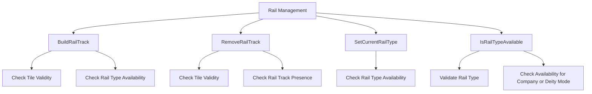

# Understanding Railway Operations

Rail Management refers to the various functionalities and operations related to managing railways within the game. It includes checking the availability of different rail types, building and removing rail tracks, depots, stations, and waypoints. The <SwmToken path="src/script/api/script_rail.cpp" pos="70:8:8" line-data="/* static */ bool ScriptRail::IsRailTypeAvailable(RailType rail_type)">`ScriptRail`</SwmToken> class provides static methods to handle these operations, ensuring that the necessary preconditions are met before executing commands.

## Main Functions

There are several main functions in rail management. Some of them are <SwmToken path="src/script/api/script_rail.cpp" pos="247:10:10" line-data="/* static */ bool ScriptRail::BuildRailTrack(TileIndex tile, RailTrack rail_track)">`BuildRailTrack`</SwmToken>, <SwmToken path="src/script/api/script_rail.cpp" pos="259:10:10" line-data="/* static */ bool ScriptRail::RemoveRailTrack(TileIndex tile, RailTrack rail_track)">`RemoveRailTrack`</SwmToken>, <SwmToken path="src/script/api/script_rail.cpp" pos="83:10:10" line-data="/* static */ void ScriptRail::SetCurrentRailType(RailType rail_type)">`SetCurrentRailType`</SwmToken>, and <SwmToken path="src/script/api/script_rail.cpp" pos="70:10:10" line-data="/* static */ bool ScriptRail::IsRailTypeAvailable(RailType rail_type)">`IsRailTypeAvailable`</SwmToken>. We will dive a little into <SwmToken path="src/script/api/script_rail.cpp" pos="247:10:10" line-data="/* static */ bool ScriptRail::BuildRailTrack(TileIndex tile, RailTrack rail_track)">`BuildRailTrack`</SwmToken> and <SwmToken path="src/script/api/script_rail.cpp" pos="259:10:10" line-data="/* static */ bool ScriptRail::RemoveRailTrack(TileIndex tile, RailTrack rail_track)">`RemoveRailTrack`</SwmToken>.

### <SwmToken path="src/script/api/script_rail.cpp" pos="247:10:10" line-data="/* static */ bool ScriptRail::BuildRailTrack(TileIndex tile, RailTrack rail_track)">`BuildRailTrack`</SwmToken>

The <SwmToken path="src/script/api/script_rail.cpp" pos="247:10:10" line-data="/* static */ bool ScriptRail::BuildRailTrack(TileIndex tile, RailTrack rail_track)">`BuildRailTrack`</SwmToken> function is used to construct a rail track on a specified tile. It ensures that the tile is valid and the rail type is available before executing the command.

<SwmSnippet path="/src/script/api/script_rail.cpp" line="247">

---

The <SwmToken path="src/script/api/script_rail.cpp" pos="247:10:10" line-data="/* static */ bool ScriptRail::BuildRailTrack(TileIndex tile, RailTrack rail_track)">`BuildRailTrack`</SwmToken> method ensures that the tile is valid and the rail type is available before constructing a rail track.

```c++
/* static */ bool ScriptRail::BuildRailTrack(TileIndex tile, RailTrack rail_track)
{
	EnforceCompanyModeValid(false);
	EnforcePrecondition(false, ::IsValidTile(tile));
	EnforcePrecondition(false, rail_track != 0);
	EnforcePrecondition(false, (static_cast<uint>(rail_track) & ~static_cast<uint>(::TRACK_BIT_ALL)) == 0);
	EnforcePrecondition(false, KillFirstBit((uint)rail_track) == 0);
	EnforcePrecondition(false, IsRailTypeAvailable(GetCurrentRailType()));

	return ScriptObject::Command<CMD_BUILD_RAILROAD_TRACK>::Do(tile, tile, (::RailType)GetCurrentRailType(), FindFirstTrack((::TrackBits)rail_track), false, false);
}
```

---

</SwmSnippet>

### <SwmToken path="src/script/api/script_rail.cpp" pos="259:10:10" line-data="/* static */ bool ScriptRail::RemoveRailTrack(TileIndex tile, RailTrack rail_track)">`RemoveRailTrack`</SwmToken>

The <SwmToken path="src/script/api/script_rail.cpp" pos="259:10:10" line-data="/* static */ bool ScriptRail::RemoveRailTrack(TileIndex tile, RailTrack rail_track)">`RemoveRailTrack`</SwmToken> function is used to remove a rail track from a specified tile. It checks the validity of the tile and the presence of the specified rail track before executing the command.

<SwmSnippet path="/src/script/api/script_rail.cpp" line="259">

---

The <SwmToken path="src/script/api/script_rail.cpp" pos="259:10:10" line-data="/* static */ bool ScriptRail::RemoveRailTrack(TileIndex tile, RailTrack rail_track)">`RemoveRailTrack`</SwmToken> method checks the validity of the tile and the presence of the specified rail track before removing it.

```c++
/* static */ bool ScriptRail::RemoveRailTrack(TileIndex tile, RailTrack rail_track)
{
	EnforceCompanyModeValid(false);
	EnforcePrecondition(false, ::IsValidTile(tile));
	EnforcePrecondition(false, ::IsPlainRailTile(tile) || ::IsLevelCrossingTile(tile));
	EnforcePrecondition(false, GetRailTracks(tile) & rail_track);
	EnforcePrecondition(false, KillFirstBit((uint)rail_track) == 0);

	return ScriptObject::Command<CMD_REMOVE_RAILROAD_TRACK>::Do(tile, tile, FindFirstTrack((::TrackBits)rail_track));
}
```

---

</SwmSnippet>

### <SwmToken path="src/script/api/script_rail.cpp" pos="83:10:10" line-data="/* static */ void ScriptRail::SetCurrentRailType(RailType rail_type)">`SetCurrentRailType`</SwmToken>

The <SwmToken path="src/script/api/script_rail.cpp" pos="83:10:10" line-data="/* static */ void ScriptRail::SetCurrentRailType(RailType rail_type)">`SetCurrentRailType`</SwmToken> function sets the current rail type for construction. It ensures that the specified rail type is available before setting it.

<SwmSnippet path="/src/script/api/script_rail.cpp" line="83">

---

The <SwmToken path="src/script/api/script_rail.cpp" pos="83:10:10" line-data="/* static */ void ScriptRail::SetCurrentRailType(RailType rail_type)">`SetCurrentRailType`</SwmToken> method ensures that the specified rail type is available before setting it.

```c++
/* static */ void ScriptRail::SetCurrentRailType(RailType rail_type)
{
	if (!IsRailTypeAvailable(rail_type)) return;

	ScriptObject::SetRailType((::RailType)rail_type);
}
```

---

</SwmSnippet>

### <SwmToken path="src/script/api/script_rail.cpp" pos="70:10:10" line-data="/* static */ bool ScriptRail::IsRailTypeAvailable(RailType rail_type)">`IsRailTypeAvailable`</SwmToken>

The <SwmToken path="src/script/api/script_rail.cpp" pos="70:10:10" line-data="/* static */ bool ScriptRail::IsRailTypeAvailable(RailType rail_type)">`IsRailTypeAvailable`</SwmToken> function checks if a specified rail type is available for use. It validates the rail type and checks if it is available for the current company or deity mode.

<SwmSnippet path="/src/script/api/script_rail.cpp" line="70">

---

The <SwmToken path="src/script/api/script_rail.cpp" pos="70:10:10" line-data="/* static */ bool ScriptRail::IsRailTypeAvailable(RailType rail_type)">`IsRailTypeAvailable`</SwmToken> method validates the rail type and checks if it is available for the current company or deity mode.

```c++
/* static */ bool ScriptRail::IsRailTypeAvailable(RailType rail_type)
{
	EnforceDeityOrCompanyModeValid(false);
	if ((::RailType)rail_type >= RAILTYPE_END) return false;

	return ScriptCompanyMode::IsDeity() || ::HasRailTypeAvail(ScriptObject::GetCompany(), (::RailType)rail_type);
}
```

---

</SwmSnippet>

&nbsp;

*This is an auto-generated document by Swimm AI 🌊 and has not yet been verified by a human*

<SwmMeta version="3.0.0" repo-id="Z2l0aHViJTNBJTNBT3BlblRURC1jb3BpbG90LWRlbW8lM0ElM0Fzd2ltbWlv" repo-name="OpenTTD-copilot-demo"><sup>Powered by [Swimm](/)</sup></SwmMeta>
