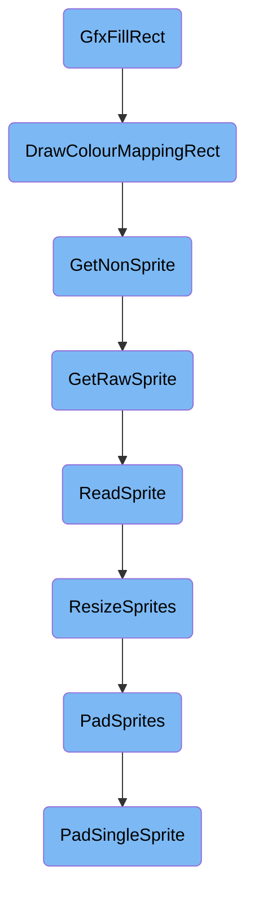
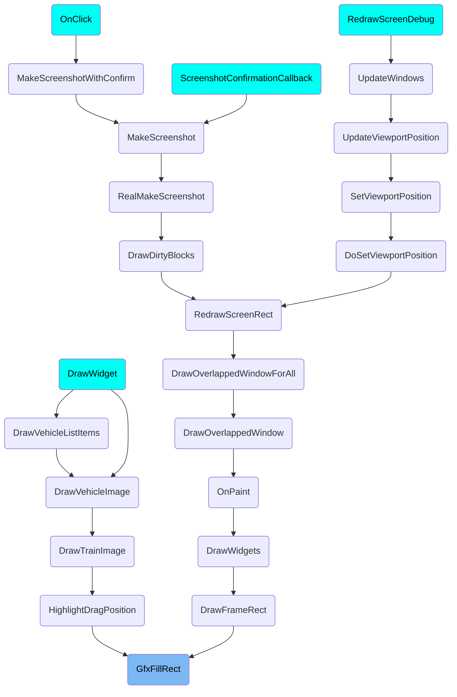

This document explains the process of filling a rectangle on the screen with a specific color or pattern. The process involves several steps, including determining the fill mode, drawing the rectangle, and handling sprite data.

The flow starts with the <SwmToken path="src/gfx.cpp" pos="114:2:2" line-data="void GfxFillRect(int left, int top, int right, int bottom, int colour, FillRectMode mode)">`GfxFillRect`</SwmToken> function, which decides how to fill a rectangle on the screen. It can fill the rectangle with a solid color, a checker pattern, or a recolor sprite. The function ensures the rectangle is within screen boundaries and then uses the appropriate method to draw it. Next, the <SwmToken path="src/blitter/40bpp_anim.cpp" pos="351:4:4" line-data="void Blitter_40bppAnim::DrawColourMappingRect(void *dst, int width, int height, PaletteID pal)">`DrawColourMappingRect`</SwmToken> function applies a color mapping to the rectangle. If animations are disabled, it uses a parent method; otherwise, it processes the destination buffer. The <SwmToken path="src/spritecache.h" pos="64:7:7" line-data="inline const uint8_t *GetNonSprite(SpriteID sprite, SpriteType type)">`GetNonSprite`</SwmToken> function retrieves a recolor mapping, and <SwmToken path="src/spritecache.h" pos="67:7:7" line-data="	return (uint8_t*)GetRawSprite(sprite, type);">`GetRawSprite`</SwmToken> reads the sprite data from disk or cache. The <SwmToken path="src/spritecache.cpp" pos="461:5:5" line-data="static void *ReadSprite(const SpriteCache *sc, SpriteID id, SpriteType sprite_type, SpriteAllocator &amp;allocator, SpriteEncoder *encoder)">`ReadSprite`</SwmToken> function handles loading the sprite data, ensuring it is correctly resized and encoded. Finally, <SwmToken path="src/spritecache.cpp" pos="381:4:4" line-data="static bool ResizeSprites(SpriteLoader::SpriteCollection &amp;sprite, uint8_t sprite_avail, SpriteEncoder *encoder)">`ResizeSprites`</SwmToken> and <SwmToken path="src/spritecache.cpp" pos="333:4:4" line-data="static bool PadSprites(SpriteLoader::SpriteCollection &amp;sprite, uint8_t sprite_avail, SpriteEncoder *encoder)">`PadSprites`</SwmToken> functions ensure the sprites are correctly sized and padded to match the required dimensions.

# Flow drill down



<SwmSnippet path="/src/gfx.cpp" line="100">

---

## <SwmToken path="src/gfx.cpp" pos="114:2:2" line-data="void GfxFillRect(int left, int top, int right, int bottom, int colour, FillRectMode mode)">`GfxFillRect`</SwmToken>

The <SwmToken path="src/gfx.cpp" pos="114:2:2" line-data="void GfxFillRect(int left, int top, int right, int bottom, int colour, FillRectMode mode)">`GfxFillRect`</SwmToken> function is responsible for applying a fill operation to a specified rectangle on the screen. It handles different fill modes such as opaque, checker, and recolour. This function ensures that the rectangle is within the screen boundaries and then delegates the actual drawing to the appropriate blitter method based on the fill mode.

```c++
/**
 * Applies a certain FillRectMode-operation to a rectangle [left, right] x [top, bottom] on the screen.
 *
 * @pre dpi->zoom == ZOOM_LVL_MIN, right >= left, bottom >= top
 * @param left Minimum X (inclusive)
 * @param top Minimum Y (inclusive)
 * @param right Maximum X (inclusive)
 * @param bottom Maximum Y (inclusive)
 * @param colour A 8 bit palette index (FILLRECT_OPAQUE and FILLRECT_CHECKER) or a recolour spritenumber (FILLRECT_RECOLOUR)
 * @param mode
 *         FILLRECT_OPAQUE:   Fill the rectangle with the specified colour
 *         FILLRECT_CHECKER:  Like FILLRECT_OPAQUE, but only draw every second pixel (used to grey out things)
 *         FILLRECT_RECOLOUR:  Apply a recolour sprite to every pixel in the rectangle currently on screen
 */
void GfxFillRect(int left, int top, int right, int bottom, int colour, FillRectMode mode)
{
	Blitter *blitter = BlitterFactory::GetCurrentBlitter();
	const DrawPixelInfo *dpi = _cur_dpi;
	void *dst;
	const int otop = top;
	const int oleft = left;
```

---

</SwmSnippet>

<SwmSnippet path="/src/blitter/40bpp_anim.cpp" line="351">

---

## <SwmToken path="src/blitter/40bpp_anim.cpp" pos="351:4:4" line-data="void Blitter_40bppAnim::DrawColourMappingRect(void *dst, int width, int height, PaletteID pal)">`DrawColourMappingRect`</SwmToken>

The <SwmToken path="src/blitter/40bpp_anim.cpp" pos="351:4:4" line-data="void Blitter_40bppAnim::DrawColourMappingRect(void *dst, int width, int height, PaletteID pal)">`DrawColourMappingRect`</SwmToken> function is used to draw a rectangle with a colour mapping. It checks if animations are disabled and uses the parent method if so. Otherwise, it processes the destination buffer and applies the colour mapping based on the specified palette.

```c++
void Blitter_40bppAnim::DrawColourMappingRect(void *dst, int width, int height, PaletteID pal)
{
	if (_screen_disable_anim) {
		/* This means our output is not to the screen, so we can't be doing any animation stuff, so use our parent DrawColourMappingRect() */
		Blitter_32bppOptimized::DrawColourMappingRect(dst, width, height, pal);
		return;
	}

	Colour *udst = (Colour *)dst;
	uint8_t *anim = VideoDriver::GetInstance()->GetAnimBuffer() + ((uint32_t *)dst - (uint32_t *)_screen.dst_ptr);

	if (pal == PALETTE_TO_TRANSPARENT) {
		/* If the anim buffer contains a color value, the image composition will
		 * only look at the RGB brightness value. As such, we can simply darken the
		 * RGB value to darken the anim color. */
		do {
			for (int i = 0; i != width; i++) {
				Colour b = *anim != 0 ? Colour(this->GetColourBrightness(*udst), 0, 0) : *udst;
				*udst = MakeTransparent(b, 154);
				udst++;
				anim++;
```

---

</SwmSnippet>

<SwmSnippet path="/src/spritecache.h" line="64">

---

## <SwmToken path="src/spritecache.h" pos="64:7:7" line-data="inline const uint8_t *GetNonSprite(SpriteID sprite, SpriteType type)">`GetNonSprite`</SwmToken>

The <SwmToken path="src/spritecache.h" pos="64:7:7" line-data="inline const uint8_t *GetNonSprite(SpriteID sprite, SpriteType type)">`GetNonSprite`</SwmToken> function retrieves a non-sprite recolour mapping. It asserts that the sprite type is recolour and then calls <SwmToken path="src/spritecache.h" pos="67:7:7" line-data="	return (uint8_t*)GetRawSprite(sprite, type);">`GetRawSprite`</SwmToken> to get the raw sprite data.

```c
inline const uint8_t *GetNonSprite(SpriteID sprite, SpriteType type)
{
	assert(type == SpriteType::Recolour);
	return (uint8_t*)GetRawSprite(sprite, type);
}
```

---

</SwmSnippet>

<SwmSnippet path="/src/spritecache.cpp" line="947">

---

## <SwmToken path="src/spritecache.cpp" pos="956:3:3" line-data="void *GetRawSprite(SpriteID sprite, SpriteType type, SpriteAllocator *allocator, SpriteEncoder *encoder)">`GetRawSprite`</SwmToken>

The <SwmToken path="src/spritecache.cpp" pos="956:3:3" line-data="void *GetRawSprite(SpriteID sprite, SpriteType type, SpriteAllocator *allocator, SpriteEncoder *encoder)">`GetRawSprite`</SwmToken> function reads a sprite from disk or the sprite cache. It ensures the sprite exists and is of the correct type, then either loads it from the cache or reads it from disk using the <SwmToken path="src/spritecache.cpp" pos="461:5:5" line-data="static void *ReadSprite(const SpriteCache *sc, SpriteID id, SpriteType sprite_type, SpriteAllocator &amp;allocator, SpriteEncoder *encoder)">`ReadSprite`</SwmToken> function.

```c++
/**
 * Reads a sprite (from disk or sprite cache).
 * If the sprite is not available or of wrong type, a fallback sprite is returned.
 * @param sprite Sprite to read.
 * @param type Expected sprite type.
 * @param allocator Allocator function to use. Set to nullptr to use the usual sprite cache.
 * @param encoder Sprite encoder to use. Set to nullptr to use the currently active blitter.
 * @return Sprite raw data
 */
void *GetRawSprite(SpriteID sprite, SpriteType type, SpriteAllocator *allocator, SpriteEncoder *encoder)
{
	assert(type != SpriteType::MapGen || IsMapgenSpriteID(sprite));
	assert(type < SpriteType::Invalid);

	if (!SpriteExists(sprite)) {
		Debug(sprite, 1, "Tried to load non-existing sprite #{}. Probable cause: Wrong/missing NewGRFs", sprite);

		/* SPR_IMG_QUERY is a BIG FAT RED ? */
		sprite = SPR_IMG_QUERY;
	}

```

---

</SwmSnippet>

<SwmSnippet path="/src/spritecache.cpp" line="452">

---

## <SwmToken path="src/spritecache.cpp" pos="461:5:5" line-data="static void *ReadSprite(const SpriteCache *sc, SpriteID id, SpriteType sprite_type, SpriteAllocator &amp;allocator, SpriteEncoder *encoder)">`ReadSprite`</SwmToken>

The <SwmToken path="src/spritecache.cpp" pos="461:5:5" line-data="static void *ReadSprite(const SpriteCache *sc, SpriteID id, SpriteType sprite_type, SpriteAllocator &amp;allocator, SpriteEncoder *encoder)">`ReadSprite`</SwmToken> function reads a sprite from disk. It uses the current blitter if no other encoder is specified and loads the sprite data, handling different sprite types and ensuring the sprite is correctly resized and encoded.

```c++
/**
 * Read a sprite from disk.
 * @param sc          Location of sprite.
 * @param id          Sprite number.
 * @param sprite_type Type of sprite.
 * @param allocator   Allocator function to use.
 * @param encoder     Sprite encoder to use.
 * @return Read sprite data.
 */
static void *ReadSprite(const SpriteCache *sc, SpriteID id, SpriteType sprite_type, SpriteAllocator &allocator, SpriteEncoder *encoder)
{
	/* Use current blitter if no other sprite encoder is given. */
	if (encoder == nullptr) encoder = BlitterFactory::GetCurrentBlitter();

	SpriteFile &file = *sc->file;
	size_t file_pos = sc->file_pos;

	assert(sprite_type != SpriteType::Recolour);
	assert(IsMapgenSpriteID(id) == (sprite_type == SpriteType::MapGen));
	assert(sc->type == sprite_type);

```

---

</SwmSnippet>

<SwmSnippet path="/src/spritecache.cpp" line="381">

---

## <SwmToken path="src/spritecache.cpp" pos="381:4:4" line-data="static bool ResizeSprites(SpriteLoader::SpriteCollection &amp;sprite, uint8_t sprite_avail, SpriteEncoder *encoder)">`ResizeSprites`</SwmToken>

The <SwmToken path="src/spritecache.cpp" pos="381:4:4" line-data="static bool ResizeSprites(SpriteLoader::SpriteCollection &amp;sprite, uint8_t sprite_avail, SpriteEncoder *encoder)">`ResizeSprites`</SwmToken> function ensures that all zoom levels of a sprite are available and correctly sized. It resizes the sprite to the minimum zoom level if necessary and pads the sprites to match the required dimensions.

```c++
static bool ResizeSprites(SpriteLoader::SpriteCollection &sprite, uint8_t sprite_avail, SpriteEncoder *encoder)
{
	/* Create a fully zoomed image if it does not exist */
	ZoomLevel first_avail = static_cast<ZoomLevel>(FindFirstBit(sprite_avail));
	if (first_avail != ZOOM_LVL_MIN) {
		if (!ResizeSpriteIn(sprite, first_avail, ZOOM_LVL_MIN)) return false;
		SetBit(sprite_avail, ZOOM_LVL_MIN);
	}

	/* Pad sprites to make sizes match. */
	if (!PadSprites(sprite, sprite_avail, encoder)) return false;

	/* Create other missing zoom levels */
	for (ZoomLevel zoom = ZOOM_LVL_BEGIN; zoom != ZOOM_LVL_END; zoom++) {
		if (zoom == ZOOM_LVL_MIN) continue;

		if (HasBit(sprite_avail, zoom)) {
			/* Check that size and offsets match the fully zoomed image. */
			assert(sprite[zoom].width  == UnScaleByZoom(sprite[ZOOM_LVL_MIN].width,  zoom));
			assert(sprite[zoom].height == UnScaleByZoom(sprite[ZOOM_LVL_MIN].height, zoom));
			assert(sprite[zoom].x_offs == UnScaleByZoom(sprite[ZOOM_LVL_MIN].x_offs, zoom));
```

---

</SwmSnippet>

<SwmSnippet path="/src/spritecache.cpp" line="333">

---

## <SwmToken path="src/spritecache.cpp" pos="333:4:4" line-data="static bool PadSprites(SpriteLoader::SpriteCollection &amp;sprite, uint8_t sprite_avail, SpriteEncoder *encoder)">`PadSprites`</SwmToken>

The <SwmToken path="src/spritecache.cpp" pos="333:4:4" line-data="static bool PadSprites(SpriteLoader::SpriteCollection &amp;sprite, uint8_t sprite_avail, SpriteEncoder *encoder)">`PadSprites`</SwmToken> function pads the sprites to ensure their dimensions match the required alignment. It calculates the necessary padding for each zoom level and applies it using the <SwmToken path="src/spritecache.cpp" pos="284:4:4" line-data="static bool PadSingleSprite(SpriteLoader::Sprite *sprite, ZoomLevel zoom, uint pad_left, uint pad_top, uint pad_right, uint pad_bottom)">`PadSingleSprite`</SwmToken> function.

```c++
static bool PadSprites(SpriteLoader::SpriteCollection &sprite, uint8_t sprite_avail, SpriteEncoder *encoder)
{
	/* Get minimum top left corner coordinates. */
	int min_xoffs = INT32_MAX;
	int min_yoffs = INT32_MAX;
	for (ZoomLevel zoom = ZOOM_LVL_BEGIN; zoom != ZOOM_LVL_END; zoom++) {
		if (HasBit(sprite_avail, zoom)) {
			min_xoffs = std::min(min_xoffs, ScaleByZoom(sprite[zoom].x_offs, zoom));
			min_yoffs = std::min(min_yoffs, ScaleByZoom(sprite[zoom].y_offs, zoom));
		}
	}

	/* Get maximum dimensions taking necessary padding at the top left into account. */
	int max_width  = INT32_MIN;
	int max_height = INT32_MIN;
	for (ZoomLevel zoom = ZOOM_LVL_BEGIN; zoom != ZOOM_LVL_END; zoom++) {
		if (HasBit(sprite_avail, zoom)) {
			max_width  = std::max(max_width, ScaleByZoom(sprite[zoom].width + sprite[zoom].x_offs - UnScaleByZoom(min_xoffs, zoom), zoom));
			max_height = std::max(max_height, ScaleByZoom(sprite[zoom].height + sprite[zoom].y_offs - UnScaleByZoom(min_yoffs, zoom), zoom));
		}
	}
```

---

</SwmSnippet>

<SwmSnippet path="/src/spritecache.cpp" line="284">

---

## <SwmToken path="src/spritecache.cpp" pos="284:4:4" line-data="static bool PadSingleSprite(SpriteLoader::Sprite *sprite, ZoomLevel zoom, uint pad_left, uint pad_top, uint pad_right, uint pad_bottom)">`PadSingleSprite`</SwmToken>

The <SwmToken path="src/spritecache.cpp" pos="284:4:4" line-data="static bool PadSingleSprite(SpriteLoader::Sprite *sprite, ZoomLevel zoom, uint pad_left, uint pad_top, uint pad_right, uint pad_bottom)">`PadSingleSprite`</SwmToken> function applies padding to a single sprite. It reallocates the sprite memory to include the padding and updates the sprite's dimensions and offsets accordingly.

```c++
static bool PadSingleSprite(SpriteLoader::Sprite *sprite, ZoomLevel zoom, uint pad_left, uint pad_top, uint pad_right, uint pad_bottom)
{
	uint width  = sprite->width + pad_left + pad_right;
	uint height = sprite->height + pad_top + pad_bottom;

	if (width > UINT16_MAX || height > UINT16_MAX) return false;

	/* Copy source data and reallocate sprite memory. */
	size_t sprite_size = static_cast<size_t>(sprite->width) * sprite->height;
	std::vector<SpriteLoader::CommonPixel> src_data(sprite->data, sprite->data + sprite_size);
	sprite->AllocateData(zoom, static_cast<size_t>(width) * height);

	/* Copy with padding to destination. */
	SpriteLoader::CommonPixel *src = src_data.data();
	SpriteLoader::CommonPixel *data = sprite->data;
	for (uint y = 0; y < height; y++) {
		if (y < pad_top || pad_bottom + y >= height) {
			/* Top/bottom padding. */
			MemSetT(data, 0, width);
			data += width;
		} else {
```

---

</SwmSnippet>

# Where is this flow used?

This flow is used multiple times in the codebase as represented in the following diagram:

(Note - these are only some of the entry points of this flow)



&nbsp;

*This is an auto-generated document by Swimm AI 🌊 and has not yet been verified by a human*

<SwmMeta version="3.0.0" repo-id="Z2l0aHViJTNBJTNBT3BlblRURC1jb3BpbG90LWRlbW8lM0ElM0Fzd2ltbWlv" repo-name="OpenTTD-copilot-demo"><sup>Powered by [Swimm](/)</sup></SwmMeta>
