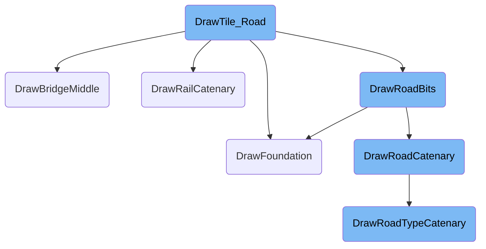
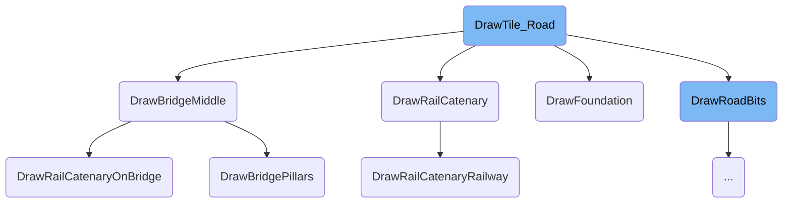
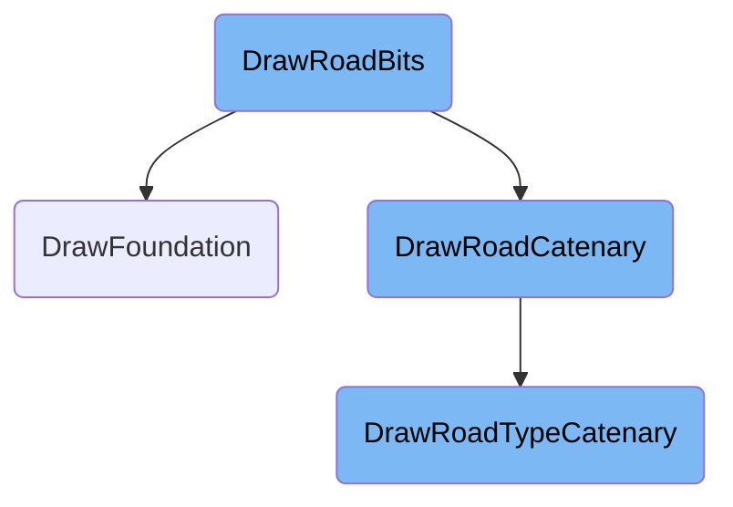

This document explains the process of rendering road tiles in the game. It covers the different types of road tiles, how they are drawn, and the various components involved in the rendering process.

The process starts by determining the type of road tile to render. For normal road tiles, the system handles the rendering directly. For road crossings, it checks if the tile is flat and ensures the foundation is leveled. It then draws the appropriate ground sprite and overlays, including road and rail catenary if necessary. The rendering of bridges involves checking for a bridge above the current tile, determining the bridge's axis and type, and drawing various components like the floor, far part, and roof. The system also handles the rendering of tram and rail bits, including catenary if applicable, and draws the bridge pillars if required.

Here is a high level diagram of the flow, showing only the most important functions:



# Flow drill down

First, we'll zoom into this section of the flow:



<SwmSnippet path="/src/road_cmd.cpp" line="1704">

---

## Rendering Road Tiles

The function <SwmToken path="src/road_cmd.cpp" pos="1704:4:4" line-data="static void DrawTile_Road(TileInfo *ti)">`DrawTile_Road`</SwmToken> begins by determining the type of road tile to render. For normal road tiles, it calls <SwmToken path="src/road_cmd.cpp" pos="1708:1:1" line-data="			DrawRoadBits(ti);">`DrawRoadBits`</SwmToken> to handle the rendering.

```c++
static void DrawTile_Road(TileInfo *ti)
{
	switch (GetRoadTileType(ti->tile)) {
		case ROAD_TILE_NORMAL:
			DrawRoadBits(ti);
			break;

```

---

</SwmSnippet>

<SwmSnippet path="/src/road_cmd.cpp" line="1711">

---

### Handling Road Crossings

For road crossings, the function checks if the tile is not flat and calls <SwmToken path="src/road_cmd.cpp" pos="1712:13:13" line-data="			if (ti-&gt;tileh != SLOPE_FLAT) DrawFoundation(ti, FOUNDATION_LEVELED);">`DrawFoundation`</SwmToken> to ensure the foundation is leveled. It then determines the axis and type of crossing, and draws the appropriate ground sprite and overlays, including road and rail catenary if necessary.

```c++
		case ROAD_TILE_CROSSING: {
			if (ti->tileh != SLOPE_FLAT) DrawFoundation(ti, FOUNDATION_LEVELED);

			Axis axis = GetCrossingRailAxis(ti->tile);

			const RailTypeInfo *rti = GetRailTypeInfo(GetRailType(ti->tile));

			RoadType road_rt = GetRoadTypeRoad(ti->tile);
			RoadType tram_rt = GetRoadTypeTram(ti->tile);
			const RoadTypeInfo *road_rti = road_rt == INVALID_ROADTYPE ? nullptr : GetRoadTypeInfo(road_rt);
			const RoadTypeInfo *tram_rti = tram_rt == INVALID_ROADTYPE ? nullptr : GetRoadTypeInfo(tram_rt);

			PaletteID pal = PAL_NONE;

			/* Draw base ground */
			if (rti->UsesOverlay()) {
				SpriteID image = SPR_ROAD_Y + axis;

				Roadside roadside = GetRoadside(ti->tile);
				if (DrawRoadAsSnowDesert(IsOnSnow(ti->tile), roadside)) {
					image += 19;
```

---

</SwmSnippet>

<SwmSnippet path="/src/tunnelbridge_cmd.cpp" line="1541">

---

## Drawing Bridge Middle

The function <SwmToken path="src/tunnelbridge_cmd.cpp" pos="1541:2:2" line-data="void DrawBridgeMiddle(const TileInfo *ti)">`DrawBridgeMiddle`</SwmToken> is responsible for rendering the middle section of a bridge. It first checks if there is a bridge above the current tile and then proceeds to determine the bridge's axis and type.

```c++
void DrawBridgeMiddle(const TileInfo *ti)
{
	/* Sectional view of bridge bounding boxes:
	 *
	 *  1           2                                1,2 = SpriteCombine of Bridge front/(back&floor) and RoadCatenary
	 *  1           2                                  3 = empty helper BB
	 *  1     7     2                                4,5 = pillars under higher bridges
	 *  1 6 88888 6 2                                  6 = elrail-pylons
	 *  1 6 88888 6 2                                  7 = elrail-wire
	 *  1 6 88888 6 2  <- TILE_HEIGHT                  8 = rail-vehicle on bridge
	 *  3333333333333  <- BB_Z_SEPARATOR
	 *                 <- unused
	 *    4       5    <- BB_HEIGHT_UNDER_BRIDGE
	 *    4       5
	 *    4       5
	 *
	 */

	if (!IsBridgeAbove(ti->tile)) return;

```

---

</SwmSnippet>

<SwmSnippet path="/src/tunnelbridge_cmd.cpp" line="1561">

---

### Rendering Bridge Components

The function continues by drawing various components of the bridge, including the floor, far part, and roof. It also handles the rendering of tram and rail bits, including catenary if applicable. Finally, it draws the bridge pillars if required.

```c++
	TileIndex rampnorth = GetNorthernBridgeEnd(ti->tile);
	TileIndex rampsouth = GetSouthernBridgeEnd(ti->tile);
	TransportType transport_type = GetTunnelBridgeTransportType(rampsouth);

	Axis axis = GetBridgeAxis(ti->tile);
	BridgePieces piece = CalcBridgePiece(
		GetTunnelBridgeLength(ti->tile, rampnorth) + 1,
		GetTunnelBridgeLength(ti->tile, rampsouth) + 1
	);

	const PalSpriteID *psid;
	bool drawfarpillar;
	if (transport_type != TRANSPORT_WATER) {
		BridgeType type =  GetBridgeType(rampsouth);
		drawfarpillar = !HasBit(GetBridgeSpec(type)->flags, 0);

		uint base_offset;
		if (transport_type == TRANSPORT_RAIL) {
			base_offset = GetRailTypeInfo(GetRailType(rampsouth))->bridge_offset;
		} else {
			base_offset = 8;
```

---

</SwmSnippet>

<SwmSnippet path="/src/elrail.cpp" line="568">

---

## Drawing Rail Catenary

The function <SwmToken path="src/elrail.cpp" pos="568:2:2" line-data="void DrawRailCatenary(const TileInfo *ti)">`DrawRailCatenary`</SwmToken> handles the rendering of overhead wires and pylons for electric railways. It checks the type of tile and calls <SwmToken path="src/elrail.cpp" pos="278:4:4" line-data="static void DrawRailCatenaryRailway(const TileInfo *ti)">`DrawRailCatenaryRailway`</SwmToken> for railway tiles.

```c++
void DrawRailCatenary(const TileInfo *ti)
{
	switch (GetTileType(ti->tile)) {
		case MP_RAILWAY:
			if (IsRailDepot(ti->tile)) {
				const SortableSpriteStruct *sss = &RailCatenarySpriteData_Depot[GetRailDepotDirection(ti->tile)];

				SpriteID wire_base = GetWireBase(ti->tile);

				/* This wire is not visible with the default depot sprites */
				AddSortableSpriteToDraw(
					wire_base + sss->image_offset, PAL_NONE, ti->x + sss->x_offset, ti->y + sss->y_offset,
					sss->x_size, sss->y_size, sss->z_size,
					GetTileMaxPixelZ(ti->tile) + sss->z_offset,
					IsTransparencySet(TO_CATENARY)
				);
				return;
			}
			break;

		case MP_TUNNELBRIDGE:
```

---

</SwmSnippet>

<SwmSnippet path="/src/landscape.cpp" line="425">

---

## Drawing Foundations

The function <SwmToken path="src/landscape.cpp" pos="425:2:2" line-data="void DrawFoundation(TileInfo *ti, Foundation f)">`DrawFoundation`</SwmToken> is responsible for rendering the foundation of a tile. It determines the type of foundation required and draws the appropriate sprites, ensuring the foundation is correctly positioned and leveled.

```c++
void DrawFoundation(TileInfo *ti, Foundation f)
{
	if (!IsFoundation(f)) return;

	/* Two part foundations must be drawn separately */
	assert(f != FOUNDATION_STEEP_BOTH);

	uint sprite_block = 0;
	auto [slope, z] = GetFoundationPixelSlope(ti->tile);

	/* Select the needed block of foundations sprites
	 * Block 0: Walls at NW and NE edge
	 * Block 1: Wall  at        NE edge
	 * Block 2: Wall  at NW        edge
	 * Block 3: No walls at NW or NE edge
	 */
	if (!HasFoundationNW(ti->tile, slope, z)) sprite_block += 1;
	if (!HasFoundationNE(ti->tile, slope, z)) sprite_block += 2;

	/* Use the original slope sprites if NW and NE borders should be visible */
	SpriteID leveled_base = (sprite_block == 0 ? (int)SPR_FOUNDATION_BASE : (SPR_SLOPES_VIRTUAL_BASE + sprite_block * SPR_TRKFOUND_BLOCK_SIZE));
```

---

</SwmSnippet>

<SwmSnippet path="/src/elrail.cpp" line="506">

---

## Drawing Rail Catenary on Bridges

The function <SwmToken path="src/elrail.cpp" pos="506:2:2" line-data="void DrawRailCatenaryOnBridge(const TileInfo *ti)">`DrawRailCatenaryOnBridge`</SwmToken> handles the rendering of wires and pylons on bridge tiles. It calculates the position and height of the wires and pylons and draws them accordingly.

```c++
void DrawRailCatenaryOnBridge(const TileInfo *ti)
{
	TileIndex end = GetSouthernBridgeEnd(ti->tile);
	TileIndex start = GetOtherBridgeEnd(end);

	uint length = GetTunnelBridgeLength(start, end);
	uint num = GetTunnelBridgeLength(ti->tile, start) + 1;
	uint height;

	const SortableSpriteStruct *sss;
	Axis axis = GetBridgeAxis(ti->tile);
	TLG tlg = GetTLG(ti->tile);

	RailCatenarySprite offset = (RailCatenarySprite)(axis == AXIS_X ? 0 : WIRE_Y_FLAT_BOTH - WIRE_X_FLAT_BOTH);

	if ((length % 2) && num == length) {
		/* Draw the "short" wire on the southern end of the bridge
		 * only needed if the length of the bridge is odd */
		sss = &RailCatenarySpriteData[WIRE_X_FLAT_BOTH + offset];
	} else {
		/* Draw "long" wires on all other tiles of the bridge (one pylon every two tiles) */
```

---

</SwmSnippet>

<SwmSnippet path="/src/tunnelbridge_cmd.cpp" line="1074">

---

## Drawing Bridge Pillars

The function <SwmToken path="src/tunnelbridge_cmd.cpp" pos="1074:4:4" line-data="static void DrawBridgePillars(const PalSpriteID *psid, const TileInfo *ti, Axis axis, bool drawfarpillar, int x, int y, int z_bridge)">`DrawBridgePillars`</SwmToken> is responsible for rendering the pillars under high bridges. It calculates the height and position of the pillars and draws them, ensuring they are correctly aligned with the bridge.

```c++
static void DrawBridgePillars(const PalSpriteID *psid, const TileInfo *ti, Axis axis, bool drawfarpillar, int x, int y, int z_bridge)
{
	static const int bounding_box_size[2]  = {16, 2}; ///< bounding box size of pillars along bridge direction
	static const int back_pillar_offset[2] = { 0, 9}; ///< sprite position offset of back facing pillar

	static const int INF = 1000; ///< big number compared to sprite size
	static const SubSprite half_pillar_sub_sprite[2][2] = {
		{ {  -14, -INF, INF, INF }, { -INF, -INF, -15, INF } }, // X axis, north and south
		{ { -INF, -INF,  15, INF }, {   16, -INF, INF, INF } }, // Y axis, north and south
	};

	if (psid->sprite == 0) return;

	/* Determine ground height under pillars */
	DiagDirection south_dir = AxisToDiagDir(axis);
	int z_front_north = ti->z;
	int z_back_north = ti->z;
	int z_front_south = ti->z;
	int z_back_south = ti->z;
	GetSlopePixelZOnEdge(ti->tileh, south_dir, z_front_south, z_back_south);
	GetSlopePixelZOnEdge(ti->tileh, ReverseDiagDir(south_dir), z_front_north, z_back_north);
```

---

</SwmSnippet>

Now, lets zoom into this section of the flow:



<SwmSnippet path="/src/road_cmd.cpp" line="1623">

---

## Drawing Road Bits

The <SwmToken path="src/road_cmd.cpp" pos="1623:4:4" line-data="static void DrawRoadBits(TileInfo *ti)">`DrawRoadBits`</SwmToken> function is responsible for rendering the ground sprite and road pieces on the game map. It first retrieves the road and tram bits for the tile and then determines the road types. If the tile is not flat, it draws the foundation. It then draws the ground sprites for the road and tram, including any <SwmToken path="src/road_cmd.cpp" pos="655:9:11" line-data="						/* Junctions cannot be one-way */">`one-way`</SwmToken> road indicators. If there are road works on the tile, it draws the excavation sprite and exits. Otherwise, it proceeds to draw the road catenary and additional details like street lights or trees, considering various conditions such as zoom level and visibility settings.

```c++
static void DrawRoadBits(TileInfo *ti)
{
	RoadBits road = GetRoadBits(ti->tile, RTT_ROAD);
	RoadBits tram = GetRoadBits(ti->tile, RTT_TRAM);

	RoadType road_rt = GetRoadTypeRoad(ti->tile);
	RoadType tram_rt = GetRoadTypeTram(ti->tile);
	const RoadTypeInfo *road_rti = road_rt == INVALID_ROADTYPE ? nullptr : GetRoadTypeInfo(road_rt);
	const RoadTypeInfo *tram_rti = tram_rt == INVALID_ROADTYPE ? nullptr : GetRoadTypeInfo(tram_rt);

	if (ti->tileh != SLOPE_FLAT) {
		DrawFoundation(ti, GetRoadFoundation(ti->tileh, road | tram));
		/* DrawFoundation() modifies ti. */
	}

	DrawRoadGroundSprites(ti, road, tram, road_rti, tram_rti, GetRoadside(ti->tile), IsOnSnow(ti->tile));

	/* Draw one way */
	if (road_rti != nullptr) {
		DisallowedRoadDirections drd = GetDisallowedRoadDirections(ti->tile);
		if (drd != DRD_NONE) {
```

---

</SwmSnippet>

<SwmSnippet path="/src/road_cmd.cpp" line="1451">

---

## Drawing Road Catenary

The <SwmToken path="src/road_cmd.cpp" pos="1451:2:2" line-data="void DrawRoadCatenary(const TileInfo *ti)">`DrawRoadCatenary`</SwmToken> function handles the drawing of catenary (overhead wires) for the given tile. It first checks the type of tile and determines the road and tram bits. If the tile is a road or station, it proceeds to draw the catenary for the road type if it has catenary drawn. This function ensures that the catenary is only drawn where appropriate, such as on normal roads, level crossings, or road stops.

```c++
void DrawRoadCatenary(const TileInfo *ti)
{
	RoadBits road = ROAD_NONE;
	RoadBits tram = ROAD_NONE;

	if (IsTileType(ti->tile, MP_ROAD)) {
		if (IsNormalRoad(ti->tile)) {
			road = GetRoadBits(ti->tile, RTT_ROAD);
			tram = GetRoadBits(ti->tile, RTT_TRAM);
		} else if (IsLevelCrossing(ti->tile)) {
			tram = road = (GetCrossingRailAxis(ti->tile) == AXIS_Y ? ROAD_X : ROAD_Y);
		}
	} else if (IsTileType(ti->tile, MP_STATION)) {
		if (IsAnyRoadStop(ti->tile)) {
			if (IsDriveThroughStopTile(ti->tile)) {
				Axis axis = GetRoadStopDir(ti->tile) == DIAGDIR_NE ? AXIS_X : AXIS_Y;
				tram = road = (axis == AXIS_X ? ROAD_X : ROAD_Y);
			} else {
				tram = road = DiagDirToRoadBits(GetRoadStopDir(ti->tile));
			}
		}
```

---

</SwmSnippet>

<SwmSnippet path="/src/road_cmd.cpp" line="1379">

---

### Drawing Road Type Catenary

The <SwmToken path="src/road_cmd.cpp" pos="1379:2:2" line-data="void DrawRoadTypeCatenary(const TileInfo *ti, RoadType rt, RoadBits rb)">`DrawRoadTypeCatenary`</SwmToken> function is called by <SwmToken path="src/road_cmd.cpp" pos="1451:2:2" line-data="void DrawRoadCatenary(const TileInfo *ti)">`DrawRoadCatenary`</SwmToken> to draw the catenary for a specific road type. It checks if there is a bridge above the tile and skips drawing if the bridge is too low. It then determines the appropriate sprites for the catenary based on the road bits and tile height. The function also handles the coloring of the catenary to indicate the owner of the road. Finally, it adds the catenary sprites to the draw list, ensuring they are rendered correctly on the game map.

```c++
void DrawRoadTypeCatenary(const TileInfo *ti, RoadType rt, RoadBits rb)
{
	/* Don't draw the catenary under a low bridge */
	if (IsBridgeAbove(ti->tile) && !IsTransparencySet(TO_CATENARY)) {
		int height = GetBridgeHeight(GetNorthernBridgeEnd(ti->tile));

		if (height <= GetTileMaxZ(ti->tile) + 1) return;
	}

	if (CountBits(rb) > 2) {
		/* On junctions we check whether neighbouring tiles also have catenary, and possibly
		 * do not draw catenary towards those neighbours, which do not have catenary. */
		RoadBits rb_new = ROAD_NONE;
		for (DiagDirection dir = DIAGDIR_BEGIN; dir < DIAGDIR_END; dir++) {
			if (rb & DiagDirToRoadBits(dir)) {
				TileIndex neighbour = TileAddByDiagDir(ti->tile, dir);
				if (MayHaveRoad(neighbour)) {
					RoadType rt_road = GetRoadTypeRoad(neighbour);
					RoadType rt_tram = GetRoadTypeTram(neighbour);

					if ((rt_road != INVALID_ROADTYPE && HasRoadCatenary(rt_road)) ||
```

---

</SwmSnippet>

&nbsp;

*This is an auto-generated document by Swimm AI 🌊 and has not yet been verified by a human*

<SwmMeta version="3.0.0" repo-id="Z2l0aHViJTNBJTNBT3BlblRURC1jb3BpbG90LWRlbW8lM0ElM0Fzd2ltbWlv" repo-name="OpenTTD-copilot-demo"><sup>Powered by [Swimm](/)</sup></SwmMeta>
