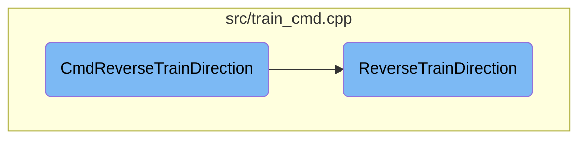

In this document, we will explain the process of reversing a train's direction. The process involves validating the train, checking ownership, handling specific conditions for single units and entire trains, and updating the train's state and UI.

The flow starts by validating the train and checking if the user owns it. If you want to reverse a single unit, the train must be in a depot and not have multiple units. For reversing the entire train, it checks if the train is the primary vehicle and not broken down. The function then reverses the train's direction, updates its state, and refreshes the UI to reflect the changes.

# Flow drill down



<SwmSnippet path="/src/train_cmd.cpp" line="2052">

---

## <SwmToken path="src/train_cmd.cpp" pos="2059:2:2" line-data="CommandCost CmdReverseTrainDirection(DoCommandFlag flags, VehicleID veh_id, bool reverse_single_veh)">`CmdReverseTrainDirection`</SwmToken>

The <SwmToken path="src/train_cmd.cpp" pos="2059:2:2" line-data="CommandCost CmdReverseTrainDirection(DoCommandFlag flags, VehicleID veh_id, bool reverse_single_veh)">`CmdReverseTrainDirection`</SwmToken> function is responsible for reversing the direction of a train. It first validates the train and checks ownership. If the <SwmToken path="src/train_cmd.cpp" pos="2056:6:6" line-data=" * @param reverse_single_veh if true, reverse a unit in a train (needs to be in a depot)">`reverse_single_veh`</SwmToken> flag is set, it ensures the train is in a depot and not multi-headed before reversing the direction of a single unit. If reversing the entire train, it checks if the train is the primary vehicle and not crashed or broken down. The function then handles the reversal, updates the train's state, and marks relevant windows as dirty to refresh the UI.

```c++
/**
 * Reverse train.
 * @param flags type of operation
 * @param veh_id train to reverse
 * @param reverse_single_veh if true, reverse a unit in a train (needs to be in a depot)
 * @return the cost of this operation or an error
 */
CommandCost CmdReverseTrainDirection(DoCommandFlag flags, VehicleID veh_id, bool reverse_single_veh)
{
	Train *v = Train::GetIfValid(veh_id);
	if (v == nullptr) return CMD_ERROR;

	CommandCost ret = CheckOwnership(v->owner);
	if (ret.Failed()) return ret;

	if (reverse_single_veh) {
		/* turn a single unit around */

		if (v->IsMultiheaded() || HasBit(EngInfo(v->engine_type)->callback_mask, CBM_VEHICLE_ARTIC_ENGINE)) {
			return_cmd_error(STR_ERROR_CAN_T_REVERSE_DIRECTION_RAIL_VEHICLE_MULTIPLE_UNITS);
		}
```

---

</SwmSnippet>

<SwmSnippet path="/src/train_cmd.cpp" line="1963">

---

## <SwmToken path="src/train_cmd.cpp" pos="1967:2:2" line-data="void ReverseTrainDirection(Train *v)">`ReverseTrainDirection`</SwmToken>

The <SwmToken path="src/train_cmd.cpp" pos="1967:2:2" line-data="void ReverseTrainDirection(Train *v)">`ReverseTrainDirection`</SwmToken> function performs the actual reversal of the train's direction. It handles various conditions such as clearing path reservations, swapping the positions of train vehicles, and updating the train's state and UI. It also manages specific scenarios like being inside a depot or approaching a crossing, ensuring the train's state is consistent and safe after the reversal.

```c++
/**
 * Turn a train around.
 * @param v %Train to turn around.
 */
void ReverseTrainDirection(Train *v)
{
	if (IsRailDepotTile(v->tile)) {
		if (IsWholeTrainInsideDepot(v)) return;
		InvalidateWindowData(WC_VEHICLE_DEPOT, v->tile);
	}

	/* Clear path reservation in front if train is not stuck. */
	if (!HasBit(v->flags, VRF_TRAIN_STUCK)) FreeTrainTrackReservation(v);

	/* Check if we were approaching a rail/road-crossing */
	TileIndex crossing = TrainApproachingCrossingTile(v);

	/* count number of vehicles */
	int r = CountVehiclesInChain(v) - 1;  // number of vehicles - 1

	AdvanceWagonsBeforeSwap(v);
```

---

</SwmSnippet>

&nbsp;

*This is an auto-generated document by Swimm AI 🌊 and has not yet been verified by a human*

<SwmMeta version="3.0.0" repo-id="Z2l0aHViJTNBJTNBT3BlblRURC1jb3BpbG90LWRlbW8lM0ElM0Fzd2ltbWlv" repo-name="OpenTTD-copilot-demo"><sup>Powered by [Swimm](/)</sup></SwmMeta>
