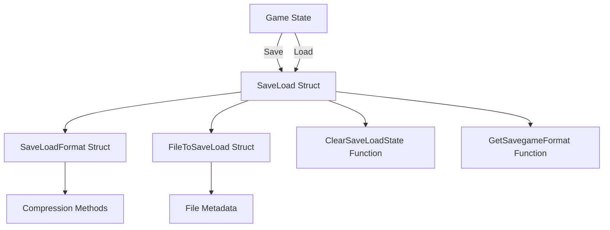

# Save Load Overview

Save Load refers to the functionality of saving and loading game states in <SwmToken path="src/saveload/company_sl.cpp" pos="2:13:13" line-data=" * This file is part of OpenTTD.">`OpenTTD`</SwmToken>. This document provides an overview of the key components and functions involved in the save and load processes.

# <SwmToken path="src/saveload/company_sl.cpp" pos="249:7:7" line-data="	inline static const SaveLoad description[] = {{}}; // Needed to keep DefaultSaveLoadHandler happy.">`SaveLoad`</SwmToken> Struct

The <SwmToken path="src/saveload/company_sl.cpp" pos="249:7:7" line-data="	inline static const SaveLoad description[] = {{}}; // Needed to keep DefaultSaveLoadHandler happy.">`SaveLoad`</SwmToken> struct defines the properties and actions for saving and loading different types of variables. It includes fields for the variable's name, type, length, and version information.

# Usage in Company Save Load

The <SwmToken path="src/saveload/company_sl.cpp" pos="249:7:7" line-data="	inline static const SaveLoad description[] = {{}}; // Needed to keep DefaultSaveLoadHandler happy.">`SaveLoad`</SwmToken> struct is used to describe how different company-related elements should be saved and loaded. This includes settings for engine renewal, company economy, and livery.

<SwmSnippet path="/src/saveload/company_sl.cpp" line="248">

---

The <SwmToken path="src/saveload/company_sl.cpp" pos="249:7:7" line-data="	inline static const SaveLoad description[] = {{}}; // Needed to keep DefaultSaveLoadHandler happy.">`SaveLoad`</SwmToken> struct is used in <SwmPath>[src/saveload/company_sl.cpp](src/saveload/company_sl.cpp)</SwmPath> to describe how different company-related elements should be saved and loaded.

```c++
public:
	inline static const SaveLoad description[] = {{}}; // Needed to keep DefaultSaveLoadHandler happy.
	inline const static SaveLoadCompatTable compat_description = _company_old_ai_buildrec_compat;

	SaveLoadTable GetDescription() const override { return {}; }

	void Load(CompanyOldAI *old_ai) const override
	{
		for (int i = 0; i != old_ai->num_build_rec; i++) {
			SlObject(nullptr, this->GetLoadDescription());
		}
	}

	void LoadCheck(CompanyOldAI *old_ai) const override { this->Load(old_ai); }
};

class SlCompanyOldAI : public DefaultSaveLoadHandler<SlCompanyOldAI, CompanyProperties> {
public:
	inline static const SaveLoad description[] = {
		SLE_CONDVAR(CompanyOldAI, num_build_rec, SLE_UINT8, SL_MIN_VERSION, SLV_107),
```

---

</SwmSnippet>

# <SwmToken path="src/saveload/saveload.cpp" pos="2631:2:2" line-data="struct SaveLoadFormat {">`SaveLoadFormat`</SwmToken> Struct

The <SwmToken path="src/saveload/saveload.cpp" pos="2631:2:2" line-data="struct SaveLoadFormat {">`SaveLoadFormat`</SwmToken> struct defines the format for reading and writing savegames, including the compression methods used. It specifies the name, tag, and compression levels for each format.

<SwmSnippet path="/src/saveload/saveload.cpp" line="2630">

---

The <SwmToken path="src/saveload/saveload.cpp" pos="2631:2:2" line-data="struct SaveLoadFormat {">`SaveLoadFormat`</SwmToken> struct defines the format for reading and writing savegames, including the compression methods used.

```c++
/** The format for a reader/writer type of a savegame */
struct SaveLoadFormat {
	const char *name;                     ///< name of the compressor/decompressor (debug-only)
	uint32_t tag;                           ///< the 4-letter tag by which it is identified in the savegame

	std::shared_ptr<LoadFilter> (*init_load)(std::shared_ptr<LoadFilter> chain); ///< Constructor for the load filter.
	std::shared_ptr<SaveFilter> (*init_write)(std::shared_ptr<SaveFilter> chain, uint8_t compression); ///< Constructor for the save filter.

	uint8_t min_compression;                 ///< the minimum compression level of this format
	uint8_t default_compression;             ///< the default compression level of this format
	uint8_t max_compression;                 ///< the maximum compression level of this format
};
```

---

</SwmSnippet>

# <SwmToken path="src/saveload/saveload.h" pos="401:2:2" line-data="struct FileToSaveLoad {">`FileToSaveLoad`</SwmToken> Struct

The <SwmToken path="src/saveload/saveload.h" pos="401:2:2" line-data="struct FileToSaveLoad {">`FileToSaveLoad`</SwmToken> struct deals with the type of savegame file, including its name and internal title. It also specifies the file operation to perform and the file type.

<SwmSnippet path="/src/saveload/saveload.h" line="400">

---

The <SwmToken path="src/saveload/saveload.h" pos="401:2:2" line-data="struct FileToSaveLoad {">`FileToSaveLoad`</SwmToken> struct deals with the type of savegame file, including its name and internal title.

```c
/** Deals with the type of the savegame, independent of extension */
struct FileToSaveLoad {
	SaveLoadOperation file_op;       ///< File operation to perform.
	DetailedFileType detail_ftype;   ///< Concrete file type (PNG, BMP, old save, etc).
	AbstractFileType abstract_ftype; ///< Abstract type of file (scenario, heightmap, etc).
	std::string name;                ///< Name of the file.
	std::string title;               ///< Internal name of the game.

	void SetMode(FiosType ft);
	void SetMode(SaveLoadOperation fop, AbstractFileType aft, DetailedFileType dft);
	void Set(const FiosItem &item);
};
```

---

</SwmSnippet>

# <SwmToken path="src/saveload/saveload.cpp" pos="2742:6:6" line-data="static inline void ClearSaveLoadState()">`ClearSaveLoadState`</SwmToken> Function

The <SwmToken path="src/saveload/saveload.cpp" pos="2742:6:6" line-data="static inline void ClearSaveLoadState()">`ClearSaveLoadState`</SwmToken> function is used to clear or free the <SwmToken path="src/saveload/saveload.cpp" pos="1671:20:22" line-data=" * @param slt The SaveLoad table with objects to save/load.">`save/load`</SwmToken> state. It resets various components involved in the <SwmToken path="src/saveload/saveload.cpp" pos="1671:20:22" line-data=" * @param slt The SaveLoad table with objects to save/load.">`save/load`</SwmToken> process.

<SwmSnippet path="/src/saveload/saveload.cpp" line="2739">

---

The <SwmToken path="src/saveload/saveload.cpp" pos="2742:6:6" line-data="static inline void ClearSaveLoadState()">`ClearSaveLoadState`</SwmToken> function is used to clear or free the <SwmToken path="src/saveload/saveload.cpp" pos="1671:20:22" line-data=" * @param slt The SaveLoad table with objects to save/load.">`save/load`</SwmToken> state.

```c++
/**
 * Clear/free saveload state.
 */
static inline void ClearSaveLoadState()
{
	_sl.dumper = nullptr;
	_sl.sf = nullptr;
	_sl.reader = nullptr;
	_sl.lf = nullptr;
}
```

---

</SwmSnippet>

# <SwmToken path="src/saveload/saveload.cpp" pos="2684:15:15" line-data="static std::pair&lt;const SaveLoadFormat &amp;, uint8_t&gt; GetSavegameFormat(const std::string &amp;full_name)">`GetSavegameFormat`</SwmToken> Function

The <SwmToken path="src/saveload/saveload.cpp" pos="2684:15:15" line-data="static std::pair&lt;const SaveLoadFormat &amp;, uint8_t&gt; GetSavegameFormat(const std::string &amp;full_name)">`GetSavegameFormat`</SwmToken> function finds the default savegame format, selecting the highest one with which files can be written. It returns a pair containing a reference to the <SwmToken path="src/saveload/saveload.cpp" pos="2631:2:2" line-data="struct SaveLoadFormat {">`SaveLoadFormat`</SwmToken> struct and a compression level.

<SwmSnippet path="/src/saveload/saveload.cpp" line="2684">

---

The <SwmToken path="src/saveload/saveload.cpp" pos="2684:15:15" line-data="static std::pair&lt;const SaveLoadFormat &amp;, uint8_t&gt; GetSavegameFormat(const std::string &amp;full_name)">`GetSavegameFormat`</SwmToken> function finds the default savegame format, selecting the highest one with which files can be written.

```c++
static std::pair<const SaveLoadFormat &, uint8_t> GetSavegameFormat(const std::string &full_name)
{
	/* Find default savegame format, the highest one with which files can be written. */
	auto it = std::find_if(std::rbegin(_saveload_formats), std::rend(_saveload_formats), [](const auto &slf) { return slf.init_write != nullptr; });
	if (it == std::rend(_saveload_formats)) SlError(STR_GAME_SAVELOAD_ERROR_BROKEN_INTERNAL_ERROR, "no writeable savegame formats");

	const SaveLoadFormat &def = *it;
```

---

</SwmSnippet>

# Main Functions

There are several main functions in this folder. Some of them are <SwmToken path="src/saveload/saveload.cpp" pos="3071:2:2" line-data="SaveOrLoadResult SaveOrLoad(const std::string &amp;filename, SaveLoadOperation fop, DetailedFileType dft, Subdirectory sb, bool threaded)">`SaveOrLoad`</SwmToken>, <SwmToken path="src/saveload/company_sl.cpp" pos="257:1:1" line-data="			SlObject(nullptr, this-&gt;GetLoadDescription());">`SlObject`</SwmToken>, and <SwmToken path="src/saveload/saveload.cpp" pos="2802:4:4" line-data="static SaveOrLoadResult SaveFileToDisk(bool threaded)">`SaveFileToDisk`</SwmToken>. We will dive a little into <SwmToken path="src/saveload/saveload.cpp" pos="3071:2:2" line-data="SaveOrLoadResult SaveOrLoad(const std::string &amp;filename, SaveLoadOperation fop, DetailedFileType dft, Subdirectory sb, bool threaded)">`SaveOrLoad`</SwmToken> and <SwmToken path="src/saveload/company_sl.cpp" pos="257:1:1" line-data="			SlObject(nullptr, this-&gt;GetLoadDescription());">`SlObject`</SwmToken>.

## <SwmToken path="src/saveload/saveload.cpp" pos="3071:2:2" line-data="SaveOrLoadResult SaveOrLoad(const std::string &amp;filename, SaveLoadOperation fop, DetailedFileType dft, Subdirectory sb, bool threaded)">`SaveOrLoad`</SwmToken>

The <SwmToken path="src/saveload/saveload.cpp" pos="3071:2:2" line-data="SaveOrLoadResult SaveOrLoad(const std::string &amp;filename, SaveLoadOperation fop, DetailedFileType dft, Subdirectory sb, bool threaded)">`SaveOrLoad`</SwmToken> function is the main function for handling <SwmToken path="src/saveload/saveload.cpp" pos="3063:17:19" line-data=" * Main Save or Load function where the high-level saveload functions are">`high-level`</SwmToken> save and load operations. It opens the savegame, selects the format, and checks versions. It ensures that only one save operation is active at a time and handles different file operations like loading old game files or saving new ones.

<SwmSnippet path="/src/saveload/saveload.cpp" line="3062">

---

The <SwmToken path="src/saveload/saveload.cpp" pos="3071:2:2" line-data="SaveOrLoadResult SaveOrLoad(const std::string &amp;filename, SaveLoadOperation fop, DetailedFileType dft, Subdirectory sb, bool threaded)">`SaveOrLoad`</SwmToken> function is the main function for handling <SwmToken path="src/saveload/saveload.cpp" pos="3063:17:19" line-data=" * Main Save or Load function where the high-level saveload functions are">`high-level`</SwmToken> save and load operations.

```c++
/**
 * Main Save or Load function where the high-level saveload functions are
 * handled. It opens the savegame, selects format and checks versions
 * @param filename The name of the savegame being created/loaded
 * @param fop Save or load mode. Load can also be a TTD(Patch) game.
 * @param sb The sub directory to save the savegame in
 * @param threaded True when threaded saving is allowed
 * @return Return the result of the action. #SL_OK, #SL_ERROR, or #SL_REINIT ("unload" the game)
 */
SaveOrLoadResult SaveOrLoad(const std::string &filename, SaveLoadOperation fop, DetailedFileType dft, Subdirectory sb, bool threaded)
{
	/* An instance of saving is already active, so don't go saving again */
	if (_sl.saveinprogress && fop == SLO_SAVE && dft == DFT_GAME_FILE && threaded) {
		/* if not an autosave, but a user action, show error message */
		if (!_do_autosave) ShowErrorMessage(STR_ERROR_SAVE_STILL_IN_PROGRESS, INVALID_STRING_ID, WL_ERROR);
		return SL_OK;
	}
	WaitTillSaved();

	try {
		/* Load a TTDLX or TTDPatch game */
```

---

</SwmSnippet>

## <SwmToken path="src/saveload/company_sl.cpp" pos="257:1:1" line-data="			SlObject(nullptr, this-&gt;GetLoadDescription());">`SlObject`</SwmToken>

The <SwmToken path="src/saveload/company_sl.cpp" pos="257:1:1" line-data="			SlObject(nullptr, this-&gt;GetLoadDescription());">`SlObject`</SwmToken> function is the main function for saving or loading an object. It iterates through the <SwmToken path="src/saveload/company_sl.cpp" pos="249:7:7" line-data="	inline static const SaveLoad description[] = {{}}; // Needed to keep DefaultSaveLoadHandler happy.">`SaveLoad`</SwmToken> table and processes each member of the object according to the specified <SwmToken path="src/saveload/company_sl.cpp" pos="249:7:7" line-data="	inline static const SaveLoad description[] = {{}}; // Needed to keep DefaultSaveLoadHandler happy.">`SaveLoad`</SwmToken> actions. It also handles the calculation of object lengths if needed.

<SwmSnippet path="/src/saveload/saveload.cpp" line="1668">

---

The <SwmToken path="src/saveload/saveload.cpp" pos="1673:2:2" line-data="void SlObject(void *object, const SaveLoadTable &amp;slt)">`SlObject`</SwmToken> function is the main function for saving or loading an object.

```c++
/**
 * Main SaveLoad function.
 * @param object The object that is being saved or loaded.
 * @param slt The SaveLoad table with objects to save/load.
 */
void SlObject(void *object, const SaveLoadTable &slt)
{
	/* Automatically calculate the length? */
	if (_sl.need_length != NL_NONE) {
		SlSetLength(SlCalcObjLength(object, slt));
		if (_sl.need_length == NL_CALCLENGTH) return;
	}

	for (auto &sld : slt) {
		SlObjectMember(object, sld);
	}
}
```

---

</SwmSnippet>

## <SwmToken path="src/saveload/saveload.cpp" pos="2802:4:4" line-data="static SaveOrLoadResult SaveFileToDisk(bool threaded)">`SaveFileToDisk`</SwmToken>

The <SwmToken path="src/saveload/saveload.cpp" pos="2802:4:4" line-data="static SaveOrLoadResult SaveFileToDisk(bool threaded)">`SaveFileToDisk`</SwmToken> function handles the final step of saving a game to disk. It selects the appropriate savegame format and writes the savegame data to the file. It also manages error handling and state clearing after the save operation is completed.

<SwmSnippet path="/src/saveload/saveload.cpp" line="2798">

---

The <SwmToken path="src/saveload/saveload.cpp" pos="2802:4:4" line-data="static SaveOrLoadResult SaveFileToDisk(bool threaded)">`SaveFileToDisk`</SwmToken> function handles the final step of saving a game to disk.

```c++
/**
 * We have written the whole game into memory, _memory_savegame, now find
 * and appropriate compressor and start writing to file.
 */
static SaveOrLoadResult SaveFileToDisk(bool threaded)
{
	try {
		auto [fmt, compression] = GetSavegameFormat(_savegame_format);

		/* We have written our stuff to memory, now write it to file! */
		uint32_t hdr[2] = { fmt.tag, TO_BE32(SAVEGAME_VERSION << 16) };
		_sl.sf->Write((uint8_t*)hdr, sizeof(hdr));

		_sl.sf = fmt.init_write(_sl.sf, compression);
		_sl.dumper->Flush(_sl.sf);

		ClearSaveLoadState();

		if (threaded) SetAsyncSaveFinish(SaveFileDone);

		return SL_OK;
```

---

</SwmSnippet>

# Save Load Endpoints

Save Load Endpoints include <SwmToken path="src/saveload/randomizer_sl.cpp" pos="21:2:2" line-data="struct SRNDChunkHandler : ChunkHandler {">`SRNDChunkHandler`</SwmToken> and <SwmToken path="src/saveload/cargopacket_sl.cpp" pos="139:2:2" line-data="struct CAPAChunkHandler : ChunkHandler {">`CAPAChunkHandler`</SwmToken>, which manage the saving and loading of script randomizers and cargo packets, respectively.

### <SwmToken path="src/saveload/randomizer_sl.cpp" pos="21:2:2" line-data="struct SRNDChunkHandler : ChunkHandler {">`SRNDChunkHandler`</SwmToken>

The <SwmToken path="src/saveload/randomizer_sl.cpp" pos="21:2:2" line-data="struct SRNDChunkHandler : ChunkHandler {">`SRNDChunkHandler`</SwmToken> struct handles the saving and loading of script randomizers. It overrides the <SwmToken path="src/saveload/saveload.cpp" pos="1671:20:20" line-data=" * @param slt The SaveLoad table with objects to save/load.">`save`</SwmToken> and <SwmToken path="src/saveload/company_sl.cpp" pos="254:3:3" line-data="	void Load(CompanyOldAI *old_ai) const override">`Load`</SwmToken> methods to define how randomizer data is serialized and deserialized. The <SwmToken path="src/saveload/saveload.cpp" pos="1671:20:20" line-data=" * @param slt The SaveLoad table with objects to save/load.">`save`</SwmToken> method iterates over owners and saves their randomizer states, while the <SwmToken path="src/saveload/company_sl.cpp" pos="254:3:3" line-data="	void Load(CompanyOldAI *old_ai) const override">`Load`</SwmToken> method restores these states.

<SwmSnippet path="/src/saveload/randomizer_sl.cpp" line="21">

---

The <SwmToken path="src/saveload/randomizer_sl.cpp" pos="21:2:2" line-data="struct SRNDChunkHandler : ChunkHandler {">`SRNDChunkHandler`</SwmToken> struct handles the saving and loading of script randomizers.

```c++
struct SRNDChunkHandler : ChunkHandler {
	SRNDChunkHandler() : ChunkHandler('SRND', CH_TABLE)
	{}

	void Save() const override
	{
		SlTableHeader(_randomizer_desc);

		for (Owner owner = OWNER_BEGIN; owner < OWNER_END; owner++) {
			SlSetArrayIndex(owner);
			SlObject(&ScriptObject::GetRandomizer(owner), _randomizer_desc);
		}
	}

	void Load() const override
	{
		SlTableHeader(_randomizer_desc);

		Owner index;
		while ((index = (Owner)SlIterateArray()) != (Owner)-1) {
			SlObject(&ScriptObject::GetRandomizer(index), _randomizer_desc);
```

---

</SwmSnippet>

### <SwmToken path="src/saveload/cargopacket_sl.cpp" pos="139:2:2" line-data="struct CAPAChunkHandler : ChunkHandler {">`CAPAChunkHandler`</SwmToken>

The <SwmToken path="src/saveload/cargopacket_sl.cpp" pos="139:2:2" line-data="struct CAPAChunkHandler : ChunkHandler {">`CAPAChunkHandler`</SwmToken> struct manages the saving and loading of cargo packets. It overrides the <SwmToken path="src/saveload/saveload.cpp" pos="1671:20:20" line-data=" * @param slt The SaveLoad table with objects to save/load.">`save`</SwmToken> and <SwmToken path="src/saveload/company_sl.cpp" pos="254:3:3" line-data="	void Load(CompanyOldAI *old_ai) const override">`Load`</SwmToken> methods to handle the serialization and deserialization of cargo packet data. The <SwmToken path="src/saveload/saveload.cpp" pos="1671:20:20" line-data=" * @param slt The SaveLoad table with objects to save/load.">`save`</SwmToken> method iterates over cargo packets and saves their state, while the <SwmToken path="src/saveload/company_sl.cpp" pos="254:3:3" line-data="	void Load(CompanyOldAI *old_ai) const override">`Load`</SwmToken> method restores the state of each cargo packet.

<SwmSnippet path="/src/saveload/cargopacket_sl.cpp" line="139">

---

The <SwmToken path="src/saveload/cargopacket_sl.cpp" pos="139:2:2" line-data="struct CAPAChunkHandler : ChunkHandler {">`CAPAChunkHandler`</SwmToken> struct manages the saving and loading of cargo packets.

```c++
struct CAPAChunkHandler : ChunkHandler {
	CAPAChunkHandler() : ChunkHandler('CAPA', CH_TABLE) {}

	void Save() const override
	{
		SlTableHeader(GetCargoPacketDesc());

		for (CargoPacket *cp : CargoPacket::Iterate()) {
			SlSetArrayIndex(cp->index);
			SlObject(cp, GetCargoPacketDesc());
		}
	}

	void Load() const override
	{
		const std::vector<SaveLoad> slt = SlCompatTableHeader(GetCargoPacketDesc(), _cargopacket_sl_compat);

		int index;

		while ((index = SlIterateArray()) != -1) {
			CargoPacket *cp = new (index) CargoPacket();
```

---

</SwmSnippet>

&nbsp;

*This is an auto-generated document by Swimm AI 🌊 and has not yet been verified by a human*

<SwmMeta version="3.0.0" repo-id="Z2l0aHViJTNBJTNBT3BlblRURC1jb3BpbG90LWRlbW8lM0ElM0Fzd2ltbWlv" repo-name="OpenTTD-copilot-demo"><sup>Powered by [Swimm](/)</sup></SwmMeta>
