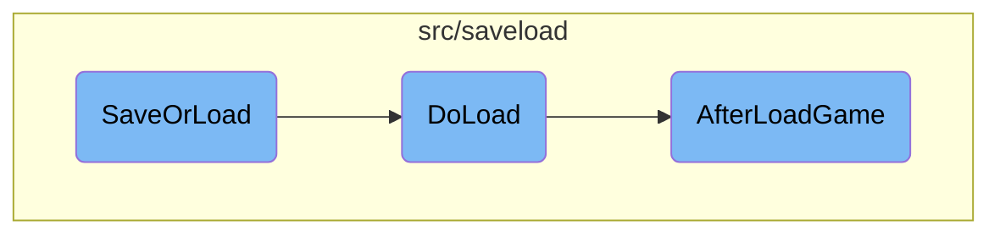
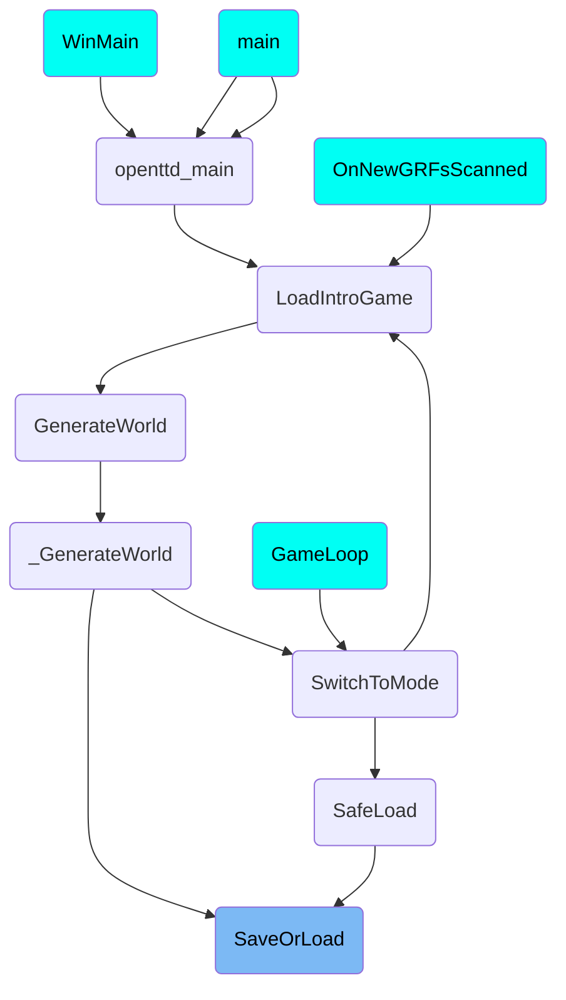

In this document, we will explain the process of saving or loading a game state. The process involves determining the operation type, initializing the game state, and handling specific functions for saving or loading.

The flow starts with determining whether the operation is to save or load a game. If it's a save operation, the game state is saved to a file. If it's a load operation, the game state is loaded from a file. After loading, the game state is adjusted to ensure compatibility with older versions and to fix any inconsistencies.

# Flow drill down



<SwmSnippet path="/src/saveload/saveload.cpp" line="3071">

---

## <SwmToken path="src/saveload/saveload.cpp" pos="3071:2:2" line-data="SaveOrLoadResult SaveOrLoad(const std::string &amp;filename, SaveLoadOperation fop, DetailedFileType dft, Subdirectory sb, bool threaded)">`SaveOrLoad`</SwmToken>

The <SwmToken path="src/saveload/saveload.cpp" pos="3071:2:2" line-data="SaveOrLoadResult SaveOrLoad(const std::string &amp;filename, SaveLoadOperation fop, DetailedFileType dft, Subdirectory sb, bool threaded)">`SaveOrLoad`</SwmToken> function is the main entry point for handling save or load operations. It determines whether the operation is a save or load, initializes necessary game state, and delegates to specific functions for saving or loading. For example, it calls <SwmToken path="src/saveload/saveload.cpp" pos="2951:4:4" line-data="static SaveOrLoadResult DoLoad(std::shared_ptr&lt;LoadFilter&gt; reader, bool load_check)">`DoLoad`</SwmToken> for loading a game and handles old game formats by resetting <SwmToken path="src/saveload/saveload.cpp" pos="323:18:20" line-data="	/* Distinguish between loading into _load_check_data vs. normal save/load. */">`save/load`</SwmToken> data and initializing the game with a default map size.

```c++
SaveOrLoadResult SaveOrLoad(const std::string &filename, SaveLoadOperation fop, DetailedFileType dft, Subdirectory sb, bool threaded)
{
	/* An instance of saving is already active, so don't go saving again */
	if (_sl.saveinprogress && fop == SLO_SAVE && dft == DFT_GAME_FILE && threaded) {
		/* if not an autosave, but a user action, show error message */
		if (!_do_autosave) ShowErrorMessage(STR_ERROR_SAVE_STILL_IN_PROGRESS, INVALID_STRING_ID, WL_ERROR);
		return SL_OK;
	}
	WaitTillSaved();

	try {
		/* Load a TTDLX or TTDPatch game */
		if (fop == SLO_LOAD && dft == DFT_OLD_GAME_FILE) {
			ResetSaveloadData();

			InitializeGame(256, 256, true, true); // set a mapsize of 256x256 for TTDPatch games or it might get confused

			/* TTD/TTO savegames have no NewGRFs, TTDP savegame have them
			 * and if so a new NewGRF list will be made in LoadOldSaveGame.
			 * Note: this is done here because AfterLoadGame is also called
			 * for OTTD savegames which have their own NewGRF logic. */
```

---

</SwmSnippet>

<SwmSnippet path="/src/saveload/saveload.cpp" line="2951">

---

## <SwmToken path="src/saveload/saveload.cpp" pos="2951:4:4" line-data="static SaveOrLoadResult DoLoad(std::shared_ptr&lt;LoadFilter&gt; reader, bool load_check)">`DoLoad`</SwmToken>

The <SwmToken path="src/saveload/saveload.cpp" pos="2951:4:4" line-data="static SaveOrLoadResult DoLoad(std::shared_ptr&lt;LoadFilter&gt; reader, bool load_check)">`DoLoad`</SwmToken> function performs the actual loading of a savegame. It reads the savegame header, determines the appropriate format, and initializes the game state. If the load is successful, it proceeds to load game chunks and resolve references. This function ensures that the game state is correctly set up before any post-load adjustments are made.

```c++
static SaveOrLoadResult DoLoad(std::shared_ptr<LoadFilter> reader, bool load_check)
{
	_sl.lf = reader;

	if (load_check) {
		/* Clear previous check data */
		_load_check_data.Clear();
		/* Mark SL_LOAD_CHECK as supported for this savegame. */
		_load_check_data.checkable = true;
	}

	uint32_t hdr[2];
	if (_sl.lf->Read((uint8_t*)hdr, sizeof(hdr)) != sizeof(hdr)) SlError(STR_GAME_SAVELOAD_ERROR_FILE_NOT_READABLE);

	/* see if we have any loader for this type. */
	const SaveLoadFormat *fmt = DetermineSaveLoadFormat(hdr[0], hdr[1]);

	/* loader for this savegame type is not implemented? */
	if (fmt->init_load == nullptr) {
		SlError(STR_GAME_SAVELOAD_ERROR_BROKEN_INTERNAL_ERROR, fmt::format("Loader for '{}' is not available.", fmt->name));
	}
```

---

</SwmSnippet>

<SwmSnippet path="/src/saveload/afterload.cpp" line="564">

---

## <SwmToken path="src/saveload/afterload.cpp" pos="564:2:2" line-data="bool AfterLoadGame()">`AfterLoadGame`</SwmToken>

The <SwmToken path="src/saveload/afterload.cpp" pos="564:2:2" line-data="bool AfterLoadGame()">`AfterLoadGame`</SwmToken> function handles post-load adjustments and conversions. It ensures compatibility with older savegame versions by performing necessary conversions and updates. This includes rebuilding various data structures, updating game settings, and fixing any inconsistencies. This function is crucial for maintaining game stability and ensuring that older savegames work correctly with the current game version.

```c++
bool AfterLoadGame()
{
	SetSignalHandlers();

	extern TileIndex _cur_tileloop_tile; // From landscape.cpp.
	/* The LFSR used in RunTileLoop iteration cannot have a zeroed state, make it non-zeroed. */
	if (_cur_tileloop_tile == 0) _cur_tileloop_tile = 1;

	if (IsSavegameVersionBefore(SLV_98)) _gamelog.Oldver();

	_gamelog.TestRevision();
	_gamelog.TestMode();

	RebuildTownKdtree();
	RebuildStationKdtree();
	/* This needs to be done even before conversion, because some conversions will destroy objects
	 * that otherwise won't exist in the tree. */
	RebuildViewportKdtree();

	if (IsSavegameVersionBefore(SLV_98)) _gamelog.GRFAddList(_grfconfig);

```

---

</SwmSnippet>

# Where is this flow used?

This flow is used multiple times in the codebase as represented in the following diagram:

(Note - these are only some of the entry points of this flow)



&nbsp;

*This is an auto-generated document by Swimm AI 🌊 and has not yet been verified by a human*

<SwmMeta version="3.0.0" repo-id="Z2l0aHViJTNBJTNBT3BlblRURC1jb3BpbG90LWRlbW8lM0ElM0Fzd2ltbWlv" repo-name="OpenTTD-copilot-demo"><sup>Powered by [Swimm](/)</sup></SwmMeta>
