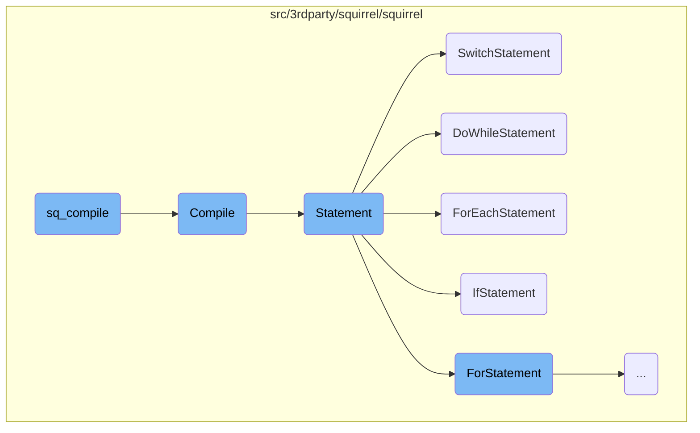
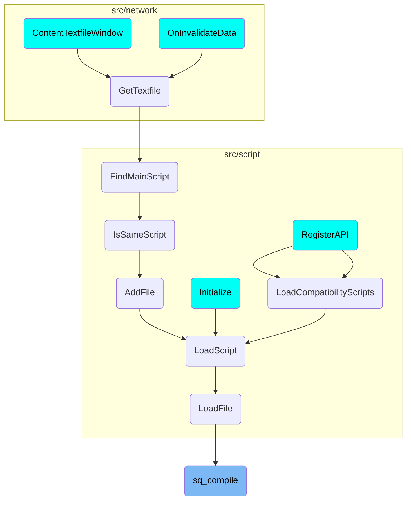

This document explains the process of compiling a script using the Squirrel scripting language. The compilation process involves several steps, including initializing the function state, processing tokens, and handling various types of statements such as if-statements, loops, and expressions.

The flow starts with the <SwmToken path="src/3rdparty/squirrel/squirrel/sqapi.cpp" pos="134:2:2" line-data="SQRESULT sq_compile(HSQUIRRELVM v,SQLEXREADFUNC read,SQUserPointer p,const SQChar *sourcename,SQBool raiseerror)">`sq_compile`</SwmToken> function, which initiates the compilation process. It calls the <SwmToken path="src/3rdparty/squirrel/squirrel/sqapi.cpp" pos="137:3:3" line-data="	if(Compile(v, read, p, sourcename, o, raiseerror != 0, _ss(v)-&gt;_debuginfo)) {">`Compile`</SwmToken> function to compile the script. The <SwmToken path="src/3rdparty/squirrel/squirrel/sqapi.cpp" pos="137:3:3" line-data="	if(Compile(v, read, p, sourcename, o, raiseerror != 0, _ss(v)-&gt;_debuginfo)) {">`Compile`</SwmToken> function sets up the initial state and processes each token in the script. It calls the <SwmToken path="src/3rdparty/squirrel/squirrel/sqcompiler.cpp" pos="167:1:1" line-data="				Statement();">`Statement`</SwmToken> function to handle different types of statements like if-statements, loops, and expressions. Each statement type is processed by its specific function, ensuring the script is correctly compiled into executable code.

Here is a high level diagram of the flow, showing only the most important functions:

```mermaid
graph TD;
      subgraph src3rdpartysquirrelsquirrel["src/3rdparty/squirrel/squirrel"]
1d89a021bfdc3e2598f3e5e7d150b1b6dc7f5c023f287619471e655d60e7f351(sq_compile):::mainFlowStyle --> a99a64eaec35077332979537243f66f96bdfc668bed213d9457c0f8ef0b7485f(Compile):::mainFlowStyle
end

subgraph src3rdpartysquirrelsquirrel["src/3rdparty/squirrel/squirrel"]
a99a64eaec35077332979537243f66f96bdfc668bed213d9457c0f8ef0b7485f(Compile):::mainFlowStyle --> 880033a40ff1db38ca9fc0222f43071bdbf35aa437a52ea524e66e3553d0621a(Statement):::mainFlowStyle
end

subgraph src3rdpartysquirrelsquirrel["src/3rdparty/squirrel/squirrel"]
880033a40ff1db38ca9fc0222f43071bdbf35aa437a52ea524e66e3553d0621a(Statement):::mainFlowStyle --> f40713e5036a179619589162105f5e661b40266a870bcc3b4546bbe027c4fb3d(SwitchStatement)
end

subgraph src3rdpartysquirrelsquirrel["src/3rdparty/squirrel/squirrel"]
880033a40ff1db38ca9fc0222f43071bdbf35aa437a52ea524e66e3553d0621a(Statement):::mainFlowStyle --> 1176045e652f77d13c1d9f2babc472338f92586d0044b71f6677059f87939fd8(DoWhileStatement)
end

subgraph src3rdpartysquirrelsquirrel["src/3rdparty/squirrel/squirrel"]
880033a40ff1db38ca9fc0222f43071bdbf35aa437a52ea524e66e3553d0621a(Statement):::mainFlowStyle --> 5ca87e2e1b7a1e4b052539d9567330bbe11d9a2c0d5d063dc4a05fbe10bb728a(ForEachStatement)
end

subgraph src3rdpartysquirrelsquirrel["src/3rdparty/squirrel/squirrel"]
880033a40ff1db38ca9fc0222f43071bdbf35aa437a52ea524e66e3553d0621a(Statement):::mainFlowStyle --> c5427c44e440f3fbafedd56511183d6a1eea8c0c368c5e5789c11d3d2cc8d117(IfStatement)
end

subgraph src3rdpartysquirrelsquirrel["src/3rdparty/squirrel/squirrel"]
880033a40ff1db38ca9fc0222f43071bdbf35aa437a52ea524e66e3553d0621a(Statement):::mainFlowStyle --> 50d2d317badc6da2c58741f51803e94021f72be0f0baf44ad63aeec256ea6ac9(ForStatement):::mainFlowStyle
end

subgraph src3rdpartysquirrelsquirrel["src/3rdparty/squirrel/squirrel"]
50d2d317badc6da2c58741f51803e94021f72be0f0baf44ad63aeec256ea6ac9(ForStatement):::mainFlowStyle --> 14da6ed1f445f477b7e5c79e48c6c1c81d49af88f4c630c7deedd384e338ccc3(LocalDeclStatement):::mainFlowStyle
end

subgraph src3rdpartysquirrelsquirrel["src/3rdparty/squirrel/squirrel"]
14da6ed1f445f477b7e5c79e48c6c1c81d49af88f4c630c7deedd384e338ccc3(LocalDeclStatement):::mainFlowStyle --> 3f6f955d90d2445527246bb4fef97789aafcab8f333a2cb97cbd3728e2eec682(Expression):::mainFlowStyle
end

subgraph src3rdpartysquirrelsquirrel["src/3rdparty/squirrel/squirrel"]
3f6f955d90d2445527246bb4fef97789aafcab8f333a2cb97cbd3728e2eec682(Expression):::mainFlowStyle --> 916ce4fb638474ccc8dcd4b1a917ed65cb5f4cc91f59bce0b3469e2d203dd887(LogicalOrExp):::mainFlowStyle
end

subgraph src3rdpartysquirrelsquirrel["src/3rdparty/squirrel/squirrel"]
916ce4fb638474ccc8dcd4b1a917ed65cb5f4cc91f59bce0b3469e2d203dd887(LogicalOrExp):::mainFlowStyle --> 2825cdd324610a661f82f3cfa930d0440e7085a37192141b44f58c9027ca6446(LogicalAndExp):::mainFlowStyle
end

subgraph src3rdpartysquirrelsquirrel["src/3rdparty/squirrel/squirrel"]
2825cdd324610a661f82f3cfa930d0440e7085a37192141b44f58c9027ca6446(LogicalAndExp):::mainFlowStyle --> 4e02fcff6f15bb833ad0b8b68ea7d6d9c29a7c2ece2fe68ee06a4f90a8034211(BitwiseOrExp):::mainFlowStyle
end

subgraph src3rdpartysquirrelsquirrel["src/3rdparty/squirrel/squirrel"]
4e02fcff6f15bb833ad0b8b68ea7d6d9c29a7c2ece2fe68ee06a4f90a8034211(BitwiseOrExp):::mainFlowStyle --> f12bd11613fee7867cf1d16aa8ed2c6e7f39a4f1a87035a7b26977b8ddc9adb1(BitwiseXorExp):::mainFlowStyle
end

subgraph src3rdpartysquirrelsquirrel["src/3rdparty/squirrel/squirrel"]
f12bd11613fee7867cf1d16aa8ed2c6e7f39a4f1a87035a7b26977b8ddc9adb1(BitwiseXorExp):::mainFlowStyle --> 789b2d3fee754a71be87495eb2322d6277ca0052a52dc11e29b0f7922e87ac61(BitwiseAndExp):::mainFlowStyle
end

subgraph src3rdpartysquirrelsquirrel["src/3rdparty/squirrel/squirrel"]
789b2d3fee754a71be87495eb2322d6277ca0052a52dc11e29b0f7922e87ac61(BitwiseAndExp):::mainFlowStyle --> 49e0909b2f5c0d188bdde00d10a5b2c45135e675af78eecd65a850cb3295e103(CompExp):::mainFlowStyle
end

subgraph src3rdpartysquirrelsquirrel["src/3rdparty/squirrel/squirrel"]
49e0909b2f5c0d188bdde00d10a5b2c45135e675af78eecd65a850cb3295e103(CompExp):::mainFlowStyle --> 0426bed2ebb09652ca98307887a263e54349bae7de8f25483927696ad56281fe(ShiftExp):::mainFlowStyle
end

subgraph src3rdpartysquirrelsquirrel["src/3rdparty/squirrel/squirrel"]
0426bed2ebb09652ca98307887a263e54349bae7de8f25483927696ad56281fe(ShiftExp):::mainFlowStyle --> 9af3025d0a9b2595df31d15a5433c4855cee22b5867fe074f7dc4baf465099e0(PlusExp):::mainFlowStyle
end

subgraph src3rdpartysquirrelsquirrel["src/3rdparty/squirrel/squirrel"]
9af3025d0a9b2595df31d15a5433c4855cee22b5867fe074f7dc4baf465099e0(PlusExp):::mainFlowStyle --> ff925c3b41637ccb2fef99418fb261eda71d080b0b471a327a3ab45e0ca8cff3(MultExp):::mainFlowStyle
end

subgraph src3rdpartysquirrelsquirrel["src/3rdparty/squirrel/squirrel"]
ff925c3b41637ccb2fef99418fb261eda71d080b0b471a327a3ab45e0ca8cff3(MultExp):::mainFlowStyle --> 000da99d01ed6933a179ae84844e139d1b24e60e2b84b68891906c496779f35b(PrefixedExpr):::mainFlowStyle
end

subgraph src3rdpartysquirrelsquirrel["src/3rdparty/squirrel/squirrel"]
000da99d01ed6933a179ae84844e139d1b24e60e2b84b68891906c496779f35b(PrefixedExpr):::mainFlowStyle --> fc89b10fa79ad79a222ee79c2b3862f532cfed4472c55194aa02702be80a3a6c(Factor):::mainFlowStyle
end

subgraph src3rdpartysquirrelsquirrel["src/3rdparty/squirrel/squirrel"]
fc89b10fa79ad79a222ee79c2b3862f532cfed4472c55194aa02702be80a3a6c(Factor):::mainFlowStyle --> 47d6359f7d1791e4aef09d072869617a9321bae8e4ce52d574c19678bb5fae34(CommaExpr):::mainFlowStyle
end


      classDef mainFlowStyle color:#000000,fill:#7CB9F4
classDef rootsStyle color:#000000,fill:#00FFF4
classDef Style1 color:#000000,fill:#00FFAA
classDef Style2 color:#000000,fill:#FFFF00
classDef Style3 color:#000000,fill:#AA7CB9
```



# Flow drill down

First, we'll zoom into this section of the flow:



<SwmSnippet path="/src/3rdparty/squirrel/squirrel/sqapi.cpp" line="134">

---

## Compiling the Script

The <SwmToken path="src/3rdparty/squirrel/squirrel/sqapi.cpp" pos="134:2:2" line-data="SQRESULT sq_compile(HSQUIRRELVM v,SQLEXREADFUNC read,SQUserPointer p,const SQChar *sourcename,SQBool raiseerror)">`sq_compile`</SwmToken> function initiates the compilation process. It calls the <SwmToken path="src/3rdparty/squirrel/squirrel/sqapi.cpp" pos="137:3:3" line-data="	if(Compile(v, read, p, sourcename, o, raiseerror != 0, _ss(v)-&gt;_debuginfo)) {">`Compile`</SwmToken> function to compile the script and then pushes the compiled closure onto the stack if successful.

```c++
SQRESULT sq_compile(HSQUIRRELVM v,SQLEXREADFUNC read,SQUserPointer p,const SQChar *sourcename,SQBool raiseerror)
{
	SQObjectPtr o;
	if(Compile(v, read, p, sourcename, o, raiseerror != 0, _ss(v)->_debuginfo)) {
		v->Push(SQClosure::Create(_ss(v), _funcproto(o)));
		return SQ_OK;
	}
	return SQ_ERROR;
}
```

---

</SwmSnippet>

<SwmSnippet path="/src/3rdparty/squirrel/squirrel/sqcompiler.cpp" line="153">

---

## Main Compilation Logic

The <SwmToken path="src/3rdparty/squirrel/squirrel/sqcompiler.cpp" pos="153:3:3" line-data="	bool Compile(SQObjectPtr &amp;o)">`Compile`</SwmToken> function handles the main compilation logic. It initializes the function state, processes tokens, and calls the <SwmToken path="src/3rdparty/squirrel/squirrel/sqcompiler.cpp" pos="167:1:1" line-data="				Statement();">`Statement`</SwmToken> function to handle each statement in the script.

```c++
	bool Compile(SQObjectPtr &o)
	{
		_debugline = 1;
		_debugop = 0;

		SQFuncState funcstate(_ss(_vm), nullptr);
		funcstate._name = SQString::Create(_ss(_vm), "main");
		_fs = &funcstate;
		_fs->AddParameter(_fs->CreateString("this"));
		_fs->_sourcename = _sourcename;
		SQInteger stacksize = _fs->GetStackSize();
		try {
			Lex();
			while(_token > 0){
				Statement();
				if(_lex._prevtoken != '}') OptionalSemicolon();
			}
			CleanStack(stacksize);
			_fs->AddLineInfos(_lex._currentline, _lineinfo, true);
			_fs->AddInstruction(_OP_RETURN, 0xFF);
			_fs->SetStackSize(0);
```

---

</SwmSnippet>

<SwmSnippet path="/src/3rdparty/squirrel/squirrel/sqcompiler.cpp" line="196">

---

## Handling Statements

The <SwmToken path="src/3rdparty/squirrel/squirrel/sqcompiler.cpp" pos="196:3:3" line-data="	void Statement()">`Statement`</SwmToken> function processes different types of statements based on the current token. It delegates specific statement types to their respective functions, such as <SwmToken path="src/3rdparty/squirrel/squirrel/sqcompiler.cpp" pos="201:6:6" line-data="		case TK_IF:		IfStatement();			break;">`IfStatement`</SwmToken>, <SwmToken path="src/3rdparty/squirrel/squirrel/sqcompiler.cpp" pos="203:6:6" line-data="		case TK_DO:		DoWhileStatement();		break;">`DoWhileStatement`</SwmToken>, and <SwmToken path="src/3rdparty/squirrel/squirrel/sqcompiler.cpp" pos="205:6:6" line-data="		case TK_FOREACH:	ForEachStatement();		break;">`ForEachStatement`</SwmToken>.

```c++
	void Statement()
	{
		_fs->AddLineInfos(_lex._currentline, _lineinfo);
		switch(_token){
		case ';':	Lex();					break;
		case TK_IF:		IfStatement();			break;
		case TK_WHILE:		WhileStatement();		break;
		case TK_DO:		DoWhileStatement();		break;
		case TK_FOR:		ForStatement();			break;
		case TK_FOREACH:	ForEachStatement();		break;
		case TK_SWITCH:	SwitchStatement();		break;
		case TK_LOCAL:		LocalDeclStatement();	break;
		case TK_RETURN:
		case TK_YIELD: {
			SQOpcode op;
			if(_token == TK_RETURN) {
				op = _OP_RETURN;

			}
			else {
				op = _OP_YIELD;
```

---

</SwmSnippet>

<SwmSnippet path="/src/3rdparty/squirrel/squirrel/sqcompiler.cpp" line="1008">

---

### Switch Statement

The <SwmToken path="src/3rdparty/squirrel/squirrel/sqcompiler.cpp" pos="1008:3:3" line-data="	void SwitchStatement()">`SwitchStatement`</SwmToken> function handles switch-case logic. It processes each case, generates the necessary instructions, and manages jumps between cases.

```c++
	void SwitchStatement()
	{
		Lex(); Expect('('); CommaExpr(); Expect(')');
		Expect('{');
		SQInteger expr = _fs->TopTarget();
		bool bfirst = true;
		SQInteger tonextcondjmp = -1;
		SQInteger skipcondjmp = -1;
		SQInteger __nbreaks__ = _fs->_unresolvedbreaks.size();
		_fs->_breaktargets.push_back(0);
		while(_token == TK_CASE) {
			//_fs->AddLineInfos(_lex._currentline, _lineinfo); think about this one
			if(!bfirst) {
				_fs->AddInstruction(_OP_JMP, 0, 0);
				skipcondjmp = _fs->GetCurrentPos();
				_fs->SetIntructionParam(tonextcondjmp, 1, _fs->GetCurrentPos() - tonextcondjmp);
			}
			//condition
			Lex(); Expression(); Expect(':');
			SQInteger trg = _fs->PopTarget();
			_fs->AddInstruction(_OP_EQ, trg, trg, expr);
```

---

</SwmSnippet>

<SwmSnippet path="/src/3rdparty/squirrel/squirrel/sqcompiler.cpp" line="904">

---

### Do-While Statement

The <SwmToken path="src/3rdparty/squirrel/squirrel/sqcompiler.cpp" pos="904:3:3" line-data="	void DoWhileStatement()">`DoWhileStatement`</SwmToken> function handles do-while loops. It generates the loop's body and condition check instructions, ensuring the loop executes at least once.

```c++
	void DoWhileStatement()
	{
		Lex();
		SQInteger jzpos = _fs->GetCurrentPos();
		SQInteger stacksize = _fs->GetStackSize();
		BEGIN_BREAKBLE_BLOCK()
		_last_stacksize = _fs->GetStackSize();
		Statement();
		CleanStack(stacksize);
		_fs->AddLineInfos(_lex._currentline, _lineinfo, true);
		Expect(TK_WHILE);
		SQInteger continuetrg = _fs->GetCurrentPos();
		Expect('('); CommaExpr(); Expect(')');
		_fs->AddInstruction(_OP_JNZ, _fs->PopTarget(), jzpos - _fs->GetCurrentPos() - 1);
		END_BREAKBLE_BLOCK(continuetrg);
	}
```

---

</SwmSnippet>

<SwmSnippet path="/src/3rdparty/squirrel/squirrel/sqcompiler.cpp" line="966">

---

### For-Each Statement

The <SwmToken path="src/3rdparty/squirrel/squirrel/sqcompiler.cpp" pos="966:3:3" line-data="	void ForEachStatement()">`ForEachStatement`</SwmToken> function handles for-each loops. It sets up the loop variables, evaluates the container expression, and generates the loop's body instructions.

```c++
	void ForEachStatement()
	{
		SQObject idxname, valname;
		Lex(); Expect('('); valname = Expect(TK_IDENTIFIER);
		if(_token == ',') {
			idxname = valname;
			Lex(); valname = Expect(TK_IDENTIFIER);
		}
		else{
			idxname = _fs->CreateString("@INDEX@");
		}
		Expect(TK_IN);

		//save the stack size
		SQInteger stacksize = _fs->GetStackSize();
		//put the table in the stack(evaluate the table expression)
		Expression(); Expect(')');
		SQInteger container = _fs->TopTarget();
		//push the index local var
		SQInteger indexpos = _fs->PushLocalVariable(idxname);
		_fs->AddInstruction(_OP_LOADNULLS, indexpos,1);
```

---

</SwmSnippet>

<SwmSnippet path="/src/3rdparty/squirrel/squirrel/sqcompiler.cpp" line="856">

---

### If Statement

The <SwmToken path="src/3rdparty/squirrel/squirrel/sqcompiler.cpp" pos="856:3:3" line-data="	void IfStatement()">`IfStatement`</SwmToken> function handles if-else logic. It generates instructions for the condition check, the if-block, and the optional else-block.

```c++
	void IfStatement()
	{
		SQInteger jmppos;
		bool haselse = false;
		Lex(); Expect('('); CommaExpr(); Expect(')');
		_fs->AddInstruction(_OP_JZ, _fs->PopTarget());
		SQInteger jnepos = _fs->GetCurrentPos();
		SQInteger stacksize = _fs->GetStackSize();

		Statement();
		//
		if(_token != '}' && _token != TK_ELSE) OptionalSemicolon();

		CleanStack(stacksize);
		SQInteger endifblock = _fs->GetCurrentPos();
		if(_token == TK_ELSE){
			haselse = true;
			stacksize = _fs->GetStackSize();
			_fs->AddInstruction(_OP_JMP);
			jmppos = _fs->GetCurrentPos();
			Lex();
```

---

</SwmSnippet>

Now, lets zoom into this section of the flow:

```mermaid
graph TD;
      subgraph src3rdpartysquirrelsquirrelsqcompilercpp["src/3rdparty/squirrel/squirrel/sqcompiler.cpp"]
50d2d317badc6da2c58741f51803e94021f72be0f0baf44ad63aeec256ea6ac9(ForStatement):::mainFlowStyle --> 14da6ed1f445f477b7e5c79e48c6c1c81d49af88f4c630c7deedd384e338ccc3(LocalDeclStatement):::mainFlowStyle
end

subgraph src3rdpartysquirrelsquirrelsqcompilercpp["src/3rdparty/squirrel/squirrel/sqcompiler.cpp"]
14da6ed1f445f477b7e5c79e48c6c1c81d49af88f4c630c7deedd384e338ccc3(LocalDeclStatement):::mainFlowStyle --> 3f6f955d90d2445527246bb4fef97789aafcab8f333a2cb97cbd3728e2eec682(Expression):::mainFlowStyle
end

subgraph src3rdpartysquirrelsquirrelsqcompilercpp["src/3rdparty/squirrel/squirrel/sqcompiler.cpp"]
3f6f955d90d2445527246bb4fef97789aafcab8f333a2cb97cbd3728e2eec682(Expression):::mainFlowStyle --> 916ce4fb638474ccc8dcd4b1a917ed65cb5f4cc91f59bce0b3469e2d203dd887(LogicalOrExp):::mainFlowStyle
end

subgraph src3rdpartysquirrelsquirrelsqcompilercpp["src/3rdparty/squirrel/squirrel/sqcompiler.cpp"]
916ce4fb638474ccc8dcd4b1a917ed65cb5f4cc91f59bce0b3469e2d203dd887(LogicalOrExp):::mainFlowStyle --> 2825cdd324610a661f82f3cfa930d0440e7085a37192141b44f58c9027ca6446(LogicalAndExp):::mainFlowStyle
end

subgraph src3rdpartysquirrelsquirrelsqcompilercpp["src/3rdparty/squirrel/squirrel/sqcompiler.cpp"]
2825cdd324610a661f82f3cfa930d0440e7085a37192141b44f58c9027ca6446(LogicalAndExp):::mainFlowStyle --> 4e02fcff6f15bb833ad0b8b68ea7d6d9c29a7c2ece2fe68ee06a4f90a8034211(BitwiseOrExp):::mainFlowStyle
end

subgraph src3rdpartysquirrelsquirrelsqcompilercpp["src/3rdparty/squirrel/squirrel/sqcompiler.cpp"]
4e02fcff6f15bb833ad0b8b68ea7d6d9c29a7c2ece2fe68ee06a4f90a8034211(BitwiseOrExp):::mainFlowStyle --> f12bd11613fee7867cf1d16aa8ed2c6e7f39a4f1a87035a7b26977b8ddc9adb1(BitwiseXorExp):::mainFlowStyle
end

subgraph src3rdpartysquirrelsquirrelsqcompilercpp["src/3rdparty/squirrel/squirrel/sqcompiler.cpp"]
f12bd11613fee7867cf1d16aa8ed2c6e7f39a4f1a87035a7b26977b8ddc9adb1(BitwiseXorExp):::mainFlowStyle --> 789b2d3fee754a71be87495eb2322d6277ca0052a52dc11e29b0f7922e87ac61(BitwiseAndExp):::mainFlowStyle
end

subgraph src3rdpartysquirrelsquirrelsqcompilercpp["src/3rdparty/squirrel/squirrel/sqcompiler.cpp"]
789b2d3fee754a71be87495eb2322d6277ca0052a52dc11e29b0f7922e87ac61(BitwiseAndExp):::mainFlowStyle --> 49e0909b2f5c0d188bdde00d10a5b2c45135e675af78eecd65a850cb3295e103(CompExp):::mainFlowStyle
end

subgraph src3rdpartysquirrelsquirrelsqcompilercpp["src/3rdparty/squirrel/squirrel/sqcompiler.cpp"]
49e0909b2f5c0d188bdde00d10a5b2c45135e675af78eecd65a850cb3295e103(CompExp):::mainFlowStyle --> 0426bed2ebb09652ca98307887a263e54349bae7de8f25483927696ad56281fe(ShiftExp):::mainFlowStyle
end

subgraph src3rdpartysquirrelsquirrelsqcompilercpp["src/3rdparty/squirrel/squirrel/sqcompiler.cpp"]
0426bed2ebb09652ca98307887a263e54349bae7de8f25483927696ad56281fe(ShiftExp):::mainFlowStyle --> 9af3025d0a9b2595df31d15a5433c4855cee22b5867fe074f7dc4baf465099e0(PlusExp):::mainFlowStyle
end

subgraph src3rdpartysquirrelsquirrelsqcompilercpp["src/3rdparty/squirrel/squirrel/sqcompiler.cpp"]
9af3025d0a9b2595df31d15a5433c4855cee22b5867fe074f7dc4baf465099e0(PlusExp):::mainFlowStyle --> ff925c3b41637ccb2fef99418fb261eda71d080b0b471a327a3ab45e0ca8cff3(MultExp):::mainFlowStyle
end

subgraph src3rdpartysquirrelsquirrelsqcompilercpp["src/3rdparty/squirrel/squirrel/sqcompiler.cpp"]
ff925c3b41637ccb2fef99418fb261eda71d080b0b471a327a3ab45e0ca8cff3(MultExp):::mainFlowStyle --> 000da99d01ed6933a179ae84844e139d1b24e60e2b84b68891906c496779f35b(PrefixedExpr):::mainFlowStyle
end

subgraph src3rdpartysquirrelsquirrelsqcompilercpp["src/3rdparty/squirrel/squirrel/sqcompiler.cpp"]
000da99d01ed6933a179ae84844e139d1b24e60e2b84b68891906c496779f35b(PrefixedExpr):::mainFlowStyle --> fc89b10fa79ad79a222ee79c2b3862f532cfed4472c55194aa02702be80a3a6c(Factor):::mainFlowStyle
end

subgraph src3rdpartysquirrelsquirrelsqcompilercpp["src/3rdparty/squirrel/squirrel/sqcompiler.cpp"]
fc89b10fa79ad79a222ee79c2b3862f532cfed4472c55194aa02702be80a3a6c(Factor):::mainFlowStyle --> 47d6359f7d1791e4aef09d072869617a9321bae8e4ce52d574c19678bb5fae34(CommaExpr):::mainFlowStyle
end


      classDef mainFlowStyle color:#000000,fill:#7CB9F4
classDef rootsStyle color:#000000,fill:#00FFF4
classDef Style1 color:#000000,fill:#00FFAA
classDef Style2 color:#000000,fill:#FFFF00
classDef Style3 color:#000000,fill:#AA7CB9
```



<SwmSnippet path="/src/3rdparty/squirrel/squirrel/sqcompiler.cpp" line="920">

---

## <SwmToken path="src/3rdparty/squirrel/squirrel/sqcompiler.cpp" pos="920:3:3" line-data="	void ForStatement()">`ForStatement`</SwmToken>

The <SwmToken path="src/3rdparty/squirrel/squirrel/sqcompiler.cpp" pos="920:3:3" line-data="	void ForStatement()">`ForStatement`</SwmToken> function is responsible for handling the initialization and execution of a for-loop. It starts by parsing the loop's initialization, condition, and increment expressions. The function ensures that the loop's condition is evaluated correctly and manages the loop's execution flow, including handling break and continue statements.

```c++
	void ForStatement()
	{
		Lex();
		SQInteger stacksize = _fs->GetStackSize();
		Expect('(');
		if(_token == TK_LOCAL) LocalDeclStatement();
		else if(_token != ';'){
			CommaExpr();
			_fs->PopTarget();
		}
		Expect(';');
		_fs->SnoozeOpt();
		SQInteger jmppos = _fs->GetCurrentPos();
		SQInteger jzpos = -1;
		if(_token != ';') { CommaExpr(); _fs->AddInstruction(_OP_JZ, _fs->PopTarget()); jzpos = _fs->GetCurrentPos(); }
		Expect(';');
		_fs->SnoozeOpt();
		SQInteger expstart = _fs->GetCurrentPos() + 1;
		if(_token != ')') {
			CommaExpr();
			_fs->PopTarget();
```

---

</SwmSnippet>

<SwmSnippet path="/src/3rdparty/squirrel/squirrel/sqcompiler.cpp" line="837">

---

## <SwmToken path="src/3rdparty/squirrel/squirrel/sqcompiler.cpp" pos="837:3:3" line-data="	void LocalDeclStatement()">`LocalDeclStatement`</SwmToken>

The <SwmToken path="src/3rdparty/squirrel/squirrel/sqcompiler.cpp" pos="837:3:3" line-data="	void LocalDeclStatement()">`LocalDeclStatement`</SwmToken> function handles the declaration of local variables within the for-loop. It processes each variable declaration, assigns initial values if provided, and ensures that the variables are correctly added to the local scope.

```c++
	void LocalDeclStatement()
	{
		SQObject varname;
		do {
			Lex(); varname = Expect(TK_IDENTIFIER);
			if(_token == '=') {
				Lex(); Expression();
				SQInteger src = _fs->PopTarget();
				SQInteger dest = _fs->PushTarget();
				if(dest != src) _fs->AddInstruction(_OP_MOVE, dest, src);
			}
			else{
				_fs->AddInstruction(_OP_LOADNULLS, _fs->PushTarget(),1);
			}
			_fs->PopTarget();
			_fs->PushLocalVariable(varname);

		} while(_token == ',');
	}
```

---

</SwmSnippet>

<SwmSnippet path="/src/3rdparty/squirrel/squirrel/sqcompiler.cpp" line="341">

---

## Expression

The <SwmToken path="src/3rdparty/squirrel/squirrel/sqcompiler.cpp" pos="341:3:3" line-data="	ExpState Expression(bool funcarg = false)">`Expression`</SwmToken> function evaluates expressions within the for-loop, such as the loop's condition and increment expressions. It supports various operations, including assignment, arithmetic, and logical operations, ensuring that the expressions are correctly parsed and executed.

```c++
	ExpState Expression(bool funcarg = false)
	{
		PushExpState();
		_exst._class_or_delete = false;
		_exst._funcarg = funcarg;
		LogicalOrExp();
		switch(_token)  {
		case '=':
		case TK_NEWSLOT:
		case TK_MINUSEQ:
		case TK_PLUSEQ:
		case TK_MULEQ:
		case TK_DIVEQ:
		case TK_MODEQ:
		{
				SQInteger op = _token;
				SQInteger ds = _exst._deref;
				bool freevar = _exst._freevar;
				if(ds == DEREF_NO_DEREF) Error("can't assign expression");
				Lex(); Expression();

```

---

</SwmSnippet>

<SwmSnippet path="/src/3rdparty/squirrel/squirrel/sqcompiler.cpp" line="419">

---

### <SwmToken path="src/3rdparty/squirrel/squirrel/sqcompiler.cpp" pos="419:3:3" line-data="	void LogicalOrExp()">`LogicalOrExp`</SwmToken>

The <SwmToken path="src/3rdparty/squirrel/squirrel/sqcompiler.cpp" pos="419:3:3" line-data="	void LogicalOrExp()">`LogicalOrExp`</SwmToken> function evaluates logical OR expressions within the for-loop. It ensures that the logical OR operations are correctly parsed and executed, handling short-circuit evaluation as needed.

```c++
	void LogicalOrExp()
	{
		LogicalAndExp();
		if(_token == TK_OR) {
			SQInteger first_exp = _fs->PopTarget();
			SQInteger trg = _fs->PushTarget();
			_fs->AddInstruction(_OP_OR, trg, 0, first_exp, 0);
			SQInteger jpos = _fs->GetCurrentPos();
			if(trg != first_exp) _fs->AddInstruction(_OP_MOVE, trg, first_exp);
			Lex(); LogicalOrExp();
			_fs->SnoozeOpt();
			SQInteger second_exp = _fs->PopTarget();
			if(trg != second_exp) _fs->AddInstruction(_OP_MOVE, trg, second_exp);
			_fs->SnoozeOpt();
			_fs->SetIntructionParam(jpos, 1, (_fs->GetCurrentPos() - jpos));
		}
	}
```

---

</SwmSnippet>

<SwmSnippet path="/src/3rdparty/squirrel/squirrel/sqcompiler.cpp" line="436">

---

### <SwmToken path="src/3rdparty/squirrel/squirrel/sqcompiler.cpp" pos="436:3:3" line-data="	void LogicalAndExp()">`LogicalAndExp`</SwmToken>

The <SwmToken path="src/3rdparty/squirrel/squirrel/sqcompiler.cpp" pos="436:3:3" line-data="	void LogicalAndExp()">`LogicalAndExp`</SwmToken> function evaluates logical AND expressions within the for-loop. It ensures that the logical AND operations are correctly parsed and executed, handling short-circuit evaluation as needed.

```c++
	void LogicalAndExp()
	{
		BitwiseOrExp();
		for(;;) switch(_token) {
		case TK_AND: {
			SQInteger first_exp = _fs->PopTarget();
			SQInteger trg = _fs->PushTarget();
			_fs->AddInstruction(_OP_AND, trg, 0, first_exp, 0);
			SQInteger jpos = _fs->GetCurrentPos();
			if(trg != first_exp) _fs->AddInstruction(_OP_MOVE, trg, first_exp);
			Lex(); LogicalAndExp();
			_fs->SnoozeOpt();
			SQInteger second_exp = _fs->PopTarget();
			if(trg != second_exp) _fs->AddInstruction(_OP_MOVE, trg, second_exp);
			_fs->SnoozeOpt();
			_fs->SetIntructionParam(jpos, 1, (_fs->GetCurrentPos() - jpos));
			break;
			}
		case TK_IN: BIN_EXP(_OP_EXISTS, &SQCompiler::BitwiseOrExp); break;
		case TK_INSTANCEOF: BIN_EXP(_OP_INSTANCEOF, &SQCompiler::BitwiseOrExp); break;
		default:
```

---

</SwmSnippet>

<SwmSnippet path="/src/3rdparty/squirrel/squirrel/sqcompiler.cpp" line="460">

---

### <SwmToken path="src/3rdparty/squirrel/squirrel/sqcompiler.cpp" pos="460:3:3" line-data="	void BitwiseOrExp()">`BitwiseOrExp`</SwmToken>

The <SwmToken path="src/3rdparty/squirrel/squirrel/sqcompiler.cpp" pos="460:3:3" line-data="	void BitwiseOrExp()">`BitwiseOrExp`</SwmToken> function evaluates bitwise OR expressions within the for-loop. It ensures that the bitwise OR operations are correctly parsed and executed.

```c++
	void BitwiseOrExp()
	{
		BitwiseXorExp();
		for(;;) if(_token == '|')
		{BIN_EXP(_OP_BITW, &SQCompiler::BitwiseXorExp,BW_OR);
		}else return;
	}
```

---

</SwmSnippet>

<SwmSnippet path="/src/3rdparty/squirrel/squirrel/sqcompiler.cpp" line="467">

---

### <SwmToken path="src/3rdparty/squirrel/squirrel/sqcompiler.cpp" pos="467:3:3" line-data="	void BitwiseXorExp()">`BitwiseXorExp`</SwmToken>

The <SwmToken path="src/3rdparty/squirrel/squirrel/sqcompiler.cpp" pos="467:3:3" line-data="	void BitwiseXorExp()">`BitwiseXorExp`</SwmToken> function evaluates bitwise XOR expressions within the for-loop. It ensures that the bitwise XOR operations are correctly parsed and executed.

```c++
	void BitwiseXorExp()
	{
		BitwiseAndExp();
		for(;;) if(_token == '^')
		{BIN_EXP(_OP_BITW, &SQCompiler::BitwiseAndExp,BW_XOR);
		}else return;
	}
```

---

</SwmSnippet>

<SwmSnippet path="/src/3rdparty/squirrel/squirrel/sqcompiler.cpp" line="474">

---

### <SwmToken path="src/3rdparty/squirrel/squirrel/sqcompiler.cpp" pos="474:3:3" line-data="	void BitwiseAndExp()">`BitwiseAndExp`</SwmToken>

The <SwmToken path="src/3rdparty/squirrel/squirrel/sqcompiler.cpp" pos="474:3:3" line-data="	void BitwiseAndExp()">`BitwiseAndExp`</SwmToken> function evaluates bitwise AND expressions within the for-loop. It ensures that the bitwise AND operations are correctly parsed and executed.

```c++
	void BitwiseAndExp()
	{
		CompExp();
		for(;;) if(_token == '&')
		{BIN_EXP(_OP_BITW, &SQCompiler::CompExp,BW_AND);
		}else return;
	}
```

---

</SwmSnippet>

<SwmSnippet path="/src/3rdparty/squirrel/squirrel/sqcompiler.cpp" line="481">

---

### <SwmToken path="src/3rdparty/squirrel/squirrel/sqcompiler.cpp" pos="481:3:3" line-data="	void CompExp()">`CompExp`</SwmToken>

The <SwmToken path="src/3rdparty/squirrel/squirrel/sqcompiler.cpp" pos="481:3:3" line-data="	void CompExp()">`CompExp`</SwmToken> function evaluates comparison expressions within the for-loop. It ensures that comparison operations, such as equality and inequality checks, are correctly parsed and executed.

```c++
	void CompExp()
	{
		ShiftExp();
		for(;;) switch(_token) {
		case TK_EQ: BIN_EXP(_OP_EQ, &SQCompiler::ShiftExp); break;
		case '>': BIN_EXP(_OP_CMP, &SQCompiler::ShiftExp,CMP_G); break;
		case '<': BIN_EXP(_OP_CMP, &SQCompiler::ShiftExp,CMP_L); break;
		case TK_GE: BIN_EXP(_OP_CMP, &SQCompiler::ShiftExp,CMP_GE); break;
		case TK_LE: BIN_EXP(_OP_CMP, &SQCompiler::ShiftExp,CMP_LE); break;
		case TK_NE: BIN_EXP(_OP_NE, &SQCompiler::ShiftExp); break;
		default: return;
		}
	}
```

---

</SwmSnippet>

<SwmSnippet path="/src/3rdparty/squirrel/squirrel/sqcompiler.cpp" line="494">

---

### <SwmToken path="src/3rdparty/squirrel/squirrel/sqcompiler.cpp" pos="494:3:3" line-data="	void ShiftExp()">`ShiftExp`</SwmToken>

The <SwmToken path="src/3rdparty/squirrel/squirrel/sqcompiler.cpp" pos="494:3:3" line-data="	void ShiftExp()">`ShiftExp`</SwmToken> function evaluates shift expressions within the for-loop. It ensures that bitwise shift operations, such as left and right shifts, are correctly parsed and executed.

```c++
	void ShiftExp()
	{
		PlusExp();
		for(;;) switch(_token) {
		case TK_USHIFTR: BIN_EXP(_OP_BITW, &SQCompiler::PlusExp,BW_USHIFTR); break;
		case TK_SHIFTL: BIN_EXP(_OP_BITW, &SQCompiler::PlusExp,BW_SHIFTL); break;
		case TK_SHIFTR: BIN_EXP(_OP_BITW, &SQCompiler::PlusExp,BW_SHIFTR); break;
		default: return;
		}
	}
```

---

</SwmSnippet>

<SwmSnippet path="/src/3rdparty/squirrel/squirrel/sqcompiler.cpp" line="504">

---

### <SwmToken path="src/3rdparty/squirrel/squirrel/sqcompiler.cpp" pos="504:3:3" line-data="	void PlusExp()">`PlusExp`</SwmToken>

The <SwmToken path="src/3rdparty/squirrel/squirrel/sqcompiler.cpp" pos="504:3:3" line-data="	void PlusExp()">`PlusExp`</SwmToken> function evaluates addition and subtraction expressions within the for-loop. It ensures that arithmetic operations involving addition and subtraction are correctly parsed and executed.

```c++
	void PlusExp()
	{
		MultExp();
		for(;;) switch(_token) {
		case '+': case '-':
			BIN_EXP(_OP_ARITH, &SQCompiler::MultExp,_token); break;
		default: return;
		}
	}
```

---

</SwmSnippet>

<SwmSnippet path="/src/3rdparty/squirrel/squirrel/sqcompiler.cpp" line="514">

---

### <SwmToken path="src/3rdparty/squirrel/squirrel/sqcompiler.cpp" pos="514:3:3" line-data="	void MultExp()">`MultExp`</SwmToken>

The <SwmToken path="src/3rdparty/squirrel/squirrel/sqcompiler.cpp" pos="514:3:3" line-data="	void MultExp()">`MultExp`</SwmToken> function evaluates multiplication, division, and modulo expressions within the for-loop. It ensures that arithmetic operations involving multiplication, division, and modulo are correctly parsed and executed.

```c++
	void MultExp()
	{
		PrefixedExpr();
		for(;;) switch(_token) {
		case '*': case '/': case '%':
			BIN_EXP(_OP_ARITH, &SQCompiler::PrefixedExpr,_token); break;
		default: return;
		}
	}
```

---

</SwmSnippet>

<SwmSnippet path="/src/3rdparty/squirrel/squirrel/sqcompiler.cpp" line="523">

---

### <SwmToken path="src/3rdparty/squirrel/squirrel/sqcompiler.cpp" pos="524:3:3" line-data="	void PrefixedExpr()">`PrefixedExpr`</SwmToken>

The <SwmToken path="src/3rdparty/squirrel/squirrel/sqcompiler.cpp" pos="524:3:3" line-data="	void PrefixedExpr()">`PrefixedExpr`</SwmToken> function handles expressions that involve prefixed operators, such as increment and decrement operators, within the for-loop. It ensures that these operations are correctly parsed and executed.

```c++
	//if 'pos' != -1 the previous variable is a local variable
	void PrefixedExpr()
	{
		SQInteger pos = Factor();

		for(;;) {
			switch(_token) {
			case '.': {
				pos = -1;
				Lex();
				if(_token == TK_PARENT) {
					Lex();
					if(!NeedGet())
						Error("parent cannot be set");
					SQInteger src = _fs->PopTarget();
					_fs->AddInstruction(_OP_GETPARENT, _fs->PushTarget(), src);
				}
				else {
					_fs->AddInstruction(_OP_LOAD, _fs->PushTarget(), _fs->GetConstant(Expect(TK_IDENTIFIER)));
					if(NeedGet()) Emit2ArgsOP(_OP_GET);
				}
```

---

</SwmSnippet>

<SwmSnippet path="/src/3rdparty/squirrel/squirrel/sqcompiler.cpp" line="595">

---

### Factor

The <SwmToken path="src/3rdparty/squirrel/squirrel/sqcompiler.cpp" pos="595:3:3" line-data="	SQInteger Factor()">`Factor`</SwmToken> function evaluates basic expressions, such as literals and identifiers, within the for-loop. It ensures that these basic expressions are correctly parsed and executed.

```c++
	SQInteger Factor()
	{
		_exst._deref = DEREF_NO_DEREF;
		switch(_token)
		{
		case TK_STRING_LITERAL: {
				_fs->AddInstruction(_OP_LOAD, _fs->PushTarget(), _fs->GetConstant(_fs->CreateString(_lex._svalue,_lex._longstr.size()-1)));
				Lex();
			}
			break;
		case TK_VARGC: Lex(); _fs->AddInstruction(_OP_VARGC, _fs->PushTarget()); break;
		case TK_VARGV: { Lex();
			Expect('[');
			Expression();
			Expect(']');
			SQInteger src = _fs->PopTarget();
			_fs->AddInstruction(_OP_GETVARGV, _fs->PushTarget(), src);
					   }
			break;
		case TK_IDENTIFIER:
		case TK_CONSTRUCTOR:
```

---

</SwmSnippet>

<SwmSnippet path="/src/3rdparty/squirrel/squirrel/sqcompiler.cpp" line="337">

---

### <SwmToken path="src/3rdparty/squirrel/squirrel/sqcompiler.cpp" pos="337:3:3" line-data="	void CommaExpr()">`CommaExpr`</SwmToken>

The <SwmToken path="src/3rdparty/squirrel/squirrel/sqcompiler.cpp" pos="337:3:3" line-data="	void CommaExpr()">`CommaExpr`</SwmToken> function handles comma-separated expressions within the for-loop. It ensures that multiple expressions separated by commas are correctly parsed and executed.

```c++
	void CommaExpr()
	{
		for(Expression();_token == ',';_fs->PopTarget(), Lex(), CommaExpr()) {}
	}
```

---

</SwmSnippet>

# Where is this flow used?

This flow is used multiple times in the codebase as represented in the following diagram:

(Note - these are only some of the entry points of this flow)



&nbsp;

*This is an auto-generated document by Swimm AI 🌊 and has not yet been verified by a human*

<SwmMeta version="3.0.0" repo-id="Z2l0aHViJTNBJTNBT3BlblRURC1jb3BpbG90LWRlbW8lM0ElM0Fzd2ltbWlv" repo-name="OpenTTD-copilot-demo"><sup>Powered by [Swimm](/)</sup></SwmMeta>
