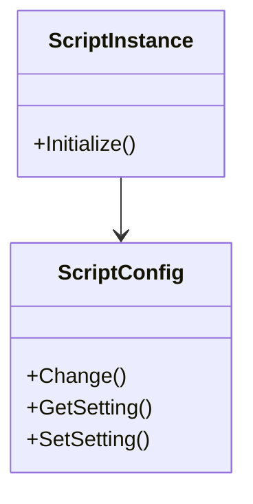

# Scripting Overview

Scripting in <SwmToken path="src/script/script_instance.cpp" pos="2:13:13" line-data=" * This file is part of OpenTTD.">`OpenTTD`</SwmToken> allows for the execution of custom scripts to enhance gameplay and automate tasks. Scripts can be categorized into local scripts and network scripts.

## Local Scripts

Local scripts, such as `autoexec.scr`, are executed at the start of the game. These scripts are useful for setting custom aliases and initializing game settings.

## Network Scripts

Network scripts are used to manage client-server interactions. For example, `on_client.scr` is executed when a client joins a server, and `on_server_connect.scr` is executed on the server when a client has joined. These scripts are useful for setting client optimization settings and server messages.

## Script Initialization

The <SwmToken path="src/script/script_instance.cpp" pos="70:2:2" line-data="void ScriptInstance::Initialize(const std::string &amp;main_script, const std::string &amp;instance_name, CompanyID company)">`ScriptInstance`</SwmToken> class is responsible for initializing and managing the lifecycle of scripts, including loading and executing them.

<SwmSnippet path="/src/script/script_instance.cpp" line="70">

---

The <SwmToken path="src/script/script_instance.cpp" pos="70:2:4" line-data="void ScriptInstance::Initialize(const std::string &amp;main_script, const std::string &amp;instance_name, CompanyID company)">`ScriptInstance::Initialize`</SwmToken> method initializes the script instance, registers API functions, and loads the script. This method ensures that the script is properly set up and ready for execution.

```c++
void ScriptInstance::Initialize(const std::string &main_script, const std::string &instance_name, CompanyID company)
{
	ScriptObject::ActiveInstance active(this);

	this->controller = new ScriptController(company);

	/* Register the API functions and classes */
	this->engine->SetGlobalPointer(this->engine);
	this->RegisterAPI();
	if (this->IsDead()) {
		/* Failed to register API; a message has already been logged. */
		return;
	}

	try {
		ScriptObject::SetAllowDoCommand(false);
		/* Load and execute the script for this script */
		if (main_script == "%_dummy") {
			this->LoadDummyScript();
		} else if (!this->engine->LoadScript(main_script) || this->engine->IsSuspended()) {
			if (this->engine->IsSuspended()) ScriptLog::Error("This script took too long to load script. AI is not started.");
```

---

</SwmSnippet>

## Script Configuration

The <SwmToken path="src/script/script_config.hpp" pos="49:2:2" line-data="class ScriptConfig {">`ScriptConfig`</SwmToken> class stores the configuration settings of each script, allowing for customization and management of <SwmToken path="src/script/script_config.hpp" pos="51:17:19" line-data="	/** List with name=&gt;value pairs of all script-specific settings */">`script-specific`</SwmToken> settings.

<SwmSnippet path="/src/script/script_config.hpp" line="46">

---

The <SwmToken path="src/script/script_config.hpp" pos="49:2:2" line-data="class ScriptConfig {">`ScriptConfig`</SwmToken> class defines the structure for storing script settings. It includes methods for creating and copying configuration settings, enabling scripts to be customized and managed effectively.

```c++
/**
 * Script settings.
 */
class ScriptConfig {
protected:
	/** List with name=>value pairs of all script-specific settings */
	typedef std::map<std::string, int> SettingValueList;

public:
	ScriptConfig() :
		version(-1),
		info(nullptr),
		to_load_data(nullptr)
	{}

	/**
	 * Create a new Script config that is a copy of an existing config.
	 * @param config The object to copy.
	 */
	ScriptConfig(const ScriptConfig *config);
```

---

</SwmSnippet>

## Scripting Endpoints

Scripting endpoints provide various methods for interacting with the game environment through scripts.

### ScriptNews::Create

The `ScriptNews::Create` method allows scripts to create news messages. This method is useful for generating in-game notifications for players.

<SwmSnippet path="/src/script/api/script_news.hpp" line="48">

---

The `ScriptNews::Create` method takes parameters such as the type of news, the text message, the company ID, and the type of game element being referenced. It returns true if the action succeeded.

```c++
	/**
	 * Create a news message for everybody, or for one company.
	 * @param type The type of the news.
	 * @param text The text message to show (can be either a raw string, or a ScriptText object).
	 * @param company The company, or COMPANY_INVALID for all companies.
	 * @param ref_type Type of referred game element.
	 * @param reference The referenced game element of \a ref_type.
	 *  - For #NR_NONE this parameter is ignored.
	 *  - For #NR_TILE this parameter should be a valid location (ScriptMap::IsValidTile).
	 *  - For #NR_STATION this parameter should be a valid stationID (ScriptStation::IsValidStation).
	 *  - For #NR_INDUSTRY this parameter should be a valid industryID (ScriptIndustry::IsValidIndustry).
	 *  - For #NR_TOWN this parameter should be a valid townID (ScriptTown::IsValidTown).
	 * @return True if the action succeeded.
	 * @pre type must be #NT_ECONOMY, #NT_SUBSIDIES, or #NT_GENERAL.
	 * @pre text != null.
	 * @pre company == COMPANY_INVALID || ResolveCompanyID(company) != COMPANY_INVALID.
	 * @pre The \a reference condition must be fulfilled.
	 * @pre ScriptCompanyMode::IsDeity().
	 */
```

---

</SwmSnippet>

### ScriptEngine::IsValidEngine

The `ScriptEngine::IsValidEngine` method checks whether a given engine type is valid. This method is essential for validating engine types before performing operations on them.

<SwmSnippet path="/src/script/api/script_engine.hpp" line="24">

---

The `ScriptEngine::IsValidEngine` method returns true if the engine type is valid for a company, meaning it has at least one vehicle of this engine or it is currently buildable.

```c++
	/**
	 * Checks whether the given engine type is valid.
	 * An engine is valid for a company if it has at least one vehicle of this engine or it's currently buildable.
	 * @game Outside ScriptCompanyMode scope (ScriptCompanyMode::IsDeity) the function reports all engines valid, which were or will be available at some point.
	 * @param engine_id The engine to check.
	 * @return True if and only if the engine type is valid.
	 */
	static bool IsValidEngine(EngineID engine_id);
```

---

</SwmSnippet>

&nbsp;

*This is an auto-generated document by Swimm AI 🌊 and has not yet been verified by a human*

<SwmMeta version="3.0.0" repo-id="Z2l0aHViJTNBJTNBT3BlblRURC1jb3BpbG90LWRlbW8lM0ElM0Fzd2ltbWlv" repo-name="OpenTTD-copilot-demo"><sup>Powered by [Swimm](/)</sup></SwmMeta>
